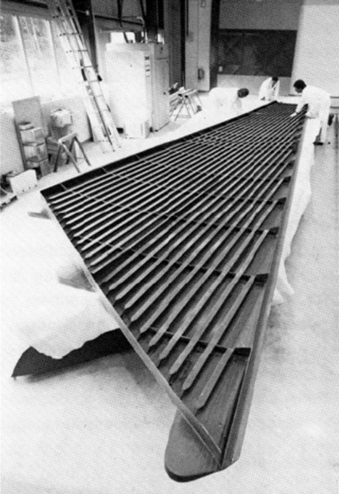
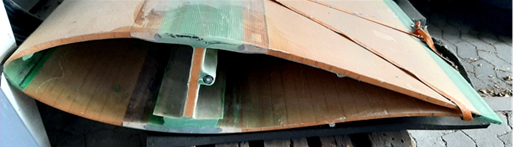

## Faserverbunde
Prof. Dr.-Ing.  Christian Willberg
Hochschule Magdeburg-Stendal

Kontakt: christian.willberg@h2.de

 
    <a href="https://doi.org/10.1007/s42102-021-00079-6" style="color: blue;">Bildreferenz</a>

---

<!--paginate: true-->

---

## Was ist ein Faserkunstoffverbund (FKV)

- Mehrphasen- oder Mischwerkstoff im Allgemeinen bestehend aus zwei Hauptkomponenten (Faser und Matrix)
- Der Gesamtwerkstoff hat höherwertige Eigenschaften als jede der beiden beteiligten Komponenten alleine
- Material und seine Eigenschaften entstehen in der Fertigung 

---

## Matrix – bindende Komponente 

---

## Faser – verstärkende Komponente

---

## Ausgangswerkstoffe - Faser

- Kurzfasern
  - Wirre Anordnung (geringe Anistropie)
  - Oft recyclete Fasern
- Langfasern
  - Mehrere Millimeter - einige Centimeter Länge
  - Geringere Anforderung bei Verarbeitung und Lagerung

---

## Ausgangswerkstoffe - Faser

- Endlosfasern
  - Hohe Festigkeiten und Steifigkeiten
  - Höhere Anforderung bei Verarbeitung und Lagerung

---

## Ausgangswerkstoffe - Faser

- Naturfasern: Haare, Wolle, Seide, Baumwolle, Flachs, Sisal, Hanf, Jute, Ramie, Bananenfasern ...
- Organische Fasern: Polyethylen (PE), Polypropylen (PP), Polyamid (PA), Polyester (PES), Polyacrylnitril (PAN), Aramid, Kohlenstoff ...
- Anorganische Fasern: Glas, Basalt, Quarz, SiC, Al2O3, Bor, ...
- Metallfasern aus: Stahl, Aluminium, Kupfer, Nickel, Beryllium, Wolfram ... 

---

## Ausgangswerkstoffe FKV - Matrix

**Duroplastische Reaktionsharze**
- Epoxidharze, Phenolharze, Polyesterharze, Vinylesterharze, …
- Werden mit Reaktionsmittel für die Aushärtung gemischt
- Vorimprägnierte Fasern -> Prepregs
- Exotherm und volumenändernd beim Aushärten
**Thermoplaste**
- Polypropylen, Polyamid, Polyarylensulfide, …
- Schmelzen bei einer bestimmten Temperatur (55 °C – 155 °C)
- Teuer aber Recyclebar
- Schwieriger zu handhaben

---

## Glasfaser - FKV

**Vorteile**

die gute chemische und mikrobiologische Widerstandsfähigkeit. 
Kosten
**Nachteile**
der für viele Strukturbauteile zu niedrige Elastizitätsmodul der Glasfaser
Glasfasern sind unverrottbar (Vor- und Nachteil)

---

## Kohlefaser (C-Faser)

**Vorteil**
C-Fasern sind sehr leicht, ihre Dichte ($\rho_𝑓 \approx 1.8 g/cm^3$) liegt deutlich unter derjenigen von Glasfasern ($\rho_𝑓 \approx 2.54 g/cm^3$). 
extrem hohe Festigkeiten und sehr hohe Elastizitätsmoduln
beide mechanischen Größen sind zudem in weiten Bereichen bei der Herstellung der Fasern einstellbar
Exzellente Ermüdungsfestigkeit

---

**Nachteile**
Geringere Druckfestigkeit in Faserrichtung
Schlechtere Drapierbarkeit
Kosten
Elastizitätsmoduln in Faserlängs- und Querrichtung unterscheiden sich um eine Größenordnung (Vor- und Nachteil)

---

---

## Verbund schematisch
**Symmetrien**
- Transversale Isotropie (Eigenschaften in 2 und 3 Richtung sind gleich)
- Orthotropie
- Anisotropie
**Faservolumenanteil $𝜑$**
Errechnet sich aus Mischungsregel
$𝜌= 𝜑𝜌_𝑓+(1- 𝜑) 𝜌_𝑚$
Steifigkeiten und Festigkeiten

---

---

## Fertigung
Wahl des Verfahrens hängt ab von
- Der konkreten Anwendung
- Einsatzbedingungen
- Grundmaterial (Faser, Matrix)
- Stückzahl
- Kosten
- Betriebsicherheit
- …

---

## Fertigung - Verfahrensschritte
- Erstellen von Formwerkzeugen
- Zuschnitt und Ablage von Vorprodukten
- Aushärtung des Harzsystems
- Nachbearbeitung des Bauteils

---

## Formwerkzeug / Faserablage

- Gips
- Kunststoff
- Metallen
- Faserverbunden
- Thermaldehnung sollte kompatibel

---
## Halbzeuge

- Handhabbarkeit
- Verringerung der Fertigungstiefe
- Erhöhung der Qualität
- Beispiele:
  - Gewebe
  - Gelege
  - Fliese, Matten
  - Kernmaterialien
  - Flechtschläuche
  - …

---

## Fertigung
Manuell
Faserablage
Handlaminieren
…
Wickeln
Spritzverfahren
Pultrusion
Pressen
RTM (Resin Transfer Moulding) Verfahren
Automatisierte Faserablageverfahren
…

---

## Fertigung
Manuell
Faserablage
Handlaminieren
…

---

## Fertigung
Manuell
Faserablage
Handlaminieren
Wickeln
Spritzverfahren
Pultrusion
Pressen
...

---

## Fertigung

Manuell
Faserablage
Handlaminieren
Wickeln
Spritzverfahren
Pultrusion
Pressen
RTM (Resin Transfer Moulding) Verfahren
...

---

## Fertigung
Manuell
Faserablage
Handlaminieren
Wickeln
Spritzverfahren
Pultrusion
Pressen
RTM (Resin Transfer Moulding) Verfahren
Automatisierte Faserablageverfahren
…

---

# Grundlagen für den Einsatz
- Integralbauweise
- Differentialbauweise
- Verbundbauweise

---
# Designphilosophien
- Möglichst auf Zug belasten
- geometrische Steifigkeiten ausnutzen (Steiner Anteil)
- Schlageschäden vermeiden
- Kleben statt bohren
- ...
---
# Vorteile
- Lastpfadgerechte Bauteile
- sehr leichte Bauteile
# Nachteile
- Durchsatz in der Fertigung gering
- kein Schweißen oder Umformen möglich
- keine plastische Zone $\rightarrow$ schlechtes Crashverhalten