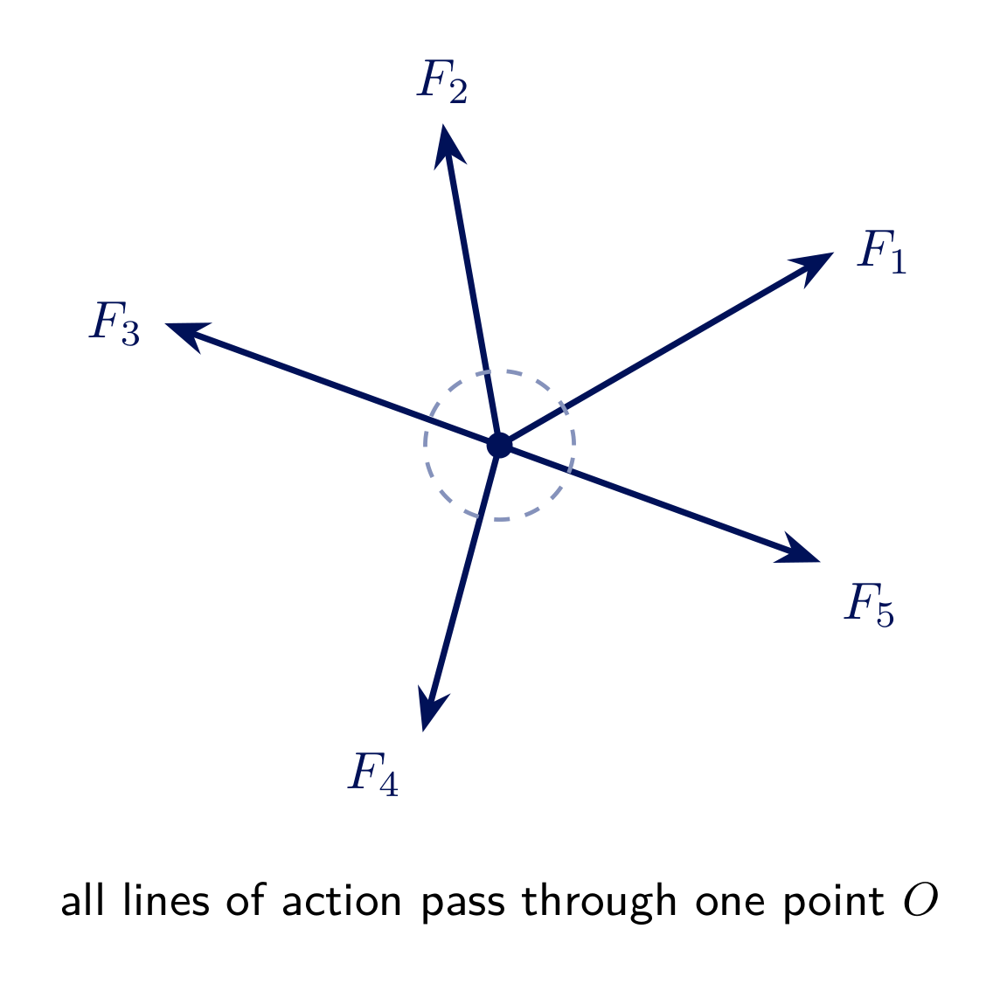
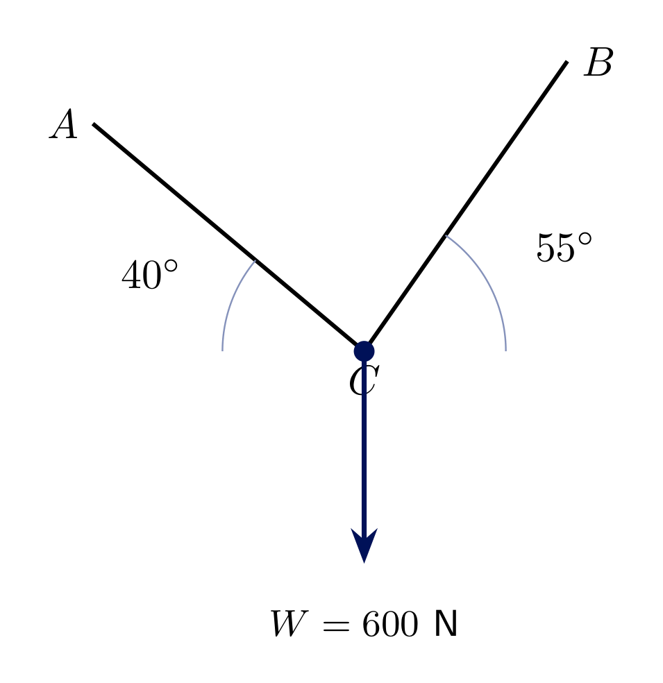
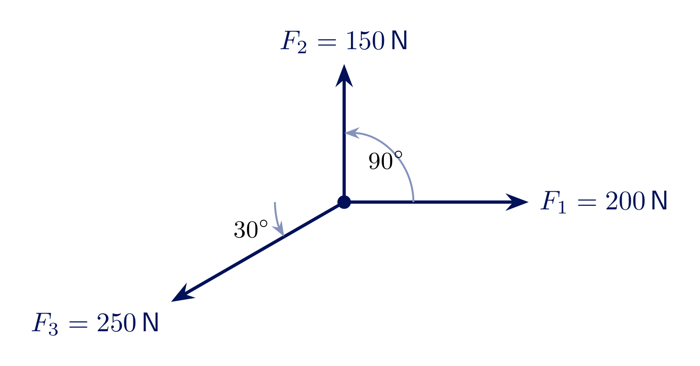
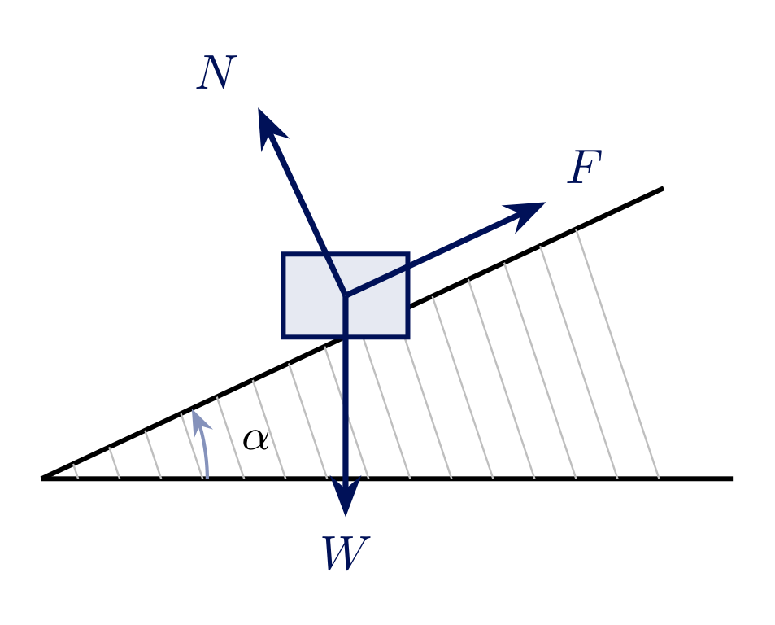
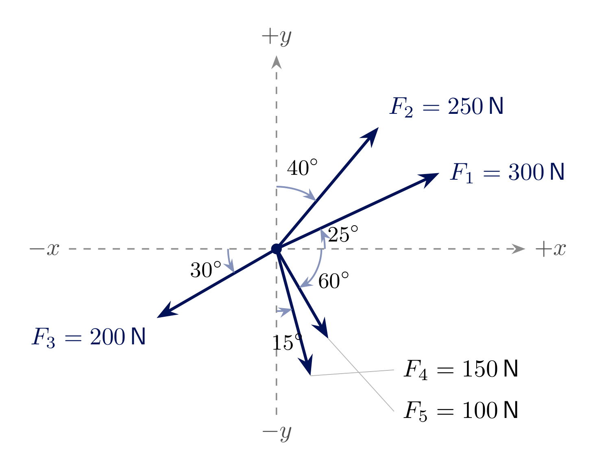

<!-- _class: lead -->
# Concurrent Force System
## Engineering Mechanics - Seminar 1
Prof. Dr.-Ing. Christian Willberg
Hochschule Magdeburg-Stendal

---

## Overview

- What is a concurrent (central) force system?
- Equilibrium of a particle: $\sum F_x = 0$, $\sum F_y = 0$
- Four worked examples: cable/ring problem, resultant of three forces, block on an incline (general angle $\alpha$), resultant of five forces given from mixed reference axes

---

# Theory

---

## Newton's Second Law

$$\vec{F} = m\,\vec{a}$$

Statics is the special case of dynamics where the acceleration is zero:

$$\vec{a} = 0 \quad\Rightarrow\quad \sum \vec{F} = m\vec{a} = \vec{0} \quad\Rightarrow\quad \boxed{\sum \vec{F} = 0}$$

**Equilibrium is not a separate law - it is Newton's second law for $\vec a = 0$.** Every equilibrium equation used in this seminar comes directly from $\sum F_x = 0$, $\sum F_y = 0$.

---

## Concurrent force systems

A force system is **concurrent** (or *central*) if the lines of action of all forces pass through a **single point**.

- No moment equation is needed - all forces act through the same point
- The body can be idealized as a **particle**
- Equilibrium requires only the two force-balance equations (2D):

$$\sum F_x = 0 \qquad \sum F_y = 0$$

---

## Two solution methods

<!-- _class: cols-2 -->

**Angle / trigonometric method**

1. Draw a free-body diagram with all angles
2. Resolve each force:
$$F_x = F\cos\theta,\quad F_y = F\sin\theta$$
3. Apply $\sum F_x = 0$, $\sum F_y = 0$
4. Solve for the unknowns

*Used throughout this seminar*

**Vector method**

1. Write each force as a vector:
$$\vec{F} = \begin{bmatrix} F_x \\ F_y \end{bmatrix}$$
2. Sum the vectors directly:
$$\sum \vec{F} = \vec{0}$$
3. Splits into the same two component equations
4. Preferred for 3D problems and matrix/computational solutions

---

## Solution strategy

1. Identify the point through which all forces act
2. Draw a **free-body diagram** - every force, with its correct direction and angle
3. Choose $x$-$y$ axes (usually horizontal/vertical)
4. Resolve every force into $x$- and $y$-components (angle **or** vector method)
5. Apply $\sum F_x = 0$ and $\sum F_y = 0$
6. Solve the resulting (at most 2×2) system of equations

---

## Exercise  - Ring held by two cables

A small ring $C$ is held in equilibrium by two cables $AC$ and $BC$ and carries a weight $W = 600\ \text{N}$ hanging from it. Cable $AC$ makes $40^\circ$ with the horizontal, cable $BC$ makes $55^\circ$ with the horizontal.

**Find** the cable tensions $T_{AC}$ and $T_{BC}$.

---

## Solution 1.1

Free-body diagram at $C$: $T_{AC}$ (up-left, $40^\circ$), $T_{BC}$ (up-right, $55^\circ$), and $W$ (down).

$$\sum F_x = -T_{AC}\cos40^\circ + T_{BC}\cos55^\circ = 0$$
$$\sum F_y = T_{AC}\sin40^\circ + T_{BC}\sin55^\circ - W = 0$$

From the first equation: $T_{AC} = T_{BC}\dfrac{\cos55^\circ}{\cos40^\circ} = 0.7488\,T_{BC}$

Substituting into the second equation:

$$T_{BC}\left(0.7488\sin40^\circ + \sin55^\circ\right) = 600\ \text{N}$$
$$T_{BC}\cdot 1.3005 = 600\ \text{N} \quad\Rightarrow\quad \boxed{T_{BC} \approx 461.4\ \text{N}}$$
$$\boxed{T_{AC} \approx 345.5\ \text{N}}$$

---

## Exercise 1.2 - Three-force resultant

Three forces act at a point $O$: $F_1 = 200\ \text{N}$ along $0^\circ$, $F_2 = 150\ \text{N}$ along $90^\circ$, and $F_3 = 250\ \text{N}$ along $210^\circ$ (measured from the positive $x$-axis).

**Find** the resultant $R$ (magnitude and direction) and state the **equilibrant** that would keep the point in equilibrium.

---

## Solution 1.2

Resolve each force into components:

$$F_1 = (200,\ 0)\ \text{N}, \quad F_2 = (0,\ 150)\ \text{N}$$
$$F_3 = (250\cos210^\circ,\ 250\sin210^\circ) = (-216.5,\ -125.0)\ \text{N}$$

Sum the components:

$$\sum F_x = 200 + 0 - 216.5 = -16.5\ \text{N} \qquad \sum F_y = 0 + 150 - 125.0 = 25.0\ \text{N}$$

$$R = \sqrt{(-16.5)^2 + 25.0^2} \approx \boxed{30.0\ \text{N}}$$
$$\theta = 180^\circ - \arctan\!\left(\frac{25.0}{16.5}\right) \approx \boxed{123.4^\circ}$$

**Equilibrant:** $30.0\ \text{N}$ at $123.4^\circ - 180^\circ = -56.6^\circ$ (opposite to $R$)

---

## Exercise 1.3 - Block on an incline

A block of weight $W$ rests on a **frictionless** incline of angle $\alpha$ (measured from the horizontal). It is held in place by a force $F$ applied **parallel to the incline**.

---

**a)** Determine the resultant of the weight's component acting along the incline (the "driving" force down the slope).
**b)** Determine the holding force $F$ required for equilibrium.
**c)** Evaluate $F$ for $\alpha = 90^\circ$ and $\alpha = 0^\circ$ and interpret both results physically.

---

## Solution 1.3

Three concurrent forces act on the block: $W$ (down), $N$ (perpendicular to the incline), $F$ (parallel to the incline, up-slope). Resolve along the incline ($\xi$, up-slope positive) and perpendicular to it ($\eta$).

**a)** Component of $W$ along the incline (the resultant driving force):

$$R_\xi = W\sin\alpha \quad \text{(directed down the slope)}$$

**b)** Equilibrium along the incline:

$$\sum F_\xi = F - W\sin\alpha = 0 \quad\Rightarrow\quad \boxed{F = W\sin\alpha}$$

---

**c)** Limiting cases:

$$\alpha = 90^\circ:\quad F = W\sin90^\circ = W = mg$$
The incline is vertical - the block hangs freely, so the **entire weight** must be supported. ✓

$$\alpha = 0^\circ:\quad F = W\sin0^\circ = 0$$
The incline is flat ground - gravity has **no component** along a horizontal surface, so no holding force is needed. ✓

---

### Exercise 1.4 - Mixed reference axes

| Force | Angle given |
|:---|:---|
| $F_1 = 300\,\text{N}$ | $25^\circ$ above $+x$ |
| $F_2 = 250\,\text{N}$ | $40^\circ$ from $+y$ |
| $F_3 = 200\,\text{N}$ | $30^\circ$ below $-x$ |
| $F_4 = 150\,\text{N}$ | $15^\circ$ from $-y$ |
| $F_5 = 100\,\text{N}$ | $60^\circ$ below $+x$ |

**Find** the resultant $R$ (see figure for the exact side of each axis).

---

## Solution 1.4 (1/2) - convert every angle to the same reference

The first (and most important) step: convert **every** angle to the standard convention (measured counterclockwise from $+x$) before resolving anything.

| Force | Given angle | Standard angle |
|:---|:---|:---|
| $F_1$ | $25^\circ$ above $+x$ | $25^\circ$ |
| $F_2$ | $40^\circ$ from $+y$, toward $+x$ | $90^\circ - 40^\circ = 50^\circ$ |
| $F_3$ | $30^\circ$ below $-x$ | $180^\circ + 30^\circ = 210^\circ$ |
| $F_4$ | $15^\circ$ from $-y$, toward $+x$ | $270^\circ + 15^\circ = 285^\circ$ |
| $F_5$ | $60^\circ$ below $+x$ | $360^\circ - 60^\circ = 300^\circ$ |

---

## Solution 1.4 (2/2) - resolve and sum

$$F_1=(271.9,\ 126.8),\ F_2=(160.7,\ 191.5),\ F_3=(-173.2,\ -100.0)$$
$$F_4=(38.8,\ -144.9),\ F_5=(50.0,\ -86.6)\quad[\text{N}]$$

$$\sum F_x = 271.9+160.7-173.2+38.8+50.0 = 348.2\ \text{N}$$
$$\sum F_y = 126.8+191.5-100.0-144.9-86.6 = -13.2\ \text{N}$$

$$R = \sqrt{348.2^2 + 13.2^2} \approx \boxed{348.5\ \text{N}}$$
$$\theta = \arctan\!\left(\frac{-13.2}{348.2}\right) \approx \boxed{-2.2^\circ}$$

The five forces nearly cancel in the $y$-direction - the resultant points almost exactly along $+x$.

---

<!-- _class: lead -->
# Questions?

Prof. Dr.-Ing. Christian Willberg
christian.willberg@h2.de
Office: Building 10, Room 2.09
