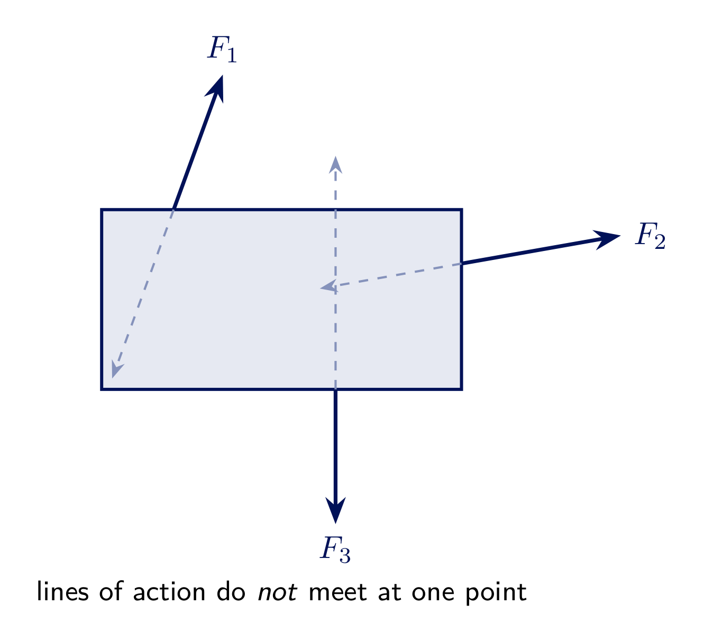
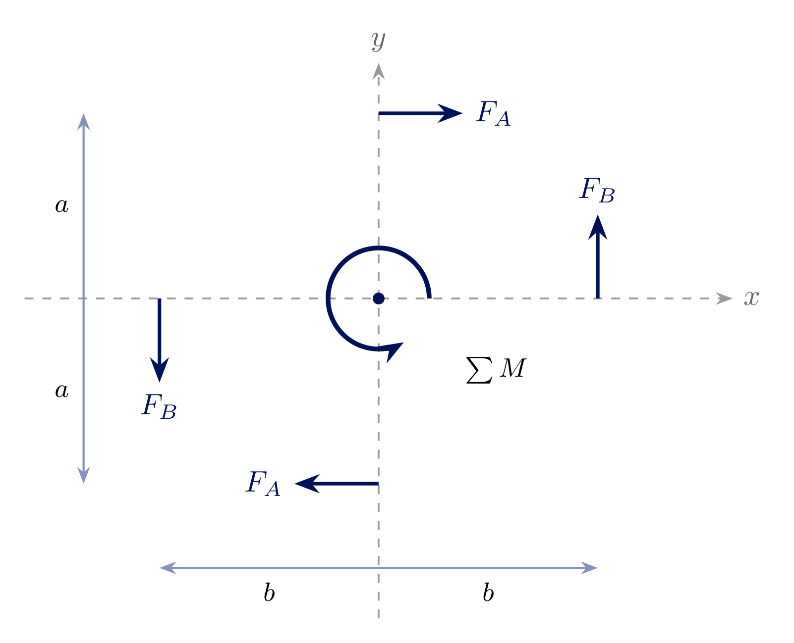
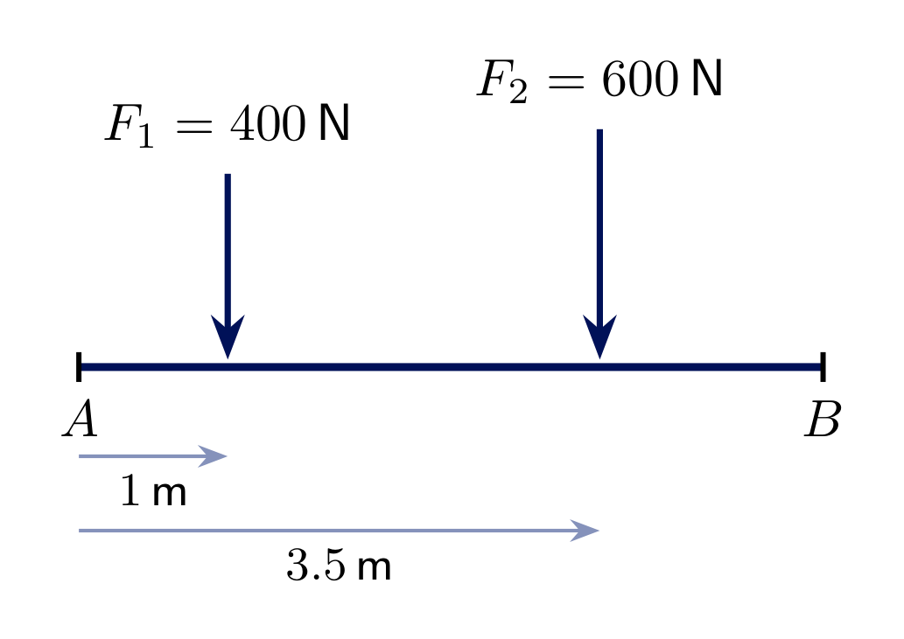
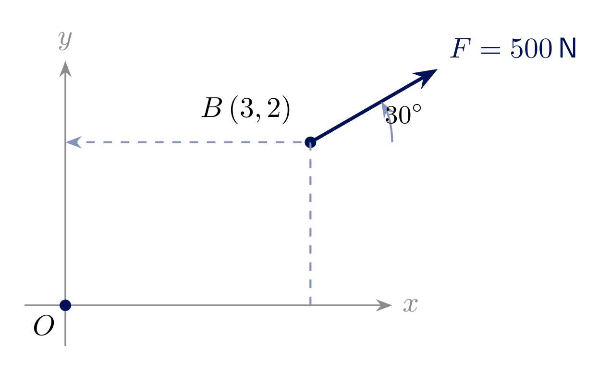
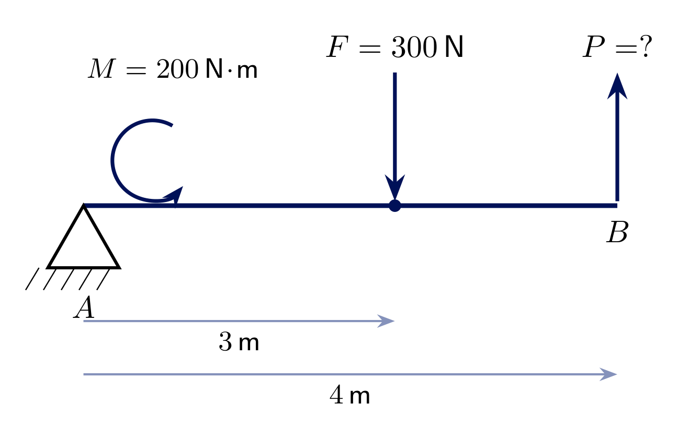
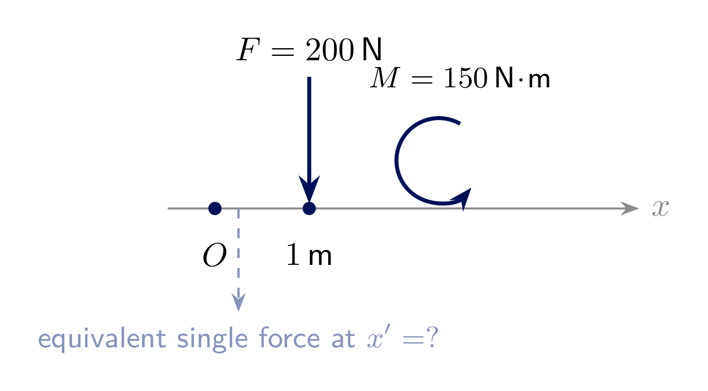

<!-- _class: lead -->
# General Force System
## Engineering Mechanics - Seminar 2
Prof. Dr.-Ing. Christian Willberg
Hochschule Magdeburg-Stendal

---

## Overview

- Recap: Seminar 1 handled forces through one point - now the lines of action are **general**
- The moment of a force, and the rotational form of Newton's second law
- Equilibrium of a rigid body: $\sum F_x=0$, $\sum F_y=0$, $\sum M=0$
- Four worked examples: resultant of parallel forces, force-couple equivalence, equilibrium with a pin and an applied couple, reducing a force+couple to a single force

---

# Theory

---

## Rotational Newton's Law

$$\sum M = I\alpha$$

Just as $\sum F=0$ is Newton's second law for $\vec a=0$, the **rotational** equivalent gives us the moment equation:

$$\alpha = 0 \quad\Rightarrow\quad \sum M = I\alpha = 0 \quad\Rightarrow\quad \boxed{\sum M = 0}$$

Together, $\sum F_x=0$, $\sum F_y=0$, and $\sum M=0$ are the **three** equilibrium equations of a rigid body in 2D.

---

## General force systems

A force system is **general** if the lines of action do **not** all pass through one point.

- The body can no longer be treated as a particle - it is a **rigid body**
- Forces can now produce a **rotational** effect (a moment), not just translation
- Equilibrium needs a third equation: $\sum M = 0$ (about *any* point)

---

## Two ways to compute a moment

<!-- _class: cols-2 -->

**Scalar method**

$$M = F \cdot d$$

- $d$ = perpendicular distance from the point to the force's line of action
- Sign by inspection (CCW positive here)
- Fast when $d$ is easy to see

**Vector method**

$$M_O = \vec r \times \vec F = x F_y - y F_x$$

- $\vec r$ = position vector from the point to any point on the line of action
- Works directly from coordinates - no need to find $d$ geometrically
- Preferred for offset/angled forces (see Exercise 2.2)

---

## Equilibrium equations

$$\sum F_x = 0 \qquad \sum F_y = 0 \qquad \sum M_{(\text{any point})} = 0$$

- Three independent equations $\Rightarrow$ up to **three unknowns**
- The moment may be summed about **any** point - choosing a point where an unknown force acts makes that force drop out of the moment equation
- Good strategy: take moments about a support/pin to solve for the *other* unknowns first

---

## Adding two couples - signs

Two couples act about the origin: $F_A=100\ \text{N}$ at $a=0.5\ \text{m}$ above/below center (pointing right/left), and $F_B=150\ \text{N}$ at $b=0.4\ \text{m}$ left/right of center (pointing up/down).

Each couple's moment is **independent of the reference point** - only its magnitude, distance, and sense of rotation matter:

$$M_A = -F_A\cdot(2a) = -100\cdot1.0 = -100\ \text{N}\!\cdot\!\text{m} \ \text{(CW, negative)}$$
$$M_B = +F_B\cdot(2b) = 150\cdot0.8 = +120\ \text{N}\!\cdot\!\text{m} \ \text{(CCW, positive)}$$
$$\sum M = M_A + M_B = \boxed{+20\ \text{N}\!\cdot\!\text{m}} \ \text{(net CCW)}$$

---

# Exercise 2.1
## Resultant of two parallel forces

A horizontal beam $AB$ carries two downward forces: $F_1=400\ \text{N}$ at $1\ \text{m}$ from $A$, and $F_2=600\ \text{N}$ at $3.5\ \text{m}$ from $A$.

**Find** the resultant $R$ and the position $\bar{x}$ (from $A$) where a single equivalent force would act.

---

## Solution 2.1

**Resultant force:**

$$R = F_1 + F_2 = 400 + 600 = \boxed{1000\ \text{N}} \ \text{(downward)}$$

**Location** - take moments about $A$; the single resultant $R$ at $\bar x$ must produce the same moment as the two original forces:

$$R\cdot\bar{x} = F_1\cdot 1 + F_2\cdot 3.5$$
$$1000\cdot\bar{x} = 400\cdot1 + 600\cdot3.5 = 400+2100 = 2500$$
$$\boxed{\bar{x} = 2.5\ \text{m from } A}$$

---

# Exercise 2.2
## Force-couple equivalent

A force $F=500\ \text{N}$ acts at point $B=(3,2)\ \text{m}$, directed $30^\circ$ above the horizontal.

**Find** the equivalent force-couple system at the origin $O$ (i.e. the same force $F$ acting at $O$, plus a couple $M_O$).

---

## Solution 2.2

Resolve $F$ into components (unchanged by moving it - only the couple depends on the move):

$$F_x = 500\cos30^\circ \approx 433.0\ \text{N}, \qquad F_y = 500\sin30^\circ = 250.0\ \text{N}$$

Moment of $F$ about $O$ (vector method, $\vec r = (3,2)$):

$$M_O = xF_y - yF_x = 3\cdot250.0 - 2\cdot433.0 = 750 - 866.0 \approx \boxed{-116.0\ \text{N}\!\cdot\!\text{m}}$$

The equivalent system at $O$: the same force $F=500\ \text{N}$ at $30^\circ$, **plus** a clockwise couple of $116.0\ \text{N}\!\cdot\!\text{m}$.

---

# Exercise 2.3
## Bar with a pin, a force, and a couple

A rigid bar $AB$ (length $4\ \text{m}$) is pinned at $A$. A downward force $F=300\ \text{N}$ acts $3\ \text{m}$ from $A$, and an applied couple $M=200\ \text{N}\!\cdot\!\text{m}$ (counterclockwise) acts on the bar.

**Find** the vertical force $P$ at $B$ required for equilibrium, and the pin reaction at $A$.

---

## Solution 2.3

Take moments about $A$ (this eliminates the unknown pin reaction):

$$\sum M_A = -F\cdot3 + M + P\cdot4 = 0$$
$$-300\cdot3 + 200 + 4P = 0 \quad\Rightarrow\quad 4P = 700 \quad\Rightarrow\quad \boxed{P = 175\ \text{N}}$$

Now the force equations give the pin reaction:

$$\sum F_x = 0 \quad\Rightarrow\quad \boxed{A_x = 0}$$
$$\sum F_y = A_y + P - F = 0 \quad\Rightarrow\quad A_y = 300 - 175 = \boxed{125\ \text{N}}$$

---

# Exercise 2.4
## Reducing a force and a couple to a single force

A force $F=200\ \text{N}$ acts downward at $x=1\ \text{m}$ from $O$. A couple $M=150\ \text{N}\!\cdot\!\text{m}$ (counterclockwise) also acts on the body.

**Find** the position $x'$ of a **single** downward force of $200\ \text{N}$ (no separate couple) that has the same effect as the original force-couple system.

---

## Solution 2.4

Total moment of the original system about $O$:

$$M_{O,\text{total}} = -F\cdot1 + M = -200 + 150 = -50\ \text{N}\!\cdot\!\text{m}$$

A single downward force $F$ at the unknown position $x'$ must produce the **same** moment about $O$:

$$-F\cdot x' = -50 \quad\Rightarrow\quad x' = \frac{50}{200}$$
$$\boxed{x' = 0.25\ \text{m from } O}$$

The single equivalent force is **closer to $O$** than the original force - the counterclockwise couple partially cancels the original force's clockwise moment.

---

<!-- _class: lead -->
# Questions?

Prof. Dr.-Ing. Christian Willberg
christian.willberg@h2.de
Office: Building 10, Room 2.09
