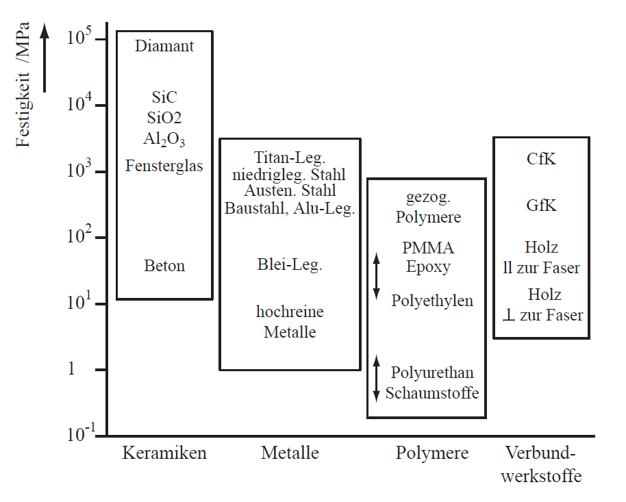
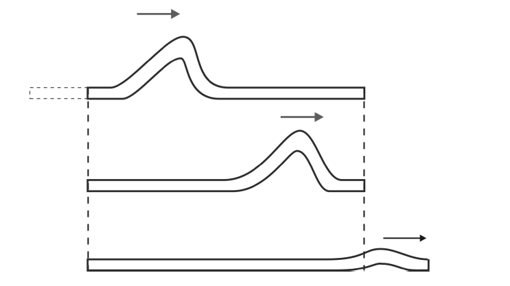
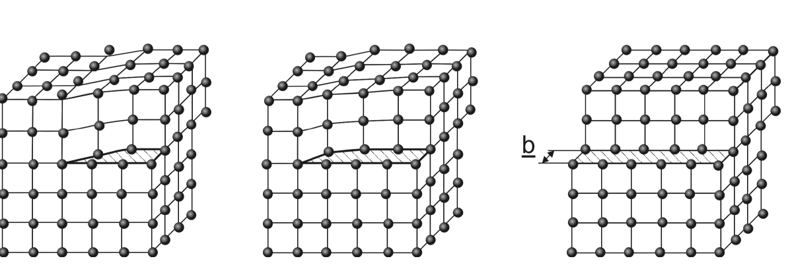
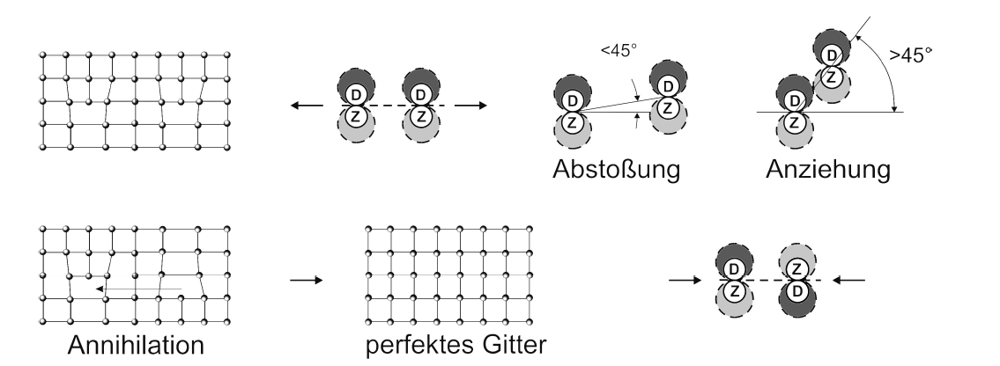
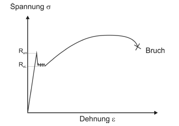

# Fracture & Fatigue - Strength and Plasticity
Prof. Dr.-Ing. Christian Willberg

 

Contact: christian.willberg@h2.de

---

# Learning Objectives

- Understand the concept of **ideal strength** and explain the deviation from real strength
- Understand why ceramics are **brittle** and metals are **ductile**
- Describe the structure and mechanism of **dislocations** in crystals
- Physically understand the **Burgers vector** and apply it to crystal structures
- Know and compare different **strengthening mechanisms** in metals

---

# Ideal Strength

## Thought Experiment

Under increasing tensile stress, atomic bonds become progressively more loaded.
The restoring force is maximum at approximately **1.25 times the equilibrium spacing**.

$$\sigma_{\text{ideal}} \approx \frac{E}{4} \quad \text{(simple estimate: } \varepsilon \approx 0{.}25\text{)}$$

$$\sigma_{\text{ideal}} \approx \frac{E}{10} \quad \text{(precise calculation with real atomic potentials)}$$

 
    Images from the Materials Science lecture notes, TU Braunschweig

---

# Ideal vs. Real Strength

| Material | $E$ / MPa | Expected ($E/10$) | Real |
|---|---|---|---|
| Deep-drawing steel | 200 000 | 20 000 MPa | ~300 MPa |
| High-strength steel | 200 000 | 20 000 MPa | ~2 000 MPa |
| Zirconia (compression) | 200 000 | 20 000 MPa | 4 000 MPa |

---

- Metals reach fracture elongations of up to 25 % — but through **plastic**, not elastic deformation
- Ceramics fracture at ~0.5 % strain instead of the expected 25 %
- Polymers also fail to reach their theoretical strength

The key flawed assumption: all bonds fail **simultaneously**. This is not the case.

 
    Images from the Materials Science lecture notes, TU Braunschweig

---

## Why Is Ideal Strength Not Reached?

- In **glass** or **ceramics**: due to micro-notches
- In **polymers**: a short chain segment shifts first → shift propagates → only a few bonds broken simultaneously → $R_m \ll \sigma_\text{ideal}$
- In **metals**: analogous mechanism via **dislocations**

**Analogy:** A large carpet is not moved as a whole, but by pushing a local fold through it. Only locally are "bonds" (friction) released — the force required is minimal.

- The shift is **permanent** (plastic) — the carpet does not return upon unloading
- Plastic deformation therefore begins well below $\sigma_\text{ideal}$

---

## Ceramics — Why Brittle?

### ① Large Burgers Vector
- Complex crystal structure → larger $\vec{b}$
- Line tension $T \propto b^2$ significantly higher
- Greater forces needed → dislocations practically **immobile** at room temperature

### ② Covalent Bond Character
- Covalent bonds are **directional**
- Dislocation motion would break bond angles
- → additional energy barrier

---

### Consequence
- No plastic deformation possible
- Failure is **elastic-brittle**
- Fracture elongation ~0.5 % instead of 25 %

### Why Compressive Strength > Tensile Strength?
- Under **compression**: cracks are closed
- Under **tension**: micro-cracks and pores act as notches → stress concentration → crack opening → fracture at low stresses

### Theoretical Strength Is Not Reached Either
But **not** due to dislocations — but due to **micro-cracks and pores**.

---

# Example: Strength of Glass Fibres

- Micro-notches reduce strength
- Probability of occurrence increases with diameter
- Convergence toward a limiting value as there is "enough" material to compensate for the effects

 
    Images from H. Schürrmann "Konstruieren mit Faser-Kunststoff-Verbunden"

---

# Dislocations in Crystals

## Edge Dislocation

Crystals are rarely perfect. During solidification, **inserted half-planes** form → **edge dislocations**.

- Extra atomic plane terminates abruptly → **dislocation line**
- At the half-plane: atoms compressed → **compressive stresses**
- Where half-plane is absent: atoms stretched → **tensile stresses**
- Dislocation surrounded by a **strain field** → raises crystal energy

The dislocation is the heart of the "carpet trick" in metals: plastic deformation at stresses far below $\sigma_\text{ideal}$ — because only **at the dislocation** are bonds simultaneously broken.

---

# Motion of an Edge Dislocation

Applied shear stress $\tau$ → dislocation glides through the crystal → upper half shifts by $\vec{b}$ relative to the lower half.

- Only **at the dislocation location** are bonds simultaneously broken and reformed
- Repeated motion → entire crystal half glides off
- Deformation is **plastic** — dislocations do not move back upon unloading

Plastic deformation occurs at $\tau \ll E/10$ — because only **local bonds** need to be broken.

---

 
    Images from the Materials Science lecture notes, TU Braunschweig

---

 
    Images from the Materials Science lecture notes, TU Braunschweig

---

# The Burgers Vector — Determination

---

## Burgers Circuit

1. Choose a **starting point** far from the dislocation
2. Take **equal numbers of steps** in each direction (e.g. 5 right, 5 up, 5 left, 5 down)
3. In a **perfect crystal** the loop closes
4. Around the **dislocation** the loop does **not** close
5. Closing vector = $\vec{b}$

 
    Images from the Materials Science lecture notes, TU Braunschweig

---

$\vec{b}$ indicates the direction and magnitude of the **displacement** that a dislocation produces as it passes through the crystal.
Characteristic of edge dislocations: $\vec{b} \perp$ dislocation line.

 
    Images from the Materials Science lecture notes, TU Braunschweig

---

# The Burgers Vector — Physical Meaning

### Physical Significance
- $|\vec{b}|$ = displacement per dislocation pass
- Line tension: $T \approx \dfrac{G \cdot b^2}{2}$
- Force on dislocation: $F = \tau \cdot l \cdot b$
- Smaller $b$ → lower energy → **energetically favored**

### Direction
- **Edge dislocation**: $\vec{b} \perp$ dislocation line
- **Screw dislocation**: $\vec{b} \parallel$ dislocation line
- **Mixed dislocation**: angle in between

---

### Why Is $\vec{b}$ Minimal?
$\vec{b}$ must be a **lattice translation vector** — only then does an identical lattice remain after the shift.

| Lattice | Favoured $\vec{b}$ | Length | Slip plane |
|---|---|---|---|
| FCC | $\frac{a}{2}[1\bar{1}0]$ | $\frac{a}{\sqrt{2}}$ | $\{111\}$ |
| BCC | $\frac{a}{2}[111]$ | $\frac{a\sqrt{3}}{2}$ | $\{110\}$ |

Why not $\vec{b} = a[100]$? → Valid, but $T \propto b^2$ → **4× higher energy**

---

# The Burgers Vector — Examples

| Metal | Structure | $a$ / nm | $|\vec{b}|$ exp. / nm | Calculated |
|---|---|---|---|---|
| Fe | BCC | 0.287 | 0.248 | $\frac{0{.}287\cdot\sqrt{3}}{2} = 0{.}249$ |
| W  | BCC | 0.317 | 0.274 | $\frac{0{.}317\cdot\sqrt{3}}{2} = 0{.}275$ |
| Al | FCC | 0.405 | 0.286 | $\frac{0{.}405}{\sqrt{2}} = 0{.}286$ |
| Ni | FCC | 0.352 | 0.248 | $\frac{0{.}352}{\sqrt{2}} = 0{.}249$ |

Experimental values confirm the theoretical formulas exactly — $\vec{b}$ is the **shortest translation vector** of the respective lattice.

---

# Line Tension of a Dislocation

A dislocation creates a local **strain field** → raises crystal energy. The energy stored per unit length = **line tension $T$**:

$$T \approx \frac{G \cdot b^2}{2}$$

**Derivation:** Atomic displacement $\propto b$, force for displacement $\propto G \cdot b$ → stored energy $\propto G \cdot b^2$.

**Consequences:**
- Energy is needed to **lengthen** a dislocation (e.g. by bowing)
- $b$ should be as **small as possible** → energetically most favourable translation vector
- Basis for the **Orowan mechanism**

---

## Edge vs. Screw Dislocation

### Edge Dislocation
- $\vec{b} \perp$ dislocation line
- Inserted half-plane perpendicular to the displacement direction

### Screw Dislocation
- $\vec{b} \parallel$ dislocation line
- Planes are offset like a **spiral staircase**

A **curved dislocation** can have pure edge character at one end and pure screw character at the other — mixed character in between.

---

 
    Images from the Materials Science lecture notes, TU Braunschweig

---

## Interaction Between Dislocations

Dislocations distort the lattice → each dislocation is surrounded by a **stress field** → dislocations exert forces on one another.

### Same Sign
- Half-planes in the **same direction**
- Compressive fields overlap → **repulsion**

### Opposite Sign
- Tensile and compressive field → **attraction**
- On the same slip plane: **annihilation**

---

 
    Images from the Materials Science lecture notes, TU Braunschweig

---

# Dislocation Multiplication — Frank-Read Source

Starting point: dislocation **pinned** at both ends.

1. Shear stress $\tau$ → dislocation **bows out**
2. Development of a kidney-shaped dislocation loop
3. Segments $m$ and $n$ attract → **annihilation**
4. Expanding **dislocation ring** + regenerated original dislocation
5. Process repeats → continuous **dislocation production**

Dislocation density rises from $10^{10}$–$10^{12}\,\text{m}^{-2}$ (annealed) to up to $10^{16}\,\text{m}^{-2}$ after cold working — a factor of $\mathbf{10^4}$!

---

# Force on a Dislocation

Crystal of width $w$, length $l$. External shear stress $\tau$ does work when slipping by $\vec{b}$:

$$W_\text{ext} = \tau \cdot w \cdot l \cdot b$$

Dislocation movement of length $l$ over distance $w$, force $F$:

$$W_\text{disl} = F \cdot w$$

Setting equal:

$$F = \tau \cdot l \cdot b$$

→ Larger stress or larger Burgers vector = **more driving force** for dislocation motion.

---

# Strengthening Mechanisms — Overview

**Basic principle:** Plastic deformation = dislocation motion.
Strengthening = **impeding dislocation motion**.

Flow resistance of pure metals: ~1–10 MPa. All mechanisms below raise this value.

| Mechanism | Equation | Typical $\Delta\sigma$ (Al) | Fracture elongation |
|---|---|---|---|
| Solid solution hardening | $\Delta\sigma \propto \sqrt{c}$ | up to 100 MPa | ↓ |
| Precipitation hardening | Cutting / Orowan | 200–400 MPa | ↓ |
| Grain refinement | $\Delta\sigma \propto 1/\sqrt{d}$ | 20–50 MPa | **↑** |
| Work hardening | $\Delta\sigma \propto \sqrt{\rho}$ | variable | ↓ |

---

# Solid Solution Hardening — Principle

Foreign atoms dissolve in the host lattice → local **strain field** → dislocation must overcome this field → higher flow stress.

$$\Delta\sigma_{\text{s.s.}} = \text{const} \cdot \sqrt{c}$$

Strength increases approximately with the **square root of concentration**.

In deep drawing: **skin-pass rolling** beforehand → mobilise all dislocations → no stretcher strains.

---

### Substitutional (e.g. Mg in Al)
- Mg ($r = 0{.}16\,\text{nm}$) is ~10 % larger than Al ($r = 0{.}143\,\text{nm}$)
- Replaces Al atom → local lattice distortion
- Solubility: ~1 % (equilibrium), up to 5 % on rapid quenching
- $\Delta\sigma$ up to **100 MPa**

 
    Images from the Materials Science lecture notes, TU Braunschweig

---

### Interstitial (e.g. C in Fe)
- C inserted into **lattice gaps** → poor fit → distortion
- C migrates to dislocation cores → **pinning**
- To break free: high stress needed → **upper yield point $R_{eH}$**
- Once freed: mobile at lower stress → **lower yield point $R_{eL}$**
- Inhomogeneous deformation → **Lüders bands** → stretcher strains in deep drawing

 
    Images from the Materials Science lecture notes, TU Braunschweig

---

 
    Images from the Materials Science lecture notes, TU Braunschweig

---

## Precipitation Hardening — Thermodynamic Fundamentals

Falling below the solubility limit is **necessary but not sufficient**. Two criteria:

**① Energy criterion:**

$$\Delta G = \underbrace{\frac{4}{3}\pi r^3 \cdot g_v}_{\text{volume term} < 0} + \underbrace{4\pi r^2 \cdot \gamma_s}_{\text{interface term} > 0}$$

Critical radius — a particle grows only if $r > r^*$:

$$r^* = -\frac{2\gamma_s}{g_v}$$

**② Kinetic criterion:**

$$D = D_0 \cdot e^{-Q/(RT)} \quad \Rightarrow \quad T \approx 0{.}3\text{–}0{.}5\,T_m \text{ required}$$

---

## Precipitation Hardening — Heat Treatment & TTT Diagrams

- **High temperature** just below solubility limit: $g_v$ small → $r^*$ large → nucleation slow despite fast diffusion
- **Low temperature**: $g_v$ large, but $D$ small → nucleation slow again
- **Optimum** in between → typical "nose"

## Heat Treatment (e.g. Al-4Cu)

1. **Solution annealing** (~500 °C) → everything in solution
2. **Quenching** (e.g. in oil) → freeze the dissolved state
3. **Ageing** (100–150 °C) → controlled, fine precipitation

⚠️ Temperatures > 200 °C: reaction too fast, particles too coarse and inhomogeneously distributed.

---

## Precipitation Hardening — Cutting vs. Orowan

### Cutting (under-aged, small $r$)
Dislocation cuts through coherent particle — upper and lower halves shift by $\vec{b}$.

$$\Delta\sigma_{t,1} = \text{const} \cdot \sqrt{f_v \cdot r}$$

→ Strength **increases** with $r$

---

### Orowan Mechanism (over-aged, large $r$)
Dislocation cannot cut the particle → **bypasses** it by bowing out.

Equilibrium of line tension and external work:

$$\Delta\sigma_{t,2} = \text{const} \cdot G \cdot b \cdot \frac{\sqrt[3]{f_v}}{r}$$

→ Strength **decreases** with $r$

**Maximum at $r_\text{opt}$:** transition from cutting → bypassing → $\Delta\sigma_{t,\text{max}} = 200$–$400\,\text{MPa}$ (Al).
The longer the ageing, the more $r$ grows → overageing → loss of strength.

---

 
    Images from the Materials Science lecture notes, TU Braunschweig

---

## Grain Refinement Hardening

Dislocations are confined to slip planes → they **cannot pass directly into the neighbouring grain**.
Pile-up at grain boundary → high stress on neighbouring grain → **emits new dislocations** → deformation propagates.

## Hall-Petch Relation

$$\Delta\sigma_{\text{g.r.}} = \frac{k}{\sqrt{d}}$$

- $k$: Hall-Petch constant
- $d$: grain diameter
- Typical range: $d = 0{.}01$–$0{.}1\,\text{mm}$; for Al: $\Delta\sigma \approx 20$–$50\,\text{MPa}$

**Key advantage:** The only mechanism where fracture elongation **increases** rather than decreasing → simultaneously higher strength **and** higher toughness.

---

## Work Hardening

Plastic deformation → **Frank-Read multiplication** → dislocation density increases → dislocations entangle → "forest" → higher stress needed to cut through.

$$\Delta\sigma_v = \text{const} \cdot \sqrt{\rho}$$

**Maximum contribution:**

$$\Delta\sigma_\text{max} \approx R_m - R_{p0,2}$$

- Ductile materials: large margin, worthwhile
- High-strength materials: little margin, barely usable

---

**In practice:**
- Inexpensive method for lower-strength materials with high ductility
- Loss of ductility usually acceptable
- Reversed by **annealing** (recovery / recrystallisation)

---

| Mechanism | Equation | $\Delta\sigma$ (Al) | Fracture elongation | Remark |
|---|---|---|---|---|
| Solid solution | $\Delta\sigma \propto \sqrt{c}$ | up to 100 MPa | ↓ | Subst. or interstitial |
| Precipitation | Cutting / Orowan | 200–400 MPa | ↓ | Maximum at $r_\text{opt}$ |
| Grain refinement | $\Delta\sigma \propto 1/\sqrt{d}$ | 20–50 MPa | **↑** | Only one with ↑ ductility |
| Work hardening | $\Delta\sigma \propto \sqrt{\rho}$ | variable | ↓ | Inexpensive, reversible |

In practice **several mechanisms are combined**. No single mechanism suffices for high-performance materials.

---

## Thank You for Your Attention