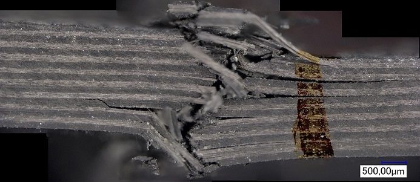

## Vorlesung Faserverbunde - Plattenlösung
Prof. Dr.-Ing.  Christian Willberg 

Kontakt: christian.willberg@h2.de

 
    <a href="https://doi.org/10.1007/s42102-021-00079-6" style="color: blue;">Bildreferenz</a>

---

# Plattenlösung
## Fest-Los-Frei-Frei Platte

---

## Problemstellung

**Rechteckige Platte:**
- Abmessungen: $a \times b$
- Dicke: $h$

**Randbedingungen:**
- **x = 0**: fest eingespannt (clamped)
- **x = a**: los gelagert (simply supported)
- **y = 0**: frei (free)
- **y = b**: frei (free)

---

## Grundgleichungen der Kirchhoff-Plattentheorie

### Biharmonische Gleichung

$$\nabla^4 w = \frac{q}{D}$$

**Ausgeschrieben:**

$$\frac{\partial^4 w}{\partial x^4} + 2\frac{\partial^4 w}{\partial x^2 \partial y^2} + \frac{\partial^4 w}{\partial y^4} = \frac{q}{D}$$

---

## Parameter

- $w(x,y)$ - Durchbiegung der Platte
- $q(x,y)$ - Flächenlast
- $D = \frac{Eh^3}{12(1-\nu^2)}$ - Biegsteifigkeit
- $E$ - Elastizitätsmodul
- $\nu$ - Querkontraktionszahl
- $h$ - Plattendicke

---

## Schnittgrößen (1/2)

### Biegemomente

$$M_x = -D\left(\frac{\partial^2 w}{\partial x^2} + \nu\frac{\partial^2 w}{\partial y^2}\right)$$

$$M_y = -D\left(\frac{\partial^2 w}{\partial y^2} + \nu\frac{\partial^2 w}{\partial x^2}\right)$$

### Drillmoment

$$M_{xy} = -D(1-\nu)\frac{\partial^2 w}{\partial x \partial y}$$

---

## Schnittgrößen (2/2)

### Querkräfte

$$Q_x = -D\frac{\partial}{\partial x}\nabla^2 w$$

$$Q_y = -D\frac{\partial}{\partial y}\nabla^2 w$$

mit dem Laplace-Operator:

$$\nabla^2 w = \frac{\partial^2 w}{\partial x^2} + \frac{\partial^2 w}{\partial y^2}$$

---

## Randbedingungen

### Bei x = 0 (fest eingespannt)

$$w(0,y) = 0$$
$$\frac{\partial w}{\partial x}(0,y) = 0$$

### Bei x = a (los gelagert)

$$w(a,y) = 0$$
$$M_x(a,y) = 0 \quad \Rightarrow \quad \frac{\partial^2 w}{\partial x^2}(a,y) + \nu\frac{\partial^2 w}{\partial y^2}(a,y) = 0$$

---

## Randbedingungen (Fortsetzung)

### Bei y = 0 (freier Rand)

$$M_y(x,0) = 0 \quad \Rightarrow \quad \frac{\partial^2 w}{\partial y^2}(x,0) + \nu\frac{\partial^2 w}{\partial x^2}(x,0) = 0$$

$$V_y(x,0) = 0 \quad \Rightarrow \quad Q_y(x,0) + \frac{\partial M_{xy}}{\partial x}(x,0) = 0$$

### Bei y = b (freier Rand)

$$M_y(x,b) = 0 \quad \Rightarrow \quad \frac{\partial^2 w}{\partial y^2}(x,b) + \nu\frac{\partial^2 w}{\partial x^2}(x,b) = 0$$

$$V_y(x,b) = 0 \quad \Rightarrow \quad Q_y(x,b) + \frac{\partial M_{xy}}{\partial x}(x,b) = 0$$

---

## Lösungsansatz

Für gleichmäßige Last $q = q_0 = const.$ verwenden wir einen Produktansatz:

$$w(x,y) = \sum_{n=1}^{\infty} W_n(x) \cdot Y_n(y)$$

**Strategie:**
1. Trennung der Variablen
2. Erfüllung der Randbedingungen in x-Richtung
3. Erfüllung der Randbedingungen in y-Richtung
4. Bestimmung der Koeffizienten

---

## Ansatz für x-Richtung

Die Funktionen $W_n(x)$ müssen die Randbedingungen bei x = 0 und x = a erfüllen:

**Allgemeiner Ansatz:**

$$W_n(x) = C_1 \sinh(\beta_n x) + C_2 \cosh(\beta_n x) + C_3 \sin(\beta_n x) + C_4 \cos(\beta_n x)$$

Dabei ist $\beta_n$ ein noch zu bestimmender Parameter.

---

## Anwendung der RB bei x = 0

**Bedingung 1:** $W_n(0) = 0$
$$C_2 + C_4 = 0 \quad \Rightarrow \quad C_4 = -C_2$$

**Bedingung 2:** $W_n'(0) = 0$
$$\beta_n(C_1 + C_3) = 0 \quad \Rightarrow \quad C_3 = -C_1$$

**Vereinfachter Ansatz:**
$$W_n(x) = C_1[\sinh(\beta_n x) - \sin(\beta_n x)] + C_2[\cosh(\beta_n x) - \cos(\beta_n x)]$$

---

## Anwendung der RB bei x = a

**Bedingung 3:** $W_n(a) = 0$
$$C_1[\sinh(\beta_n a) - \sin(\beta_n a)] + C_2[\cosh(\beta_n a) - \cos(\beta_n a)] = 0$$

**Bedingung 4:** $W_n''(a) + \nu \lambda_n^2 W_n(a) = 0$

Diese Bedingungen führen auf ein charakteristisches Gleichungssystem zur Bestimmung von $\beta_n$ und dem Verhältnis $C_1/C_2$.

---

## Charakteristische Gleichung

Aus den Randbedingungen bei x = a erhält man:

$$\begin{vmatrix}
\sinh(\beta_n a) - \sin(\beta_n a) & \cosh(\beta_n a) - \cos(\beta_n a) \\
\sinh(\beta_n a) + \sin(\beta_n a) & \cosh(\beta_n a) + \cos(\beta_n a)
\end{vmatrix} = 0$$

Dies vereinfacht sich zu:

$$\tanh(\beta_n a) = -\tan(\beta_n a)$$

oder äquivalent:

$$\cos(\beta_n a) \cosh(\beta_n a) = 1$$

---

## Numerische Lösung

Die charakteristische Gleichung muss numerisch gelöst werden.

**Erste Eigenwerte $\beta_n a$:**
- $\beta_1 a \approx 1.875$
- $\beta_2 a \approx 4.694$
- $\beta_3 a \approx 7.855$
- $\beta_4 a \approx 10.996$

Für große n gilt approximativ:
$$\beta_n a \approx \left(n - \frac{1}{2}\right)\pi$$

---

## Ansatz für y-Richtung

Für die freien Ränder bei y = 0 und y = b verwenden wir einen trigonometrischen Ansatz:

$$Y_n(y) = A_n \cos\left(\frac{m\pi y}{b}\right) + B_n \sin\left(\frac{m\pi y}{b}\right)$$

Wegen der Symmetrie der Randbedingungen können wir auch schreiben:

$$Y_n(y) = \sum_{m=0}^{\infty} \left[A_{nm} \cos\left(\frac{m\pi y}{b}\right) + B_{nm} \sin\left(\frac{m\pi y}{b}\right)\right]$$

---

## Vollständige Lösung

Die vollständige Durchbiegung lautet:

$$w(x,y) = \sum_{n=1}^{\infty} \sum_{m=0}^{\infty} W_n(x) \left[A_{nm} \cos\left(\frac{m\pi y}{b}\right) + B_{nm} \sin\left(\frac{m\pi y}{b}\right)\right]$$

mit:

$$W_n(x) = \sinh(\beta_n x) - \sin(\beta_n x) - \sigma_n [\cosh(\beta_n x) - \cos(\beta_n x)]$$

wobei $\sigma_n$ das Verhältnis der Konstanten aus den Randbedingungen ist.

---

## Bestimmung der Koeffizienten

Die Koeffizienten $A_{nm}$ und $B_{nm}$ werden durch Einsetzen in die Plattengleichung und Anwendung der Orthogonalitätsbedingungen bestimmt:

$$\int_0^a \int_0^b W_n(x) W_m(x) \cos\left(\frac{k\pi y}{b}\right) \cos\left(\frac{l\pi y}{b}\right) \, dy \, dx$$

Für eine konstante Last $q = q_0$ ergibt sich:

$$A_{nm} = \frac{4q_0}{D\pi^2 nm} \cdot \text{(Integralfaktoren)}$$

---

## Spezialfall: Gleichlast

Für eine gleichmäßig verteilte Last $q = q_0$ vereinfacht sich die Lösung zu:

$$w(x,y) = \frac{q_0 a^4}{D} \sum_{n=1,3,5,...}^{\infty} \frac{W_n(x/a)}{n^4 \beta_n^4} \cdot f_n(y/b)$$

Die maximale Durchbiegung tritt typischerweise in der Nähe des freien Randes auf.

**Konvergenz:**
- Bereits wenige Terme liefern gute Näherungen
- Für praktische Berechnungen sind oft 5-10 Terme ausreichend

---

## Maximale Durchbiegung

Die maximale Durchbiegung für eine Gleichlast kann geschrieben werden als:

$$w_{max} = \alpha \cdot \frac{q_0 a^4}{D}$$

wobei $\alpha$ ein Formfaktor ist, der vom Seitenverhältnis $b/a$ und den spezifischen Randbedingungen abhängt.

**Typische Werte:**
- Für $b/a = 1$: $\alpha \approx 0.0116$
- Für $b/a = 2$: $\alpha \approx 0.0284$
- Für $b/a \to \infty$: $\alpha \to 0.0421$ (Grenzfall: Streifen)

---

## Zusammenfassung

**Lösung der fest-los-frei-frei Platte:**

1. ✓ Biharmonische Gleichung aufgestellt
2. ✓ Randbedingungen formuliert
3. ✓ Separationsansatz gewählt
4. ✓ Charakteristische Gleichung gelöst
5. ✓ Koeffizienten bestimmt

**Anwendung:**
- Balkonplatten
- Auskragende Platten mit Teileinspannung
- Brückenfahrbahnen

---

## Vielen Dank für Ihre Aufmerksamkeit!

**Fragen?**