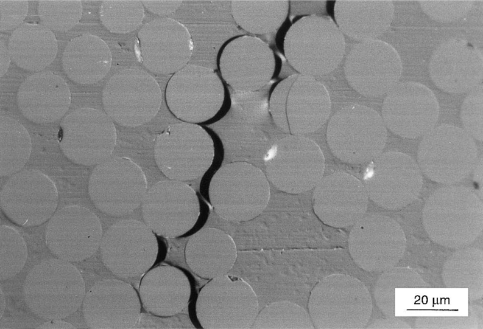
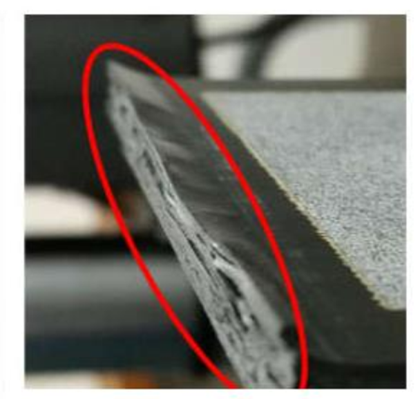
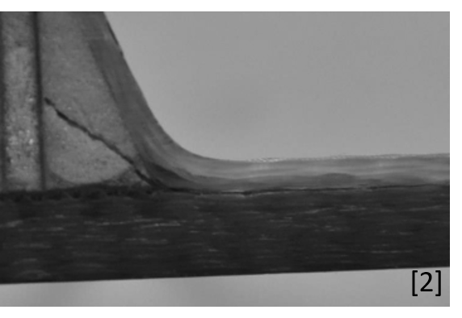
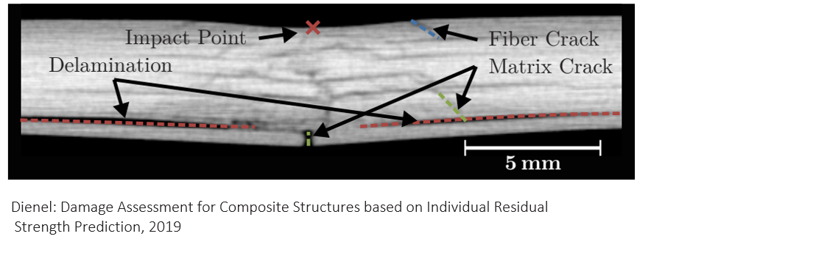
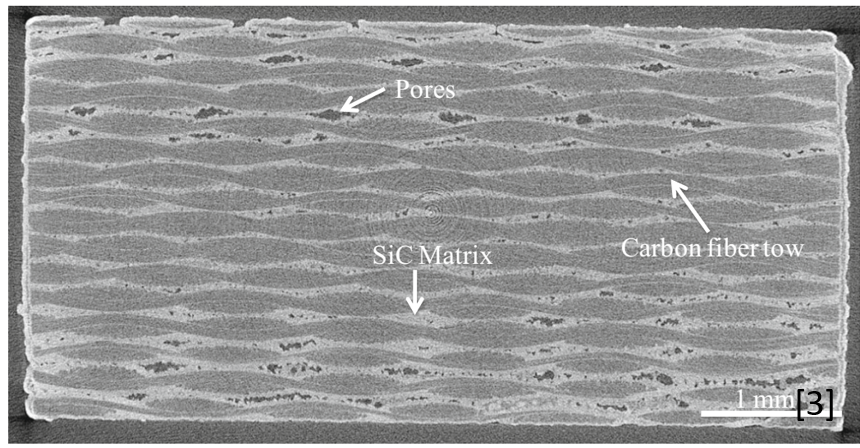
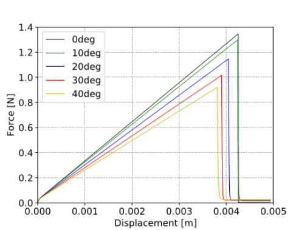
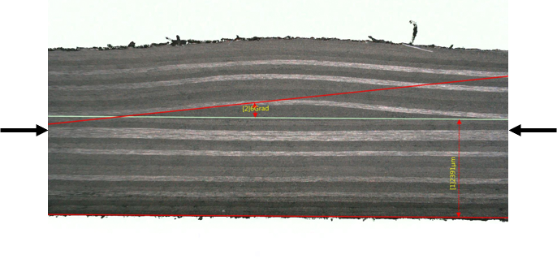
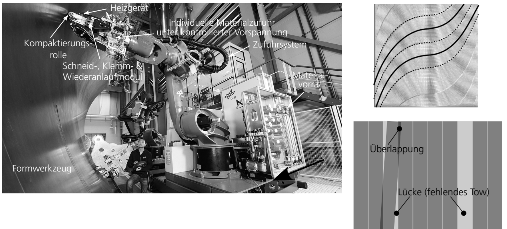
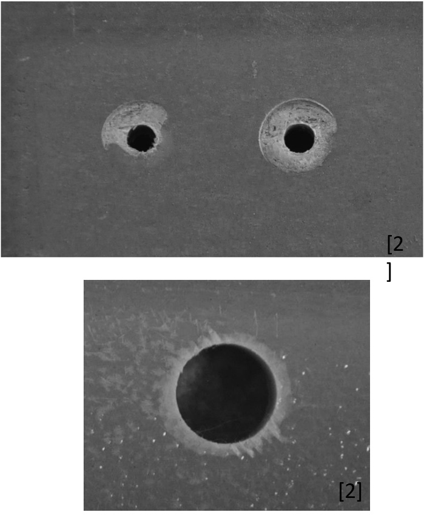

<!-- _class: title -->

# Schadenstypen und Fertigungsfehler in CFK

**Faserverbundwerkstoffe – Kapitel: Schädigungsmechanismen**

Prof. Dr.-Ing. Christian Willberg
Hochschule Magdeburg-Stendal

<div style="position: absolute; top: 200px; left: 850px;"> 

</div>

---


## Kontextualisierung

<div class="hinweis">

**Ausgangspunkt:** Fertigungsdefekte beeinflussen die Kennwerte des „idealen" Verbunds aus der Mikromechanik und CLT erheblich.

</div>

- Fertigungsverfahren haben **Fehler-„Präferenzen"** – bestimmte Prozesse erzeugen typische Defektmuster
- Industrielle Fertigung ist ein Kompromiss:

<div class="eq">

$$\text{Fertigungsgeschwindigkeit} \;\longleftrightarrow\; \text{Fehler} \;\longleftrightarrow\; \text{Kosten}$$

</div>

> Heinecke & Willberg (2019): Manufacturing-Induced Imperfections in Composite Parts via AFP. *Journal of Composites Science*, 3(2):56.

---

## Auswirkungen von Fertigungsfehlern


**Betroffene Eigenschaften**

| Eigenschaft | Beispielauswirkung |
|------------|-------------------|
| Festigkeit | Reduktion bis 40 % |
| Steifigkeit | Veränderte CLT-Vorhersage |
| Stabilität | Beullastreduktion |
| Dynamik | Eigenfrequenzverschiebung |
| Dichtigkeit | Versagen bei Druckbehältern |
| Lebensdauer | Frühzeitiges Ermüdungsversagen |


---


**Praxisbeispiele**

- Windenergieanlagen-Rotorblatt: Fertigungsdefekte als Ursache für Steifigkeitsschwankungen *(Knebusch, 2020)*

- FRP-Metall-Hybride: Eigenspannungen durch Herstellungsprozess *(Prussak, 2018)*

- Ermüdung unter thermischer Last *(Lüders, DLR Leichtbau)*


---

## Klassifikation nach Heslehurst


**52 Fehlertypen** lassen sich in drei Kategorien nach dem Lebenszyklus einteilen *(Heslehurst, 2014)*


### Nach Auftreten

```
Lebenszyklus
├── Materialprozess
│   └── Bereitstellung der Teilbestandteile
├── Komponentenfertigung
│   ├── Ablage
│   ├── Aushärtung
│   ├── Bearbeitung
│   └── Assemblierung
└── In-service Nutzung
    └── Betriebsschäden
```

---

### Nach Größe

<!-- _class: cols-2 -->

<div class="ldiv">




**Mikroskopisch** - Matrixrisse, Faserbrüche, Faser-Matrix-Ablösung 

</div>
<div class="rdiv">


**Makroskopisch** - Delaminationen, Beulen, Durchdringungen

</div>

---

## Fehlertypen – Komponentenfertigung

<!-- _class: cols-2 -->

<div class="ldiv">

**Matrixbezogen**
- Blasenbildung / Hohlräume
- Porosität
- Bereiche ohne Harz
- Schwankungen im Harzanteil
- Fehler im Aushärteprozess
- Ungleichmäßige Härtermittelverteilung


</div>
<div class="rdiv">

**Faserbezogen**
- Faserausrichtungsfehler
- Faserknicke (Wrinkles)
- Fehlende Lagen
- Starke Lagenüberlappungen
</div>

---

**Strukturell**
- Risse / Delaminationen
- Ablösungen
- Thermische Spannungen
- Verzug

**Fertigungsbedingt**
- Verschmutzungen / Trennfolien
- Fehler in Verbindungsbohrungen
- Kanten-/Eckensplitterung
- Falsche Materialien


---


## Schadenstyp: Delamination

<!-- _class: cols-2 -->

<div class="ldiv">

**Definition:** Trennung zwischen zwei Lagen – interlaminarer Riss

**Ursachen**
- Hohe interlaminare Spannungen durch Querkontraktionseffekte
- Unterschiedliche Wärmedehnungen der Lagen
- Geometrische Kanten (Kerbwirkung)
- Trennfolien / Verschmutzungen zwischen Lagen

</div>
<div class="rdiv">

**Folgen**
- Feuchteeintritt → weitere Schädigung
- Lebensdauerreduktion
- Stabilitätsverlust (Druckversagen)

</div>

---








---

## Schadenstyp: Porosität


<!-- _class: cols-2 -->

<div class="ldiv">

**Ursachen**
- Schlechte Material- und Prozesskontrolle
- Überaltertes Prepreg-Material
- Feuchtigkeit im Prepreg
- Fehlfunktion im Autoklav

**Auswirkungen**
- Verschlechterte Lageneigenschaften (Interlaminare Scherfestigkeit ↓)
- Reduktion der Ermüdungslebensdauer
- Beeinträchtigung der Dichtheit

</div>
<div class="rdiv">

**Wichtige Erkenntnis:**

Die **Konzentration** der Poren ist für die Schädigungswirkung wichtiger als die absolute Porengröße.

</div>

<div class="eq">

Porosität > 2 % → signifikante ILSS-Abnahme

</div>

> Wang et al. (2019): 3D Characterizations of Pores in C/SiC via X-Ray CT. *Applied Composite Material*, 26:493–505.


---



---

## Schadenstyp: Faserwelligkeit (Wrinkles)

<!-- _class: cols-2 -->

<div class="ldiv">

**Out-of-plane Welligkeit**
- Entsteht bei manueller Ablage oder AFP-Prozessen
- Fasern verlaufen nicht in der Laminatebene

**In-plane Welligkeit**
- AFP-bedingt durch Kurvenradien
- Lagenüberlappungen

</div>

<div class="rdiv">

**Auswirkungen auf Festigkeit**

| Welligkeitswinkel | Festigkeitsabfall |
|-------------------|-------------------|
| 5° | ca. 15 % |
| 10° | ca. 30–40 % |
| 15° | > 50 % |


**Praxisrelevanz (Airbus):** Faserwelligkeit ist ein zentrales Qualitätskriterium in der Rumpfschalenfertigung

</div>

> Al-Kathemi: *Physical interaction effects of out of plane waviness and impact damages*, 2022

> Willberg: *A mode-dependent energy-based damage model for peridynamics*, 2019

</div>

---

<!-- _class: cols-2 -->

<div class="ldiv">



</div>

<div class="rdiv">



</div>

---



---

## Schadenstyp: Fehler an Verbindungsbohrungen

**Ursachen und Erscheinungsformen**

<!-- _class: cols-2 -->

<div class="ldiv">

**Beim Bohren**
- Austrittsschäden (Delamination an der Bohrungsaustrittsseite)
- Kanten-/Eckensplitterung
- Lokale Beschädigung der obersten Lage

**Im Betrieb**
- Zu starkes Anziehen von Schrauben → Lagenschädigung
- Oberflächenschädigung durch Kontakt

</div>
<div class="rdiv">


**Montageproblem:** Splitter können zwischen zwei Komponenten verbleiben und erst im Betrieb zur Ablösung führen.

**Konsequenzen**
- Negative Beeinflussung der Fügung
- Kerbspannungen → Rissinitiierung
- Lokale Delaminationen am Bohrungsrand

</div>
</div>

---



---

## Schädigungen nach Größe – Mikroskopisch vs. Makroskopisch

| Ebene | Schädigungstypen |
|-------|-----------------|
| **Mikroskopisch** | Beschädigte Filamente · Faser-Fehlausrichtung · Faser-/Matrixanhaftungen · Risse in der Matrix · Matrixporen · Pillen & Fusseln · Thermische Eigenspannungen · Schwankungen im Harzanteil |
| **Makroskopisch** | Delaminationen · Risse · Ablösungen · Beulen · Translaminare Brüche · Lagenüberlappungen/-lücken · Beschädigung der Kanten · Löcher/Durchdringungen · Fehlende Lagen |


**Skalenübergreifende Wirkung:** Mikroskopische Risse können unter Last zu makroskopischen Delaminationen koaleszieren → Kaskadenversagen


---

## Design- und Prozesseinfluss auf Fehlerbildung


**Geometriekomplexität ↑ → Fehlerrisiko ↑**
- Enge Radien fördern Faserwelligkeit
- Komplexe Ecken begünstigen Porosität
- Schichtdickensprünge erzeugen Eigenspannungen

**Prozesse zur Fehlerreduktion**

| Prozess | Reduziert |
|---------|-----------|
| Vakuuminfusion + Autoklav | Poren |
| AFP (automatisiert) | Orientierungsfehler |
| Prepreg | Faser-Matrix-Anbindung |


---

**Manuelle vs. automatisierte Fertigung**


Manuelle Prozesse: hohe Flexibilität, aber starke Streuung der Qualität – abhängig von Erfahrung des Operateurs


AFP (Automated Fiber Placement): reproduzierbar, aber eigene Fehlertypen (Gaps, Overlaps, Tows-Twists)


---

## Strategien im Umgang mit Fehlern

<div class="zwei-spalten">
<div>

### Präventiv

**Tolerante Designs**
- ✅ Wenig Nacharbeit
- ❌ Überdimensionierung, Gewichtsnachteil

**Robuste Prozesse**
- ✅ Wenig Nacharbeit, Planbarkeit
- ❌ Prozesseinstellung aufwändig, nur bei großen Stückzahlen wirtschaftlich

**Prozessüberwachung (SHM)**
- ✅ Weniger Prozessanpassung nötig
- ❌ Aufwändige Sensorik, detailliertes Prozessverständnis erforderlich

</div>
<div>

### Detektiv

**Prüfung (ZfP)**
- ✅ Planbarkeit der Fertigung
- ❌ Zusätzlicher Schritt mit Kosten

**In-service Monitoring**
- ✅ Reduktion von Überholungsintervallen
- ❌ Sensorik im Betrieb, Datenauswertung

<div class="hinweis">

In der Luftfahrt sind Reparaturen und Nacharbeiten normaler Bestandteil des QM-Prozesses – nicht das Eingeständnis eines Versagens.

</div>

</div>
</div>

---

## Zerstörungsfreie Prüfverfahren (ZfP)

<div class="zwei-spalten">
<div>

**Geometrisch / Optisch**
- Visuelle Inspektion (manuell / automatisch)
- Klopfprüfung (coin tap)
- Interferometrie

**Durchstrahlung**
- Röntgen / Radiographie
- CT (Computertomographie)
- Mikrowelle

</div>
<div>

**Wellenbasiert**
- Ultraschall (Pulse/Echo, Durchstrahlung)
- Thermographie (aktiv/passiv)
- Akustische Emission

**Spezialverfahren**
- Eindringmittelprüfung
- Dielektrische Prüfung
- Mechanische Impedanzanalyse
- Magnetische Verfahren

</div>
</div>

<div class="hinweis">

Detaillierte Beschreibung der Verfahren, Vor- und Nachteile: **Lernplattform**

</div>

---

## Industrielle Relevanz – Anforderungen nach Branche

| Branche | Primäre Anforderung | Fehlertoleranz |
|---------|--------------------|--------------------|
| **Luftfahrt** | Schadenstoleranz, Festigkeit/Gewicht | Sehr niedrig (JAR/CS 23/25) |
| **Automobil** | Kosten, Zykluszeit | Mittel (Crashtoleranz) |
| **Bauwesen** | Lebensdauer, Korrosionsbeständigkeit | Niedrig (Dauerhaftigkeit) |
| **Windenergie** | Kosten, Ermüdungslebensdauer | Mittel (Zugänglichkeit) |
| **Raumfahrt** | Gewicht, Zuverlässigkeit | Sehr niedrig |

<div class="eq">

Fertigungsgeschwindigkeit ↔ Fehlertoleranz ↔ Kosten = **anwendungsabhängiger Kompromiss**

</div>

---

## Praxisbeispiele

**Airbus – Umgang mit Faserwelligkeit**
- Grenzwerte für Out-of-plane Welligkeit in Rumpfschalen
- Analyse von Einfluss auf Druckfestigkeit und Beullast

**PAG – Bohrungen in Rumpfschalen**
- Prozessoptimierung Bohrparameter zur Minimierung von Austrittsschäden
- Qualitätssicherung durch automatisierte Bildauswertung

**Voith Composite – Prozessbegleitproben**
- Kleine Testlaminatproben werden parallel zur Serienproduktion gefertigt
- Erlauben Rückschlüsse auf Chargenqualität ohne Bauteilzerstörung

---

## Zusammenfassung


1. Fertigungsfehler in CFK sind **vielfältig** – 52 Typen nach Heslehurst, klassifiziert nach Lebenszyklus und Größe
2. **Wirkung ist anwendungsabhängig** – Porosität ist in der Luftfahrt kritischer als im Bauwesen
3. **Ursachen**: Fertigungsprozess, Materialkombination und Designkomplexität
4. **Prüfung** während und nach der Fertigung ist Standard – ZfP-Methoden ergänzen sich
5. **Robuste Prozesse + Schadenstoleranz + Monitoring** sind die drei Säulen des Qualitätsmanagements


