
<!-- _class: lead -->

# Fertigungsverfahren

Prof. Dr.-Ing.  Christian Willberg 
Hochschule Magdeburg-Stendal

 

---

<!-- _class: lead -->

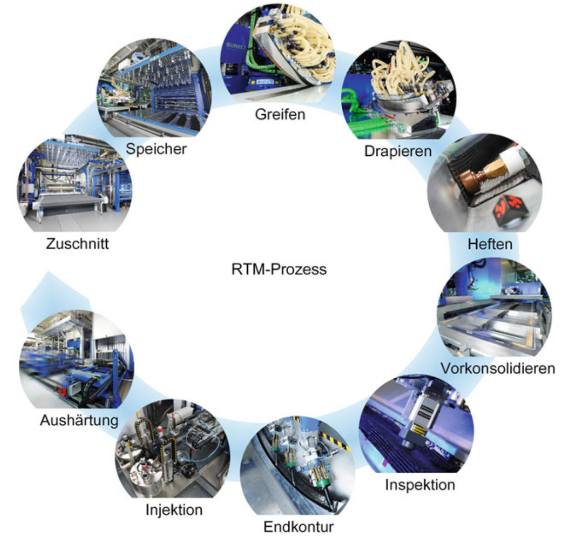

 
    Bild aus M. Wiedemann "Systemleichtbau
für die Luftfahrt"

---

<!-- _class: cols-2-1 -->

# Wahl des Verfahrens

**Hängt ab von**
- der konkreten Anwendung
- den Einsatzbedingungen des Bauteils
- den Besonderheiten von Fasern und Matirx
- den verfügbaren Fertigungsmitteln
- der Stückzahl

wesentliche **Auswahlkriterien**
- Funktionstüchtigkeit
- Betriebsicherheit
- vertretbare Kosten
- Umweltanforderungen (Recyclingquote, etc.)

---

# Formwerkzeug

- Faser und Matrix werden meist auf Formwerkzeugen ausgehärtet
- Material ist beliebig: Gips, Holz, Kunststoffen, Metalle, Faserverbunde, ...
- Erster Schritt: Erstellen eines Urmodells
    - hat detailgetreu die äußere Form des zu produzierenden Bauteils
    - ist in der Regel weder thermisch noch mechanisch belastbar 
- Urmodel ist Vorlage / Schablone für das eigentliche Formwerkzeug

---

# Urmodelle mit Strakschablonen

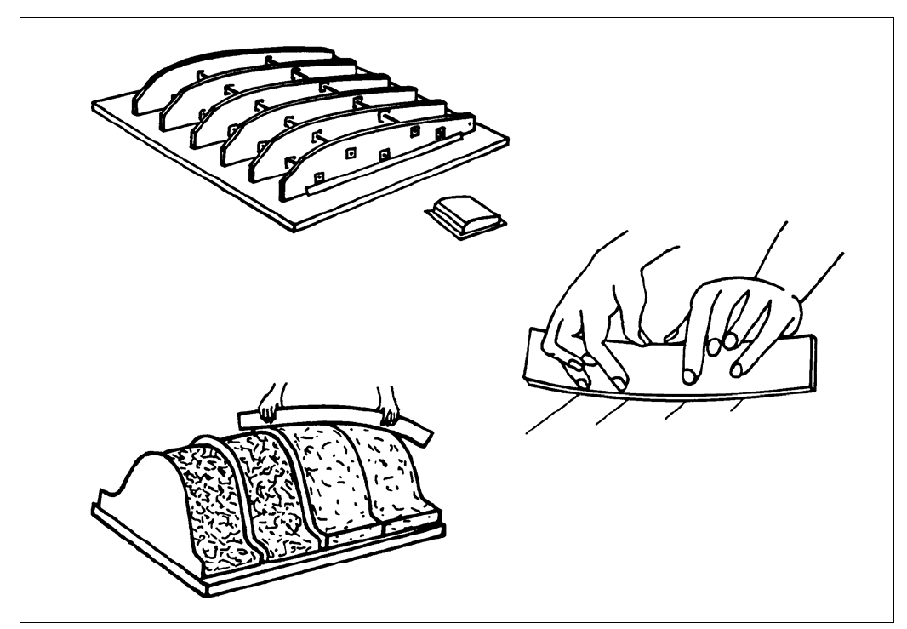

 
    Bild entmommen aus der Vorlesung "Leichtbau mit Faserverbunden" SS2008 von Prof. Dr.-Ing. Klaus Rohwer"

---

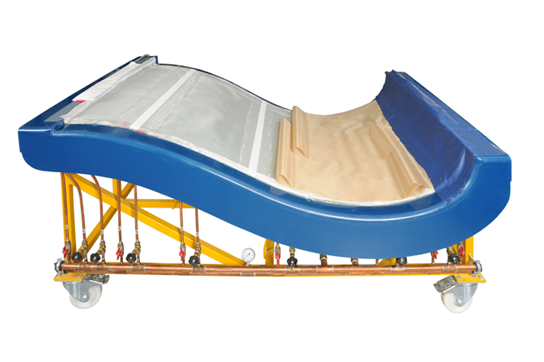

 
    Copyright DLR

---
## Formwerkezeuge aus Verbundwerkstoffen
- geringes Gewicht
- schnelle und gleichmäßige Aufheizung
- geringe Wärmekapazität
- Thermaldehungen, die mit dem Bauteil kompatibel sind

---

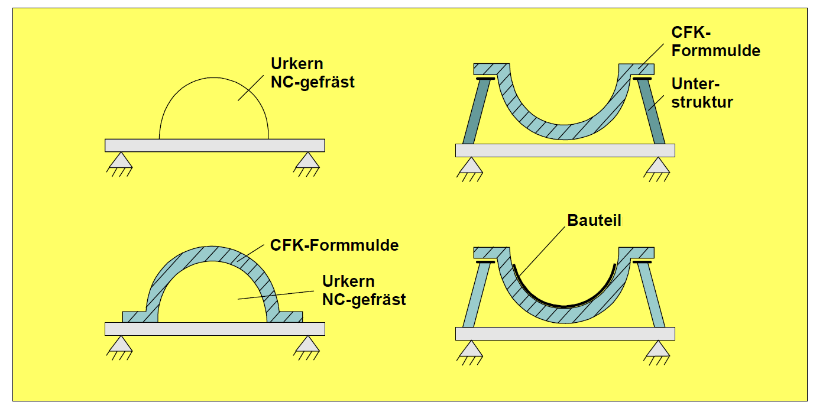

 
    Bild entmommen aus der Vorlesung "Leichtbau mit Faserverbunden" SS2008 von Prof. Dr.-Ing. Klaus Rohwer"

---

## Formwerkzeuge aus Metall

- bestehen häufig aus einer stabilen Unterstruktur und einem Oberteil, dass die Kontur festlegt
- gewünschte Kontur kann durch Umformenverfahren angenähert werden
- Justiermechanismen wie Schrauben können vorgesehen sein

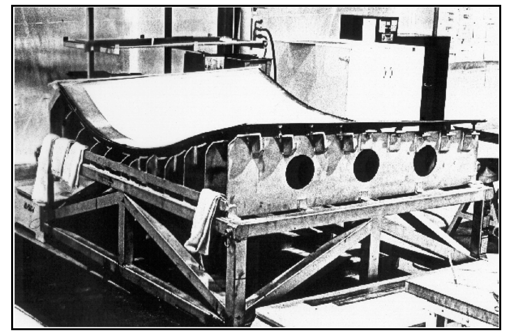

---

## Kernwerkzeuge für Wickeltechnologie
- Wickeln von Behältern immer auf Kernwerkzeugen
- Bleibt als Innenauskleidung in den Behältern

oder

- wird nachträglich entfernt durch
    - chemische Zersetzung
    - Aufschmelzen
    - mechanische Demontage
- Kerne können auch teilweise erhlten bleiben

---

# Ablegen von Vorprodukten

- Plastzieren von Verstärkungsfasern auf dem Formwerkzeug

**Nasses Ablegen**
- Fasernwerden vor oder während des Ablegens mit flüssigem Harz imprägniert
- *nicht verwechseln mit Nasstechnologie wo trockene Fasern mit flüssigem Harz injiziert werden*

**Trockenes Ablegen**
- Fasern sind vorimprägniert (PrePreg - **Pre**-im**preg**nated)
- Harz ist angeliert

---
# Ablegeformen
Abgelegt wird
- Schicht auf Schicht
- manuell oder maschinell
bis die vorgegebene Laminatdicke erreicht ist

- Ablegen auf gekrümmter Bauteilgeometrie
    - zunächst auf ebener Unterlage, anschließend Drappierung im Formwerkzeug
    - Drapierung kann Bauteildesign beeinflussen
    - bei stärkerer Krümmung: Einzelablage im Formwerkzeug

---

# Aushärten von Vorprodukten
## Aushärtetemperatur
- Je nach Harzsystem erfordert die Aushärtung unterschiedliche Drücke und Temperaturen
- Für Epoxidharz-Systeme unterscheidet man bei
- **Raumtemperatur** (Michung vor Ort, keine hohe Rproduzierbarkeit), z.B. Reparaturen, Segelflugzeuge, Kanus
- **120°C**, z.B. kleinere Flugzeuge, Hubschrauber
- **180°C**, z.B. für hochbeanspruchte Flugzeugteile

- höhere Aushärtetemperaturen führen zu höherem $T_g$ (Glasübergangstemperatur) und damit höheren Einsatztemperaturen

---
## Glasübergangstemperatur
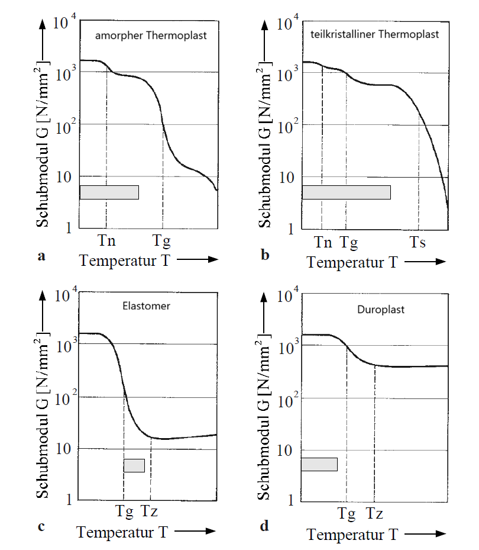

- grau dargestellt sind die Temperaturanwendungsbereiche
- trennt hart-elastischen, glasartigen Zustand vom gummi-elastischen, zähflüssigen Zustand

 
    Bild aus H. Schürrmann "Konstruieren mit Faser-Kunststoff-Verbunden"

---

## Aushärtung unter erhöhtem Druck und Temperatur
- Temperatur und Druck müssen in einem Zyklus aufgebracht werden, der auf das Harzsystem zugeschnitten ist

- Zufuhr von Wärme
    - vermindert die Viskosität des Harzes und fördert das Zusammenfließen der Prepregschichten
    - bewirkt Reaktion der Harzbestandteile nach erreichen der kritischen Temperatur, dabei Übergang vom dünnflüssigen in halbstarren Zustand (Gelierpunkt), danach weitere Aushärtung bei fixierter Geometrie
    - treibt Feuchtigkeit und Lösemittel durch Verdampfung aus

---
- Aufbringung von Druck
    - verdichtet das Laminat
    - entfernt überflüssiges Harz (wird vom 'Bleeder' Gewebe aufgenommmen)

---

## Aushärteprozess
- Die Schnelligkeit der Aushärtung hängt ab von
    - der Art des Harzes
    - den Zusätzen
    - dem Temperaturprofuk
- Herstellung dickerer Laminate (>10 mm) kann zu Problemen führen
    -  Temperaturdifferenz durch exotherm reagierende Harze
    - Entfernung von Lösungsmitteln und Luftblasen

---

## Aushärtekontrollen
- Qualität des Verbundes setzt strikte Einhaltung des optimalen Aushärteprozesses voraus
- Temperatur- und Druckprofile müssen laufend überwacht werden
- manuelle Regelung ist fehleranfällig, daher rechnergesteuerte Prozesse

---

## Vorbereitung der Formwerkzeuge
- Mit Trennfilm (Fett, Lack, Wachs) benetzehn
    - verhindert die Haftung des Harzes am Formwerkzeug
    - erleichtert das Entformen (Wichtig!!! Entformung kann das Bauteil beschädigen)
- eventuell zusätzlich mit Fein- oder Gelierschicht versehen
    -   schafft glatte Oberflächen
    - vermeidet Durchdrücken der Fasern an die Oberfläche

---

## Fertigungsverfahren

---

### Handlaminarverfahren

- nach Auftragen von Trennfilm/Gelierschicht wird eine Schicht flüssiges Harz auf das Formwerkzeug aufgetragen, gefolgt von der ersten Faserschicht
- gleichmäßiges Verteilen des Harzes und Entfernung von Lufteinschlüssen durch Rollen und Bürsten
- Wiederholung bis Laminatdicke erreicht ist
- älteste und einfachste Methode
- für kleine und einfache Bauteile eine bewährte Methode
- verwendete Harze härten bei Raumtemperatur

---

### Vor- und Nachteile
- minimale technische Aufwendung
- bei Einzelfertigung einfache Holz-, Gips- oder Pappformen
- Aushärtung bei Raumtemperatur ohne Druckanwendung
- Faservolumenanteil von 30 - 40\% erreichbar
- bescheidene mechanische Eigenschaften und geringe Temperaturbeständigkeit
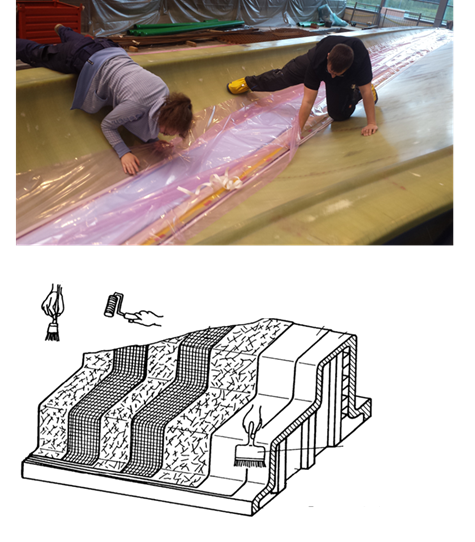

---

## Vakuumsackverfahren 

- Schichtstapel wird mit luftdichter Membran abgedeckt
- Evakuierung bewirkt gleichmäßige Verdichtung
- Druck wird während der Aushärtung beibehalten
- Bauteile haben Faservolumengehalte von 40 - 50\% und beidseitig glatte Oberflächen
- Kosten urch höherwertige Formwerkzeugen und Vakuuminstallationen

---

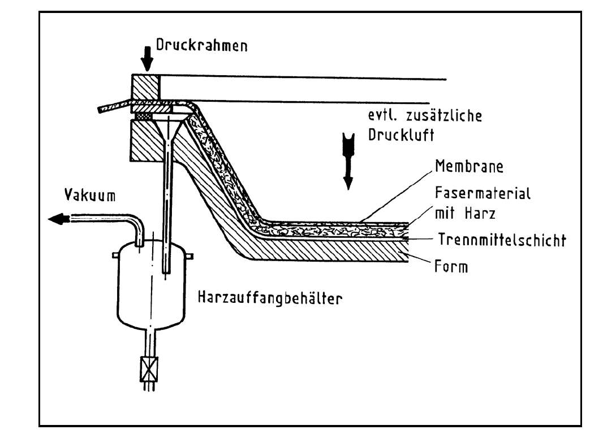

 
    Bild entmommen aus der Vorlesung "Leichtbau mit Faserverbunden" SS2008 von Prof. Dr.-Ing. Klaus Rohwer"

---

## Autoklavverfahren
- Autoklaven sind Behälter mit Regelung von Druck und Temperatur

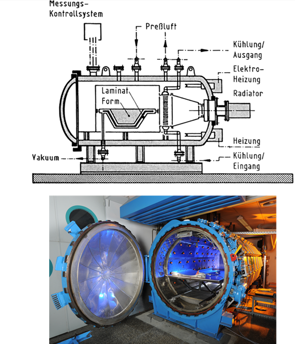

---

### Laminataufbau im Autoklaven
*oben*

- Vakuumdichte Abdeckmembrane
- Gewebelage zum Absaugen von Lufteinschlüssen (breather)
- perorierte Folie
- Gewebelagen (bleeder) zum Auffangen des Harzüberschusses beim Verdichten
- optional Abreißgewebe (peel ply) für saubere Oberfläche
- Laminatlagen
- optional Abreißgewebe (peel ply) für saubere Oberfläche
- Trennfilm
- Formwerkzeug

*unten*

---
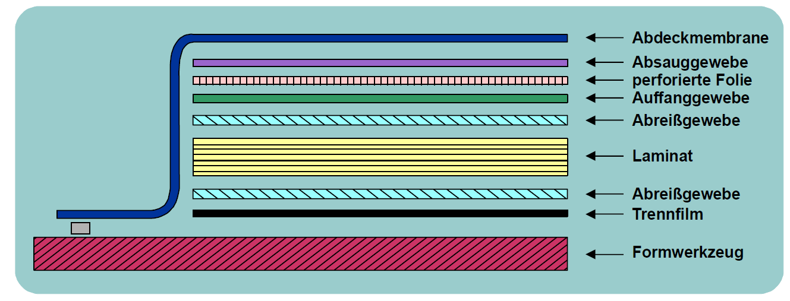

 
    Bild entmommen aus der Vorlesung "Leichtbau mit Faserverbunden" SS2008 von Prof. Dr.-Ing. Klaus Rohwer"

---

- Abreißgewebe sind harzdurchlässig und nicht klebend
- Auffang- und Absauggewebe sind meist Glasfasergewebe
- Evakuierung der Luft under der Membrane
    - zur Verdichtung des Laminats
    - zum Auffangen des überschüssigen harzes
    - Entfernung von Lufteinschlüssen

---
### Aushärtezyklus
- bessere Vernetzung des Matrixharzes bei erhöhter Temperatur und erhöhtem Druck
- Optimaler Verlauf von Druck und Tempertur hängt ab von
    - Art des Harzes oder Prepregs
    - dem Abmessungen des Bauteils
    - den gestellten Anforderungen
- übliche Drücke 6 - 8 bar
- übliche Temperaturen 120 - 180 °C
- Faservolumengehalte von 60 - 70\%

---

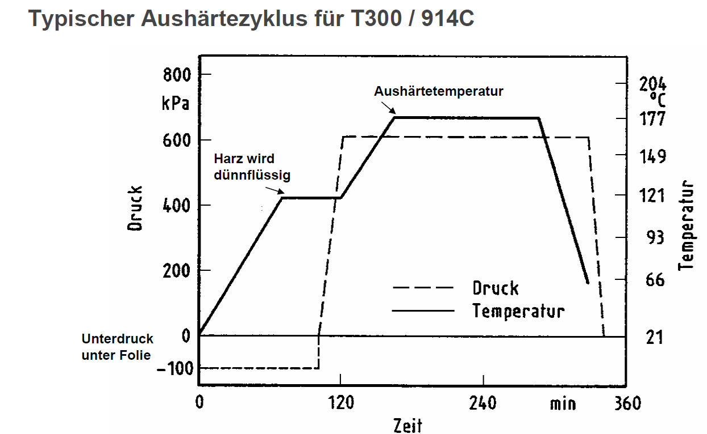

 
    Bild entmommen aus der Vorlesung "Leichtbau mit Faserverbunden" SS2008 von Prof. Dr.-Ing. Klaus Rohwer"

---
### Nachbehandlung
- Auffang- und Absauggewebe wird entfernt 
- Abreißgewebe bleibt als Oberflächenschutz erst einmal erhalten
- Nachhärten bei etwas höherer als der Aushärtetemperatur (erhöht den Vernetzungsgrad und die Temperaturbeständigkeit, bei etwas spröderer Matrix)
- die Gewebe sind Abfall und sind daher Kosten und umweltschädigend

---

## Resin Transfer Molding (RTM) Verfahren

- Formwerkzeuge für RTM-Verfahren
    - steife Ober- und Unterhälfte
    - steife Unterhälfte und Vakuumaufbau
- Abgelegt wird trockenes Fasermaterial (Nasstechnologie):
Gelege, Matten, Gewebe, Gestricke
- Wenn starr: 
    - Formhäften werden geschlossen und Ränder abgedichtet
    - Durch Zuleitungen wird flüssiges Harz in den Hohlraum gepumpt
- Vakuum
    - Durch Zuleitungen wird flüssiges Harz in den Hohlraum "gezogen"

---

- weitere Rohrleitungen dienen zu Abführung des überschüssigen Harzes
- Faservolumengehalt 40 - 50% (starr); Vakuumfolie >60\%

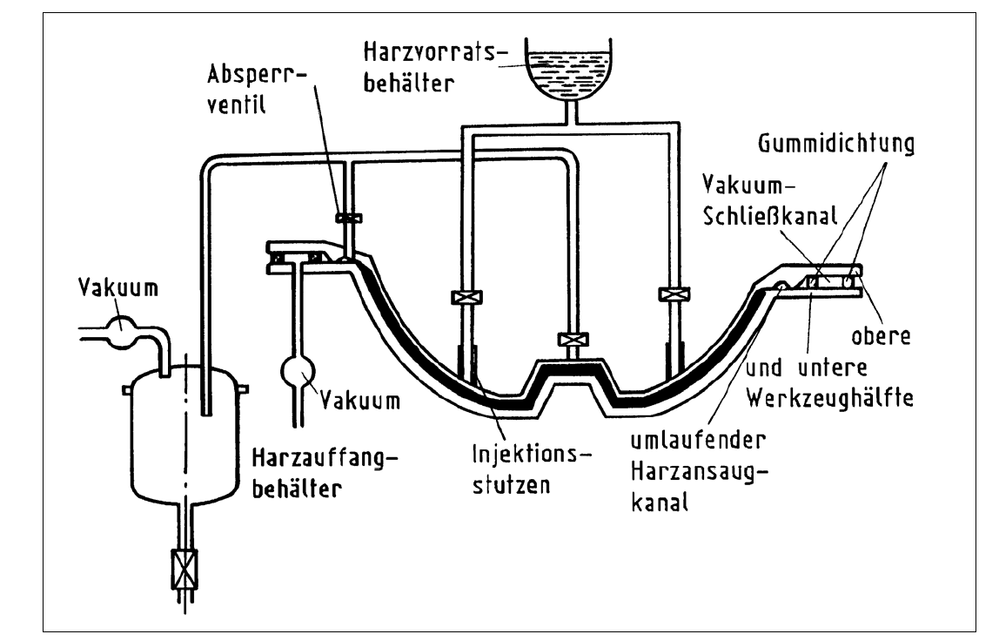

 
    Bild entmommen aus der Vorlesung "Leichtbau mit Faserverbunden" SS2008 von Prof. Dr.-Ing. Klaus Rohwer"

---

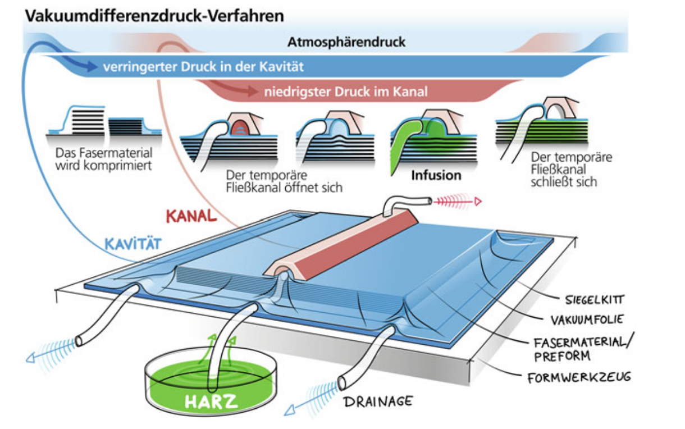

 
    Bild aus M. Wiedemann "Systemleichtbau
für die Luftfahrt"

---

## Pressverfahren

- Sammelbegriff für mehrere verwandte Herstellungstechniken
Faserverstärktes Harz wird in Formwerkzeug eingelegt
- Durch Druck (und Temperatur) wird das Material verteilt und ausgehärtet
- Auffangvorrichtung am Rand des Formwerkzeugs nehmen überschüssiges Harz und Lufteinschlüsse auf
- Rauchkanten im Formwerkzeug scheren überstehendes Material ab
- Druckintensität und Aushärtetemperatur können bei geeigneter Konstruktion im weitem Rahmen variierte werden
- Faservolumengehalt bis 65\%

--- 
## Kalt- und Heißpressen
- Beim **Kaltpressen** wird die Faserverstärkung meist trocken in die Form gelegt und flüssiges Harz nachträglich dazugegeben
- Verteilung des Harzes erfolgt durch Druck des Formwerkzeuges
- Dauer der Aushärtung bei etwa 70°C - 80°C hängt von der Reaktivität des Harzes und der Bauteilwandstärke ab
- **Heißpressen** bei Temperaturen von 100°C - 180° bei Drücken bis 40 bar
- Aufwand für beheizbare Formwerkzeuge (Stahl) nur bei hohen Stückzahlen sinnvoll
- Druck wird meist durch hydraulische Pressen aufgebracht
- verwendet werden Prepregs, Matten und kurzfaserverstärktes Material 

---
# Kaltpressverfahren

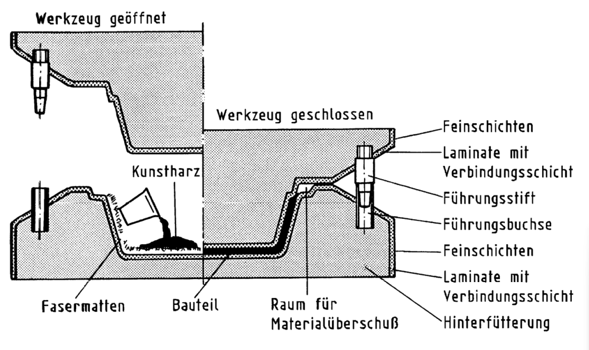

 
    Bild entmommen aus der Vorlesung "Leichtbau mit Faserverbunden" SS2008 von Prof. Dr.-Ing. Klaus Rohwer"

---
# Verpressen von SMC

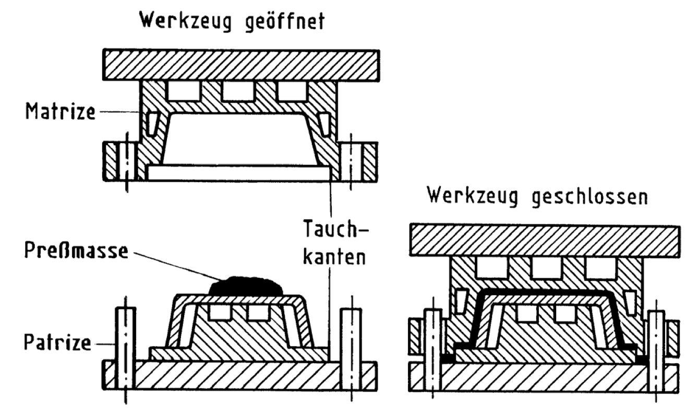

 
    Bild entmommen aus der Vorlesung "Leichtbau mit Faserverbunden" SS2008 von Prof. Dr.-Ing. Klaus Rohwer"

---
**Vorteile**
- gute mechanische Eigenschaften
- genaue Reproduzierbarkeit
- Wirtschaftlichkeit bei Serienproduktion

**Nachteile**
- begrenzte Bauteilabmessungen
- hohe Anforderungen an Formwerkzeuge

---

## Expansionsverfahren

- In geschlossenem Formwerkzeug werden die Laminatschichten durch Expansion eines Mediums gegen die Wände der Form gepresst
- Entsprechend dem Expansionsmedium unterscheidet man
Drucksackverfahren $\leftarrow\rightarrow$Thermisches Expansionsverfahren
- Drucksachverfahren mit sackähnlichen Formkern
Druck wird durch Öffnung in der Wand aufgebracht
- Sack kann eventuell nach Aushärtung als Auskleidung im Bauteil dienen
- keine Vakuumanlage, kein Autoklav
---

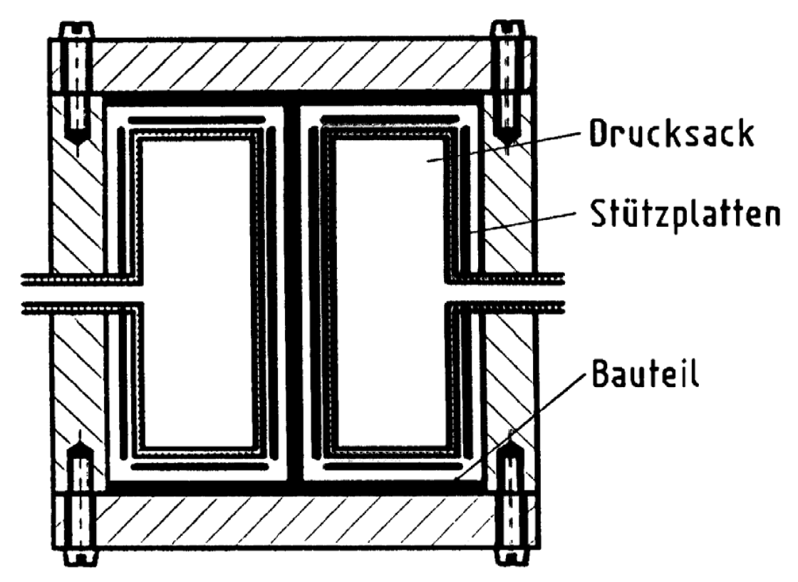

---
# Thermisches Expansionsverfahren
- Druck durch Formkern (meist Elastomer) der unter Wärmezufuhr expandiert
- Drücke zwischen 0.1 - 150 bar durch Wahl des Formkernmaterials
- Vorteile wie beim Drucksackverfahren
- Nachteile:
    - Druck und Temperatur können nicht unabhängig voneinander variiert werden; das erschwert die Kontrolle der Aushärtung
    - Formkern muss entfernt werden

---

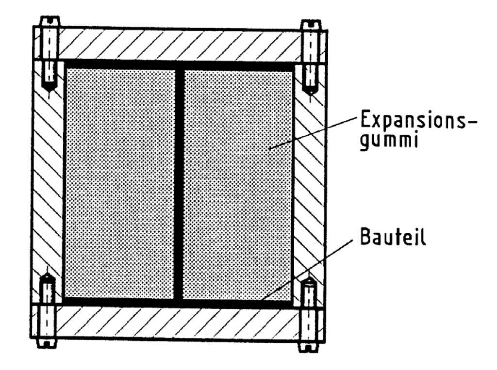

 
    Bild entmommen aus der Vorlesung "Leichtbau mit Faserverbunden" SS2008 von Prof. Dr.-Ing. Klaus Rohwer"

---

# Spritzgussverfahren (Resin Injection Molding, RIM)

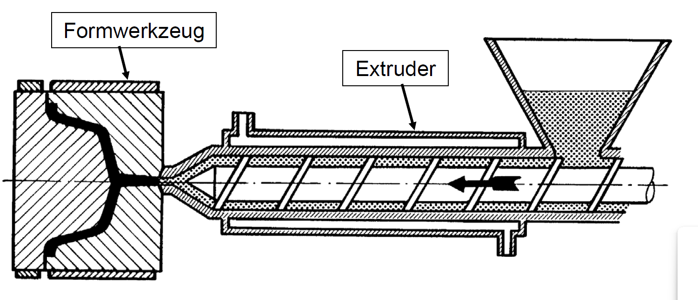

 
    Bild entmommen aus der Vorlesung "Leichtbau mit Faserverbunden" SS2008 von Prof. Dr.-Ing. Klaus Rohwer"

---
- Gemisch aus Kurzfasern und Harz im Extruder verdichten
- Einspritzen in das Formwerkzeug
- Mehrere Einspritzstellen bessere Verteilung und Ausrichtung der Fasern
- nur niedermolekulare Harze verwendbar, damit das Faser/Harz Gemisch die nötige Fließfähigkeit hat
- trotzdem erhebliche Spritzdrücke erforderlich
- Faservolumengehalt bis 40%
- Herstellung von Produkten mit komplexer Geometrie ohne Nachbearbeitung möglich

---

## Wickelverfahren

- Kontinuierliche Faserbündel oder -bänder werden auf ein sich drehendes Formwerkzeug gewickelt und anschließend ausgehärtet.
- Formwerkzeug recht frei gestaltbar, nur Hohlkehlen machen Probleme.
- Fasermaterial 
    - wird von Spulen abgenommen
    - in Tränkanlage mit flüssigem Harz imprägniert 
    - unter Vorspannung aufgewickelt.

- Auch möglich: Verwendung vorimprägnierter Verstärkungsfasern.

---

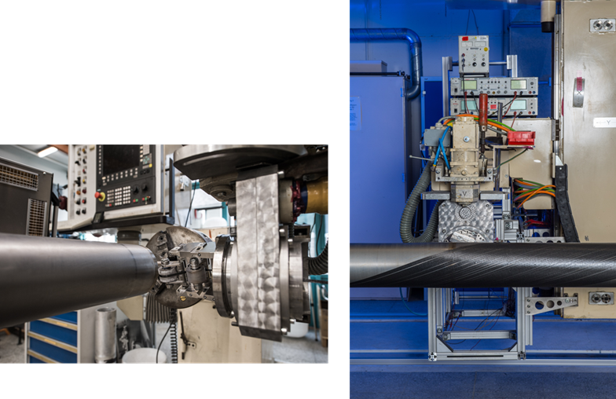

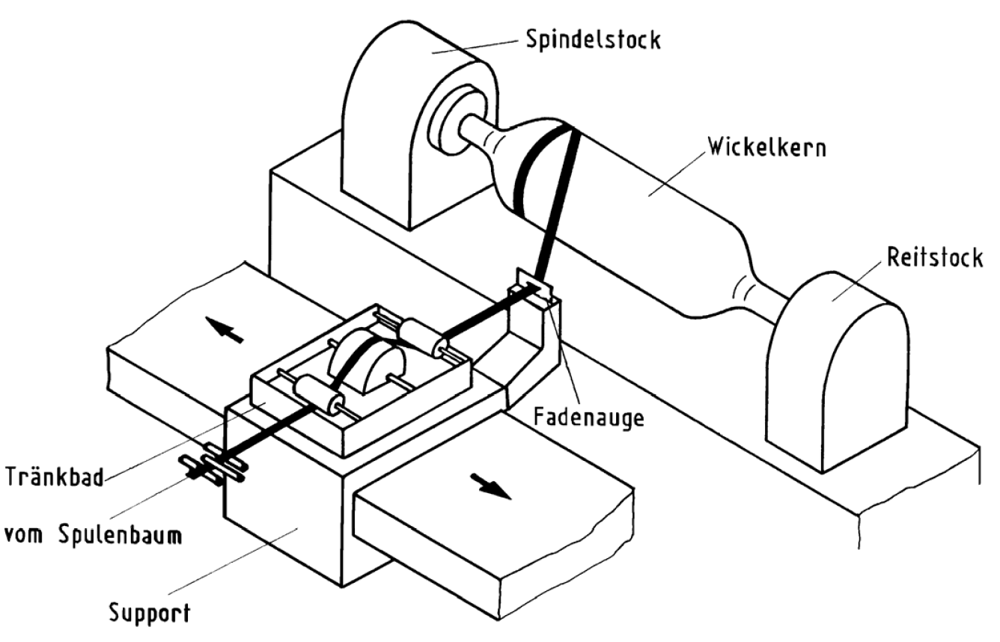

- Viele unterschiedliche Wickeltechniken, z.B. mit drehbank- oder planetenähnlichen Bewegungsabläufen.
- Prinzipiell alle Wickelrichtungen realisierbar, die nicht zu weit vom geodätischen Pfad abweichen.
- Optimale Wickelrichtungen sind auf analytischem Wege bestimmbar.

 
    Bild unten entmommen aus der Vorlesung "Leichtbau mit Faserverbunden" SS2008 von Prof. Dr.-Ing. Klaus Rohwer"

---

- Faservolumenanteil lässt sich durch Höhe der Fadenvorspannung während des Wickelvorgangs variieren.
- Wahl des Kernmaterials hängt ab von: Demontage oder Verwendung als Liner, Aushärtungstemperatur, Wiederverwendbarkeit.
- Entfernung der Wickelkerne einfach, wenn ein Ende offen bleibt; bei geschlossenen Enden muss Kern integraler Bestandteil werden oder mechanisch/chemisch zerstört werden.
- Ablagemengen von 300 kg/h sind realisierbar.

---

# Direkte oder indirekte Fadentränkung

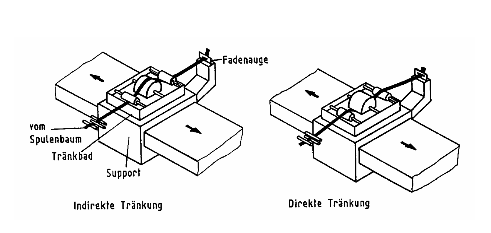

 
    Bild entmommen aus der Vorlesung "Leichtbau mit Faserverbunden" SS2008 von Prof. Dr.-Ing. Klaus Rohwer"

---

# Präzisionsimprägnierbad für Kohlenstofffasern

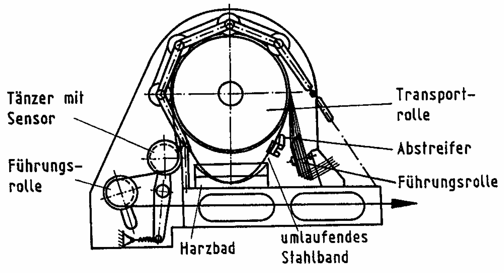

 
    Bild entmommen aus der Vorlesung "Leichtbau mit Faserverbunden" SS2008 von Prof. Dr.-Ing. Klaus Rohwer"

---

# Planeten- und Polarwickelverfahren

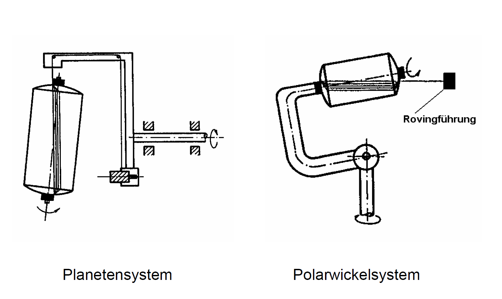

 
    Bild entmommen aus der Vorlesung "Leichtbau mit Faserverbunden" SS2008 von Prof. Dr.-Ing. Klaus Rohwer"

---

## Strangziehverfahren (Pultrusion)

- Weitgehend automatisiertes Verfahren für gestreckte Verbundbauteile mit konstantem Querschnitt.
- Rovings werden von Spulen abgewickelt und mit Matrixharz getränkt.
- Getränkte Fasern werden gebündelt und in vorgeheizte Stahldüse eingeführt.
- Kontur der Düse bestimmt den Querschnitt des Bauteils.
- Faserstrang wird kontinuierlich durch die Düsenöffnung gezogen.

---

- Zugeführte Wärme initiiert die Reaktion des Matrixharzes.
- Prozessfolge: Aushärtung, eventuell Nachhärtung, Abkühlung, Trennung in gewünschte Längen durch Trennsäge.
- Eignet sich auch für strukturierte Profile.
- Vorteile: Hohe Produktionsraten, (fast) beliebige Längenabmessungen, bis zu 80% Faservolumenanteil.

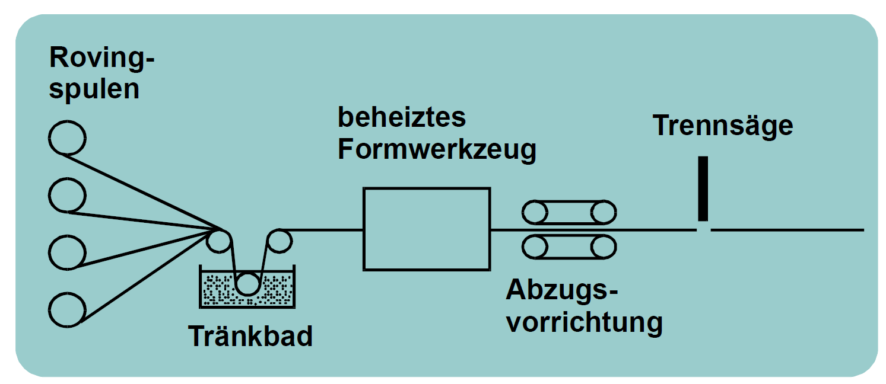

 
    Bild entmommen aus der Vorlesung "Leichtbau mit Faserverbunden" SS2008 von Prof. Dr.-Ing. Klaus Rohwer"

---

## Automated Fibre Placement
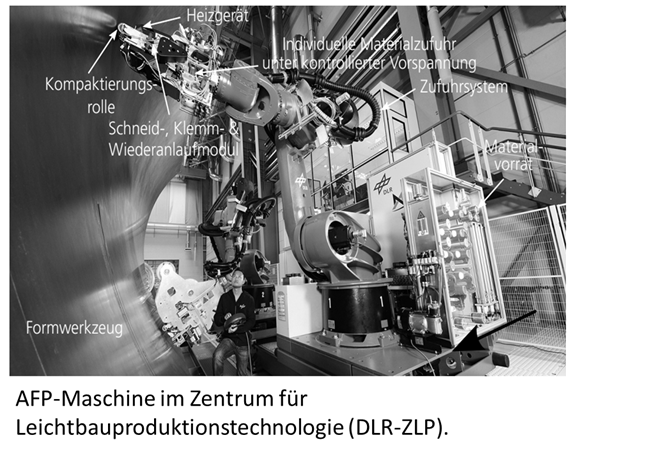

- Rechnergesteuerte Mehrachsen(6-10)-Maschinen legen Prepregstreifen direkt auf räumlich gekrümmte Formwerkzeuge ab.
- Für nicht abwickelbare Oberflächen müssen Prepregstreifen schmal sein.
- Maschinelle Ablage ist wesentlich exakter und reproduzierbarer als von Hand.
- Bei großen und flachen Bauteilen arbeiten Ablegemaschinen wirtschaftlich.

---

## Automated Fibre Placement

- Typische Ablegegeschwindigkeit: 5 – 10 m/min.
- Bearbeitungsschritte: Einleiten des Prepregstreifens, Entfernen der Schutzfolien, Positionieren und Absenken des Kopfes, Abrollen und Abschneiden, Anheben und Drehen für gegensinnige Ablage.

---

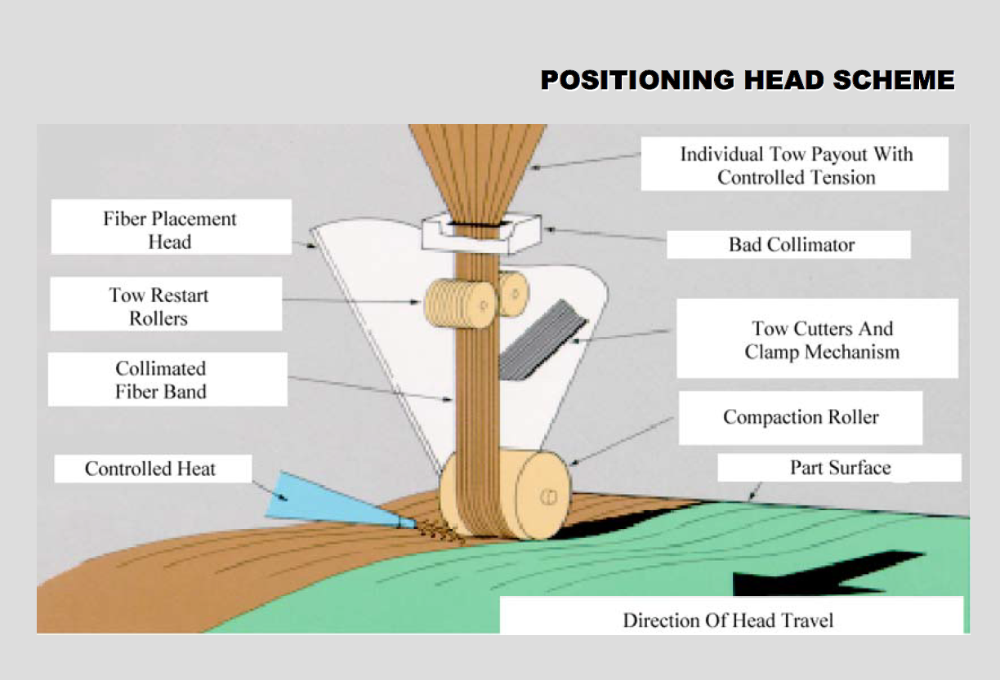

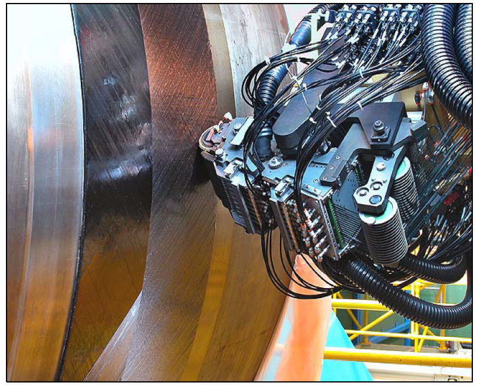

---

## Nachbearbeitung von Verbundbauteilen

- Verbundbauteile werden prinzipiell mit möglichst genauen Endmaßen hergestellt; Nacharbeiten bei hohen Anforderungen an Oberflächengüte und Maßgenauigkeit nötig.
- Zu berücksichtigen: Temperaturempfindlichkeit der Matrix, Eigenarten der Fasern, hoher Werkzeugverschleiß.
- Durchbrüche von Bohrern durch die Außenschichten des Laminat

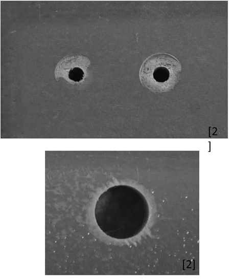

---

- **Spanende Verfahren**:
  - **Sägen** mit diamant- oder hartmetallbestückten Kreis- oder Bandsägen (Vorschub einige mm/s).
  - **Besäumen** durch konventionelle Fräswerkzeuge (diamant- oder karbidbestückt).
  - **Glätten** von Oberflächen mit normalen Schleifwerkzeugen.
  - **Bohren** mit hartmetallbestückten Werkzeugen; Hitze begrenzen durch geringen Anpressdruck und niedrige Drehzahl.

---

- **Strahlschneiden**:
  - **Wasserstrahlschneiden**: Erosive Wirkung (Strahldurchmesser 0,1 - 0,3 mm, Drücke bis 4000 bar). Vorteile: Saubere Schnittflächen, Staubfreiheit, keine thermische Belastung.
  - **Laserstrahlschneiden**: Kontaktloser, thermischer Prozess (Schnittbreite 0,1 - 0,3 mm). Lokales Aufschmelzen/Verdampfen. Für CFK wegen hoher Wärmeleitfähigkeit nur bedingt anwendbar.

---

# Automatisierung des Fertigungsablaufs

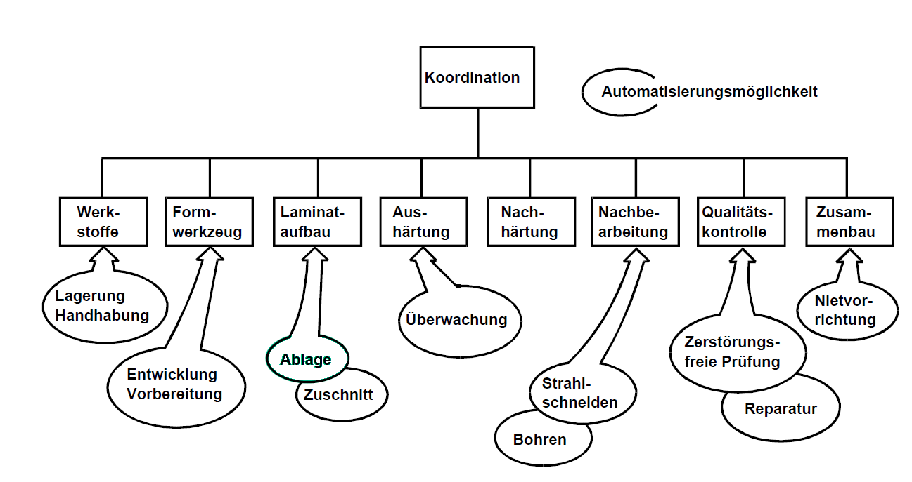

---

- Wirtschaftlichkeit hängt maßgeblich von Material- und Fertigungskosten ab.
- Einsparmöglichkeiten besonders durch Automatisierung der Fertigung.
- Ziel: Nicht einzelne Fertigungsinseln, sondern gesamten Ablauf automatisieren.
- **Zuschnitt**:
  - Numerisch gesteuertes Stichmesser auf Ansaugtisch.
  - Optimierte Schnittmuster für geringeren Verschnitt.
  - Schnittgeschwindigkeit 5 - 15 m/min; Dicke bis ca. 5 mm (unausgehärtete Prepregs).
- **Ablage**: Übergang von manuell über halbautomatisch zu vollautomatischen Maschinen (Tapelegen).
- **Aushärtung**: Rechnergesteuerte Prozesse zur laufenden Überwachung von Temperatur- und Druckprofilen zur Fehlerentdeckung und Ausschussverringerung.

---

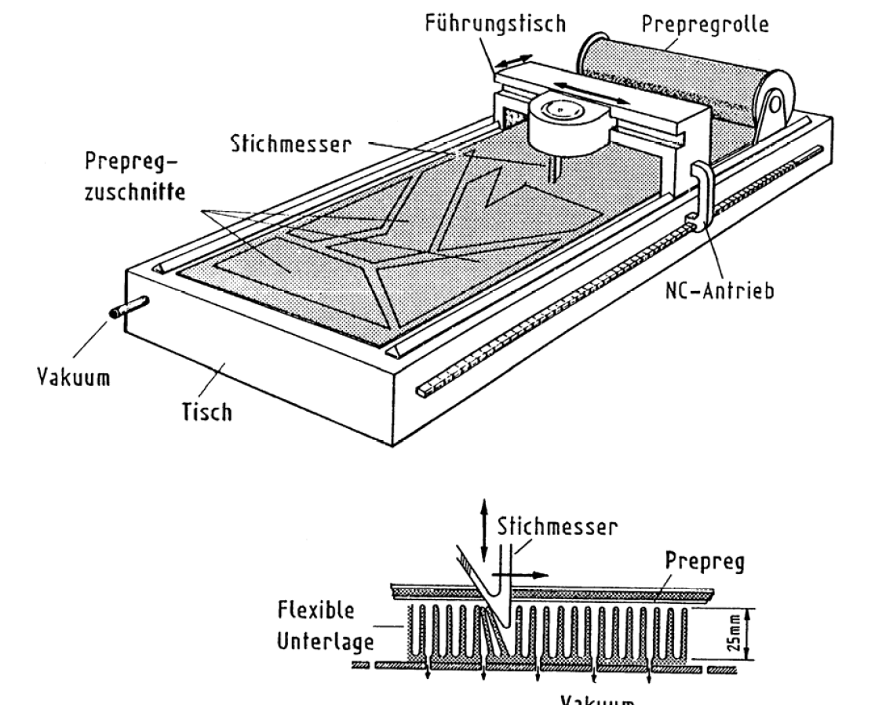

 
    Bild entmommen aus der Vorlesung "Leichtbau mit Faserverbunden" SS2008 von Prof. Dr.-Ing. Klaus Rohwer"

---

## Vielen Dank für Ihre Aufmerksamkeit!

**Kontakt:**
Prof. Dr.-Ing. Christian Willberg
Hochschule Magdeburg-Stendal

