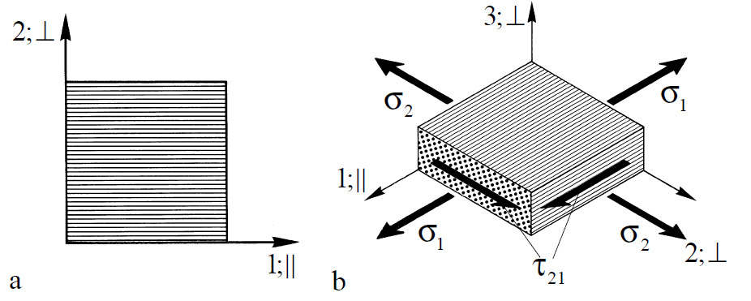
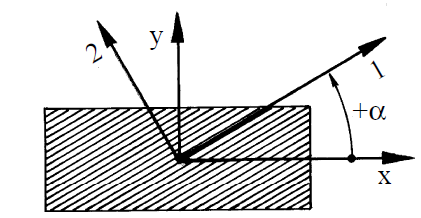
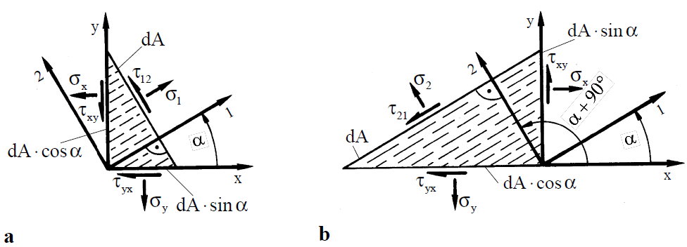
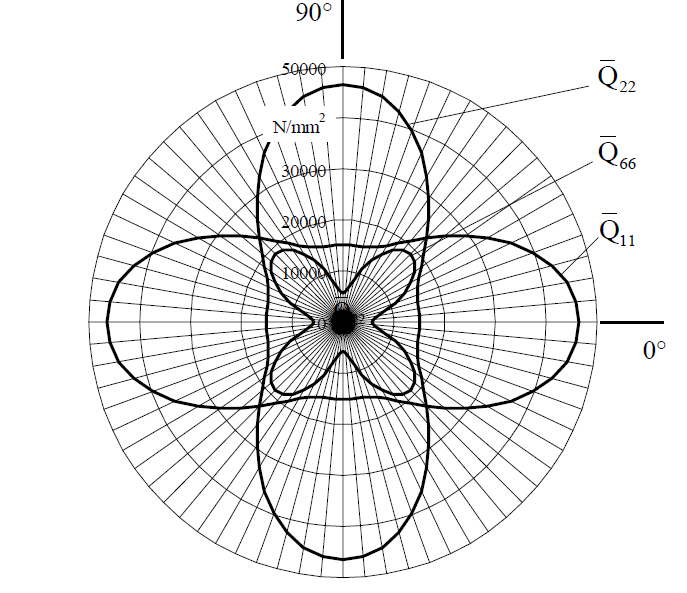
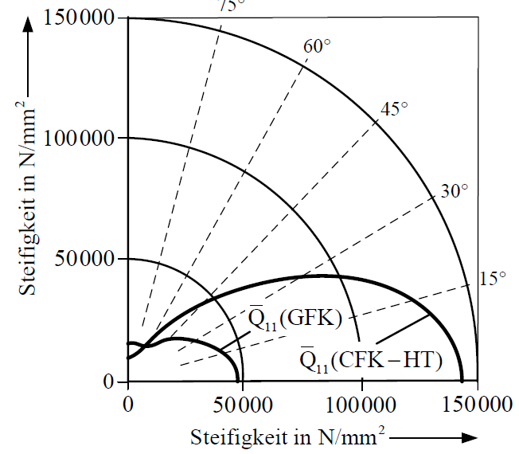
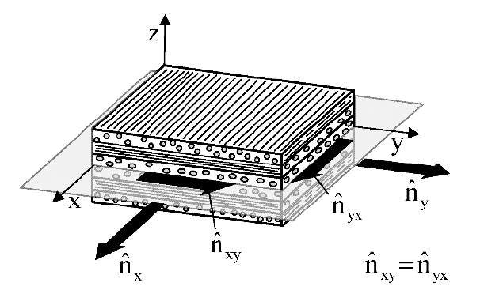
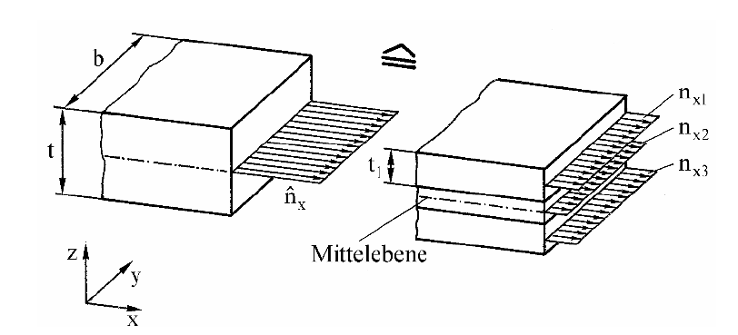
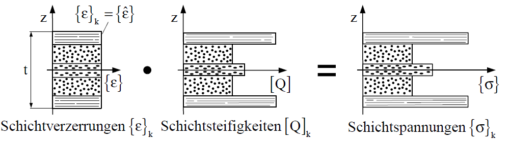

<!-- _class: lead -->
# Klassische Laminattheorie

Prof. Dr.-Ing. Christian Willberg
Hochschule Magdeburg-Stendal

 

---
<!-- _class: lead -->

# Mehrschichtverbunde

- alle Bilder sind entnommen aus Schürmann "Konstruieren mit Faser-Kunststoff-Verbunden"

---

# Polartransformation des Elastizitätsgesetzes der UD-Schicht

---

## Ausgangssituation

Leichtbaustrukturen sind häufig dünnwandig → **ebener Spannungszustand** (ESZ).

Die UD-Schicht bzw. der MSV kann mechanisch behandelt werden als (meist in FEM):

- **Scheibenelement** – nur Kräfte in der Ebene (häufigster Fall)
- **Plattenelement** – nur Querkräfte / Biege- und Drillmomente
- **Scheibe-Platte** – Überlagerung beider Fälle

Die UD-Schicht wird als **dünnwandiges, infinitesimales Scheibenelement** mit homogenem Spannungszustand modelliert.

---

## Orthotropie der UD-Schicht

Die UD-Schicht ist ein **orthotroper**, zusätzlich **transversal isotroper** Werkstoff.

Zwei ausgezeichnete Richtungen:
- **1-Richtung (∥)**: längs zur Faser
- **2-Richtung (⊥)**: quer zur Faser

Diese bilden das **natürliche, kartesische Koordinatensystem** der UD-Schicht.

*a) Lokales 1,2- bzw. ∥,⊥-Schicht-KOS; b) Ebener Spannungszustand*

---

## Annahmen für das Scheibenelement

- **Kleine Verformungen**
- **Lineares, ideal elastisches** Werkstoffverhalten → lineares Elastizitätsgesetz
- **Superpositionsprinzip** gilt (Linearität von Verformung und Werkstoff)
- **Ebener Spannungszustand** (Dünnwandigkeit):
  - $\sigma_3 = 0$, $\tau_{23} = \tau_{31} = 0$

→ Vier **Grund-Elastizitätsgrößen** beschreiben die UD-Schicht im ESZ:

$$E_\parallel, \quad E_\perp, \quad G_{\perp\parallel}, \quad \nu_{\perp\parallel}$$

---

## Elastizitätsgesetz der UD-Schicht – Nachgiebigkeitsform

$$\begin{Bmatrix} \varepsilon_1 \\ \varepsilon_2 \\ \gamma_{21} \end{Bmatrix} = \begin{bmatrix} S_{11} & S_{12} & 0 \\ S_{12} & S_{22} & 0 \\ 0 & 0 & S_{66} \end{bmatrix} \cdot \begin{Bmatrix} \sigma_1 \\ \sigma_2 \\ \tau_{21} \end{Bmatrix}$$

In Ingenieurgrößen: $\quad \{\varepsilon\} = [S] \cdot \{\sigma\}$

$$[S] = \begin{bmatrix} +\frac{1}{E_\parallel} & -\frac{\nu_{\perp\parallel}}{E_\parallel} & 0 \\ -\frac{\nu_{\parallel\perp}}{E_\perp} & +\frac{1}{E_\perp} & 0 \\ 0 & 0 & \frac{1}{G_{\perp\parallel}} \end{bmatrix}$$

---

## Elastizitätsgesetz der UD-Schicht – Steifigkeitsform

$$\begin{Bmatrix} \sigma_1 \\ \sigma_2 \\ \tau_{21} \end{Bmatrix} = \begin{bmatrix} Q_{11} & Q_{12} & 0 \\ Q_{12} & Q_{22} & 0 \\ 0 & 0 & Q_{66} \end{bmatrix} \cdot \begin{Bmatrix} \varepsilon_1 \\ \varepsilon_2 \\ \gamma_{21} \end{Bmatrix}$$

mit: $\quad \{\sigma\} = [Q] \cdot \{\varepsilon\}$

$$Q_{11} = \frac{E_\parallel}{1 - \nu_{\perp\parallel}\nu_{\parallel\perp}}, \quad Q_{22} = \frac{E_\perp}{1 - \nu_{\perp\parallel}\nu_{\parallel\perp}}, \quad Q_{12} = \frac{\nu_{\perp\parallel} \cdot E_\perp}{1 - \nu_{\perp\parallel}\nu_{\parallel\perp}}, \quad Q_{66} = G_{\perp\parallel}$$

> **Symbol Q** statt C: kennzeichnet „reduzierte Steifigkeiten" im ESZ (keine Dehnungsbehinderung in Dickenrichtung)

---

## Orthotropie – Keine Dehnungs-Schiebungs-Kopplung

**Kennzeichen der Orthotropie:** Drei orthogonale Symmetrieebenen.

Folge für die Steifigkeits-/Nachgiebigkeitsmatrix:

$$Q_{13} = Q_{31} = 0, \quad Q_{23} = Q_{32} = 0$$
$$S_{13} = S_{31} = 0, \quad S_{23} = S_{32} = 0$$

**Das bedeutet:**
- Normalspannungen $\sigma_1, \sigma_2$ erzeugen **keine** Schiebung $\gamma_{21}$
- Schubspannungen $\tau_{21}$ erzeugen **keine** Dehnungen $\varepsilon_1, \varepsilon_2$

> Die Kopplung der Querdehnungen über die **Querkontraktion** bleibt erhalten: $S_{12}, Q_{12} \neq 0$

---

# Polartransformation

---

## Warum transformieren?

Im MSV liegen UD-Schichten unter **verschiedenen Faserwinkeln** $\alpha$.

- Das **x,y-Laminat-KOS** fällt i.d.R. nicht mit dem **1,2-Schicht-KOS** zusammen
- Spannungen und Verzerrungen müssen **zwischen beiden Systemen** umgerechnet werden

*Positiver Faserwinkel +α (anglo-amerikanische Konvention)*

**Konvention:** $+\alpha$ = Drehung von x-Richtung → 1-Richtung **entgegen dem Uhrzeigersinn**

---

## Spannungstransformation

**Vom 1,2-Schicht-KOS ins x,y-Laminat-KOS:**

$$\begin{Bmatrix} \sigma_x \\ \sigma_y \\ \tau_{xy} \end{Bmatrix} = \begin{bmatrix} \cos^2\alpha & \sin^2\alpha & -\sin 2\alpha \\ \sin^2\alpha & \cos^2\alpha & \sin 2\alpha \\ 0{,}5\sin 2\alpha & -0{,}5\sin 2\alpha & \cos 2\alpha \end{bmatrix} \cdot \begin{Bmatrix} \sigma_1 \\ \sigma_2 \\ \tau_{21} \end{Bmatrix}$$

---

## Spannungstransformation – Rücktransformation

**Vom x,y-Laminat-KOS ins 1,2-Schicht-KOS:**

$$\begin{Bmatrix} \sigma_1 \\ \sigma_2 \\ \tau_{21} \end{Bmatrix} = \begin{bmatrix} \cos^2\alpha & \sin^2\alpha & \sin 2\alpha \\ \sin^2\alpha & \cos^2\alpha & -\sin 2\alpha \\ -0{,}5\sin 2\alpha & 0{,}5\sin 2\alpha & \cos 2\alpha \end{bmatrix} \cdot \begin{Bmatrix} \sigma_x \\ \sigma_y \\ \tau_{xy} \end{Bmatrix}$$

> **Unterschied:** Die Vorzeichen der $\sin 2\alpha$-Terme sind vertauscht gegenüber der Hintransformation.

---

## Verzerrungstransformation

**Vom 1,2-Schicht-KOS ins x,y-Laminat-KOS:**

$$\begin{Bmatrix} \varepsilon_x \\ \varepsilon_y \\ \gamma_{xy} \end{Bmatrix} = \begin{bmatrix} \cos^2\alpha & \sin^2\alpha & -0{,}5\sin 2\alpha \\ \sin^2\alpha & \cos^2\alpha & 0{,}5\sin 2\alpha \\ \sin 2\alpha & -\sin 2\alpha & \cos 2\alpha \end{bmatrix} \cdot \begin{Bmatrix} \varepsilon_1 \\ \varepsilon_2 \\ \gamma_{21} \end{Bmatrix}$$

**Vom x,y-Laminat-KOS ins 1,2-Schicht-KOS:**

$$\begin{Bmatrix} \varepsilon_1 \\ \varepsilon_2 \\ \gamma_{21} \end{Bmatrix} = \begin{bmatrix} \cos^2\alpha & \sin^2\alpha & 0{,}5\sin 2\alpha \\ \sin^2\alpha & \cos^2\alpha & -0{,}5\sin 2\alpha \\ -\sin 2\alpha & \sin 2\alpha & \cos 2\alpha \end{bmatrix} \cdot \begin{Bmatrix} \varepsilon_x \\ \varepsilon_y \\ \gamma_{xy} \end{Bmatrix}$$

---

## Hinweis: Tensor- vs. Ingenieurschreibweise

Bei **Tensorschreibweise** (Dehnung $\varepsilon = \frac{1}{2}\gamma$) sind die Transformationsmatrizen für Spannungen und Verzerrungen **gleich**.

In der **Ingenieurschreibweise** (Schiebung $\gamma$ als Winkeländerung) unterscheiden sich die Matrizen durch Faktoren $\frac{1}{2}$ und $2$.

> **Praxishinweis DMS-Messung:** Ein einzelner DMS unter 45° misst die Hauptdehnung – zur Schiebung $\gamma$ muss mit **Faktor 2** multipliziert werden! Spezielle „tannenbaum"-DMS geben direkt $\gamma$ an.

---
<!-- _class: lead -->
# Transformation der Steifigkeiten und Nachgiebigkeiten

---

## Herleitung der transformierten Matrizen

**Ziel:** Elastizitätsgesetz der UD-Schicht auf **beliebigen Schnitten** (schräg zu Orthotropieachsen)

**Vorgehen (am Beispiel der Steifigkeitsmatrix):**

1. Elastizitätsgesetz im 1,2-KOS: $\{\sigma\}_{1,2} = [Q]_{1,2} \cdot \{\varepsilon\}_{1,2}$
2. Spannungstransformation ins x,y-KOS: $\{\sigma\}_{x,y} = [T_\sigma] \cdot \{\sigma\}_{1,2}$
3. Einsetzen des Elastizitätsgesetzes: $\{\sigma\}_{x,y} = [T_\sigma] \cdot [Q] \cdot \{\varepsilon\}_{1,2}$
4. Verzerrungen rücktransformieren: $\{\varepsilon\}_{1,2} = [T_\varepsilon]^{-1} \cdot \{\varepsilon\}_{x,y}$
5. Zusammenfassen:

$$[\bar{Q}] = [T_\sigma]_{1,2 \to x,y} \cdot [Q] \cdot [T_\varepsilon]_{x,y \to 1,2}$$

Analog: $\quad [\bar{S}] = [T_\varepsilon]_{1,2 \to x,y} \cdot [S] \cdot [T_\sigma]_{x,y \to 1,2}$

---

## Transformierte Steifigkeitsmatrix $[\bar{Q}]$

$$\begin{Bmatrix} \sigma_x \\ \sigma_y \\ \tau_{xy} \end{Bmatrix} = \begin{bmatrix} \bar{Q}_{11} & \bar{Q}_{12} & \bar{Q}_{16} \\ \bar{Q}_{12} & \bar{Q}_{22} & \bar{Q}_{26} \\ \bar{Q}_{16} & \bar{Q}_{26} & \bar{Q}_{66} \end{bmatrix} \cdot \begin{Bmatrix} \varepsilon_x \\ \varepsilon_y \\ \gamma_{xy} \end{Bmatrix}$$

**Wichtig:** Durch die Transformation werden **alle Koeffizienten** $\neq 0$:

$$\bar{Q}_{16} \neq 0, \quad \bar{Q}_{26} \neq 0$$

→ Außerhalb der Orthotropieachsen zeigt die UD-Schicht **anisotropes Verhalten** mit **Dehnungs-Schiebungs-Kopplung**

---

## Transformierte Steifigkeiten – Formeln

$$\bar{Q}_{11} = \frac{E_\parallel}{1-\nu_{\perp\parallel}\nu_{\parallel\perp}} \cos^4\alpha + \frac{E_\perp}{1-\nu_{\perp\parallel}\nu_{\parallel\perp}} \sin^4\alpha + 2\left(\frac{\nu_{\perp\parallel} E_\perp}{1-\nu_{\perp\parallel}\nu_{\parallel\perp}} + G_{\perp\parallel}\right) \sin^2 2\alpha$$

$$\bar{Q}_{22} = \frac{E_\parallel}{1-\nu_{\perp\parallel}\nu_{\parallel\perp}} \sin^4\alpha + \frac{E_\perp}{1-\nu_{\perp\parallel}\nu_{\parallel\perp}} \cos^4\alpha + 2\left(\frac{\nu_{\perp\parallel} E_\perp}{1-\nu_{\perp\parallel}\nu_{\parallel\perp}} + G_{\perp\parallel}\right) \sin^2 2\alpha$$

$$\bar{Q}_{66} = G_{\perp\parallel} + \frac{1}{4}\left(\frac{E_\parallel + E_\perp - 2\nu_{\perp\parallel} E_\perp}{1-\nu_{\perp\parallel}\nu_{\parallel\perp}} - 4G_{\perp\parallel}\right) \sin^2 2\alpha$$

---

## Transformierte Nachgiebigkeiten – Formeln

$$\bar{S}_{11} = \frac{\cos^4\alpha}{E_\parallel} + \frac{\sin^4\alpha}{E_\perp} + \left(\frac{1}{G_{\perp\parallel}} - \frac{2\nu_{\perp\parallel}}{E_\parallel}\right) \sin^2 2\alpha$$

$$\bar{S}_{22} = \frac{\sin^4\alpha}{E_\parallel} + \frac{\cos^4\alpha}{E_\perp} + \left(\frac{1}{G_{\perp\parallel}} - \frac{2\nu_{\perp\parallel}}{E_\parallel}\right) \sin^2 2\alpha$$

$$\bar{S}_{66} = \frac{\cos^2 2\alpha}{G_{\perp\parallel}} + \left(\frac{1}{E_\parallel} + \frac{1}{E_\perp} + \frac{2\nu_{\perp\parallel}}{E_\parallel}\right) \sin^2 2\alpha$$

---

## Polardiagramm der Steifigkeiten

**Erkenntnisse aus dem Polardiagramm:**
- **Symmetrien** zur 0°- und 90°-Richtung → ein Quadrant genügt
- $\bar{Q}_{11}$ bei 30° = $\bar{Q}_{22}$ bei 60° (Schnittpunkt bei 45°)
- **Schubsteifigkeit** $\bar{Q}_{66}$ ist unter 45° **maximal**
- Gut geeignet für **Vergleiche** zwischen Fasertypen und Laminaten

---

## Vergleich GFK vs. CFK

Die hohe Fasersteifigkeit der C-Fasern bewirkt einen **„fülligeren" Kurvenverlauf** – die CFK-Schicht behält auch bei größeren Winkeln eine höhere Steifigkeit.

# Klassische Laminattheorie des MSV als Scheibenelement

---

## Warum die Klassische Laminattheorie?

- Faserverbund-Konstruktionen werden selten rein einachsig belastet
- Mehrachsige Belastung erfordert **mehrere Faserorientierungen** → Mehrschichtenverbund (MSV)
- Die CLT (Classical Laminate Theory) beschreibt das mechanische Verhalten des MSV

**Zwei Ziele der CLT:**

1. **Mechanische Charakterisierung** des MSV – Aufbau des Elastizitätsgesetzes aus den Einzelschichten
2. **Schichtenweise Spannungsanalyse** – Ermittlung der Verzerrungen und Spannungen in jeder Einzelschicht

> Auch als „Kontinuumstheorie" bezeichnet – UD-Schichten werden als homogene Kontinua betrachtet (im Gegensatz zur älteren Netztheorie)

---
<!-- _class: lead -->
# Begriffe, Annahmen, Anwendungsgrenzen

## Modellierung als Scheibenelement

Der MSV wird – wie die UD-Schicht – als **Scheibenelement** modelliert.

*Ebener Spannungszustand an einem Laminat als Scheibenelement mit Mittensymmetrie*

---

## Annahmen
- Infinitesimales Element, Einzelschichten **eben und parallel** zur Mittelebene
- Schichtdicken sind **konstant**
- **Ebener Spannungszustand**: nur $\hat{n}_x, \hat{n}_y, \hat{n}_{xy}$ – keine Kräfte in Dickenrichtung
- Schnitt-Kraftflüsse sind **über der Dicke konstant**
- Der ESZ bewirkt nur **Scheiben-Verzerrungen** $\hat{\varepsilon}_x, \hat{\varepsilon}_y, \hat{\gamma}_{xy}$
- **Keine Platten-Verwölbungen**: $\hat{\kappa}_x = \hat{\kappa}_y = \hat{\kappa}_{xy} = 0$
  - Voraussetzung: MSV ist **mittensymmetrisch** geschichtet
  - Auch erfüllt bei geometrieerzwungener Symmetrie (z.B. Rohre)
- **Querschnitte bleiben eben** → Verzerrungen über der Dicke konstant

> **Kennzeichnung:** Alle MSV-Größen werden mit $\hat{}$ ("Dach") markiert

---

## Gültigkeitsvoraussetzungen

**Voraussetzungen für die Gültigkeit:**

- Verformungen bleiben **klein**
- Einzelschichten sind **ideal verklebt** – keine Relativverschiebungen
- Werkstoffe verhalten sich **linear-elastisch**

**Anwendungsgrenzen:**

- Keine Aussage in der Umgebung von **Rissen, Lufteinschlüssen** etc.
- An **Bauteilrändern** kein gleichförmiger Spannungszustand
  - Unterschiedliche Querkontraktionen → **interlaminare Spannungen**
  - CLT gilt nur für **ungestörte Bereiche**

---

# Elastizitätsgesetz des MSV

## Äußere Belastung – Kraftflüsse

Auf das MSV-Scheibenelement wirken ebene Schnittkräfte $\{\hat{N}\}$.

Bezogen auf die Laminatbreite $b$ ergeben sich die **Kraftflüsse**:

$$\{\hat{n}\} = \frac{1}{b} \cdot \{\hat{N}\}$$

mit $\{\hat{n}\} = \{n_x, n_y, n_{xy}\}^T$ und $\{\hat{N}\} = \{\hat{N}_x, \hat{N}_y, \hat{N}_{xy}\}^T$

**Zusammenhang mit Spannungen:**

$$\hat{n}_x = \hat{\sigma}_x \cdot t \qquad \hat{n}_y = \hat{\sigma}_y \cdot t \qquad \hat{n}_{xy} = \hat{\tau}_{xy} \cdot t$$

---

## Kräfteäquivalenz am MSV

$$\hat{n}_x = \hat{\sigma}_x \cdot t = \sum_{k=1}^{n} \sigma_{xk} \cdot t_k \qquad \hat{n}_y = \hat{\sigma}_y \cdot t = \sum_{k=1}^{n} \sigma_{yk} \cdot t_k$$

$$\hat{n}_{xy} = \hat{\tau}_{xy} \cdot t = \sum_{k=1}^{n} \sigma_{xyk} \cdot t_k$$

In Matrixform: $\quad \{\hat{n}\} = \sum_{k=1}^{n} \{\sigma_k\} \cdot t_k$

> Das Problem ist **statisch unbestimmt** – der Traganteil jeder Schicht folgt aus ihrer Steifigkeit und Dicke

---

## Kompatibilitätsbedingung (Verbundbedingung)

Alle Schichten haften **ideal aufeinander** → gleiche Verzerrungen in allen Schichten.

$$\varepsilon_{xk} = \hat{\varepsilon}_x \qquad \varepsilon_{yk} = \hat{\varepsilon}_y \qquad \gamma_{xyk} = \hat{\gamma}_{xy}$$

für alle Schichten $k = 1$ bis $n$.

> Dies entspricht einer **Parallelschaltung von Federn** – die Verzerrungen sind gleich, die Kräfte addieren sich.

---

## Herleitung des Elastizitätsgesetzes

**Vorgehen:**
1. Schichtspannungen $\{\sigma_k\}$ durch Elastizitätsgesetz ersetzen: $\{\sigma_k\} = [\bar{Q}]_k \cdot \{\varepsilon_k\}$
2. Kompatibilitätsbedingung nutzen: $\{\varepsilon_k\} = \{\hat{\varepsilon}\}$
3. Verzerrungen vor das Summenzeichen ziehen

**Voraussetzung:** Alle Schichtsteifigkeiten müssen im **gleichen Koordinatensystem** (x,y-Laminat-KOS) vorliegen → vorherige **Polartransformation** $[Q]_k \rightarrow [\bar{Q}]_k$ (Teil I!)

> Mechanisch: **Parallelschaltung der Scheiben-Steifigkeiten** (analog zu Dehnsteifigkeiten $(E \cdot A)_k$ beim Stab)

---

## Scheiben-Steifigkeitsmatrix [A]

$$\begin{Bmatrix} \hat{n}_x \\ \hat{n}_y \\ \hat{n}_{xy} \end{Bmatrix} = \begin{bmatrix} \sum \bar{Q}_{11k} t_k & \sum \bar{Q}_{12k} t_k & \sum \bar{Q}_{16k} t_k \\ \sum \bar{Q}_{12k} t_k & \sum \bar{Q}_{22k} t_k & \sum \bar{Q}_{26k} t_k \\ \sum \bar{Q}_{16k} t_k & \sum \bar{Q}_{26k} t_k & \sum \bar{Q}_{66k} t_k \end{bmatrix} \cdot \begin{Bmatrix} \hat{\varepsilon}_x \\ \hat{\varepsilon}_y \\ \hat{\gamma}_{xy} \end{Bmatrix}$$

In Kurzform: $\quad \{\hat{n}\} = [A] \cdot \{\hat{\varepsilon}\}$

mit den Koeffizienten:

$$A_{ij} = \sum_{k=1}^{n} \bar{Q}_{ijk} \cdot t_k$$

---

## Übergang zu Spannungen

Durch Division durch die Laminatdicke $t$:

$$\begin{Bmatrix} \hat{\sigma}_x \\ \hat{\sigma}_y \\ \hat{\tau}_{xy} \end{Bmatrix} = \frac{1}{t} \begin{bmatrix} A_{11} & A_{12} & A_{16} \\ A_{12} & A_{22} & A_{26} \\ A_{16} & A_{26} & A_{66} \end{bmatrix} \cdot \begin{Bmatrix} \hat{\varepsilon}_x \\ \hat{\varepsilon}_y \\ \hat{\gamma}_{xy} \end{Bmatrix}$$

mit: $\quad A_{ij} = \sum_{k=1}^{n} \bar{Q}_{ijk} \cdot \frac{t_k}{t}$

wobei $\frac{t_k}{t}$ die **relative Schichtdicke** der Schicht $k$ ist.

---

# Schichtenweise Spannungs- und Verformungsanalyse

## Analyseschritte

**Schritt 1 – Laminatverzerrungen berechnen:**

$$\{\hat{\varepsilon}\} = [A]^{-1} \cdot \{\hat{n}\}$$

mit $[A]^{-1}$ = Nachgiebigkeitsmatrix (invertierte Steifigkeitsmatrix)

**Schritt 2 – Transformation in Schicht-Koordinaten:**

$$\{\varepsilon\}_k = [T]_{(x,y) \rightarrow (1,2)} \cdot \{\hat{\varepsilon}\}$$

**Schritt 3 – Schichtspannungen berechnen:**

$$\{\sigma\}_k = [Q]_k \cdot \{\varepsilon\}_k$$

---

## Verzerrungen, Steifigkeiten und Spannungen über der Dicke

*Verzerrungen, Steifigkeiten und Spannungen über der Laminatdicke*

**Beim Scheibenelement:**

- **Verzerrungen** sind in allen Schichten **gleich** (Kompatibilität)
- **Steifigkeiten** variieren je nach Faserorientierung
- **Spannungen** = Steifigkeit × Verzerrung → **Spannungssprünge** zwischen Schichten

---

*Verzerrungen, Steifigkeiten und Spannungen über der Laminatdicke*

> Die Spannungssprünge bedeuten **keine Schubspannungen** zwischen den Schichten – sie resultieren aus dem Ebenbleiben des Querschnitts.

---

## Flussdiagramm der CLT-Analyse

**Ablauf:**
1. $Q_{ijk}$ aus Grundgrößen → Polartransformation $[Q]_k \rightarrow [\bar{Q}]_k$
2. Überlagerungsgesetz: $A_{ij} = \sum \bar{Q}_{ijk} \cdot t_k$
3. Inversion: $\{\hat{\varepsilon}\} = [A]^{-1}\{\hat{n}\}$
4. Transformation in Schicht-KOS: $\{\varepsilon\}_k = [T]\{\hat{\varepsilon}\}$
5. Schichtspannungen: $\{\sigma\}_k = [Q]_k\{\varepsilon\}_k$

→ anschließend: **schichtenweise Festigkeitsanalyse**

---

# Ingenieurskonstanten des MSV

## Moduln und Querkontraktionszahlen

Die **Ingenieurskonstanten** beschreiben das Laminat bei einachsiger Belastung.

**Elastizitätsmodul in x-Richtung** (bei $\hat{n}_y = \hat{n}_{xy} = 0$):

$$\hat{E}_x = \frac{1}{(A^{-1})_{11} \cdot t}$$

**Weitere Konstanten:**

$$\hat{E}_y = \frac{1}{(A^{-1})_{22} \cdot t} \qquad \hat{G}_{xy} = \frac{1}{(A^{-1})_{66} \cdot t}$$

$$\hat{\nu}_{xy} = -\frac{(A^{-1})_{12}}{(A^{-1})_{22}} \qquad \hat{\nu}_{yx} = -\frac{(A^{-1})_{12}}{(A^{-1})_{11}}$$

> **Achtung:** Es handelt sich um Moduln **ohne Querkontraktionsbehinderung** (vgl. Unterschied $E_x$ vs. $\bar{Q}_{11}$ aus Teil I, Abb. 9.6)

---

## Praktische Hinweise zur CLT-Anwendung

- **Zusammenfassung** von Schichten gleicher Faserorientierung ist beim Scheibenelement erlaubt (nicht beim Plattenelement!)

- **Nichtlinearität** bei FKV:
  - $E_\parallel$ kann bis zum Bruch als konstant angesetzt werden
  - $E_\perp$ ebenfalls näherungsweise konstant
  - $G_{\perp\parallel}$ sollte oberhalb 25% der Bruchspannung **nichtlinear** berücksichtigt werden → Iteration nötig
  - Erste Abschätzung: $G_{\perp\parallel}$ auf die Hälfte reduzieren

- Bei nichtlinearer Analyse: **Faserwinkel ändern sich unter Belastung**

---

## Designprozess einer FKV-Struktur

**Iterativer Ablauf:**

1. **Entwurf** – Geometrie und grober Laminataufbau (Erfahrung / Netztheorie)
2. **Schnittkräfte** – Handrechnung oder FE-Analyse
3. **Feindimensionierung mittels CLT** – inkl. thermischer Eigenspannungen
4. **Festigkeitsanalyse** – Bewertung der Schichtspannungen (Versagenskriterien)
5. **Optimierung** – Iteration des Laminataufbaus

> FE-Programme nutzen oft eigene Composite-Elementtypen mit direkter Eingabe der Einzelschicht-Elastizitätsgrößen

---

## Optimierungsziele

**Leichtbau-Optimierung (häufigste Zielsetzung):**
- Möglichst gleich hohe **Werkstoffausnutzung** in allen Schichten
- Bewertung über die **Anstrengung** (Kap. 17)

**Weitere Ziele:**
- **Robustes Design** – kontrollierte Versagensreihenfolge (Fail-Safe)
- **Kostenminimierung**
- **Schlagbeanspruchung** – günstiges Verhalten

---

## Steuerung der Lastverteilung

**Konstruktive Variablen:**
- Faserwinkel → beeinflusst $\bar{Q}_{ij}$
- Schichtdicke $t_k$
- Beide steuern die **Schichtsteifigkeit** $\bar{Q}_{ijk} \cdot t_k$

**Prinzip:** Aufgrund der Parallelschaltung zieht die **steifste Schicht** die höchsten Spannungen auf sich → **steifigkeitsgesteuerte Lastverteilung**

**Entlastung einer bruchgefährdeten Schicht:**
- Schichtdicke $t_k$ **verkleinern** → Steifigkeit sinkt
- Nachbarschichten **verdicken** → Spannungsumverteilung
- → Spannungen werden von der kritischen Schicht **weg verlagert**

---

## Viele Dank für die Aufmerksamkeit