

<!-- _class: lead -->

# Krafteinleitung und Fügetechniken in FKV
## Schlaufenanschluss 
## Bolzenverbindungen 

Prof. Dr.-Ing. Christian Willberg 
Hochschule Magdeburg-Stendal

 

---

# Warum Krafteinleitung besonders kritisch ist

In Leichtbaukonstruktionen wird der Werkstoff **hoch ausgereizt** – Krafteinleitungsbereiche erfordern daher besonderes Augenmerk.

**Grundprinzip:** In nahezu jeder tragenden Struktur müssen Kräfte konzentriert ein- oder ausgeleitet werden.

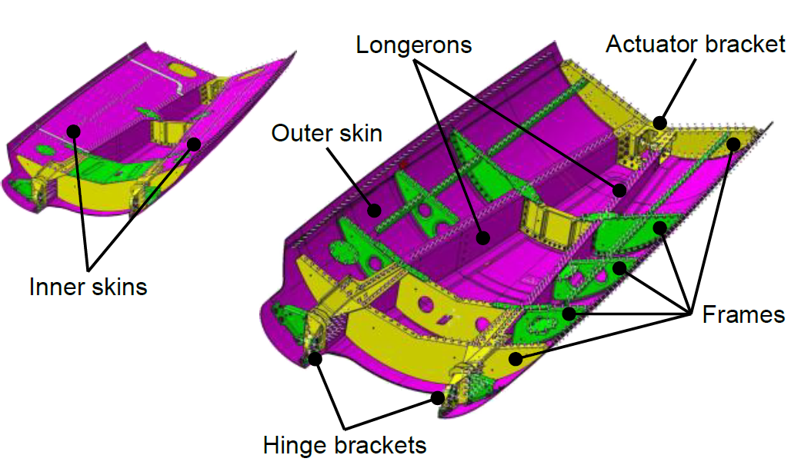

---

# Besonderheit FKV

<!-- _class: cols-2 -->

- Faserparallele Festigkeit sehr hoch
- Querzug- und interlaminare Festigkeit sehr niedrig
- → Krafteinleitung muss **fasergerecht** gestaltet sein

Häufig nimmt die Gestaltung und Erprobung von Krafteinleitungen den **größten Teil** einer Konstruktionsaufgabe ein.

> ⚠️ Obwohl FE-Modellierung möglich ist, ist immer ein **experimenteller Nachweis** an Prototypen notwendig – Betriebsfestigkeit ist rechnerisch nicht sicher genug vorherzusagen.

Weitere Konstruktionsaspekte:
- Fail-Safe-Verhalten / Reserve-Lastpfade
- Qualitätssicherung, Wartung, Reparatur
- Thermische Ausdehnung (FKV ↔ Metall)
- Kriech- und Relaxationsvorgänge der Matrix

---

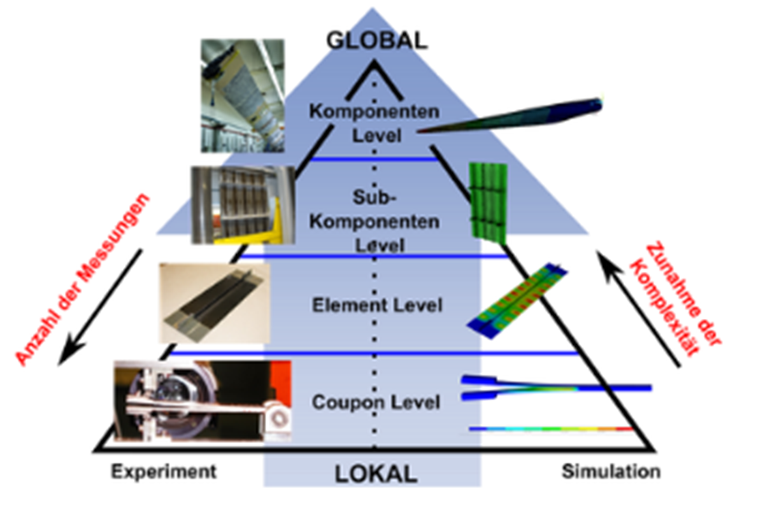

---

# Drei Verbindungsprinzipien

| Prinzip | Wirkung | Beispiele |
|---------|---------|-----------|
| **Stoffschluss** | Molekulare Bindung | Klebung |
| **Kraftschluss** | Reibung | Press-, Klemmverbindung |
| **Formschluss** | Geometrie | Schlaufe, Bolzen, Keil |

**Faustregeln zur Auswahl:**
- Hohe, punktförmige Last → **Schlaufe**
- Dicke Laminate, große Flächen → **Bolzen / gestufte Klebung**
- Dünne Laminate, große Klebfläche → **Klebung**

Verbindungstechniken werden auch kombiniert (z.B. Kleben + Nieten).

---

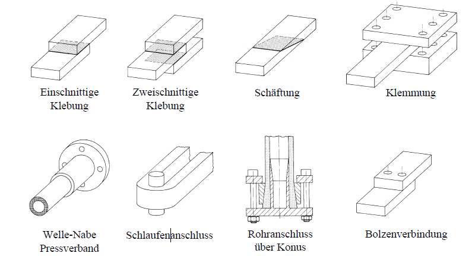

 
    Bild 21.1 aus H. Schürrmann "Konstruieren mit Faser-Kunststoff-Verbunden"

---

<!-- _class: lead -->

# Der Schlaufenanschluss

---

# Prinzip des Schlaufenanschlusses

UD-Faserstränge haben den Charakter von **Seilen** – höchste Belastbarkeit bei minimalem Gewicht, wenn sie ausschließlich in Faserrichtung belastet werden.

→ Umschlingen eines Bolzens: **Schlaufenanschluss** (*pin-loaded strap*)

> ❗ Nur einsetzen wenn hohe Kräfte **punktuell** eingeleitet werden müssen. Die aufwändige Herstellung ist der wesentliche Nachteil.

**Höchste Festigkeiten** durch sorgfältigst manuell gelegte Stränge. Prepregstreifen besonders geeignet (Arbeitshygiene, zähmodifizierte Harze).

---

# Anwendungen des Schlaufenanschlusses

<!-- _class: cols-2 -->

- Hubschrauber-Rotorblattanschlüsse (Fliehkraft)
- Trag- und Lasteinleitungselemente in Hängeisolatoren
- Tieftemperatur-Behälterhalterungen (GFK: elektrische Isolation)
- Funktionsintegration: Verdichterblätter als Schlaufe
- Spannelemente als Alternative zu Schraubverbindungen

> ✅ Vorteile der Schlaufe gegenüber Bolzenverbindung:
>
> - Kein Faserdurchtrennen
> - Volle faserparallele Festigkeit nutzbar (prinzipiell)
> - Sehr hohe Lastdichte

---

# Ausführungsformen

<!-- _class: cols-2 -->

> ❗ **Parallelschlaufe** (bevorzugt)
>
> Fasern laufen parallel um den Bolzen – kein Aufziehen. Günstigere Spannungsverteilung.

> ⚠️ **Augenschlaufe** (nur wenn unvermeidbar)
>
> Fasern werden erst spät zusammengeführt → zusätzliche **Aufziehspannungen**. Gegenmaßnahme: Querbandagierung.

Begriffe:
- **Schaft** – gerader paralleler Teil
- **Flanke** – Übergangsbereich zum Bolzen
- **Scheitel** – Umschlingungspunkt

---

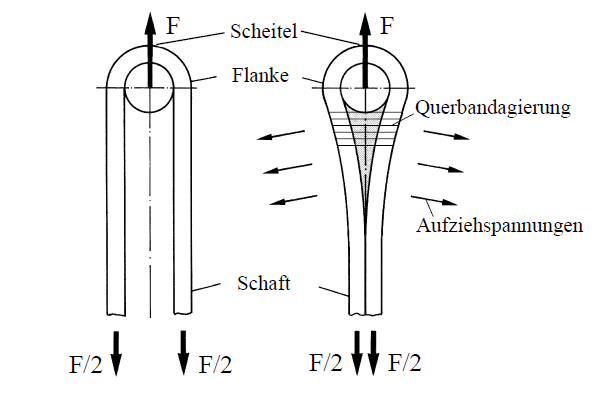

 
    Bild 21.2 aus H. Schürrmann "Konstruieren mit Faser-Kunststoff-Verbunden"

---

# Modell: Dickwandiges Rohr unter Innendruck

Zur analytischen Beschreibung des Umschlingungsbereichs eignet sich das Modell des **dickwandigen Rohres unter Innendruck**.

**Annahmen (UD-Parallelschlaufe):**
- Kräfte über Schlaufenbreite konstant verteilt
- Rotationssymmetrie → Spannungsänderung **nur radial**
- Reibung am Bolzen wird vernachlässigt
- Thermische und Quell-Eigenspannungen unberücksichtigt

**Koordinatensystem:** Polarkoordinaten $(r, \varphi)$

Lösung über drei Gleichungssysteme der Elasto-Statik: Gleichgewicht, Kinematik, Elastizitätsgesetze.

---

# Kräftegleichgewicht in Polarkoordinaten

$$r \frac{d\sigma_r}{dr} + \sigma_r - \sigma_t = 0$$

Tangential- und Radialspannungen sind über die radialen Abtriebskräfte der Tangentialkräfte **gekoppelt**.

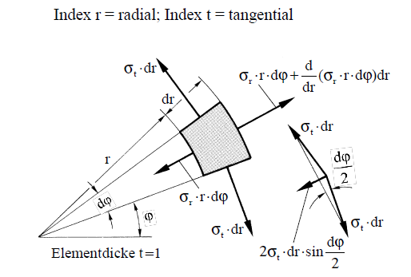

 
    Bild 21.3 aus H. Schürrmann "Konstruieren mit Faser-Kunststoff-Verbunden"

---

# Kinematische Beziehungen

$$\varepsilon_r = \frac{du}{dr} \qquad \varepsilon_t = \frac{u}{r}$$

Kompatibilitätsbedingung (Verschiebung $u$ eliminiert):

$$r\frac{d\varepsilon_t}{dr} + \varepsilon_t - \varepsilon_r = 0$$

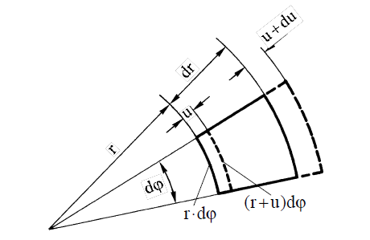

 
    Bild 21.4 aus H. Schürrmann "Konstruieren mit Faser-Kunststoff-Verbunden"

---

# Elastizitätsgesetze – zwei Fälle

<!-- _class: cols-2 -->

**Seitlich gestützt** → $\varepsilon_z = 0$

Dreiachsiger **Spannungs**zustand. Orthotropes Elastizitätsgesetz mit $\sigma_z \neq 0$:

$$\varepsilon_r = \frac{\sigma_r}{E_\parallel} - \nu_{\perp\parallel}\frac{\sigma_t}{E_\perp} - \nu_{\perp\parallel}\frac{\sigma_z}{E_\perp}$$

$$\varepsilon_z = 0 \Rightarrow \sigma_z \text{ aus Gleichung 3}$$

**Seitlich ungestützt** → $\sigma_z = 0$

Dreiachsiger **Dehnungs**zustand. Ebener Spannungszustand:

$$\varepsilon_r = \frac{\sigma_r}{E_\parallel} - \nu_{\perp\parallel}\frac{\sigma_t}{E_\perp}$$

$$\varepsilon_z = -\nu_{\parallel\perp}\frac{\sigma_r}{E_\parallel} - \nu_{\perp\perp}\frac{\sigma_t}{E_\perp}$$

---

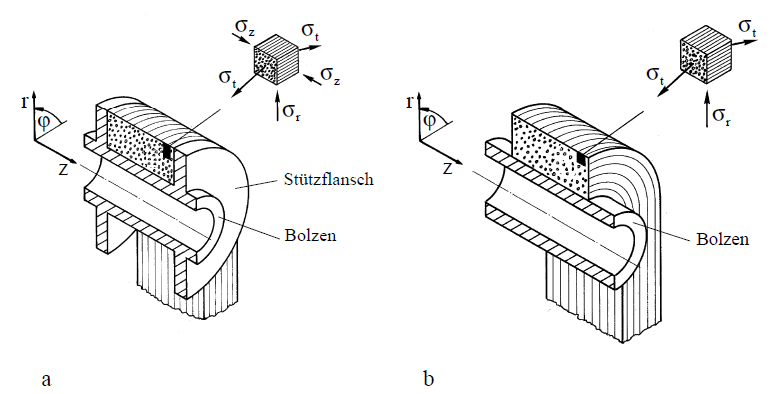

 
    Bild 21.5 aus H. Schürrmann "Konstruieren mit Faser-Kunststoff-Verbunden"

---

# Randbedingungen und Leibungsdruck

Am **Innenradius** $r_i$: Gleichgewicht zwischen Leibungsdruck und Radialspannung.

Am **Außenradius** $r_a$: kraftfreier Rand.

$$\sigma_r(r_i) = -p_i \qquad \sigma_r(r_a) = 0$$

$$p_i = \frac{F}{2\, r_i\, b}$$

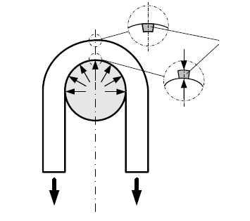

 
    Bild 21.6 aus H. Schürrmann "Konstruieren mit Faser-Kunststoff-Verbunden"

---

# Lösung der Euler-DGL

Einsetzen von Kinematik und Elastizitätsgesetzen ins Gleichgewicht liefert die homogene DGL 2. Ordnung:

$$r^2 \frac{d^2u}{dr^2} + r\frac{du}{dr} - \frac{E_\perp}{E_\parallel} u = 0$$

**Lösung für die radiale Verschiebung:**

$$u = C_1 \, r^{E_v} + C_2 \, r^{-E_v} \qquad \text{mit} \quad E_v = \sqrt{\frac{E_\perp}{E_\parallel}}$$

Koeffizienten $C_1$, $C_2$ aus den Randbedingungen. Daraus folgen $\sigma_r(r)$ und $\sigma_t(r)$.

---

# Ergebnis: Spannungsverteilung

<!-- _class: cols-2 -->

**Tangentialspannung** $\sigma_t$ (Zugspannung):
- Maximal am **Innenradius** $r_i$
- Klingt zum Schaft hin ab
- Über Scheitel → Flanke nahezu konstant

**Radialspannung** $\sigma_r$ (Druckspannung):
- Maximum am Innenradius: $\sigma_{r,\max} = -p_i$
- Verschwindet im Schlaufenschaft

**Mittlere Zugspannung** im Schaft (Bezugsgröße):

$$\bar{\sigma}_t = \frac{F/2}{b\,(r_a - r_i)}$$

> Am Schlaufen-Innenradius liegen **deutliche Spannungsüberhöhungen** vor. Die Faserfestigkeit kann nicht gleichmäßig über der Schlaufendicke ausgenutzt werden.

---

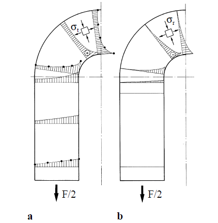

 
    Bild 21.7 aus H. Schürrmann "Konstruieren mit Faser-Kunststoff-Verbunden"

---

# Einfluss Radienverhältnis $r_a/r_i$

<!-- _class: cols-2 -->

- Größeres $r_a/r_i$ → stärkere Spannungsüberhöhung
- Beispiel GFK, $r_a/r_i = 2$: Überhöhungsfaktor **≈ 2** → Gütegrad nur **50 %**

> ⚠️ Eine einfache **Wanddickenerhöhung** steigert die Tragfähigkeit **nicht proportional** – die Spannungsspitze am Innenradius steigt mit!

→ Schlaufen möglichst **flach / riemenartig** gestalten!

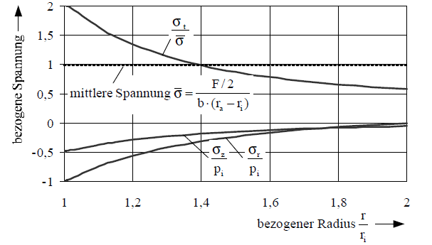

 
    Bild 21.8 aus H. Schürrmann "Konstruieren mit Faser-Kunststoff-Verbunden"

---

# Einfluss Orthotropiegrad $E_\parallel/E_\perp$

<!-- _class: cols-2 -->

- Großes $E_\parallel/E_\perp$ → große Spannungsüberhöhungen
- CFK-HM bei dieser Anwendung **ungünstig**
- GFK (kleines $E_\parallel/E_\perp$) ist günstigerer Schlaufenwerkstoff

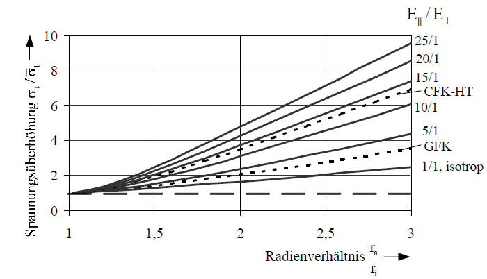

| Werkstoff | $E_\parallel/E_\perp$ | Charakter |
|-----------|----------------------|-----------|
| Isotrop | 1 | Optimal |
| GFK | ≈ 3–5 | Günstig |
| CFK-HT | ≈ 10–15 | Mittel |
| CFK-HM | ≈ 20–25 | Ungünstig |

> ⚠️ CFK trotzdem immer mitbetrachten – überlegene **Ermüdungsfestigkeit** und Vorteile am Ablaufpunkt.

 
    Bild 21.9 aus H. Schürrmann "Konstruieren mit Faser-Kunststoff-Verbunden"

---

# FE-Korrekturen – Unzulänglichkeit 1

**Innenradius-Spannungen werden überschätzt**

Die Schlaufe weitet sich **nicht als Rohr** auf, sondern folgt der Kontur des starren Bolzens.

→ Ein zusätzliches Moment biegt die Schlaufe auf den Bolzen zurück → Spannungen am Innenradius **sinken** gegenüber dem analytischen Modell.

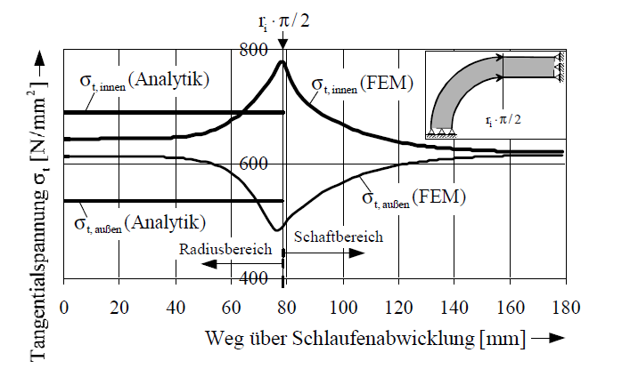

 
    Bild 21.10 aus H. Schürrmann "Konstruieren mit Faser-Kunststoff-Verbunden"

---

**Kritischer Bereich an der Bolzenflanke fehlt im Modell**

> Die **dimensionierende Spannung** tritt nicht am Scheitel, sondern am **Übergang Radius → gerader Schaft** auf (Bolzenflanke)!

Mechanismus: Unter Last dehnt sich die Schlaufe elastisch. Vormals auf dem Bolzen liegendes Material wandert in den Schaft → Zugbiegung → Spannungsüberhöhung.

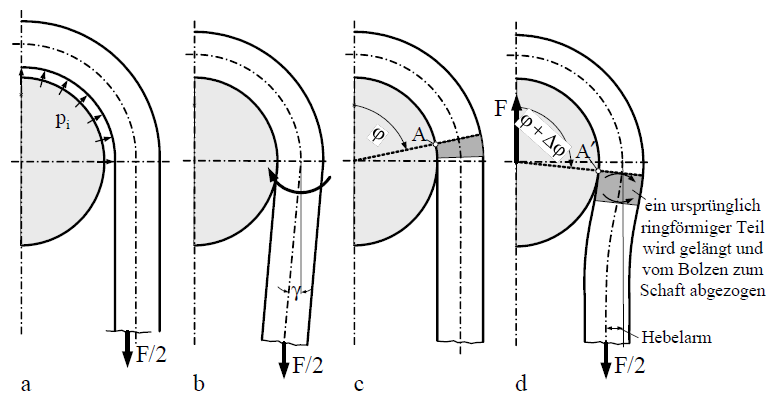

 
    Bild 21.11 aus H. Schürrmann "Konstruieren mit Faser-Kunststoff-Verbunden"

---

# Folgerungen aus der FE-Analyse

<!-- _class: cols-2 -->

**Hohe Dehnsteifigkeit günstig:**
- Weniger gebogenes Material verlässt den Bolzen
- Kleines Zusatz-Biegemoment
- → CFK-Vorteil an der Flanke

**Geringe Biegesteifigkeit am Ablaufpunkt günstig:**
- Kleines Rückbiegemoment
- → Geringe Schlaufendicke bevorzugen
- → Aufteilung in dünnere Einzelstränge

> ⚠️ **Empfehlung:**
>
> Den kritischen Bereich an der Bolzenflanke per **FE nachweisen**. Das analytische Modell ist zur Vorauslegung geeignet, erfasst aber nicht die dimensionierende Stelle.

---

# Festigkeitsanalyse – Versagensformen

<!-- _class: cols-2 -->

**Versagensform 1: Faserbruch (FB)**
durch Tangentialspannungen $\sigma_t$

→ gewünschte Versagensform, nutzt Leichtbauvorteil

**Versagensform 2: Zwischenfaserbruch (ZfB)**
durch Radialdruckspannungen $\sigma_r^-$

Die äußeren Schichten pressen die inneren auf den Bolzen → hohe $\sigma_\perp^-$ → Scherbruch ($R_{A\perp\perp}$ überschritten)

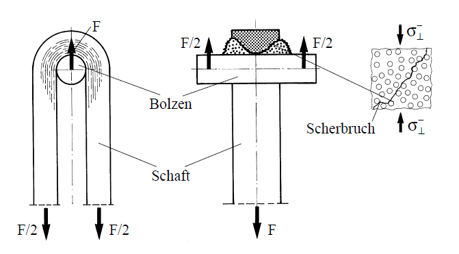

> ❗ ZfB ist **unbedingt zu vermeiden** – nur bei Faserbruch wird der Leichtbauvorteil genutzt!

 
    Bild 21.12 aus H. Schürrmann "Konstruieren mit Faser-Kunststoff-Verbunden"

---

# Einfluss der seitlichen Stützung

Rechenergebnisse für $r_a/r_i = 1{,}55$:

| Werkstoff | Ungestützt [N/mm²] | Gestützt [N/mm²] | Faktor |
|-----------|-------------------|------------------|--------|
| UD-GFK (E-Glas) | 336 | 1320 | 3,9 |
| UD-Aramid | 254 | 1005 | 4,0 |
| UD-CFK-HT | 347 | 876 | 2,5 |
| UD-CFK-HM | 244 | 393 | 1,6 |

> ✅ Seitliche Stützung steigert die Tragfähigkeit um den **Faktor 3–4**. Immer vorsehen!

Bei gestützten Schlaufen bestimmt **Faserbruch** (nicht ZfB) das Versagen → Leichtbauvorteil wird genutzt.

---

# Maßnahme 1: Schlaufenkaskade

<!-- _class: cols-2 -->

Dicke Schlaufe → mehrere dünne, riemenartige Einzelschlaufen.

**Vorteile:**
- Jede Einzelschlaufe hat günstiges $r_a/r_i$
- Gezieltes **Fail-Safe-Verhalten** (Versagensreihenfolge)
- PTFE-Folie zwischen Strängen → Relativverschiebung möglich
- Gleichmäßigere Kraftaufteilung

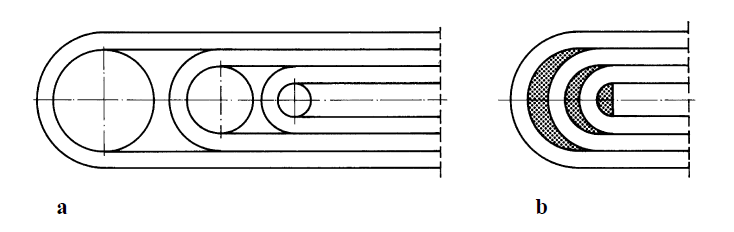

**Nachteile:**
- Aufwändige Anschlussstücke
- Statisch unbestimmtes Problem → Querschnitte aufeinander abstimmen

 
    Bild 21.13 aus H. Schürrmann "Konstruieren mit Faser-Kunststoff-Verbunden"

---

# Maßnahme 2: Mehrschichtige Schlaufe

<!-- _class: cols-2 -->

Schlaufe in dünne, **nicht miteinander verbundene** riemenförmige Streifen unterteilt.

**Ergebnisse:**
- Gütegrade **> 80 %** (vs. kompakte Schlaufe)
- Versagenslasten **+29 %** gegenüber kompakt
- Bolzendurchmesser > 25 mm → Festigkeit nahezu unabhängig vom Durchmesser
- PTFE-Streifen zwischen Schichten → geringe Reibung

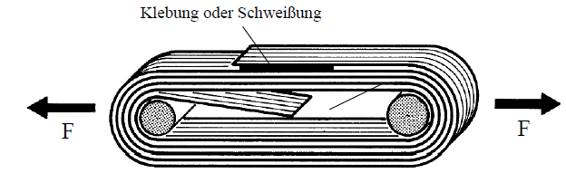

 
    Bild 21.14 aus H. Schürrmann "Konstruieren mit Faser-Kunststoff-Verbunden"

---

# Maßnahme 3: Hybridschlaufe

<!-- _class: cols-2 -->

**Prinzip:**
- GFK **innen** (dehnweich)
- CFK **außen** (steif)

**Zwei Effekte:**
1. Mittleres $E_\parallel/E_\perp$ gesenkt
2. Günstigeres Radienverhältnis je Streifen

> ⚠️ Nur bei **großen Radienverhältnissen** sinnvoll. Bei kleinen $r_a/r_i$ lohnt sich die Kombination nicht.

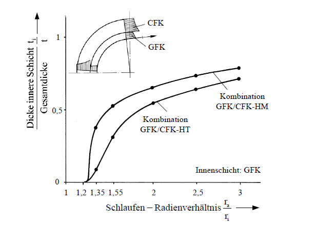

 
    Bild 21.15 aus H. Schürrmann "Konstruieren mit Faser-Kunststoff-Verbunden"

---

# Maßnahme 4: Rissstopperschichten

<!-- _class: cols-2 -->

**Zwischenlagen** verhindern Abscheren durch $\tau_{\perp\perp}$-Beanspruchung und wirken als Rissstopper bei Faserbruch.

Mögliche Faserorientierungen:
- 0°/90°
- ±45°
- z.B. Aramidgewebe

> ✅ Zeitfestigkeit bis zum **Faktor 1000** steigerbar!

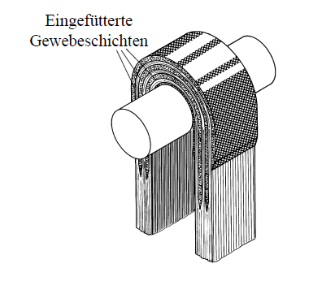

 
    Bild 21.16 aus H. Schürrmann "Konstruieren mit Faser-Kunststoff-Verbunden"

---

# Konstruktionslösung: Rotorblattanschluss Bo 105

<!-- _class: cols-2 -->

- Hubschraubers Bo 105
- Schlaufe eng in Titan-Fitting eingepasst
- Fliehkraft $F_x$ direkt in der Schlaufe
- Biegemoment aus Schwenkbewegung → Querkraftschub auf die Schlaufe
- Lösung: **Doppelschlaufe** bei Folgemodellen

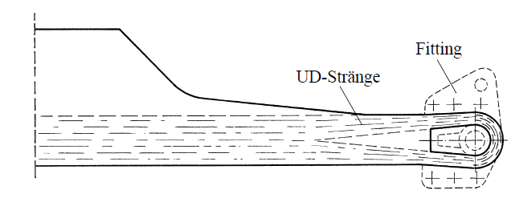

 
    Bild 21.17 aus H. Schürrmann "Konstruieren mit Faser-Kunststoff-Verbunden"

---

# Ausleiten in flächige Strukturen

<!-- _class: cols-2 -->

Schlaufenstränge in der Fläche **verspreizen** → große Klebfläche.

**Regeln:**
- Stränge abstufen → kein Steifigkeitssprung
- UD-Stränge zwischen Einzelschichten des Laminats verteilen
- Stränge straff und ondulationsfrei ausrichten
- Keine Schälbeanspruchung durch Bolzenlast-Komponenten in Bolzenachse

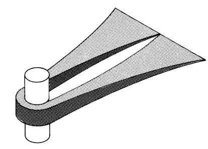

 
    Bild 21.19 aus H. Schürrmann "Konstruieren mit Faser-Kunststoff-Verbunden"

---

# Einleitung von Biegemomenten

<!-- _class: cols-2 -->

**Einzelschlaufe:** nur bei reiner Zug- oder Druckbelastung eindeutig.

Bei Biegung → Querkraftschub → unerwünschte Punktbelastungen.

**Doppelschlaufe:** Momentenäquivalentes Kräftepaar in die beiden Einzelschlaufen eingeleitet.

→ Füllstück als Schubwand und Knickstütze bei Druckbeanspruchung

*Option 1*
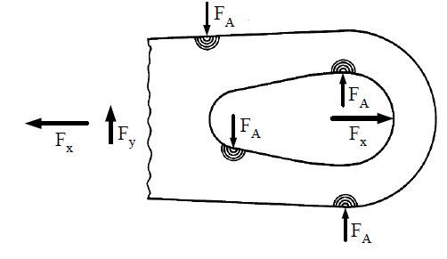
*Option 2*
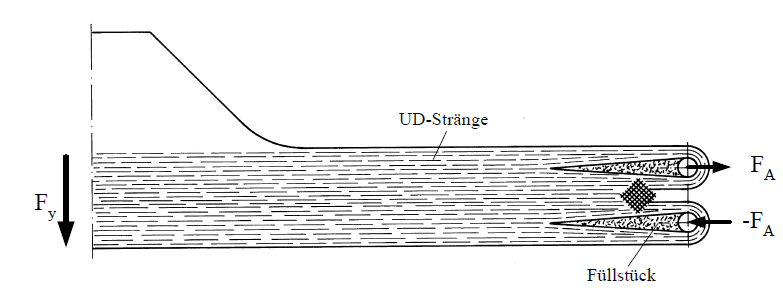

 
    Bild 21.20 und Bild 21.21 aus H. Schürrmann "Konstruieren mit Faser-Kunststoff-Verbunden"

---

# Druckbeanspruchte Schlaufen

<!-- _class: cols-2 -->

Druckkräfte werden **nicht über den Bolzen**, sondern über Druckstücke am Außenradius eingeleitet.

**Konstruktionsmerkmale:**
- Druckstücke nehmen Druckkräfte auf
- Schlaufe seitlich gestützt (Kammern)
- Kaskadenförmige Ausführung
- Gerade Schäfte auf Knicken prüfen

> Hybridaufbau bringt bei druckbeanspruchten Schlaufen **keine** Verbesserung.

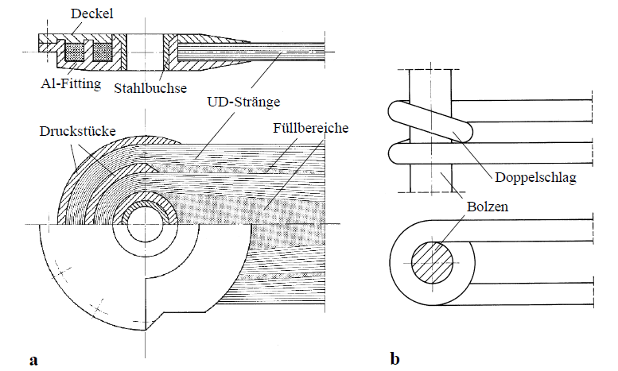

 
    Bild 21.27 aus H. Schürrmann "Konstruieren mit Faser-Kunststoff-Verbunden"

---

# Gestaltungsregel: Bolzensitz

<!-- _class: cols-2 -->

> ⚠️ **Bolzen zu klein** → Schlaufe wird lokal auf den Bolzen gebogen → Aufziehspannungen → **Delamination**

Abhilfe:
- Bolzen eng in der Schlaufe
- Alternativ: Vorspannung

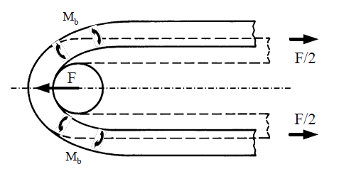

 
    Bild 21.28 aus H. Schürrmann "Konstruieren mit Faser-Kunststoff-Verbunden"

---

# Gestaltungsregeln – Schlaufenanschluss

<!-- _class: cols-2 -->

**Aus der Spannungsanalyse:**
- Parallelschlaufe bevorzugen
- $r_a/r_i$ klein halten → Breite $b$ vergrößern
- $E_\parallel/E_\perp$ klein (GFK günstiger)
- FE-Analyse am Ablaufpunkt unbedingt
- Geringe Schlaufendicke → biegeweich am Ablaufpunkt
- PTFE-Folie bei Kaskadenausführung

**Aus der Festigkeitsanalyse:**
- Seitliche Stützung **immer** vorsehen
- Alternativ: Rissstopperzwischenlagen
- Bolzen eng / vorgespannt
- Mindestens 2 Bolzen (Momentenaufnahme)

---

<!-- _class: lead -->

# Bolzenverbindungen

---

# Wann Bolzenverbindungen?

<!-- _class: cols-2 -->

- Flächige, **dickwandige**, hoch belastete Strukturen
- Verbindung **ungleichartiger Werkstoffe** (FKV–Metall)
- Wenn **lösbare** Verbindung erforderlich
- Alternative zu Schlaufen bei großen verfügbaren Flächen

> ✅ Trotz Faserdurchtrennung hat sich die Bolzenverbindung in der FKV-Technik **ausgezeichnet bewährt** – analog zu Holz, das genagelt und verschraubt wird.

**Bolzendurchmesser-Faustregel:**

$$d \approx t_\text{Fügeteil}$$

Bei $t < 6\,\text{mm}$: $d$ tendenziell größer als $t$.

---

# Vorteile der Bolzenverbindung

- Einfache Qualitätssicherung (visuelle Kontrolle)
- Geringer Ermüdungsfestigkeitsabfall (vs. Metall)
- Kein schlagartiges Versagen möglich
- Energieabsorption durch Laminatdurchziehen
- Keine Reibkorrosion (vs. Al-Bolzenfügungen)
- **Mischfügung** mit Klebung: Lebensdauer ×3, Karosseriesteifigkeit ↑
- Kein Nachpolymerisieren notwendig

---

# Nachteile der Bolzenverbindung

<!-- _class: cols-2 -->

- Fasern werden durchtrennt → Kerbwirkung + Querschnittsreduktion
- Gütegrad des ungestörten Laminats **nicht erreichbar**
- Zusatzgewicht durch Überlappungen / Doppler
- Metallische Bolzen + CFK → **elektrochemische Korrosion** beachten
- Senkköpfe stören glatte Oberflächen (aerodynamisch)

> ⚠️ Der Gütegrad einer Bolzenverbindung wird von zwei Effekten gleichzeitig begrenzt:
>
> 1. Nettoquerschnitt durch Bohrung vermindert
> 2. Kerbwirkung am Bohrungsrand

---

# Fügungsarten

| Fügungsart | Schnittigkeit | Bolzenbiegung |
|---|---|---|
| Überlappung | einschnittig | ja |
| Laschenf. | einschnittig | ja |
| Überlapp. 2-schn. | zweischnittig | nein |
| Laschenf. 2-schn. | zweischnittig | nein |

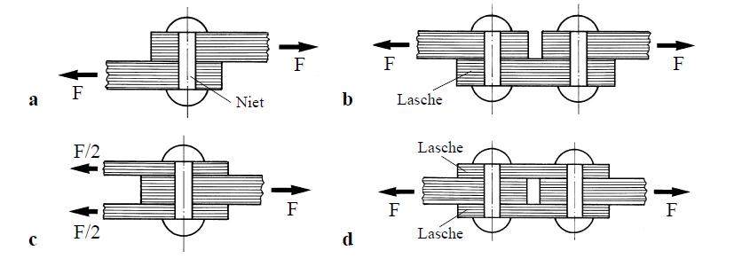

 
    Bild 22.1 aus H. Schürrmann "Konstruieren mit Faser-Kunststoff-Verbunden"

---

# Übersicht: Versagensformen

**Ziel:** Lochleibungsversagen anstreben – alle anderen Formen konstruktiv ausschließen.

| Versagensform | Ursache | Abhilfe |
|---|---|---|
| **Lochleibung** *(angestrebt)* | Druckbelastung Bohrungsrand | $d\cdot t$ groß, 0°-Fasern |
| Flankenzugbruch | Kleiner Restquerschnitt | $w \geq 5d$ |
| Scherbruch | Kleiner Randabstand | $e \geq 3d$ |
| Spaltbruch | Geringe Querfestigkeit | $e \geq 3d$, 90°/±45° |
| Komb. Scher-/Zugbruch | Kombination | $e \geq 3d$, $w \geq 5d$ |

---

#  Lochleibungsversagen

$$F_{ult} = \hat{R}_L \cdot d \cdot t$$

**Merkmale:**
- Bohrung weitet sich auf, kein Trennbruch
- Gutmütiges Verhalten, hohe Energieaufnahme
- Dimensionierungsziel: alle anderen Versagen vermeiden

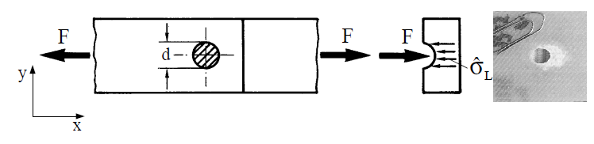

 
    Bild 22.5 aus H. Schürrmann "Konstruieren mit Faser-Kunststoff-Verbunden"

---

# Bestimmung der Lochleibungsfestigkeit

<!-- _class: cols-2 -->

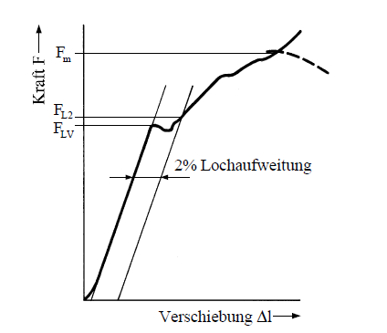

**Definition:**
- $\hat{R}_{L2}$: Kraft bei 2 % Lochaufweitung (Offset-Festigkeit)
- $\hat{R}_{Lm}$: Maximalkraft

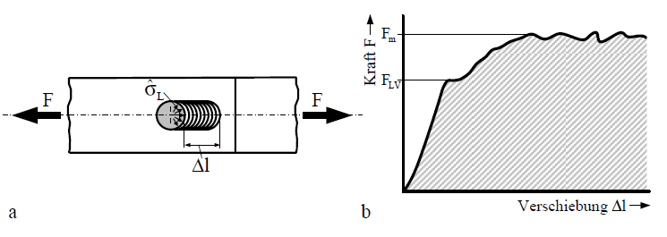

> ✅ Gezielte Nutzung zur **Energieabsorption**: Bolzen über längere Strecke durch das Laminat ziehen → Fläche unter Last-Weg-Kurve = absorbierte Energie

 
    Bilder 22.6 und 22.7 aus H. Schürrmann "Konstruieren mit Faser-Kunststoff-Verbunden"

---

# Flankenzugbruch

$$F_{ult} = \hat{R}_x^+ \cdot (w - d) \cdot t$$

Ursachen:
- Querschnittsreduktion durch Bohrung
- Kerbwirkung am Bohrungsrand (Formfaktor $\alpha_K$)

**Abhilfe:**
- $w \geq 5d$
- Höherer 0°-Faseranteil

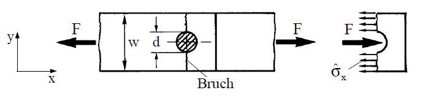

 
    Bild 22.8 aus H. Schürrmann "Konstruieren mit Faser-Kunststoff-Verbunden"

---

#  Scherbruch

<!-- _class: cols-2 -->

$$F_{ult} = \hat{R}_{xy} \cdot 2e \cdot t$$

Ursachen:
- Zu geringer Randabstand $e$
- Geringer ±45°-Anteil

**Abhilfe:**
- $e \geq 3d$
- ±45°-Schichten erhöhen $\hat{R}_{xy}$ und senken Formfaktor

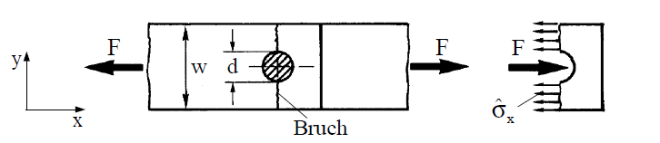

 
    Bild 22.9 aus H. Schürrmann "Konstruieren mit Faser-Kunststoff-Verbunden"

---

#  Spaltbruch

$$F_{ult} = \hat{R}_y^+ \cdot (e - d/2) \cdot t \cdot 2$$

Ursachen:
- Geringe Querfestigkeit (reine 0°-Anordnung)
- Presssitz des Bolzens (Innendruck auf Lochrand)

**Abhilfe:**
- 90°- oder ±45°-Fasern
- $e \geq 3d$

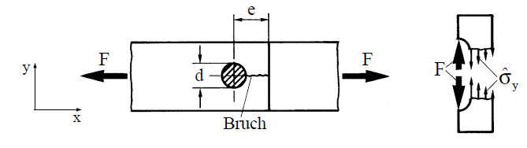

 
    Bild 22.10 aus H. Schürrmann "Konstruieren mit Faser-Kunststoff-Verbunden"

---

##  Kombinierter Scher-/Flankenzugbruch

$$F_{ult} = \frac{1}{2}\hat{R}_x^+(w-d)t + \hat{R}_{xy}(e-d/2)t$$

Verbesserungsmaßnahmen analog zu Scher- und Flankenzugbruch.

> ⚠️ Mindestabstände einhalten → Lochleibungsversagen tritt automatisch auf:
>
> $e \geq 3d$, $w \geq 5d$, $p \geq 4d$

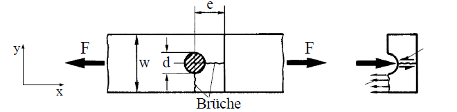

 
    Bild 22.11 aus H. Schürrmann "Konstruieren mit Faser-Kunststoff-Verbunden"

---

# Optimaler Laminataufbau

<!-- _class: cols-2 -->

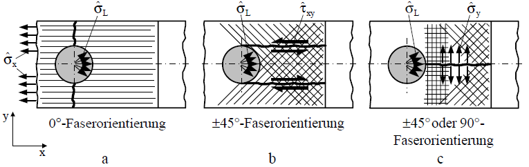
> ✅ Optimaler 0°-Anteil: **~50 %** bei $(0/{\pm}45)$. Klassischer Aufbau: $(0/{\pm}45/90)_{50/40/10}$.

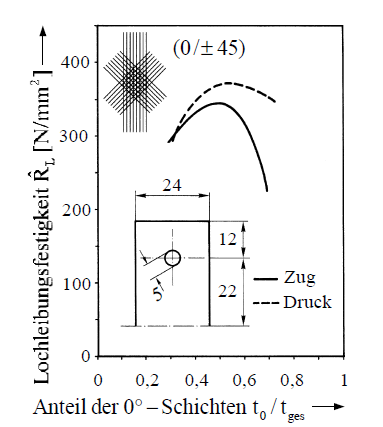

 
    Bilder 22.12 und 22.13 aus H. Schürrmann "Konstruieren mit Faser-Kunststoff-Verbunden"

---

# Mindestabstände

$(0/{\pm}45/90)_{50/40/10}$:

| Abstand | Mindestmaß |
|---------|------------|
| Randabstand $e$ | $\geq 3d$ |
| Seitlicher Abstand $w$ | $\geq 5d$ |
| Bolzenabstand (Reihe) $p$ | $\geq 4d$ |
| Kantenabstand seitlich | $\geq 2{,}5d$ |

Bei anderen Laminattypen sind Mindestabstände experimentell zu bestimmen!

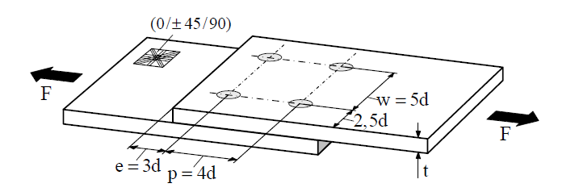

 
    Bild 22.2 aus H. Schürrmann "Konstruieren mit Faser-Kunststoff-Verbunden"

---

# Einfluss des Randabstands $e/d$

<!-- _class: cols-2 -->

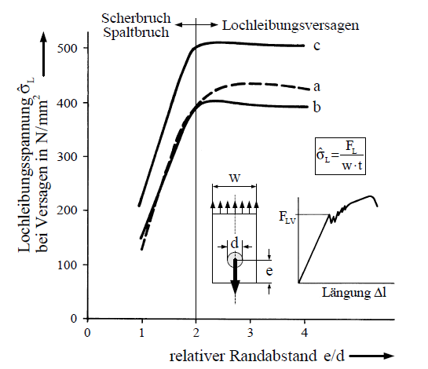

Deutlicher Umschlag des Versagensmodus bei $e/d \approx 2$:

- $e/d < 2$: Scherbruch oder Spaltbruch
- $e/d \geq 3$: Lochleibungsversagen

Ab $e/d \geq 3$ ist keine weitere Steigerung durch Vergrößern von $e$ möglich.

> ✅ FKV: $e/d \geq 3$ (vs. Metall: $e/d \geq 2$)

 
    Bild 22.3 aus H. Schürrmann "Konstruieren mit Faser-Kunststoff-Verbunden"

---

# Einfluss des seitlichen Abstands $w/d$

<!-- _class: cols-2 -->

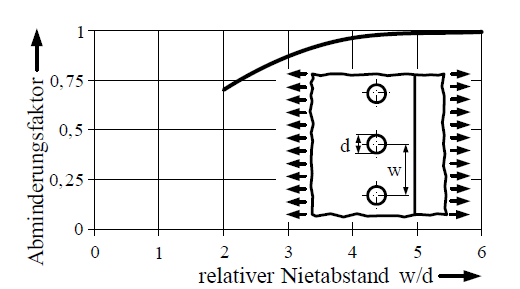

Bei $w/d < 5$ überlappen sich die Spannungsfelder benachbarter Bohrungen → **Abminderung** der übertragbaren Kraft notwendig.

Faustregel: $w/d \geq 5$

Bei engerem Setzen: Kraft nach Diagramm abmindern.

 
    Bild 22.4 aus H. Schürrmann "Konstruieren mit Faser-Kunststoff-Verbunden"

---

# Einflüsse auf die Lochleibungsfestigkeit

<!-- _class: cols-2 -->

- ↑ 0°-Faseranteil (optimal: 50 %)
- Bolzendurchmesser $d$: kein eigenständiger Einfluss auf **spez.** Festigkeit
- ↑ Temperatur → $\hat{R}_L$ sinkt (bei 123°C ca. **65 %** von 23°C-Wert)
- Übergangspassung H7/j6 → bis **20 %** höhere $\hat{R}_L$ vs. Spielpassung

**Steigerung durch Anpressdruck:**

$$F_{ult} = \hat{R}_L \cdot d \cdot t + \mu_0 \cdot F_V$$

mit $\mu_0 \approx 0{,}1{-}0{,}2$ (Stahl/FKV)

> ⚠️ Nur nutzbar wenn Vorspannung **langzeitig** erhalten bleibt (Kriech- und Relaxationsprüfung!). Sonst konservativ: nur Lochleibungsanteil ansetzen.

---

# Steigerung durch Anpressdruck – Versuchsdaten

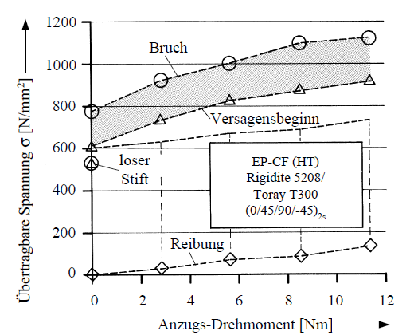

 
    Bild 22.16 aus H. Schürrmann "Konstruieren mit Faser-Kunststoff-Verbunden"

---

# Optimierungsmaßnahmen – Seitliche Stützung

<!-- _class: cols-2 -->

Große **Unterlegscheiben** wirken als Nebenschluss:
- Kräfte laufen vermehrt über steife Scheiben
- Rissgefährdeter Bohrungsrand wird entlastet
- Gleichmäßigere Druckspannungsverteilung über Lochranddicke

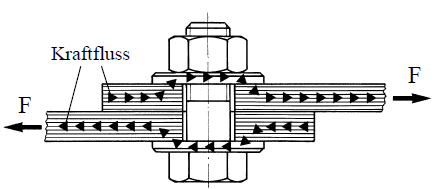

 
    Bild 22.17 aus H. Schürrmann "Konstruieren mit Faser-Kunststoff-Verbunden"

---

# Optimierungsmaßnahmen – Moulded-in holes

<!-- _class: cols-2 -->

Löcher **vor dem Aushärten** stechen statt bohren → Fasern werden umgeleitet, nicht durchtrennt.

**Vorteile:**
- Nettoquerschnitt nicht vermindert
- Keine Schubrisse von Bohrungsrändern
- Schwingfestigkeit deutlich erhöht

**Einschränkungen:** Bei Duroplasten aufwändig; einfacher bei Thermoplasten (lokales Aufheizen).

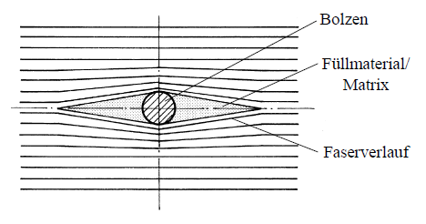

 
    Bild 22.18 aus H. Schürrmann "Konstruieren mit Faser-Kunststoff-Verbunden"

---

# Optimierungsmaßnahmen – Einlegeelemente

<!-- _class: cols-2 -->

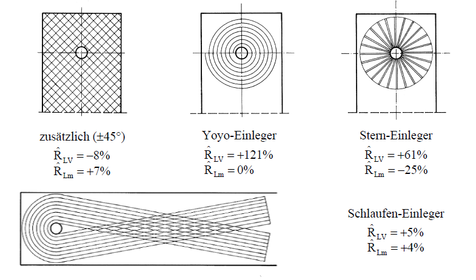

| Einleger | $\hat{R}_{LV}$ | $\hat{R}_{Lm}$ |
|---|---|---|
| Schlaufen-Einleger | +5 % | +4 % |
| Yoyo-Einleger | +121 % | 0 % |
| **Stern-Einleger** | **+61 %** | **−25 %** |
| Zusätzl. ±45° | −8 % | +7 % |

> ✅ **Stern-Einleger** ist wirksamster Einleger für $\hat{R}_{LV}$ (Versagensbeginn).

 
    Bild 22.19 aus H. Schürrmann "Konstruieren mit Faser-Kunststoff-Verbunden"

---

# Einlaminierte Metallfolien – Prinzip

<!-- _class: cols-2 -->

**Idee:** Nicht einfach Metallfolien hinzufügen, sondern **schwache Laminatschichten ersetzen** (90°- und ±45°-Lagen) ohne aufzudicken.

**Folienwerkstoffe:**
- Ti6Al4V (geringere Dichte, passender $\alpha_T$)
- Rostfreier Stahl 1.4310 (höhere Festigkeit)

**Schlüsselfaktor:** Sichere Verklebung der Metallfolien! Sorgfältige Oberflächenbehandlung vor dem Einlaminieren.

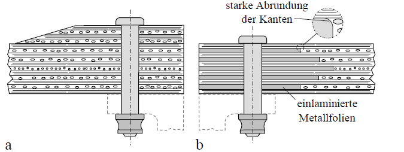

 
    Bild 22.20 aus H. Schürrmann "Konstruieren mit Faser-Kunststoff-Verbunden"

---

# Einlaminierte Metallfolien – Ergebnisse

<!-- _class: cols-2 -->

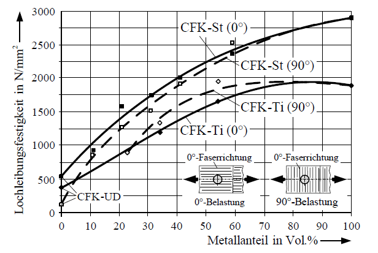

Bei mittleren Metallanteilen **überproportionale** Steigerung der Lochleibungsfestigkeit.

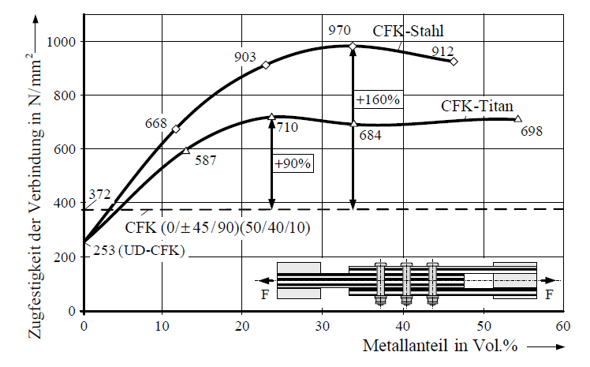

Gegenüber FBL-Laminat: **Ti +90 %**, **St +160 %** an Zugfestigkeit der Verbindung.

> ⚠️ Dichtebezogen: Vorteile geringer. Leichtbauoptimum bei ~20 % Stahlanteil.

 
    Bilder 22.21 und 22.24 aus H. Schürrmann "Konstruieren mit Faser-Kunststoff-Verbunden"

---

# Zur Auswahl geeigneter Niete – Korrosion

Elektrochemische Korrosion bei CFK + Metall durch Potentialdifferenz in Elektrolyt:

| Werkstoffpaarung | Potentialdiff. [V] | Eignung für CFK |
|---|---|---|
| C-Faser / TiAl6V4 | 0,33 | ✅ |
| C-Faser / Rostfreier Stahl | 0,27 | ✅ |
| C-Faser / Unlegierter Stahl | 0,57 | ❌ |
| C-Faser / Aluminium | 0,90 | ❌ |
| C-Faser / Cadmium | 0,89 | ❌ |

> ⚠️ Grenzwert: max. **0,4 V** Potentialdifferenz. CFK + Aluminium-Niete → **ungeeignet**!

---

# Niete – Typen und Auswahl

<!-- _class: cols-2 -->

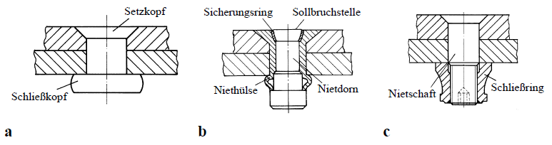

a Senkkopf-Vollniet, b Senkkopf-Blindniet, c Senkkopf-Passniet

- Vollniete: niedrige bis mittlere Belastung
- Blindniete: einseitige Zugänglichkeit, automatisierbar
- Passniete: mittlere und hohe Belastung

> ⚠️ **Senkköpfe** wenn möglich vermeiden:
> - Gefahr des Ausknöpfens
> - Geringerer Lochleibungsanteil im konischen Bereich
> - Unterlegscheibe auf Schließkopfseite bei FKV vorsehen

 
    Bild 22.25 aus H. Schürrmann "Konstruieren mit Faser-Kunststoff-Verbunden"

---

# Senkkopf-Lochleibung und Passungstoleranz

<!-- _class: cols-2 -->

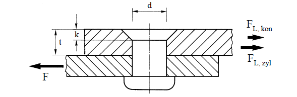

$$F_{L,\text{zyl}} = d \cdot (t-k) \cdot \hat{R}_L$$
$$F_{L,\text{kon}} = d \cdot k \cdot \alpha \cdot \hat{R}_L$$

**Passungstoleranz Bohrung–Niet:**

- Bei Metall: Übergangspassung günstig → günstiger Eigenspannungszustand
- Bei FKV: **Pressübermaß vermeiden** → Delamination durch Schälspannungen

**Lösung:** Hülse vor dem Niet einsetzen → Presssitz zum Niet, kein Übermaß im Laminat.

**Bohrungshinweise:**
- Senkrecht bohren (max. 1° Abweichung)
- Übermaß $\leq 0{,}1$ mm
- Unterlage auf Durchtrittsseite → Delamination verhindern

 
    Bild 22.26 aus H. Schürrmann "Konstruieren mit Faser-Kunststoff-Verbunden"

---

# Mehrreihige Bolzenverbindungen – Grundlagen

Bei mehrreihigen Fügungen ist die **Lastverteilung statisch unbestimmt**.

<!-- _class: cols-2 -->

**Zwei Lastfälle:**

**Bruchlast (quasi-statisch):** Plastische Umlagerung → alle Niete tragen gleich → Addition der Versagenslasten.

**Betriebslast (elastisch):** End-Niete höher belastet.

**Extremfälle:**
- Unendlich starre Niete → nur Endniete tragen
- Sehr nachgiebige Niete → $P_j = F/n$

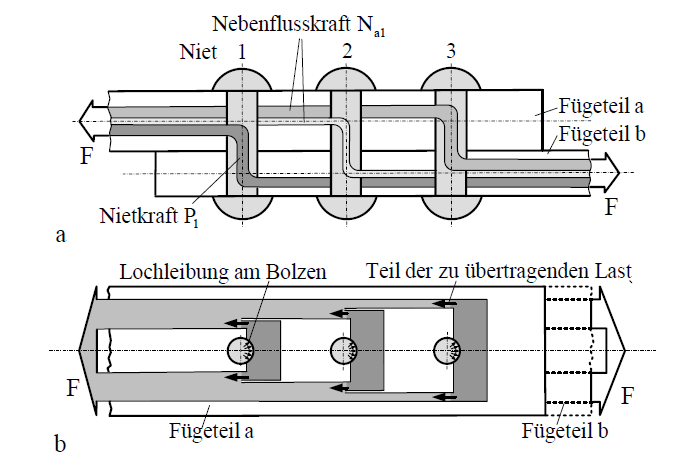

 
    Bild 22.27 aus H. Schürrmann "Konstruieren mit Faser-Kunststoff-Verbunden"

---

# Analytisches Verfahren nach Franz

Matrixsystem für Nietkräfte $\{P\}$:

$$[C] \cdot \{P\} = \{B\}$$

$$\{P\} = [C]^{-1} \cdot \{B\}$$

Die Matrix $[C]$ enthält Nietnachgiebigkeiten $C_j = u_j/P_j$ und Fügeteil-Nachgiebigkeiten $K_{aj}$, $K_{bj}$.

Der Vektor $\{B\}$ enthält äußere Lasten und Temperaturterme $(\alpha_a - \alpha_b)\Delta T$.

---

# Nietkraftverteilung – Ergebnisse

<!-- _class: cols-2 -->

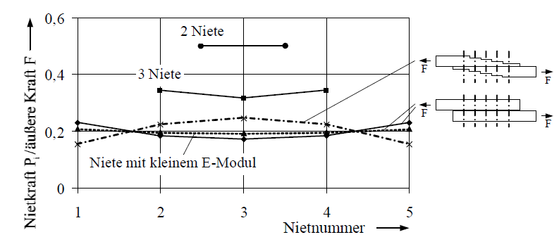

Durch Stufung der Fügeteile lässt sich die Verteilung **umkehren** – Endniete entlasten.

> ✅ **Praktische Regel:** Bei zweireihiger Fügung tragen **beide Niete je 50 %** der Last. Für viele Fälle ausreichend!

**Immer mindestens 2 Bolzen setzen** – sonst kein Moment übertragbar (Drehpunkt!).

 
    Bild 22.31 aus H. Schürrmann "Konstruieren mit Faser-Kunststoff-Verbunden"

---
