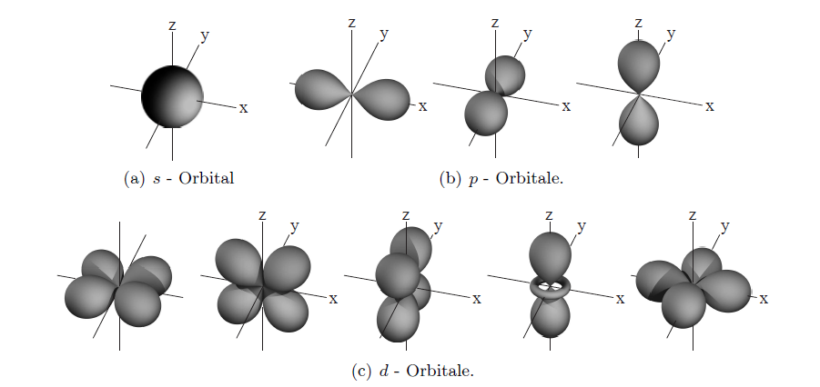
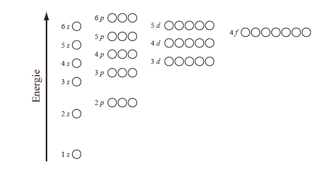
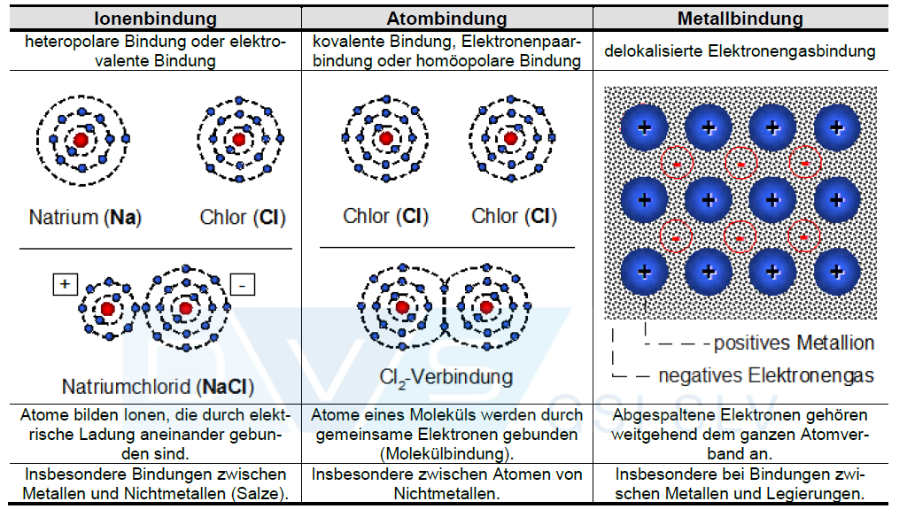
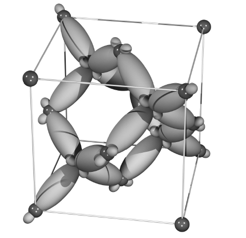
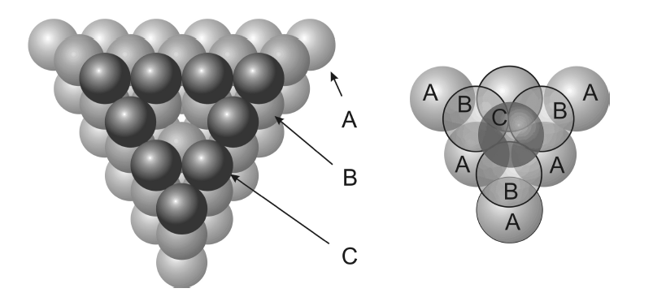
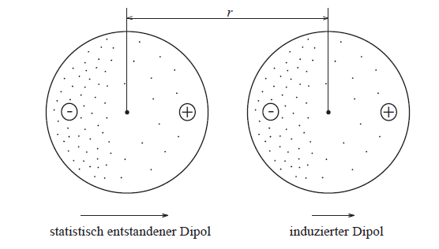

##  Fracture & Fatigue - Atomic Bonding
Prof. Dr.-Ing. Christian Willberg 

 

Contact: christian.willberg@h2.de

---

<!--paginate: true-->

# Learning Objectives

- Understand the concept of **ideal strength** and explain deviations from real material strength
- Describe the structure and mechanism of **dislocations** in crystals
- Physically understand the **Burgers vector** and apply it to crystal structures
- Know and compare different **strengthening mechanisms** in metals
- Assign practical **applications** in engineering to the relevant mechanisms

---

## Atomic Structure and Electron Shells

**Atomic structure:**
- Positively charged nucleus
- Negatively charged electrons in electron shells

---

## Atomic Models

- Rutherford *"Solar System Model"*
    - Too simplified
    - Assumes electrons move in fixed orbits or shells
- Schrödinger *"Orbital Model"*
    - Regions of defined spatial probability
    - Derived from wave functions

---

**Electron shells:**
- Ordered in increasing distance from the nucleus
- Limited number of electrons per shell
- Outer shells: higher energy, weaker binding to nucleus
- **Only outer electrons participate in chemical bonding**

**Electron orbitals:**
- Electrons are not localizable → probability of location
- Region: electron cloud or orbital
- Spherically symmetric and directional orbitals
- Each orbital: maximum 2 electrons

---

 
    Images from "Werkstoffkunde" lecture –
Joachim Rösler, Sebastian Piegert,
Britta Laux, Michaela Necker,
TU Braunschweig

---

## Electron Shells and the Periodic Table

| Shell | Orbitals | Max. Electrons | Examples |
|-------|----------|----------------|---------|
| K-shell | 1s | 2 | H, He |
| L-shell | 2s, 2p | 8 | Li to Ne |
| M-shell | 3s, 3p, 3d | 18 | Na to Ar |

**Filling rule:** From inner to outer shells according to the energy scheme

**Energetically favorable:** Completely filled shells
- **Noble gases** (He, Ne, Ar): full shells → barely chemically reactive, **almost inert**
- **Fluorine**: 7 valence electrons → very reactive (wants the 8th electron)

---
# Conduction Band vs. Orbitals

## Atomic Orbitals (single atom)
- **Discrete energy levels** (1s, 2s, 2p, 3s, 3p, ...)
- Electrons are **bound to individual atoms**
- **Fixed, sharp energy values**
- Electrons **localized** at the atom

## Energy Bands (solid)
- **Quasi-continuous energy regions**
- Arise from **overlap and splitting** of atomic orbitals
- From N atoms → N closely spaced energy levels
- At 10²³ atoms → practically continuous band

---

---

## Relevant Quantities

**Atomic number**
Number of protons in the nucleus
**Atomic mass**
Determines the mass of the element;
the mass of a material is a combination of atomic mass and density
**Electronegativity**
Determines whether atoms donate or accept electrons in a bond –
metallic bonds lean left in the periodic table,
covalent bonds lean right

---

## Binding Forces and Energies

### 1. Coulomb Attraction
- Electrostatic attraction between:
  - Positively charged atomic nuclei
  - Negatively charged electrons
- Pulls atoms together

---

**Coulomb attraction between ions:**
$$F_{an} = \frac{q_1 q_2}{4\pi\varepsilon_0 r^2}$$

**Coulomb energy:**
$$E_{Coulomb} = \frac{q_1 q_2}{4\pi\varepsilon_0 r}$$

- $q_1, q_2$: atomic charges of the ions ($\pm e$)
- $\varepsilon_0$: permittivity of free space
- $r$: ion separation

**Repulsive force at small separations:**
$$F_{ab} \propto r^{-n} \quad (n \gg 2)$$

**Equilibrium distance $r_0$:** Attraction and repulsion balance each other

---

### 2. Pauli Repulsion (Exchange Interaction)
- **Pauli exclusion principle:** No two electrons in the same quantum state
- Electrons "claim space" → repulsion at very small separations
- **Prevents the "collapse" of atoms**

---

## The Lennard-Jones Potential

$$U(r) = 4\varepsilon \left[\left(\frac{\sigma}{r}\right)^{12} - \left(\frac{\sigma}{r}\right)^6\right]$$

- **Minimum** at $r_0$: equilibrium distance
- **Slope** at the minimum: spring constant → Young's modulus
- Attraction ($r^{-6}$) vs. repulsion ($r^{-12}$)

---

# Bond Types
## Primary Bonds
- Ionic bond
- Covalent bond
- Metallic bond

## Secondary Bonds
- Van der Waals bond
- Hydrogen bond

 
    Image from "International Welding Engineer Course H2 – Materials and Their Behavior During Welding"

---

## Spring Model of Primary Bonds

**Potential curve around $r_0$ is approximately parabolic:**
$$U = U_0 + \frac{1}{2}k(r - r_0)^2$$

**Force by differentiation:**
$$F_i = -\frac{dU}{dr} = k(r_0 - r)$$
→ **Hooke's law!** The bond behaves like a spring with spring constant $k$

 
    Image from "Werkstoffkunde" lecture –
Joachim Rösler, Sebastian Piegert,
Britta Laux, Michaela Necker,
TU Braunschweig

---

**Stiffness of the atomic bond:**
$$S = -\frac{dF_i}{dr} = k$$

**Technically relevant range:** $r_0$ to $r_D \approx 1{.}25 \cdot r_0$
- Very small strains (< 1%)
- Stiffness $S$ practically constant
- **→ Linear elastic behavior (Hooke's law)**

---

# Ionic Bond

**Atoms involved:**
- Atom with an **almost filled** outer electron shell (e.g. chlorine)
- Atom with an **almost empty** outer electron shell (e.g. sodium)

---

**Example: Sodium chloride (NaCl) – table salt**
- Na donates 1 electron → Na⁺ ion (complete inner shell)
- Cl accepts 1 electron → Cl⁻ ion (complete outer shell)
- **Both reach energetically favorable, completely filled shells**

**Result:** Electrostatic bond between oppositely charged ions

---

## Energy Balance of the Ionic Bond (NaCl)

**Step 1: Ionization of sodium**
- Removal of the valence electron: Na → Na⁺ + e⁻
- Work against Coulomb attraction (nucleus ↔ electron)
- **Energy input:** +5.1 eV (measured value)

**Step 2: Electron attachment to chlorine**
- Uptake of the electron: Cl + e⁻ → Cl⁻
- Coulomb attraction (nucleus ↔ new electron) + shell closure
- **Energy gain:** −3.6 eV (measured value)

**Intermediate balance:** +5.1 eV − 3.6 eV = **+1.5 eV** (initially unfavorable!)

---

## Energy Balance of the Ionic Bond (NaCl) – Continued

**Step 3: Electrostatic attraction**
- Approach of ions Na⁺ and Cl⁻ to r ≈ 0.4 nm
- Calculated from Coulomb's law: $E = \frac{(+e)(-e)}{4\pi\varepsilon_0 r}$
- Potential energy decreases upon approach
- **Energy gain:** −3.6 eV

**Overall balance:** 1.5 eV − 3.6 eV = **−2.1 eV** → Bond is stable!

**Even more favorable in a crystal:**
- Each ion surrounded by multiple counter-ions
- Even greater energy gain through multiple interactions

---
## Explanation of the Energy Balance

**Negative balance (ΔE < 0):**
- Potential energy is **reduced**
- Energy is **released** as heat or radiation
- Final state is **energetically lower** than the initial state
- System falls into an energy valley
- **Result: Energetically stable** 

---

**Positive balance (ΔE > 0):**
- Potential energy must be **increased**
- Energy must be **supplied** from outside
- Final state is **energetically higher** than the initial state
- System is like a ball being pushed over a hill into a higher valley
- **Result: Unstable, falls back** 
- Example: Ionization alone without Coulomb attraction: +1.5 eV

---

## Bond Strength and Young's Modulus

Stronger Coulomb attraction $F_{an}$ leads to:
- Deeper energy minimum
- **Stronger curvature** of the potential curve around $r_0$
- Larger spring constant $k$
- **Greater stiffness $S$**
- **Higher Young's modulus $E$**

$$F_i = -\frac{dU}{dr} = k(r_0 - r)$$

---

# Covalent Bond
## Principle of Electron Pair Sharing

**Bonding principle:**
- Achieving completely filled electron shells
- **But:** Atoms with **small difference in electronegativity**
- Complete electron transfer not possible
- **Solution:** Electrons are **shared** (common electron pairs)

---

**Electronegativity:**
- Measure of the force with which an atom attracts an electron
- Small difference → covalent bond
- Large difference → ionic bond

**Characteristics:**
- **Directional bond** (unlike ionic bond)
- Atomic arrangement is determined by the orbitals

---

## Example: Methane (CH₄)

**Carbon bonding requirement:**
- C atom: 4 electrons in the L-shell
- Needs 8 electrons to completely fill the shell
- **Must form 4 covalent bonds**

**Molecular structure:**
- 1 C atom at the center
- 4 H atoms at the ends
- **Four lobed sp³ hybrid orbitals**
- Tetrahedral geometry (109.5° bond angle)
---

**Electron balance:**
- Each H atom: 2 electrons (complete K-shell) ✓
- C atom: 8 electrons (complete L-shell) ✓
- **Principle of completely filled shells satisfied!**

---

## Example: Diamond – The Strongest Bond

**Structure:**
- Only carbon atoms (no second atom type!)
- Each C atom forms **4 lobed orbitals**
- At each end: another C atom
- Each C atom: 4 covalent bonds to neighbors
- **Three-dimensional network**

 
    Image from "Werkstoffkunde" lecture –
Joachim Rösler, Sebastian Piegert,
Britta Laux, Michaela Necker,
TU Braunschweig

---

**Why so exceptional?**
- **C–C bond = strongest known chemical bond**
- All bonds equivalent and directional
- Very short bond distance
- Extremely high bond energy

 
    Image from "Werkstoffkunde" lecture –
Joachim Rösler, Sebastian Piegert,
Britta Laux, Michaela Necker,
TU Braunschweig

---

## Properties of Diamond

**Mechanical properties:**
- **Young's modulus:** ~1000 GPa (highest of all materials!)
- **Hardness:** Hardest natural material 
- **Melting temperature:** 3727°C

**Comparison:**
- Steel: E ≈ 210 GPa
- Al₂O₃ (ceramic): E ≈ 380 GPa
- Diamond: E ≈ 1000 GPa

---

**Technical applications:**
- Diamond coatings on indexable inserts (machining)
- Wear protection in piezo injection systems (diesel engines)
- Cutting and grinding tools
- Heat-conducting substrates (electronics)

---

## Carbon Fibers – Lightweight Construction with Covalent Bonding

**Structure:**
- Different arrangement than diamond (graphite-like, layered structure)
- But: equally strong C–C bonds
- Anisotropic properties (direction-dependent)

**Properties:**
- **Young's modulus:** 200–900 GPa (depending on fiber type)
- **Density:** ~1.8 g/cm³ (steel: ~7.8 g/cm³)
- **Specific Young's modulus:** E/ρ extremely high!

---

## Covalent vs. Ionic Bond – Similarities

**Both bond types:**
- Based on the principle of **completely filled electron shells**
- Lead to a **fully filled valence band**
- Belong to the **strong bonds**
- Occur in **ceramics**
- High Young's moduli and melting temperatures

**Differences:**
| Property | Ionic bond | Covalent bond |
|----------|------------|---------------|
| Electronegativity | Large difference | Small difference |
| Electrons | Transferred | Shared |
| Directionality | Non-directional | Directional |
| Example | NaCl, MgO | Diamond, CH₄ |

**Reality:** Smooth transition – many ceramics have **both bond types**

---

# Metallic Bond

## The Electron Gas Model

- **Too few valence electrons** for covalent bonds with all neighbors
- Example Na: 1 valence electron, but 8–12 nearest neighbors in the crystal
- Example Fe: 2 valence electrons (4s²), but 8–12 neighbors
- Classical electron pair formation (as in Cl₂) **not possible**!

---

### Delocalization of Electrons

**Principle of energy minimization:**
- Valence electrons are **delocalized across the entire crystal**
- Electrons no longer belong to **individual atoms**, but to the **entire metal lattice**
- **"Electron gas"** or **"electron cloud"** between the ion cores

### Characteristics of the Metallic Bond

- **Non-directional bond** (unlike covalent)
- Positively charged **ion cores** (nuclei + inner electrons) form a regular lattice
- Negative **electron gas** moves freely between the cores
- **Electrostatic attraction** between cores and electron gas holds everything together
- Bond to **many neighbors simultaneously** possible

---

## Structure of the Metallic Bond

**Bond state:**
- Ion cores arranged regularly (crystal lattice)
- Valence electrons **delocalized** (not bound to individual atoms)
- Uniform **probability of location** between all cores
- Electron density equal everywhere (electron gas)

---

### Bond Strength per Bond
- Metallic bond: **weaker** than ionic/covalent bond
- Single metallic bond has **lower energy**
- Compensated by coordination number:
    - Diamond: 4 nearest neighbors → 4 strong bonds
    - Aluminum: **12 nearest neighbors** → 12 weaker bonds

 
    Image from "Werkstoffkunde" lecture –
Joachim Rösler, Sebastian Piegert,
Britta Laux, Michaela Necker,
TU Braunschweig

---

### Macroscopic Properties

**Result:**
- **Melting temperatures** of metals can be very high (W: 3410°C)
- **Bond energies per atom** are comparable (see table)
- High coordination number **compensates** for weaker individual bonds
- Overall crystal stability is **high**

**But:** Wide variation among metals (mercury (Hg): −39°C vs. W: 3410°C)
- Depends on number of valence electrons and atomic size

---

| Bond type | Material | Bond energy (eV/atom) | Melting temp. (°C) |
|-----------|----------|-----------------------|--------------------|
| Ionic | NaCl | 3.30 | 801 |
| | MgO | 5.20 | 2800 |
| Covalent | Si | 4.70 | 1410 |
| | C (Diamond) | 7.40 | > 3550 |
| Metallic | Al | 3.40 | 660 |
| | Fe | 4.20 | 1538 |
| | W | 8.80 | 3410 |
| Dipole bond | Ar | 0.08 | −189 |
| | Cl₂ | 0.32 | −101 |
| | NH₃ | 0.36 | −78 |

---

## Energy Bands and Electrical Conductivity

**Energy band structure:**
- Discrete atomic levels → energy bands in the solid
- **Valence band:** Last band occupied by electrons

**Metallic bond:**
- Valence band **not completely filled** (too few valence electrons!)
- Many **free states** in the valence band available

---

**With applied voltage U:**
1. Electric field E exerts force on electrons: $F = eE$
2. Electrons are accelerated (directed motion)
3. Electrons gain **kinetic energy**
4. **Free states available** → energy can be absorbed
5. **Electric current flows** → metals are good conductors

---

## Comparison: Metals vs. Ceramics (electrical)

**Metals – electrical conductors:**
- Valence band **partially filled**
- Electrons can absorb energy
- Motion in electric field possible
- **High electrical conductivity**
- Examples: Cu, Al, Fe

---

**Ceramics – electrical insulators:**
- Valence band **completely filled** (full electron shells!)
- Conduction band empty, but **large energy gap** (band gap)
- Electrons cannot absorb energy (no available states!)
- **No electrical conductivity**
- Examples: Al₂O₃, SiO₂

**Semiconductors – between both:**
- Small energy gap (~1 eV)
- Few electrons jump into the conduction band
- **Low electrical conductivity**
- Examples: Si, Ge

---

## Thermal Conductivity

**Two mechanisms for heat transport:**

**1. Electronic transport (dominant in metals):**
- Free electrons transport heat
- **Metals:** Good electrical conductors = good thermal conductors
- Examples: Cu λ ≈ 400 W/(m·K), Al λ ≈ 237 W/(m·K)

---

**2. Phononic transport (lattice vibrations):**
- Atoms vibrate (thermal excitation)
- Vibrations transfer to neighboring atoms (spring-like coupling)
- Heat is transported by **vibration waves (phonons)**
- **Also possible in insulators!**

**Surprising fact:**
- Some ceramics are **very good thermal conductors** despite being electrical insulators!
- Diamond: λ ≈ 2000 W/(m·K) (best thermal conductivity of all materials!)
- SiC: λ ≈ 120 W/(m·K), AlN: λ ≈ 170 W/(m·K)

---

**Application: Ceramic brake disc (Porsche)**
- Material: C-fiber reinforced SiC
- **Advantages:**
  - Low weight (ρ_SiC ≈ 3.2 g/cm³ vs. grey cast iron ≈ 7.2 g/cm³)
  - High temperature resistance (SiC up to >2500°C)
  - Good heat dissipation (high λ)
- **Disadvantage:** Very expensive (complex manufacturing)

---

# Dipole Bond (Secondary Bond)
## Weak Intermolecular Forces

**Dipole bond**
- Based on **charge displacements** within the molecule
- Much **weaker** than primary bonds (ionic, covalent, metallic)
- Also called: **secondary bond** or **intermolecular bond**

**Types:**
1. Permanent dipoles (hydrogen bond)
2. Induced/fluctuating dipoles (van der Waals bond)

---

## Permanent Dipole Bond – Hydrogen Bond

**Formation of the dipole in the H₂O molecule:**
- Oxygen is **more electronegative** than hydrogen
- O attracts bonding electrons more strongly
- **Charge displacement:**
  - O-side: slightly negative (δ−)
  - H-side: slightly positive (δ+)
- Molecule remains **electrically neutral**, but is a **dipole**

---

**Dipole bond between molecules:**
- Molecules arrange themselves: δ+ next to δ−
- **Electrostatic attraction** between the dipoles
- Bond energy: ~0.52 eV/molecule (H₂O)

**Special feature of H₂O:**
- H atom almost completely stripped of its electrons
- Can approach the O atom of the neighboring molecule very closely
- **Strongest dipole bond** → hydrogen bond

---

## Van der Waals Bond

**Mechanisms:**
1. **Spontaneous charge fluctuation:** 
   - A dipole forms briefly at random (δ− on one side)
   - Statistical electron distribution fluctuates over time
   
2. **Induced dipole:**
   - Neighboring atom responds to the first dipole
   - Charge displacement in the neighboring atom
   - Brief **attraction**

---

3. **Time-averaged:**
   - Fluctuations last ~10⁻¹⁵ s
   - Constant reorientation
   - Net attraction persists

**Van der Waals bond = weakest of all bonds**

---

| Bond type | Example | Bond energy | Melting temp. | Mechanism |
|-----------|---------|-------------|---------------|-----------|
| **Hydrogen bond** | H₂O | 0.52 eV | 0°C | Permanent dipole |
| **Dipole (weaker)** | NH₃ | 0.36 eV | −78°C | Permanent dipole |
| **Van der Waals** | Cl₂ | 0.32 eV | −101°C | Fluctuating dipole |
| **Van der Waals** | Ar | 0.08 eV | −189°C | Fluctuating dipole |

**Comparison with primary bonds:**
- Ionic (NaCl): 3.3 eV (factor ~6–40× stronger)
- Covalent (diamond): 7.4 eV (factor ~15–90× stronger)
- Metallic (Fe): 4.2 eV (factor ~8–50× stronger)

**Dipole bonds are 10–100× weaker than primary bonds!**

---

# Ashby Diagram

---

## Questions?