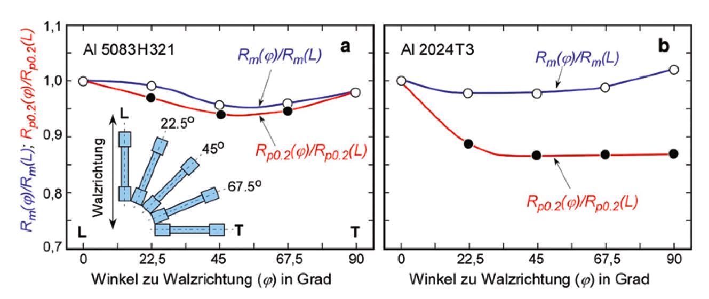
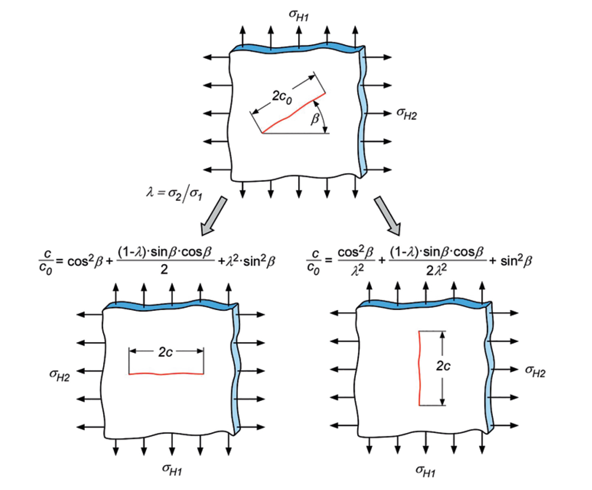
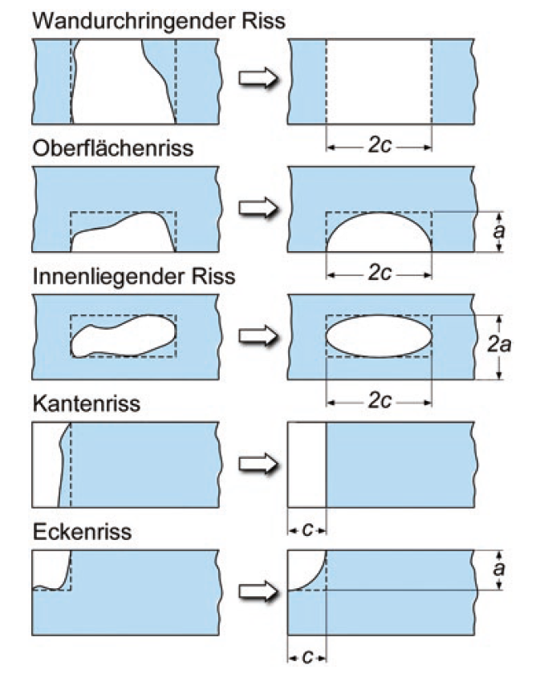
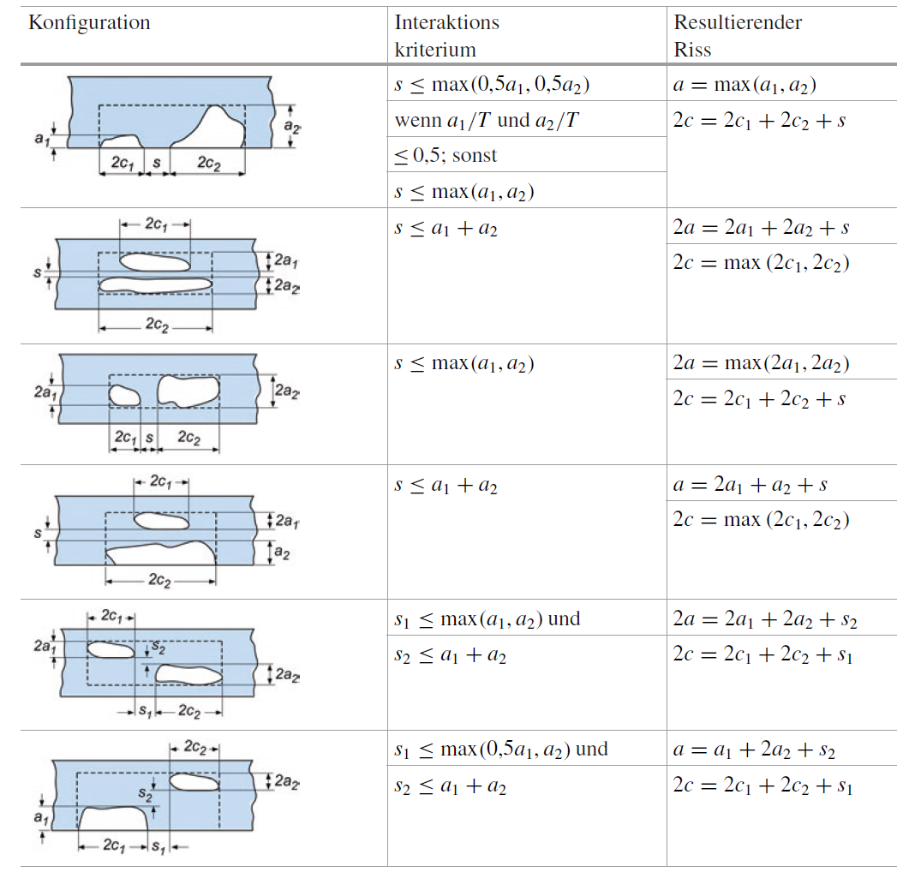
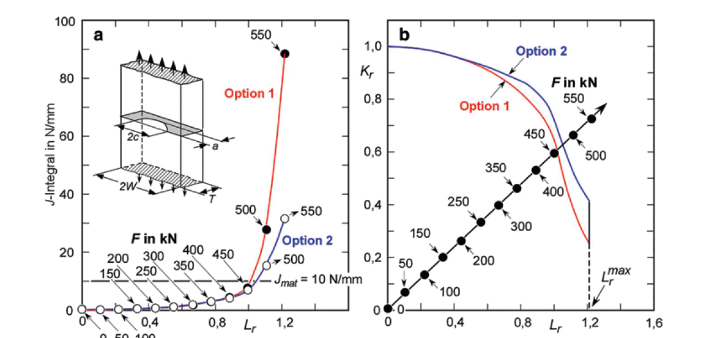
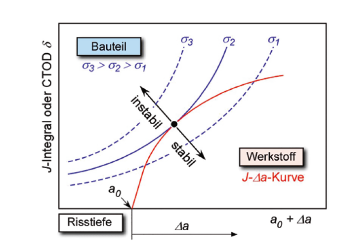
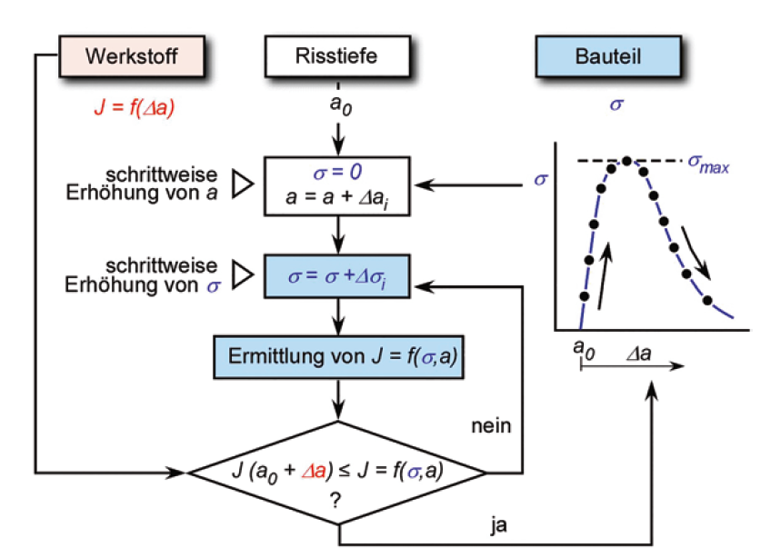
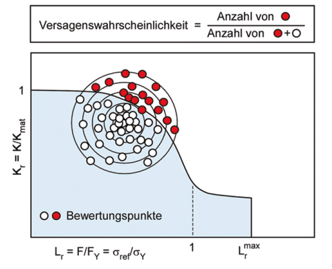
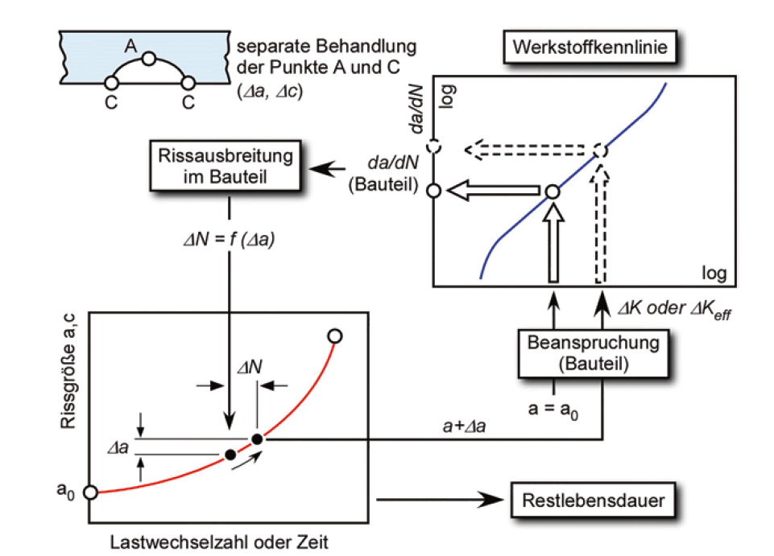

<!-- _class: lead -->
## Fracture & Fatigue
## Fracture Mechanics Component Assessment

Prof. Dr.-Ing. Christian Willberg
Hochschule Magdeburg-Stendal

 

---

<!-- _class: cols-2 -->

## Component Design Philosophies

### (a) Safe Life
*Dauer-/zeitfeste Auslegung*
→ Failure during service life is **excluded**
→ Verified through classical fatigue concepts

### (b) Damage Tolerance
*Schadenstolerante Auslegung*
→ Crack is **possible**, but **detected in time**
→ Inspection intervals based on remaining life

### (c) Fail Safe
*Auslegung auf kontrolliertes Versagen*
→ Failure of a **sub-structure** weakens the total structure
→ Time must remain for intervention before total failure

**Hierarchy:** (a) provides basic safety. (b) and (c) are subordinate safety levels, since (a) can never be guaranteed 100%.

---

<!-- _class: cols-2 -->
## Damage Tolerance – Basic Principle

**Procedure:**

1. Initial crack size $a_0$ from NDT detection limit
2. Crack growth analysis → **remaining life**
3. Inspection interval: at least **2 inspections** before failure

The inspection interval remains **constant** over the entire service life – unlike conventional practice of inspecting less frequently when new.

**Probability of Detection (PoD)**

$$P_\text{oD,total} = 1 - \prod_{i}(1 - P_\text{oND})^i$$

- $P_\text{oND}$ = probability of non-detection
- $P_\text{oND,total}$ = component failure probability
- PoD increases with crack size and number of inspections

---

_Fig 6.1. taken from Uwe Zerbst · Mauro Madia: "Bruchmechanische
Bauteilbewertung"_

---

_Fig 6.2. taken from Uwe Zerbst · Mauro Madia: "Bruchmechanische
Bauteilbewertung"_

---

## Initial Crack Size – Reference Values (BS 7910)

| Method | Min. depth $a$ (mm) | Min. length $2c$ (mm) | Sizing accuracy |
|---|---|---|---|
| Conventional UT | 3 | 15 | ±3 / ±10 mm |
| Phased Array (FPA) | 1.5 | 10 | ±1.5 / ±7 mm |
| Liquid penetrant (PT), unwelded | 4 | 20 | ±5 mm |
| Magnetic particle (MPI), unwelded | 4 | 20 | ±10 mm |
| Eddy current (ET) | 3 | 15 | – |

What is **missed** with a certain probability is **assumed to be present** → conservative but necessary assumption. Typical defect sizes: several millimetres.

---

## Proof Tests as Alternative to NDT

**Basic principle:** A component that survives an overload will not fail under operating load → determine the critical crack size under overload as new $a_0$.

**Reversed conservatism rules:**

| Situation | Conservative means… |
|---|---|
| Normal assessment | **Underestimate** toughness and critical crack size |
| Proof test event | **Overestimate** critical crack size (→ lower predicted remaining life) |

K-factor, J-integral and $L_r$ must be **overestimated** at the proof test event. Normal conservatism applies again for the subsequent remaining life calculation.

---

<!-- _class: cols-2 -->

## Fail Safe – Leak Before Break

**Principle**:
1. Small surface crack on inner wall grows to **wall penetration**
2. Recharacterised as through-thickness crack → grows to critical length $2c$
3. Key: time between **leak detection** and **global failure**

**Decision factors:**
- Is the leak visible from outside?
- Sensors for pressure drop or leaking medium?
- What hazard does the medium pose (explosion, toxicity)?

➜ crack shape evolution from different $a/c$ ratios under membrane and bending load

**Crack Arrest Analysis (reactor emergency cooling)**

---

_Fig 6.4. taken from Uwe Zerbst · Mauro Madia: "Bruchmechanische
Bauteilbewertung"_

---

<!-- _class: cols-2 -->

## Fracture Mechanics in Failure Analysis

**Typical questions:**
- Cause of failure? (design error vs. operational error)
- Is continued operation under modified loading possible?

→ Shrink-fit sleeve caused bending stress (371 MPa) not foreseen in original design
→ BM analysis: $K_{Ic} = 58\ \text{MPa}\sqrt{\text{m}}$ → $a_c = 8.6\ \text{mm}$ (matches fractographic ≈7–8 mm) ✓

---

**Striation counting**
$$N \approx \int \frac{dN}{da}\,da = \text{area under striation density diagram}$$
DC-10 fan disc: ≈15,000 cycles → fatigue started at commissioning

**Stretch zone width (SZW)**

Measure SZW on fracture surface → reconstruct initiation toughness:

$$J = \frac{2.5}{d_N^* \cdot E} \cdot \text{SZW}$$

$$\delta_5 = \frac{1.25}{d_N^*} \cdot \frac{E}{\sigma_Y} \cdot \text{SZW}$$

Striations are not always resolvable: problems arise with variable amplitude loading, multiple initiation sites, or high-strength materials (Phase I growth has no striations).

---

## The Fracture Mechanics Triangle

$$\underbrace{K,\; J,\; \delta}_{\text{Crack driving force}} \quad \longleftrightarrow \quad \underbrace{K_\text{mat},\; J_\text{mat}}_{\text{Crack resistance}} \quad \longleftrightarrow \quad \underbrace{a}_{\text{Crack size}}$$

**Two known → third calculable:**

| Case | Given | Result |
|---|---|---|
| (a) | Toughness + load | Critical crack size $a_c$ → NDT specification |
| (b) | Toughness + crack size | Critical stress → operational safety check |
| (c) | Crack + load | Minimum required toughness → material selection |
| (d) | Initial crack + stress | Remaining life → inspection interval |
| (e) | In-service crack found | Modified load scheme + restricted remaining life |

---

_Fig 6.11. taken from Uwe Zerbst · Mauro Madia: "Bruchmechanische
Bauteilbewertung"_

---

<!-- _class: cols-2 -->

## Component Loading – Don't Overlook Hidden Loads

➜ – stress state in railway axle from press fit alone (no external load):
- **Compressive stresses** under the press seat
- **Tensile stresses** at the shaft shoulder between press seats

➜  – effect on remaining life:

Crack **under press seat**: ~**5× longer** remaining life than crack at the shaft shoulder — same crack size, same external loading.

All loads must be included as input — they are often the dominant factor:

- Residual stresses (welding, heat treatment)
- Press-fit / shrink-fit stresses
- Thermal stresses
- Self-weight and inertia

> Local stress concentration at press-fit edges is why engineering design places **relief undercuts** at those positions.

---

_Fig 6.12. taken from Uwe Zerbst · Mauro Madia: "Bruchmechanische
Bauteilbewertung"_

---

## Cyclic Stress–Strain Curve

| Phenomenon | Condition | Mechanism |
|-----|-----|-----|
| Cyclic **hardening** | Low-strength materials | Dislocation multiplication |
| Cyclic **softening** | High-strength materials | Breakdown of metastable state |
| Cyclic **creep** (ratcheting) | Constant stress | Dislocation barrier overcoming |
| Cyclic **relaxation** | Constant strain ≠ 0 | Stress reduction |

---

**Ramberg–Osgood (cyclic):**

$$\varepsilon_a = \frac{\sigma_a}{E} + \left(\frac{\sigma_a}{K'}\right)^{1/n'}$$

Cyclic yield strength:
$$\sigma'_Y = K' \cdot (0.002)^{n'}$$

Hysteresis loop (Masing):
$$\varepsilon = \frac{\sigma}{E} + \left(\frac{\sigma}{2K'}\right)^{1/n'}$$

---

_Fig 6.14. taken from Uwe Zerbst · Mauro Madia: "Bruchmechanische
Bauteilbewertung"_

---

<!-- _class: cols-2 -->

_Fig 6.15. taken from Uwe Zerbst · Mauro Madia: "Bruchmechanische
Bauteilbewertung"_

---

_Fig 6.18. taken from Uwe Zerbst · Mauro Madia: "Bruchmechanische
Bauteilbewertung"_

---

## Estimating Cyclic Parameters from Hardness

When measured data are unavailable, $K'$ and $\sigma'_Y$ can be estimated from Brinell hardness HB:

$$K' = 9.8\!\times\!10^{-3}(\text{HB})^2 - 1.26(\text{HB}) + 705 \quad (R_m/\sigma_Y \leq 1.2)$$

$$\sigma'_Y = 2.5\!\times\!10^{-3}(\text{HB})^2 + 1.49(\text{HB})$$

$$n' = -0.37\log(\sigma'_Y/K') \qquad \text{HV} = 8.716 + 0.963\,\text{HB} + 0.0002\,\text{HB}^2$$

These are **empirical estimates** — use measured cyclic curves whenever possible, especially for weld zones (HAZ and weld metal differ significantly from base metal; test on thermally simulated specimens).

---

## Crack Idealisation and Recharacterisation

**Orientation:** Project real crack perpendicular to principal stresses $\sigma_{H1}$, $\sigma_{H2}$:

$$\frac{c}{c_0} = \cos^2\!\beta + \tfrac{1}{2}(1-\lambda)\sin\beta\cos\beta + \lambda^2\sin^2\!\beta \qquad (\sigma_{H1}\text{-plane})$$

**Co-planar cracks**: merge when spacing $s \leq \max(a_1, a_2)$

_Fig 6.19. taken from Uwe Zerbst · Mauro Madia: "Bruchmechanische
Bauteilbewertung"_

---

---

# Remark

- all these models are idealisations
- assess ''real'' behavior CDF (Crack Driving Force) and FAD (Failure Assessment Diagram) have to be used

---

<!-- _class: cols-2 -->

### CDF (Crack Driving Force)
Plastic correction: $K_J = K / f(L_r)$

Failure when: $K_J \geq K_\text{mat}$

$$J = \frac{K^2}{E'} \cdot f(L_r)^{-2}$$

**Advantage:** material side and component side remain **strictly separate** in thinking

### FAD (Failure Assessment Diagram)
Failure locus: $K_r = f(L_r)$

Assessment point $(K_r, L_r)$ must lie **inside** the curve:

$$K_r = \frac{K}{K_\text{mat}}, \quad L_r = \frac{\sigma_\text{ref}}{\sigma_Y}$$

Standard in R6, BS 7910, API 579-1/ASME FFS-1

CDF = FAD: **identical results**, different representation only.

---

_Fig 6.24. taken from Uwe Zerbst · Mauro Madia: "Bruchmechanische
Bauteilbewertung"_

---

## Assessment Against Ductile Crack Instability
<!-- _class: cols-2 -->

_Fig 6.28. taken from Uwe Zerbst · Mauro Madia: "Bruchmechanische
Bauteilbewertung"_

**Two conditions for stable crack growth:**

$$J < J_\text{mat}(a) \qquad \text{and} \qquad \frac{dJ}{da}\bigg|_\sigma < \frac{dJ_\text{mat}}{da}$$

**σ–a method:**
1. Start at $a_0$, increment by $\Delta a_i$
2. For each crack depth: raise load until $J(\sigma,\, a_0\!+\!\Delta a_i) = J_\text{mat}(\Delta a_i)$
3. Plot $(\sigma, a)$ pairs → **maximum = instability load**

---

---

<!-- _class: cols-2 -->

##  Probabilistic Analysis

➜ **Fig. 6.37** (scatter), **Fig. 6.38** (Monte Carlo in FAD), **Fig. 6.39–6.41** (Demos 6.7–6.8, R6 method)

**Monte Carlo method (preferred):**
- Input data as probability distributions
- Many repeated BM analyses
- Fraction of failed analyses = $P_f$

**Typical COV values:**

| Parameter | COV |
|---|---|
| Young's modulus $E$ | 0.05 |
| Yield strength $\sigma_Y$ | 0.07 |
| Tensile strength $R_m$ | 0.05 |
| Weld metal $\sigma_Y$, $R_m$ | 0.10 |

**Reliability index:**
$$\beta = -\Phi^{-1}(P_f)$$

| $P_f$ | $\beta$ |
|---|---|
| $10^{-3}$ | 3.09 |
| $10^{-4}$ | 3.71 |
| $10^{-6}$ | 4.75 |

**Target** (ISO 2394): $P_f = 10^{-3}$ to $10^{-6}$ per year

---

---

## Life Estimation – Basic Iteration

**Iterative crack growth loop:**
1. Initial crack $a_0$ → compute $\Delta K(a_0)$
2. From $da/dN$–curve (NASGRO, Eq. 4.117): crack increment $\Delta a$ per cycle
3. $a \leftarrow a + \Delta a$ → check failure criterion ($K_\text{max} \geq 0.7\,K_\text{mat}$?)
4. No → continue. **Yes → remaining life $N$ reached.**

**Residual stresses** enter the stress ratio, not $\Delta K$:
$$R = \frac{K_\text{min} + K_r}{K_\text{max} + K_r}$$

For elliptical cracks: compute deepest point **and** surface points **separately** → realistic $a/c$ evolution. Fixed $a/c$ can cause large errors in life prediction.

---

---

<!-- _class: lead -->

# Questions?

Prof. Dr.-Ing. Christian Willberg | Hochschule Magdeburg-Stendal