

<!-- _class: lead -->
## Fracture & Fatigue
## Linear Fracture Mechanics

Prof. Dr.-Ing. Christian Willberg
Hochschule Magdeburg-Stendal

 

--- 

Figures are mostly taken from Gross und Seelig, Bruchmechnanik

---

# General Concepts

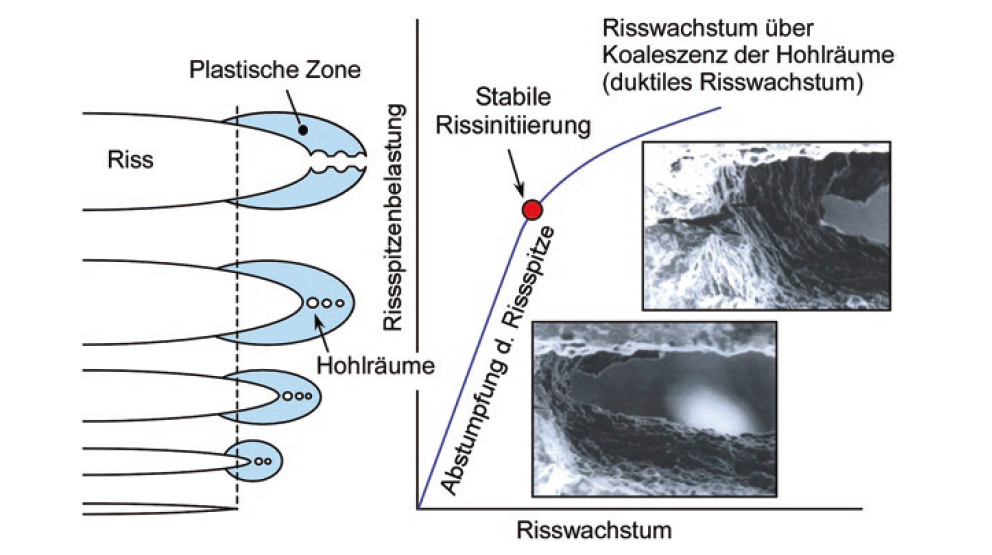

> Zerbst, Madia Bruchmechanische Bauteilbewertung

---

## Crack Geometry

From a continuum mechanics perspective, a crack is a **cut in a body**:

- **Crack surfaces** (crack flanks / crack faces): the two opposing surfaces of the cut — typically load-free
- **Crack front / crack tip**: where the crack ends

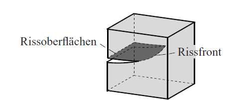
> (Gross und Seelig, Bruchmechnanik)

---

### Crack Opening Modes

| Mode | Description |  displacement |
|------|-------------|----------------------|
| **Mode I** | Symmetric opening | Normal to crack plane (y-direction) |
| **Mode II** | Antisymmetric sliding | In-plane shear (x-direction, ⊥ crack front) |
| **Mode III** | Tearing / out-of-plane | Out-of-plane shear (z-direction, ∥ crack front) |

These symmetries are defined **locally** near the crack tip.
In special cases they apply to the entire body.

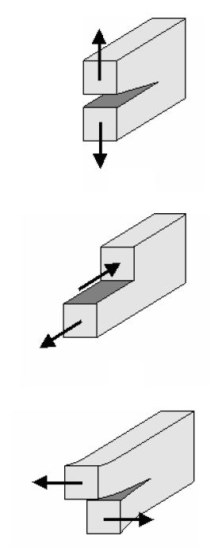

---

## Process Zone and Validity of Linear Fracture Mechanics

**Process zone**: region near the crack front where the complex microscopic debonding process occurs — not describable by classical continuum mechanics.

**Requirement for LEFM:** process zone size $\ll$ all characteristic macroscopic dimensions of the body.

This localization is typical for:
- Metallic materials
- Most brittle materials

---

**Exceptions:** concrete and granular materials, where the process zone can be very large — even spanning the entire body.

In **linear elastic fracture mechanics (LEFM)**:
- The entire body is treated as linearly elastic
- Any inelastic processes must be confined to a small, negligible region around the crack tip
- LEFM is primarily suited to describe **brittle fracture**

---

#  The Crack Tip Field

---

##  Two-Dimensional Crack Tip Fields — Mode III

We study the field within a small region of radius $R$ around a crack tip (Fig. 4.3).

**Approach** using complex function $\Omega(z) = Az^\lambda$ with $\lambda > 0$ (ensures finite displacements and strain energy at the tip).

Applying stress-free crack surface boundary conditions at $\varphi = \pm\pi$ yields the **eigenvalues**:

$$\sin 2\lambda\pi = 0 \quad\Rightarrow\quad \lambda = \frac{n}{2}, \quad n = 1,2,3,\ldots$$

---

The general solution is a superposition of eigenfunctions:

$$\Omega = A_1 z^{1/2} + A_2 z + A_3 z^{3/2} + \ldots$$

> Coordinate system at the crack tip: radius $r$, angle $\varphi$ (Gross und Seelig, Bruchmechnanik)

---

## Mode III Crack Tip Field — Dominant Singular Term

As $r \to 0$, the dominant term ($\lambda = 1/2$) gives the **singular crack tip field**:

$$\begin{pmatrix} \tau_{xz} \\ \tau_{yz} \end{pmatrix} = \frac{K_{III}}{\sqrt{2\pi r}} \begin{pmatrix} -\sin(\varphi/2) \\ \cos(\varphi/2) \end{pmatrix}, \qquad w = \frac{2K_{III}}{G}\sqrt{\frac{r}{2\pi}}\sin(\varphi/2)$$

Key observations:
- Stresses have a **$r^{-1/2}$ singularity** at the crack tip
- The field is completely determined by $K_{III}$ — the **stress intensity factor (SIF)**
- $K_{III}$ is a measure of the **"strength"** of the crack tip field
- Extraction formula: $K_{III} = \lim_{r\to 0}\sqrt{2\pi r}\,\tau_{yz}(\varphi=0)$

The **second term** ($\lambda = 1$) gives non-singular stresses with a constant shear stress $\tau_T$ — important farther from the tip.

---

## Mode I and Mode II Crack Tip Fields (Plane Problems)

Using two complex functions $\Phi(z)$, $\Psi(z)$ with the same eigenvalue equation as Mode III:

$$\cos 4\lambda\pi = 1 \quad\Rightarrow\quad \lambda = \frac{n}{2}, \quad n = 1,2,3,\ldots$$

The stress and displacement fields decompose into **symmetric (Mode I)** and **antisymmetric (Mode II)** parts.

**Mode I** (symmetric):

$$\begin{pmatrix} \sigma_x \\ \sigma_y \\ \tau_{xy} \end{pmatrix} = \frac{K_I}{\sqrt{2\pi r}}\cos\frac{\varphi}{2} \begin{pmatrix} 1 - \sin\frac{\varphi}{2}\sin\frac{3\varphi}{2} \\ 1 + \sin\frac{\varphi}{2}\sin\frac{3\varphi}{2} \\ \sin\frac{\varphi}{2}\cos\frac{3\varphi}{2} \end{pmatrix}, \quad \begin{pmatrix} u \\ v \end{pmatrix} = \frac{K_I}{2G}\sqrt{\frac{r}{2\pi}}(\kappa-\cos\varphi)\begin{pmatrix}\cos(\varphi/2)\\\sin(\varphi/2)\end{pmatrix} $$

---

> **Fig. 4.4a** — Loaded crack surfaces; **Fig. 4.4b** — Curved crack near tip

---

## Mode II Crack Tip Field

**Mode II** (antisymmetric):

$$\begin{pmatrix} \sigma_x \\ \sigma_y \\ \tau_{xy} \end{pmatrix} = \frac{K_{II}}{\sqrt{2\pi r}} \begin{pmatrix} -\sin\frac{\varphi}{2}\left[2+\cos\frac{\varphi}{2}\cos\frac{3\varphi}{2}\right] \\ \sin\frac{\varphi}{2}\cos\frac{\varphi}{2}\cos\frac{3\varphi}{2} \\ \cos\frac{\varphi}{2}\left[1-\sin\frac{\varphi}{2}\sin\frac{3\varphi}{2}\right] \end{pmatrix}$$

Constants depending on stress state:

$$\text{Plane strain (EVZ):} \quad \kappa = 3-4\nu,\quad \sigma_z = \nu(\sigma_x+\sigma_y)$$
$$\text{Plane stress (ESZ):} \quad \kappa = \frac{3-\nu}{1+\nu},\quad \sigma_z = 0$$

Extraction formulas:

$$K_I = \lim_{r\to 0}\sqrt{2\pi r}\,\sigma_y(\varphi=0), \qquad K_{II} = \lim_{r\to 0}\sqrt{2\pi r}\,\tau_{xy}(\varphi=0)$$

The **T-stress** (second term, $\lambda=1$): $\sigma_T$ acts parallel to the crack — important when $K_I$ is small.

---

##  Mode I Crack Tip Field — Detail

**Stresses are singular** of type $r^{-1/2}$; **displacements** show $r^{1/2}$ behavior.

Crack opening along the crack faces ($\varphi = \pm\pi$) for $K_I > 0$:

$$v^\pm = \pm\frac{K_I}{2G}\sqrt{\frac{r}{2\pi}}(\kappa+1)$$

This gives a **parabolic crack opening profile** (Fig. 4.6a).

Stresses in polar coordinates:

$$\begin{pmatrix}\sigma_r\\\sigma_\varphi\\\tau_{r\varphi}\end{pmatrix} = \frac{K_I}{4\sqrt{2\pi r}} \begin{pmatrix}5\cos(\varphi/2)-\cos(3\varphi/2)\\3\cos(\varphi/2)+\cos(3\varphi/2)\\\sin(\varphi/2)+\sin(3\varphi/2)\end{pmatrix}$$

---

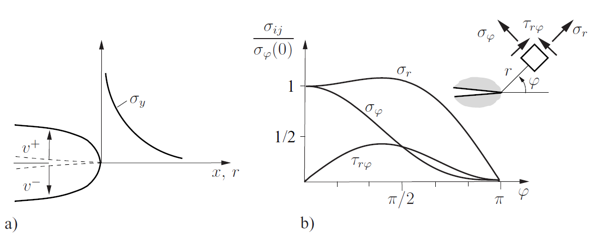

> **Fig. 4.6** — Mode I crack tip field: (a) crack opening and $\sigma_y$ distribution, (b) angular dependence of stress components

---

## Principal Stresses and Maximum Shear in Mode I

Principal stresses and directions:

$$\begin{pmatrix}\sigma_1\\\sigma_2\end{pmatrix} = \frac{K_I}{\sqrt{2\pi r}}\cos\frac{\varphi}{2}\begin{pmatrix}1+\sin(\varphi/2)\\1-\sin(\varphi/2)\end{pmatrix}, \quad \alpha = \pm\frac{\pi}{4}+\frac{3}{4}\varphi$$

Third principal stress:

$$\sigma_3 = \frac{2\nu K_I}{\sqrt{2\pi r}}\cos\frac{\varphi}{2} \text{ (plane strain)}, \qquad \sigma_3 = 0 \text{ (plane stress)}$$

Maximum shear stress:

$$\text{Plane stress:}\quad \tau_\text{max} = \sigma_1/2$$
$$\text{Plane strain:}\quad \tau_\text{max} = \begin{cases}(\sigma_1-\sigma_2)/2 & \sin(\varphi/2) \geq 1-2\nu \\ (\sigma_1-\sigma_3)/2 & \sin(\varphi/2) \leq 1-2\nu\end{cases}$$

---

## Three-Dimensional Crack Tip Field

In 3D, the crack tip field is **locally of the same type** as in the 2D case.

For a point $P$ on the crack front with local coordinates (Fig. 4.7b), as $r\to 0$:

$$\sigma_{ij} = \frac{1}{\sqrt{2\pi r}}\left[K_I\tilde{\sigma}^I_{ij}(\varphi) + K_{II}\tilde{\sigma}^{II}_{ij}(\varphi) + K_{III}\tilde{\sigma}^{III}_{ij}(\varphi)\right]$$

- The field is **fully characterized** by $K_I$, $K_{II}$, $K_{III}$
- SIFs can vary along the crack front: $K_I = K_I(s)$, etc.
- Plane strain (EVZ) kinematics apply for Mode I and Mode II components

**Special singular points:** crack front kinks, or where the crack front meets a free surface — stress singularity may not be $r^{-1/2}$ type there.

---

## The K-Concept

**Central idea:** for pure Mode I, the SIF $K_I$ uniquely characterizes the entire crack tip region (Fig. 4.8).

The $K_I$-dominated field is valid between two limits:
- **Outer bound $R$:** beyond which higher-order terms cannot be neglected
- **Inner bound** ($\rho$, $r_p$): process zone radius $\rho$ and plastic zone radius $r_p$

**Hypothesis:** as long as $\rho, r_p \ll R$, the state in the process zone is **indirectly controlled** by $K_I$.

$$\boxed{K_I = K_{Ic}}$$

Crack growth (fracture) initiates when $K_I$ reaches the **material-specific critical value $K_{Ic}$** = fracture toughness.

---

For pure Mode II and Mode III:

$$K_{II} = K_{IIc} \quad \text{(Mode II)}, \qquad K_{III} = K_{IIIc} \quad \text{(Mode III)}$$

General mixed-mode criterion: $f(K_I, K_{II}, K_{III}) = 0$ — see Section 4.9.

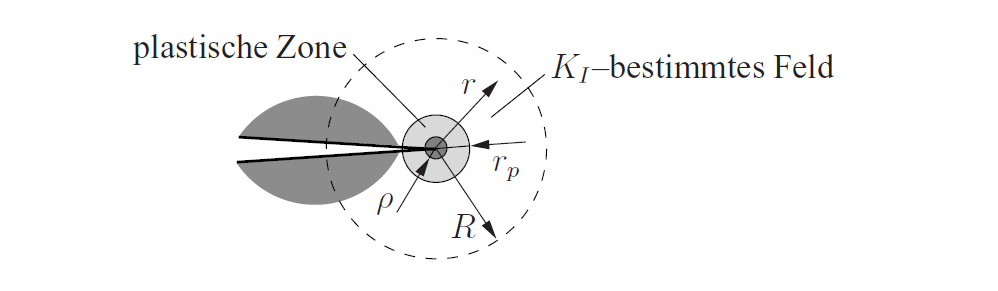
>  K-concept: $K_I$-dominated field, plastic zone $r_p$, process zone $\rho$

---

# K-Factors

---

## Example: Crack Under Remote Tension

**Configuration:** straight crack of length $2a$ in an infinite plane under uniaxial tension $\sigma$ (Fig. 4.9a).

**Solution by superposition:** problem (1) = uncracked plate + problem (2) = crack loaded by $-\sigma$ on faces.

---

Result for stresses along the x-axis:

$$\sigma_y^{(2)} = \sigma\left(\frac{x}{\sqrt{x^2-a^2}} - 1\right), \quad |x|>a$$

Crack face displacements (elliptical opening, Fig. 4.9c):

$$4Gv^\pm = \pm(1+\kappa)\sigma\sqrt{a^2-x^2}$$

**Stress intensity factor:**

$$\boxed{K_I = \sigma\sqrt{\pi a}}$$

---

## Further Examples

**Point forces on crack faces** (a,b):

$$K_I^\pm = \frac{P}{\sqrt{\pi a}}\sqrt{\frac{a\pm b}{a\mp b}}$$

**Shear loading** (Mode II, (e)):

$$K_{II} = \tau\sqrt{\pi a}$$

---

**Collinear crack array** (period $2b$, Fig. 4.11a):

$$K_I = \sigma\sqrt{\pi a}\sqrt{\frac{2b}{\pi a}\tan\frac{\pi a}{2b}}$$

As crack tips approach each other ($a\to b$), $K_I$ grows strongly due to **crack interaction**.

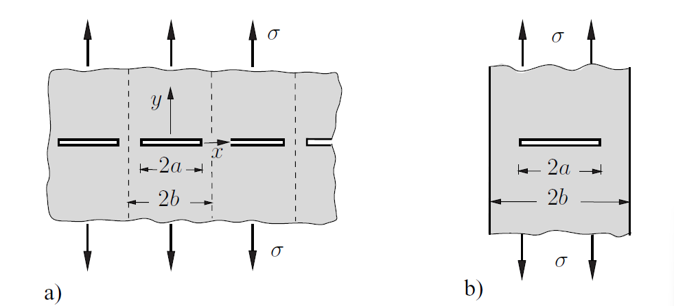
>  (a) collinear crack array, (b) strip with internal crack

---

##  K-Factor Table (Selected Cases)

> **Table 4.1** — K-factors for standard configurations:
>
> 1. $K_I = \sigma\sqrt{\pi a}$, $K_{II} = \tau\sqrt{\pi a}$ (infinite plate)
> 2. Single-point force on crack face
> 3. Collinear crack array: $K_I = \sigma\sqrt{2b\tan(\pi a/2b)}$
> 4. Edge crack: $K_I = 1.1215\,\sigma\sqrt{\pi a}$
> 5–8. Edge and through-cracks in finite strips (with correction functions $F_I(a/b)$, $G_I(a/b)$)
> 9–10. Penny-shaped and elliptical cracks
> 11. Circular crack under tension and torsion
> 12. Semi-elliptical surface crack: $K_I(\theta)$

---

## Integral Equation Formulation

A crack can be represented as a **continuous distribution of dislocations** along the crack line.

For a dislocation with displacement jump $b_y$ in y-direction, the stress $\sigma_y$ along the x-axis is:

$$\sigma_y(x,0) = -\frac{2G}{\pi(\kappa+1)}\int_{-a}^{+a}\frac{\mu(t)\,dt}{x-t}$$

where $\mu(t) = db_y/dt$ is the **dislocation density**.

---

For the crack under pressure $\sigma$, this becomes a singular integral equation with solution:

$$\mu(x) = \frac{\sigma(\kappa+1)}{2G}\frac{x}{\sqrt{a^2-x^2}}$$

The SIF follows directly from the dislocation density:

$$K_I = \lim_{x\to a}\frac{2G}{\kappa+1}\sqrt{2\pi}\sqrt{a-x}\,\mu(x)$$

This yields the known result $K_I = \sigma\sqrt{\pi a}$.

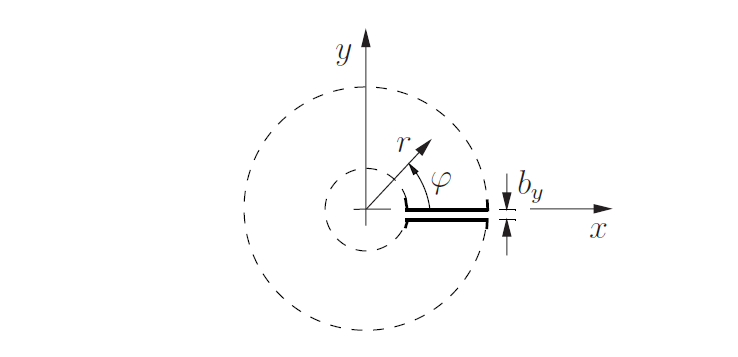
> Displacement jump from edge dislocation

---

## Weight Function Method

**Goal:** compute $K_I$ for arbitrary loading from a known reference solution.

Using **Betti's reciprocal theorem** applied to two configurations with crack lengths $a$ and $a+\varepsilon$:

$$K_I = -\frac{8G}{\kappa+1}\frac{1}{K_I^r}\int_0^a \sigma_y\frac{\partial v^r}{\partial a}\,dx$$

where the **weight function** is $\frac{8G}{(\kappa+1)K_I^r}\frac{\partial v^r}{\partial a}$.

---

**Example:** crack with loading $\sigma_y = -\sigma_0\sqrt{1-x^2/a^2}$, using constant reference load:

$$K_I = \frac{2}{\pi}\sigma_0\sqrt{\pi a}$$

**Petroski–Achenbach approximation:** when the reference displacement $v^r$ is unknown, use a two-term ansatz anchored to the near-field solution to obtain approximate weight functions 

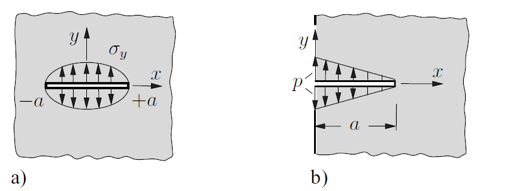

---

## Crack Interaction (Kachanov Method)

When cracks are **closely spaced**, they interact — either amplifying or shielding each other's crack tip loading.

**Transfer factor** from crack 1 to crack 2 (Fig. 4.17):

$$\Lambda_{12} = \bar{f}_{12} = \frac{1}{c-b}\int_b^c f_{12}(x)\,dx = \frac{\sqrt{c^2-a^2}-\sqrt{b^2-a^2}}{c-b}-1$$

---

**Kachanov self-consistency equations** for $n$ cracks under Mode I:

$$(\delta_{ji}-\Lambda_{ji})\bar{p}_j = p_i^\infty, \quad i=1,\ldots,n$$

**Far-field approximation** ($d\gg a$, collinear cracks):

$$K_I \approx K_I^0\left(1+\frac{1}{2}\left(\frac{a}{d}\right)^2\right)$$

Interaction decays rapidly with distance — as $(a/r)^2$ in 2D, even faster $(a/r)^3$ in 3D.

---

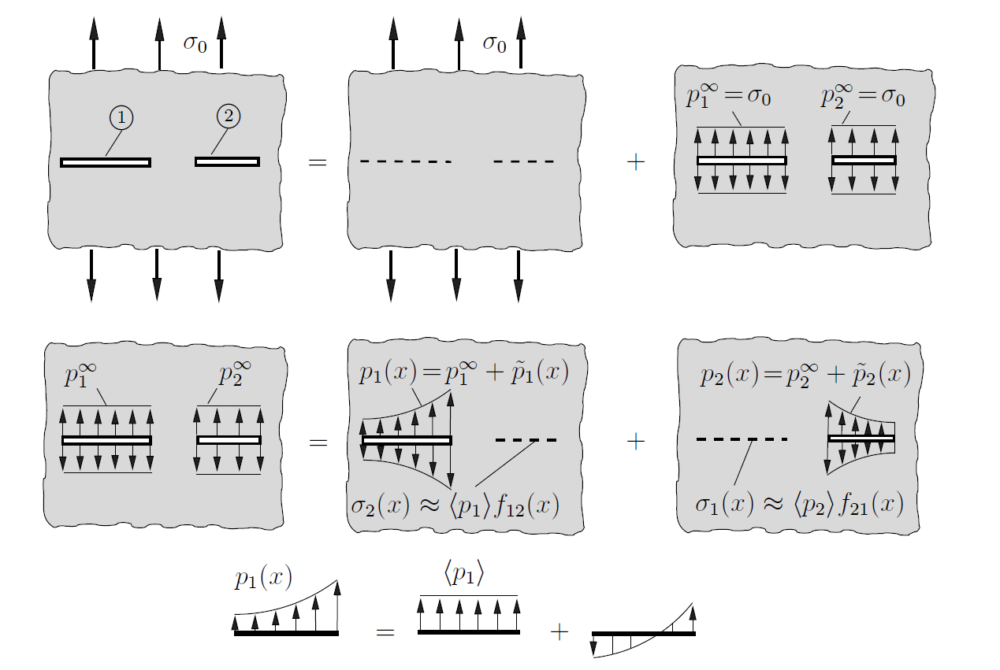

> **Fig. 4.17** — Transfer factor definition; **Fig. 4.18** — Kachanov method for two cracks; **Fig. 4.19** — Two equal collinear cracks; **Fig. 4.20** — Numerically simulated crack interaction paths

---

##  Stress Intensity Factors and Notch Factors

**Elliptical hole** (semi-axes $a$, $b$) under tension $\sigma$:

Maximum stress at the tip:

$$\sigma_\text{max} = \sigma\left(1+2\sqrt{\frac{a}{\rho}}\right) \approx 2\sigma\sqrt{\frac{a}{\rho}} \quad (\rho\ll a)$$

where $\rho = b^2/a$ is the tip radius. As $\rho\to 0$: the ellipse degenerates to a crack, $\sigma_\text{max}\to\infty$.

---

**Parabolic notch**  — Mode I stress field near tip:

$$\sigma_\text{max} = \frac{\sqrt{2K_I}}{\sqrt{\pi\rho}}$$

This relates the **SIF of the associated crack** to the **maximum notch stress** — universally valid for deep notches.

Inverse: $K_I = \lim_{\rho\to 0}\frac{1}{2}\sqrt{\pi\rho}\,\sigma_\text{max}$

---

## Numerical Determination of K-Factors

**Finite Element Method (FEM):** entire body discretized into elements

**Boundary Element Method (BEM):** only the boundary (including cracks) is discretized — particularly efficient for crack problems

**Peridynamics (PD):** non-local method avoiding stress singularities

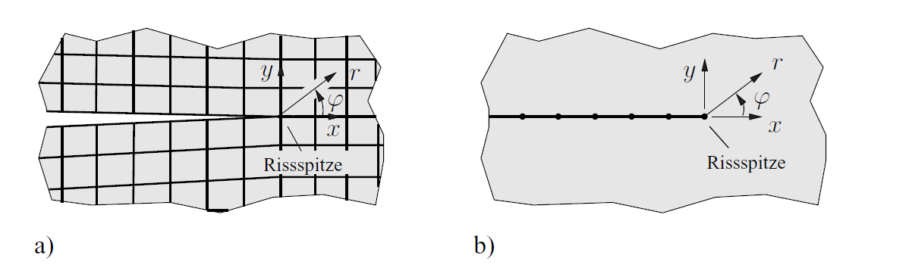
> (a) parabolic notch, (b) V-notch

---

**K-factor extraction from displacements** (crack face method):

$$\begin{pmatrix}K_I\\K_{II}\\K_{III}\end{pmatrix} = \lim_{r\to 0}\sqrt{\frac{2\pi}{r}} \begin{pmatrix}v(r,\pi)\cdot 2G/(\kappa+1)\\u(r,\pi)\cdot 2G/(\kappa+1)\\w(r,\pi)\cdot G/2\end{pmatrix}$$

**K-factor extraction from stresses** (ahead of crack tip):

$$\begin{pmatrix}K_I\\K_{II}\\K_{III}\end{pmatrix} = \lim_{r\to 0}\sqrt{2\pi r} \begin{pmatrix}\sigma_y(r,0)\\\tau_{xy}(r,0)\\\tau_{yz}(r,0)\end{pmatrix}$$

**Quarter-point elements:** special element node placement to capture $\sqrt{r}$ displacement behavior — greatly improves accuracy without special functions.

> **Fig. 4.23** — 2D crack problem discretized: (a) FEM mesh, (b) BEM boundary elements; **Fig. 4.24** — Square crack: (a) geometry, (b) crack opening, (c) $K_I$ variation along crack front

---

## Fracture Toughness $K_{Ic}$

$K_{Ic}$ is determined by **standardized tests** (e.g. ASTM E399-90).

Common specimen geometries (Fig. 4.25):
- **Compact tension (CT)** specimen
- **Three-point bending (3PB)** specimen

Both require a **fatigue pre-crack** (from a notch root in metals).

**Size requirement** (ensures plane strain and small-scale yielding):

$$a,\; W-a,\; B \;\geq\; 2.5\left(\frac{K_{Ic}}{\sigma_F}\right)^2$$

where $\sigma_F$ = yield stress ($R_e$). This guarantees the $K_I$-dominated field is valid.

---

##  Factors Influencing $K_{Ic}$

$K_{Ic}$ depends on:
- **Microstructure** (grain size, heat treatment)
- **Loading history**
- **Environment** (air, water, corrosive media)
- **Temperature** — significant influence for many metals (Fig. 4.26b)
- **Specimen thickness** — thicker → plane strain → smaller $K_c$ (Fig. 4.26a)

---

**Representative values** (Table 4.3):

| Material | $K_{Ic}$ [MPa$\sqrt{\text{m}}$] |
|----------|-------------------------------|
| High-strength steels | 25 … 95 |
| Structural steels | 30 … 125 |
| Ti alloys | 40 … 95 |
| Al alloys | 20 … 65 |
| Al$_2$O$_3$ ceramic | 3 … 9 |
| Glass | 0.6 … 1.3 |
| Concrete | 0.15 … 1.4 |
| PMMA | 0.7 … 1.6 |

---

# Energy Balance

---

## Energy Released During Crack Growth

Consider a cracked elastic body with external loads (potential $\Pi_a$) and prescribed displacements.

During crack advance by area $\Delta A$ (length $\Delta a$ in 2D), the system goes from equilibrium state 1 to state 2.

---

**Energy theorem:**

$$\Delta\Pi = \Delta W_\sigma \leq 0$$

The **mechanical energy decreases** during crack growth. The released energy drives the fracture process.

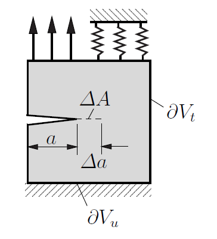

---

**Example — crack formation in an infinite plate** under tension $\sigma$ (Fig. 4.28):

For dead load (constant $\sigma$):

$$\Delta\Pi = -\frac{\sigma^2 a^2\pi(1+\kappa)}{8G}$$

For fixed displacement:

$$\Delta\Pi = -\frac{\sigma^2 a^2\pi(1+\kappa)}{8G}$$

$\Delta\Pi$ is the same in both cases — but $\Delta\Pi_i$ has opposite signs!

> **Fig. 4.27** — Crack advance and energy release; **Fig. 4.28** — Crack formation in an infinite plate

---

##  Energy Release Rate

The **energy release rate** (ERR) $\mathcal{G}$ is energy released per unit crack area advance:

$$\mathcal{G} = -\frac{d\Pi}{dA} \qquad \text{(3D)}, \qquad \mathcal{G} = -\frac{d\Pi}{da} \qquad \text{(2D per unit thickness)}$$

$\mathcal{G}$ has dimension of force per unit length = **crack extension force**.

---

**Relation to SIFs** (Mode I derivation via virtual crack closure):

$$\mathcal{G} = \frac{\kappa+1}{8G}K_I^2 = \begin{cases}K_I^2/E & \text{plane stress}\\ (1-\nu^2)K_I^2/E & \text{plane strain}\end{cases}$$

For all three modes combined:

$$\mathcal{G} = \frac{1}{E^\ast}(K_I^2 + K_{II}^2) + \frac{1}{2G}K_{III}^2$$

where $E^\ast = E/(1-\nu^2)$ for plane strain/3D and $E^\ast = E$ for plane stress.

---

## 4.6.3 Compliance, ERR, and K-Factors

For a body loaded by a single force $F$ with compliance $C(a)$:

$$\mathcal{G} = \frac{F^2}{2B}\frac{dC}{da}$$

This result is **independent of loading type** (dead load, spring, or fixed displacement).

---

For pure Mode I:

$$K_I^2 = \frac{F^2 E^\ast}{2B}\frac{dC}{da}$$

**Application — experimental K determination:** measure compliance for two slightly different crack lengths, compute $dC/da$.

**DCB specimen** (Double Cantilever Beam, Fig. 4.32) with arm length $a$, height $h$:

$$C = \frac{8a^3}{EBh^3}, \qquad K_I = \frac{2\sqrt{3}\,Fa}{Bh^{3/2}}$$

---

## Griffith Fracture Criterion

The fracture energy $\Gamma$ (surface energy + inelastic dissipation in process zone) enters the energy balance:

$$\frac{d\Pi}{dA} + \frac{d\Gamma}{dA} = 0$$

With $\mathcal{G} = -d\Pi/dA$ and $G_c = 2\gamma$ (specific fracture surface energy):

$$\boxed{\mathcal{G} = G_c}$$

**Griffith criterion:** crack growth initiates when the energy released equals the energy required for fracture.

**Griffith's original work (1921):** treated $\Gamma$ as pure surface energy (reversible process) and applied only to onset of crack growth.

---

For the infinite plate with crack of length $2a$:

$$\sigma_c = \sqrt{\frac{16G\gamma}{\pi(1+\kappa)a}}, \qquad a_c = \frac{16G\gamma}{\pi(1+\kappa)\sigma^2}$$

> Griffith criterion: $\Pi$, $\Gamma$, and $\Pi+\Gamma$ vs. crack length

---

## Numerical Determination of $\mathcal{G}$

Direct approach: compute $\mathcal{G}$ from the potential difference for two crack lengths:

$$\mathcal{G} \approx -\frac{\Pi(a+\Delta a)-\Pi(a)}{\Delta a}$$

Requires **two FEM/BEM simulations** — but avoids accurate crack tip field approximation.

**Crack closure integral:** separate individual mode contributions by computing:
- Nodal forces ahead of the crack of length $a$
- Crack opening displacements on the crack of length $a+\Delta a$

Advantages: no special crack tip elements needed; based on global energy quantities.

---

## J-Integral — Conservation Integrals

For a homogeneous elastic body (no body forces), the **J-integral vector** is defined as:

$$J_k = \int_{\partial V}b_{kj}n_j\,dA = \int_{\partial V}(U\delta_{jk}-\sigma_{ij}u_{i,k})n_j\,dA$$

where $b_{kj} = U\delta_{jk} - \sigma_{ij}u_{i,k}$ is the **Eshelby stress tensor** (energy-momentum tensor).

**Divergence theorem** shows:

$$J_k = 0$$

for any closed surface enclosing defect-free material.

---

Related conservation integrals:
- $L_k$ (generalized moment / rotational)
- $M$ (self-similar defect growth, e.g. void expansion)

>  J-integral: (a) 3D closed surface, (b) 2D contour C

---

## J-Integral — Configuration Forces

For a surface $\partial V$ enclosing a **discontinuity or singularity** (Fig. 4.39):

Energy change due to a translational shift $ds_k$ of the discontinuity:

$$d\Pi = -J_k\,ds_k$$

---

**Interpretation:** $J_k$ is a **configuration force** (generalized force, material force) acting on the defect — it drives the defect forward.

Similarly:
- $L_k$: configuration moment (energy change under rotation of defect)
- $M$: energy change under self-similar growth

>  Configuration forces: (a) surface enclosing boundary, (b) virtual shift, (c) general defect

---

**Example — bimaterial rod**: $J_1 = \frac{N^2}{2A}\left(\frac{1}{E_1}-\frac{1}{E_2}\right)$ — force driving the stiffness jump

---

## J-Integral as Crack Tip Parameter

For a contour $C$ around the crack tip with load-free crack faces (Fig. 4.41a):

$$J = J_1 = \int_C\left(U\,dy - t_i u_{i,x}\,dc\right)$$

**Energetic interpretation:** $J$ = energy release rate for crack advance:

$$J = \mathcal{G} = -\frac{d\Pi}{da}$$

**Path independence**: $J$ is the same for any contour surrounding the crack tip — for straight, unloaded crack faces.

---

For linear elastic material:

$$J = \frac{1}{E^\ast}(K_I^2+K_{II}^2) + \frac{1}{2G}K_{III}^2$$

**Practical advantage:** choose integration path far from the crack tip — no need for accurate crack tip field resolution in FEM/BEM.

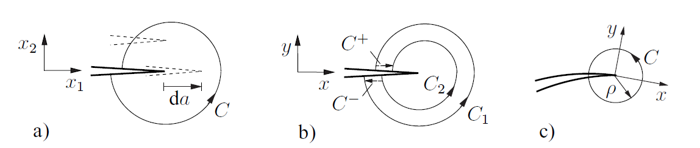
> J-integral: (a) arbitrary contour, (b) path independence, (c) shrinking contour

---

## J-Integral — Further Properties

**Path dependence** occurs when:
- Crack faces are loaded
- Crack is curved

In such cases, use a **shrinking contour** around the crack tip (Fig. 4.41c):

$$J = \lim_{\rho\to 0}\int_C(U\,dy - t_i u_{i,x}\,dc)$$

The linear elastic relation still holds.

---

**y-component of generalized force** on the crack tip:

$$J_2 = -\frac{1}{E^\ast}K_I K_{II}$$

**3D extension:** for a crack with varying front loading, $J = J(x_3)$ varies along the front but remains path-independent in cross-sectional planes.

---

# Small-Scale Yielding

---

## Plastic Zone Size — Irwin Correction

**LEFM assumption:** plastic zone $r_p \ll R$ (K-dominated zone).

**Irwin estimate** (Fig. 4.43): replace the elastic stress distribution by an elastic-plastic distribution (constant $\sigma_y = \alpha\sigma_F$ in plastic zone).

At the elastic-plastic boundary, Tresca yield condition $\sigma_1-\sigma_3 = \sigma_F$ gives:

$$\text{Plane strain:} \quad \alpha = 1/\sqrt{1-2\nu}$$
$$\text{Plane stress:} \quad \alpha = 1$$

Plastic zone size (force balance, Fig. 4.43a):

$$2r_p = \begin{cases}\dfrac{1}{3\pi}\left(\dfrac{K_I}{\sigma_F}\right)^2 & \text{plane strain (EVZ)}\\ \dfrac{1}{\pi}\left(\dfrac{K_I}{\sigma_F}\right)^2 & \text{plane stress (ESZ)}\end{cases}$$

---

> Plane strain plastic zone is **much smaller** than plane stress — confirmed experimentally.

**Irwin crack length correction:** replace actual crack length by an effective length:

$$a_\text{eff} = a + r_p$$

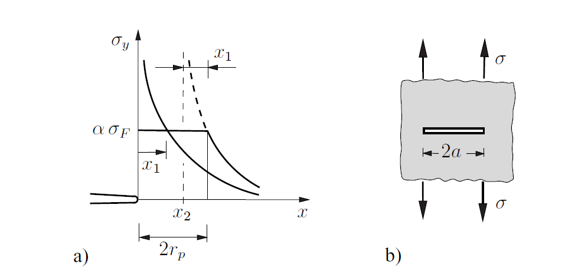
>  Plastic zone estimation: (a) stress redistribution, (b) corrected crack

---

## Plastic Zone Shape

Using the von Mises yield condition with Mode I near-field stresses, the **plastic zone boundary** is:

$$r_p(\varphi) = \frac{K_I^2}{2\pi\sigma_F^2}\cos^2\frac{\varphi}{2} \begin{cases}\left[3\sin^2\frac{\varphi}{2}+(1-2\nu)^2\right] & \text{plane strain}\\ \left[3\sin^2\frac{\varphi}{2}+1\right] & \text{plane stress}\end{cases}$$

Key observations:
- Plane stress zone is significantly **larger** than plane strain zone
- Both Tresca and von Mises hypotheses show the same trend

---

**Dog-bone model**: in thick plates, the interior approximates plane strain (small zone), while the surface approaches plane stress (large zone).

**Slip mechanism** :
- Plane strain: maximum shear in the $x_1$–$x_2$ plane → blunting of crack tip
- Plane stress: maximum shear at 45° to plate → strip-like plastic zone, necking ahead of crack tip

> **Fig. 4.44** — Plastic zone contours: von Mises vs. Tresca, plane strain vs. stress; **Fig. 4.45** — Slip mechanisms

---

## Stable Crack Growth and R-Curves

The crack resistance $G_c$ is generally **not constant** but increases with crack advance $\Delta a = a-a_0$:

$$G_c = R(\Delta a)$$

$R(\Delta a)$ is the **crack resistance curve (R-curve)** — a material-specific function.

**Equilibrium condition** between driving force and resistance:

$$\mathcal{G}(F,a) = R(\Delta a)$$

**Stability condition** (at fixed load):

$$\frac{\partial\mathcal{G}}{\partial a}\bigg|_F < \frac{dR}{da} \quad \Rightarrow\quad \text{stable crack growth}$$

---

**Instability (onset of unstable fracture):**

$$\frac{\partial\mathcal{G}}{\partial a}\bigg|_F = \frac{dR}{da}$$

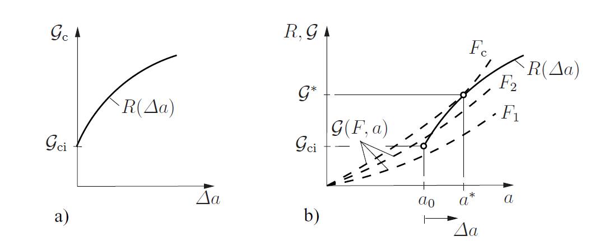
>  (a) R-curve, (b) $\mathcal{G}$-curves for increasing load — stable growth and instability point

---

## Stability Analysis — Spring-Loaded System

For a body loaded via a spring (compliance $C_F$) with prescribed displacement $u_F$ (Fig. 4.47):

$$\frac{d\mathcal{G}}{da} = \frac{F^2}{2}\left[C'' - \frac{2C'^2}{C+C_F}\right]$$

Two special cases:

$$\frac{d\mathcal{G}}{da} = \frac{F^2}{2}\begin{cases}C'' - 2C'^2/C & C_F=0 \text{ (fixed displacement)}\\ C'' & C_F\to\infty \text{ (dead load)}\end{cases}$$

**Dead load** always reaches instability **earlier** than fixed displacement loading.

---

**DCB specimen** ($C = 8a^3/EBh^3$):

$$\frac{d\mathcal{G}}{da} = \begin{cases}-48F^2a/EBh^3 & \text{fixed displacement → always stable}\\ +24F^2a/EBh^3 & \text{dead load → unstable}\end{cases}$$

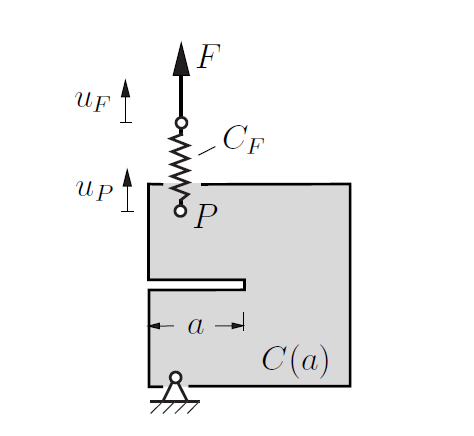
> Stability of crack growth in spring-loaded system

---

## Mixed-Mode Loading — General

Under combined Mode I and Mode II loading, two effects occur:
1. Fracture is triggered by **both** $K_I$ and $K_{II}$
2. Crack propagates **at an angle** $\varphi_0$ to the original crack direction 

For brittle materials, the crack typically propagates so that the new surface opens in **Mode I fashion**.

General mixed-mode criterion:

$$f(K_I, K_{II}) = 0$$

---

> Crack propagation under mixed-mode loading at angle $-\varphi_0$

---

## Energetic Criterion (Mixed Mode)

$$\mathcal{G} = G_c \quad\Rightarrow\quad K_I^2 + K_{II}^2 = K_{Ic}^2$$

**Limitation:** assumes crack propagates **tangentially**, independent of $K_{II}$ magnitude. Only valid for $K_{II} \ll K_I$.

---

##  Mixed-Mode Criteria — Comparison and Limitations

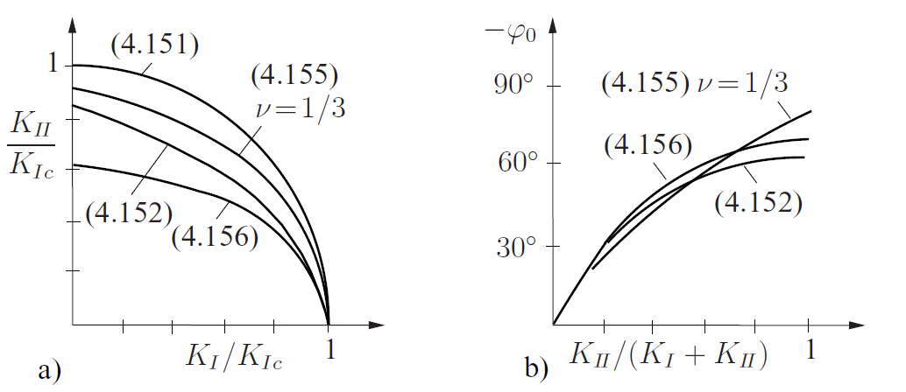

---

| Criterion | $\varphi_0$ (pure Mode II) | $K_{II,c}/K_{Ic}$ |
|-----------|--------------------------|-------------------|
| Energetic | tangential (0°) | 1.0 |
| Max. hoop stress | −70.6° | 0.866 |
| S-criterion, $\nu=1/3$ | −83.6° | 0.905 |
| Kink model | ≈ −70° (numerical) | ≈ 0.87 |

**Limitations:**
- All criteria ignore the microscopic failure mechanism
- Under pure Mode II: rough crack surfaces **interlock** → actual crack tip loading is lower than $K_{II}$ predicts
- Criteria are physically valid only for $K_I > 0$ (open crack)
- Empirical alternative: $\left(\frac{K_I}{K_{Ic}}\right)^\mu + \left(\frac{K_{II}}{K_{IIc}}\right)^\nu = 1$

---

# Crack Initiation at Holes and Notches

---

## Size Effect and Limitations of Classical Criteria

At **rounded notches** or holes: stresses are finite → classical failure criteria applicable in principle.

**Problem — size effect:** failure stress depends on the absolute size of the stress concentrator.

Example — circular hole under tension:

$$\sigma_\text{max} = 3\sigma$$

Classical principal stress criterion predicts failure at $\sigma = \sigma_c/3$, independent of hole size.

**Experimentally:** as the hole shrinks toward microstructural scale, the material "no longer perceives" the stress concentration — failure approaches the unnotched strength $\sigma_c$.

At **V-notches or sharp corners**: stress singularity → classical criteria predict failure at any load — contradicts experience.

---

## Leguillon's Hybrid Criterion (2002)

**Assumption:** fracture initiates as a **finite-length crack** $\Delta a$ forms spontaneously.

Two conditions must be simultaneously satisfied:

$$\frac{1}{\Delta a}\int_0^{\Delta a}f(\sigma_{ij})\,dx = \sigma_c \qquad \text{(averaged stress criterion)}$$

$$\mathcal{G}(\Delta a) = -\frac{\Delta\Pi}{\Delta a} = G_c \qquad \text{(incremental energy criterion)}$$

---

**Advantages:**
- Uses only two standard material parameters: $\sigma_c$ (tensile strength) and $G_c$ (or $K_{Ic}$)
- Correctly reproduces both limiting cases:
  - Long crack → energy criterion controls
  - Homogeneous stress field → stress criterion controls
- **Size effect** is correctly captured

**Characteristic material length:**

$$l = \frac{1}{\pi}\left(\frac{K_{Ic}}{\sigma_c}\right)^2$$

---

##  Hybrid Criterion — Application to a Crack

For a straight crack of length $2a$ under tension $\sigma$ (Fig. 4.52a):

$$\sigma\sqrt{1+2\frac{a}{\Delta a}} = \sigma_c, \qquad \pi\sigma^2\left(a+\frac{\Delta a}{2}\right) = K_{Ic}^2$$

Solution: $\Delta a = 2l$, and the failure stress:

$$\sigma_f = \frac{K_{Ic}}{\sqrt{\pi a}}\cdot\frac{1}{\sqrt{1+\Delta a/a}} = \sigma_c\sqrt{\frac{1}{1+a/l}}$$

Key behavior (Fig. 4.52b):
- Short cracks ($a < l$): $\sigma_f \approx \sigma_c$ — crack not perceived as stress concentrator
- Long cracks ($a > l$): $\sigma_f \to K_{Ic}/\sqrt{\pi a}$ — classical LEFM result

---

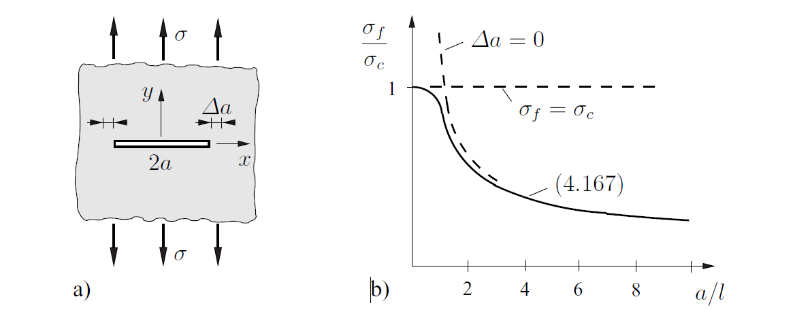

> Hybrid criterion: (a) geometry, (b) failure stress vs. crack length

---

## Fatigue Crack Growth — Mechanism

Under **cyclic loading**, cracks grow incrementally even far below the static fracture load.

**Mechanism** (metals): alternating plastic flow in the process zone under tension and compression (plastic hysteresis) → progressive damage → void formation → separation.

Under LEFM conditions (small-scale yielding), cyclic loading is characterized by the **cyclic stress intensity factor**:

$$\Delta K = K_\text{max} - K_\text{min}$$

---

Experimentally measured crack growth rate (Fig. 4.53b):
- Below threshold $\Delta K_0$ ($< K_{Ic}/10$): **no crack growth**
- Middle range: log-linear relation (Paris regime)
- Near $K_{Ic}$: rapid acceleration to fracture

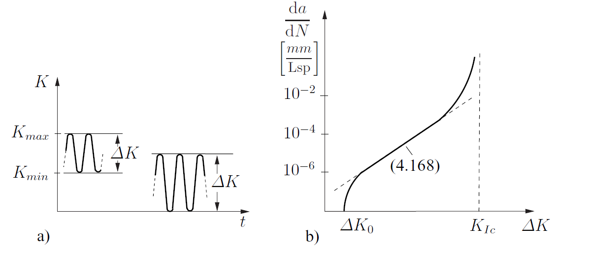
> Fatigue crack growth: (a) periodic loading with $K_\text{min}$, $K_\text{max}$, (b) crack growth rate vs. $\Delta K$

---

## Paris Law

Empirical relation for the middle regime:

$$\boxed{\frac{da}{dN} = C\,(\Delta K)^m}$$

**Paris law** (Paris, 1963):
- $C$, $m$: material constants depending on temperature, environment, mean SIF
- Typical exponents for metals: $m \approx 2\ldots 4$

**Forman relation** (accounts for $K_{Ic}$):

$$\frac{da}{dN} = \frac{C\,(\Delta K)^m}{(1-R)K_{Ic}-\Delta K}, \qquad R = K_\text{min}/K_\text{max}$$

**Physical model** (plastic zone proportional to $K_I^2$): $da/dN \propto (\Delta K)^2$ → $m=2$.

---

## Fatigue Life Prediction

Integrate the Paris law from initial crack length $a_i$ to critical length $a_c$:

$$N(a) = \frac{1}{C(\Delta\sigma)^m}\int_{a_i}^{a}\frac{da'}{\left[\sqrt{\pi a'}F(a')\right]^m}$$

where $\Delta K = \Delta\sigma\sqrt{\pi a}F(a)$ with geometry correction $F(a)$ from Table 4.1.

Setting $a = a_c$ gives the number of cycles to failure $N_c$.

---

**Key inputs required:**
- Initial crack size $a_i$ (inspection/NDT)
- Critical crack size $a_c$ (from $K_I = K_{Ic}$)
- Geometry function $F(a)$
- Material constants $C$, $m$
- Stress range $\Delta\sigma$

---

# Anisotropic Materials

---

## Crack Tip Fields in Orthotropic Materials

Many materials are anisotropic: wood, fiber composites, single crystals.
Most common: **orthotropic** materials (principal directions $\perp$ each other).

**Key result:** for linear orthotropic materials, crack tip fields retain the same qualitative character as isotropic:
- Stress singularity: $\sim 1/\sqrt{r}$
- Crack opening: $\sim\sqrt{r}$
- SIFs $K_I$, $K_{II}$ characterize the field strength

**Important difference:** anisotropy generally causes **mixed-mode coupling** (both $K_I$ and $K_{II}$ present simultaneously), unless the crack direction coincides with an orthotropy axis.

---

## 4.13 Crack in Infinite Orthotropic Plate — Example

Straight crack along the orthotropy direction ($x$-axis, Fig. 4.58a) under remote tension $\sigma$:

Stresses along x-axis ($|x|>a$):

$$\sigma_y = \sigma\frac{x}{\sqrt{x^2-a^2}}$$

This is **identical to the isotropic result** — the SIF is:

$$K_I = \sigma\sqrt{\pi a}$$

Same for pure shear: $K_{II} = \tau\sqrt{\pi a}$.

Crack face displacements differ from the isotropic case by material-dependent prefactors.

---

## Orthotropic Near-Field — Stress and Displacement

Mode I and Mode II near-field:

$$\begin{pmatrix}\sigma_x\\\sigma_y\\\tau_{xy}\end{pmatrix} = \frac{K_I}{\sqrt{2\pi r}}\text{Re}\left\{\ldots(\mu_1,\mu_2,\varphi)\right\}, \quad \begin{pmatrix}u\\v\end{pmatrix} = K_I\sqrt{\frac{2r}{\pi}}\text{Re}\left\{\ldots\right\}$$

where $\mu_1$, $\mu_2$ are complex roots of the orthotropic characteristic equation.

These equations remain valid even when the crack is **not aligned** with an orthotropy axis.

**Energy release rate** (crack ∥ orthotropy axis):

$$\mathcal{G} = K_I^2\sqrt{h_{11}h_{22}} + K_{II}^2\sqrt{h_{11}}\left[\frac{1}{2}\sqrt{\frac{h_{22}}{h_{11}}}+\frac{2h_{12}+h_{66}}{2h_{11}}\right]^{1/2}$$

where $h_{ij}$ are compliance coefficients of the orthotropic material.

---

##  J-Integral and Fracture Criterion for Anisotropic Materials

The J-integral retains all its properties regardless of crack orientation:

$$J = \mathcal{G} = -\frac{d\Pi}{da}$$

Path independence and interpretation as configuration force hold unchanged.

**Fracture criterion:**

$$\mathcal{G} = G_c$$

**Important:** fracture toughness is **direction-dependent** for orthotropic materials:

$$G_c = G_c(\vartheta)$$

where $\vartheta$ is the crack angle relative to the orthotropy axes. Fracture most easily occurs along the preferred orthotropy directions (e.g. fiber direction in composites, grain direction in wood).

---

## Summary: Crack Tip Fields and SIFs

| Mode | Stress singularity | Field characterized by | Extraction |
|------|-------------------|----------------------|------------|
| I | $K_I/\sqrt{2\pi r}$ | $K_I$ | $\lim_{r\to 0}\sqrt{2\pi r}\,\sigma_y(\varphi=0)$ |
| II | $K_{II}/\sqrt{2\pi r}$ | $K_{II}$ | $\lim_{r\to 0}\sqrt{2\pi r}\,\tau_{xy}(\varphi=0)$ |
| III | $K_{III}/\sqrt{2\pi r}$ | $K_{III}$ | $\lim_{r\to 0}\sqrt{2\pi r}\,\tau_{yz}(\varphi=0)$ |

- All have $r^{-1/2}$ stress singularity and $r^{1/2}$ displacement behavior
- SIFs depend on geometry, crack length, and loading
- Tabulated for many standard configurations (Table 4.1)

---

## Summary: Fracture Parameters and Their Equivalence

| Parameter | Strength | Limitation |
|-----------|----------|------------|
| $K_I$ | Direct, tabulated | Linear elastic only |
| $\mathcal{G}$ | Global energy, no crack tip mesh needed | Mode separation requires two runs |
| $J$ | Path-independent, extends to nonlinear | Requires unloaded straight crack faces for path independence |

---
## Literature

 Gross, Seelig "Bruchmechnaik", 2016, DOI 10.1007/978-3-662-46737-4
 Bruchmechanische
 Zerbst, Madia "Bruchmechanische Bauteilbewertung", 2022, DOI 10.1007/978-3-658-36151-8

