

# Micromechanics I
## Fundamentals, Defects, and Basic Solutions

Prof. Dr.-Ing. Christian Willberg
Hochschule Magdeburg-Stendal

---

## Motivation

Real materials appear **macroscopically homogeneous** but show **heterogeneities** under the microscope:

- Cracks and voids
- Regions of foreign material
- Individual layers or fibres in a laminate
- Grain boundaries
- Irregularities in crystal lattice

These heterogeneities act locally as <b>stress concentrators</b> → formation and coalescence of microcracks/micropores → origin of progressive material damage.

**Two central questions of micromechanics:**
1. How does a single defect behave on its own scale?
2. How do many defects affect macroscopic material behaviour?

---

## Macro and Micro Scales

<!-- _class: cols-2 -->

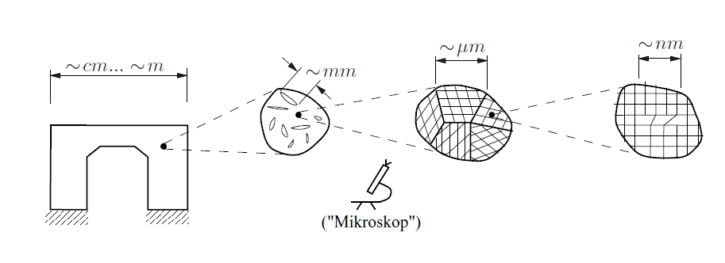

Fig. 8.1 from Gross & Seelig, Bruchmechanik (2016)

**Scale hierarchy — example: metallic component**

| Scale | "Macro" | "Micro" |
|---|---|---|
| Component | geometry | mm-cracks |
| Crack array | mm-cracks | µm-grains |
| Single grain | µm-grain | nm-dislocations |

Characteristic length scales:
- Macro: ~cm … m (component)
- Meso: ~mm (crack arrays)
- Micro: ~µm (grains, grain boundaries)
- Nano: ~nm (dislocations, lattice)

What is "macro" and "micro" depends on the modelling choice.

---

## Two Fundamental Modelling Approaches

<!-- _class: cols-2 -->

**Approach 1: Local defect behaviour**

Study of a single defect on its own scale, including interactions with neighbouring defects.

→ Requires **exact field solutions** (analytical or numerical).

**Approach 2: Micro-to-macro transition**

Effect of many defects on macroscopic constitutive behaviour.

→ The entire microstructure is interpreted as a **mechanical state** of a material point.

→ Transition via **averaging (homogenisation)**.

Changes in microstructure (e.g. crack growth, pore growth) → change in macroscopic effective properties → <b>material damage</b> (Chapter 9).

---

## Defect Classification

<!-- _class: cols-2 -->

**Class 1: Sources of eigenstrain fields**

Generate their own stress/strain field without external loading:

- Dilatation centres (point defects)
- Dislocations (line defects)
- Inclusions (transformation strains)

**Class 2: Perturbation under external load**

Disturb an otherwise homogeneous field:

- Particles of foreign material (inhomogeneities)
- Holes / voids (pores)
- Cracks

**Unifying strategy:**
Decompose total field = homogeneous reference field + defect-induced deviation.
The deviation can always be expressed as an **equivalent eigenstrain** in a homogeneous comparison material.

---

## Concept of Eigenstrains

**Definition:** Strains present in the absence of stress — no mechanical forcing.

$$\varepsilon_{ij} = \varepsilon^e_{ij} + \varepsilon^t_{ij}, \qquad \sigma_{ij} = C_{ijkl}\left(\varepsilon_{kl} - \varepsilon^t_{kl}\right)$$

| Source | Expression |
|---|---|
| Thermal expansion | $\varepsilon^t_{ij} = k\Delta T\,\delta_{ij}$ |
| Plastic strain | $\varepsilon^t_{ij} = \varepsilon^p_{ij}$ |
| Phase transformation | lattice geometry change |
| Misfit strain | inclusion in matrix |

Eigenstrains are also called <i>stress-free transformation strains</i> — stress arises only through the constraint of the surrounding material.

---

## Dilatation Centre

<!-- _class: cols-2 -->

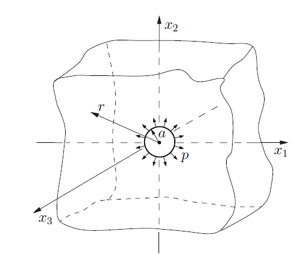

Fig. 8.2 from Gross & Seelig, Bruchmechanik (2016)

Idealisation: **point-like region** with infinite radial expansion, equivalent to sphere of radius $a$ under pressure $p$.

Displacement and stress field (spherical coordinates):

$$u_r = p\frac{a^3}{4\mu r^2}, \quad u_\varphi = u_\vartheta = 0$$

$$\sigma_{rr} = -p\frac{a^3}{r^3}$$

$$\sigma_{\varphi\varphi} = \sigma_{\vartheta\vartheta} = p\frac{a^3}{2r^3}$$

- **Tension** circumferential, **compression** radial
- Decay: $u \sim r^{-2}$, $\sigma \sim r^{-3}$
- Application: interstitial atom in crystal lattice

---

## Edge Dislocation

<!-- _class: cols-2 -->

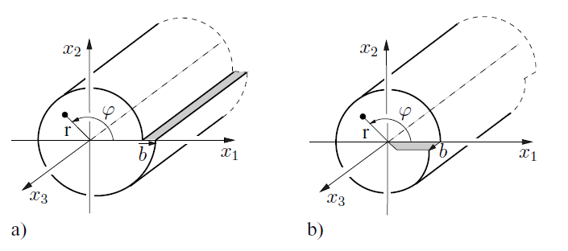

Fig. 8.3a from Gross & Seelig, Bruchmechanik (2016)

Line defect along the $x_3$-axis. **Burgers vector** $b \perp$ dislocation line.

Displacement field (isotropic, linear elastic):

$$u_1 = \frac{D}{2\mu}\left[2(1-\nu)\varphi + \frac{x_1 x_2}{r^2}\right]$$

$$u_2 = \frac{D}{2\mu}\left[-(1-2\nu)\ln r + \frac{x_2^2}{r^2}\right]$$

with $D = \frac{b\mu}{2\pi(1-\nu)}$, $r^2 = x_1^2 + x_2^2$.

Stress components:

$$\sigma_{11} = -Dx_2\frac{3x_1^2+x_2^2}{r^4}, \quad \sigma_{12} = Dx_1\frac{x_1^2-x_2^2}{r^4}$$

---

## Screw Dislocation

<!-- _class: cols-2 -->

Fig. 8.3b from Gross & Seelig, Bruchmechanik (2016)

Burgers vector $b \parallel$ dislocation line ($x_3$-axis) — purely out-of-plane, **antiplane shear**.

$$u_3 = \frac{b}{2\pi}\varphi$$

$$\sigma_{13} = -\frac{b\mu}{2\pi}\frac{x_2}{r^2}, \quad \sigma_{23} = \frac{b\mu}{2\pi}\frac{x_1}{r^2}$$

**Both dislocation types:**
- Singular at $r \to 0$ (continuum breaks down at atomic scale)
- Far field: $u \sim r^{-1}$, $\sigma \sim r^{-2}$ (slower than dilatation centre)
- Crystal plasticity: dislocation motion drives slip along glide planes

---

## Inclusion — Definition

<!-- _class: cols-2 -->

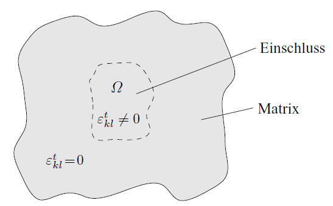

Fig. 8.4 from Gross & Seelig, Bruchmechanik (2016)

Sub-domain $\Omega$ with eigenstrain $\varepsilon^t_{kl} \neq 0$ embedded in a matrix with the **same elastic constants**.

**Inclusion** = same $C_{ijkl}$ as matrix + eigenstrain $\varepsilon^t_{kl}$.

**Inhomogeneity** = different $C_{ijkl}$ from matrix.

$$\sigma_{ij} = C_{ijkl}\left(\varepsilon_{kl} - \varepsilon^t_{kl}\right)$$

For general geometry $\Omega$, no closed-form solution exists. Key special case: **ellipsoidal inclusion**.

---

## The Eshelby Solution

<!-- _class: cols-2 -->

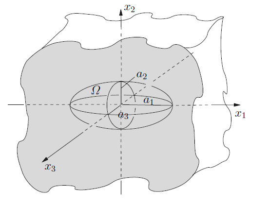

Fig. 8.5 from Gross & Seelig, Bruchmechanik (2016)

Ellipsoidal inclusion $\Omega$ with semi-axes $a_i$, uniform eigenstrain $\varepsilon^t_{kl} = \text{const}$.

**Eshelby's result (1957):**

$$\varepsilon_{ij} = S_{ijkl}\,\varepsilon^t_{kl} = \text{const} \quad \text{in } \Omega$$

$$\sigma_{ij} = C_{ijmn}(S_{mnkl} - I_{mnkl})\varepsilon^t_{kl} = \text{const}$$

- Strain **and** stress inside $\Omega$ are **uniform**
- $S_{ijkl}$: Eshelby tensor — depends only on $\nu$ and $a_i/a_j$
- Outside $\Omega$: decay $\sim r^{-3}$

Closed-form $S_{ijkl}$ only possible for isotropic material.

---

## Eshelby Tensor — Properties and Symmetry

The Eshelby tensor satisfies:

$$S_{ijkl} = S_{jikl} = S_{ijlk}, \qquad \text{but in general: } S_{ijkl} \neq S_{klij}$$

$S_{ijkl}$ depends only on Poisson's ratio $\nu$ and aspect ratios $a_i$.

**Elliptical cylinder** ($a_3 \to \infty$, plane strain):

<!-- _class: cols-2 -->

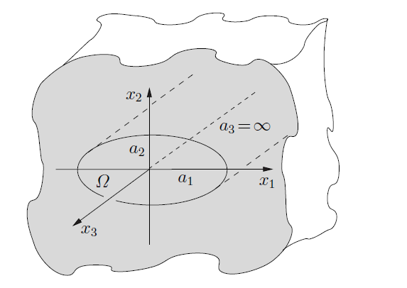

Fig. 8.6 from Gross & Seelig, Bruchmechanik (2016)

Outside decay $\sim r^{-2}$. Selected components:

$$S_{1212} = \frac{1}{2(1-\nu)}\!\left[\frac{a_1^2+a_2^2}{2(a_1+a_2)^2} + \frac{1-2\nu}{2}\right]$$

$$S_{1313} = \frac{a_2}{2(a_1+a_2)}, \quad S_{2323} = \frac{a_1}{2(a_1+a_2)}$$

---

## Eshelby Tensor — Spherical Inclusion

For a **spherical inclusion** ($a_i = a$) in an **isotropic** matrix:

$$S_{ijkl} = \alpha\frac{1}{3}\delta_{ij}\delta_{kl} + \beta\left(I_{ijkl} - \frac{1}{3}\delta_{ij}\delta_{kl}\right)$$

$$\alpha = \frac{1+\nu}{3(1-\nu)} = \frac{3K}{3K+4\mu}, \qquad \beta = \frac{2(4-5\nu)}{15(1-\nu)} = \frac{6(K+2\mu)}{5(3K+4\mu)}$$

Decomposition into volumetric and deviatoric parts:

$$\varepsilon_{kk} = \alpha\,\varepsilon^t_{kk}, \qquad e_{ij} = \beta\,e^t_{ij} \quad \text{in } \Omega$$

**Example — thermal expansion** $\varepsilon^t_{ij} = k\Delta T\,\delta_{ij}$ in sphere of radius $a$:

Inside: $\varepsilon_r = \varepsilon_\varphi = \varepsilon_\vartheta = \frac{1+\nu}{3(1-\nu)}k\Delta T$ (less than free expansion — matrix constrains)

Outside: $\varepsilon_r = -2\frac{1+\nu}{3(1-\nu)}\!\left(\frac{a}{r}\right)^3\!k\Delta T$ (decays as $r^{-3}$, like dilatation centre)

---

## Defect Energies

<!-- _class: cols-2 -->

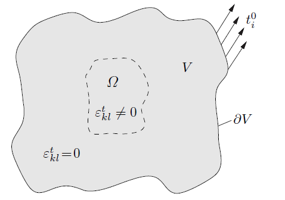

Fig. 8.7 from Gross & Seelig, Bruchmechanik (2016)

Inclusion $\Omega$ in domain $V$ under external traction $t^0_i$. Total potential:

$$\Pi = \Pi_0 + \Pi_t + \Pi_W$$

**Self-energy** of the defect:

$$\Pi_t = -\frac{1}{2}\int_\Omega \sigma_{ij}\varepsilon^t_{ij}\,dV$$

For ellipsoidal inclusion (uniform $\sigma$ in $\Omega$):

$$\Pi_t = -\frac{1}{2}C_{ijmn}(S_{mnkl}-I_{mnkl})\varepsilon^t_{ij}\varepsilon^t_{kl}V_\Omega$$

**Interaction energy** with external load:

$$\Pi_W = -\sigma^0_{ij}\varepsilon^t_{ij}V_\Omega$$

---

## Generalised Force on a Dilatation Centre

<!-- _class: cols-2 -->

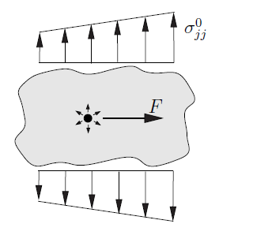

Fig. 8.8 from Gross & Seelig, Bruchmechanik (2016)

Dilatation centre at $\xi$: $\varepsilon^t_{ij}(\mathbf{x}) = q\,\delta(\mathbf{x}-\xi)\delta_{ij}$

Interaction energy: $\Pi_W(\xi) = -q\,\sigma^0_{jj}(\xi)$

$$F_k = -\frac{\partial\Pi_W}{\partial\xi_k} = q\,\frac{\partial\sigma^0_{jj}(\xi)}{\partial\xi_k}$$

Force is proportional to **gradient of hydrostatic stress**.

**Consequence:** Interstitial atom migrates towards regions of **higher hydrostatic tension** — larger lattice spacing.

Mechanism behind <b>stress-assisted diffusion</b>: relevant for hydrogen embrittlement and high-temperature creep.

---

## Equivalent Eigenstrain Concept

<!-- _class: cols-2 -->

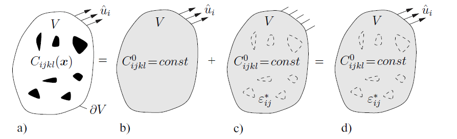

Fig. 8.9 from Gross & Seelig, Bruchmechanik (2016)

Replace heterogeneous material $C_{ijkl}(\mathbf{x})$ by homogeneous reference $C^0_{ijkl}$ + equivalent eigenstrain.

Difference fields $\tilde{u}_i = u_i - u^0_i$ satisfy:

$$\tilde{\sigma}_{ij,j} = 0, \quad \tilde{\sigma}_{ij} = C^0_{ijkl}(\tilde{\varepsilon}_{kl} - \varepsilon^*_{kl}), \quad \tilde{u}_i|_{\partial V} = 0$$

**Equivalent eigenstrain:**

$$\varepsilon^*_{ij} = -C^{0-1}_{ijkl}\left[C_{klmn}(\mathbf{x}) - C^0_{klmn}\right]\varepsilon_{mn}$$

**Stress polarisation:** $\tau_{ij} = [C_{ijkl}(\mathbf{x})-C^0_{ijkl}]\varepsilon_{kl}$

Exists only where material is heterogeneous → enables Eshelby-type solutions.

---

## Ellipsoidal Inhomogeneity

<!-- _class: cols-2 -->

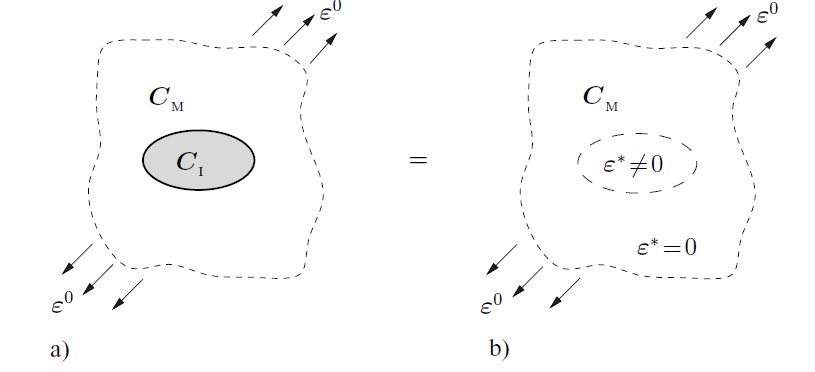

Fig. 8.10 from Gross & Seelig, Bruchmechanik (2016)

$C^I$ in $\Omega$, $C^M$ in matrix, reference $C^0 = C^M$, remote $\varepsilon^0 = \text{const}$.

Applying Eshelby result, total strain in $\Omega$:

$$\varepsilon = \underbrace{\left[\mathbf{1} + S:C_M^{-1}:(C^I-C^M)\right]^{-1}}_{A^\infty_I}:\varepsilon^0$$

Stress from remote $\sigma^0 = C^M:\varepsilon^0$:

$$\sigma = C^I:A^\infty_I:C_M^{-1}:\sigma^0$$

**Spherical inhomogeneity** ($\nu_M = 1/3$, $\alpha = 2/3$):
- Hard ($K^I \gg K^M$): $\sigma_{ii} \approx 1.5\,\sigma^0_{ii}$ → amplification
- Soft ($K^I \ll K^M$): $\sigma_{ii} \ll \sigma^0_{ii}$ → shielding

---

## Cavities and Cracks — Overview

<!-- _class: cols-2 -->

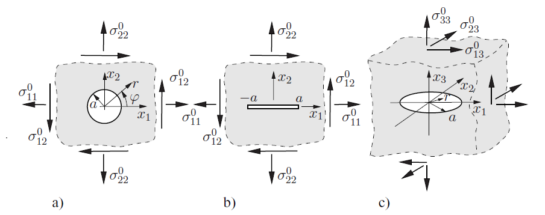

Fig. 8.11 from Gross & Seelig, Bruchmechanik (2016)

Voids and cracks: special case with **vanishing stiffness** $C^I = 0$, traction-free surfaces.

| | Geometry | Dim. |
|---|---|---|
| (a) | Circular hole | 2D |
| (b) | Straight crack $2a$ | 2D |
| (c) | Penny-shaped crack $a$ | 3D |

Key quantity: **displacement on defect boundary** (needed for homogenisation).

The displacement jump of a crack = its eigenstrain → integration gives the additional compliance tensor $H^\infty$.

---

## Circular Hole (2D)

Infinite isotropic plate, hole radius $a$, remote uniform stress $\sigma^0_{ij}$ (plane stress).

Displacements on hole boundary ($r = a$):

$$u_r(a,\varphi) = \frac{a}{E}\left[\sigma^0_{11}(3\cos^2\!\varphi - \sin^2\!\varphi) + \sigma^0_{22}(3\sin^2\!\varphi - \cos^2\!\varphi) + 4\sigma^0_{12}\sin 2\varphi\right]$$

$$u_\varphi(a,\varphi) = \frac{2a}{E}\left[-\sigma^0_{11}\sin 2\varphi + \sigma^0_{22}\sin 2\varphi + 2\sigma^0_{12}(\cos^2\!\varphi - \sin^2\!\varphi)\right]$$

The Kirsch solution for the stress concentration around a circular hole is the full-field companion to these boundary displacements (Chapter 2).

---

## Straight Crack (2D) and Penny-Shaped Crack (3D)

<!-- _class: cols-2 -->

**Straight crack**, length $2a$, plane stress:

**Displacement jump** $\Delta u_i = u^+_i - u^-_i$:

$$\Delta u_i(x_1) = \frac{4\sigma^0_{i2}}{E}\sqrt{a^2-x_1^2}$$

- Mode I (opening): $\Delta u_2$, driven by $\sigma^0_{22}$
- Mode II (sliding): $\Delta u_1$, driven by $\sigma^0_{12}$
- Elliptical profile, zero at crack tips

**Penny-shaped crack**, radius $a$, normal $\parallel x_3$:

$$\Delta u_i = \frac{16(1-\nu^2)}{\pi E(2-\nu)}\sigma^0_{i3}\sqrt{a^2-r^2} \quad (i=1,2)$$

$$\Delta u_3 = \frac{8(1-\nu^2)}{\pi E}\sigma^0_{33}\sqrt{a^2-r^2}$$

Ellipsoidal profile — maximum at centre, zero at rim.

Shear compliance $(2-\nu)$ in denominator → shear stiffer than opening.

---

## Summary — Lecture 1

| Defect | Type | Key result | Decay |
|---|---|---|---|
| Dilatation centre | 0D | radial field | $r^{-2}$, $r^{-3}$ |
| Edge dislocation | 1D | $\sigma_{11}, \sigma_{12}, \sigma_{22}$ | $r^{-2}$ |
| Screw dislocation | 1D | $\sigma_{13}, \sigma_{23}$ | $r^{-2}$ |
| Inclusion (Eshelby) | 3D | uniform $\varepsilon$, $\sigma$ in $\Omega$ | $r^{-3}$ outside |
| Inhomogeneity | 3D | concentration tensor $A^\infty_I$ | $r^{-3}$ outside |
| Circular hole | 2D | boundary displacements | — |
| Straight crack | 2D | displacement jump $\Delta u$ | — |
| Penny-shaped crack | 3D | displacement jump $\Delta u$ | — |

The Eshelby solution is the cornerstone of all analytical homogenisation — the concentration tensor $A^\infty_I$ derived here will appear in every method in Lecture 2.

