

# Micromechanics II
## Homogenisation — Effective Elastic Properties

Prof. Dr.-Ing. Christian Willberg
Hochschule Magdeburg-Stendal

---

## From Micro to Macro

<!-- _class: cols-2 -->

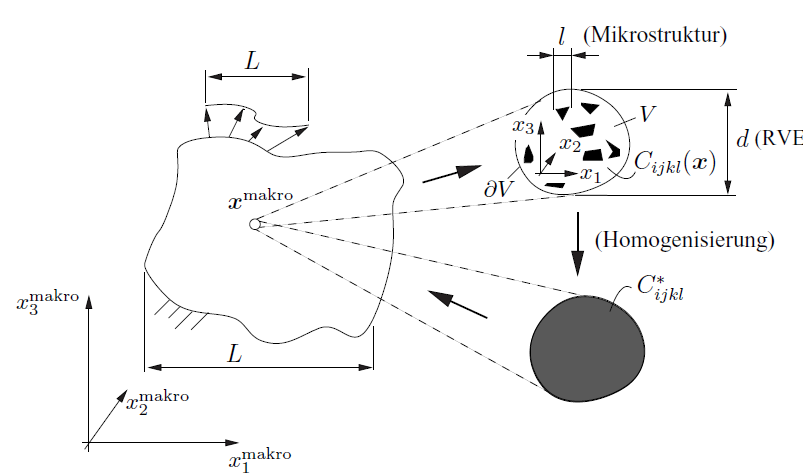

Fig. 8.12 from Gross & Seelig, Bruchmechanik (2016)

**Goal:** Replace heterogeneous microstructure by a homogeneous material with **effective properties** $C^*_{ijkl}$.

- Macro point $\mathbf{x}^{\text{macro}}$: sees homogeneous $C^*$
- Zoom in: heterogeneous field $C_{ijkl}(\mathbf{x})$
- Homogenisation: extract $C^*_{ijkl}$

**Historical pioneers:**
Maxwell, Lord Rayleigh, Einstein (viscosity), Voigt, Reuss, Kröner, Hill

Enables material design: optimise microstructure for desired macroscopic behaviour.

---

## Scale Separation

For a meaningful homogenisation, characteristic lengths must satisfy:

$$l \ll d \ll L$$

<!-- _class: cols-2 -->

| Symbol | Meaning |
|---|---|
| $l$ | Defect size or spacing |
| $d$ | RVE size |
| $L$ | Macro scale (geometry, load) |

**Practical values:**
- Ceramics / polycrystals: $d \approx 0.1\,\text{mm}$
- Concrete: $d \approx 100\,\text{mm}$

**When does homogenisation fail?**

- Near macro crack tip: $L \to 0$ → singular strain field
- Micro-system technology: components too small
- Gradient materials: microstructure varies in space

Near a crack tip the process zone violates the right side of the inequality — classical homogenisation breaks down there.

---

## Representative Volume Element (RVE)

<!-- _class: cols-2 -->

Fig. 8.12 from Gross & Seelig, Bruchmechanik (2016)

Volume $V$ is an **RVE** if $C^*$ is **independent** of:
- Position on the macro scale
- Size and shape of $V$
- Type of boundary condition applied

Only if $C^{*(a)} = C^{*(b)} = C^*$ (strain BC = stress BC) is the volume truly representative. The gap is a quality indicator.

**Special case:** Periodic microstructure → single **unit cell** already constitutes an RVE.

---

## Averaging Theorems

For volume $V$, boundary $\partial V$, no body forces:

$$\langle\sigma_{ij}\rangle = \frac{1}{V}\int_V \sigma_{ij}\,dV = \frac{1}{V}\int_{\partial V} t_i\,x_j\,dA$$

$$\langle\varepsilon_{ij}\rangle = \frac{1}{V}\int_V \varepsilon_{ij}\,dV = \frac{1}{2V}\int_{\partial V}(u_i n_j + u_j n_i)\,dA$$

<!-- _class: cols-2 -->

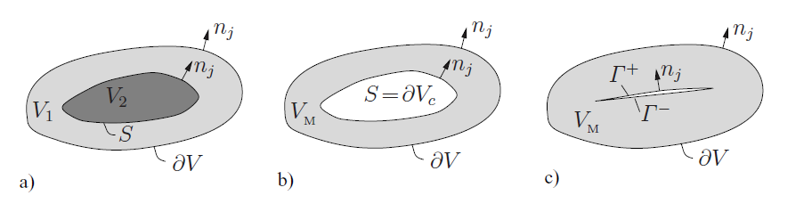

Fig. 8.13 from Gross & Seelig, Bruchmechanik (2016)

Boundary integral forms hold even for **discontinuous** fields:
- Interface integrals cancel due to traction/displacement continuity at internal interfaces
- Valid for heterogeneous materials, voids, and cracks

---

## Averaging — Voids and Cracks

For a matrix with **voids** ($c_M = V_M/V$):

$$\langle\varepsilon_{ij}\rangle = c_M\langle\varepsilon_{ij}\rangle_M + \underbrace{\frac{1}{2V}\int_{\partial V_c}(u_i n_j + u_j n_i)\,dA}_{\varepsilon^c_{ij}}$$

For **cracks** (displacement jump $\Delta u_i$ over crack surface $\Gamma$):

$$\langle\varepsilon_{ij}\rangle = c_M\langle\varepsilon_{ij}\rangle_M + \frac{1}{2V}\int_\Gamma(\Delta u_i\,n_j + \Delta u_j\,n_i)\,dA$$

For traction-free voids and cracks — **macro stress from matrix alone**:

$$\langle\sigma_{ij}\rangle = c_M\langle\sigma_{ij}\rangle_M$$

---

## Hill Condition

Effective properties are physically meaningful only if macro strain energy = volume average:

$$\langle\sigma_{ij}\varepsilon_{ij}\rangle = \langle\sigma_{ij}\rangle\langle\varepsilon_{ij}\rangle$$

<!-- _class: cols-2 -->

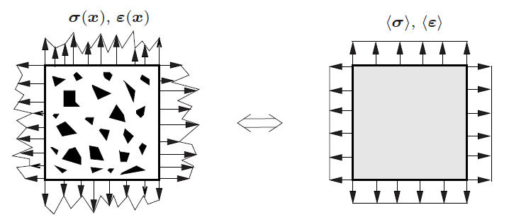

Fig. 8.14 from Gross & Seelig, Bruchmechanik (2016)

Equivalently: fluctuations do no net work:

$$\langle\tilde{\sigma}_{ij}\tilde{\varepsilon}_{ij}\rangle = 0$$

Boundary form:

$$\frac{1}{V}\!\int_{\partial V}\!\left(u_i - \langle\varepsilon_{ij}\rangle x_j\right)\!\left(\sigma_{ik} - \langle\sigma_{ik}\rangle\right)\!n_k\,dA = 0$$

Automatically satisfied by:
- Linear displacement BC
- Uniform traction BC
- Periodic BC

---

## Boundary Conditions for Homogenisation

**a) Linear displacement BC:**

$$u_i = \varepsilon^0_{ij}x_j \text{ on } \partial V \quad \Rightarrow \quad \langle\varepsilon_{ij}\rangle = \varepsilon^0_{ij} \quad \text{(average strain theorem)}$$

**b) Uniform traction BC:**

$$t_i = \sigma^0_{ij}n_j \text{ on } \partial V \quad \Rightarrow \quad \langle\sigma_{ij}\rangle = \sigma^0_{ij} \quad \text{(average stress theorem)}$$

**c) Periodic BC** (on opposite faces $A^\pm_k$):

$$u_i(A^+_k) - u_i(A^-_k) = \varepsilon^0_{i(k)}b_{(k)}, \qquad t_i(A^+_k) = -t_i(A^-_k)$$

For a non-representative volume: $C^{*(a)} \neq C^{*(b)}$. The gap quantifies how far the volume is from being an RVE. For periodic microstructures, periodic BC is the correct choice.

---

## Effective Elastic Tensor — Definition

Analogous to the micro-scale law $\sigma_{ij} = C_{ijkl}\varepsilon_{kl}$:

$$\langle\sigma_{ij}\rangle = C^*_{ijkl}\langle\varepsilon_{kl}\rangle$$

**Influence tensors** $A(\mathbf{x})$, $B(\mathbf{x})$ (full solution of BVP):

$$\varepsilon_{ij}(\mathbf{x}) = A_{ijkl}(\mathbf{x})\,\varepsilon^0_{kl}, \qquad \sigma_{ij}(\mathbf{x}) = B_{ijkl}(\mathbf{x})\,\sigma^0_{kl}$$

Volume averages: $\langle A\rangle = \langle B\rangle = \mathbf{1}$

Effective stiffness:

$$C^{*(a)} = \langle C:A\rangle = \langle A^T:C:A\rangle$$

$$C^{*(b)} = \left[\langle C^{-1}:B\rangle\right]^{-1}$$

---

## Phase Averages — Two-Phase Material

For $n$ discrete phases with volume fractions $c_\alpha$, constant $C_\alpha$ per phase:

$$\langle\sigma\rangle = \sum_\alpha c_\alpha\langle\sigma\rangle_\alpha, \quad \langle\varepsilon\rangle = \sum_\alpha c_\alpha\langle\varepsilon\rangle_\alpha, \quad \langle\sigma\rangle_\alpha = C_\alpha:\langle\varepsilon\rangle_\alpha$$

Phase concentration tensors: $\langle\varepsilon\rangle_\alpha = A_\alpha:\langle\varepsilon\rangle$, with constraint $\sum_\alpha c_\alpha A_\alpha = \mathbf{1}$.

**Two-phase material** (Matrix M + Inhomogeneity I):

$$C^{*(a)} = C_M + c_I(C^I - C_M):A_I$$

$$C^{*(b)} = \left[C_M^{-1} + c_I(C_I^{-1} - C_M^{-1}):B_I\right]^{-1}$$

Only the influence tensor of $n-1$ phases is needed, due to the constraint.

---

## Periodic Microstructures and Unit Cells

<!-- _class: cols-2 -->

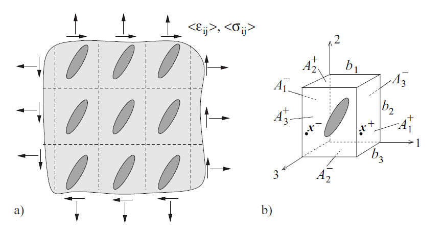

Fig. 8.15 from Gross & Seelig, Bruchmechanik (2016)

Periodic defect arrangement → identical unit cells.
One unit cell is already an RVE.

**Periodic BC** on faces $A^\pm_k$ (edge length $b_{(k)}$):

$$u_i(A^+_k) - u_i(A^-_k) = \varepsilon^0_{i(k)}b_{(k)}$$

$$t_i(A^+_k) = -t_i(A^-_k)$$

- Hill condition automatically satisfied
- $\langle\varepsilon_{ij}\rangle = \varepsilon^0_{ij}$ (proven by boundary integral)
- Unit cells A and B → **same** result

---

## Voigt Bound — Constant Strain

**Voigt (1889):** $\hat{\varepsilon}(\mathbf{x}) = \langle\varepsilon\rangle = \text{const}$ → $A(\mathbf{x}) = \mathbf{1}$

$$C^*_{\text{Voigt}} = \langle C\rangle = \sum_\alpha c_\alpha C_\alpha \qquad \text{(arithmetic mean of stiffnesses — upper bound)}$$

**Proof** from minimum potential energy: for any kinematically admissible $\hat{\varepsilon}$:

$$\langle\hat{\varepsilon}:C:\hat{\varepsilon}\rangle \geq \langle\varepsilon\rangle:C^*:\langle\varepsilon\rangle \quad \Rightarrow \quad C^*_{\text{Voigt}} \geq C^*$$

## Reuss Bound — Constant Stress

**Reuss (1929):** $\hat{\sigma}(\mathbf{x}) = \langle\sigma\rangle = \text{const}$ → $B(\mathbf{x}) = \mathbf{1}$

$$C^{*-1}_{\text{Reuss}} = \langle C^{-1}\rangle = \sum_\alpha c_\alpha C^{-1}_\alpha \qquad \text{(arithmetic mean of compliances — lower bound)}$$

$$C^*_{\text{Voigt}} \geq C^* \geq C^*_{\text{Reuss}}$$

Voigt violates local equilibrium; Reuss violates compatibility. Exact only for parallel/series arrangements. Often too wide for practical use.

---

## Dilute Distribution — Concept and Ellipsoids

<!-- _class: cols-2 -->

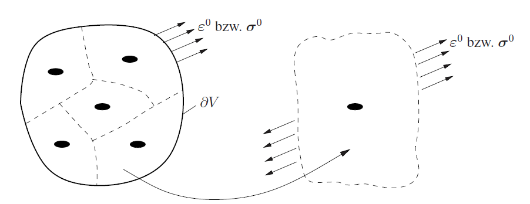

Fig. 8.16 from Gross & Seelig, Bruchmechanik (2016)

Each defect sees the **far-field** $\varepsilon^0$ — interactions neglected. Valid for $c_I \ll 1$.

**Ellipsoidal inhomogeneities:**

$$C^*_{\text{DD}} = C_M + c_I(C^I-C_M):A^\infty_I$$

$$A^\infty_I = \left[\mathbf{1}+S_M:C_M^{-1}:(C^I-C_M)\right]^{-1}$$

**Spherical isotropic case:**

$$K^*_{\text{DD}} = K_M + c_I\frac{(K^I-K_M)K_M}{K_M+\alpha(K^I-K_M)}$$

$$\mu^*_{\text{DD}} = \mu_M + c_I\frac{(\mu^I-\mu_M)\mu_M}{\mu_M+\beta(\mu^I-\mu_M)}$$

Rigid spheres, incompressible matrix ($\beta=2/5$): $\mu^* = \mu_M(1+\frac{5}{2}c_I)$ → **Einstein (1906)**

---

## Dilute Distribution — Circular Holes (2D)

<!-- _class: cols-2 -->

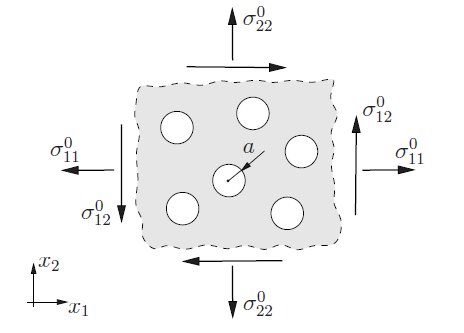

Fig. 8.17 from Gross & Seelig, Bruchmechanik (2016)

Isotropic plate, hole area fraction $c = \pi a^2/A$.

Integration of boundary solution (Eq. 8.37) over hole boundary → additional compliance $H^\infty$:

$$H^\infty_{1111} = H^\infty_{2222} = \frac{3c}{E}, \quad H^\infty_{1122} = -\frac{c}{E}, \quad H^\infty_{1212} = \frac{4c}{E}$$

Effective moduli:

$$E^*_{\text{DD}} = \frac{E}{1+3c} \approx E(1-3c)$$

$$\mu^*_{\text{DD}} = \frac{E}{2(1+\nu+4c)} \approx \mu\!\left(1-\frac{4c}{1+\nu}\right)$$

Both moduli decrease with increasing hole fraction.

---

## Dilute Distribution — Straight Cracks (2D)

<!-- _class: cols-2 -->

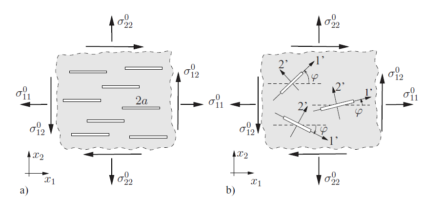

Fig. 8.18 from Gross & Seelig, Bruchmechanik (2016)

Crack density $f = a^2/A$ ($f \ll 1$). Additional compliance: $H^\infty_{1212} = f\pi/E$, $H^\infty_{2222} = 2f\pi/E$.

**Parallel cracks** (Fig. 8.18a) → **anisotropic**:

$$E^*_1 = E, \quad E^*_2 = \frac{E}{1+2\pi f}, \quad \mu^*_{12} = \frac{E}{2(1+\nu+\pi f)}$$

**Random orientation** (Fig. 8.18b) → **isotropic**:

$$H^\infty_{1111} = H^\infty_{2222} = H^\infty_{1212} = f\frac{\pi}{E}$$

$$E^*_{\text{DD}} = \frac{E}{1+\pi f}, \quad \mu^*_{\text{DD}} = \frac{E}{2(1+\nu+\pi f)}$$

---

## Dilute Distribution — Penny-Shaped Cracks (3D)

Crack density $f = a^3/V$. Additional compliance (crack normal $\parallel x_3$):

$$H^\infty_{3333} = f\frac{16(1-\nu^2)}{3E}, \qquad H^\infty_{1313} = H^\infty_{2323} = f\frac{32(1-\nu^2)}{3E(2-\nu)}$$

<!-- _class: cols-2 -->

**Parallel cracks** → **transversely isotropic**:

$$E^*_{1,2} = E, \quad \nu^*_{12} = \nu, \quad \mu^*_{12} = \mu$$

$$E^*_3 = \frac{3E}{3+16f(1-\nu^2)}$$

$$\mu^*_{13} = \mu\!\left[1+f\frac{16(1-\nu)}{3(2-\nu)}\right]^{-1}$$

**Random orientation** → **isotropic**:

$$E^* \approx E\!\left[1-f\frac{16(1-\nu^2)(10-3\nu)}{45(2-\nu)}\right]$$

$$\mu^* \approx \mu\!\left[1-f\frac{32(1-\nu)(5-\nu)}{45(2-\nu)}\right]$$

Shear stiffer than opening: factor $(2-\nu)$ in denominator of $H^\infty_{1313}$.

---

## Mori-Tanaka Method

<!-- _class: cols-2 -->

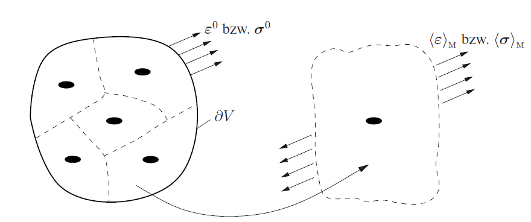

Fig. 8.19 from Gross & Seelig, Bruchmechanik (2016)

Each defect sees the **mean matrix field** $\langle\varepsilon\rangle_M$ (not the global $\varepsilon^0$). Accounts for interaction via average matrix state.

$$\langle\varepsilon\rangle_I = A^\infty_I:\langle\varepsilon\rangle_M$$

Eliminate $\langle\varepsilon\rangle_M$ using $\langle\varepsilon\rangle = c_M\langle\varepsilon\rangle_M + c_I\langle\varepsilon\rangle_I$:

$$A^{(\text{MT})}_I = \left[c_I\mathbf{1}+c_M A^{\infty-1}_I\right]^{-1}$$

Spherical isotropic inclusions:

$$K^*_{\text{MT}} = K_M + \frac{c_I(K^I-K_M)K_M}{K_M+\alpha(1-c_I)(K^I-K_M)}$$

$$\mu^*_{\text{MT}} = \mu_M + \frac{c_I(\mu^I-\mu_M)\mu_M}{\mu_M+\beta(1-c_I)(\mu^I-\mu_M)}$$

---

## Mori-Tanaka — Holes and Cracks

For holes: $H^{(\text{MT})} = H^\infty/c_M$, so $C^*_{\text{MT}} = [C_M^{-1}+H^{(\text{MT})}]^{-1}$.

**Circular holes (2D):**

$$E^*_{\text{MT}} = E\frac{1-c}{1+2c}, \qquad \mu^*_{\text{MT}} = \mu\frac{(1-c)(1+\nu)}{1+\nu+c(3-\nu)}$$

**Cracks (2D and 3D):** Since cracks have vanishing volume, $c_M = 1$ → $\langle\sigma\rangle_M = \langle\sigma\rangle$.

→ MT gives the **same result as dilute distribution** for cracks at any density $f$.

→ No loss of macroscopic load-bearing capacity predicted.

**Key properties of Mori-Tanaka:**
- Correctly recovers $c_I = 0$ and $c_I = 1$
- Result independent of BC type (strain or stress)
- Asymptotically = dilute model for $c_I \ll 1$

---

## Self-Consistent Method

<!-- _class: cols-2 -->

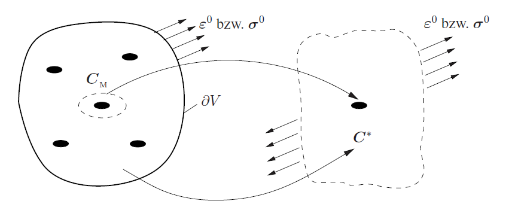

Fig. 8.20 from Gross & Seelig, Bruchmechanik (2016)

Each defect embedded in matrix with properties = **unknown effective properties** $C^*$.

No distinguished matrix phase → suitable for **polycrystals**.

$$A^{(\text{SC})}_I = \left[\mathbf{1}+S^*:C^{*-1}:(C^I-C^*)\right]^{-1}$$

$$C^*_{\text{SC}} = C_M + c_I(C^I-C_M):A^\infty_I(C^*_{\text{SC}})$$

Must be solved **iteratively**.

For isotropic two-phase:

$$0 = \frac{c_M}{K^*-K^I}+\frac{c_I}{K^*-K^M}-\frac{3}{3K^*+4\mu^*}$$

$$0 = \frac{c_M}{\mu^*-\mu^I}+\frac{c_I}{\mu^*-\mu^M}-\frac{6(K^*+2\mu^*)}{5\mu^*(3K^*+4\mu^*)}$$

---

## Self-Consistent — Percolation

**Rigid spheres in incompressible matrix:**

$$\mu^*_{\text{SC}} = \frac{2\mu_M}{2-5c_I} \to \infty \quad \text{at } c_I = 2/5$$

**Spherical pores in incompressible matrix:**

$$\mu^*_{\text{SC}} \to 0, \quad K^*_{\text{SC}} \to 0 \quad \text{at } c_I = 1/2$$

**Holes (2D), random:**  $E^*_{\text{SC}} = E(1-3c)$ → stiffness loss at $c = 1/3$

**Straight cracks (2D), random:**  $E^*_{\text{SC}} = E(1-\pi f)$ → stiffness loss at $f = 1/\pi$

SC predicts percolation qualitatively — a strength. Quantitatively the threshold is underestimated because statistical homogeneity (RVE) is violated near percolation — a weakness.

---

## Differential Scheme

<!-- _class: cols-2 -->

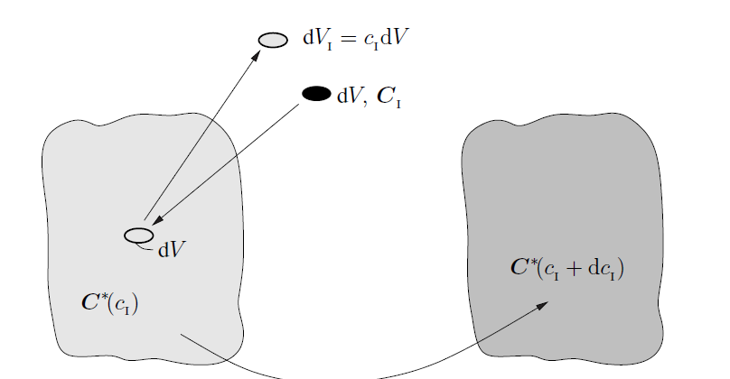

Fig. 8.21 from Gross & Seelig, Bruchmechanik (2016)

Defects added **incrementally** in infinitesimal steps into current effective medium.

Volume balance: $dV/V = dc_I/(1-c_I)$

$$\frac{dC^*}{dc_I} = \frac{1}{1-c_I}(C^I-C^*):A^\infty_I(C^*)$$

Initial condition: $C^*(0) = C_M$

**Solutions:**

Rigid spheres, incompressible matrix: $\mu^*_{\text{DS}} = \mu_M/(1-c_I)^{5/2}$

Circular holes (2D): $E^*_{\text{DS}} = E(1-c)^3$

Straight cracks (2D), random: $E^*_{\text{DS}} = E(1-f)^\pi$

→ Stiffness loss only at $c \to 1$ or $f \to 1$.

---

## Method Comparison — Circular Holes

<!-- _class: cols-2 -->

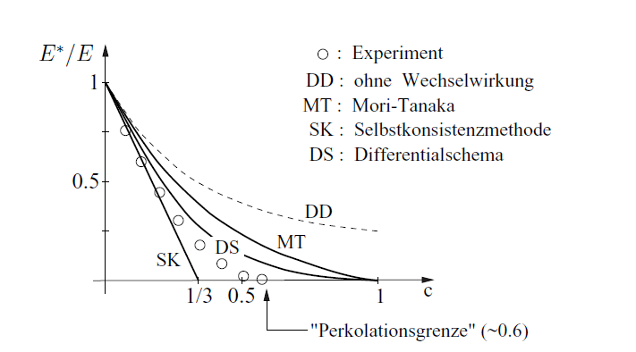

Fig. 8.22 from Gross & Seelig, Bruchmechanik (2016)

| Method | Percolation | Comment |
|---|---|---|
| DD | none | valid $c \ll 1$ only |
| Mori-Tanaka | none | no stiffness loss |
| Self-Consistent | $c = 1/3$ | too early |
| Diff. Scheme | $c \to 1$ | too late |
| Experiment | $c \approx 0.6$ | percolation theory |

**Observations:**
- All methods agree for small $c$ (→ DD asymptote)
- SC qualitatively correct, quantitatively off
- No single method universally best

Percolation is a statistical phenomenon — not captured by any mean-field theory.

---

## Hashin-Shtrikman Variational Principle

Based on **stress polarisation** $\tau(\mathbf{x}) = [C(\mathbf{x})-C^0]:\varepsilon(\mathbf{x})$ as trial field (Hashin & Shtrikman, 1962):

$$F(\hat{\tau}) = \frac{1}{V}\int_V\!\left[-\hat{\tau}:(C-C^0)^{-1}:\hat{\tau} + (\hat{\tau}-\langle\hat{\tau}\rangle):\tilde{\varepsilon}[\hat{\tau}] + 2\hat{\tau}:\varepsilon^0\right]dV = \text{stationary}$$

| $C(\mathbf{x})-C^0$ | Stationary point | Result |
|---|---|---|
| positive definite | maximum | $F(\hat{\tau}) \leq \varepsilon^0:(C^*-C^0):\varepsilon^0$ |
| negative definite | minimum | $F(\hat{\tau}) \geq \varepsilon^0:(C^*-C^0):\varepsilon^0$ |

Choose $C^0$ = **softer phase** → lower bound on $C^*$
Choose $C^0$ = **stiffer phase** → upper bound on $C^*$

---

## Hashin-Shtrikman Bounds

For isotropic two-phase material ($K_M < K^I$, $\mu_M < \mu^I$):

**Lower HS bound** ($C^0 = C_M$):

$$K^*_{\text{HS}-} = K_M + c_I\!\left[\frac{1}{K^I-K_M}+\frac{3c_M}{3K_M+4\mu_M}\right]^{-1}$$

$$\mu^*_{\text{HS}-} = \mu_M + c_I\!\left[\frac{1}{\mu^I-\mu_M}+\frac{6c_M(K_M+2\mu_M)}{5\mu_M(3K_M+4\mu_M)}\right]^{-1}$$

Upper HS bound: swap $M \leftrightarrow I$. Overall hierarchy:

$$C^*_{\text{Reuss}} \leq C^*_{\text{HS}-} \leq C^* \leq C^*_{\text{HS}+} \leq C^*_{\text{Voigt}}$$

**Remarkable connection:** $C^*_{\text{HS}-}$ = **Mori-Tanaka** result (soft matrix). $C^*_{\text{HS}+}$ = MT with swapped roles.

HS bounds are the **tightest possible** from volume fractions and phase properties alone.

---

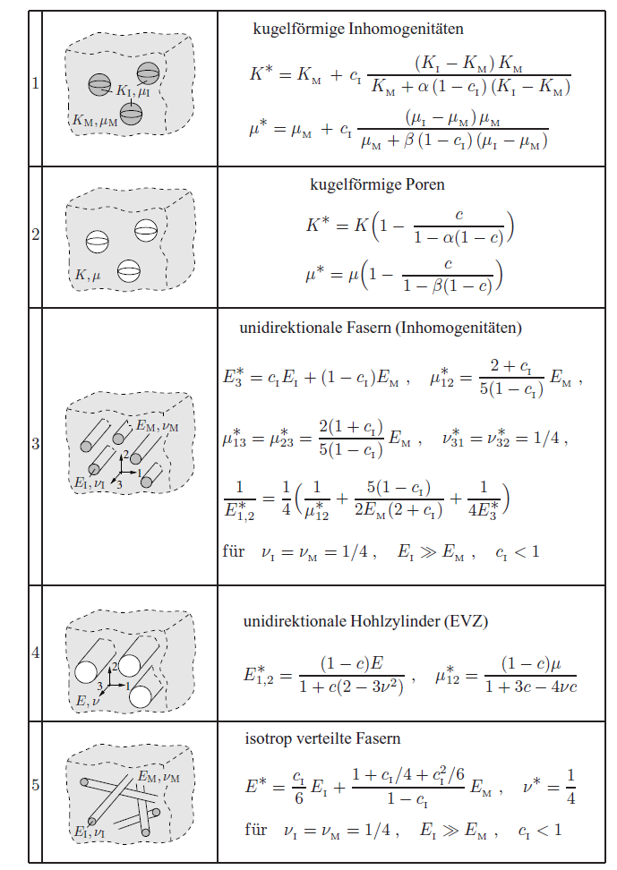
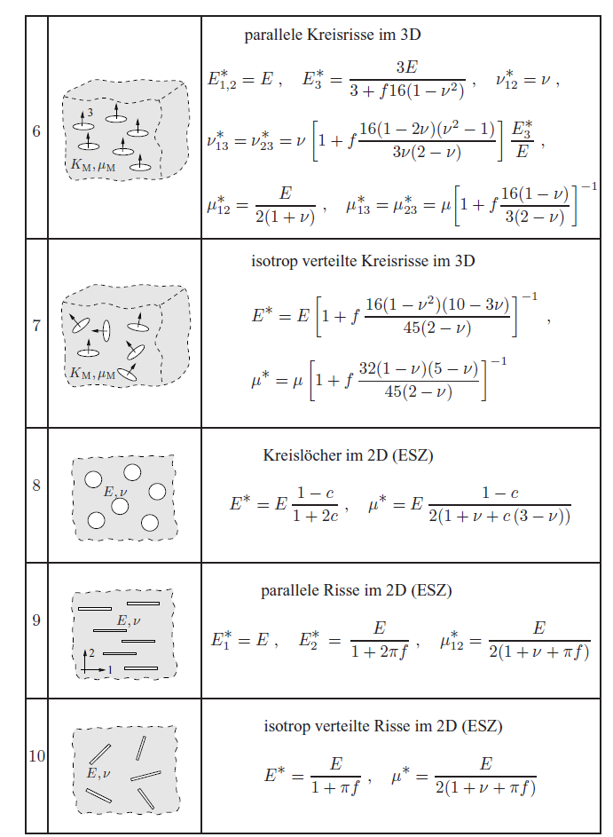

Tab. 8.1 from Gross & Seelig, Bruchmechanik (2016)

---

## All Methods — Summary

<!-- _class: cols-2 -->

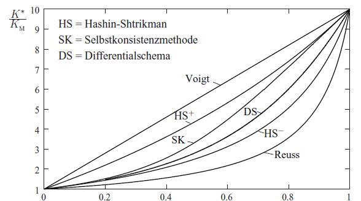

Fig. 8.23 from Gross & Seelig, Bruchmechanik (2016)

| Method | Phase role | Percolation | Bounds |
|---|---|---|---|
| Voigt | symmetric | no | upper |
| Reuss | symmetric | no | lower |
| DD | matrix + incl. | no | — |
| Mori-Tanaka | matrix + incl. | no | = HS |
| Self-Consistent | symmetric | yes | — |
| Diff. Scheme | path-dep. | $c\to1$ | — |
| Hashin-Shtrikman | both choices | — | tightest |

Engineering composites ($c_I \leq 0.3$): use MT/HS. Polycrystals: use SC. Complex geometry: numerical homogenisation.

---

## Numerical Homogenisation — Procedure

For **complex microstructures** or **nonlinear phases**, analytical methods are insufficient.

<!-- _class: cols-2 -->

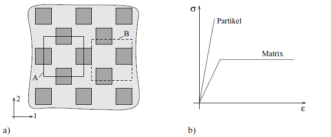

Fig. 8.30 from Gross & Seelig, Bruchmechanik (2016)

**FEM-based workflow:**

1. Discretise RVE with finite elements
2. Assign local properties per element
3. Apply BC (linear / uniform / periodic)
4. Solve for full field $\sigma(\mathbf{x})$, $\varepsilon(\mathbf{x})$, $u(\mathbf{x})$
5. Volume-average → macro quantities:

$$\langle\sigma_{ij}\rangle = \frac{1}{V}\int_V\sigma_{ij}\,dV$$

6. For nonlinear material: repeat incrementally.

---

## Influence of Boundary Conditions (FEM)

<!-- _class: cols-2 -->

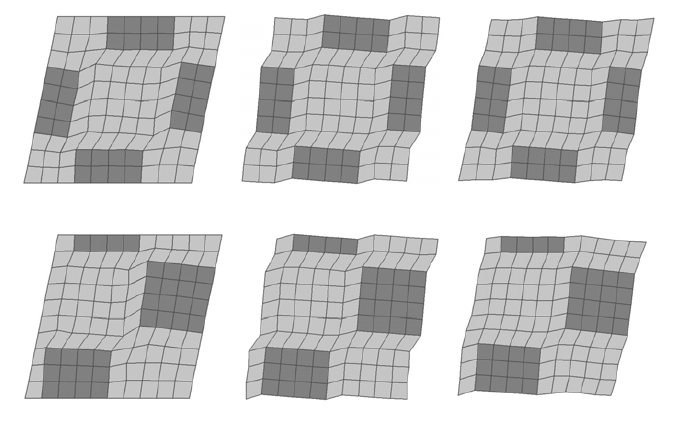

Fig. 8.31 from Gross & Seelig, Bruchmechanik (2016)

**Linear displacement BC:**
- Compatible deformation
- Traction periodicity violated → result depends on unit cell choice (A ≠ B)
- Too stiff

**Uniform traction BC:**
- Deformed cells no longer fit together
- Incompatible with periodic microstructure
- Too soft

**Periodic BC:**
- Correct for periodic microstructures
- A and B give **identical** result
- Implementation: paired node constraints in commercial FE codes

---

## Convergence with RVE Size

<!-- _class: cols-2 -->

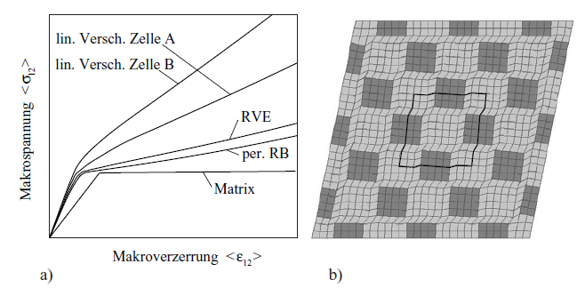

Fig. 8.32 from Gross & Seelig, Bruchmechanik (2016)

As RVE contains more inclusions:
- Influence of BC type **decreases**
- Linear BC result approaches periodic BC result
- Convergence to the true effective behaviour

**Observations:**
- Matrix: sharp elastic-plastic transition
- Composite: smooth transition (inhomogeneous plasticity)
- Stiffening from particles in both regimes
- Under periodic BC: unit cells A = B

Consistent with $d \gg l$: larger volume → smaller boundary-layer-to-interior ratio.

---

## Summary — Lecture 2

**Homogenisation workflow:**

1. Verify scale separation: $l \ll d \ll L$
2. Define RVE, choose BC (periodic preferred for periodic microstructures)
3. Select method based on volume fraction and microstructure type
4. Compute $C^*$, verify against bounds

**Bound hierarchy:**

$$C^*_{\text{Reuss}} \leq C^*_{\text{HS}-} \leq C^* \leq C^*_{\text{HS}+} \leq C^*_{\text{Voigt}}$$

