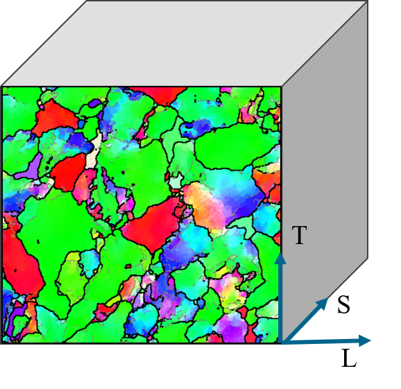
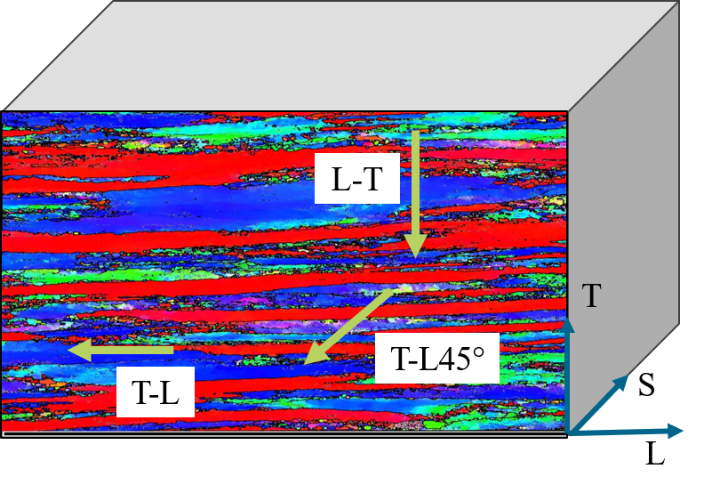
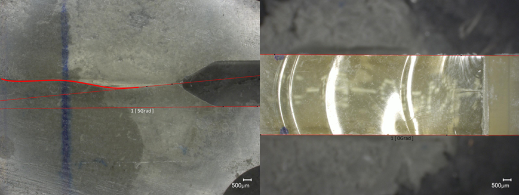
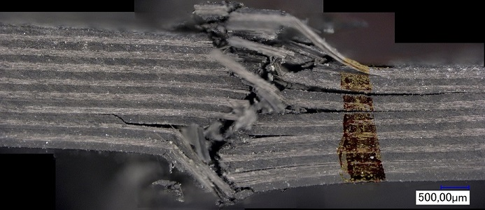
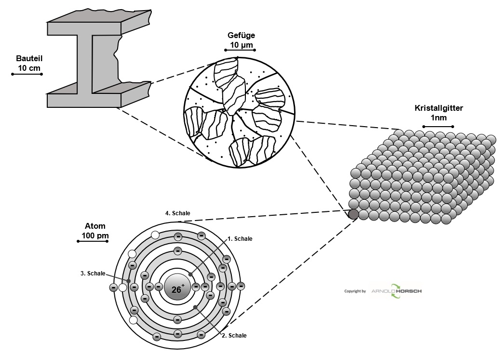
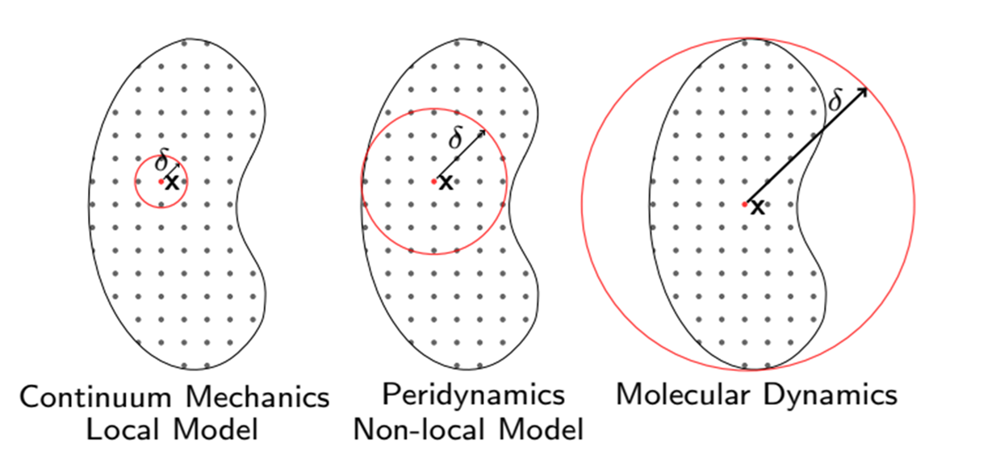
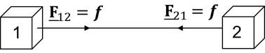
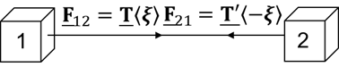
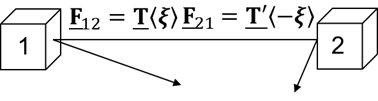

<style>
footer {
    font-size: 14px;
    color: #888;
    text-align: right;
}
img[alt="ORCID"] {
    height: 15px !important;
    width: auto !important;
    vertical-align: top !important;
    display: inline !important;
    margin: 0 !important;
}
.aufgabe {
    background: #fdf2e9;
    border: 2px solid #e67e22;
    border-radius: 8px;
    padding: 14px 20px;
    margin: 10px 0;
}
.aufgabe strong {
    color: #d35400;
}
.loesung {
    background: #eafaf1;
    border-left: 4px solid #27ae60;
    padding: 12px 18px;
    margin: 10px 0;
    border-radius: 0 6px 6px 0;
}
.eq {
    background: #f4ecf7;
    border: 1px solid #c39bd3;
    border-radius: 8px;
    padding: 10px 20px;
    text-align: center;
    margin: 12px 0;
}
.hinweis {
    background: #eaf2f8;
    border-left: 4px solid #2e86c1;
    padding: 10px 16px;
    margin: 8px 0;
    border-radius: 0 6px 6px 0;
    font-size: 20px;
}
.warn {
    background: #fdf2f2;
    border-left: 4px solid #e74c3c;
    padding: 10px 16px;
    margin: 8px 0;
    border-radius: 0 6px 6px 0;
    font-size: 20px;
}
.zwei-spalten {
    display: flex;
    gap: 36px;
}
.zwei-spalten > div {
    flex: 1;
}
table {
    border-collapse: collapse;
    width: 100%;
    margin: 10px 0;
    font-size: 19px;
}
th {
    background: #1a5276;
    color: white;
    padding: 7px 12px;
    text-align: left;
}
td {
    padding: 6px 12px;
    border-bottom: 1px solid #d5dbdb;
}
tr:nth-child(even) td {
    background: #f2f3f4;
}
section {
    font-family: 'Segoe UI', sans-serif;
    font-size: 23px;
    color: #1e2a3a;
}
section h1 {
    font-size: 34px;
    color: #1a5276;
    padding-bottom: 8px;
    margin-bottom: 18px;
}
section h2 {
    font-size: 24px;
    margin-bottom: 12px;
}
section h3 {
    font-size: 20px;
    margin-bottom: 8px;
}
ul { padding-left: 20px; margin: 6px 0; }
li { margin-bottom: 4px; }
</style>

<!-- _class: lead -->
# Fracture & Fatigue – Peridynamics

Prof. Dr.-Ing. Christian Willberg [](https://orcid.org/0000-0003-2433-9183)
Hochschule Magdeburg-Stendal

<div style="position: absolute; top: 200px; left: 850px;"> 

</div>

---

<!-- _class: lead -->
# Part I – Motivation

---


---




---




---


## Assumptions in Classical Continuum Mechanics

- Continuous medium
- $\mathbf{u}$ is 2× continuously differentiable
- Conservation equations satisfied (momentum, angular momentum, energy)


---

## Conservation of Momentum

$$\text{div}\,\boldsymbol{\sigma} + \mathbf{b} = \rho\,\ddot{\mathbf{u}}$$

---

## Implications – 1D Example

Truss with two cross-sectional areas:

$$\sigma_1 = \frac{F}{A_1}, \qquad \sigma_2 = \frac{F}{A_2}$$

$$\text{div}\,\sigma = \frac{d\sigma}{dx}$$

No derivative exists at the position where $A_1$ becomes $A_2$.

---



---

## Reality Is Non-local


---

# Why Peridynamics?

<div class="zwei-spalten">
<div>

**Classical Continuum Mechanics (CM)**

- Equation of motion contains **spatial derivatives** of $\boldsymbol{\sigma}$
- At cracks: derivatives are **undefined**
- Cracks must be prescribed or propagated via additional criteria (XFEM, CZM)

</div>
<div>

**Peridynamics (PD)**

- Based on **integral equations**
- No spatial derivatives required
- Cracks emerge **naturally** from material failure
- Well-suited for discontinuous problems

</div>
</div>

<div class="hinweis">

Silling (2000): "Reformulation of elasticity theory for discontinuities and long-range forces." The equation of motion remains valid across cracks.

</div>

---

<!-- _class: lead -->
# Part II – Peridynamic Theory

---

# Basic Concept of Peridynamics

<div class="zwei-spalten">
<div>

- Each material point $\mathbf{x}$ interacts with all points $\mathbf{x}'$ within a **horizon** $\delta$
- Neighbourhood: $\mathcal{H}_\delta(\mathbf{x}) = \{\mathbf{x}' : |\mathbf{x}' - \mathbf{x}| \leq \delta\}$
- **Reference bond vector:** $\boldsymbol{\xi} = \mathbf{x}' - \mathbf{x}$
- **Relative displacement:** $\boldsymbol{\eta} = \mathbf{u}' - \mathbf{u}$

</div>
<div>

<div class="eq">

**General PD Equation of Motion**

$$\rho\,\ddot{\mathbf{u}}(\mathbf{x},t) = \int_{\mathcal{H}} \mathbf{f}(\boldsymbol{\eta}, \boldsymbol{\xi})\,dV' + \mathbf{b}(\mathbf{x},t)$$

</div>

- $\mathbf{f}$: pairwise force density between $\mathbf{x}$ and $\mathbf{x}'$
- $\mathbf{b}$: body force density
- $\rho$: mass density

</div>
</div>

<div class="hinweis">

Unit of $\mathbf{f}$: $[\text{N/m}^6]$ (force per volume²) — different from classical CM!

</div>

---



---

# PD Equation of Motion

$$\int_{\mathcal{H}}(\underline{\textbf{T}}(\textbf{x},t)-
\underline{\textbf{T}}(\textbf{x}',t))\,dV_{\textbf{x}}+\textbf{b} =\rho\,\ddot{\textbf{u}}$$


- material point
- bond
- neighbor
- integral domain
- horizon
- deformed bond state

**PD is a continuum formulation!**

---

# Overview of PD Formulations

| Formulation | Abbrev. | Interaction | Material model |
|---|---|---|---|
| Bond-based | BB-PD | Pairwise | $\nu = 1/4$ (3D) fixed |
| Ordinary State-based | OSB-PD | Collective, central | Isotropic materials |
| Non-ordinary State-based | NOSB-PD | Collective, arbitrary | General constitutive laws |
| Correspondence | CCM | Via deformation gradient | Direct use of classical models |

<div class="hinweis">

Thread of this lecture: BB → OSB → NOSB → CCM. Each formulation extends the previous one.

</div>

---

| Model | Conservation of Momentum | Conservation of Angular Momentum |
|---------|-------------------------|----------------------------------|
| bond-based | bond | bond |
| ordinary state-based | integral | bond |
| non-ordinary state-based | integral | integral |

---





---


<!-- _class: lead -->
# Part V – Non-ordinary State-based PD (NOSB-PD)

---

# NOSB-PD – Basic Idea

<div class="zwei-spalten">
<div>

**Problem with OSB-PD:** Force density state must still be central (along the bond).

**NOSB-PD:** No restriction on force direction. Allows **arbitrary constitutive laws** — including anisotropic materials.

**Key:** Compute a local **deformation gradient** $\mathbf{F}$ from the neighbourhood.

</div>
<div>

<div class="eq">

**Deformation Gradient (PD)**

$$\mathbf{F} = \left[\int_{\mathcal{H}} \underline{\omega}\langle\boldsymbol{\xi}\rangle\, (\boldsymbol{\xi}+\boldsymbol{\eta})\otimes\boldsymbol{\xi}\,dV'\right] \mathbf{K}^{-1}$$

with shape tensor:

$$\mathbf{K} = \int_{\mathcal{H}} \underline{\omega}\langle\boldsymbol{\xi}\rangle\,\boldsymbol{\xi}\otimes\boldsymbol{\xi}\,dV'$$

</div>

</div>
</div>

<div class="hinweis">

$\mathbf{K}$ depends only on the reference configuration and is computed once during initialisation. $\mathbf{F}$ is updated at every time step.

</div>

---

# NOSB-PD – Force Density State

From $\mathbf{F}$, a classical material model yields the **1st Piola–Kirchhoff stress tensor** $\mathbf{P}$:

$$\mathbf{P} = \det \mathbf{F}\,\boldsymbol{\sigma}\,\mathbf{F}^{-T}\quad \text{with Cauchy stresses}$$

The **force density state** then follows as:

<div class="eq">

$$\underline{\mathbf{T}}\langle\boldsymbol{\xi}\rangle = \underline{\omega}\langle\boldsymbol{\xi}\rangle\,\mathbf{P}\,\mathbf{K}^{-1}\boldsymbol{\xi}$$

</div>

<div class="hinweis">

**Advantage:** Any classical material model (plasticity, viscoelasticity, anisotropy) can be used directly. **Disadvantage:** Zero-energy modes may occur → stabilisation required.

</div>

---


# Correspondence Material Model

<div class="zwei-spalten">
<div>

**Idea:** Use the PD deformation gradient $\mathbf{F}$ directly with a **classical material model** (Hooke, plasticity, …) — without reformulating the material model peridynamically.

**Procedure:**
1. Compute $\mathbf{F}$ from PD neighbourhood (as in NOSB)
2. Compute $\boldsymbol{\varepsilon} = \frac{1}{2}(\mathbf{F}+\mathbf{F}^T) - \mathbf{I}$
3. Compute $\boldsymbol{\sigma}$ with classical constitutive law
4. Convert $\boldsymbol{\sigma}$ to PD force density state

</div>
<div>

<div class="eq">

**CCM Force Density State**

$$\underline{T}\langle\boldsymbol{\xi}\rangle = \underline{\omega}\langle\boldsymbol{\xi}\rangle\,\boldsymbol{\sigma}\,\mathbf{K}^{-1}\boldsymbol{\xi}$$

</div>

<div class="hinweis">

CCM = NOSB with linear stress–strain law and infinitesimal strains. For large deformations: $\mathbf{P} = \boldsymbol{\sigma}\,\mathbf{F}^{-T}$ (Nanson's formula).

</div>

</div>
</div>

---

# CCM – Complete Algorithm

| Step | Operation | Formula |
|---|---|---|
| 1 | Shape tensor | $\mathbf{K} = \int_{\mathcal{H}} \underline{\omega}\,\boldsymbol{\xi}\otimes\boldsymbol{\xi}\,dV'$ |
| 2 | Deformation gradient | $\mathbf{F} = \left[\int_{\mathcal{H}} \underline{\omega}\,(\boldsymbol{\xi}+\boldsymbol{\eta})\otimes\boldsymbol{\xi}\,dV'\right]\mathbf{K}^{-1}$ |
| 3 | Strain tensor | $\boldsymbol{\varepsilon} = \tfrac{1}{2}(\mathbf{F}+\mathbf{F}^T) - \mathbf{I}$ |
| 4 | Stress tensor | $\boldsymbol{\sigma} = \mathbf{C}:\boldsymbol{\varepsilon}$ (Voigt notation) |
| 5 | Force density state | $\underline{T}\langle\boldsymbol{\xi}\rangle = \underline{\omega}\,\boldsymbol{\sigma}\,\mathbf{K}^{-1}\boldsymbol{\xi}$ |
| 6 | Force density | $\mathbf{f} = \int_{\mathcal{H}}(\underline{T}\langle\boldsymbol{\xi}\rangle - \underline{T}'\langle-\boldsymbol{\xi}\rangle)\,dV'$ |

<div class="hinweis">

Step 1 and $\mathbf{K}^{-1}$ are computed once during initialisation (reference configuration).

</div>

---


<!-- _class: lead -->
# Part  Damage and Horizon

---

# Damage via Influence Function $\omega_{ij}$

Damage in peridynamics is introduced by **setting $\omega_{ij} = 0$** for a broken bond – no other change needed.

<div class="zwei-spalten">
<div>

### Intact system ($\omega_{12} = 1$)

$$\mathbf{K} = c\begin{bmatrix}
 1 & -1 & 0 & 0\\
-1 &  2 & -1 & 0\\
 0 & -1 &  2 & -1\\
 0 &  0 & -1 &  1
\end{bmatrix}$$

Matrix is singular (rigid body mode) → one BC needed.

</div>
<div>

### Bond 1–2 broken ($\omega_{12} = 0$)

- $K_{12} = K_{21} = 0$
- $K_{11}$ reduced accordingly

→ Point 1 is **disconnected** → two separate substructures.

</div>
</div>

<div class="hinweis">

No re-meshing, no topology change – damage is purely a **state variable** on the bonds.

</div>

---

# Horizon $\delta$ – Influence and Choice

<div class="zwei-spalten">
<div>

**Physical meaning:**
- $\delta$ is a material length parameter (internal length)
- As $\delta \to 0$, PD converges to classical CM
- Coupling to discretisation: $\delta \sim 3{-}4 \cdot \Delta x$

**Effect on results:**
- Too large: smears cracks
- Too small: surface effects (surface correction needed)

</div>
<div>

| Ratio $m = \delta/\Delta x$ | Behaviour |
|---|---|
| $m < 2$ | Insufficient connectivity |
| $m = 3$ | Good compromise |
| $m = 4{-}5$ | Better convergence, more costly |
| $m \to \infty$ | Classical CM |

<div class="hinweis">

Surface correction is required because boundary points have an incomplete horizon → underestimated stiffness without correction.

</div>

</div>
</div>


---

## PeriLab – Peridynamic Simulation Framework


[PeriLab Repository](https://github.com/PeriHub/PeriLab.jl)

- Install Julia programming language
- Start Julia
- Write in the console:

```julia
using Pkg
Pkg.add("PeriLab")
```

---

## Running a Simulation

```julia
using PeriLab

PeriLab.get_examples()                              # optional
PeriLab.main("examples/DCB/DCBmodel.yaml")          # run model
```

---

<iframe src="https://perilab-results.nimbus-extern.dlr.de/models/Dogbone?step=36&variable=von%20Mises%20Stress" width="1150" height="600"></iframe>

---

<iframe src="https://perilab-results.nimbus-extern.dlr.de/models/DCB?step=65&variable=Damage&displFactor=200" width="1150" height="600"></iframe>

---

<iframe src="https://perilab-results.nimbus-extern.dlr.de/models/RVE?step=1&variable=Damage&displFactor=20" width="1150" height="600"></iframe>

---

<iframe src="https://perilab-results.nimbus-extern.dlr.de/models/Additive?step=1&variable=Temperature" width="1150" height="600"></iframe>

---

## PeriLab Setup – Mesh

### Input mesh file (`truss.txt`)

```plaintext
header: x y block_id volume
0 0 1 1
1 0 1 1
2 0 1 1
3 0 1 1
4 0 1 1
```

- 5 points along the $x$-axis, uniform spacing $\Delta x = 1$
- All assigned to `block_1`, volume = 1 per point

<div class="hinweis">

The volume entry must represent the physical volume of the neighborhood: $V = A \cdot L$. For this 1D example $A = L = 1$ so $V = 1$.

</div>

---

## PeriLab Setup – YAML Configuration

```yaml
PeriLab:
  Discretization:
    Node Sets:
      Node Set 1: 1        # left end (x=0)
      Node Set 2: 5        # right end (x=4)
    Type: "Text File"
    Input Mesh File: "truss.txt"
  Models:
    Material Models:
      Test:
        Material Model: "Bond-based Elastic"
        Young's Modulus: 7000
        Poisson's Ratio: 0.3
  Blocks:
    block_1:
      Block ID: 1
      Material Model: "Test"
      Density: 2e-9
      Horizon: 2
  Boundary Conditions:
    BC_1:
      Variable: "Displacements"
      Node Set: "Node Set 1"
      Coordinate: "x"
      Value: "100*t"
      Type: Dirichlet
    BC_2:
      Variable: "Displacements"
      Node Set: "Node Set 2"
      Coordinate: "x"
      Value: "0.1*t"
      Type: Dirichlet
```

---

## PeriLab Setup – Solver & Output

```yaml
  Solver:
    Material Models: True
    Initial Time: 0.0
    Final Time: 1.0
    Number of Steps: 20
    Static:
      Show solver iteration: true
      Residual tolerance: 1e-7
      Solution tolerance: 1e-8
      Residual scaling: 7000
      m: 550
      Maximum number of iterations: 100
  Outputs:
    Output1:
      Output Filename: "truss"
      Output File Type: Exodus
      Number of Output Steps: 20
      Output Variables:
        Displacements: True
        Number of Neighbors: True
        Forces: True
```

---


# References

[PeriLab Theory Documentation](https://perihub.github.io/PeriLab.jl/dev/theory/theory/)

Silling, S.A. (2000). Reformulation of elasticity theory for discontinuities and long-range forces. *J. Mech. Phys. Solids*, 48(1), 175–209.

Silling, S.A., Epton, M., Weckner, O., Xu, J., & Askari, E. (2007). Peridynamic states and constitutive modeling. *J. Elast.*, 88(2), 151–184.

---

# Contact

Prof. Dr.-Ing. Christian Willberg
Magdeburg-Stendal University of Applied Sciences

Kontakt: christian.willberg@h2.de
