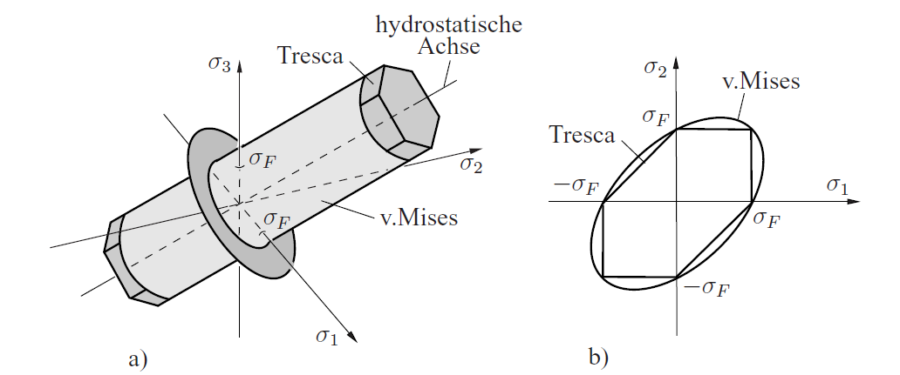

<!-- _class: lead -->
# Fracture & Fatigue — Parameters
Prof. Dr.-Ing. Christian Willberg 

---

## Overview

1. Cyclic loading parameters
2. Stress state — tensor, principal stresses, triaxiality
3. Stress concentration
4. Fracture mechanics parameters — $K$, $G$, $K_{Ic}$
5. Crack growth parameters — Paris, NASGRO
6. Mean stress effects

---

<!-- Section 1 -->
# Cyclic Loading Parameters

---

## Cyclic Stress — Definitions

$$\sigma_m = \frac{\sigma_{max} + \sigma_{min}}{2} \qquad \text{(mean stress)}$$

$$\sigma_a = \frac{\sigma_{max} - \sigma_{min}}{2} \qquad \text{(stress amplitude)}$$

$$\Delta\sigma = \sigma_{max} - \sigma_{min} \qquad \text{(stress range)}$$

$$R = \frac{\sigma_{min}}{\sigma_{max}} \qquad \text{(stress ratio)}$$

> **Only two parameters are independent** — all others follow from them.

---

## Relationships Between Parameters

$$\sigma_{max} = \sigma_m + \sigma_a \qquad \sigma_{min} = \sigma_m - \sigma_a$$

$$\sigma_a = \frac{\Delta\sigma}{2} \qquad \sigma_m = \frac{\sigma_{max}(1+R)}{2}$$

$$R = \frac{\sigma_m - \sigma_a}{\sigma_m + \sigma_a}$$

| $R$ | Loading type | Consequence |
|---|---|---|
| $-1$ | fully reversed | $\sigma_m = 0$ |
| $0$ | pulsating tension | $\sigma_{min} = 0$ |
| $+1$ | static load | $\sigma_a = 0$, no cycling |
| $< -1$ | compressive mean stress | $|\sigma_{min}| > \sigma_{max}$ |

---

## Example — Determining Cyclic Parameters

**Given:** $\sigma_{max} = 200\,\text{MPa}$, $\sigma_{min} = -60\,\text{MPa}$

**Find:** $\sigma_m$, $\sigma_a$, $\Delta\sigma$, $R$

$$\sigma_m = \frac{200 + (-60)}{2} = 70\,\text{MPa}$$

$$\sigma_a = \frac{200 - (-60)}{2} = 130\,\text{MPa}$$

$$\Delta\sigma = 200 - (-60) = 260\,\text{MPa}$$

$$R = \frac{-60}{200} = -0{,}3$$

> $R < 0$ → tension–compression loading with positive mean stress. Fully reversed ($R=-1$) would give $\sigma_m=0$.

---

<!-- Section 2 -->
# Stress State

---

## The Stress Tensor

$$\boldsymbol{\sigma} = \begin{pmatrix} \sigma_{xx} & \tau_{xy} & \tau_{xz} \\ \tau_{yx} & \sigma_{yy} & \tau_{yz} \\ \tau_{zx} & \tau_{zy} & \sigma_{zz} \end{pmatrix}$$

- **Normal stresses** $\sigma_{ii}$: perpendicular to the face
- **Shear stresses** $\tau_{ij}$: tangential to the face
- Symmetry: $\tau_{ij} = \tau_{ji}$ → 6 independent components

**Voigt notation:**
$$\boldsymbol{\sigma} = [\sigma_{xx},\, \sigma_{yy},\, \sigma_{zz},\, \tau_{yz},\, \tau_{xz},\, \tau_{xy}]^T$$

> In fatigue and fracture, the **complete stress state** governs crack initiation and propagation.

---

## Principal Stresses

Principal stresses = normal stresses on planes with zero shear stress.

Eigenvalue problem:
$$\det(\boldsymbol{\sigma} - \sigma_i \mathbf{I}) = 0 \quad \Rightarrow \quad \sigma_1 \geq \sigma_2 \geq \sigma_3$$

**Plane stress state (2D):**

$$\sigma_{1,2} = \frac{\sigma_{xx}+\sigma_{yy}}{2} \pm \sqrt{\left(\frac{\sigma_{xx}-\sigma_{yy}}{2}\right)^2 + \tau_{xy}^2}$$

**Maximum shear stress:**
$$\tau_{max} = \frac{\sigma_1 - \sigma_3}{2}$$

---

## Principal Stresses — Relevance for Fatigue

| Quantity | Relevance |
|---|---|
| $\sigma_1$ (max. principal stress) | Crack grows **perpendicular** to it (Mode I, Stage II) |
| $\tau_{max}$ (max. shear stress) | Crack initiation in PSBs (Stage I, 45° plane) |
| Principal stress directions | Under non-proportional loading: time-varying → critical plane approach needed |

---

**Mohr's stress circle** — graphical stress transformation:

$$\sigma_n = \frac{\sigma_1+\sigma_3}{2} + \frac{\sigma_1-\sigma_3}{2}\cos 2\theta \qquad \tau = \frac{\sigma_1-\sigma_3}{2}\sin 2\theta$$

---

## Equivalent Stress — von Mises and Tresca

**von Mises** (distortion energy):
$$\sigma_{eq} = \sqrt{\frac{1}{2}\left[(\sigma_1-\sigma_2)^2 + (\sigma_2-\sigma_3)^2 + (\sigma_3-\sigma_1)^2\right]}$$

**Tresca** (maximum shear stress):
$$\sigma_{eq,T} = \sigma_1 - \sigma_3 = 2\tau_{max}$$

| Property | von Mises | Tresca |
|---|---|---|
| Basis | Distortion energy | Max. shear stress |
| Conservatism | less conservative | more conservative |
| Experimental deviation | $< 5\%$ | up to 15% |
| Fatigue application | Crack initiation (bulk) | Shear-dominated (PSBs) |

---

Figure from Gross, Seelig "Fracture Mechanics"

---

## Stress Triaxiality

$$h = \frac{(\sigma_1+\sigma_2+\sigma_3)/3}{\sigma_{eq}}$$

with the von Mises equivalent stress:
$$\sigma_{eq} = \frac{1}{\sqrt{2}}\sqrt{(\sigma_1-\sigma_2)^2+(\sigma_2-\sigma_3)^2+(\sigma_3-\sigma_1)^2}$$

| Stress state | $h$ | Effect |
|---|---|---|
| Uniaxial tension | $1/3$ | Reference state |
| Plane strain (crack tip) | $> 1$ | Suppresses plasticity → brittle behaviour |
| Pure shear | $0$ | No hydrostatic component |

> High triaxiality at crack tips → plane strain condition → lower $K_{Ic}$ → more dangerous.

---

## Multiaxial Fatigue — Equivalent Stress Amplitude

S-N curves are based on **uniaxial** loading. Real components: **multiaxial**.

**Approach 1 — von Mises amplitude** (proportional loading):
$$\sigma_{a,eq} = \sqrt{\frac{1}{2}\left[(\sigma_{a,1}-\sigma_{a,2})^2 + (\sigma_{a,2}-\sigma_{a,3})^2 + (\sigma_{a,3}-\sigma_{a,1})^2\right]}$$

**Approach 2 — Sines criterion:**
$$\sigma_{a,eq} + k \cdot (\sigma_{m,1}+\sigma_{m,2}+\sigma_{m,3}) \leq \sigma_D$$

**Approach 3 — Critical plane method** (non-proportional):
- Searches for the plane with maximum fatigue damage
- Accounts for normal stress $\sigma_n$ and shear stress $\tau$ on that plane
- Required when principal stress directions rotate

---

<!-- Section 3 -->
# Stress Concentration

---

## Notch Effect — Fundamentals

Real components contain **notches, holes, grooves, radii** → local stress elevation.

**Stress concentration factor** $K_t$ (elastic, theoretical):
$$K_t = \frac{\sigma_{max}}{\sigma_{nom}}$$

$\sigma_{nom}$: nominal stress in the net cross-section.

**Elliptical notch (Inglis solution):**
$$K_t = 1 + 2\sqrt{\frac{a}{\rho}} \approx 2\sqrt{\frac{a}{\rho}} \quad \text{for } a \gg \rho$$

$a$ = half notch depth, $\rho$ = notch radius.

> Circular hole in an infinite plate: $K_t = 3$ — independent of hole size!

---

## Example — Stress Concentration Factor for a Circular Hole

**Given:** Tension bar, $\sigma_{nom} = 100\,\text{MPa}$, circular hole ($K_t = 3$)

$$\sigma_{max} = K_t \cdot \sigma_{nom} = 3 \cdot 100 = 300\,\text{MPa}$$

**Elliptical notch:** $a = 5\,\text{mm}$, $\rho = 0{,}2\,\text{mm}$

$$K_t = 1 + 2\sqrt{\frac{5}{0{,}2}} = 1 + 2\sqrt{25} = 11$$

$$\sigma_{max} = 11 \cdot 100 = 1100\,\text{MPa}$$

> A small notch radius raises $K_t$ dramatically — critical for crack-like notches ($\rho \to 0$).

---

## Fatigue Notch Factor $K_f$

**$K_f \leq K_t$** — materials are not fully notch-sensitive.

$$K_f = 1 + q(K_t - 1) \qquad 0 \leq q \leq 1$$

$q$ = notch sensitivity index (material- and size-dependent):
- $q \to 0$: notch-insensitive (e.g. grey cast iron)
- $q \to 1$: fully notch-sensitive (high-strength steels)

**Application:**
$$\sigma_{a,allow} = \frac{\sigma_D}{K_f}$$

---

<!-- Section 4 -->
# Fracture Mechanics Parameters

---

## Crack Opening Modes

**Mode I — Opening mode**
- Load perpendicular to crack plane
- Most common mode in fatigue
- Parameter: $K_I$

**Mode II — In-plane sliding mode**
- Load parallel to crack, perpendicular to crack front
- Parameter: $K_{II}$

---

**Mode III — Tearing mode**
- Load parallel to crack and crack front
- Parameter: $K_{III}$

> Fatigue cracks reorient during growth toward **pure Mode I** (Stage II).

---

## Stress Intensity Factor $K$

$K$ describes the amplitude of the stress singularity at the crack tip:

$$\sigma_{ij} = \frac{K}{\sqrt{2\pi r}} f_{ij}(\theta) + \text{higher order terms}$$

**Mode I:**
$$K_I = \sigma \cdot Y(a/W) \cdot \sqrt{\pi a}$$

| Quantity | Meaning |
|---|---|
| $\sigma$ | applied nominal stress |
| $a$ | crack length (half-length for internal crack) |
| $Y(a/W)$ | geometry correction factor |
| $W$ | characteristic dimension (width) |

**Unit:** $\text{MPa}\sqrt{\text{m}}$

---

## Geometry Correction Factor $Y$

$Y$ accounts for finite geometry, free surfaces, and crack shape.

| Configuration | $Y$ |
|---|---|
| Central crack, infinite plate | $1{,}0$ |
| Edge crack, semi-infinite plate | $1{,}12$ |
| Central crack, finite width $W$ | $\sqrt{\sec(\pi a/W)}$ |
| Embedded elliptical crack | $\approx 1/\Phi$ |
| Surface crack (semi-ellipse) | $\approx 1{,}12/\Phi$ |

> **$Y$ is not constant** — increases with $a/W$ → crack accelerates even at constant $\Delta\sigma$.

For complex geometries: determine $Y$ by **FEM**.

---

## Example — $K_I$ and Critical Crack Length

**Given:** Structural steel, $K_{Ic} = 50\,\text{MPa}\sqrt{\text{m}}$, edge crack ($Y = 1{,}12$), $\sigma = 200\,\text{MPa}$

**Critical crack length:**
$$a_c = \frac{1}{\pi}\left(\frac{K_{Ic}}{\sigma \cdot Y}\right)^2 = \frac{1}{\pi}\left(\frac{50}{200 \cdot 1{,}12}\right)^2$$

$$a_c = \frac{1}{\pi}\left(0{,}223\right)^2 = \frac{0{,}0497}{\pi} \approx 15{,}8\,\text{mm}$$

**Check:** Existing crack $a = 5\,\text{mm}$:
$$K_I = 200 \cdot 1{,}12 \cdot \sqrt{\pi \cdot 0{,}005} = 224 \cdot 0{,}1253 = 28{,}1\,\text{MPa}\sqrt{\text{m}} < K_{Ic}$$

→ **No failure**, safety factor $K_{Ic}/K_I \approx 1{,}8$.

---

## Mixed Mode Loading

**Effective stress intensity factor:**

$$K_{eff} = \sqrt{K_I^2 + K_{II}^2 + \frac{K_{III}^2}{1-\nu}}$$

**Failure criterion (mixed mode):**
$$K_{eff} \geq K_{Ic}$$

> In fatigue, cracks reorient toward pure Mode I — the mixed mode state is unstable with respect to growth under $\sigma_1$ dominance.

---

## Energy Release Rate $G$ — Griffith Criterion

**Griffith (1921):** Fracture occurs when the released energy exceeds the energy required to create new surfaces:

$$G = -\frac{d\Pi}{da} \geq G_c = 2\gamma_s$$

$\gamma_s$ = specific surface energy, $\Pi$ = total potential energy.

**Physical dimension:** $G$ in $\text{J/m}^2 = \text{N/m}$

**Central crack ($2a$) in infinite plate:**
$$G = \frac{\sigma^2 \pi a}{E'} \quad \text{with } E' = \begin{cases} E & \text{(plane stress)} \\ E/(1-\nu^2) & \text{(plane strain)} \end{cases}$$

---

## Irwin Relation: $G$ and $K$

$$G_I = \frac{K_I^2}{E'} \qquad G_{II} = \frac{K_{II}^2}{E'} \qquad G_{III} = \frac{K_{III}^2}{2\mu}$$

**Mixed mode total:**
$$G = \frac{K_I^2 + K_{II}^2}{E'} + \frac{K_{III}^2}{2\mu}$$

**Fracture criterion:**
$$G \geq G_c \quad \Leftrightarrow \quad K_I \geq K_{Ic}$$

---

**Comparison of loading conditions:**

| Boundary condition | $G$ |
|---|---|
| Fixed grip (displacement-controlled) | Strain energy **decreases** |
| Dead load (force-controlled) | Strain energy **increases**, external work grows faster |

> $G$ is a state quantity — both boundary conditions yield the same $G$.

---

## $G$ Under Cyclic Loading

**Cyclic energy release rate:**
$$\Delta G = G_{max} - G_{min} = \frac{K_{max}^2 - K_{min}^2}{E'}$$

For $R \geq 0$:
$$\Delta G = \frac{(\Delta K)^2 (1+R)}{E'(1-R)}$$

---

**Advantages of $\Delta G$ over $\Delta K$:**
- Directly captures mixed mode loading
- Thermodynamically consistent driving force
- Meaningful when $K_I$ and $K_{II}$ contributions are comparable

**Paris law on $\Delta G$ basis:**
$$\frac{da}{dN} = C_G \cdot (\Delta G)^{m/2}$$

---
<!-- _class: cols-2 -->

## Fracture Toughness $K_{Ic}$

$K_{Ic}$ = critical stress intensity factor under **plane strain condition**

**Validity condition** (plane strain):
$$B,\, a \geq 2{,}5\left(\frac{K_{Ic}}{R_{p0.2}}\right)^2$$

**Typical values:**

| Material | $K_{Ic}$ [MPa$\sqrt{\text{m}}$] |
|---|---|
| High-strength steel | 50–100 |
| Structural steel | 100–200 |
| Aluminium alloy | 20–45 |
| Titanium alloy | 40–80 |
| Ceramic | 1–5 |
| CFRP (laminate) | 20–60 |

---

<!-- _class: lead -->
## Thank You

**Questions?**

Prof. Dr.-Ing. Christian Willberg
christian.willberg@h2.de
Hochschule Magdeburg-Stendal