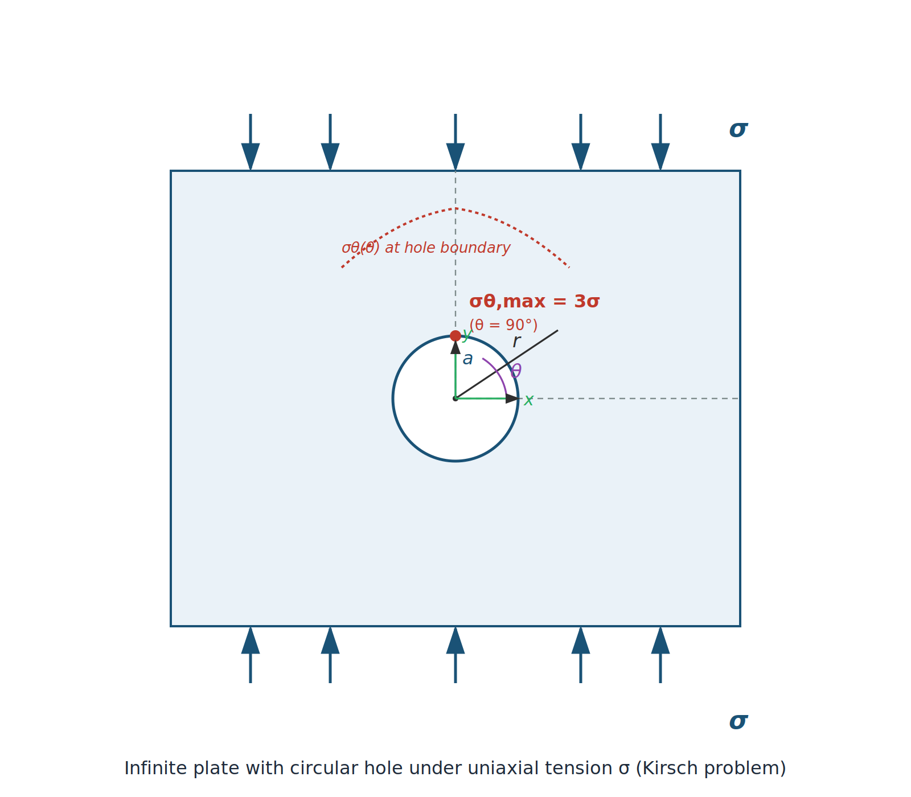
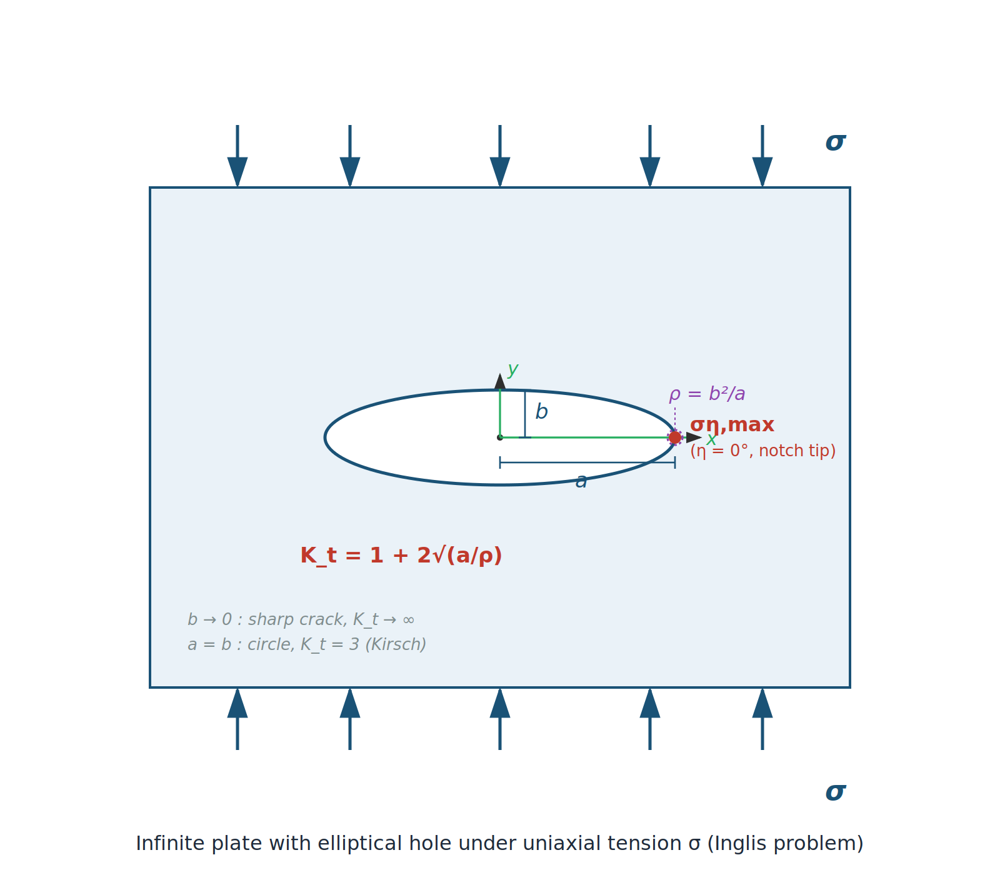

<!-- _class: title -->

# Stress Concentration
## Derivation: Circular Hole & Elliptical Notch

**Fracture & Fatigue – Chapter 6**

---

## Overview

1. Fundamentals: Airy stress function
2. Circular hole under biaxial loading (Kirsch 1898)
3. Elliptical notch under tensile stress (Inglis 1913)
4. Limiting case: crack as degenerate ellipse
5. Stress intensity factor $K_I$

---

## Plane Stress Problem

For a plane problem, the equilibrium conditions read:

$$\frac{\partial \sigma_x}{\partial x} + \frac{\partial \tau_{xy}}{\partial y} = 0, \qquad
\frac{\partial \tau_{xy}}{\partial x} + \frac{\partial \sigma_y}{\partial y} = 0$$

**Airy ansatz:** All stress components can be derived from a single potential function $\Phi(x,y)$:

$$\sigma_x = \frac{\partial^2 \Phi}{\partial y^2}, \quad
\sigma_y = \frac{\partial^2 \Phi}{\partial x^2}, \quad
\tau_{xy} = -\frac{\partial^2 \Phi}{\partial x \partial y}$$

---

## Biharmonic Equation

The compatibility condition yields the **biharmonic equation**:

$$\Delta \Delta \Phi = \frac{\partial^4 \Phi}{\partial x^4} + 2\frac{\partial^4 \Phi}{\partial x^2 \partial y^2} + \frac{\partial^4 \Phi}{\partial y^4} = 0$$

$$\boxed{\nabla^4 \Phi = 0}$$

Any function satisfying $\nabla^4 \Phi = 0$ represents a valid stress state (for given boundary conditions).

---

## Complex Potential Representation (Kolosov/Muskhelishvili)

The general solution can be expressed through **two analytic functions** $\varphi(z)$ and $\chi(z)$:

$$\Phi = \operatorname{Re}\left[\bar{z}\,\varphi(z) + \chi(z)\right]$$

The stresses follow as:

$$\sigma_x + \sigma_y = 4\operatorname{Re}\varphi'(z)$$

$$\sigma_y - \sigma_x + 2i\tau_{xy} = 2\left[\bar{z}\,\varphi''(z) + \psi'(z)\right]$$

with $\psi(z) = \chi'(z)$.

---

## Polar Coordinates: Transformation

For problems with circular symmetry (hole): transformation to $(r, \theta)$

$$\sigma_r = \frac{1}{r}\frac{\partial \Phi}{\partial r} + \frac{1}{r^2}\frac{\partial^2 \Phi}{\partial \theta^2}, \quad
\sigma_\theta = \frac{\partial^2 \Phi}{\partial r^2}$$

$$\tau_{r\theta} = -\frac{\partial}{\partial r}\!\left(\frac{1}{r}\frac{\partial \Phi}{\partial \theta}\right)$$

Biharmonic equation in polar coordinates:
$$\left(\frac{\partial^2}{\partial r^2} + \frac{1}{r}\frac{\partial}{\partial r} + \frac{1}{r^2}\frac{\partial^2}{\partial \theta^2}\right)^2 \Phi = 0$$

---

<!-- _class: section-header -->

# Part 1: Circular Hole
## Solution by Kirsch (1898)

---

## Problem: Circular Hole under Biaxial Loading

<!-- _class: cols-2 -->

**Geometry:** Infinite plate, hole of radius $a$

**Boundary conditions:**
- $r \to \infty$: $\sigma_x = \sigma_1$, $\sigma_y = \sigma_2$
- $r = a$: $\sigma_r = 0$, $\tau_{r\theta} = 0$

**Ansatz in polar coordinates:** Decomposition into isotropic and deviatoric parts

$$\sigma_\infty = \frac{\sigma_1 + \sigma_2}{2} \pm \frac{\sigma_1 - \sigma_2}{2}\cos 2\theta$$

---

## Ansatz for $\Phi$ – Isotropic Part

**Isotropic part** ($p = \tfrac{\sigma_1+\sigma_2}{2}$): depends on $r$ only

General solution of $\nabla^4 \Phi = 0$ for the axisymmetric case:

$$\Phi_0 = A \ln r + B r^2 + C r^2 \ln r + D$$

Applying boundary conditions at $r \to \infty$ and $r = a$:

$$\Phi_0 = p\left(\frac{r^2}{2} - a^2 \ln r\right)$$

$A = -pa^2$, $B = p/2$, $C = D = 0$

---

## Ansatz for $\Phi$ – Deviatoric Part

**Deviatoric part** ($q = \tfrac{\sigma_1-\sigma_2}{2}$): $\theta$-dependence $\sim \cos 2\theta$

$$\Phi_2 = f(r)\cos 2\theta$$

Substituting into $\nabla^4 \Phi = 0$ yields an ODE for $f(r)$:

$$\left(\frac{d^2}{dr^2} + \frac{1}{r}\frac{d}{dr} - \frac{4}{r^2}\right)^2 f = 0$$

General solution:

$$f(r) = Ar^2 + Br^4 + Cr^{-2} + D$$

---

## Determining the Constants (Kirsch)

BC at $r \to \infty$: $\sigma_y - \sigma_x = 2q\cos 2\theta \Rightarrow B = 0$, $A = -q/2$

BC at $r = a$: $\sigma_r = 0$, $\tau_{r\theta} = 0$

$$\Rightarrow \quad C = -\frac{q a^4}{2}, \quad D = q a^2$$

Complete stress function:

$$\Phi = \frac{p}{2}\!\left(r^2 - 2a^2\ln r\right) + q\!\left(\!-\frac{r^2}{2} + a^2 + \frac{a^4}{2r^2}\!\right)\cos 2\theta$$

---

## Kirsch Solution: Stresses

$$\sigma_r = p\left(1-\frac{a^2}{r^2}\right) + q\left(1 - \frac{4a^2}{r^2} + \frac{3a^4}{r^4}\right)\cos 2\theta$$

$$\sigma_\theta = p\left(1+\frac{a^2}{r^2}\right) - q\left(1 + \frac{3a^4}{r^4}\right)\cos 2\theta$$

$$\tau_{r\theta} = -q\left(1 + \frac{2a^2}{r^2} - \frac{3a^4}{r^4}\right)\sin 2\theta$$

---

## Stress Concentration at the Hole

At the hole boundary $r = a$, where $\sigma_r = \tau_{r\theta} = 0$:

$$\sigma_\theta\big|_{r=a} = 2p - 4q\cos 2\theta = (\sigma_1+\sigma_2) - 2(\sigma_1-\sigma_2)\cos 2\theta$$

**Uniaxial case** $\sigma_1 = \sigma$, $\sigma_2 = 0$:

$$\sigma_\theta\big|_{r=a} = \sigma(1 - 2\cos 2\theta)$$

At $\theta = 90°$ ($\perp$ to load direction):

$$\sigma_\theta^{\max} = 3\sigma \quad \Rightarrow \quad K_t = 3$$

---

<!-- _class: section-header -->

# Part 2: Elliptical Notch
## Solution by Inglis (1913)

---

## Elliptic Coordinates
<!-- _class: cols-2 -->

Mapping: $x + iy = c\cosh(\xi + i\eta)$

$$x = c\cosh\xi\cos\eta, \qquad y = c\sinh\xi\sin\eta$$

- Ellipses: $\xi = \text{const}$ with $a = c\cosh\xi_0$, $b = c\sinh\xi_0$
- Semi-axes: $a$ (horizontal), $b$ (vertical), $c^2 = a^2 - b^2$

Notch root radius: $\varrho = b^2/a$

For $b \to 0$: crack with $\varrho \to 0$

---

## Fourier Series Ansatz (Inglis)

The biharmonic equation in elliptic coordinates is solved via **Fourier expansion**:

$$\Phi = \sum_{n=0}^{\infty}\left(A_n e^{n\xi} + B_n e^{-n\xi}\right)\cos n\eta + \ldots$$

For uniaxial loading $\sigma_y = \sigma$ at $\xi \to \infty$, only terms $n = 0, 2$ are needed.

Boundary conditions on the ellipse $\xi = \xi_0$:

$$\sigma_\xi = 0, \qquad \tau_{\xi\eta} = 0$$

---

## Inglis Solution: Tangential Stress

On the ellipse surface $(\xi = \xi_0)$:

$$\sigma_\eta = \sigma \cdot \frac{\sinh 2\xi_0 - 1 + e^{2\xi_0}\cos 2\eta}{\cosh 2\xi_0 - \cos 2\eta}$$

At the **notch tip** (end of major semi-axis, $\eta = 0$):

$$\sigma_\eta^{\max} = \sigma\left(\frac{\sinh 2\xi_0 + e^{2\xi_0} - 1}{\cosh 2\xi_0 - 1}\right)$$

For $\xi_0 \to 0$ (flat ellipse / crack), this simplifies to:

$$\sigma_\eta^{\max} = \sigma\left(1 + \frac{2a}{b}\right) = \sigma\left(1 + 2\sqrt{\frac{a}{\varrho}}\right)$$

---

## Stress Concentration Factor – Inglis

$$K_t = 1 + 2\frac{a}{b} = 1 + 2\sqrt{\frac{a}{\varrho}}$$

with notch root radius $\varrho = b^2/a$

**Limiting cases:**

| Geometry | Condition | $K_t$ |
|----------|-----------|--------|
| Circle | $a = b$ | $3$ (→ Kirsch) |
| Flat ellipse | $a \gg b$ | $\approx 2a/b \gg 1$ |
| Sharp crack | $b \to 0$, $\varrho \to 0$ | $\to \infty$ |

---

<!-- _class: section-header -->

# Part 3: Limiting Case – Crack
## From the Inglis Integral to $K_I$

---

## Westergaard Ansatz for the Crack

For a sharp crack ($b \to 0$, length $2a$), the **Westergaard function** $Z(z)$ (analytic) is used:

$$\sigma_x + \sigma_y = 2\operatorname{Re} Z(z)$$
$$\sigma_y - \sigma_x + 2i\tau_{xy} = 2i\,y\,\overline{Z'(z)}$$

For Mode I (opening):

$$Z(z) = \frac{\sigma z}{\sqrt{z^2 - a^2}}$$

---

## Near-Tip Expansion

Substitution $z = a + re^{i\theta}$ with $r \ll a$ (near the crack tip):

$$z^2 - a^2 \approx 2a(z-a) = 2a\,r\,e^{i\theta}$$

$$Z(z) \approx \frac{\sigma a}{\sqrt{2ar}}\,e^{-i\theta/2} = \frac{\sigma\sqrt{\pi a}}{\sqrt{2\pi r}}\,e^{-i\theta/2}$$

Stresses in the crack-tip region:

$$\sigma_{ij} = \frac{K_I}{\sqrt{2\pi r}}\,f_{ij}(\theta) + \ldots$$

$$\boxed{K_I = \sigma\sqrt{\pi a}}$$

---

## Mode I Stress Field – Explicit Form

$$\sigma_x = \frac{K_I}{\sqrt{2\pi r}}\cos\frac{\theta}{2}\left(1-\sin\frac{\theta}{2}\sin\frac{3\theta}{2}\right)$$

$$\sigma_y = \frac{K_I}{\sqrt{2\pi r}}\cos\frac{\theta}{2}\left(1+\sin\frac{\theta}{2}\sin\frac{3\theta}{2}\right)$$

$$\tau_{xy} = \frac{K_I}{\sqrt{2\pi r}}\sin\frac{\theta}{2}\cos\frac{\theta}{2}\cos\frac{3\theta}{2}$$

Singularity $\sim r^{-1/2}$ — characteristic of all linear-elastic cracks (LEFM).

---

## Summary: From Integral to Crack

**Kirsch (circular hole)**
- Airy $\Phi$ in polar coords
- Split: isotropic + deviatoric
- $K_t^{\text{hole}} = 3$ (uniaxial)

**Inglis (ellipse)**
- Elliptic coords $(\xi, \eta)$
- Fourier series ansatz
- $K_t = 1 + 2\sqrt{a/\varrho}$

**Westergaard/Irwin (crack)**
- Complex potential $Z(z)$
- Near-tip expansion
- $K_I = \sigma\sqrt{\pi a}$

$$\varrho \to 0 \;\Rightarrow\; K_t \to \infty$$
$$\Rightarrow K_I \text{ as the governing parameter}$$

---

## Exercise: Hole vs. Crack

An aluminium plate ($E = 70\,\text{GPa}$) with a central hole of radius $a = 5\,\text{mm}$ is loaded with $\sigma = 100\,\text{MPa}$.

1. Calculate $\sigma_{\theta,\max}$ at the hole boundary (Kirsch).
2. Model the hole as a flat ellipse with $b = 0.1\,\text{mm}$ — what is $K_t$ from Inglis?
3. Treat $a$ as the half crack length — calculate $K_I$.
4. Compare and discuss the three models.

---

## Solution

1. **Kirsch:** $\sigma_{\theta,\max} = 3 \cdot 100 = 300\,\text{MPa}$

2. **Inglis:** $K_t = 1 + 2\sqrt{a/\varrho} = 1 + 2\sqrt{5/0.1} = 1 + 2\cdot 7.07 = 15.1$
   $\quad\sigma_{\max} = 15.1 \cdot 100 = 1510\,\text{MPa}$

3. **Westergaard:** $K_I = 100\sqrt{\pi \cdot 0.005} = 100 \cdot 0.1253 = 12.5\,\text{MPa}\sqrt{\text{m}}$

4. The circular hole ($K_t=3$) applies only to blunt notches. Inglis reveals strong dependence on $\varrho$. For $\varrho \to 0$, $K_I$ is the only meaningful characterisation.

---

## Further: Energy Release Rate

Connection to Griffith: energy release rate $G$ and $K_I$

$$G = \frac{K_I^2}{E'}, \qquad E' = \begin{cases} E & \text{(plane stress)} \\ E/(1-\nu^2) & \text{(plane strain)} \end{cases}$$

$$G_c = \frac{K_{Ic}^2}{E'} \quad \Leftrightarrow \quad K_{Ic} = \sqrt{G_c\,E'}$$

$K_{Ic}$ is the **fracture toughness** — a material property, independent of geometry.

