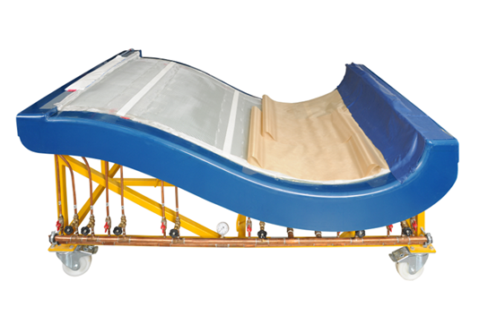
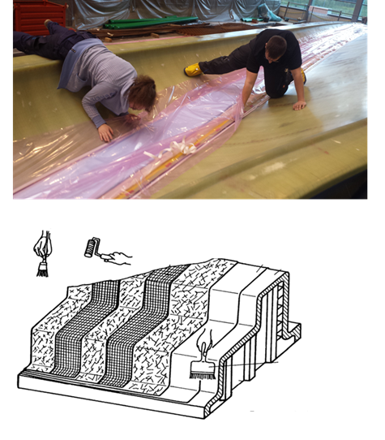
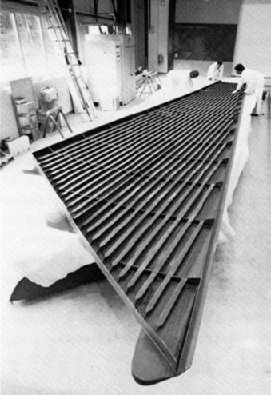
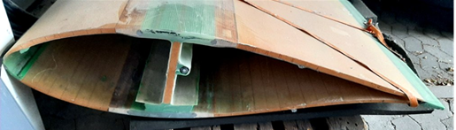

## Fiber Composites
Prof. Dr.-Ing. Christian Willberg 

Contact: christian.willberg@h2.de

 
    <a href="https://doi.org/10.1007/s42102-021-00079-6" style="color: blue;">Image reference</a>

---

---

<!--paginate: true-->

---

## Materials Engineering in Transformation - Green Deal Era

**EU Green Deal Targets**
- **2030**: -55% CO₂ emissions (vs. 1990)
- **2050**: Climate neutrality
- **Investment**: €1 trillion through 2030

**Materials Industry Impact**
- Responsible for **22% of EU industrial emissions**
- Energy consumption: **26% of total industrial energy**
- Raw materials: **50% of total industrial demand**

---

**Paradigm Shift in Materials Selection**
- ~~Performance only~~ → **Performance + Sustainability**
- ~~Linear economy~~ → **Circular design**
- ~~Cost optimization~~ → **Life cycle assessment**
- ~~Virgin materials~~ → **Recycled content targets**

---

**New Regulatory Framework**
- Carbon Border Adjustment (CBAM) - Started 2023
- Ecodesign for Sustainable Products Regulation (ESPR)
- Critical Raw Materials Act
- Corporate Sustainability Reporting Directive (CSRD)

Sources: <a href="https://commission.europa.eu/strategy-and-policy/priorities-2019-2024/european-green-deal_en">European Green Deal</a> | 
<a href="https://www.eurofer.eu/issues/environment/eu-green-deal/">EUROFER Green Deal Impact</a>

---

## The Sustainability Imperative - Why Now?

**Climate Reality**
- Materials production = **11% of global CO₂**
- Resource extraction doubled since 2000
- 2024: Warmest year on record

**Economic Drivers**
- **CO₂ price**: €80-100/ton (2024) → €150+ expected by 2030
- **Energy costs**: 2-3× pre-2021 levels
- **Green premium**: 20-30% price advantage for sustainable products
- **ESG investment**: €350 billion in EU green bonds

---

**Technology Enablers**
- Renewable energy: 42% of EU electricity (2023)
- Digital twins: 30% efficiency gains possible
- AI/ML: Optimized material design
- Hydrogen economy: €470 billion EU investment by 2050

**Market Pull**
- OEMs demanding carbon-neutral supply chains
- Consumer preference: 77% willing to pay more for sustainable products
- Regulatory pressure: Mandatory sustainability reporting

Sources: <a href="https://www.iea.org/">IEA</a> | 
<a href="https://www.mckinsey.com/capabilities/sustainability/our-insights">McKinsey Sustainability</a> |
<a href="https://climate.ec.europa.eu/">EU Climate Action</a>

---

## Materials Transition Roadmap 2024-2050

**Investment Requirements**
- Steel decarbonization: €85 billion
- Chemical industry transformation: €150 billion
- Circular economy infrastructure: €200 billion
- Skills & retraining: €50 billion

Sources: <a href="https://ec.europa.eu/info/strategy/priorities-2019-2024/european-green-deal/industry-and-green-deal_en">EU Industrial Strategy</a> | 
<a href="https://www.agora-industry.org/">Agora Industry</a>

---

## Metals in Germany/EU - Applications & Manufacturing Challenges

**Automotive Applications**
- **High-strength steels**: Body-in-white (up to 1500 MPa)
- **Aluminum alloys**: Engine blocks, wheels, chassis
- **Challenge**: Joining dissimilar metals (Al-Steel)

**Manufacturing Challenges**
- Energy costs: ~40% of steel production costs
- CO₂ emissions: 7% of global emissions from steel
- Hydrogen-based steel production: Still in pilot phase
- Skilled worker shortage: 200,000+ vacancies in metalworking

---

**Current Solutions**
- Hybrid joining technologies (adhesive bonding + riveting)
- Electric arc furnaces: 30% of EU steel production
- Industry 4.0: Predictive maintenance, quality control

Sources: <a href="https://www.stahl-online.de/en/">German Steel Federation</a> | 
<a href="https://www.eurofer.eu/">EUROFER</a> |
<a href="https://www.acea.auto/">ACEA - European Automobile Manufacturers</a>

---

## Ceramics - High-Performance Applications & Challenges

**Critical Applications**
- **Automotive**: Diesel particulate filters, brake discs (SiC)
- **Electronics**: MLCC capacitors (>1 trillion units/year)
- **Medical**: Hip implants (Al₂O₃, ZrO₂), dental crowns
- **Energy**: Solid oxide fuel cells, battery separators

**Manufacturing Challenges**
- **Brittleness**: No plastic deformation → catastrophic failure
- **Processing temperatures**: >1600°C for sintering
- **Machining costs**: Diamond tools required
- **Quality control**: Detecting micro-cracks

---

**Innovation Focus**
- Additive manufacturing of ceramics (binder jetting, SLA)
- Cold sintering processes (<300°C)
- Self-healing ceramic composites

Sources: <a href="https://www.ceramtec.com/">CeramTec</a> | 
<a href="https://www.ecers.org/">ECerS</a> |
<a href="https://www.fraunhofer.de/en/institutes/ikts.html">Fraunhofer IKTS</a>

---

## Polymers - Mass Production & Sustainability Challenges

**Volume Applications**
- **Packaging**: 40% of plastic demand (PE, PP, PET)
- **Construction**: PVC pipes, insulation (PU foam)
- **Automotive**: 150-200 kg plastic per vehicle
- **Medical**: Single-use devices, implants (PEEK)

**Manufacturing Challenges**
- **Recycling**: Only 32% mechanically recycled in EU
- **Microplastics**: 500,000 tons/year released in EU
- **Oil dependency**: 4-6% of global oil for plastics
- **Mixed waste streams**: Difficult separation

---

**Industry Response**
- Chemical recycling: Pyrolysis, depolymerization
- Bio-based feedstocks: Currently 2% of production
- Design for recycling: Monomaterial concepts
- Digital watermarks for sorting

Sources: <a href="https://www.plasticseurope.org/">PlasticsEurope</a> | 
<a href="https://www.kunststoffe.de/en/">Kunststoffe International</a> |
<a href="https://www.european-bioplastics.org/">European Bioplastics</a>

---

## Composites - Performance vs. Manufacturing Complexity

**High-Value Applications**
- **Wind turbine blades**: 80-100m length, 20-year lifetime
- **Aircraft structures**: 50% composite in A350/B787
- **Automotive**: BMW i3/i8 carbon fiber body
- **Sports equipment**: Bicycles, tennis rackets

**Manufacturing Challenges**
- **Cycle times**: Autoclave curing 4-8 hours vs. 1 min for steel stamping
- **Costs**: Carbon fiber €15-150/kg vs. steel €0.50/kg
- **Automation**: Complex 3D shapes difficult to automate
- **End-of-life**: Thermoset composites not recyclable

---

**Technology Development**
- RTM with fast-curing resins: <5 min cycle times
- Thermoplastic composites: Recyclable, weldable
- Automated Fiber Placement (AFP): Reduced labor costs
- Recycled carbon fiber: 30% less energy than virgin

Sources: <a href="https://www.composites-united.com/">Composites United</a> | 
<a href="https://www.jec-group.com/">JEC Group</a> |
<a href="https://www.carbon-composites.eu/">CCeV</a>

---

| Challenge | Metals | Ceramics | Polymers | Composites |
|-----------|--------|----------|----------|------------|
| **Energy consumption** | Very high (melting) | Very high (sintering) | Medium | Medium |
| **Processing time** | Minutes | Hours-days | Seconds-minutes | Hours |
| **Automation level** | High (90%+) | Medium (50%) | Very high (95%+) | Low (30%) |
| **Recycling rate** | 85-95% | <30% | 30-40% | <10% |
| **Defect detection** | Established (NDT) | Difficult | Good (inline) | Expensive |
| **Supply chain** | Global, volatile | Specialized | Oil-dependent | Limited suppliers |
 ---
**EU Manufacturing Competitiveness**
- Labor costs: 3-5× higher than Asia
- Energy costs: 2-3× higher than USA (2024)
- Regulatory burden: REACH, emissions trading

Sources: <a href="https://ec.europa.eu/eurostat">Eurostat</a> | 
<a href="https://www.vdma.org/en/">VDMA</a> |
<a href="https://www.mckinsey.com/">McKinsey Manufacturing Insights</a>

---

## Multi-Material Design - The Future Challenge

**Hybrid Structures Examples**
- **E-mobility batteries**: Al housing + polymer seals + ceramic separators + Cu conductors
- **Wind turbines**: Steel tower + composite blades + rare earth magnets
- **Medical implants**: Ti scaffold + ceramic coating + polymer interface

**Manufacturing Integration Challenges**
- **Different processing temperatures**: Polymers (200°C) vs. Metals (>1000°C)
- **Thermal expansion mismatch**: CTE differences cause stress
- **Joining technologies**: No universal solution
- **Recycling complexity**: Material separation difficult

---

**Industry 4.0 Solutions**
- Digital twins for multi-material optimization
- AI-driven quality control
- Flexible manufacturing cells
- material traceability

Sources: <a href="https://www.hybridmaterials.eu/">EU Hybrid Materials Initiative</a> | 
<a href="https://www.plattform-i40.de/EN/">Platform Industrie 4.0</a>

---

## Sustainability & Circular Economy - Manufacturing Reality

**Current State (2024)**
- **Energy**: 14% of EU energy consumption in materials processing
- **Emissions**: 20% of EU CO₂ from materials industries
- **Waste**: 2.2 billion tons/year in EU
- **Resource dependency**: 80% critical raw materials imported

**Manufacturing Transformation Required**
- **2030 targets**: 55% CO₂ reduction vs. 1990
- **2050 vision**: Climate-neutral production
- **Investment needed**: €350 billion by 2030

---

**Key Technologies**
- Green hydrogen for steel: €5-10/kg H₂ (target: <€2/kg)
- Chemical recycling: Energy penalty 40-60%
- Bio-based materials: 2-5× current prices
- Carbon capture: €50-100/ton CO₂

Sources: <a href="https://ec.europa.eu/info/strategy/priorities-2019-2024/european-green-deal_en">EU Green Deal</a> | 
<a href="https://www.iea.org/">IEA - International Energy Agency</a> |
<a href="https://www.systemiq.earth/">SYSTEMIQ - Circular Economy</a>

---
**Key Material Production Centers**

**North Rhine-Westphalia**
- Steel: Duisburg, Dortmund (ThyssenKrupp)
- Chemicals/Polymers: Leverkusen (Covestro), Cologne (LANXESS)
- Aluminum: Neuss, Grevenbroich

**Bavaria**
- Composites: Augsburg (Premium AEROTEC)
- Ceramics: Selb (Rosenthal), Weiden
- Specialty metals: Aerospace cluster

---

**Baden-Württemberg**
- Automotive materials: Stuttgart region
- Technical textiles: Albstadt, Reutlingen
- Advanced ceramics: Plochingen

**Saxony**
- Carbon fibers: Dresden region
- Technical ceramics: Meissen
- Lightweight construction: Dresden, Chemnitz

Sources: <a href="https://www.bmwk.de/EN/">Federal Ministry for Economic Affairs</a> | 
<a href="https://www.gtai.de/en/">Germany Trade & Invest</a>

---

## Skills Gap & Workforce Challenges

**Current Situation**
- **210,000** unfilled positions in German manufacturing (2024)
- **45%** of companies report skills shortage as main barrier
- **Average age**: 44 years in materials industry

**Critical Skills Needed**
- Materials science & engineering
- Process automation & robotics
- Data analytics & AI
- Sustainability assessment
- Quality management

---

**Education & Training**

**Future Requirements**
- Interdisciplinary thinking
- Digital competencies
- Circular economy expertise
- International collaboration

Sources: <a href="https://www.bibb.de/en/">Federal Institute for Vocational Education</a> | 
<a href="https://www.vdi.de/en/">VDI - Association of German Engineers</a>

---
# Fibre composites

---

---

**Fiber Materials**
- **Glass fibers**: Most common (≈70% market share)
  - E-glass, S-glass, AR-glass
- **Carbon fibers**: Growing market (≈20% market share)
  - High-modulus, high-strength variants
- **Natural fibers**: Increasing importance
  - Flax, hemp, jute (automotive sector)
- **Aramid fibers**: Special applications

**Matrix Systems**
- **Thermosets**: ≈65% of composites market
  - Epoxy (aerospace, wind energy)
  - Polyester (automotive, construction)
  - Vinyl ester (marine, chemical industry)
- **Thermoplastics**: ≈35% and growing
  - PP, PA6, PA12 (automotive)
  - PEEK, PPS (aerospace)

Sources: <a href="https://www.avk-tv.de/files/20210928_avk_ccev_market_report_2021.pdf">AVK Market Report 2021</a> | 
<a href="https://eucia.eu/market-data/">EuCIA Market Data</a>

---

## Key Application Sectors in Germany/EU

**Automotive Industry**
- Glass/carbon fiber composites
- Natural fiber composites for interior parts
- Focus on recyclability and sustainability

**Wind Energy**
- Glass fiber rotor blades
- Carbon fiber for longer blades (>80m)
- Germany: Leading manufacturer

**Aerospace**
- Carbon fiber composites (Airbus)
- High-performance thermoplastics
- Strict certification requirements

**Construction**
- Glass fiber reinforced concrete
- Carbon fiber reinforcement
- Bridge rehabilitation

Sources: <a href="https://www.composites-united.com/">Composites United</a> | 
<a href="https://compositesuk.co.uk/composite-materials/applications">Composites UK</a>

---

## Market Trends and Regulations in EU

**Sustainability Focus**
- EU Green Deal requirements
- Circular economy regulations
- Bio-based materials promotion

**Key Regulations**
- [REACH](https://echa.europa.eu/regulations/reach/understanding-reach) (Registration, Evaluation, Authorization of Chemicals)
- [End-of-Life Vehicle Directive](https://environment.ec.europa.eu/topics/waste-and-recycling/end-life-vehicles_en)
- [Waste Framework Directive](https://environment.ec.europa.eu/topics/waste-and-recycling/waste-framework-directive_en)
- [EU Taxonomy](https://finance.ec.europa.eu/sustainable-finance/tools-and-standards/eu-taxonomy-sustainable-activities_en) for sustainable activities

**Future Outlook**
- Recycling technologies development
- Bio-composites growth
- Automated manufacturing
- Industry 4.0 integration

**German/EU Market Leaders**
- [SGL Carbon](https://www.sglcarbon.com/) (carbon fibers)
- [Covestro](https://www.covestro.com/) (matrix systems)
- [BASF](https://www.basf.com/) (resins and additives)
- [Evonik](https://www.evonik.com/) (specialty polymers)

Sources: <a href="https://www.jec-group.com/en/market">JEC Group Market Insights</a> | 
<a href="https://ec.europa.eu/growth/sectors/raw-materials/advanced-materials_en">EU Commission - Advanced Materials</a>

---

## Additional Resources & References

**Industry Associations**
- [AVK - German Composites Association](https://www.avk-tv.de/en/)
- [Composites United e.V.](https://www.composites-united.com/)
- [EuCIA - European Composites Industry Association](https://eucia.eu/)
- [Carbon Composites e.V. (CCeV)](https://www.carbon-composites.eu/)

**Research Institutions**
- [DLR Institute of Composite Structures](https://www.dlr.de/fa/en/)
- [Fraunhofer IGCV](https://www.igcv.fraunhofer.de/en.html)
- [Leibniz-Institut für Verbundwerkstoffe](https://www.ivw.uni-kl.de/en/)

**Market Reports & Statistics**
- [Statista - Composites Market Data](https://www.statista.com/topics/3945/composites-market/)
- [Grand View Research - European Composites](https://www.grandviewresearch.com/industry-analysis/europe-composites-market)
- [Lucintel - Composites Market Report](https://www.lucintel.com/composites-market.aspx)

**Regulatory Documents**
- [European Green Deal](https://commission.europa.eu/strategy-and-policy/priorities-2019-2024/european-green-deal_en)
- [Circular Economy Action Plan](https://environment.ec.europa.eu/strategy/circular-economy-action-plan_en)

---

## What is a Fiber Reinforced Composite (FRC)

- Multiphase or composite material generally consisting of two main components (fiber and matrix)
- The composite material has superior properties than either of the two components alone
- Material and its properties are created during manufacturing

---

## Matrix – binding component

---

## Fiber – reinforcing component

---

## Raw materials - Fiber

- Short fibers
  - Random arrangement (low anisotropy)
  - Often recycled fibers
- Long fibers
  - Several millimeters - few centimeters length
  - Lower requirements for processing and storage

---

## Raw materials - Fiber

- Continuous fibers
  - High strength and stiffness
  - Higher requirements for processing and storage

---

## Raw materials - Fiber

- Natural fibers: Hair, wool, silk, cotton, flax, sisal, hemp, jute, ramie, banana fibers...
- Organic fibers: Polyethylene (PE), polypropylene (PP), polyamide (PA), polyester (PES), polyacrylonitrile (PAN), aramid, carbon...
- Inorganic fibers: Glass, basalt, quartz, SiC, Al2O3, boron...
- Metal fibers from: Steel, aluminum, copper, nickel, beryllium, tungsten...

---

## Raw materials FRC - Matrix

**Thermosetting reaction resins**
- Epoxy resins, phenolic resins, polyester resins, vinyl ester resins...
- Mixed with curing agents for hardening
- Pre-impregnated fibers -> Prepregs
- Exothermic and volume changing during curing

**Thermoplastics**
- Polypropylene, polyamide, polyarylene sulfides...
- Melt at a specific temperature (55 °C – 155 °C)
- Expensive but recyclable
- More difficult to handle

---

## Glass fiber - FRC

**Advantages**
- Good chemical and microbiological resistance
- Cost
**Disadvantages**
- Low elastic modulus for many structural components
- Glass fibers are non-biodegradable (advantage and disadvantage)

---

## Carbon fiber (C-fiber)

**Advantages**
- C-fibers are very light, their density ($\rho_f \approx 1.8 g/cm^3$) is significantly lower than that of glass fibers ($\rho_f \approx 2.54 g/cm^3$)
- Extremely high strength and very high elastic modulus
- Both mechanical properties can be adjusted within wide ranges during fiber production
- Excellent fatigue strength

---

**Disadvantages**
- Lower compressive strength in fiber direction
- Poorer drapability
- Cost
- Elastic moduli in longitudinal and transverse fiber direction differ by an order of magnitude (advantage and disadvantage)

---

## Composite schematic
**Symmetries**
- Transverse isotropy (properties in directions 2 and 3 are equal)
- Orthotropic
- Anisotropic
**Fiber volume fraction $\varphi$**
Calculated from rule of mixtures
$\rho= \varphi\rho_f+(1- \varphi) \rho_m$
Stiffness and strength

---

---

## Why?

**Energy production ~ Area of the rotor**

The energy production of a wind turbine is proportional to the swept rotor area (A = πr²).

**The scaling advantages:**
- Doubling the rotor diameter → **4x more swept area**
- 4x more area → **4x more energy production**

---

**But costs don't scale proportionally:**
- Only **1x** generator needed
- Only **1x** tower
- Only **3x** rotor blades (just longer, not more pieces)
- Only **1x** foundation (larger, but not 4x more expensive)
- Only **1x** grid connection
- Only **1x** maintenance access

---

## The Result

**Cost per megawatt drops dramatically** with turbine size:
- Material costs grow sub-linearly (approximately with r^2.3 instead of r^3)
- Installation and maintenance costs spread over more power output
- Taller towers reach stronger and more consistent winds

**Therefore:** Development continuously moves toward larger turbines
- 1980s: ~15m rotor diameter
- 2000s: ~70m
- Today: >150m (offshore >220m)

---

---
## Manufacturing - Process Selection Criteria
**Key factors determining process choice:**
- **Application requirements**: Aerospace, automotive, wind energy, marine
- **Operating conditions**: Temperature range, mechanical loads, environmental exposure
- **Material system**: 
  - Fiber type (carbon, glass, aramid, ...)
  - Matrix type (thermoset vs. thermoplastic)
- **Production volume**: Prototype, small series, mass production
---
- **Cost constraints**: Material cost, tooling investment, cycle time
- **Quality requirements**: Void content <1%, dimensional tolerance
- **Safety & environmental**: VOC emissions, worker exposure

*Source: Campbell, F.C. (2010). Structural Composite Materials. ASM International*

---

## Manufacturing - Process Chain Overview
**1. Tooling preparation**
- Mold design and fabrication
- Surface treatment and release agents

**2. Material preparation**
- Cutting of preforms/prepregs
- Ply book generation and kitting

**3. Lay-up and consolidation**
- Manual or automated fiber placement
- Compaction and debulking

---

**4. Curing**
- Temperature/pressure cycle optimization
- Degree of cure monitoring (DSC, dielectric, ...)

**5. Post-processing**
- Demolding, trimming, drilling, finish
  - ~50.000 drilling holes per fuselage part of an A350
  - up to 100 kg additional mass for surface finish of a wind turbine blade
- Non-destructive testing (ultrasonic, thermography, visual inspection, etc.)

---

## Tooling Technologies
**Material selection criteria:**
- **CTE matching**: Critical for dimensional accuracy
- **Temperature resistance**: Up to 200°C for aerospace applications
- **Durability**: 100-5000 cycles depending on production volume

---

**Common tooling materials:**
| Material | Max Temp | Cost | Appli. |
|----------|----------|------|-------------|
| Aluminum  | 200°C | $$ | Small series |
| Steel/Invar | 400°C | $$$ | High volume |
| CFRP |  180°C | $$$$ | Complex geometry |
| BMI/Epoxy |  230°C | $$ | Prototype |
| Card board |  20°C | $ | Research  |

---

## Semi-finished Products - Technical Textiles
**Fabric architectures and properties:**

**Woven fabrics**
- Plain, twill, satin weaves
- Good drapeability, balanced properties
- Typical: 200-800 g/m²

**Non-crimp fabrics (NCF)**
- Unidirectional, biaxial, triaxial
- Higher fiber volume fraction (up to 65%)
- Reduced crimp → better mechanical properties

**Specialty products**
- Braided sleeves: Complex 3D shapes
- Core materials: Honeycomb (Nomex, aluminum), foams (PVC, PET)
- Veils: Surface quality, electrical conductivity

*Reference: Lomov, S.V. (2011). Non-Crimp Fabric Composites. Woodhead Publishing*

---

## Manufacturing Processes - Overview
**Process selection matrix by production volume:**

| Process | Volume | Cycle Time | Fiber Volume | Investment |
|---------|--------|------------|--------------|------------|
| Hand Lay-up | 1-100 | Hours | 30-40% | $ |
| Filament Winding | 100-10k | 1-4 hrs | 55-70% | $$ |
| RTM/VARTM | 100-50k | 10-120 min | 45-65% | $$$ |
| Pultrusion | >10k | Continuous | 50-70% | $$$ |
| AFP/ATL | 10-1000 | 2-8 hrs | 55-65% | $$$$ |
| Compression Molding | >50k | 1-5 min | 40-60% | $$$$ |

---

## Hand Lay-up & Spray-up
**Hand lay-up characteristics:**
- **Advantages**: Low tooling cost, large/complex parts possible
- **Limitations**: Labor intensive, quality operator-dependent
- **Applications**: Boat hulls, wind turbine blades, prototypes
- **Fiber volume**: 30-40%

---

**Spray-up process:**
- Chopped fiber (25-50mm) with resin
- Fast deposition (5-10 kg/min)
- Lower mechanical properties
- Typical thickness: 3-10mm

*Industry note: Still represents ~35% of composite manufacturing globally*

---

## Filament Winding
**Process parameters:**
- **Winding patterns**: Hoop, helical, polar
- **Fiber tension control**: 10-50 N typical
- **Mandrel types**: Extractable, dissolvable, split

**Key advantages:**
- High fiber volume (up to 70%)
- Excellent hoop strength
- Automated, repeatable process

---

**Applications:**
- Pressure vessels (Type III, IV)
- Drive shafts
- Rocket motor cases

**Design equation (netting analysis):**
$$\frac{\sigma_h}{\sigma_a} = \frac{2}{\tan^2\alpha}$$

---

## Autoclave Processing
**Process optimization parameters:**
- **Heating rate**: 1-5°C/min (avoid exotherm)
- **Pressure**: 3-7 bar (void reduction)
- **Vacuum**: >600 mbar (volatile removal)
- **Dwell temperature**: Matrix-dependent (120-180°C typical)

---

**Quality metrics:**
- Void content: <1% aerospace, <2% automotive
- Fiber volume fraction: 58-65%
- Glass transition (Tg): >90% of theoretical

**Cost considerations:**
- Energy: 50-200 kWh/cycle
- Capital: $1-10M for production autoclave
- Cycle time: 4-12 hours total

---

## Automated Fiber Placement (AFP/ATL)
**Technology comparison:**

| Parameter | AFP | ATL |
|-----------|-----|-----|
| Tow width | 3.2-12.7 mm | 75-300 mm |
| Lay-up rate | 10-50 kg/hr | 50-150 kg/hr |
| Min. radius | 50-100 mm | >1000 mm |
| Steering radius | >600 mm | Limited |

---

**Advanced capabilities:**
- In-situ consolidation (thermoplastic)
- Variable stiffness designs
- Integrated inspection systems
- Digital twin integration

**Applications:** Aerospace fuselages, wing skins, rocket fairings

*Source: Lukaszewicz, D. (2013). Optimization of AFP. Springer*

---

## Design Strategies

---

**Integral construction**
- Single-piece structures
- Reduced assembly time/cost
- Monocoque chassis, wing box

**Differential construction**
- Modular approach
- Easier repair/replacement
- Standard joints and interfaces

**Hybrid construction**
- Metal-composite joints
- Selective reinforcement
- Optimized cost-performance

---

## Design Principles for Composites
**Load path optimization:**
- Align fibers with principal stress directions
- Minimize out-of-plane loads (weak in z-direction)
- Quasi-isotropic layups for complex loading

**Structural efficiency:**
- Maximize second moment of area (sandwich structures)
- Use geometric stiffening (corrugations, ribs)
- Topology optimization for minimum weight

---

**Damage tolerance:**
- Avoid impact-prone areas
- Design for barely visible impact damage (BVID)
- Redundant load paths

**Joint design:**
- Adhesive > mechanical (no fiber cutting)
- Scarf joints (1:20 ratio) for repairs
- Avoid peel loads in bonded joints

*Reference: Niu, M.C.Y. (2010). Composite Airframe Structures. Hong Kong Conmilit Press*

---

## Advantages vs. Limitations

### **Advantages**
- **Specific strength/stiffness**: 3-5× better than aluminum
- **Design flexibility**: Tailored anisotropy
- **Fatigue resistance**: Superior to metals
- **Corrosion resistance**: Inherent property
- **Part consolidation**: 50-90% fewer parts possible

---

### **Limitations**
- **Manufacturing rate**: 2-10 parts/day typical (autoclave)
- **Joining challenges**: No welding, limited forming
- **Impact sensitivity**: Low velocity impact critical
- **Crash behavior**: Limited plastic deformation
- **Recycling**: Thermoset recycling challenging
- **Cost**: 20-100 $/kg for carbon fiber

---
# Research with master students
_Partner: Institute of lighweigth systems; Department of Structural Mechnanics, German Aerospace Center_
## Why H₂

- Steel production
- Chemical industry
- Rockets
- Aircraft

---

---

# Questions?
Feel free to contact me
christian.willberg@h2.de

PeriLab - Peridynamics Research 
https://github.com/PeriHub/PeriLab.jl
