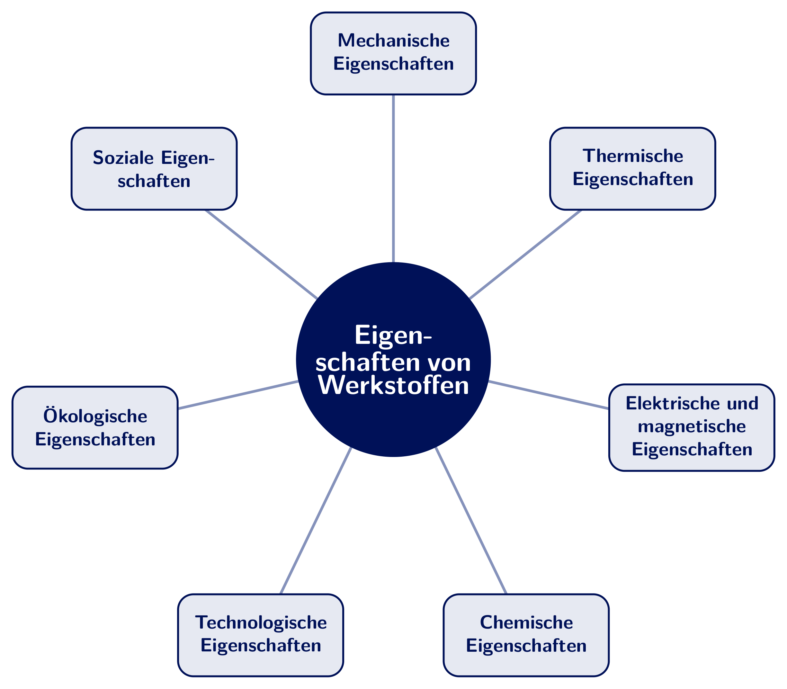

<!-- _class: lead -->

# Werkstoff- und Fertigungstechnik - Einführung

Prof. Dr.-Ing.  Christian Willberg 
Hochschule Magdeburg-Stendal

Kontakt: christian.willberg@h2.de

 

---

## Vorlesung

**Rahmen**

- Essen oder Trinken sind okay, aber leise
- Probleme:
    - bei der Kinderbetreuung
    - Nachteilsausgleich
    - Diskriminierung
    - sprachlich
    - ...
- Fragen

---

## Organisation

<!-- TODO: Angaben zu Praktika/Übungen und Prüfungsform an das tatsächliche Modulhandbuch MTI anpassen -->

- Praktika / Übungen: Zugversuch, Härteprüfung, Führung durch das Fertigungslabor
- Prüfungsform: schriftlich
- Fragen per E-Mail; Konsultationen bei Bedarf

---

# Einordnung
## Warum Mensch-Technik-Interaktion gerade jetzt?
Wandel der Werkstoff- und Fertigungstechnik und die Rolle des Menschen dabei

---

## Das Klima - globale Lage

- **2024**: erstes Kalenderjahr mit mehr als **1,5 °C** über dem vorindustriellen Niveau (Copernicus)
- Die letzten zehn Jahre sind die wärmsten seit Beginn der Messungen
- Pariser Abkommen: Erwärmung deutlich unter 2 °C, möglichst 1,5 °C

Quellen: <a href="https://climate.copernicus.eu/global-climate-highlights-2024">Copernicus Global Climate Highlights</a> |
<a href="https://www.ipcc.ch/report/ar6/syr/">IPCC AR6</a> |
Warming Stripes: <a href="https://showyourstripes.info/">showyourstripes.info</a>

<!-- Vertiefung zum globalen Klimathema: siehe Spezialvorlesungen -->

---

## Das Klima - Deutschland

- Jahresmitteltemperatur seit 1881: **ca. +1,8 °C** - also stärker als der globale Mittelwert
- Rekord: **41,2 °C** (Lingen, Juli 2019)
- Heiße Tage (≥ 30 °C): von ca. 3 pro Jahr (1950er) auf rund 10 pro Jahr heute
- Mehr Starkregen, längere Trocken- und Hitzeperioden

Quellen: <a href="https://www.dwd.de/DE/klimaumwelt/klimawandel/klimawandel_node.html">Deutscher Wetterdienst</a> |
<a href="https://www.umweltbundesamt.de/themen/klima-energie/klimafolgen-anpassung">Umweltbundesamt - Klimafolgen</a>

---

## Extremwetter - Beispiele aus Deutschland

| Ereignis | Folgen |
|:---|:---|
| Elbehochwasser 2002 und 2013 (u. a. Magdeburg) | Deiche, Brücken, Evakuierungen, Frühwarnung |
| Hitze- und Dürresommer 2018, 2019, 2022 | Gleisverwerfungen, Ernteausfälle, Niedrigwasser |
| Niedrigwasser am Rhein 2018/2026 | Transportprobleme, Produktionsdrosselung |
| Ahrtal-Flut 2021 | Zerstörte Infrastruktur, mehr als 180 Tote |
| Hitzewelle 2026 | Fahrbahnschäden, Schienschäden in Leipzig |

---

## Zwei Seiten derselben Medaille

**1. Klimaschutz und Ressourceneffizienz verändern Werkstoffe und Fertigung - und zwar schnell**
- Leichtbauwerkstoffe, ressourcenschonende Prozesse, Automatisierung, Kreislaufwirtschaft
- Diese Technik wirkt nur, wenn die Menschen an Maschine, Prüfstand und Leitstand sie **verstehen, bedienen und ihr vertrauen**

---

**2. Schlecht gestaltete Mensch-Technik-Schnittstellen bremsen die Transformation**
- Fehlbedienung, Ablehnung, Fehlvertrauen (zu viel oder zu wenig)
- Akzeptanzprobleme verzögern die Einführung neuer Werkstoffe, Anlagen und Prüfverfahren oft stärker als die Technik selbst

<!-- BILD: Beispiel für eine unübersichtliche Maschinen- oder Anlagenbedienoberfläche, z. B. CNC-Steuerung oder Prüfstands-Display -->

---

## Beispiele: MTI in der Werkstoff- und Fertigungstechnik

| Technik | MTI-Herausforderung |
|:---|:---|
| Bedienpanels an Werkzeugmaschinen / CNC-Anlagen | Verständlichkeit, Fehlervermeidung |
| Mensch-Roboter-Kollaboration (Cobots) in der Montage | Sicherheit, Rollenverteilung, Vertrauen |
| Automatisierte Werkstoffprüfung (Zug-, Härteprüfung) | Bedienbarkeit, Nachvollziehbarkeit der Ergebnisse |
| Leitstände / Prozessüberwachung in der Fertigung | Informationsdichte, Alarmmanagement |
| Qualitätssicherung mit Bildverarbeitung / KI | Vertrauen in automatisierte Entscheidungen |

---

## Vertrauen in Automatisierung

- **Zu wenig Vertrauen** → Technik wird umgangen oder nicht genutzt (z. B. manuelle statt automatisierte Prüfung)
- **Zu viel Vertrauen** (*Automation Bias*) → Fehler der Automation werden nicht erkannt (z. B. fehlerhafte automatisierte Qualitätskontrolle)
- Richtig **kalibriertes Vertrauen** ist ein zentrales Gestaltungsziel der MTI

<!-- BILD: Diagramm/Kurve "kalibriertes Vertrauen" (Vertrauen vs. tatsächliche Zuverlässigkeit der Automation) -->

---

## Wo geht die Reise hin?

- KI-gestützte Assistenzsysteme in Fertigung, Instandhaltung und Werkstoffprüfung
- Mensch-Roboter-Kollaboration in Fertigungszellen und Montage
- Erklärbare, transparente Automatisierung (*explainable AI*) in der Qualitätssicherung
- Digitale Zwillinge von Produktionslinien und Prüfständen
- Nutzerzentrierte Gestaltung als Pflichtdisziplin für Ingenieurinnen und Ingenieure in der Fertigung

---

## Was heißt das für Sie?

- Technik entfaltet ihren Nutzen erst über eine **gut gestaltete Schnittstelle zum Menschen**
- Neue Werkstoffe, Anlagen und Prüfverfahren sind ohne Akzeptanz und richtige Bedienung wirkungslos
- Genau diese Grundlagen lernen Sie in dieser Vorlesung: Wahrnehmung, Gestaltung und Bewertung von Mensch-Technik-Systemen in der Werkstoff- und Fertigungstechnik

---

## Werkstoffe

Was sind Werkstoffe?

[Werkstoffe im engeren Sinne nennt man Materialien im festen Aggregatzustand, aus denen Bauteile und Konstruktionen hergestellt werden können.](https://de.wikipedia.org/wiki/Werkstoff)

---
## Anwendunggebiete

- Metalle
  - Eisen, Stahl, Gusseisen
  - Nicht Eisen
- Kunststoffe
- Keramiken
- Verbundwerkstoffe

---

---

## Gußeisen - Stahl

---

## Nicht Eisen Metalle

- Kupfer ist ein sehr guter elektrischer und thermischer Leiter

---

- Magnesium findet im Leichtbau Anwendung 
- Titan und Titanlegierungen 
    - hohe Festigkeit und Warmfestigkeit
    - Korrosionsbeständig
- Nickel
    - Korrosionsbeständigkeit
    - hohe Warmfestigkeit

---

## Keramiken

---

## Gläser

---

## Faserverbundwerkstoffe

---

# Eigenschaften von Werkstoffen
**Welche gibt es?**

---

---

## Thermische Eigenschaften

Verhalten bei Temperatureinwirkung

- Wärmeleitfähigkeit, Wärmeausdehnung
- spezifische Wärmekapazität
- Schmelz- und Glasübergangstemperatur

---

## Elektrische und magnetische Eigenschaften

- elektrische Leitfähigkeit / spezifischer Widerstand
- Dielektrizität
- magnetische Permeabilität (z. B. ferromagnetisch, paramagnetisch)

---

## Chemische Eigenschaften

- Korrosionsbeständigkeit
- Reaktivität, Beständigkeit gegenüber Medien (Säuren, Laugen, Lösemittel)
- Oxidationsverhalten

---

## Technologische Eigenschaften

Wie gut lässt sich ein Werkstoff verarbeiten?

- Umformbarkeit, Zerspanbarkeit
- Schweißbarkeit, Gießbarkeit
- Härtbarkeit

---

## Ökologische Eigenschaften

- CO₂-Fußabdruck bei Herstellung und Recycling
- Ressourcenverbrauch, Kreislauffähigkeit
- Umweltverträglichkeit über den Lebenszyklus

---

## Soziale Eigenschaften

- Herkunft und Abbaubedingungen der Rohstoffe
- Arbeitsbedingungen in der Lieferkette
- Konfliktrohstoffe, Menschenrechte

---

# Mechanische Eigenschaften
Was sind wichtige Eigenschaften aus Sicht einer Ingenieurin / eines Ingenieurs?
- Materialverhalten ohne Schädigung
- Ermüdungsverhalten
- Verschleißverhalten
- wann tritt eine Schädigung auf
- ...

---

## Konzept Spannung - Dehnung
- Detaliert in der technischen Mechanik
$\varepsilon$ - Dehnung
$\sigma$ - Mechanische Spannung

---

## Dehnungen 1D
$$\varepsilon = \frac{\Delta l}{l}$$

Beispiel:
$l_0 = 1m$
$l_1 = 1.01m$
$$\varepsilon = \frac{l_1-l_0}{l_0}=0.01\rightarrow 1\%$$

---
## Spannungen 1D

$$\sigma = \frac{F}{A}$$

Beispiel:
$F = 100N$
$A = 20mm^2$
$$\sigma = \frac{F}{A} = \frac{100 N}{20 mm^2} = 5 \frac{N}{mm^2}$$

---

# Mehr Dimensionalität

---

## Symmetrien
- isotropie
- transversale isotropie
- orthotropie
- ...
- anisotropie

---

## Mechanische Eigenschaften

- die **reversible** Verformung, bei der sofort bzw. eine bestimmte Zeit nach dem Einwirken der äußeren Belastung der verformte Werkstoff seine ursprüngliche Form zurückerhält: elastische und viskoelastische Verformung;

- die **irreversible (bleibende)** Verformung, bei der die Formänderung auch nach dem Einwirken der äußeren Belastung erhalten bleibt: plastische und viskose Verformung;

- der Bruch, d.h. eine durch Entstehen und Ausbreiten von Rissen bewirkte Trennung des Werkstoffes.

---
## Beispiel Stahl

[Kurvenbestimmung](https://youtu.be/WWAb7Q5DAYw?si=fcnLckvNurSh0LC5)

[Datenblatt Stahl](https://www.stauberstahl.com/fileadmin/Downloads/werkstoffe/Werkstoff-1.2842-Datenblatt.pdf)

 
    <a href="https://commons.wikimedia.org/w/index.php?curid=89891144" style="color: blue;">By Nicoguaro - Own work, CC BY 4.0</a>

---
# Materialverhalten - reversibel
## Elastizität
- reversibel, energieerhaltend
- Hooksches Gesetz 1D
Normalspannung $\sigma = E\varepsilon$
Schubspannung $\tau = G\gamma$

---

## Grundlagen

- Normaldehnung [-]
$\varepsilon_{mechanisch} = \frac{l - l_0}{l_0}$

- Normalspannung $\left[\frac{N}{m^2}\right]$, $[Pa]$
$\sigma = \frac{F}{A}=E\varepsilon$
E - Elastizitätsmodul, Young's modulus $\left[\frac{N}{m^2}\right]$

- Relevant bspw. bei Verformungsanalysen

---

## Grundlagen - Querkontraktion

- Querkontraktionszahl [-]
- $\nu = -\frac{\varepsilon_y}{\varepsilon_x}$
für homogene Werkstoffe $0\leq\nu\leq 0.5$
für heterogene Werkstoffe sind anderen Konstellationen denkbar

- Relevant bspw. bei Pressverbindungen

---

## Grundlagen - Schub

- Schubdehnungen [-]
$\varepsilon = \frac12(\frac{u_x}{l_0}+\frac{u_y}{b_0})=\frac{\gamma}{2}$

- Schubspannung $\left[\frac{N}{m^2}\right]$, $[Pa]$
$\tau = \frac{F_s}{A}= G\gamma$

- Normal- und Schubspannungen sind nicht kompatibel; daher die Vergleichsspannungen 
- G - [Schub-](https://de.wikipedia.org/wiki/Kompressionsmodul#Umrechnung_zwischen_den_elastischen_Konstanten_isotroper_Festk%C3%B6rper)-, Gleitmodul, Shear modulus $\left[\frac{N}{m^2}\right]$
$G = \frac{E}{2(1+\nu)}$

- Relevant bspw. bei Torsion (Antriebsstränge, Drehfedern)

---

## Grundlagen - Kompression

$\sigma_h = p = -K \cdot \frac{\Delta V}{V_0}$

$\varepsilon_v = \frac{\Delta V}{V_0} = \varepsilon_1 + \varepsilon_2 + \varepsilon_3$

[Kompressionsmodul](https://de.wikipedia.org/wiki/Kompressionsmodul#Umrechnung_zwischen_den_elastischen_Konstanten_isotroper_Festk%C3%B6rper) $K = \frac{E}{3(1-2\nu)}$

- Relevant bspw. bei Hydrauliken

---

| Werkstoff                         | E [GPa]   | G [GPa] | $\nu [-]$     |
|:----------------------------------|:----------|:--------|:----------|
| Stahl unlegiert                   | 200       | 77      | 0.30      |
| Titan                             | 110       | 40      | 0.36      |
| Kupfer                            | 120       | 45      | 0.35      |
| Aluminium                         | 70        | 26      | 0.34      |
| Magnesium                         | 45        | 17      | 0.27      |
| Wolfram                           | 360       | 130     | 0.35      |
| Gusseisen mit lamellarem Graphit  | 120       | 60      | 0.25      |
| Thermoplaste/Duromere             | 2 … 5     | 1 … 2   | ~0.35   |
| Elastomere                        | 0.1       | 0.03    | 0.45 - 0.49|
| Sperrholz                         | 4 … 16    | -       | -         |

---

## Steifigkeiten

Wie Materialeigenschaften den Steifigkeiten zusammen?

- Material $\cdot$ Querschnitte = Steifigkeit
- Dehn-, Normalsteifigkeit = $EA$
- Biegesteifigkeit = $EI$
- Torsionssteifigkeit = $GI_P$

 
    <a href="https://doi.org/10.3390/en14092451" style="color: blue;">Bildreferenz</a>

---

## Viskoses Verhalten

- irreversibel
- zeitabhängig, dehnratenabhängig

Federmodel $\sigma = E\epsilon$ 
 - Elastischer Anteil
 - Dargestellt durch Federlemente

 
    

 
    

Dämpfer  $\sigma = \eta\dot{\epsilon}=\eta\frac{\partial \epsilon}{\partial t}$ 
- Viskoser Anteil
- Dargestellt durch Dämpferelemente

---
- schnelle Belastung -> Verhalten ist elastisch
- langsame Belastung -> Material fließt
- [schnelle Belastung](https://en.wikipedia.org/wiki/File:Sillyputty.ogv)

---

## Härte

Widerstand eines Werkstoffs gegen das Eindringen eines härteren Prüfkörpers

**Abhängigkeit von:**
- Bindungsart und Bindungsstärke
- Kristallstruktur
- Gefüge und Korngröße
- Legierungselemente
- Wärmebehandlung

**Bedeutung:**
- Verschleißbeständigkeit
- Bearbeitbarkeit

---

# Materialverhalten - irreversibel

---

## Festigkeit

[Die Festigkeit eines Werkstoffes beschreibt die Beanspruchbarkeit durch mechanische Belastungen, bevor es zu einem Versagen kommt, und wird angegeben als mechanische Spannung $\left[N/m^2\right]$. Das Versagen kann eine **unzulässige Verformung** sein, insbesondere eine **plastische (bleibende) Verformung** oder auch ein **Bruch**.](https://de.wikipedia.org/wiki/Festigkeit)

>Wichtig: Festigkeit $\neq$ Steifigkeit

---

## Plastizität

- [Schmieden](https://youtu.be/AxLszR6fkLM?si=k6A9aOVfQceOK9v0&t=80)
- [Walzen](https://www.youtube.com/watch?v=WOTO64HgnXc)

---

## Duktilität

### Brucheinschnürung

$$Z = \frac{A_0 - A_f}{A_0} \cdot 100\%$$

- A₀ = Ausgangsquerschnittsfläche [mm²]
- A_f = Querschnittsfläche bei Bruch [mm²]
- Z = Brucheinschnürung [%]

Die Brucheinschnürung beschreibt die **relative Querschnittsverringerung** eines Materials bei Zugbelastung bis zum Bruch.

---

## Duktilitätsbewertung

### Interpretation der Brucheinschnürung

| Z-Wert | Duktilität | Materialverhalten |
|--------|------------|-------------------|
| Z < 5% | Spröde | Keramiken, Gusseisen |
| 5% ≤ Z < 20% | Mäßig duktil | Hochfeste Stähle |
| 20% ≤ Z < 50% | Duktil | Baustähle |
| Z ≥ 50% | Sehr duktil | Reinkupfer, Aluminium |

---

## Bedeutung

**Hohe Brucheinschnürung (Z > 40%)** bedeutet:
- Material kann große plastische Verformungen ertragen
- Gute Umformbarkeit (Schmieden, Tiefziehen)
- Bruchwarnung durch sichtbare Einschnürung
- Hohe Energieabsorption vor dem Versagen

**Niedrige Brucheinschnürung (Z < 10%)** bedeutet:
- Sprödes Versagen ohne Vorwarnung
- Geringe Umformbarkeit
- Wenig Energieabsorption

---

## Zähigkeit (Brucharbeit)

**Wahre Dehnung und Spannung**

$$\varepsilon_{true} = \ln\left(\frac{L}{L_0}\right) = \ln(1 + \varepsilon_{nom})$$

$$\sigma_{true} = \sigma_{nom} \cdot (1 + \varepsilon_{nom}) = \frac{F}{A}$$

- F = Kraft
- A = aktuelle Querschnittsfläche

---

### Zähigkeit als Energieabsorption

$$U = \int_0^{\varepsilon_f} \sigma_{true} \, d\varepsilon_{true}$$

- U = spezifische Zähigkeit [J/m³]
- ε_f = Bruchdehnung

 
    <a href="https://commons.wikimedia.org/w/index.php?curid=89891144" style="color: blue;">By Nicoguaro - Own work, CC BY 4.0</a>

---

Ein zäher Werkstoff kombiniert:
- **Hohe Festigkeit** (σ) → widersteht hohen Spannungen
- **Hohe Duktilität** (ε) → verformt sich stark vor dem Bruch

**Zähigkeit = Überlebensfähigkeit eines Materials unter extremen Bedingungen**

---

## Zähigkeitswerte typischer Materialien

| Material | Zähigkeit [MJ/m³] | Charakteristik |
|----------|-------------------|----------------|
| Glas | 0.01 | Extrem spröde |
| Gusseisen | 1-3 | Spröde |
| Hochfester Stahl | 50-100 | Fest, mäßig duktil |
| Baustahl | 100-200 | Optimal zäh |
| Aluminium | 70-200 | Leicht und zäh |
| Kupfer | 200-400 | Sehr duktil |
| Gummi | 10-100 | Elastisch-duktil |

---

## Referenzen

Rainer Schwab: Werkstoffkunde und Werkstoffprüfung für Dummies, 2019; ISBN-10 352771538X

Deutscher Wetterdienst: Klimawandel in Deutschland, https://www.dwd.de

Copernicus Climate Change Service: Global Climate Highlights 2024, https://climate.copernicus.eu

Umweltbundesamt: Klimafolgen und Anpassung, https://www.umweltbundesamt.de

<!-- TODO: weitere/aktuelle MTI-Fachliteratur ergänzen (z. B. Norman: The Design of Everyday Things) -->
