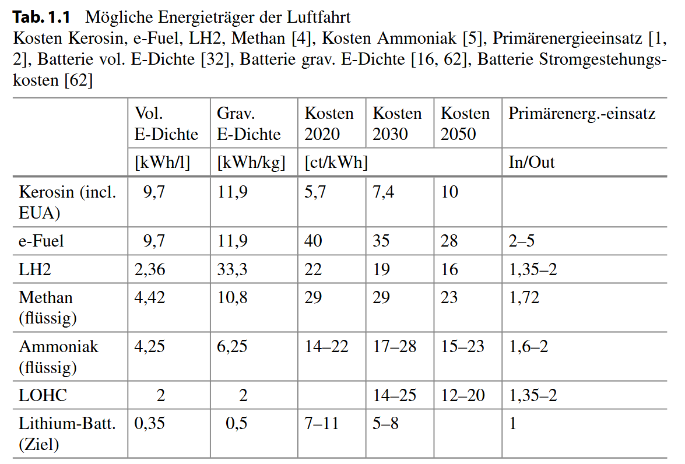
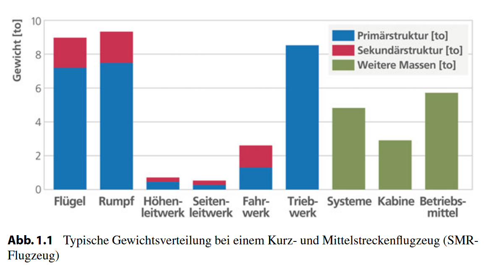

<!-- _class: lead -->

# Einführung


Prof. Dr.-Ing. Christian Willberg
Hochschule Magdeburg-Stendal


---

<!-- _class: lead -->

## Was ist ein Faserkunstoffverbund?

---

## Was ist ein Faserkunstoffverbund (FKV)

- Mehrphasen- oder Mischwerkstoff im Allgemeinen bestehend aus zwei Hauptkomponenten (Faser und Matrix)
- Der Gesamtwerkstoff hat höherwertige Eigenschaften als jede der beiden beteiligten Komponenten alleine
- Material und seine Eigenschaften entstehen in der Fertigung 

---


---

## Fokus von Industrien

- Luft- und Raumfahrt
  - Gutes Festigkeits/Steifigkeits – Gewichtsverhältnis
  - Schaden-, Korrosionsstoleranz 
  - Wartbarkeit / Reparierbarkeit
- Bauwesen
  - Widerstand gegen Umwelteinflüsse und Korrosion
  - Langlebigkeit

---

- Schifffahrt
  - Salzwasser
  - Schlagschäden
  - Lange Lebendauer
- Landtransportsysteme
  - Kosten
  - Einfache Fertigbarkeit
- Weitere Anwendungen
  - Dichtheit
  - …


---





<div style="position: absolute; bottom: 10px; left: 120px; color: black; font-size: 20px;"> 
    Bild aus M. Wiedemann "Systemleichtbau
für die Luftfahrt"
</div>

---


<div style="position: absolute; bottom: 10px; left: 120px; color: black; font-size: 20px;"> 
    Bild aus H. Schürrmann "Konstruieren mit Faser-Kunststoff-Verbunden"
</div>

---





<div style="position: absolute; bottom: 10px; left: 120px; color: black; font-size: 20px;"> 
    Bild aus M. Wiedemann "Systemleichtbau
für die Luftfahrt"
</div>

---


# Begriffe und Annahmen
## Wirkprinzip & Benennung

---


### Was ist ein Faser-Kunststoff-Verbund?

<!-- _class: cols-2 -->

<div class="ldiv">

**Wirkprinzip: Verbundkonstruktion**

Verschiedene Werkstoffe werden kombiniert, so dass Eigenschaften entstehen, die die Einzelkomponenten alleine **nicht erzielen könnten**.

- Englisch: **„composites"**
- FKV sind streng genommen **Konstruktionen**, keine reinen Werkstoffe

</div>
<div class="rdiv">

**Klare Aufgabenteilung**

| Komponente | Aufgabe |
|---|---|
| **Fasern** | Mechanische Lasten tragen |
| **Matrix** | Fasern fixieren & stützen |

</div>

---


## Komponenten von Faserkunstoffverbunde 

**Matrix – bindende Komponente**
Formgebend
Schutz und Stabilisierung der Fasern
Spannungen an die Fasern übertragen


---


## Komponenten von Faserkunstoffverbunde 

**Faser – verstärkende Komponente**
Lasttragend da hohe Steifigkeit und/oder Festigkeit bei geringem Gewicht
Begrenzte thermische Dehnung
Weitere Bestandteile (optional)
Faserbeschichtungen
Füllstoffe
Beimischung anderer Fasertypen


---


# Präzise Benennung

<!-- _class: cols-2 -->

<div class="ldiv">

### deutsch: FKV

**gleichberechtigte** Stellung beider Komponenten

| Ebene | Beispiel |
|---|---|
| Allgemein | Faser-Kunststoff-Verbund |
| Präzisiert | Glasfaser-Polyamid-Verbund |
| Abgekürzt | `GF-PA` · `CF-EP` |

</div>
<div class="rdiv">

### englisch: FRP 

„Faserverstärkter Kunststoff" (*fibre reinforced plastic*)

**Problem:** Betont nur die Verstärkungsrolle der Fasern — die Matrix wird degradiert.

→ Laut Schürrmann sollte diese Bezeichnung sollte **vermieden** werden.

</div>

---

# Wann spricht man von FKV?

| | Kurzfaser | FKV | Andere Faserverbunde |
|---|---|---|---|
| **Faserlänge** | ≈ 1–10 mm | **> 25 mm** (Endlos) | variabel |
| **Ausrichtung** | zufällig | präzise | präzise |
| **Beispiel** | Spritzguss-Kunststoff | CFK-Laminat | MMC, CMC |

> Faserverstärkte Metalle (**MMC**) und Keramiken (**CMC**) sind ebenfalls Faserverbunde — zur Vermeidung von Verwechslungen immer präzisieren.


---

# Aufgaben der Matrix

<!-- _class: cols-2 -->

<div class="ldiv">

**Die Matrix …**
- umgibt und bettet die Fasern ein
- fixiert Fasern in der vorgegebenen Position
- überträgt Schubkräfte zwischen den Fasern
- schützt Fasern vor Umwelteinflüssen

Bei FKV: Matrix = **Kunststoff**
(alternativ: Metall, Keramik, Glas, Beton …)

</div>
<div class="rdiv">

>  **Kritischer Punkt**
>
> Obwohl die Matrix unverzichtbar ist, stellt sie **häufig den Schwachpunkt** des Werkstoffs dar.

</div>

---

# Mehrschichten-Verbund (MSV)

<!-- _class: cols-2 -->

<div class="ldiv">

**Warum mehrere Schichten?**

Kräfte in der Bauteilebene wirken in **verschiedenen Richtungen und Beträgen**.

→ Fasern müssen mehrfach unterschiedlich ausgerichtet werden

→ Schichten **gestapelt und verklebt** = Laminat / MSV

</div>
<div class="rdiv">

**Begriffe im Überblick**

| Begriff | Hinweis |
|---|---|
| **Laminat** | umgangssprachlich, gebräuchlich |
| **MSV** | mechanisch korrekter Terminus |
| **Lamina / Ply** | Einzelschicht |
| **UD-Schicht** | häufigster Schichttyp |

</div>

---

# Die UD-Schicht — Grundelement des MSV

<!-- _class: cols-2 -->

<div class="ldiv">

**Idealisierende Annahmen:**

- Fasern verlaufen **parallel in einer Richtung**
- Fasern gleichmäßig verteilt (**Faserpackung**)
- Fasern **ideal gerade**, ohne Unterbrechung
- **Ideale Haftung** Faser ↔ Matrix
  (keine Relativverschiebungen an der Grenzfläche)

</div>
<div class="rdiv">


</div>

<div style="position: absolute; bottom: 10px; left: 120px; color: black; font-size: 20px;"> 
    Bild aus H. Schürrmann "Konstruieren mit Faser-Kunststoff-Verbunden"
</div>


---

# MSV ≠ nur UD-Schichten

<!-- _class: cols-2 -->

<div class="ldiv">

**Weitere Halbzeugformen:**

- **Gewebe** — zwei Faserrichtungen (0°/90°), mechanisch als zwei UD-Schichten zu behandeln
- **Gelege**, **Geflechte**, **NCF** …

**Bekannte MSV-Beispiele außerhalb FKV:**
- Furnierplatten (Holzschichten)
- **Glare®** (Al-Bleche + GF-UD-Schichten)
- **Sandwich** (Kernverbund)

</div>
<div class="rdiv">

> **Präzisierung nötig!**
>
> „Schicht" kann bedeuten:
> - Fertigungsschicht (Textilbahn im Ablegen)
> - UD-Schicht (mechanische Betrachtung)
>
> → Immer **Faserorientierung angeben**

</div>

---

# Designvariablen eines Laminats

<!-- _class: cols-2 -->

<div class="ldiv">

Im Gegensatz zu Stahl/Aluminium hat der FKV-Konstrukteur **mehr Freiheitsgrade:**

1. Anzahl der Schichten
2. Faser- und Matrixanteil je Schicht
3. **Faserrichtungen** der Einzelschichten
4. Dicken der Einzelschichten
5. **Schichtreihenfolge**

</div>
<div class="rdiv">

**Rechnerische vs. experimentelle Methode**

| | Experiment | Rechnung |
|---|---|---|
| Aufwand | hoch | gering |
| Varianten | ❌ | ✅ |
| Optimierung | ❌ | ✅ |

→ Rechnerische Methode ist der **Standardweg**

</div>

---

# Schichtenweise Vorgehensweise

<!-- _class: cols-2 -->

<div class="ldiv">

Alle vier Analyseschritte folgen demselben Prinzip:
```
Einzelschicht (Werkstoffdaten)
        ↓
MSV-Werkstoffgesetz
        ↓
Spannungs- & Verformungsanalyse
        ↓
Festigkeitsanalyse (Schicht für Schicht)
        ↓
Degradationsanalyse (sukzessiv)
```

</div>
<div class="rdiv">

| Analyseschritt | Skala |
|---|---|
| Werkstoffgesetz | Schicht → MSV |
| Spannungsanalyse | Laminat + Einzelschichten |
| Festigkeitsanalyse | jede Schicht einzeln |
| Degradationsanalyse | sukzessiv, schichtenweise |

</div>

---

# Mikro- vs. Makromechanik

<!-- _class: cols-2 -->

<div class="ldiv">

### Mikromechanik

- Betrachtung auf **Faser/Matrix-Ebene**
- Beanspruchungen von Einzelfasern, Matrix, Grenzflächen
- Werkstoffgesetz der UD-Schicht aus Komponenten berechnen
- Einflussparameter studieren
- Eher **werkstoffkundlich** relevant

</div>
<div class="rdiv">

### Makromechanik

- Kleinste Einheit: **Einzelschicht**
- Spannungen des Laminats und der Schichten
- UD-Schicht = **homogenes Kontinuum**
- Eher **konstruktiv** relevant

</div>

---


# Schlüsselbegriffe der Werkstoffmechanik

| Begriff | Definition | FKV-Bezug |
|---|---|---|
| **Kontinuum** | Lückenloses, kontinuierlich deformierbares Medium | Voraussetzung für mathematische Beschreibung |
| **Homogenität** | Eigenschaften ortsunabhängig im gesamten Körper | Makro: Fasern als „verschmiert" gedacht |
| **Isotropie** | Eigenschaften **richtungsunabhängig** | Sonderfall — bei FKV i. d. R. **nicht** erfüllt |
| **Anisotropie** | Eigenschaften **richtungsabhängig** | Normalfall bei UD-Schichten und Laminaten |

---

# Isotropie vs. Anisotropie


| Eigenschaft | Stahl / Al | UD-Schicht |
|---|---|---|
| Richtungsabhängigkeit | nein | **ja** |
| Steifigkeit | gleichmäßig | max. in Faserrichtung |
| Festigkeit | gleichmäßig | stark richtungsabhängig |
| Wärmeausdehnung | gleichmäßig | richtungsabhängig |

---

> **Isotropie ist ein Sonderfall.**

Eine UD-Schicht ist **transversal isotrop:**

- In Faserrichtung: ausgeprägte Richtungsabhängigkeit
- Senkrecht zur Faserrichtung: **isotrop in dieser Ebene**
- → Symmetrieebenen vorhanden

---


# Wichtige Kenngrößen


---

## Relativer Faservolumenanteil ϕ


<!-- _class: cols-2 -->

<div class="ldiv">

Der **relative Faservolumenanteil ϕ** ist der wichtigste vom Konstrukteur einstellbare Parameter:

- beeinflusst Steifigkeit, Festigkeit, Wärmeausdehnung, Feuchteaufnahme, Langzeitverhalten
- findet sich in **allen grundlegenden Berechnungsformeln**
- ist die wichtigste Größe bei **Qualitätskontrollen**
- muss bei experimentellen Ergebnissen **immer mit angegeben** werden

</div>
<div class="rdiv">

> **FKV-Dimensionierung ≠ Metallbau**
>
> Der Konstrukteur dimensioniert primär **Fasermengen** — nicht Wanddicken.
> Wanddicken sind sekundär und folgen erst aus Fasermengen + ϕ.

**Definition:**

$$\varphi = \frac{V_f}{V_\text{Verbund}} = \frac{A_f}{A_\text{Verbund}} = \frac{t_f}{t_\text{Verbund}}$$

</div>

---

# Typische Werte von ϕ

<!-- _class: cols-2 -->

<div class="ldiv">

| Fertigungsverfahren | ϕ |
|---|---|
| Prepreg / Wickelverfahren | **≈ 0.60** (Standard) |
| Handlaminat (Gewebe) | ≈ 0.40 |
| Obergrenze | **≈ 0.65** |

> **Obergrenze ≈ 0.65-0.7:**
> Darüber werden Fasern nicht mehr vollständig von der Matrix benetzt → Laminat zu „trocken"

</div>
<div class="rdiv">

**Vorgehen beim Laminatentwurf:**

1. Fertigungsverfahren wählen
2. ϕ aus Verfahren ableiten
3. Steifigkeits- und Festigkeitsrechnung durchführen → Wanddicken ermitteln
4. Aus Wanddicke + ϕ → **Fasermenge** (Rovinganzahl / Gewebelagen) berechnen

</div>

---

# Bestimmung von ϕ — Methoden

<!-- _class: cols-2 -->

<div class="ldiv">

**Rechnerisch / konstruktiv**
- Vorgabe durch Konstrukteur (Arbeitsanweisung)
- Rückrechnung aus Laminatdicke und Halbzeugkennwerten

**Experimentell (zuverlässigste Methode)**
- Trennung von Faser und Matrix am ausgehärteten Laminat
- Probenentnahme aus festigkeitsrelevantem Bereich

</div>
<div class="rdiv">

| Fasersystem | Methode |
|---|---|
| **GF** | Glühverlust im Muffelofen |
| **CF** | Glühverlust (bedingt) oder Säureextraktion (H₂SO₄ + H₂O₂) |
| **AF** | Nur Säureextraktion (HNO₃) — Fasern würden verbrennen |


</div>


---

# Von ϕ zu ψ — Volumen- und Massenanteil

<!-- _class: cols-2 -->

<div class="ldiv">

Messung liefert zunächst den **Massenanteil ψ**:

$$\psi = \frac{m_f}{m_\text{Verbund}}$$

Umrechnung auf Volumenanteil ϕ über Dichten:

$$\varphi = \frac{1}{\dfrac{1}{\psi} + \dfrac{\rho_f}{\rho_m}\left(\dfrac{1}{\psi}-1\right) \cdot \dfrac{1}{1}}$$

→ Dichten ρf, ρm aus Datenblättern

</div>
<div class="rdiv">

> ⚠️ **ϕ ≠ ψ !**
>
> Der Zusammenhang ist **nichtlinear** und materialabhängig.
>
> Beispiel bei ϕ = 0,60 (EP-Harz, ρm = 1,2 g/cm³):
>
> | Faser | ψ |
> |---|---|
> | GF (ρf ≈ 2,54) | ≈ 0,72 |
> | CF (ρf ≈ 1,76) | ≈ 0,64 |
> | AF (ρf ≈ 1,44) | ≈ 0,58 |

</div>

---


<div style="position: absolute; bottom: 50px; left: 320px; color: black; font-size: 28px;"> 
    Rovingquerschnitte in Abhängigkeit von der Strangfeinheit
</div>


<div style="position: absolute; bottom: 10px; left: 120px; color: black; font-size: 20px;"> 
    Bild aus H. Schürrmann "Konstruieren mit Faser-Kunststoff-Verbunden"
</div>


---

# Dichte des Verbunds

<!-- _class: cols-2 -->

<div class="ldiv">

Mischungsregel (allgemein für n Komponenten):

$$\rho_\text{ges} = \sum_{i=1}^{n} \varphi_i \cdot \rho_i$$

Für das Zweistoffsystem Faser + Matrix:

$$\rho_\text{Verbund} = \varphi \cdot \rho_f + (1-\varphi) \cdot \rho_m$$

</div>
<div class="rdiv">

**Typische Dichten** (g/cm³)

| Werkstoff | ρ |
|---|---|
| E-Glasfaser | 2,54 |
| Kohlenstofffaser | 1,76 |
| Aramidfaser | 1,44 |
| Epoxidharz | 1,20 |
| **GF-EP (ϕ=0,6)** | **≈ 2,0** |
| **CF-EP (ϕ=0,6)** | **≈ 1,5** |

</div>

---

# Schichtdicken und Fasermengen

<!-- _class: cols-2 -->

<div class="ldiv">

**Roving-Schicht** (Feinheit mf/L in tex = g/km):

$$t = \frac{1}{b} \cdot \frac{m_f/L}{\rho_f \cdot \varphi}$$

Benötigte **Rovinganzahl** für Sollquerschnitt A:

$$n = \frac{A_\text{soll} \cdot \rho_f \cdot \varphi}{m_f/L}$$

</div>
<div class="rdiv">

**Gewebe-/Gelegeschicht** (Flächengewicht mf/(L·b) in g/m²):

$$t = \frac{1}{\varphi} \cdot \frac{m_f/(L \cdot b)}{\rho_f}$$

Benötigte **Lagenanzahl** für Sollwanddicke t:

$$n = t_\text{soll} \cdot \varphi \cdot \frac{\rho_f}{m_f/(L \cdot b)}$$

> Merkhilfe: CF 12k ≈ GF 1200 tex — gleicher Rovingquerschnitt!

</div>

---


# Matrixmenge und Mischpreis

<!-- _class: cols-2 -->

<div class="ldiv">

**Benötigte Matrixmasse** aus Fasermasse mf und ϕ:

$$m_m = m_f \cdot \frac{\rho_m (1-\varphi)}{\rho_f \cdot \varphi}$$

→ wird der Fertigung als **Arbeitsanweisung** übergeben, damit ϕ im Mittel eingehalten wird

</div>
<div class="rdiv">

**Mischpreis** (Verbundkosten pro Masseeinheit):

$$\text{Mischpreis} = \psi \cdot p_f + (1-\psi) \cdot p_m$$

| Größe | Bedeutung |
|---|---|
| ψ | rel. Fasermassenanteil |
| pf | Faserhalbzeugpreis / Masse |
| pm | Matrixpreis / Masse |

→ Basis für **Werkstoffvergleiche** und Kalkulationen

</div>

---

## Danke für die Aufmerksamkeit