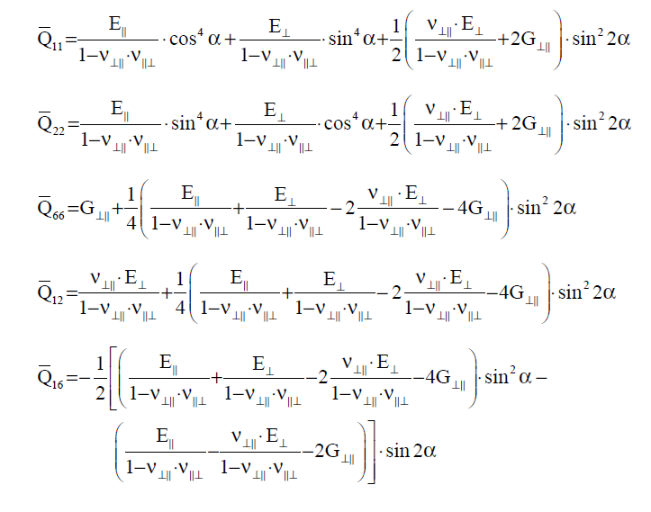
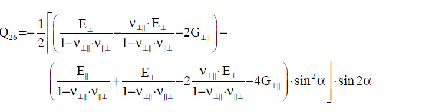

<!-- _class: lead -->

# Materialtheorie für Faserverbundleichtbau

## Teil 1: Grundlagen der Kontinuumsmechanik

Prof. Dr.-Ing. Christian Willberg
Hochschule Magdeburg-Stendal

---

<!-- _class: lead -->

# 1. Kinematik

---

## Konfigurationen

**Bewegung:**
$$\mathbf{x} = \boldsymbol{\varphi}(\mathbf{X}, t)$$

**Verschiebung:**
$$\mathbf{u}(\mathbf{X}, t) = \mathbf{x} - \mathbf{X}$$

---

## Deformationsgradient

**Definition:**
$$\mathbf{F} = \frac{\partial \mathbf{x}}{\partial \mathbf{X}} = \text{Grad}\, \boldsymbol{\varphi}$$

**Komponentenschreibweise:**
$$F_{ij} = \frac{\partial x_i}{\partial X_j}$$

**Physikalische Bedeutung:**
- Transformation materieller Linienelemente
$$d\mathbf{x} = \mathbf{F} \cdot d\mathbf{X}$$

---

## Eigenschaften des Deformationsgradienten

**Jacobi-Determinante:**
$$J = \det(\mathbf{F}) > 0$$

- $J > 0$: Impenetrabilität (Materie kann sich nicht durchdringen)
- $J = 1$: isochore (volumentreue) Deformation
- $J < 1$: Kompression
- $J > 1$: Dilatation

---

<!-- _class: lead -->

# 2. Polare Zerlegung

---

## Polare Zerlegung des Deformationsgradienten

Der Deformationsgradient lässt sich eindeutig zerlegen:

$$\mathbf{F} = \mathbf{R} \cdot \mathbf{U} = \mathbf{V} \cdot \mathbf{R}$$

mit:
- $\mathbf{R}$: orthogonaler Rotationstensor ($\mathbf{R}^T \mathbf{R} = \mathbf{I}$, $\det \mathbf{R} = +1$)
- $\mathbf{U}$: rechter Strecktensor (symmetrisch, positiv definit)
- $\mathbf{V}$: linker Strecktensor (symmetrisch, positiv definit)

---

<!-- _class: lead -->

# 3. Verzerrungsmaße

---

## Green-Lagrange Verzerrungstensor

**Definition:**
$$\mathbf{E} =  \frac{1}{2}(\mathbf{F}^T \mathbf{F} - \mathbf{I})$$

**Eigenschaften:**
- Materielle (Lagrange'sche) Beschreibung
- Symmetrisch
- Verschwindet bei starrer Rotation
- Geeignet für große Deformationen

---

## Infinitesimale Verzerrungen

Für **kleine Verschiebungsgradienten** $\|\nabla \mathbf{u}\| \ll 1$:

$$\boldsymbol{\varepsilon} = \frac{1}{2}( \mathbf{F} + \mathbf{F})^T \approx \mathbf{E} \approx \mathbf{e}$$

**Komponenten:**
$$\varepsilon_{ij} = \frac{1}{2}\left(\frac{\partial u_i}{\partial x_j} + \frac{\partial u_j}{\partial x_i}\right)$$

**Technische Dehnungen:**
- Normaldehnungen: $\varepsilon_{11}, \varepsilon_{22}, \varepsilon_{33}$
- Schubverzerrungen: $\gamma_{12} = 2\varepsilon_{12}, \gamma_{13} = 2\varepsilon_{13}, \gamma_{23} = 2\varepsilon_{23}$

---

<!-- _class: lead -->

# 4. Spannungsmaße

---

## Cauchy-Spannungstensor

**Definition:**
$$\boldsymbol{\sigma} = \boldsymbol{\sigma}(\mathbf{x}, t)$$

**Eigenschaften:**
- "Wahre" Spannung
- Kraft pro deformierter Fläche
- Räumliche Beschreibung
- Symmetrisch: $\boldsymbol{\sigma} = \boldsymbol{\sigma}^T$ (ohne Momentenspannungen)

**Spannungsvektor:**
$$\mathbf{t}^{(\mathbf{n})} = \boldsymbol{\sigma} \cdot \mathbf{n}$$

mit Normalenvektor $\mathbf{n}$ auf deformierter Fläche

---

<!-- _class: lead -->

# 5. Konstitutivgleichungen

---

## Linearisierung elastisch: Hooke'sches Gesetz

$$\boldsymbol{\sigma} = \mathbb{C} : \boldsymbol{\varepsilon}$$

$$\sigma_{ij}=C_{ijkl}\varepsilon_{kl}$$

---

## Cauchy-Spannungstensor (3×3 Matrix)

**Symmetrischer Spannungstensor:**

$$\boldsymbol{\sigma} = \begin{bmatrix}
\sigma_{11} & \sigma_{12} & \sigma_{13} \\
\sigma_{21} & \sigma_{22} & \sigma_{23} \\
\sigma_{31} & \sigma_{32} & \sigma_{33}
\end{bmatrix}$$

**Symmetrie:** $\sigma_{ij} = \sigma_{ji}$

$$\boldsymbol{\sigma} = \begin{bmatrix}
\sigma_{11} & \sigma_{12} & \sigma_{13} \\
\sigma_{12} & \sigma_{22} & \sigma_{23} \\
\sigma_{13} & \sigma_{23} & \sigma_{33}
\end{bmatrix}$$

→ **6 unabhängige Komponenten**

---

## Voigt-Notation (6×1 Vektor)

**Standard-Konvention:**

$$\begin{Bmatrix} \sigma \end{Bmatrix} = \begin{Bmatrix}
\sigma_{11} \\
\sigma_{22} \\
\sigma_{33} \\
\sigma_{23} \\
\sigma_{13} \\
\sigma_{12}
\end{Bmatrix} = \begin{Bmatrix}
\sigma_1 \\
\sigma_2 \\
\sigma_3 \\
\sigma_4 \\
\sigma_5 \\
\sigma_6
\end{Bmatrix}$$

---

**Alternative Notation (Ingenieurspraxis):**

$$\begin{Bmatrix} \sigma \end{Bmatrix} = \begin{Bmatrix}
\sigma_x \\
\sigma_y \\
\sigma_z \\
\tau_{yz} \\
\tau_{xz} \\
\tau_{xy}
\end{Bmatrix}$$

---

## Index-Mapping

**Tensor-Indizes (ij) → Voigt-Index (α):**

| Tensor $(i,j)$ | Voigt $\alpha$ | Komponente |
|----------------|----------------|------------|
| $(1,1)$ | 1 | $\sigma_{11}$ |
| $(2,2)$ | 2 | $\sigma_{22}$ |
| $(3,3)$ | 3 | $\sigma_{33}$ |
| $(2,3)$ oder $(3,2)$ | 4 | $\sigma_{23}$ |
| $(1,3)$ oder $(3,1)$ | 5 | $\sigma_{13}$ |
| $(1,2)$ oder $(2,1)$ | 6 | $\sigma_{12}$ |

---

**Ingenieur-Schubverzerrung:**
$$\gamma_{ij} = 2\varepsilon_{ij} \quad \text{für } i \neq j$$

**Grund:** $\gamma_{ij}$ misst die Änderung des rechten Winkels, während $\varepsilon_{ij}$ der Tensoranteil ist.

---

## Verzerrungen in Voigt-Notation

**Tensor-Komponenten:**
$$\boldsymbol{\varepsilon} = \begin{bmatrix}
\varepsilon_{11} & \varepsilon_{12} & \varepsilon_{13} \\
\varepsilon_{12} & \varepsilon_{22} & \varepsilon_{23} \\
\varepsilon_{13} & \varepsilon_{23} & \varepsilon_{33}
\end{bmatrix}$$

**Voigt-Form:**
$$\begin{Bmatrix} \varepsilon \end{Bmatrix} = \begin{Bmatrix}
\varepsilon_{11} \\
\varepsilon_{22} \\
\varepsilon_{33} \\
\gamma_{23} \\
\gamma_{13} \\
\gamma_{12}
\end{Bmatrix} = \begin{Bmatrix}
\varepsilon_{11} \\
\varepsilon_{22} \\
\varepsilon_{33} \\
2\varepsilon_{23} \\
2\varepsilon_{13} \\
2\varepsilon_{12}
\end{Bmatrix}$$

--

<!-- _class: lead -->

# 6. Anisotropie bei Faserverbunden

---

## Transversale Isotropie

**Unidirektionaler Faserverbund:**
- Eine Vorzugsrichtung: Faserrichtung $\mathbf{a}_0$
- Isotropie in der Querebene

## Orthotropie

**Unidirektionaler Faserverbund:**
- Eine Vorzugsrichtung: Faserrichtung $\mathbf{a}_0$
- Anisotropie in der Querebene

---
$$[C]_{6×6} = \begin{bmatrix}
C_{1111} & C_{1122} & C_{1133} & C_{1123} & C_{1113} & C_{1112} \\
C_{2211} & C_{2222} & C_{2233} & C_{2223} & C_{2213} & C_{2212} \\
C_{3311} & C_{3322} & C_{3333} & C_{3323} & C_{3313} & C_{3312} \\
C_{2311} & C_{2322} & C_{2333} & C_{2323} & C_{2313} & C_{2312} \\
C_{1311} & C_{1322} & C_{1333} & C_{1323} & C_{1313} & C_{1312} \\
C_{1211} & C_{1222} & C_{1233} & C_{1223} & C_{1213} & C_{1212}
\end{bmatrix}$$

---

## Verallgemeinertes Hooke'sches Gesetz

**Für orthotrope Materialien:**
$$\boldsymbol{\sigma} = \mathbb{C} : \boldsymbol{\varepsilon}$$

mit **21 unabhängigen Komponenten** für $\mathbb{C}$
**Bei transversaler Isotropie: 4 unabhängige Konstanten**

**Bei Orthotropie: 9 unabhängige Konstanten**

---

## Nachgiebigkeitstensor - Voigt-Notation

$$\begin{bmatrix}
\varepsilon_{11} \\
\varepsilon_{22} \\
\varepsilon_{33} \\
\gamma_{23} \\
\gamma_{13} \\
\gamma_{12}
\end{bmatrix} = 
\begin{bmatrix}
\frac{1}{E_1} & -\frac{\nu_{21}}{E_2} & -\frac{\nu_{31}}{E_3} & 0 & 0 & 0 \\
-\frac{\nu_{12}}{E_1} & \frac{1}{E_2} & -\frac{\nu_{32}}{E_3} & 0 & 0 & 0 \\
-\frac{\nu_{13}}{E_1} & -\frac{\nu_{23}}{E_2} & \frac{1}{E_3} & 0 & 0 & 0 \\
0 & 0 & 0 & \frac{1}{G_{23}} & 0 & 0 \\
0 & 0 & 0 & 0 & \frac{1}{G_{13}} & 0 \\
0 & 0 & 0 & 0 & 0 & \frac{1}{G_{12}}
\end{bmatrix}
\begin{bmatrix}
\sigma_{11} \\
\sigma_{22} \\
\sigma_{33} \\
\sigma_{23} \\
\sigma_{13} \\
\sigma_{12}
\end{bmatrix}$$

---

## Materialkonstanten für Orthotropie

**9 unabhängige Konstanten:**

1. $E_1, E_2, E_3$: Elastizitätsmoduln in Hauptrichtungen
2. $G_{12}, G_{13}, G_{23}$: Schubmoduln
3. $\nu_{12}, \nu_{13}, \nu_{23}$: Querkontraktionszahlen

**Symmetriebedingungen:**
$$\frac{\nu_{ij}}{E_i} = \frac{\nu_{ji}}{E_j}$$

daher: $\nu_{21} = \frac{E_2}{E_1}\nu_{12}$, etc.

---

## Steifigkeitstensor

$$\begin{bmatrix}
\sigma_{11} \\
\sigma_{22} \\
\sigma_{33} \\
\sigma_{23} \\
\sigma_{13} \\
\sigma_{12}
\end{bmatrix} = 
\begin{bmatrix}
C_{11} & C_{12} & C_{13} & 0 & 0 & 0 \\
C_{12} & C_{22} & C_{23} & 0 & 0 & 0 \\
C_{13} & C_{23} & C_{33} & 0 & 0 & 0 \\
0 & 0 & 0 & C_{44} & 0 & 0 \\
0 & 0 & 0 & 0 & C_{55} & 0 \\
0 & 0 & 0 & 0 & 0 & C_{66}
\end{bmatrix}
\begin{bmatrix}
\varepsilon_{11} \\
\varepsilon_{22} \\
\varepsilon_{33} \\
\gamma_{23} \\
\gamma_{13} \\
\gamma_{12}
\end{bmatrix}$$

mit $C_{44} = G_{23}$, $C_{55} = G_{13}$, $C_{66} = G_{12}$

---

## Transversal-isotrope Materialien

**Spezialfall:** Isotropie in der 2-3-Ebene

**5 unabhängige Konstanten:**
- $E_1, E_2 = E_3$: E-Moduln (längs/quer)
- $G_{12} = G_{13}$: Schubmodul
- $\nu_{12} = \nu_{13}$: Querkontraktionszahl
- $\nu_{23}$: Querkontraktionszahl in Querebene

**Zusätzlich:**
$$G_{23} = \frac{E_2}{2(1+\nu_{23})}$$

---

## Ebener Spannungszustand (ESZ)

**Annahme:** $\sigma_{33} = \sigma_{23} = \sigma_{13} = 0$

**Reduzierte Beziehung:**
$$\begin{bmatrix}
\sigma_{11} \\
\sigma_{22} \\
\sigma_{12}
\end{bmatrix} = 
\begin{bmatrix}
Q_{11} & Q_{12} & 0 \\
Q_{12} & Q_{22} & 0 \\
0 & 0 & Q_{66}
\end{bmatrix}
\begin{bmatrix}
\varepsilon_{11} \\
\varepsilon_{22} \\
\gamma_{12}
\end{bmatrix}$$

**Reduzierte Steifigkeiten:**
$$Q_{11} = \frac{E_1}{1-\nu_{12}\nu_{21}}, \quad Q_{22} = \frac{E_2}{1-\nu_{12}\nu_{21}}$$
$$Q_{12} = \frac{\nu_{12}E_2}{1-\nu_{12}\nu_{21}}, \quad Q_{66} = G_{12}$$

---

<!-- _class: lead -->

# 8. Koordinatentransformation

---

## Transformation der Steifigkeitsmatrix

**Lokales Koordinatensystem** (1-2-3): Faserrichtung

**Globales Koordinatensystem** (x-y-z): Bauteilkoordinaten

**Orientierungswinkel** $\theta$ zwischen 1-Achse und x-Achse

**Transformationsmatrix:**
$$[T] = \begin{bmatrix}
\cos^2\theta & \sin^2\theta & 2\sin\theta\cos\theta \\
\sin^2\theta & \cos^2\theta & -2\sin\theta\cos\theta \\
-\sin\theta\cos\theta & \sin\theta\cos\theta & \cos^2\theta - \sin^2\theta
\end{bmatrix}$$

---

## Transformierte Steifigkeiten

**Transformation:**
$$[\bar{Q}] = [T]^{-1} [Q] [T]^{-T}$$

**Resultat (off-axis):**
$$\bar{Q}_{11} = Q_{11}\cos^4\theta + 2(Q_{12}+2Q_{66})\sin^2\theta\cos^2\theta + Q_{22}\sin^4\theta$$
$$\bar{Q}_{12} = (Q_{11}+Q_{22}-4Q_{66})\sin^2\theta\cos^2\theta + Q_{12}(\sin^4\theta+\cos^4\theta)$$
$$\bar{Q}_{22} = Q_{11}\sin^4\theta + 2(Q_{12}+2Q_{66})\sin^2\theta\cos^2\theta + Q_{22}\cos^4\theta$$
$$\bar{Q}_{16} = (Q_{11}-Q_{12}-2Q_{66})\sin\theta\cos^3\theta + (Q_{12}-Q_{22}+2Q_{66})\sin^3\theta\cos\theta$$
$$\bar{Q}_{26} = (Q_{11}-Q_{12}-2Q_{66})\sin^3\theta\cos\theta + (Q_{12}-Q_{22}+2Q_{66})\sin\theta\cos^3\theta$$
$$\bar{Q}_{66} = (Q_{11}+Q_{22}-2Q_{12}-2Q_{66})\sin^2\theta\cos^2\theta + Q_{66}(\sin^4\theta+\cos^4\theta)$$

---

## Gekoppelte Matrix

Für **beliebigen Winkel** $\theta \neq 0°, 90°$:

$$[\bar{Q}] = \begin{bmatrix}
\bar{Q}_{11} & \bar{Q}_{12} & \bar{Q}_{16} \\
\bar{Q}_{12} & \bar{Q}_{22} & \bar{Q}_{26} \\
\bar{Q}_{16} & \bar{Q}_{26} & \bar{Q}_{66}
\end{bmatrix}$$

**Kopplung:**
- $\bar{Q}_{16}, \bar{Q}_{26} \neq 0$: Kopplung Normal-Schub
- Normalspannungen erzeugen Schubverzerrungen und umgekehrt

---

# Rotation
- Transformation ist nicht mittels der Rotationsmatrix direkt möglich
- Voigt Matrix hat keine orthonormale Basis
- 2 Wege
  - Transformation über den Steifikeitstensor
  - Transpormation über Spannungen und Dehnungen

---

- Nach der Rotation des Dehnungstensors (2x2) wird dann die Voigtform für die Multiplikation genutzt

$\mathbf{\sigma}'= \mathbf{C}\mathbf{R} \mathbf{\varepsilon} \mathbf{R}^T$

$\mathbf{\sigma}=\mathbf{R}^T \mathbf{\sigma}' \mathbf{R}$

-> wird in FEM angewandt

---

## Klassische Laminattheorie

- Einzelschichten ist ideal linear elastisch
- Das Laminat ist dünn (Dicke $t$ ist klein gegenüber den restlichen Abmessungen)
- Die Laminatdicke $t$ ist konstant
- Die Theorie I. Ordnung ist gültig (kleine Verformungen)
- Die Bernoullische Annahmen sind gültig (ebene Querschnitte, schubstarr in Dickenrichtung)
- Der Spannungszustand ist aufgrund der Dünnwandigkeit eben $σ_3 = τ_{13} = τ_{23} = 0$
- Die Schichten sind ideal miteinander verklebt.
- Das Laminat liegt in der 1 , 2 -Ebene.

---

$\mathbf{Q}=\mathbf{C}_{Voigt}^{2D}$

$\mathbf{\sigma}= \mathbf{Q} \mathbf{\varepsilon}=
\begin{bmatrix}Q_{11}  & Q_{12} & Q_{16}\\
Q_{12}  & Q_{22} & Q_{26}\\
Q_{16}  & Q_{26} & Q_{66}
\end{bmatrix}\begin{bmatrix}
\varepsilon_1 \\
\varepsilon_2 \\
\gamma_{12}
\end{bmatrix}$

$\mathbf{Q}^{0°}=\begin{bmatrix}
\frac{E_1}{1-\nu_{12}\nu_{21}} & \frac{\nu_{21}E_1}{1-\nu_{12}\nu_{21}} & 0 \\
\frac{\nu_{12}E_2}{1-\nu_{12}\nu_{21}} & \frac{E_2}{1-\nu_{12}\nu_{21}} & 0 \\
0 & 0 & G_{12}
\end{bmatrix}$

---
## Rotierte Matrixeinträge nach Schürmann

---

---

$A_{ij} = \sum_{k=1}^{N} \hat Q_{ij,k} \cdot t_k$

---

$D_{ij} = \sum_{k=1}^{N} \hat Q_{ij,k} \cdot \left(   \underbrace{\frac {t^3_{k}} {12}}_\text{Biegesteifigkeit}  + t_k \underbrace{ \left( z_k-\frac {t_k} {2} \right)^2}_\text{Steiner Anteil} \right)$

---

$B_{ij} = -\sum_{k=1}^{N} \hat Q_{ij,k} \cdot t_k \cdot \underbrace{  \left(  z_k - \frac{t_{k}}{2}   \right)}_\text{stat. Moment}$

---

$
\begin{bmatrix} 
\mathbf{N}\\
\mathbf{M}
\end{bmatrix}=
\begin{bmatrix}
\mathbf{A} & \mathbf{B} \\
\mathbf{B} & \mathbf{D}
\end{bmatrix}\begin{bmatrix} 
\boldsymbol{\varepsilon}\\
\boldsymbol{\kappa}
\end{bmatrix}$

## Grenzen
- durch Kirchhoffsche Schalentheorie gegeben (Dünnwandigkeit)