<!-- _class: lead -->

# Ausgangsmaterial: Fasern

Prof. Dr.-Ing. Christian Willberg
Hochschule Magdeburg-Stendal

---

<!-- _class: lead -->

# Agenda

1. Wirksamkeit der Faserform
2. Hauptfasertypen (Glas, Kohlenstoff, Aramid)
3. Weitere Fasertypen
4. Faser-Matrix-Grenzfläche
5. Faser-Halbzeuge
6. Faserauswahl und Verarbeitung

---

# Aufgabenteilung im Verbund

- ### Fasern: Lastaufnahme
  - Hohe Steifigkeit und Festigkeit erforderlich
  - Starke atomare Bindungen
  - Geringe Dichte gewünscht

- ### Elemente: B, C, Si (erste Reihen des Periodensystems)

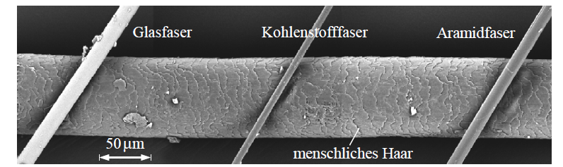

 
    Bild aus H. Schürrmann "Konstruieren mit Faser-Kunststoff-Verbunden"

---

# Ziel

## Theoretische Festigkeiten in Werkstoff umsetzen
- beeinflusst durch 
    - Größe
    - Orientierung
    - Kerben- und Fehlstellen
    - Eigenspannungen
    - Querschnittsform

---

# Größeneffekt 
- Faserdurchmesser beeinflussen die erreichbaren Festigkeiten

**Vorteile kleiner Faservolumina:**
- Weniger Fehlstellen
- Kleinere Defekte → reduzierte Wirksamkeit
- Besonders wichtig bei spröden Werkstoffen

 
    Bild aus H. Schürrmann "Konstruieren mit Faser-Kunststoff-Verbunden" für Glasfasern

---

- im Grenzfall $d_f\rightarrow 0$ besteht die Faser nur aus einer Molekülkette
- Festigkeit ist vollständig durch Primärbindungen bestimmt (deutlich höhere Bindungskräfte und Bindungsenergien im Vergleich zu Sekundärbindungen)
- Kerben- und Fehlstellen können nicht existieren

**Fertigungsvorteil:**
- Niedrige Biegesteifigkeit bei kleinem Durchmesser
- Einfaches Verweben und Drapieren

---

# Orientierung

- Ziehen, Spinnen, Verstrecken sorgen für gesteigerte Festigkeiten und Steifigkeiten
- Orientierung stärkster atomarer Bindungen in Faserlängsrichtung

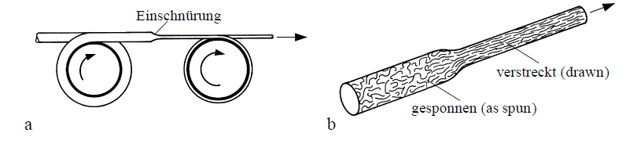

 
    Bild aus H. Schürrmann "Konstruieren mit Faser-Kunststoff-Verbunden" 

---

**Bei kristallinen Werkstoffen:**
- Kristallebenen ausgerichtet

**Bei Polymeren:**
- Molekülketten orientiert
- Kristallinitätsgrad nimmt zu

**Nachteil:** Anisotropes Verhalten
- Reduzierte Eigenschaften quer zur Faser

---

# Verminderung von Fehlstellen und Kerben

<!-- _class: cols-2 -->

### Problem:
- Fehlstellen statistisch verteilt und orientiert
- Kerbwirkung kritischer als Querschnittsreduktion
- Scharfe Kerben reduzieren Festigkeit signifikant

### Lösung durch Faserform:
- Ausrichtung der Fehlstellen in Faserlängsrichtung
- Längung und Abplattung der Defekte
- Reduzierte Spannungsüberhöhung

---

# Oberflächendefekte

**Oberflächenkerben:**
- Besonders kritisch bei Biegung
- Höchste Beanspruchung an Oberfläche

**Spinnen als Vorteil:**
- Längs- statt Querriefen
- Prozessbedingte Orientierung günstig

---

**Nachbehandlung:**
- Chemisches Ätzen entfernt Oberflächenkerben
- Ausrundung scharfer Kerbgründe
- Deutliche Festigkeitssteigerung bei C-Fasern

**Wichtig:** Schutz vor Beschädigung bei Verarbeitung!

---

# Eigenspannungen

**Bei Glasfasern (vermutet):**

Schmelzespinnen:
1. Oberfläche kühlt zuerst ab
2. Kern kühlt später und schrumpft
3. Druckeigenspannungen an Oberfläche

**Vorteile:**
- Schlechte Wärmeleitfähigkeit begünstigt Effekt
- Druckeigenspannungen kompensieren äußere Zugspannungen
- Reduzierter Einfluss von Beschädigungen und Kerben

---

# Versagensfortschritt

**Kompakter Werkstoff:**
- Risse wachsen ungehindert
- Schlagartiges Versagen (z.B. Glasscheibe)

**Faserverbund:**
- Riss wird an Fasergrenze gestoppt
- Lastumverteilung auf Nachbarfasern
- Verlangsamter Rissfortschritt

---

**Einflussfaktoren:**
- Großer Faserabstand (nicht zu hoher Faservolumenanteil)
- Risszähe Matrix als Rissstopper
- Zähe, kerbunempfindliche Fasern

---

# Bruchzähigkeit von FKV

**Paradox:**
Zwei spröde Werkstoffe → "zäher" Verbund

**Mechanismen:**
- Rissstoppereffekt
- Lastumverteilung
- Einzelfaserbruch ≠ Totalversagen

**Ergebnis:**
- Gewisse Bruchzähigkeit
- Deutlich überlegene Ermüdungsfestigkeit gegenüber Metallen
- Wichtig für Strukturanwendungen

---

# Querschnittsform

**Standard: Kreisquerschnitt**

Nachteil:
- Minimale Oberfläche bei gegebener Fläche
- Ungünstig für Faser-Matrix-Verklebung

Gründe für Kreisform:
- Herstellverfahren (Glasfaser: Düsenausziehen)
- Universelle Einsetzbarkeit
- Bewährte Geometrie

Alternative Formen durch Spinnen möglich → Praktisch kaum genutzt

---

# Einteilung der Fasern

**Naturfasern:**
Haare, Wolle, Seide, Baumwolle, Flachs, Sisal, Hanf, Jute, Ramie, Banane

**Organische Fasern:**
PE, PP, PA, PES, PAN, Aramid, Kohlenstoff

---

**Anorganische Fasern:**
Glas, Basalt, Quarz, SiC, Al₂O₃, Bor, (Asbest)

**Metallfasern:**
Stahl, Aluminium, Kupfer, Nickel, Beryllium, Wolfram

---

# Faserlängen und Marktanteile

**Stapelfasern:**
- Begrenzte Länge (Naturfasern)
- Verdrehung für kontinuierlichen Faden

**Filamente:**
- Endlos herstellbar (synthetisch)
- Faserbündel = Garn

---

**Bedeutende Marktanteile:**
- Glasfaser
- Kohlenstofffaser
- Aramidfaser

Pflanzenfasern: Innenverkleidungen (Pkw)

---
# Glasfasern

---

# Glasfasern - Historie

- Erste künstlich hergestellte Faser (~3500 Jahre, Ägypten)
- Industrielle Herstellung: 1938 (USA)
- Ursprung: Elektroisolation bei hohen Temperaturen

---

**Basis:**
- SiO₂ (Quarz) mit starken kovalenten Si-O-Bindungen
- Metalloxide brechen SiO₂-Ketten auf
- Amorphe Struktur bei schneller Abkühlung
- Isotrope Eigenschaften

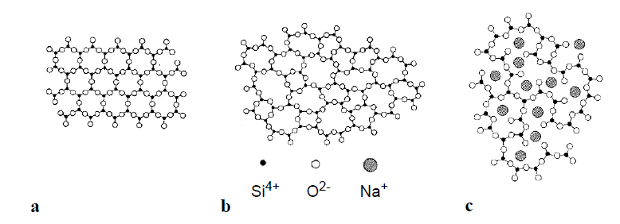

 
    Bild aus H. Schürrmann "Konstruieren mit Faser-Kunststoff-Verbunden"

---

# Herstellung - Schmelzspinnverfahren

1. Rohstoff bei ~1400°C schmelzen
2. 400-6000 Spinndüsen (Ø 1-2 mm)
3. Ausziehen auf Ø 5-24 μm
4. Erstarrung in Sekundenbruchteilen
5. Aufbringung einer Schlichte (0.5-1% $d_f$)
    - Schutz scheuerempfindlicher Fasern
    - Verbesserung Faser-Matrix-Haftung
    - Verklebung zu Spinnfaden
    - Aufwickeln auf Spulen

---

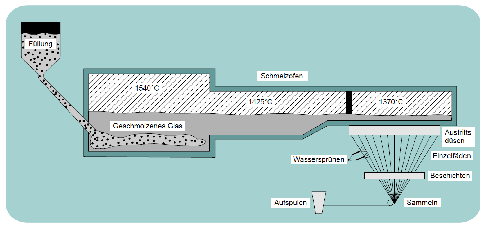

 
    Bild entmommen aus der Vorlesung "Leichtbau mit Faserverbunden" SS2008 von Prof. Dr.-Ing. Klaus Rohwer"

---

# Vorteile Glasfaser

- Niedriger Preis (entscheidend!)
- Sehr hohe Längs-Zugfestigkeit
- Hohe Längs-Druckfestigkeit
- Hohe Bruchdehnung (für manche Anwendungen)
- Gute Drapierbarkeit (niedrige Fasersteifigkeit)
- Elektrische und thermische Isolation
- Unbrennbar
- Geringe Feuchtigkeitsaufnahme
- Gute Chemikalienbeständigkeit
- Unverrottbar (Pilze, Bakterien, Insekten, Nagetiere)

---

# Glasfaser - Weitere Vorteile

**Qualitätskontrolle:**
- Transparenz ermöglicht visuelle Tränkungskontrolle
- Luftblasen sofort erkennbar $\rightarrow$ Milchigkeit
- Brechungsindex ähnlich Matrix

**Schadenserkennung:**
- Schlagschäden durch Milchigfärbung erkennbar
- Besser als bei CFK

**Design:**
- Einfärbung möglich

---

# Nachteile Glasfaser

**Hauptproblem: Zu niedriger E-Modul**
- Kritisch für Strukturbauteile
- Abmischung mit Matrix → ~50% Fasersteifigkeit im Verbund
- Schlanke Biegestrukturen problematisch (Tragflügel)

---

**Aber:**
- Niedriger Modul + hohe Bruchdehnung erwünscht für:
  - Blattfedern
  - Federlenker
  - GFK = ausgezeichneter Federwerkstoff!

---

# Glasfaser - Festigkeitseigenschaften

**Festigkeitserhöhung durch:**
- Größeneffekt (primär)
- Nicht: Orientierung (wie bei organischen Fasern)

**Einflüsse:**
- Faserdurchmesser entscheidend
- Dünn: hohe Zug- und Schwingfestigkeit
- Dick: bessere Druckfestigkeit (weniger knickgefährdet)
- Druckeigenspannungen an Oberfläche (Abkühleffekt)

---

**Praktische Festigkeit:**
- Prospektwerte: matriximprägnierte, unbeschädigte Fäden
- Konstrukteur rechnet mit: Rf ≈ 1800 N/mm² (E-Glas)

---

# Glasfaser - Mechanisches Verhalten

**Spannungs-Dehnungs-Verhalten reine Faser:**
- Linear-elastisch bis Bruch
- Kein plastisches Verformungsvermögen
- Spröder Bruch

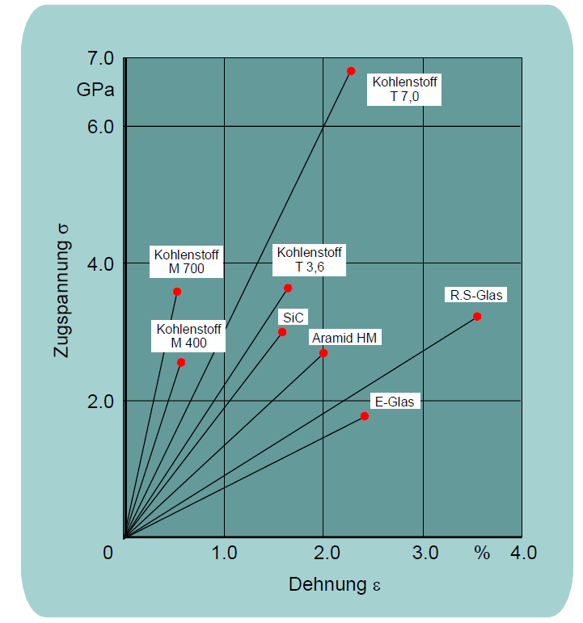

 
    Bild entmommen aus der Vorlesung "Leichtbau mit Faserverbunden" SS2008 von Prof. Dr.-Ing. Klaus Rohwer"

---

**Verbundverhalten**
- Festigkeitsverteilung der Filamente
- Nicht alle brechen gleichzeitig
- Nacheinander versagend
- Abspleißen kündigt Versagen an
- **"Gutmütiges" Versagensverhalten**

**Kriechneigung:** Sehr gering

---

# Glasfasertypen

| Eigenschaft | E-Glas | R-Glas | S-Glas | C-Glas | D-Glas |
|-------------|--------|--------|--------|--------|--------|
| E-Modul [N/mm²] | 73.000 | 86.000 | 86.810 | 71.000 | 55.000 |
| Zugfestigkeit [N/mm²] | 2.400 | 3.600 | 4.500 | 2.400 | 1.650 |
| Dichte [g/cm³] | 2.54 | 2.55 | 2.49 | 2.51 | 2.14 |
| α_T [10⁻⁶/°C] | 5.1 | 4.1 | 5.58 | 4.2 | 3.5 |
| Verluste ab | 300°C | 350°C | - | - | - |

E = Electrical (Standard), R = Resistance, S = Strength
C = Chemical resistant, D = Dielectric

 
    Tabelle aus H. Schürrmann "Konstruieren mit Faser-Kunststoff-Verbunden"

---

# Temperatureinfluss

**Tiefe Temperaturen:**
- Maximale Festigkeit bei ~-180°C (doppelt so hoch wie bei 23°C)

**Hohe Temperaturen:**
- Festigkeitsabfall bei längerer Auslagerung
- R-Glas und S-Glas: deutlich bessere thermal stability
- Wahl bei dauerhaft hohen Temperaturen

 
    Bild aus H. Schürrmann "Konstruieren mit Faser-Kunststoff-Verbunden"

---

# Chemikalienbeständigkeit

**E-Glas ungeeignet bei:**
- Stark sauer (pH < 3)
- Stark alkalisch
- Zerfallsmechanismus: Auslaugen der Netzwerkbildner/-wandler
- SiO₂-Gerüst bleibt zurück
- Spiralförmige Risse beim Trocknen

---

**Bessere Alternativen:**
- S-Glas und R-Glas (deutlich besser)
- ECR-Glas (E-Glas Corrosion Resistance, ohne Bor)
- Advantex® (Weiterentwicklung)

 
    Bild aus H. Schürrmann "Konstruieren mit Faser-Kunststoff-Verbunden"

---

# Schutzmaßnahmen gegen Korrosion

<!-- _class: cols-2-1 -->

**1. Liner:**
- PVC, PE, PP, PVDF
- Dichtigkeit garantiert
- Problem: Verklebung (außer PVC)
- Lösung: Aufgeschmolzene Oberfläche + Gewebe

**2. Chemieschutzschichten (CSS):**
- C-Glas oder ECR-Glas Vliese/Matten
- Chemikalienbeständige Matrix (hohe Bruchdehnung)
- Redundanz: Zweischaliger Aufbau

**Achtung:** CSS bei hohen Temperaturen (160-200°C) vermeiden  → Delaminationsgefahr durch thermische Dehnung

---

# Glasfaser - Korrosionsresistenz

**Allgemein:**
Trotz Einschränkungen: Weitaus höhere Korrosionsbeständigkeit als Metalle!

**Standardbereich (pH 5-7):**
- E-Glasfaser: hervorragende Beständigkeit
- Positive Langzeiterfahrungen (Chemieanlagenbau)
- Betonbauteil-Sanierung

**Spezial: Alkalibeständige Glasfasern**
- Für Betonverstärkung
- Fassadenplatten, Verkleidungen

---

# Elektrische Eigenschaften

**Isolation:**
- Spez. elektrischer Widerstand: ρ = 10¹⁴-10¹⁵ Ωmm²/m
- Ausgezeichnet für thermische und elektrische Isolation

**Anwendungen:**
- Leiterplatten
- Hochspannungsanlagen (hohe Durchschlagsfestigkeit)
- Isolatoren
- Transformatoren

---

**D-Glas (Spezial):**
- Niedriger dielektrischer Verlustfaktor
- Transparent für elektromagnetische Wellen
- Radarabdeckungen, Flugzeugrumpfnasen

---

# Lieferformen Glasfaser

**Glasfilamentgarne:**
- Umspulung von Spinnspulen
- Verdrehung für engere Bindung
- Zwirne: 2-3 Garne verdreht

**Assemblierter Roving:**
- Mehrere Spinnfäden ungedreht zusammengefasst
- Durchhänge → ungleiche Spannungsverteilung

---

**Direktroving:**
- Direkt mit Zielfilamentanzahl gefertigt
- Gleichmäßigere Spannungsverteilung
- Größerer Filamentdurchmesser (17-24 μm)
- Besser für Präzisionsbauteile

**Spinnroving:**
- Längs- und Querverstärkung
- Schlaufen durch Luftführung beim Spinnen
- Für Pultrusion (sonst nur UD)

---

**Hohlfasern:**
- ~30% niedrigere Dichte (1.8 vs. 2.54 g/cm³)
- Stabilitätsgefährdete Bauteile
- Wanddickenerhöhung ohne Gewichtszunahme
- Matrix darf Hohlraum nicht füllen!
- Kein Vorteil gegenüber C-Faser → kaum Einsatz

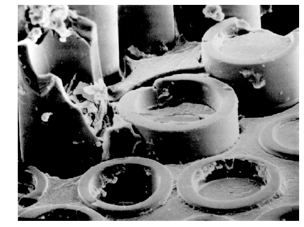

 
    Bild aus H. Schürrmann "Konstruieren mit Faser-Kunststoff-Verbunden"

---

# Glasfaser - Feinheit und Abzug

**Feinheit in tex (g/km):**
- Garne: 34, 68, 136 tex
- Rovings: 160, 320, 600, 900, 1200, 2400, 4800 tex

**Außenabzug:**
- Spule innen aufspannen, außen abziehen
- Keine Verdrillung beim Abspulen
- Parallele Filamentausrichtung
- Höchste Laminatqualität
- Aufwand: Spulenregelung pro Spule

---

**Innenabzug:**
- Aus Spulenmitte abziehen
- Direkt von Lieferpalette
- Verdrillung vernachlässigbar
- Reibkraft über Bolzenreihe einstellen

---

# Kohlenstofffasern

---

**Motivation Ende 1950er:**
- Glasfaser-E-Modul zu niedrig
- Suche nach Alternativen
- Elemente: B, C, Si aus ersten Perioden

**Entwicklung:**
- Borfasern (Bor auf Wolfram): schwer verarbeitbar
- Kohlenstofffaser: hat sich durchgesetzt

**Historisch:**
- Experimente ~1878 (Edison, Swan)
- Glühlampen-Fäden aus Baumwolle/Bambus
- Wenig gemeinsam mit modernen Fasern

---

# Herstellung C-Fasern

**Verfahren:**
1. Chemisches Abscheiden auf Trägerdrähten
2. Abbau vorgeformter organischer Fasern

**Durchbruch 1961: Polyacrylnitril (PAN)**
- >90% Marktanteil
- Kohlenstoffausbeute: 55 Gew.-%
- Sehr hohe Module (≈450.000 N/mm²) möglich
- Hohe Festigkeiten (≈7.000 N/mm²)
- Bruchdehnungen bis 3%

---
# Herstellung C-Fasern
**Alternative: Pech (Petroleum/Steinkohle)**
- Mesophase durch thermische Behandlung
- Hohe Orientierung beim Schmelzspinnen

---

**Stufe 1: Stabilisieren (180-350°C)**
- PAN → unschmelzbare Struktur
- Oxidative Atmosphäre (Luft)
- Unter Zugspannung (sonst Schrumpfen)

**Stufe 2: Carbonisierung (bis 1500°C)**
- N₂-Atmosphäre, ohne Spannung
- Nicht-Kohlenstoff-Atome abspalten
- Kohlenstoffringe bilden
- Masseverlust ~50%
- Schrumpfung: ~0.01%/°C

---

**Stufe 3: Graphitierung (2000-3000°C)**
- Je nach gewünschtem E-Modul
- Verstrecken erhöht Orientierung
- 1200-1500°C: hochfest
- >2200°C: Hochmodul
- bis 3000°C: Ultrahochmodul
- Dichte steigt mit E-Modul

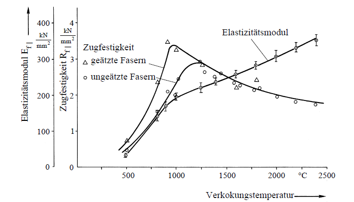

 
    Bild aus H. Schürrmann "Konstruieren mit Faser-Kunststoff-Verbunden"

---

**Stufe 4: Oberflächenbehandlung**
- Stabile Oberflächenoxide erzeugen
- Chemische Reaktion mit Matrix
- Verbesserte Haftung
- Nasschemisch (Salpetersäure) oder thermisch (>400°C)

**Stufe 5: Schlichte**
- Schutz bei Weiterverarbeitung
- Meist modifizierte Epoxidharze
- Hochtemperaturbeständige Schlichten für PEEK, PSU, PA 6.6
- Auch ungeschlichtete Fasern erhältlich

---

# Graphit-Struktur

**Aufbau:**
- Einzelne Schichten
- Starke Bindung in Schichtebene
- Theoretische Werte aus Einkristall:
  - E-Modul: 1.050.000 N/mm²
  - Festigkeit: 100.000 N/mm²

**Realität:**
- Defekte verhindern Erreichen theoretischer Werte

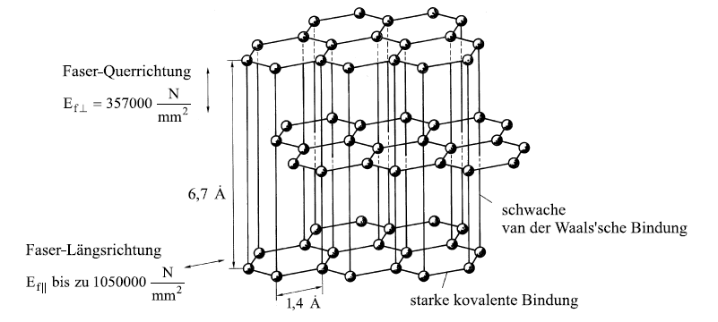
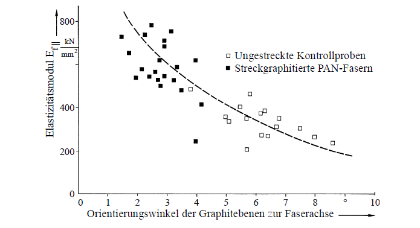

 
    Bilder aus H. Schürrmann "Konstruieren mit Faser-Kunststoff-Verbunden"

---

# Mikrostruktur C-Faser

**Faser als Faser-Matrix-Verbund:**
- Fibrillen eingelagert in amorphem Kohlenstoff
- Fibrillenanteil: 35-63%
- Unregelmäßige Verteilung → niedrigere Festigkeit
- Zusammengeklumpte Fibrillen → niedrigere Festigkeit

---

# Vorteile Kohlenstofffaser

- Sehr leicht (ρ ≈ 1.8 g/cm³ << 2.54 g/cm³ Glas)
- Extrem hohe Festigkeiten
- Sehr hohe E-Module
- E-Modul einstellbar bei Herstellung
- Auswahlmöglichkeit für Konstrukteur
- Exzellente Ermüdungsfestigkeit
- Statisch und dynamisch hochfest
- Entscheidend für Flugzeugbau
- Progressives σ-ε-Diagramm (~10% Steifigkeitszunahme) durch Orientierung der kovalenten Bindungen der Graphikristallen bei hohen Spannungen

---

# C-Faser - Weitere Vorteile

**Anisotropie:**
- $E_{parallel} >> $E_{quer}$ (Faktor 10)
- Konstruktiv nutzbar

**Konstruktionsfreundlich:**
- Hohe Steifigkeit zieht Lasten an
- Matrix und Grenzfläche entlastet
- Risse an Grenzflächen treten später auf als bei GFK

---

# C-Faser - Weitere Vorteile

**Thermische Ausdehnung:**
- Quer: positiv
- Parallel: negativ (besonders bei HM)
- α = 0 einstellbar für Präzisionsbauteile!

**Beständigkeit:**
- Gegen meiste Säuren und Alkalien
- Verträglichkeit mit synthetischen Polymeren
- Biokompatibel (menschliches Gewebe, Knochen)
- Durchlässig für Röntgenstrahlung (Medizintechnik)

---

# Nachteile Kohlenstofffaser

**Mechanisch:**
- Sprödes Bruchverhalten (geringe Bruchdehnung)
- Aber: Fasern mit höherer Bruchdehnung verfügbar
- Schlagschäden schlecht sichtbar (undurchsichtig)
- Delaminationen innen → Ultraschallprüfung nötig
- CAI-Test (compression after impact) erforderlich
- Druckfestigkeit < Zugfestigkeit (limitierend)

---

**Verarbeitung:**
- Benetzungskontrolle schwierig → Harzüberschuss
- Größere Eckradien nötig (hohe Fasersteifigkeit)

**Kosten:**
- Hoher Faserpreis (Hauptnachteil!)
- Steigt mit E-Modul und Garnfeinheit

---

# C-Faserklassen

<!-- _class: cols-2-1 -->

**HT = High Tenacity (Standard, hochfest)**
**ST = Super Tenacity (höhere Festigkeit)**
**IM = Intermediate Modulus**

**HM = High Modulus (Hochmodul)**
**UHM = Ultra High Modulus**

| Typ | E-Modul [N/mm²] | Zugfestigkeit [N/mm²] | Dichte [g/cm³] |
|-----|-----------------|----------------------|----------------|
| HT | 230.000 | 3.430 | 1.74 |
| ST | 245.000 | 4.510 | 1.80 |
| IM | 294.000 | 4.210 | 1.74 |
| HM | 392.000 | 2.450 | 1.81 |
| UHM | 450.000 | 2.150 | 1.90 |

---

# Temperatureinfluss C-Faser

**Steifigkeit:**
- Temperaturinvariant
- Laminatsteifigkeit parallel: vernachlässigbarer Temperatureinfluss

**Temperaturbeständigkeit:**
- Ausgezeichnet (überlegen gegenüber Glas, Aramid)
- Unschmelzbar bis 4000°C
- Nicht oxidierend: bis ~2000°C
- Mit Luftzutritt: bis ~400°C
- HM-Fasern: noch höhere Einsatztemperatur (weniger Oxidation)

---

**Weitere Eigenschaften:**
- Sehr niedriger thermischer Ausdehnungskoeffizient
- Gute Wärmeleitfähigkeit
- >90% Kohlenstoff

**Leitfähigkeit:**
- ρ = 8 (HM) bis 20 (HT) Ωmm²/m
- Gut elektrisch leitend

---

-  Nicht als Isolator geeignet
-  Widerstandsheizung möglich
-  Induktionserwärmung (viele Kontaktpunkte nötig)
-  Schweißen von Thermoplasten
-  EMV-Abschirmung
-  Galvanische Korrosion mit Metallen (Elektrolyt)
  - OK: Titan, Edelstahl
  - Problematisch: Aluminium (Isolationsmaßnahmen!)
- Kurzschlussgefahr (Bruchstücke, Abrieb)

---

# Lieferformen C-Faser

**Filamentdurchmesser:** 5-10 μm

**Feinheit nach Filamentzahl:**
- 1k, 3k, 6k, 12k, 24k (k = 1000 Filamente)
- Standard (kostengünstig): 12k, 24k
- 12k ≈ 800 tex (Standardfaser)
- Heavy tows: 45k, 400k

**Technische Lieferbedingungen:**
- DIN 29965. DIN 65184

---

# Aramidfasern

---

**Handelsnamen:** Kevlar®, Twaron®, Technora®

**Erste polymere Hochleistungsfaser (Anfang 1970er)**
- Aromatisches Polyamid (Para-Aramid)
- Flüssig-kristalline Lösung versponnen
- Gereckt bei erhöhter Temperatur
- Optional: Avivage (Schutzschicht)

**Mikrostruktur:**
- Sehr hoher Orientierungsgrad
- Starre Kettenmoleküle
- Orientierung ~9°
- Hohe Festigkeiten und E-Module

---

# Vorteile Aramidfaser

- Niedrige Dichte (1.45 g/cm³)
- Leichteste Verstärkungsfaser
- Verschiedene Steifigkeiten verfügbar
- Zugfestigkeit > Glasfaser
- E-Modul ≈ 2× Glasfaser
- Sehr gute Ermüdungsfestigkeit
- Stark anisotrop
- Stark negative α_T in Faserrichtung
- Dämpfung >> Glas und C-Faser (Faktor 10)

---

- Sehr hohe Zähigkeit
- Hoher Widerstand gegen Rissausbreitung
- Schlagbeanspruchte Laminate

**Mischgewebe C-Aramid:**
- Verbesserung CFK-Schlagzähigkeit
- Verhindert völliges Auseinanderbrechen

**Rissstopper:**
- Einfügen dünner Aramidgewebe
- Verhindert Rissfortschritt in Nachbarschichten
- Niedrigmodulfaser besonders geeignet (hohe Bruchdehnung)

---

# Anwendungen

- Flugzeugrümpfe, Monocoques, Rennwagen
- Arbeitsschutzbekleidung, Schutzhandschuhe
- Sportbekleidung (Schürfschutz)
- Ballistischer Schutz (Westen, Helme)
- Mit Polyurethan-Matrix für Platten

**Technische Textilien:**
- Reifen, Keil- und Zahnriemen
- Hydraulikschläuche
- Taue

---

# Nachteile

**Mechanisch:**
- Geringe Druckfestigkeit parallel (R⁻ = 20% R⁺)
- Wiederholte Stauchung >0.8% reduziert Zugfestigkeit
- Stabilitätsversagen in Mikrostruktur

**Material:**
- Wasseraufnahme (Haftungsprobleme)
- Trocknung vor Tränkung erforderlich
- UV-Abbau (lichtgeschützte Lagerung)
- Geringes Kriechen bei Langzeitbelastung

---
# Nachteile
**Verarbeitung:**
- Hohe Zähigkeit → schwer mechanisch bearbeitbar
- Spezialwerkzeuge (Scheren, Bohrer) nötig
- Optimal: lederartiger Zustand nach Anhärten
- Alternative: Wasserstrahltrennung

**Kosten:**
- Zwischen Glas und Kohlenstoff

---

# Aramidfaser - Verarbeitungstricks

**Problem:** Schwer bearbeitbar

**Lösungen:**
1. Aramid nicht bis Bauteilrand
   - Überlappend: Ränder in GFK

2. Oberflächenschichten
   - Aramid nicht an Oberfläche
   - Abdeckung mit Glasgeweben
   - Erleichtert Reparaturen (Anschleifen)

---

# Aramidfasertypen

| Eigenschaft | Standard (hochzäh) | Hochmodul (hochsteif) |
|-------------|--------------------|-----------------------|
| E-Modul parallel [N/mm²] | 67.000 | 130.000 |
| Therm. Ausdehnung parallel [10⁻⁶/°C] | -2 | -2 |
| Therm. Ausdehnung quer [10⁻⁶/°C] | 12.5 | 17 |
| Zugfestigkeit [N/mm²] | 2.800 | 2.800 |
| Dichte [g/cm³] | 1.44 | 1.45 |

---

## Temperatureinfluss 

- Niedrige T: Festigkeit steigt
- Hohe T: Festigkeit sinkt
- Keine Versprödung bei -196°C
- Restzugfestigkeit nach Lagerung beachten!
- Zersetzungstemperatur: 550°C
- Einsatz bis ~150°C (meist Matrix limitierend)

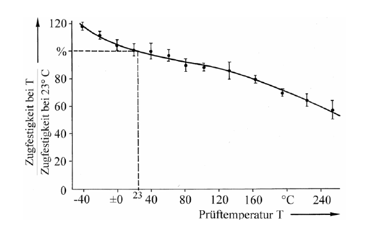

---

## Chemikalienbeständigkeit
- Sehr gut allgemein
- 4 Gew.% Wasseraufnahme (20°C, 65% r.F.)
- Extreme pH-Werte kritisch
- pH 5-7: hervorragend

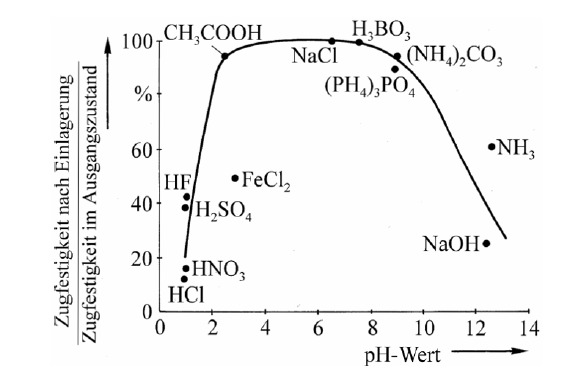

---

# Elektrische Eigenschaften

**Isolation:**
- Ausgezeichnete Isolatoren (wie Polymere)
- ρ im Bereich von E-Glasfaser
- Dielektrizitätskonstante < E-Glasfaser
- Dielektrizitätskonstante < D-Glasfaser

**Anwendung:**
- Antennenabdeckungen

---

# Weitere Polymerfasern

---

**PBO-Faser (Zylon®):**
- E-Modul und Festigkeit ≈ 2× Aramid
- Zersetzung: 650°C (100°C > Aramid)
- Extrem niedrige Druckfestigkeit

**PE-Faser (Dyneema®, Spectra®):**
- Niedrigste Dichte (0.97 g/cm³)
- Herausragende Zähigkeit
- Fasern schwimmen in Wasser
- Extrem niedrige Druckfestigkeit
- Anwendung: Seile, Schutz, Hybride

---

# Naturfasern

- Bastfasern: Flachs, Hanf, Jute, Ramie
- Blattfasern: Sisal, Banane
- Samenfasern: Baumwolle

**Vorteile:**
- Niedrige Dichte (hohl)
- Gute Isolierung
- Geringer Energiebedarf
- Keine Hautreizung
- Kompostierbar/verbrennbar

---

**Nachteile:**
- Große Streuung bei den Parametern
- Temperaturempfindlich
- Geringer Brandwiderstand
- Hygroskopisch
---

| Eigenschaft | Flachs | Hanf | Jute | Ramie | Sisal | Faserbanane | Baumwolle |
|-------------|--------|------|------|-------|-------|-------------|-----------|
| **E-Modul Ef‖** (kN/mm²) | 60-80 | 70 | 10-30 | 44 | 38 | 25 | 12 |
| **Zugfestigkeit fR+** (N/mm²) | 800-1500 | 550-900 | 400-800 | 500 | 600-700 | 980 | 400 |
| **Bruchdehnung εf‖** (%) | 1,2-1,6 | 1,6 | 1,8 | 2 | 2-3 | 3-10 | - |
| **rel. Feuchteaufnahme** (%) | 7 | 8 | 12 | 12-17 | 11 | - | 8-25 |
| **Dichte ρf** (g/cm³) | 1,4 | 1,48 | 1,46 | 1,5 | 1,33 | 1,5 | 1,51 |

---

# Spezialfasern

**Quarzfasern (Quartzel®):**
- 99.99% SiO₂
- α_T ≈ 0 (thermischer Schock unempfindlich)
- Ausgezeichnete chemische Beständigkeit
- Sehr guter Isolator
- Dauerhaft bis 1050°C

**Al₂O₃-Fasern (Nextel™):**
- Hohe Temperaturbeständigkeit (>1000°C)
- Geringe Kriechneigung
- Turbinen-, Motor-, Raketenbau

---

**SiC-Fasern (Nicalon®):**
- Bis 1000°C (oxidative Atmosphäre)
- Eigenschaften ähnlich Standard-C-Faser

---

| Eigenschaft | Quarz 9μm | Quarz 14μm | 62% Al₂O₃ + 24% SiO₂ + 14% B₂O₃ | Al₂O₃ |
|-------------|-----------|------------|----------------------------------|-------|
| **E-Modul Ef‖** (N/mm²) | 77.000 | 79.000 | 150.000 | 380.000 |
| **Zugfestigkeit fR+** (N/mm²) | 3.700 | 3.300 | 1.700 | 3.100 |
| **Therm. Ausdehnungskoeff. αTf‖** (10⁻⁶/°C) | 0,54 | 0,54 | 3 | 8 |
| **Dichte ρf** (g/cm³) | 2,2 | 2,2 | 2,7 | 3,9 |

---

# Faser-Matrix-Grenzfläche
Grenzfläche hat bedsondere Bedeutung und kann faserseitig und matrixseitig beeinflusst werden
**Faserüberzug (bei fast allen Fasern) - Schlichte:**
1. Fixierung Filamente zu Bündel
2. Oberflächenschutz (Abrasion)
3. Verarbeitbarkeit (Reibung, Elektrostatik)
4. Benetzbarkeit/Tränkbarkeit
5. **Haftvermittler** (coupling agent)

---
# Schlichte - Faserspezifisch
**Glasfaser - Textilschlichte:**
- Weichmacher, Filmbildner, Gleitmittel
- Schutz vor Wasseraufnahme
- Thermisch entschlichten (400-600°C)
- Finish: 5-10% Additive, 80-90% Filmbildner, 5-10% Haftvermittler

**Glasfaser - Haftvermittler:**
- Meist Silanbasis
- Chemische Verbindung zu Glas
- Reaktionsfähige Gruppen für Matrix-Copolymerisation

---

**C-Faser:**
- Oxidation am Ende der Fertigungslinie
- Carboxyl- und Carbonylgruppen
- Schlichte: Epoxidharz oder andere (nur Schutz)
- Schlichtefreie Fasern verfügbar

**Aramid/PE:**
- Meist nicht oberflächenbehandelt
- Wenn: Verarbeitbarkeit verbessern
- Schlechte Haftung
- Plasma-Behandlung verbessert deutlich

---

# Schlichte - Auswirkungen

**Positive Effekte:**
- Feuchteaufnahme beeinflusst
- Minimierung Festigkeitsänderungen

**Negative Effekte:**
- Weichmacher-Wirkung im Nahbereich
- Unterhärtung möglich
- Erniedrigte Temperatur-Einsatzgrenzen
- Farbveränderungen möglich

---

**Sonstiges:**
- Schlichte bestimmt Lagerstabilität
- Nicht mit Lösungsmitteln behandeln
- Zuviel Haftvermittler lagert in Matrix ab → schlechter
- Grenzschicht ~200 nm (trotzdem 8% der Matrix!)

---
# Faser-Halbzeuge

- der Herstellungsprozess lässt sich durch passende Halbzeuge erheblich vereinfachen
- die eigene Fertigungstiefe lässt sich verringern
- es müssen keine eigenen Kompetenzen aufgebaut werden; stattdessen wird die spezielle Kompetenz des Halbzeugherstellers genutzt
- die Qualität der Laminate wird durch speziell abgestimmte Halbzeuge verbessert

---

# Gewebe (Woven Fabric)

**Prinzip:**
- Zwei rechtwinklige Faserrichtungen (Kette + Schuss)
- Ein Auflegeschritt = zwei Richtungen
- Anpassbar an Lastverhältnisse

**Eigenschaften:**
- Flächengewicht: 25-1300 g/m²
- Faservolumenanteil: 35-50 Vol.% (UD: bis 70%)

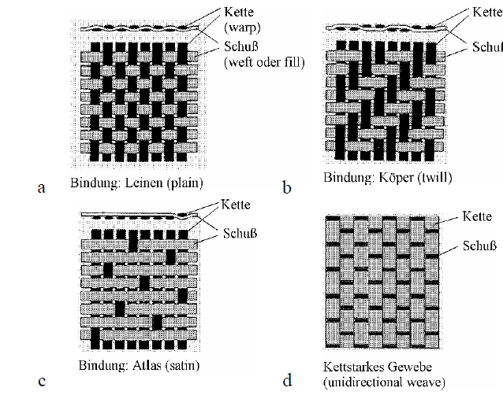

---

## Gewebe - Leinwandbindung

- Enge Bindung (1-über-1)
- Kleine Flottierung
- Schiebefest
- Faserausrichtung leicht einstellbar

**Vorteile:**
- Sichere Faserpositionierung

**Nachteile:**
- Starke Faserkrümmung
- Schlechtere Druck- und Ermüdungsfestigkeit

---

## Gewebe - Köper und Atlas

**Köperbindung:**
- Über 2 (Doppelköper) oder 3 (Kreuzköper) Kettfäden
- Diagonale Kreuzungspunkte erkennbar

**Atlasbindung:**
- Z.B. über 7 Kettfäden
- ~80% Schuss vorne, ~80% Kette hinten
- Nahe an zwei getrennten UD-Schichten
- Höhere Ermüdungsfestigkeit als Leinwand

---

**Eigenschaften:**
- Größere Flottierung
- Nicht schiebefest
- Sehr gut drapierbar
- Scherverformung möglich
- Sorgfalt bei Orientierung nötig

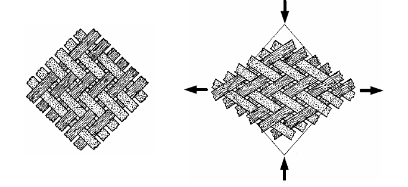

---

# Multiaxialgelege (NCF)

**Prinzip:**
- UD-Schichten wellenfrei
- Fixierung durch Wirkmaschen
- Faserorientierungen: 22-90° einstellbar
- Optional: Matten/Vliese eingewirkt

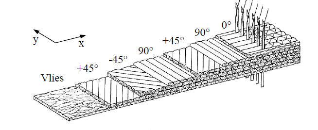

---

**Vorteile:**
- Maximale Faserfestigkeit (5-20% > Gewebe)
- Keine Krümmungen
- (0°/90°/+45°/-45°) in einer Schicht
- Große Zeitersparnis beim Drapieren
- Kein diagonaler Zuschnitt (±45°)
- Genauere Orientierung

**Nachteil:**
- Evtl. zu grob für feinschichtige Laminate

---

# Matten und Vliese

- Endlosmatte oder Schnittmatte (25-50 mm)
- Regellos verteilt (random) → isotrop in Ebene
- Meist Glasfaser, selten C-Faser
- Flächengewicht: 150-900 g/m²
- Verklebt mit Binder (lösbar oder thermoplastisch)
- Alternative: Vernadeln

---

**Faservolumenanteil:**
- 15-35 % (je nach Pressdruck)
- schlechtere Eigenschaften als Gewebe

**Vorteile**
- Kostengünstig
- "Beweglich" - füllt auch Rippen
- Schnell tränkbar
- Fließhilfe bei Injektion
- Wanddicke einfach anpassbar
- Erhöht Schälfestigkeit
- Reduziert Delaminationsgefahr

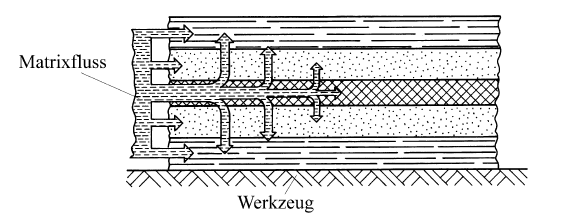

---

**Sandwichmatten:**
- Kern (z.B. PP-Vlies) + beidseitig Schnittmatte
- Sehr gut drapierbar (sphärisch)

---

# Vliese (Fleece, Veil)

**Unterschied zu Matten:**
- Viel feiner strukturiert
- Einzelfilamente (nicht Spinnfädenbündel)
- Flächengewicht: 15-80 g/m²

**Materialien:**
- Glasfasern (E, C, ECR)
- Polymerfasern (PES, PAN)
- C-Faser, Aramidfaser

---

**Hauptverwendung:**
- Oberflächenverbesserung (surfacing veil)
- Abdeckung grober Gewebestrukturen
- Glättung der Welligkeit
- Abrasionsschutz (Polymervlies)
- Chemieschutzschichten
- Witterungsbeständigkeit

---

# 3D-Gewebe und Gelege

**Zweck:**
- Verstärkung in Dickenrichtung
- Nicht Lastaufnahme, sondern Schälfestigkeit
- Delaminationsverstärkung

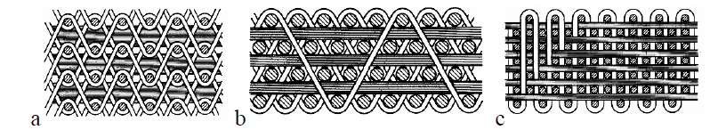

---

**Konstruktion:**
- 2-10% Verstärkung in Dickenrichtung
- Durch Weben oder Nähen
- Senkrecht oder unter 45° zur Ebene
- 45° ergibt höchste Schubfestigkeit

**Eigenschaften:**
- Schneller tränkbar (Fließkanäle)
- Einbußen bei Steifigkeit/Festigkeit vs. 2D

---

# Abreißgewebe (Peel Ply)

**Kein Verstärkungshalbzeug!**
Fertigungs-Hilfsmittel

**Funktion:**
- Abziehen vor Weiterverarbeitung
- Erzeugt große, raue Klebfläche (Rz ≈ 60-100 μm)
- Ersetzt aufwändiges Anschleifen
- Entfernt Schmutz

---

**Material:**
- Polyamid oder Polyester
- Farbig markiert (gegen Verwechslung)
- Temperatureinsatz bis ~200°C
- Darüber: PTFE-beschichtetes Glasgewebe

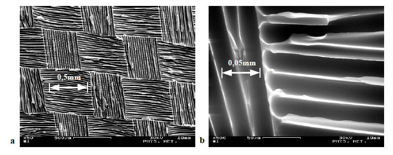

---

# Abreißgewebe - Multifunktion

**Weitere Funktionen:**
1. Entlüftungsschicht (Vakuumsack)
2. Harzüberschuss aufsaugen
3. Wanddicke vergleichmäßigen
4. Optische Qualität verbessern
5. Rutschfestigkeit erhöhen
6. Abrasionsschutz (verbleibend)
7. Rohre: Schrumpfen kompaktiert

**Tipps:**
- Schmale Streifen entlang Webrichtung reißen
- Antihaftausrüstung für schwer zugängliche Bereiche
- Kontamination der Klebfläche vermeiden

---

# Blitzschutz

1. Cu- oder Al-Netze einlaminiert
2. Mischgewebe (C + AlMg5)
3. Metallisierte Fasern (Ni-Überzug)
4. Ableitung über Stromleiterschienen

**EMV-Abschirmung:**
- Gesetzliche Pflicht (Störfestigkeit + Abstrahlungsminimierung)
- CFK allein: geringe Abschirmung
- Metallisierte PAN-Vliese (1.8-3.4% Metall)
- Zwei Vliese 90° verdreht

---

# Lagerung und Verarbeitung

**Lagerbedingungen:**
- Kühl und trocken
- Ungeknickt, aufgerollt
- Abgedeckt (Staub und Schmutz)
- Aramidfaser: Lichtgeschützt (UV-Abbau)
- Lagerzeiten beachten (Schlichte altert)

---

**Trocknung:**
- Unbedingt vor Verarbeitung!
- Aramidfaser: 105°C, mind. 12h
- Glas/C-Faser: Oberflächenfeuchte kurz entfernen
- Sofort nach Trocknung verarbeiten

---

# Verarbeitung - Faserführung

**Grundregeln:**
- Sorgfältige Gestaltung (Beschädigung vermeiden)
- Geringe Anzahl Führungen
- Kleine Umlenkwinkel
- Ösen: große Radien, harte Oberfläche
- Polierte Ösen (100Cr6 oder Keramik)
- Baumwoll-Handschuhe (keine Hautabsonderungen!)
- Nicht mit Lösungsmitteln benetzen

---

**C-Faser spezial:**
- Führungen kapseln (Abrieb)
- Regelmäßig absaugen
- Elektronik schützen (Kurzschlussgefahr)
- Filter vor Lüftern
- Schaltschränke unter Überdruck

---

# Faserauswahl - Methodik

---

**Wenn mechanische Eigenschaften dominieren:**

1. **Glasfaser** wenn:
   - Steifigkeit ausreichend
   - Dichte akzeptabel
   - Preisgünstigste Option
   - Aggressive Medien: Advantex®

2. **C-Faser** wenn:
   - Höhere Steifigkeit nötig
   - Zuerst Standard-C-Faser probieren
   - Optional: Abmischen mit Glas
   - Oberfläche: feine Gewebe (3k)

---

3. **Aramidfaser** wenn:
   - Besonders leicht gewünscht
   - Glasfaser substituieren (25-30% Gewichtseinsparung)
   - Aber: deutlich teurer

4. **Aramid/PE-Faser** wenn:
   - Schlaggefährdet
   - Hohe Zähigkeit erforderlich
   - Mischgewebe mit C-Faser
   - Aufgabenteilung: C (steif/fest), Aramid/PE (zäh)

---

**Spezialanforderungen:**
- Hohe Temperatur: C-, SiC-, Al₂O₃-Fasern
- Beratung durch Hersteller empfohlen!

---

# Zusammenfassung

**Hauptfasertypen:**
- Glasfaser: kostengünstig, universell
- C-Faser: hochsteif, leicht, teuer
- Aramidfaser: leicht, zäh, speziell

**Wichtige Aspekte:**
- Größeneffekt, Orientierung, Fehlstellen
- Schlichte für Haftung essentiell
- Richtige Lagerung und Verarbeitung
- Sorgfältige Faserauswahl
- Datenbeschaffung kritisch

---

# Vielen Dank für Ihre Aufmerksamkeit!

**Kontakt:**
Prof. Dr.-Ing. Christian Willberg
Hochschule Magdeburg-Stendal

**Literaturhinweise:**
- Helmut Schürrman "Konstruieren mit Faserverbundwerkstoffen"

