<!-- _class: lead -->

# Ausgangsmaterial: Polymere Matrixsysteme

Prof. Dr.-Ing. Christian Willberg
Hochschule Magdeburg-Stendal

---

<!-- _class: lead -->

## Aufgaben der Matrix im FKV

- Fixierung der Fasern in geometrischer Anordnung
- Verklebung der Fasern untereinander
- Kraftübertragung zwischen Fasern
- Lastaufnahme bei Quer- und Schubbeanspruchung
- Stützung der Fasern gegen Schubknicken bei Druck
- Verklebung der Laminatschichten
- Rissstopper-Funktion (zähe Matrices)
- Schutz vor Umgebungseinflüssen

**Wichtig:** Matrix ist meist das schwächste Glied im Verbund!

---
# Arten von Polymeren

a. linearer, amorpher Thermoplast 
b. linearer, teilkristalliner Thermoplast 
c. chemisch vernetzter Elastomer
d. chemisch vernetzter Duroplast

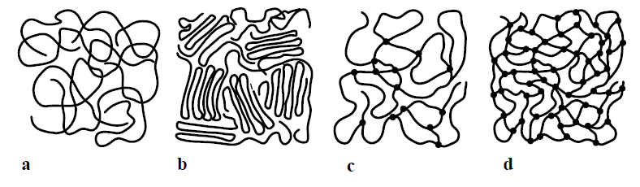

 
    Bild aus H. Schürrmann "Konstruieren mit Faser-Kunststoff-Verbunden"

---

## Duroplaste - Struktur

**Charakteristik:**
- Tri- oder mehrfunktionelle Monomere
- Räumlich engmaschige Vernetzung
- Amorph (ungeordnete Molekülketten)
- Härtung durch chemische Vernetzung
- Nicht aufschmelzbar, nicht schweißbar

---

<!-- _class: cols-2-1 -->

**Duroplaste - Vorteile**

- Hoher E-Modul durch enge Netzstruktur
- Geringe Kriechneigung
- Sehr gute thermische und chemische Beständigkeit
- Vernetzungsdichte bestimmt Eigenschaften
- Dünnflüssige Verarbeitung möglich
- Umfangreiche Erfahrungen vorhanden

**Wichtige Systeme:**
- Epoxid (EP)-Harze
- Ungesättigte Polyester (UP)-Harze  
- Vinylester (VE)-Harze
- Phenol (PF)-Harze

---

## Duroplaste - Nachteile

- Nicht aufschmelzbar → nicht schweißbar
- Zunehmend sprödes Bruchverhalten
- Unverstärkt als Konstruktionswerkstoff ungeeignet
- Recycling schwierig
- Nur als Füllstoff wiederverwendbar

---

## Thermoplaste - Struktur

**Charakteristik:**
- Lineare oder verzweigte Makromoleküle
- Nicht räumlich vernetzt
- Nebenvalenzbindungen durch Verfilzung/Kristallite
- Reversibles Aufschmelzen möglich
- Schweißbar und recyklierbar

---

## Thermoplaste - Arten

**Amorph:**
- Völlig ungeordnete Kettenmoleküle
- Beispiele: Polystyrol (PS), Polycarbonat (PC)
- Einsatz: T < T$_g$

**Teilkristallin:**
- Kristalline Bereiche in amorpher Umgebung
- Beispiele: Polypropylen (PP), Polyamid (PA)
- Höherer E-Modul, Härte, Festigkeit
- Einsatz: T < T$_s$ (Schmelztemperatur)

---

## Thermoplaste - Eigenschaften

**Vorteile:**
- Schweißbar
- Einfaches Recycling durch Aufschmelzen
- Hohe Schlagzähigkeit

**Nachteile:**
- Höhere Kriechneigung als Duroplaste
- Kritisch bei hohen Temperaturen

**Matrixmaterial für FKV:**
PP, PBT, PET, PA, PSU, PES, PPS, PEEK, PEI

---

## Elastomere

**Charakteristik:**
- Schwach räumlich vernetzt
- Sehr hoch dehnfähig
- Gummielastisches Verhalten (T > T$_{g}$)
- Nicht schmelzbar, nicht schweißbar
- Reißdehnung: mehrere hundert Prozent

**Anwendungen:**
- Einachsiger Zug: Keilriemen, Förderbänder
- Zweiachsiger Zug: Druckschläuche, Reifen
- **Nicht** für hoch belastete Strukturbauteile

---

## Füllstoffe - Ziele

**1. Strecken/Verbilligen:**
- Kreide, Kaolin, Schwerspat, Holzmehl
- Reduzierung der Schwindung

**2. Eigenschaften verbessern:**
- Kurzfasern: Festigkeit, Steifigkeit ↑
- Kautschukpartikel: Schlagzähigkeit ↑
- Quarzmehl, Glaskugeln: Steifigkeit, Härte ↑
- Graphit, MoS₂: Tribologie ↑
- Mikro-Hohlkugeln: Dichte ↓

---

## Füllstoffe - Weitere Funktionen

- **Thixotropiemittel** (Aerosil®): Verhindern Ablaufen an vertikalen Flächen
- **Baumwollflocken:** Sprödigkeit reduzieren
- **Trennmittel:** Problemloses Entformen
- **Stabilisatoren:** Wärmebeständigkeit, Hydrolyse
- **Silanisierung:** Haftung zum Polymer verbessern

**3. Einfärben:**
- Farbstoffe (löslich, transparent)
- Pigmente (unlöslich): TiO₂, Ruß, Chromoxid

---

## Methodik zur Matrixauswahl

**Systematisches Vorgehen:**

1. **Vorhandene Systeme nutzen**
   - Bekannte Eigenschaften und Erfahrungen
   - Minimierung der Materialvielfalt

2. **Bewährte Systeme wählen**
   - Qualifizierte Systeme (z.B. Luftfahrt)
   - Verfügbare Dimensionierungsdaten

3. **Neues System qualifizieren**
   - Pflichtenheft erstellen
   - Auswahlkriterien definieren

---

## Auswahlkriterien

**a) Preis**

**b) Werkstoffeigenschaften:**
- Mechanische Eigenschaften
- Temperatur-Einsatzgrenzen
- Beständigkeiten
- Elektrische Eigenschaften
- Brandverhalten

---

**c) Fertigungseigenschaften:**
- Tränkviskosität
- Verarbeitungszeit
- Härtungstemperatur und -zeit
- Lagerzeit
- Arbeitshygiene, Toxizität

---

## Mechanische Eigenschaften

**Drei Forderungen für Verstärkung:**

**1. Fasermodul > Matrixmodul:**
$$E_f > E_m$$

**2. Faserfestigkeit > Matrixfestigkeit:**
$$R_f > R_m$$

**3. Matrixbruchdehnung > Faserbruchdehnung:**
$$\varepsilon_m > \varepsilon_f$$

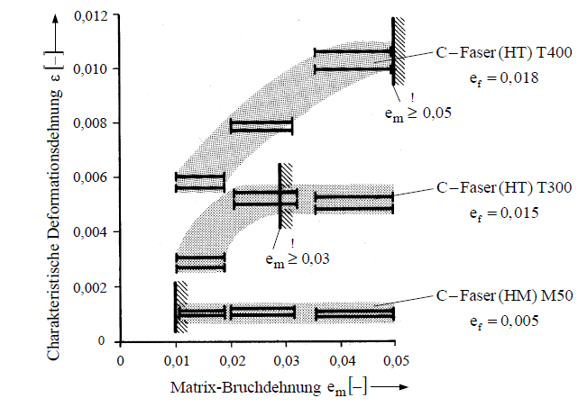

 
    Bild aus H. Schürrmann "Konstruieren mit Faser-Kunststoff-Verbunden"

---

## Matrixbruchdehnung

**Faustformel:**
$$\varepsilon_m \geq 2 \cdot \varepsilon_f$$

**Wichtig:**
- Bewertung im aufgefeuchteten Zustand!
- Wasseraufnahme kann Bruchdehnung erhöhen
- Beispiel PA: Feuchte notwendig für Zähigkeit

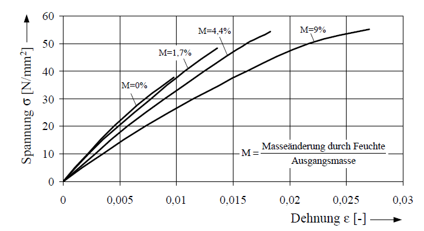

 
    Bild aus H. Schürrmann "Konstruieren mit Faser-Kunststoff-Verbunden"

---

## Chemischer Schrumpf

**Problem:**
- Volumenschrumpf während Härtung
- Bei UP: Schrumpf im teilfesten Zustand
- Ablösung Faser-Matrix
- Festigkeitsverlust (besonders quer zur Faser)

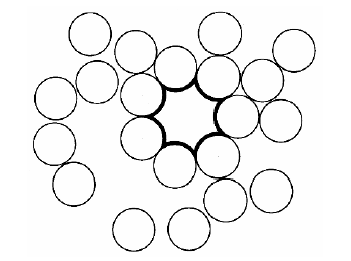

**Lösung bei EP:**
- Schrumpf im flüssigen Zustand
- Gesteuerte Härtungsfront
- Reinharzüberschuss auf Oberfläche

---

## Temperaturbereiche

| Anwendung | Tₘᵢₙ | Tₘₐₓ |
|-----------|------|------|
| Automobil Schalttafel | -40°C | +120°C |
| Automobil Außenhaut | -40°C | +80°C |
| Sportflugzeuge | -54°C | +72°C |
| Großflugzeuge | -55°C | +120°C |

---

## Sonnenerwärmung

**Einflussfaktoren:**
- Intensität der Sonnenstrahlung
- Oberflächenfarbe
- Neigung zur Sonne
- Wärmeableitung

**Schwarztafeln als Referenz:**
- Miami/Arizona: 50-70°C Maximaltemperatur
- Monatliche Schwankungen

---

## Farbeinfluss auf Temperatur

**Regressionsgleichungen**

- **Schwarz:** Bezugsfarbe
- **Blau:** T = 5,48 + 0,788·T$_{schwarz}$
- **Grün:** T = 2,24 + 0,861·T$_{schwarz}$
- **Rot:** T = 5,90 + 0,741·T$_{schwarz}$
- **Weiß:** T = 12,90 + 0,410·T$_{schwarz}$

**Beispiel Segelflugzeuge:** Weiße Lackierung reduziert Erwärmung um 16°C

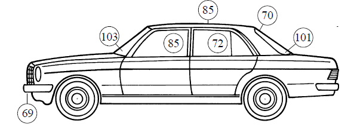

 
    Bild aus H. Schürrmann "Konstruieren mit Faser-Kunststoff-Verbunden"

---

## Glasübergangsbereich

**Zwei Zustandsbereiche:**
- **Energieelastisch** (T < T$_{g}$): glasartig, spröde
- **Entropieelastisch** (T > T$_{g}$): gummielastisch

**Änderungen bei T$_{g}$:**
- Steifigkeit (E, G) sinkt stark
- Festigkeit R sinkt
- Bruchdehnung ε steigt stark
- Wärmeausdehnungskoeffizient α steigt
- Maximale mechanische Dämpfung

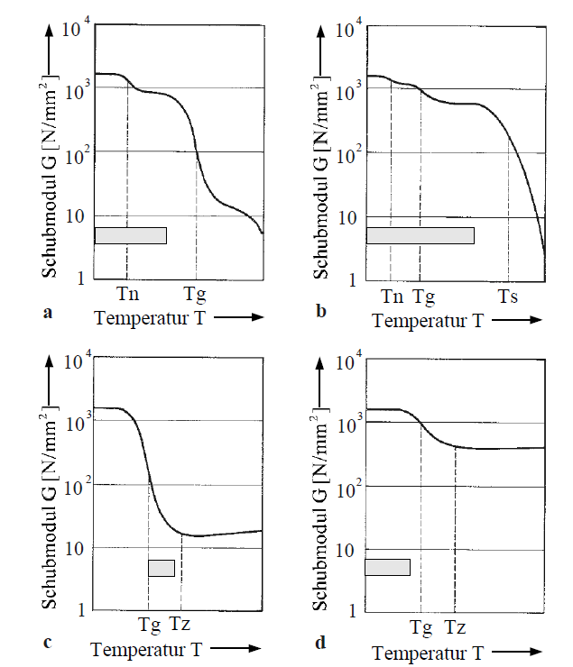

 
    Bild aus H. Schürrmann "Konstruieren mit Faser-Kunststoff-Verbunden"

---

## Bestimmung von T$_{g}$

**Zwei praktische Methoden:**

1. **T$_{g_{2\%}}$:** 2% Steifigkeitsabfall toleriert
2. **T$_{g_{Onset}}$:** Extrapolierter Beginn des Steilabfalls

**Auslegungsregel:**
$$T_{g,Onset} \approx T_{Einsatz,max} + 10...20°C$$

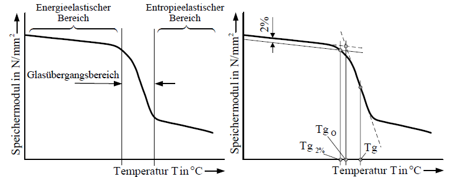

 
    Bild aus H. Schürrmann "Konstruieren mit Faser-Kunststoff-Verbunden"

---

## Wassereinfluss auf T$_{g}$

**Kritischer Effekt:**
- Feuchte senkt T$_{g}$ drastisch
- Bei niedrig-T$_{g}$-Harzen: bis -40°C
- Bei hoch-T$_{g}$-Harzen: bis -90°C

**Wichtig:**
- Qualifikation am aufgefeuchteten Polymer!
- Konditionierung 
- Feuchte erhöht freies Volumen

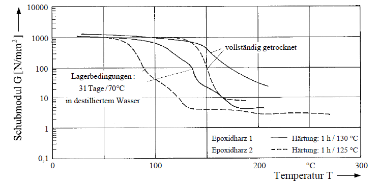

 
    Bild aus H. Schürrmann "Konstruieren mit Faser-Kunststoff-Verbunden"

---

## Bedeutung für Nachhärtung

**Temperung/Nachhärtung:**
- Oberhalb T$_{g}$ möglich
- Molekülumlagerungen leicht
- Maximaler Vernetzungsgrad angestrebt
- T$_{g}$ wächst während Nachhärtung

**Tempern wichtig für:**
- Maximale Vernetzung
- Maximale thermische Beanspruchbarkeit
- Optimale Chemikalienbeständigkeit

---

## Messverfahren für T$_{g}$

**1. DSC/DTA (Kalorimetrisch):**
- Spezifische Wärme cp
- 1-30 mg Probenmenge
- Schnell und einfach

**2. Dilatometer:**
- Thermischer Ausdehnungskoeffizient α
- Problem: Überlagerung durch Quellung/Schrumpf

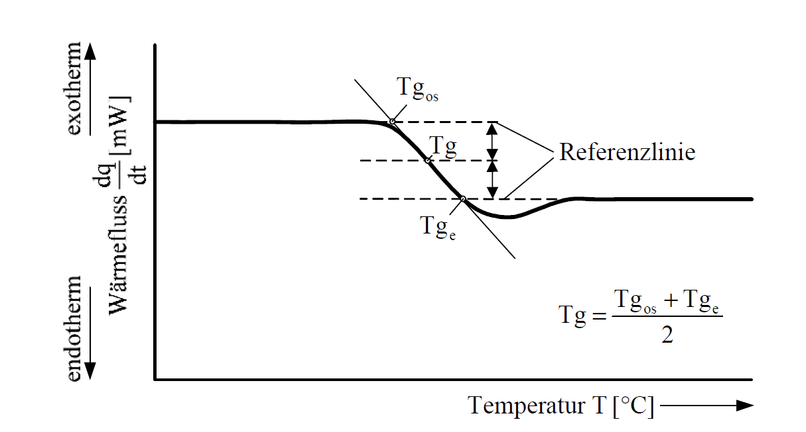

 
    Bild aus H. Schürrmann "Konstruieren mit Faser-Kunststoff-Verbunden"

---

**3. DMA (Dynamisch-mechanisch):**
- Torsionsschwingversuch
- G-T-Kurve und Dämpfung
- **Wichtigstes Verfahren!**

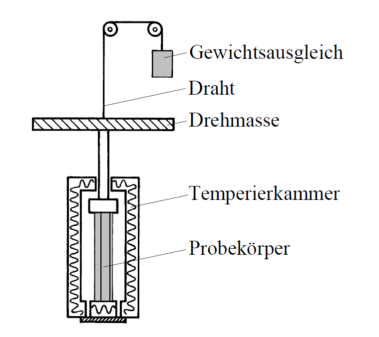

 
    Bild aus H. Schürrmann "Konstruieren mit Faser-Kunststoff-Verbunden"

---

**Wärmeformbeständigkeit:**
- Martens-Temperatur
- Heat Deflection Test (HDT)
- Vicat-Temperatur

**Prinzip:** Beschleunigte Kriechversuche

**Wichtig:** Übertragung der Ergebnisse nur bei ähnlichen Temperaturhöhen, Einwirkdauern und Spannungen

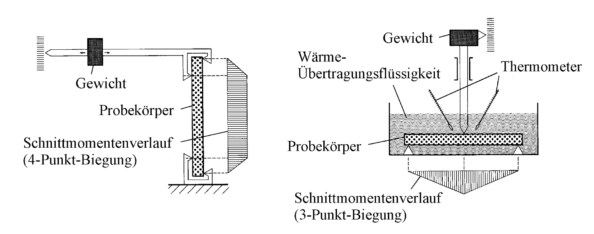

 
    Bild aus H. Schürrmann "Konstruieren mit Faser-Kunststoff-Verbunden"

---

## Belastbarkeit T > T$_{g}$

**Zugbelastung:** Auch oberhalb T$_{g}$ tragfähig
- Höhere Bruchdehnungen als bei 23°C
- Modellierung als reines Fasernetz (Netztheorie $\rightarrow$ Vorlesung Auslegung von Faserverbunden)

**Druckbelastung:** Kritisch!
- Niedrige Matrixsteifigkeit
- Unzureichende Faserstützung
- Frühzeitiges Faserknicken

$$R_{\perp\parallel}^- \propto G_m$$
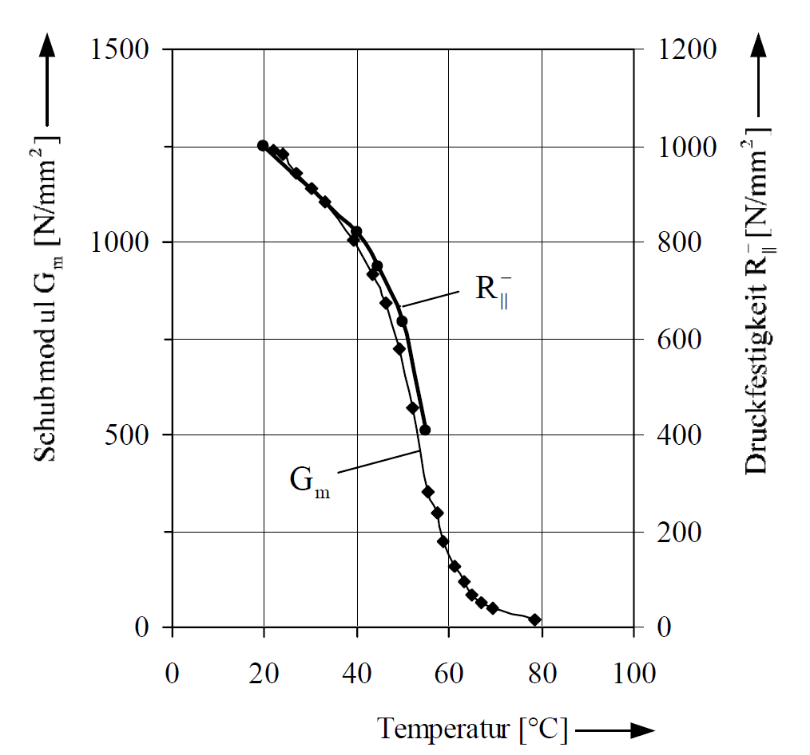

---

## Tiefe Temperaturen

**Günstig:**
- Steifigkeit und Festigkeit steigen
- Bei Duroplasten: ohnehin spröde, daher unkritisch
- Bei faserverstärkten Laminaten: quasi-plastisch

**Ungünstig:**
- Bei Thermoplasten: Verlust der Duktilität
- Versprödung
- Schlagzähigkeit sinkt

**Für Flugzeuge:** Nachweis bei tiefen Temperaturen notwendig

---

# Fertigungsanforderungen

**Wichtige Eigenschaften:**

1. **Fasertränkung** (Viskosität)
2. **Verarbeitungszeit** (Topfzeit/Gelierzeit)
3. **Härtungstemperatur und -zeit**
4. **Lagerzeit und -bedingungen**
5. **Arbeitsschutz und Toxizität**

---

## Fasertränkung

Entscheidend ist die **Viskosität**

**Für schnelle Tränkung:**
- Niedrige Viskosität
- Niedrige Tränkdrücke möglich
- Weite Tränkwege möglich
- Höherer Faservolumengehalt
    - kleinere Zwischenräume können befüllt werden
    - Widerstand gegen fließen ist geringer, d.h. die Aushärtung findet nicht ''auf dem Weg'' statt

---

**Viskositätssenkung:**
- Temperaturerhöhung (typisch)
- Maschinelle Verfahren

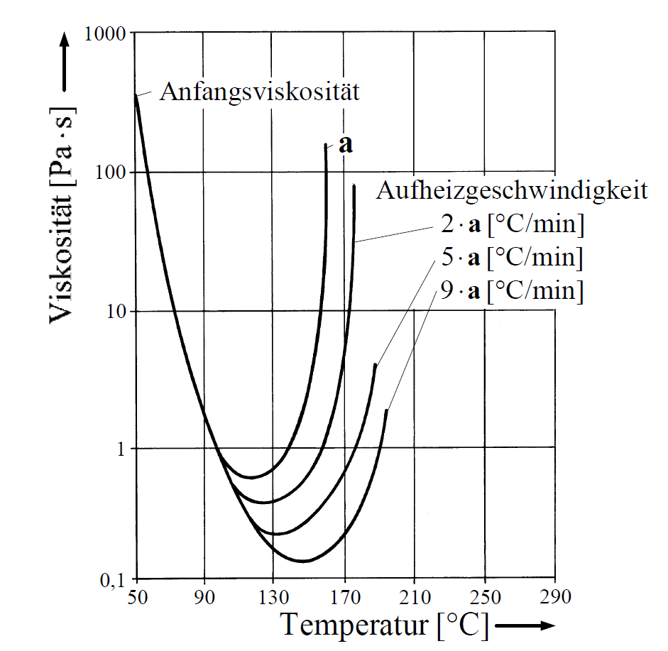

 
    Bild aus H. Schürrmann "Konstruieren mit Faser-Kunststoff-Verbunden"

---

## Tränkungsqualität

**Ziel:** Lufteinschlüsse vermeiden!

**Luftporen reduzieren Festigkeit:**
- Keine Kraftübertragung Faser-Matrix
- Kerben mit Spannungsspitzen
- Ausgangspunkt für Risswachstum

**Maßnahmen:**
- Vakuum ziehen
- Fließhilfen
- richtige Planung der Harzeinleitung

---

##  Lagerung

**Reaktionsharze:**
- Lagerzeit ca. 6 Monate
- Gefahrstofflager erforderlich
- FIFO-Prinzip
- Luftdicht verschließen
- Temperatur 15-25°C einhalten
- Typenvielfalt begrenzen!

---

**Thermoplaste:**
- Nahezu unbegrenzt lagerbar
- Sauber und trocken
- PA vor Verarbeitung trocknen

---

## Topfzeit und Gelierzeit

**Topfzeit:**
- Verarbeitungszeit nach Härterzugabe
- Abhängig von Temperatur
- Sommer: kürzere Topfzeit
- Niemals angeliertes Harz verarbeiten!

**Gelierzeit:**
- Viskosität steigt schlagartig
- Weiches Gel entsteht

**Wichtig:** Keine Bewegung während Gelierung!

---

## Nachhärten/Tempern

**Ziele:**
- Maximaler Vernetzungsgrad
- Maximale T$_{g}$
- Beste Chemikalienbeständigkeit
- Beste Alterungsbeständigkeit
- T$_{Lagerung}$ = 20 °C ; Nachhärtung T = 60−80 °C
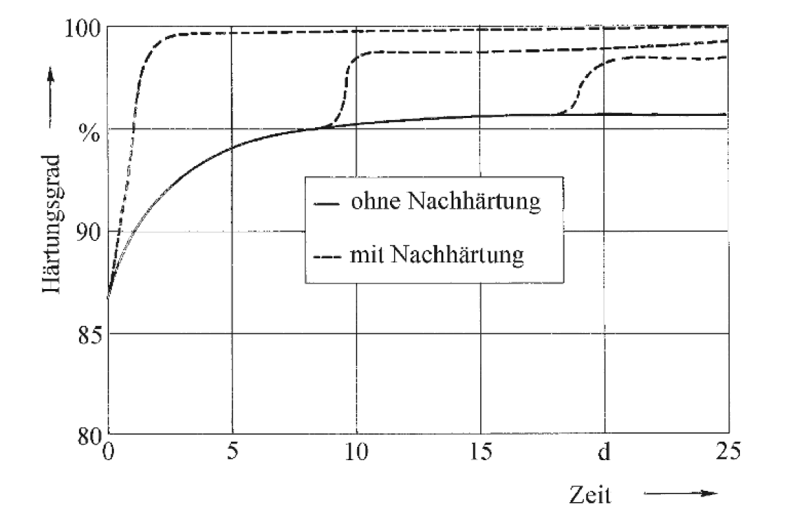

 
    Bild aus H. Schürrmann "Konstruieren mit Faser-Kunststoff-Verbunden"

---

**Regeln:**
- Nach abgeschlossener Gelierung
- Vorsichtiger Umgang vor Temperung
- Langsame Aufheizung
- Zeitnahe Temperung empfohlen
- Bei Sandwich: Thermoelement-Kontrolle

 
    Bild aus H. Schürrmann "Konstruieren mit Faser-Kunststoff-Verbunden"

---

## Arbeitsschutz

**Fasern:**
- Durchmesser 5-27 μm: nicht lungengängig; **außer wenn FKV gesägt werden**
- Mechanische Hautreizung möglich
- Einfache Schutzmaßnahmen ausreichend
- Keine erhöhte Krebshäufigkeit (Studien)

**UP-Harze:**
- Styrol-Emission: ~100g/m²·h bei 20°C
- Absaugung erforderlich
- Umweltharze mit Hautbildner

---

## Arbeitsschutz - EP-Harze

**Epoxidharze:**
- Bisphenol A/F: geringe Reizwirkung
- Sensibilisatoren!
- Niedermolekulare Typen kritisch

**Härter:**
- Aliphatische Amine: starke Reizstoffe
- Aromatische Amine: Organschäden möglich
- Anhydridhärter: Dämpfe >100°C

**Wichtig:** Sicherheitsdatenblätter studieren!

---

## Persönlicher Schutz

**Mindestregeln:**

- Schutzbrille tragen
- Orale Aufnahme vermeiden
- Hautkontakt vermeiden (Handschuhe!)
- Dämpfe nicht einatmen (Absaugung!)
- Staubschutzmaske bei Füllstoffen
- Nassbearbeitung bevorzugen
- Rauchen verboten
- Peroxide nie mit Beschleunigern mischen!

---

# Harzsysteme
## Ungesättigte Polyesterharze (UP)
## Epoxidharze (EP)

---

**UP-Harze - Allgemeines:**
- Mengenmäßig am häufigsten in FKV angewendet
- Polykondensation aus Dicarbonsäuren + Alkoholen
- Lösung in Monostyrol (~35-43%)
- Volumenschrumpf: 5-8% $\rightarrow$ ''Spring in''  + Verzug des Bauteils

**Anwendungen:**
- Boots- und Flugzeugbau
- Rohr- und Behälterbau
- Verkleidungsteile
- Polymerbeton

---

## UP-Harze - Eigenschaften

**Vorteile:**
- Sehr preisgünstig
- Gute Chemikalienbeständigkeit
- Variable Verarbeitungszeiten
- Rasche Härtung möglich
- Geringe Wasseraufnahme
- Breite Typenvielfalt

---

**Nachteile:**
- Mechanische Eigenschaften schlechter als EP
- Höherer Schrumpf als EP
- Greift PS- und PVC-Schäume an
- Oft inkompatibel mit C-Faser-Schlichte

---

## UP-Härte: Heißhärtung

**Peroxide als Härter:**
- Anspringtemperaturen:
  - Benzoylperoxid (BP): 70°C
  - MEKP: 80°C
  - CHP: 90°C
  - TBPB: 90°C
  - CUHP: 100°C

**Härtung:** T_Härtung ≈ T_Anspring + 20°C

**Faustregel:** +10°C → Reaktion 2× schneller

---

## UP-Härtung: Kalthärtung

**Standard-Rezepturen (20°C):**

**System 1 (Kobalt):**
- 100g Harz
- 2g MEKP-Härter
- 0,2ml Kobalt-Beschleuniger (1%)

**System 2 (Amin):**
- 100g Harz
- 3g BP-Paste
- 1ml Diethylanilin (10%)

**WARNUNG:** Peroxid und Beschleuniger nie direkt mischen!

---

## Vergleich Härtersysteme

**Ketonperoxid/Kobalt:**
- Langsamere Härtung
- Geringere Eigenspannungen
- Weniger Verzug
- Geringeres Vergilben
- Für Deckschichten bevorzugt
- T > 16°C erforderlich

---

**Benzoylperoxid/Amin:**
- Reaktiver
- Härtung bis 0°C
- Höhere Eigenspannungen
- Neigung zum Vergilben
- Geringerer Endhärtungsgrad

---

## UP-Harze - Oberflächenprobleme

**Problem:** Klebrige Oberfläche
- Styrol verdunstet oberflächennah
- Festigkeitsverlust

**Lösungen:**
1. Folienabdeckung
2. Geschlossene Verfahren (RTM)
3. Hautbildner (0,1% Paraffin)
4. Pudern mit Talkum
5. Lufttrocknende UP-Harze

**Lichthärtung:** Alternative Methode mit UV-Initiatoren

---

- UV-Initiatoren kann genutzt werden, in Fibre Placement Anlagen
- Härtung findet teilweise bei der Ablage der Fasern statt

---

## UP-Harze - Nachhärtung

**Empfohlen:**
- Nach abgeschlossener Kalthärtung
- T = 60-80°C, mehrere Stunden
- Besonders bei Kobalt-Beschleunigern

**Stufenhärtung (optimal):**
1. Kalthärtung mit Peroxid 1
2. Nachhärtung mit Peroxid 2 (höherer T_Anspring)

**Kontrolle:** Rest-Styrolgehalt oder DSC

---

## Epoxidharze

**EP-Harze - Allgemeines:**
- Standard für Hochleistungs-FKV
- Luft- und Raumfahrt, SporT$_{g}$eräte
- Basis: Bisphenol A
- Polyaddition (Härter eingebaut)
- Gelierung ab 50-70% Umsatz
- Volumenschrumpf: 2-5%

---

**Härtermechanismus:**
- Gelierung spät → Schrumpf in flüssiger Phase
- Nachfließen möglich
- Bessere Faser-Matrix-Haftung als UP

---

## EP-Harze - Typen

**Kalthärter (20°C):**
- Handlaminat
- Boots- und Sportflugzeugbau
- T$_{g}$ = 60-80°C
- Niedrige thermische Eigenspannungen

**Warmhärter (>80°C):**
- Höhere mechanische Festigkeiten
- Höhere T$_{g}$
- Bessere Chemikalienbeständigkeit
- Höhere thermische Eigenspannungen
- Oft zähmodifiziert (Flugzeugbau)

---

## EP-Harze - Eigenschaften

**Vorteile:**
- Geringe Reaktionsschwindung
- Maßgenau
- Ausgezeichnete Klebkraft
- Sehr gute Ermüdungsfestigkeit
- Exzellente elektrische Isolation

**Nachteile:**
- Teurer als UP-Harze
- Oft längere Härtungszeiten
- Stöchiometrisches Mischen erforderlich

---

## EP-Harze - Verarbeitung

- Stöchiometrisches Harz-Härter-Verhältnis!
- Sorgfältiges, langes Mischen
- Maschineller Rührer empfohlen
- Temperaturerhöhung nach Tränkung

**Exothermie beachten:**
- Bei großen Harzansätzen
- Wärmestau möglich
- Rauchentwicklung/Zersetzung
- Lösung: flache Gefäße, dünne Schichten

**Nachhärten:** Noch wichtiger als bei UP!

---

## Vinylesterharze

**VE-Harze - Position:**
- Zwischen UP und EP
- Basis: EP-Harze + Monocarbonsäuren
- Härtung wie UP-Harze

**Eigenschaften:**
- Zäher als UP
- Bessere Faser-Matrix-Haftung als UP
- Ausgezeichnete Chemikalienbeständigkeit

---

**Anwendungen:**
- Schwingend/schlagbeanspruchte Bauteile
- Rohr- und Chemieanlagenbau
- Kosteneffizienter EP-Ersatz

---

## Thermoplastische Matrices

**Probleme:**
- Hohe Schmelzviskosität (Faktor 100-200 vs. Duroplaste)
- Tränkung nur mit hohem Druck/Scherung
- Hohe Verarbeitungstemperaturen
- Höhere Kriechneigung
- Stützwirkung bei Faserdruck kritisch
- Amorphe: ungenügende Lösungsmittelbeständigkeit

---

## Thermoplaste - Vorteile

**Chancen:**
- Deutlich höhere Schlagzähigkeit
- Unbegrenzte Lagerzeiten
- Einfache Arbeitshygiene
- Nachträgliches Umformen möglich
- **Schweißbar** (induktiv, Ultraschall, Laser)
- **Vollständiges Recycling möglich!**

**Wichtigste Matrices:**
PP, PBT, PET, PA (Tab. 4.4, 4.5, 4.6)
Hochtemperatur: PPS, PEEK, PSU, PEI

---

## Thermoplaste - Daten Übersicht

| Polymer | E [N/mm²] | Rm [N/mm²] | ε [-] |
|---------|-----------|------------|-------|
| PP | 1140-1550 | 31-40 | 1-6 |
| PA 6.6 | 1600-3700 | 75-94 | 0,15-0,6 |
| PEEK | 3100-3800 | 92-103 | 0,11-0,5 |

| Polymer | T$_{g}$ [°C] | Ts [°C] | HDT [°C] |
|---------|---------|---------|----------|
| PP | -27 | 163-176 | 45-120 |
| PA 6.6 | 47-80 | 265 | 190-240 |
| PEEK | 140-145 | 340 | 152 |

---

# Vielen Dank für Ihre Aufmerksamkeit!

**Kontakt:**
Prof. Dr.-Ing. Christian Willberg
Hochschule Magdeburg-Stendal

**Literaturhinweise:**
- Helmut Schürrman "Konstruieren mit Faserverbundwerkstoffen"

