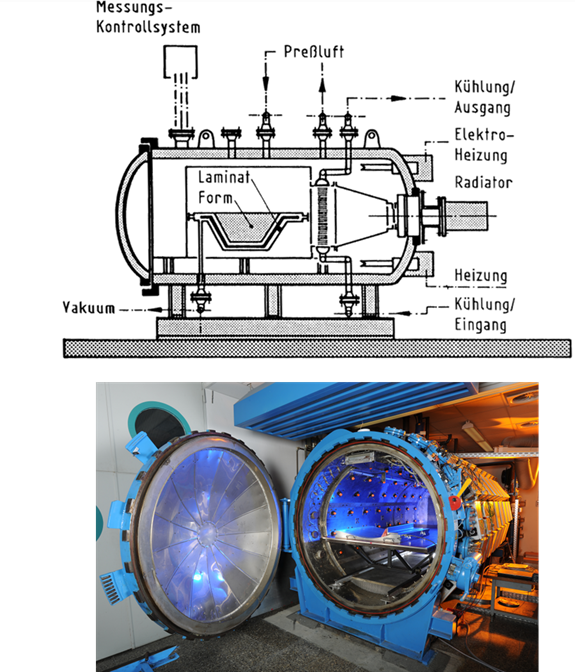

<!-- _class: lead -->

# Fertigungsverfahren

Prof. Dr.-Ing. Christian Willberg
Hochschule Magdeburg-Stendal

---

<!-- _class: lead -->

 
    Bild aus M. Wiedemann "Systemleichtbau
für die Luftfahrt"

---

<!-- _class: cols-2-1 -->

# Wahl des Verfahrens

**Hängt ab von**
- der konkreten Anwendung
- den Einsatzbedingungen des Bauteils
- den Besonderheiten von Fasern und Matirx
- den verfügbaren Fertigungsmitteln
- der Stückzahl

wesentliche **Auswahlkriterien**
- Funktionstüchtigkeit
- Betriebsicherheit
- vertretbare Kosten
- Umweltanforderungen (Recyclingquote, etc.)

---

# Formwerkzeug

- Faser und Matrix werden meist auf Formwerkzeugen ausgehärtet
- Material ist beliebig: Gips, Holz, Kunststoffen, Metalle, Faserverbunde, ...
- Erster Schritt: Erstellen eines Urmodells
    - hat detailgetreu die äußere Form des zu produzierenden Bauteils
    - ist in der Regel weder thermisch noch mechanisch belastbar 
- Urmodel ist Vorlage / Schablone für das eigentliche Formwerkzeug

---

# Urmodelle mit Strakschablonen

 
    Bild entmommen aus der Vorlesung "Leichtbau mit Faserverbunden" SS2008 von Prof. Dr.-Ing. Klaus Rohwer"

---

 
    Copyright DLR

---
## Formwerkezeuge aus Verbundwerkstoffen
- geringes Gewicht
- schnelle und gleichmäßige Aufheizung
- geringe Wärmekapazität
- Thermaldehungen, die mit dem Bauteil kompatibel sind

---

 
    Bild entmommen aus der Vorlesung "Leichtbau mit Faserverbunden" SS2008 von Prof. Dr.-Ing. Klaus Rohwer"

---

## Formwerkzeuge aus Metall

- bestehen häufig aus einer stabilen Unterstruktur und einem Oberteil, dass die Kontur festlegt
- gewünschte Kontur kann durch Umformenverfahren angenähert werden
- Justiermechanismen wie Schrauben können vorgesehen sein

---

## Kernwerkzeuge für Wickeltechnologie
- Wickeln von Behältern immer auf Kernwerkzeugen
- Bleibt als Innenauskleidung in den Behältern

oder

- wird nachträglich entfernt durch
    - chemische Zersetzung
    - Aufschmelzen
    - mechanische Demontage
- Kerne können auch teilweise erhlten bleiben

---

# Ablegen von Vorprodukten

---

# Aushärten von Vorprodukten

---

## Fertigungsverfahren
### Handlaminarverfahren

- nach Auftragen von Trennfilm/Gelierschicht wird eine Schicht flüssiges Harz auf das Formwerkzeug aufgetragen, gefolgt von der ersten Faserschicht
- gleichmäßiges Verteilen des Harzes und Entfernung von Lufteinschlüssen durch Rollen und Bürsten
- Wiederholung bis Laminatdicke erreicht ist
- älteste und einfachste Methode
- für kleine und einfache Bauteile eine bewährte Methode
- verwendete Harze härten bei Raumtemperatur

---

### Vor- und Nachteile
- minimale technische Aufwendung
- bei Einzelfertigung einfache Holz-, Gips- oder Pappformen
- Aushärtung bei Raumtemperatur ohne Druckanwendung
- Faservolumenanteil von 30 - 40\% erreichbar
- bescheidene mechanische Eigenschaften und geringe Temperaturbeständigkeit

---

## Vakuumsackverfahren 

- Schichtstapel wird mit luftdichter Membran abgedeckt
- Evakuierung bewirkt gleichmäßige Verdichtung
- Druck wird während der Aushärtung beibehalten
- Bauteile haben Faservolumengehalte von 40 - 50\% und beidseitig glatte Oberflächen
- Kosten urch höherwertige Formwerkzeugen und Vakuuminstallationen

---

 
    Bild entmommen aus der Vorlesung "Leichtbau mit Faserverbunden" SS2008 von Prof. Dr.-Ing. Klaus Rohwer"

---

## Autoklavverfahren
- Autoklaven sind Behälter mit Regelung von Druck und Temperatur

---

### Laminataufbau im Autoklaven
*oben*

- Vakuumdichte Abdeckmembrane
- Gewebelage zum Absaugen von Lufteinschlüssen (breather)
- perorierte Folie
- Gewebelagen (bleeder) zum Auffangen des Harzüberschusses beim Verdichten
- optional Abreißgewebe (peel ply) für saubere Oberfläche
- Laminatlagen
- optional Abreißgewebe (peel ply) für saubere Oberfläche
- Trennfilm
- Formwerkzeug

*unten*

---

 
    Bild entmommen aus der Vorlesung "Leichtbau mit Faserverbunden" SS2008 von Prof. Dr.-Ing. Klaus Rohwer"

---

- Abreißgewebe sind harzdurchlässig und nicht klebend
- Auffang- und Absauggewebe sind meist Glasfasergewebe
- Evakuierung der Luft under der Membrane
    - zur Verdichtung des Laminats
    - zum Auffangen des überschüssigen harzes
    - Entfernung von Lufteinschlüssen

---
### Aushärtezyklus
- bessere Vernetzung des Matrixharzes bei erhöhter Temperatur und erhöhtem Druck
- Optimaler Verlauf von Druck und Tempertur hängt ab von
    - Art des Harzes oder Prepregs
    - dem Abmessungen des Bauteils
    - den gestellten Anforderungen
- übliche Drücke 6 - 8 bar
- übliche Temperaturen 120 - 180 °C
- Faservolumengehalte von 60 - 70\%

---

 
    Bild entmommen aus der Vorlesung "Leichtbau mit Faserverbunden" SS2008 von Prof. Dr.-Ing. Klaus Rohwer"

---
### Nachbehandlung
- Auffang- und Absauggewebe wird entfernt 
- Abreißgewebe bleibt als Oberflächenschutz erst einmal erhalten
- Nachhärten bei etwas höherer als der Aushärtetemperatur (erhöht den Vernetzungsgrad und die Temperaturbeständigkeit, bei etwas spröderer Matrix)
- die Gewebe sind Abfall und sind daher Kosten und umweltschädigend

---

## Resin Transfer Molding (RTM) Verfahren

- Formwerkzeuge für RTM-Verfahren
    - steife Ober- und Unterhälfte
    - steife Unterhälfte und Vakuumaufbau
- Abgelegt wird trockenes Fasermaterial (Nasstechnologie):
Gelege, Matten, Gewebe, Gestricke
- Wenn starr: 
    - Formhäften werden geschlossen und Ränder abgedichtet
    - Durch Zuleitungen wird flüssiges Harz in den Hohlraum gepumpt
- Vakuum
    - Durch Zuleitungen wird flüssiges Harz in den Hohlraum "gezogen"

---

- weitere Rohrleitungen dienen zu Abführung des überschüssigen Harzes
- Faservolumengehalt 40 - 50% (starr); Vakuumfolie >60\%

---

 
    Bild aus M. Wiedemann "Systemleichtbau
für die Luftfahrt"

---

## Pressverfahren

- Faservolumengehalt 65\%

---

## Expansionsverfahren

---

## Spritzgussverfahren (Resin Injection Molding, RIM)

---

## Wickelverfahren

---

## Strangziehverfahren (Pultrusion)

---

## Automated Fibre Placement

---

# Nachbearbeitung von Verbundbauteilen

---

# Automatisierung des Fertigungsablaufs

