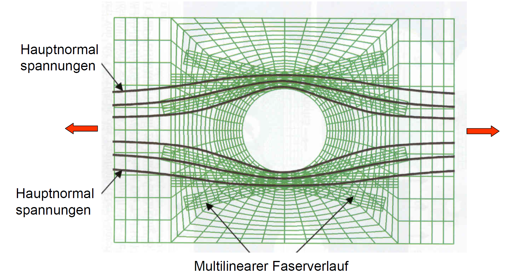
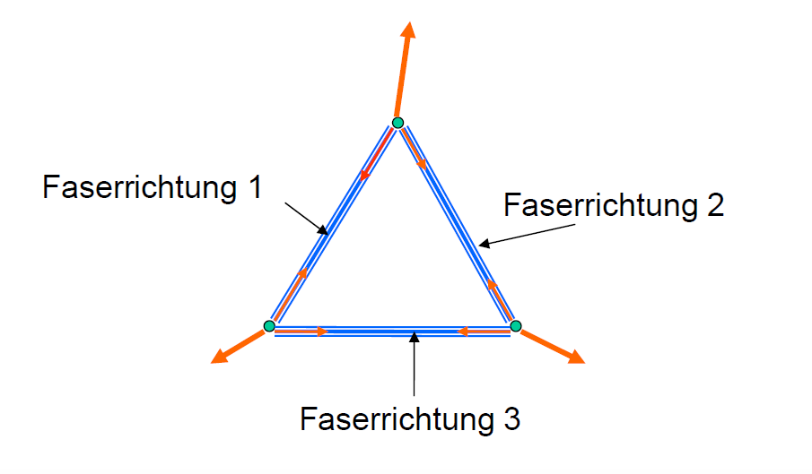
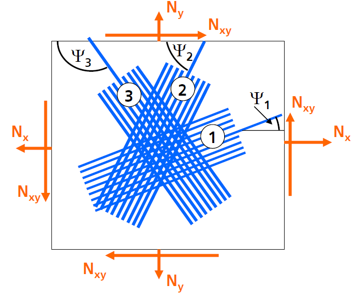
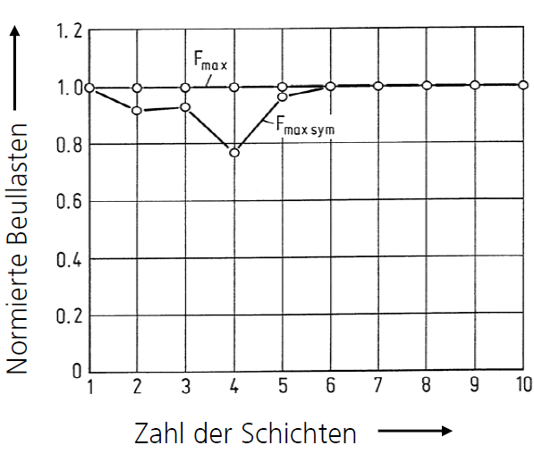
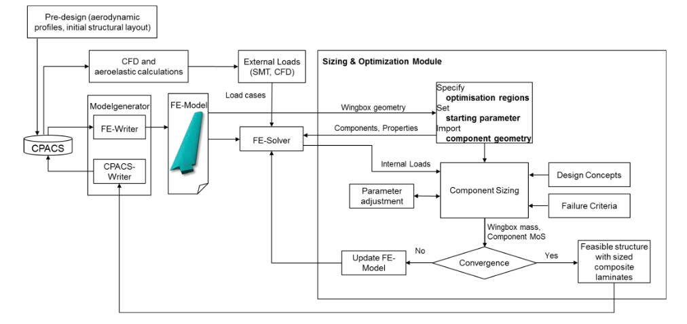
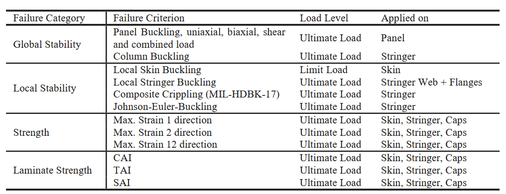
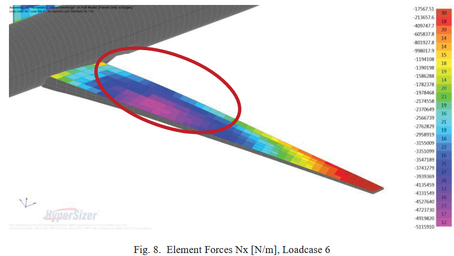

<!-- _class: lead -->

# Auslegung von Faserverbunden


Prof. Dr.-Ing. Christian Willberg
Hochschule Magdeburg-Stendal


---

<!-- _class: lead -->


## Ziel

- Auslegung beinhaltet immer eine gewisse Optimierung
Die Struktur wird so dimensioniert, dass sie die voraussichtlich auftretenden Lasten mit einer festgelegten Sicherheit trägt
- zusätzlich sind Fertigungs-, Operations-, etc.-gesichtspunkte zu betrachten
- die optimale Dimensionierung erhält man durch systematische auotmatisierte Strukturoptimierung
Für die Auslegungsphase in der Regel zu aufwändig
- gefragt sind einfache Verfahren, die
   - nicht unbedingt das exakte Optimum erreichen
   - schnell sind

---

# Einfache Auslegungsverfahren
- Annahmen
   - UD Einzelschichten werden verwendet
   - Faser und Matrixmaterial und Faservolumengehalt sind vorab festgelegt
   - Anzahl, Dicke und Faserrichtung der Schichten werden bestimmt

- 5 Verfahren
   - Auslegung nach Hauptspannungen
   - Auslegung nach der Netztheorie
   - Auslegung nach Steifigkeit
   - Auslegung mittels Ranking


---

# Auslegung nach Hauptspannungen
## Vorgehen
- Ausrichten der Fasern in Richtung der Hauptspannung
- Wahl der Schichtdicke deart, dass Festigkeit bei ausreichend Sicherheit erfüllt ist

## Vorteile
- Optimales Ausnutzen der Tragfähigkeit
## Nachteile
- nur ein Lastfall möglich
- schwierig zu fertigen -> Nachführen der Faserrichtung ist schwierig
---
# Auslegung nach Hauptspannungen
## Rechenbeispiel
- Bestimmung der Membranschnittkräfte

$$\mathbf{N}=\begin{bmatrix} N_x=600 N/mm\\
N_y = 100 N/mm\\
N_{xy}=60N/mm
\end{bmatrix}$$
- Bestimmung der Hauptnormalspannungen für den ebenen Spannungszustand

$$N_{1,2}=\frac{N_x+N_y}{2}\pm\sqrt{\frac{(N_x-N_y)^2}{4}+N_{xy}^2}$$

$$N_{1}=607N/mm\qquad \text{und}\qquad N_{2}=93N/mm$$

---
# Auslegung nach Hauptspannungen


- Bestimung der Richtung der Hauptnormalspannungen

$$\tan 2\Psi = \frac{2N_{xy}}{N_x-N_y} = 120/500=0.24$$

$$\Psi \approx 7°$$

- Faserrichtung $7°$ und $-83°$

---

# Auslegung nach Hauptspannungen
## Materialauswahl
- CFK UD Gelege mit Faservolumenanteil $\varphi = 60\%$
- Schichtdicke $d=0.125 mm$
- Zugfestigkeit $R_L^{(+)}=1300 N / mm^2$
- Sicherheit gegen Bruch $S_B = 2.0$
## Bestimmung erforderlichen Lagenzahl
7° Richtung: $2.0\cdot 607/1300=0.93mm$
-83° Richtung: $2.0\cdot 93/1300=0.14mm$
**Gewählte Auslegung**
7° Richtung: 8 Schichten / Lagen ergeben 1.0 mm > 0.93mm
-83° Richtung: 2 Schichten / Lagen ergeben 0.25 mm 0.14 mm

---
# Auslegung nach Hauptspannungen
## Probleme
- zwei Fasern ergeben kein statisch bestimmtes System, d.h. für beliebige Belastungen müssen mindestens **drei** Faserrichtungen betrachtet werden
- Nachführen der Fasern auf der Linie der Hauptnormalspannungen ist praktisch kaum möglich
- bei kleineren Störungen bei ansonsten geraden Verlauf der Hauptspannungslonien kann man stückweise gerade Pflaster aufbringen
- Scheibe mit Loch ''auswechseln''

---
# Gelochte Scheibe unter gleichmäßiger Zugbelastung



<div style="position: absolute; bottom: 10px; left: 120px; color: black; font-size: 20px;"> 
    Bild entmommen aus der Vorlesung "Leichtbau mit Faserverbunden" SS2008 von Prof. Dr.-Ing. Klaus Rohwer"
</div>

---

# Auslegung nach Netztheorie
## Annahmen
- Alle Kräfte werden durch Fasern aufgenommen
- die Matrix hält die Fasern in ihrer Position, keine Schub- und Quersteifigkeitsbeitrag
- Steifigkeiten des Laminats nach der Netztheorie sind etwa 10\% geringer als nach der Schichtentheorie
- Experimente bestätigen die Werte der Schichtentheorie
- Netztheorie nur noch für Sonderfälle aktuell
   - Berechnung der Bruchfestigkeit wenn Matrix versagt -> ultimate strength
   - Auslegung von Laminaten

---
# Auslegung nach Netztheorie
## Vorgehensweise
- Vorgabe von drei Faserrichtungen
- Bestimmung der Beanspruchungen in den Faserrichtungen
- Berechnung der Schichtdicken derart, dass
die Beanspruchung / Tragfähigkeit in der jeweiligen Faserrichtung zu einer ausreichenden Sicherheit führt

---
# Auslegung nach Netztheorie
- Aufteilung der Kräfte auf die drei Faserrichtungen
- Kreuzungspunkte sind reibungsfrei Verbindungen




<div style="position: absolute; bottom: 10px; left: 120px; color: black; font-size: 20px;"> 
    Bild entmommen aus der Vorlesung "Leichtbau mit Faserverbunden" SS2008 von Prof. Dr.-Ing. Klaus Rohwer"
</div>

---
# Auslegung nach Netztheorie
## Rechenbeispiel

- Bestimmung der Membranschnittkräfte

$$\mathbf{N}=\begin{bmatrix} N_x=600 N/mm\\
N_y = 100 N/mm\\
N_{xy}=60N/mm
\end{bmatrix}$$

- Wahl der Faserrichtungen: $\Psi_1=0°$, $\Psi_2=+45°$, $\Psi_3=-45°$

- Bestimmung der Lastanteile $\mathbf{N}_1$, $\mathbf{N}_2$, $\mathbf{N}_3$

---


## Aufteilung der Kräfte auf die drei Faserrichtungen

$$N_x=\sum_{i=1}^3\cos^2\Psi_i N_i$$
$$N_y=\sum_{i=1}^3\sin^2\Psi_i N_i$$
$$N_{xy}=\sum_{i=1}^3\sin\Psi_i\cos\Psi_i N_i$$


<div style="position: absolute; bottom: 10px; left: 120px; color: black; font-size: 20px;"> 
    Bild entmommen aus der Vorlesung "Leichtbau mit Faserverbunden" SS2008 von Prof. Dr.-Ing. Klaus Rohwer"
</div>

---
## Mohrsche Transformation

$\begin{aligned}
N_x &= N_i \cdot \underbrace{\cos\Psi_i}_{\text{Kraft in x}} \cdot \underbrace{\cos\Psi_i}_{\text{Fläche}} \\
N_y &= N_i \cdot \underbrace{\sin\Psi_i}_{\text{Kraft in y}} \cdot \underbrace{\sin\Psi_i}_{\text{Fläche}} \\
N_{xy} &= N_i \cdot \underbrace{\sin\Psi_i}_{\text{Kraft in y}} \cdot \underbrace{\cos\Psi_i}_{\text{Fläche}} 
\end{aligned}$


---

$\begin{array}{lll}
\text{Faserwinkel 0°:}   & \sin(0°) = 0 & \cos(0°) = 1\\
\text{Faserwinkel +45°:} & \sin(+45°) = \frac{\sqrt{2}}{2} & \cos(+45°) = \frac{\sqrt{2}}{2}\\
\text{Faserwinkel -45°:} & \sin(-45°) = -\frac{\sqrt{2}}{2} & \cos(-45°) = \frac{\sqrt{2}}{2}
\end{array}
$

$
\begin{bmatrix}
N_x\\
N_y\\
N_{xy}
\end{bmatrix} = \begin{bmatrix}
1& 1/2 & 1/2\\
0& 1/2 & 1/2\\
0& 1/2 & -1/2\\
\end{bmatrix} \begin{bmatrix}
N_1\\
N_2\\
N_3
\end{bmatrix}
$
invertieren
$
\begin{bmatrix}
N_1\\
N_2\\
N_3
\end{bmatrix} = \begin{bmatrix}
1& -1 & 0\\
0& 1 & 1\\
0& 1 & -1\\
\end{bmatrix} \begin{bmatrix}
N_x\\
N_y\\
N_{xy}
\end{bmatrix}
$

---

$\begin{array}{lll}
\text{Faserwinkel 0°:}   & N_1 = 600-100 = 500 N/mm\\
\text{Faserwinkel +45°:} & N_2 = 100+60=160N/mm\\
\text{Faserwinkel -45°:} & N_3 = 100 -60 = 40 N/mm
\end{array}
$

---

# Auslegung nach Netztheorie

## Materialauswahl
- CFK UD Gelege mit Faservolumenanteil $\varphi = 60\%$
- Schichtdicke $d=0.125 mm$
- Zugfestigkeit $R_L^{(+)}=1300 N / mm^2$
- Sicherheit gegen Bruch $S_B = 2.0$
## Erforderliche Schichdicken
$\begin{array}{lll}
\text{Faserwinkel 0°:}   & 2\cdot 500/1300 = 0.77mm\\
\text{Faserwinkel +45°:} & 2\cdot 160/1300 = 0.25mm\\
\text{Faserwinkel -45°:} & 2\cdot 40/1300 = 0.06mm
\end{array}$

---

**Gewählte Auslegung**
$\begin{array}{lll}
\text{Faserwinkel 0°:}   & \text{7 Schichten ergeben  0.875 mm>0.77 mm}\\
\text{Faserwinkel +45°:} & \text{2 Schichten ergeben  0.25 mm}\\
\text{Faserwinkel -45°:} & \text{7 Schichten ergeben  0.25 mm>0.06 mm}
\end{array}$

---

# Auslegung nach Netztheorie, Fazit

- Kräfte werden primär von Fasern aufgenommen
   - geringe Verzerrung des Verbunds
   - geringe Beanspruchung der Matrix
- einfache Auslegungsprozedur
- Auslegung auf drei Schichten begrenzt
- gilt nur für einen Lastfall
- nur für Membranbeanspruchung geeignet

---
# Auslegung nach Steifigkeit
## Vorgehensweise
- Vorgabe von drei Faserrichtungen
- Festlegung der maximalen Verzerrungen mit ausreichender Sicherheit gegen Bruch
- Berechnung der Schichtdicke derart, dass geforderte maximale Verzerrung eingehalten wird

---


# Auslegung nach Steifigkeit


## Materialauswahl
- CFK UD Gelege mit Faservolumenanteil $\varphi = 60\%$
- Schichtdicke $d=0.125 mm$
- $E_L=150000 N / mm^2$
- $E_T = 8000 N/mm^2$
- $G_{LT} = 2800 N/mm^2$
 - $\nu_{LT} = 0.3$

---

## Materialgesetz - Membranverhalten

$
\begin{bmatrix}
N_x=600N/mm\\
N_y=100N/mm\\
N_{xy}=60N/mm
\end{bmatrix} = \begin{bmatrix}
A_{11}& A_{21} & A_{31}\\
A_{12}& A_{22} & A_{32}\\
A_{13}& A_{23} & A_{33}\\
\end{bmatrix} \begin{bmatrix}
\varepsilon_x=0.004\\
\varepsilon_y=0.004\\
\gamma_{xy}=0.004
\end{bmatrix}
$

**Membransteifigkeit**
$[A_{ji}] = \sum_k [Q_{ij}]_k\cdot t_k$

---

- Aus dem Materialgesetz ergibt sich
$\begin{array}{lll}
600/0.004   = 153135\cdot t_0 + 117463 \cdot t_{+45} + 46121 \cdot t_{-45}\\
100/0.004   = 10451\cdot t_0 + 117463 \cdot t_{+45} + 46121 \cdot t_{-45}\\
60/0.004   = 2800\cdot t_0 + 109827 \cdot t_{+45} - 32857 \cdot t_{-45}
\end{array}$
- Schichtdicken
$\begin{array}{lll}
t_{0} = 0.88mm \\ 
t_{+45} = 0.123mm\\
t_{-45} = 0.03mm
\end{array}$

**Gewählte Auslegung**
$\begin{array}{lll}
\text{Faserwinkel 0°:}   & \text{8 Schichten ergeben  0.875 mm>0.880 mm}\\
\text{Faserwinkel +45°:} & \text{1 Schichten ergeben  0.123 mm > 0.123 mm}\\
\text{Faserwinkel -45°:} & \text{1 Schichten ergeben  0.125 mm>0.03 mm}
\end{array}$

---
# Auslegung nach Steifigkeit
## Fazit
- einfache Auslegungsprozedur
- Auslegung auf drei Lagen begrenzt
- gilt nur für einen Lastfall
- kann auch für Biegebeanspruchung erweitert werden
   - dann Vorgabe des prinzipiellen Lagenaufbaus (Reihenfolge der Lage)
   - Vorgabe der Maximalen Verkrümmung

---
# Auslegung mittels Ranking
## Vorgehen
- Schichtzahl und mögliche Faserrichtung wählen
- Ausleungswert (Beullast, Reservefaktor, ...) für alle möglichen Anteilskombinationen ausrechnen
- **Rangfolge** aufstellen und Anteilskombination mit dem günstisten Auslegungswert feststellen
- Schichtdicke proportional so verändern, dass geforderte Sicherheit gerade eingehalten wird

---
## Ranking ohne Einschränkung
- Durchrechnen für alle möglichen Lagenaufbauten kann sehr auswendig sein

$\begin{array}{lll}
\text{n: Schichten}   \\
\text{r: Schichtausrichtungen} \\
\text{r}^{\text{n}}: \text{Lagenausbauten müssen untersucht werden}
\end{array}$

**Beispiel**

$$ n = 16$$
$$r = 4$$
$$r^n = 4^16 = 4294967296$$

- Festigkeiten oder Beullasten für über 4 Milliarden Laminate auszurechnen ist kein vertretbarer Aufwand
- Ranking ohne Einschränkung ist nicht praktikabel

---

## Ranking mit Einschränkung: Symmetrischer Lagenaufbau
- Aufwand wird reduziert, wenn nicht alle möglichen Variationen zugelassen werden
- Optimum wird ggf. verfehlt
- so wenig Zusatzbedingungen wir möglich, so viele wie nötig
- symmetrischer Lagenaufbau

$$ n = 16 -> 8$$
$$r = 4$$
$$r^n = 4^8 = 65536$$

- Häufig wird symmetrisch auslegt, um Koppeleffekte zu vermeiden (B Anteil in der ABD Matrix)

---

## Abweichung vom Optimum
- Beullast einer Kreiszylinderschale unter Axiallast R=250 mm, L=150 mm, t=0.25 mm
- Schichtrichtung so gewählt, dass Beullast maximal wird
- bei wenigen Schichten kann der Verlust an Tragfähigkeit mehr als 20\% betragen
- bei mehr als 5 Schichten ist kein Verlust der Tragfähigkeit zu erwarten




<div style="position: absolute; bottom: 10px; left: 120px; color: black; font-size: 20px;"> 
    Bild entmommen aus der Vorlesung "Leichtbau mit Faserverbunden" SS2008 von Prof. Dr.-Ing. Klaus Rohwer"
</div>

---

## Ranking mit Einschränkung: Sublaminate

- Sublaminat = ein Baustein des Gesamtlaminats
- für ein Sublaminat werden festgelegt: mögliche Schichtrichtungen, Anzahl der Schichten

Beispiel: 
- 16 Schichten, symmetrischer Aufbau, damit 8 Schichten wählbar  die  
- Symmetriehälfte aufgeteilt in zwei Sublaminate zu n = 4 Schichten
- r = 4 Schichtrichtungen
- $r^n = 4^4=256$ zu untersuchende Laminate
- Zahl der zu untersuchenden Laminate ist erheblich reduziert
- bei Biegebeanspruchung wird das Optimum wahrscheinlich weit verfehlt

---

Fazit: Für Laminate unter Biegeblastung ist die Festlegung von Sublaminaten zur Auslegung mittels Ranking nicht zulässig


---
## Ranking für Laminate unter Membranbeanspruchung
- für die Membranbeanspruchung ist die Reihenfolge der Lagen nicht von Belang
- symmetrischer Lagenaufbau wird vorrausgesetzt

**Nomenklatur** für Sublaminate unter Membranbeanspruchung


$\begin{array}{ll}
&\text{Beispiel}\\
[n_0,n_{90}, n_{+45}, n_{-45}]& \text{[4,2,1,1] heißt:}  \\
n_0 \text{ Schichten in 0°-Richtung} & \text{4 Schichten in 0°-Richtung}\\
n_{90} \text{ Schichten in 90°-Richtung}&\text{2 Schichten in 90°-Richtung}\\
n_{+45} \text{ Schichten in +45°-Richtung}&\text{1 Schicht in +45°-Richtung}\\
n_{-45} \text{ Schichten in -45°-Richtung}&\text{1 Schicht in -45°-Richtung}
\end{array}$

---
- Wenn das Laminat aus n Schichten besteht und r Schichtrichtungen möglich sind, muss gelten $n=\sum_r n_{\varphi_r}$
- gesucht sind die Schichtzahlen für jede Richtung r

---

# Ranking für Laminate unter Membranbeanspruchung

- Durchrechnen für alle Lagenaufbauten erfordert erträglichen Aufwand
- Für n Schichten und r mögliche Schichtrichtungen müssen 
$$\binom{n+r-1}{r-1}$$
Lagenaufbauten untersucht werden (Kombination mit Wiederholung)

**Beispiel:** 16 Schichten, symmetrisch: n=8, r=4 Schichtrichtungen
$$\binom{8+4-1}{4-1} = \binom{11}{3} = \frac{11 \cdot 10 \cdot 9}{1 \cdot 2 \cdot 3} = 165$$

→ 165 Laminate sind zu untersuchen

---

## Kombinationen mit Wiederholung ("Stars and Bars")

**Problem:** Wie viele Möglichkeiten gibt es, n=8 Schichten aus r=4 Faserrichtungen zu wählen?

**Kleine Beispiel:** n=3 Schichten, r=2 Richtungen (0° und 90°)
- [0°, 0°, 0°]
- [0°, 0°, 90°]  
- [0°, 90°, 90°]
- [90°, 90°, 90°]

→ 4 Kombinationen = $\binom{3+2-1}{2-1} = \binom{4}{1} = 4$ ✓

---

## Stars and Bars Interpretation

Stelle dir **8 Sterne** (Schichten) und **3 Trennbalken** (für 4 Gruppen) vor:
```
★★|★★★|★|★★
```

Bedeutet: 2× 0°, dann 3× +45°, dann 1× -45°, dann 2× 90°

**Lösung:**
- Verteile n+r-1 = 11 Objekte (8 Sterne + 3 Balken)
- Wähle r-1 = 3 Positionen für die Balken
- $\binom{11}{3} = 165$ Möglichkeiten

- Durchrechnen für alle Lagenaufbauten erfordert erträglichen Aufwand
- für n Schichten und r mögliche Schichtrichtungen müssen 

$$\begin{bmatrix}
n+r-1\\
r-1
\end{bmatrix}
$$
Lagenaufbauten untersucht werden (Kombination mit Wiederholung)

Beispiel: 16 Schichten, symmetrisch: n=8, r=4 Schichtrichtungen
$$\begin{bmatrix}
n+r-1\\
r-1
\end{bmatrix} = \begin{bmatrix}
8+4-1\\
4-1
\end{bmatrix} = \begin{bmatrix}
11\\
3
\end{bmatrix} = \frac{11 \cdot 10 \cdot 9}{1 \cdot 2\cdot 3}=165
$$
165 Laminate sind zu untersuchen


---

# Systematisch automatisierte Optimierung

---
# Dreisäulenkonzept der Optimierung
- **Strukturmechanisches Modell**
   - so einfach wie möglich
   - so genau wie nötig; gegenüber der Festigkeitsnachweise müssen Forderungen an die Genauigkeit mitunter erheblich reduziert werden, um die Rechenzeiten in Grenzen zu halten
- **Optimierungsmodell**
   - Festlegung vaiabler und vorgebener Paramater
   - Formulierung der Zielfunktion
   - Bestimmung der Restriktionen

---

# Dreisäulenkonzept der Optimierung

- **Optimierungsalgorithmen**
   - Charakter der Optimierung bestimmt eine günstige Rechenvorschrift
   - allgemeine Aussagen darüber, wann welcehr Algorithmus zu empfehlen ist, sind kaum möglich
   - Erfahrungen mit dem Probelm können Hinweise geben

---
DLRK Beispiel bringen

---

# Praxisbeipiel



<div style="position: absolute; bottom: 10px; left: 120px; color: black; font-size: 20px;"> 
    Bild entmommen aus der Bach, T.; Führer, T.; Willberg C. and Dähne, S. "Automated Sizing of a composite wing for the usage within a multi-disciplinary design process", 10.13140/2.1.3145.4406
</div>


---



<div style="position: absolute; bottom: 10px; left: 120px; color: black; font-size: 20px;"> 
    Bild entmommen aus der Bach, T.; Führer, T.; Willberg C. and Dähne, S. "Automated Sizing of a composite wing for the usage within a multi-disciplinary design process", 10.13140/2.1.3145.4406
</div>

---

- Optimierung passiert Ranking basiert
- update wird lokale auf Panelebene vorgegeben
- FEM wird dann genutzt, um aktualisierte Lastpfade abzuschätzen




<div style="position: absolute; bottom: 10px; left: 120px; color: black; font-size: 20px;"> 
    Bild entmommen aus der Bach, T.; Führer, T.; Willberg C. and Dähne, S. "Automated Sizing of a composite wing for the usage within a multi-disciplinary design process", 10.13140/2.1.3145.4406
</div>
