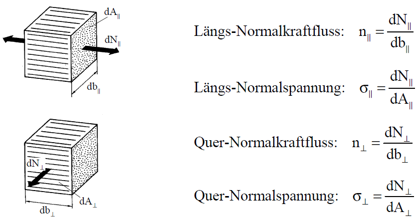
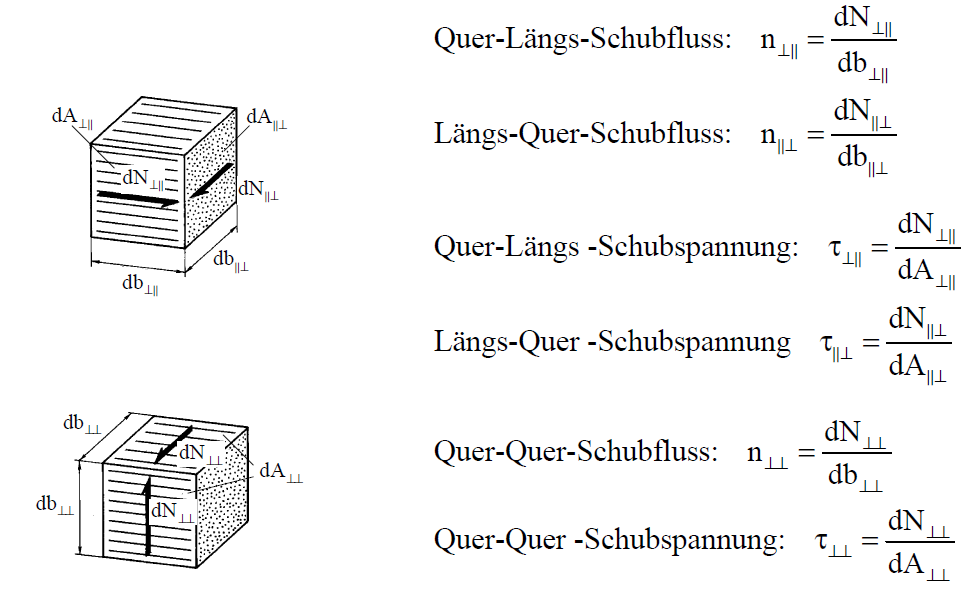
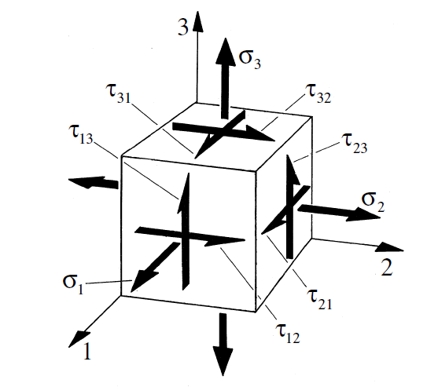
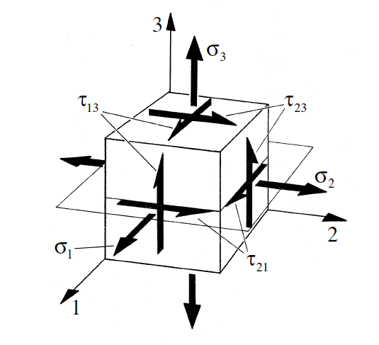
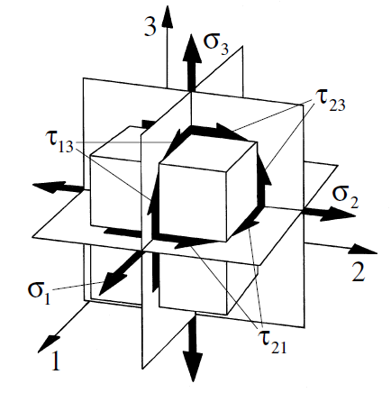
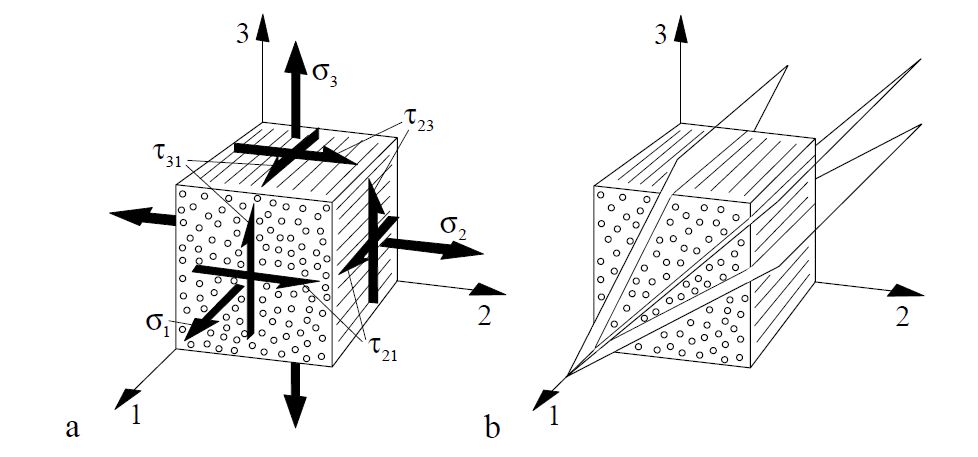
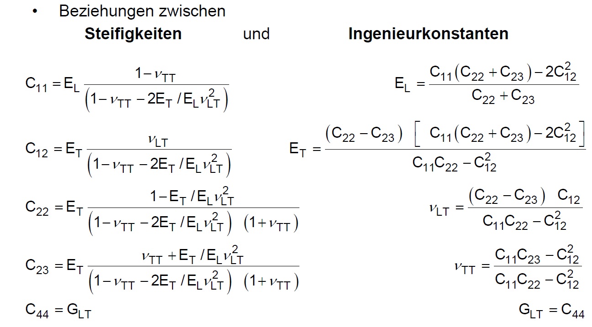

<!-- _class: lead -->
# Das lineare Elastizitätsgesetz der UD-Schicht
## Seminar Materialtheorie
Prof. Dr.-Ing. Christian Willberg
Hochschule Magdeburg-Stendal

---
# Motivation und Zielsetzung

**Problemstellung:**
- Laminattheorie ist statisch unbestimmt
- Gleichgewichtsbeziehungen allein reichen nicht aus
- Elasto-Statik erforderlich: Einbeziehung des Werkstoffgesetzes

**Strategie:**
- Werkstoffgesetz des Laminats aus Einzelschichten zusammensetzen
- Vorteil: Kosteneffiziente Laminat-Optimierung am Rechner
- Zwischenziel: Lineares Elastizitätsgesetz der UD-Schicht entwickeln

---
# Grundbegriffe: Spannungen und Flüsse

**Flüsse** (innere Streckenlasten):
$$n = \frac{dN}{db}$$

**Spannungen** (innere Flächenlasten):
$$\sigma = \frac{dN}{dA}$$

**Wichtig bei UD-Schichten:**
- Makromechanische Betrachtungsweise (homogenes Kontinuum)
- "Verschmieren" der Fasern
- Definition, nicht mikromechanische Realität!

---
# Spannungskomponenten

<!-- _class: cols-2-1 -->

**Normalspannungen und -flüsse:**
- Längs: $\sigma_{\parallel\parallel}$, $n_{\parallel\parallel}$, verkürzt $\sigma_{\parallel}$, $n_{\parallel}$
- Quer: $\sigma_{\perp\perp}$, $n_{\perp\perp}$, verkürzt $\sigma_{\perp}$, $n_{\perp}$

**Schubspannungen und -flüsse:**
- Quer-Längs: $\tau_{\perp\parallel}$, $n_{\perp\parallel}$
- Längs-Quer: $\tau_{\parallel\perp} = \tau_{\perp\parallel}$ (Momentengleichgewicht!)
- Quer-Quer: $\tau_{\perp\perp}$, $n_{\perp\perp}$

**Indizierung:**
1. Index: Normalenrichtung der Wirkfläche
2. Index: Richtung der Kraft/Spannung

Alternativen:

$\parallel$ - 1, x, L - parallel zur Faserrichtung
$\perp$ - (2, 3), (y, z), T - senkrecht zur Faserrichtung

---

 
    Bild aus H. Schürrmann "Konstruieren mit Faser-Kunststoff-Verbunden"

---

 
    Bild aus H. Schürrmann "Konstruieren mit Faser-Kunststoff-Verbunden"

---
# Verzerrungen

**Dehnungen:**
- Längsdehnung: $\varepsilon_{\parallel}$
- Querdehnung: $\varepsilon_{\perp}$

**Schiebungen:**
- $\gamma_{\perp\parallel}$, $\gamma_{\perp\perp}$

**Oberbegriff:** Verzerrungen

**Hinweis:** Negative Dehnungen = Stauchung

---
# Querkontraktionszahl (Poisson's Ratio)

**Definition:**
$$\nu_{\text{quer,längs}} = -\frac{\varepsilon_{\text{quer}}}{\varepsilon_{\text{längs}}}$$

**Indizierung (deutsch):**
- 1. Index: Wirkung (Richtung der Querdehnung)
- 2. Index: Ursache (Richtung der primären Dehnung)

**UD-Schicht hat drei Querkontraktionszahlen:**
$$\nu_{\perp\parallel}, \quad \nu_{\parallel\perp}, \quad \nu_{\perp\perp}$$

**Achtung:** In amerikanischer Nomenklatur oft umgekehrte Reihenfolge!

---
## Elastizitäts- und Schubmoduln

**Bei einachsiger Normalbeanspruchung:**
- Elastizitätsmodul: $E$ (Young's modulus)

**Bei Schubbeanspruchung:**
- Schubmodul: $G$ (shear modulus)

**UD-Schicht benötigt:**
- 2-3 Elastizitätsmoduln: $E_{\parallel}$, $2 \times E_{\perp}$
- 2-3 Schubmoduln: $G_{\perp\parallel}$, $2\times G_{\perp\perp}$
- 3 Querkontraktionszahlen: $\nu_{\perp\parallel}$, $\nu_{\parallel\perp}$, $\nu_{\perp\perp}$
- Parameter 13 und 23 werden oft gleichgesetzt

---
## Koordinatensystem

- 1 oder x enspricht der Faserrichtung
- 2 oder y entspricht der zweiten Faserebenenrichtung
- 3 oder z enspricht der out-of-plane Richtung

**Internationale Notation:**
- Koordinatenrichtungen: 1, 2, 3
- Besser für Matrizenrechnung und Programmierung
- Standard in FE-Software

---

# Vorzeichenregelung

<!-- _class: cols-2-1 -->

**Spannungen und Flüsse:**
- Positiv: auf positiven Schnittebenen in positive Richtung
- Zug: "+" ($\sigma^+$)
- Druck: "−" ($\sigma^-$)

**Verzerrungen:**
- Positive Spannungen → positive Verzerrungen
- Positive Dehnung → Verlängerung
- Negative Dehnung → Verkürzung

**Schubspannungen:**
- Meist ohne "+/−" Indizierung
- Bei Festigkeitsbetrachtungen: Wirkrichtung beachten!

---
# Definitionen: Elastisch und Linear

<!-- _class: cols-2-1 -->

**Elastisch:**
- Be- und Entlastungszyklus ohne bleibende Verformung
- **Ideal elastisch:** Unmittelbare Reaktion ohne Zeitverzögerung
- Verformungsarbeit vollständig als elastische Energie gespeichert

**Linear elastisch:**
- Proportionalität zwischen Spannungen und Verzerrungen
- Zusammenhang durch Konstante gegeben

**Wichtig:**
- Lineares, ideal elastisches Verhalten ist ein Sonderfall!
- Nichtlineares Verhalten oft stückweise linearisiert

---
<!-- _class: lead -->

# Einordnung des Elastizitätsgesetzes

---
# Allgemeiner 3D-Spannungszustand

**9 Spannungskomponenten:**
- 3 Normalspannungen: $\sigma_1, \sigma_2, \sigma_3$
- 6 Schubspannungen: $\tau_{23}, \tau_{32}, \tau_{13}, \tau_{31}, \tau_{12}, \tau_{21}$

**Momentengleichgewicht:**
- Schubspannungen paarweise zugeordnet
- Reduziert auf 6 unabhängige Spannungen

---
## Vollständige Anisotropie

**Allgemeiner Fall:**
- 6 Spannungen
- 36 Konstanten in Elastizitätsmatrix

**Symmetrie der Matrix:**
- $S_{ij} = S_{ji}$ (Maxwell-Betti)
- Reduziert auf **21 unabhängige Konstanten**

**Besonderheit:**
- Dehnungs-Schiebungs-Koppelungen
- Normalspannungen erzeugen auch Schiebungen
- Schubspannungen erzeugen auch Dehnungen

---

# Spannungsdehnungsbeziehung

Spannungen = Steifigkeitsmatrix * Dehnungen

$$\begin{bmatrix} \sigma_{11} \\ \sigma_{22} \\ \sigma_{33} \\ \sigma_{23} \\ \sigma_{13} \\ \tau_{12} \end{bmatrix} = 
\begin{bmatrix}
C_{11} & C_{12} & C_{13} & C_{14} & C_{15} & C_{16} \\
C_{21} & C_{22} & C_{23} & C_{24} & C_{25} & C_{26} \\
C_{31} & C_{32} & C_{33} & C_{34} & C_{35} & C_{36} \\
C_{41} & C_{42} & C_{43} & C_{44} & C_{45} & C_{46} \\
C_{51} & C_{52} & C_{53} & C_{54} & C_{55} & C_{56} \\
C_{61} & C_{62} & C_{63} & C_{64} & C_{65} & C_{66} 
\end{bmatrix}
\begin{bmatrix} \varepsilon_{11} \\ \varepsilon_{22} \\ \varepsilon_{33} \\ 2\varepsilon_{23} \\ 2\varepsilon_{13} \\ 2\varepsilon_{12} \end{bmatrix}$$

---

# Nachgiebigkeitsbeziehung

 Dehnungen = Nachgiebigkeitssmatrix * Spannungen

$$\begin{bmatrix} \varepsilon_{11} \\ \varepsilon_{22} \\ \varepsilon_{33} \\ 2\varepsilon_{23} \\ 2\varepsilon_{13} \\ 2\varepsilon_{12} \end{bmatrix}  = 
\begin{bmatrix}
S_{11} & S_{12} & S_{13} & S_{14} & S_{15} & S_{16} \\
S_{21} & S_{22} & S_{23} & S_{24} & S_{25} & S_{26} \\
S_{31} & S_{32} & S_{33} & S_{34} & S_{35} & S_{36} \\
S_{41} & S_{42} & S_{43} & S_{44} & S_{45} & S_{46} \\
S_{51} & S_{52} & S_{53} & S_{54} & S_{55} & S_{56} \\
S_{61} & S_{62} & S_{63} & S_{64} & S_{65} & S_{66} 
\end{bmatrix}
\begin{bmatrix} \sigma_{11} \\ \sigma_{22} \\ \sigma_{33} \\ \sigma_{23} \\ \sigma_{13} \\ \tau_{12} \end{bmatrix}$$

---
# Eigenschaften

1. **Symmetrisch:** $C_{ij} = C_{ji}$ und $S_{ij} = S_{ji}$
   - bzw. $\mathbf{C}^T=\mathbf{C}$ und $\mathbf{S}^T=\mathbf{S}$

2. **Invertierbar:** $\mathbf{C}^{-1} = \mathbf{S}$ bzw. $\mathbf{S}^{-1} = \mathbf{C}$

3. **Positiv definit:** Alle Eigenwerte $\lambda_i > 0$

---
# Monokline Anisotropie
- eine Symmetrieebene (Bild z- oder 3-Richtung)

$$\begin{bmatrix} \sigma_{11} \\ \sigma_{22} \\ \sigma_{33} \\ \sigma_{23} \\ \sigma_{13} \\ \tau_{12} \end{bmatrix} = 
\begin{bmatrix}
C_{11} & C_{12} & C_{13} & C_{14} & 0 & 0 \\
0 & C_{22} & C_{23} & C_{24} & 0 & 0 \\
0&0 & C_{33} & C_{34} & 0 & 0 \\
0&0&0 & C_{44} & 0 & 0 \\
0&0&0&0& C_{55} & 0 \\
0&0&0&0&0 & C_{66} 
\end{bmatrix}
\begin{bmatrix} \varepsilon_{11} \\ \varepsilon_{22} \\ \varepsilon_{33} \\ 2\varepsilon_{23} \\ 2\varepsilon_{13} \\ 2\varepsilon_{12} \end{bmatrix}$$

- 13 unabhängige Kennwerte
---

## Orthotropie

**3 orthogonale Symmetrieebenen:**
- **9 unabhängige Konstanten**
- Vollständige Entkopplung von:
  - Normalspannungen und Schiebungen
  - Schubspannungen und Dehnungen
- Verbleibende Kopplung: Quer-/Längsdehnungen (via $\nu$)

---
# Elastizitätsgesetz - Orthotropie

**Nachgiebigkeitsmatrix:**

$$\begin{bmatrix} \varepsilon_1 \\ \varepsilon_2 \\ \varepsilon_3 \\ \gamma_{23} \\ \gamma_{31} \\ \gamma_{12} \end{bmatrix} = 
\begin{bmatrix}
S_{11} & S_{12} & S_{13} & 0 & 0 & 0 \\
S_{12} & S_{22} & S_{23} & 0 & 0 & 0 \\
S_{13} & S_{23} & S_{33} & 0 & 0 & 0 \\
0 & 0 & 0 & S_{44} & 0 & 0 \\
0 & 0 & 0 & 0 & S_{55} & 0 \\
0 & 0 & 0 & 0 & 0 & S_{66}
\end{bmatrix}
\begin{bmatrix} \sigma_1 \\ \sigma_2 \\ \sigma_3 \\ \tau_{23} \\ \tau_{31} \\ \tau_{12} \end{bmatrix}$$

**Nullen außerhalb der Hauptdiagonalen:**
- Zeigen Entkopplung von Normal- und Schubverhalten

---
# Transversale Isotropie

**UD-Schicht = transversal isotrop:**
- Isotrope Ebene: normal zur Faserrichtung
- Unendlich viele Symmetrieebenen senkrecht zur isotropen Ebene
- Keine Vorzugsrichtungen in der isotropen Ebene

---
# Elastizitätsgesetz der UD-Schicht

**Räumliches Elastizitätsgesetz (3D):**

$$\begin{bmatrix} \varepsilon_1 \\ \varepsilon_2 \\ \varepsilon_3 \\ \gamma_{23} \\ \gamma_{31} \\ \gamma_{12} \end{bmatrix} = 
\begin{bmatrix}
\frac{1}{E_{\parallel}} & -\frac{\nu_{\perp\parallel}}{E_{\parallel}} & -\frac{\nu_{\perp\parallel}}{E_{\parallel}} & 0 & 0 & 0 \\
-\frac{\nu_{\perp\parallel}}{E_{\parallel}} & \frac{1}{E_{\perp}} & -\frac{\nu_{\perp\perp}}{E_{\perp}} & 0 & 0 & 0 \\
-\frac{\nu_{\perp\parallel}}{E_{\parallel}} & -\frac{\nu_{\perp\perp}}{E_{\perp}} & \frac{1}{E_{\perp}} & 0 & 0 & 0 \\
0 & 0 & 0 & \frac{1}{G_{\perp\perp}} & 0 & 0 \\
0 & 0 & 0 & 0 & \frac{1}{G_{\perp\parallel}} & 0 \\
0 & 0 & 0 & 0 & 0 & \frac{1}{G_{\perp\parallel}}
\end{bmatrix}
\begin{bmatrix} \sigma_1 \\ \sigma_2 \\ \sigma_3 \\ \tau_{23} \\ \tau_{31} \\ \tau_{12} \end{bmatrix}$$

---
# Auswirkungen der transversalen Isotropie

**Identische Elastizitätsgrößen:**
- $E_2 = E_3 = E_{\perp}$
- $G_{31} = G_{21} = G_{\perp\parallel}$
- $\nu_{31} = \nu_{21} = \nu_{\perp\parallel}$

**Beziehung für isotrope Ebene:**
$$G_{\perp\perp} = \frac{E_{\perp}}{2(1 + \nu_{\perp\perp})}$$

**Symmetrie-Beziehung:**
$$\frac{\nu_{\perp\parallel}}{E_{\parallel}} = \frac{\nu_{\parallel\perp}}{E_{\perp}}$$

---

$$\frac{\nu_{\perp\parallel}}{E_{\parallel}} = \frac{\nu_{\parallel\perp}}{E_{\perp}}$$

- daraus folgt, dass $\nu_{\perp\parallel}\neq\nu_{\parallel\perp}$, wenn sich die Elastizitätsmoduln unterscheiden
- die Indizierung ist relevant bei numerischen Analysen, da Fehler in der Steifigkeitsmatrix entstehen können und unphysikalische Ergebnisse entstehen
    -   in der Regel wird das abgefangen

---

# Grund-Elastizitätsgrößen

**5 unabhängige Größen (räumlich):**
1. $E_{\parallel}$ (Längs-E-Modul)
2. $E_{\perp}$ (Quer-E-Modul)
3. $G_{\perp\parallel}$ (Quer-Längs-Schubmodul)
4. $\nu_{\perp\parallel}$ (große Querkontraktionszahl)
5. $\nu_{\perp\perp}$ (Querkontraktionszahl in isotroper Ebene)

**4 unabhängige Größen (eben):**
- Für ebenen Spannungszustand wird $\nu_{\perp\perp}$ nicht benötigt

---

 
    Bild entmommen aus der Vorlesung "Leichtbau mit Faserverbunden" SS2008 von Prof. Dr.-Ing. Klaus Rohwer"

---
# 2D Annahmen
- ebener Dehnungszustand
$\varepsilon_{zz}=\varepsilon_{33}=0$

- ebener Spannungsszustand
$\sigma_{zz}=\sigma_{33}=0$

---

**Steifigkeit**

$$\begin{bmatrix} \sigma_{11} \\ \sigma_{22} \\ \tau_{12} \end{bmatrix} = 
\begin{bmatrix}
C_{11} & C_{12} &  0 \\
C_{21} & C_{22} &  0 \\
0&0 & C_{33}  \\
\end{bmatrix}
\begin{bmatrix} \varepsilon_{11} \\ \varepsilon_{22} \\ \gamma_{12} \end{bmatrix}= 
\begin{bmatrix}
Q_{11} & Q_{12} &  0 \\
Q_{21} & Q_{22} &  0 \\
0&0 & Q_{33}  \\
\end{bmatrix}
\begin{bmatrix} \varepsilon_{11} \\ \varepsilon_{22} \\ \gamma_{12} \end{bmatrix}$$

**Nachgiebigkeit**

$$\begin{bmatrix} \varepsilon_{11} \\ \varepsilon_{22} \\ \gamma_{12} \end{bmatrix} = 
\begin{bmatrix}
S_{11} & S_{12} &  0 \\
S_{21} & S_{22} &  0 \\
0&0 & S_{33}  \\
\end{bmatrix}\begin{bmatrix} \sigma_{11} \\ \sigma_{22} \\ \tau_{12} \end{bmatrix}
$$

---
# Orthotropiegrad

**Definition:**
Verhältnis von Längs- zu Quereigenschaften

**Beispiele:**
- UD-Schicht: $E_{\parallel}/E_{\perp}$
- Laminat: $\hat{E}_x/\hat{E}_y$
- Thermische Ausdehnung: $\alpha_{\parallel}/\alpha_{\perp}$
- Festigkeiten: $R_{\parallel}^+/R_{\perp}^+$

**Bedeutung:**
Wichtige Kennzahl für elasto-statische Analysen

---

# Berücksichtigung von Wärme und Feuchte

$$\begin{bmatrix} \varepsilon_{11} \\ \varepsilon_{22} \\ \gamma_{12} \end{bmatrix} = 
\begin{bmatrix}
S_{11} & S_{12} &  0 \\
S_{21} & S_{22} &  0 \\
0&0 & S_{33}  \\
\end{bmatrix}\begin{bmatrix} \sigma_{11} \\ \sigma_{22} \\ \tau_{12} \end{bmatrix} + \begin{bmatrix} \alpha^T_{11} \\ \alpha^T_{22} \\ 0 \end{bmatrix}\Delta T + \begin{bmatrix} \alpha^m_{11} \\ \alpha^m_{22} \\ 0 \end{bmatrix}\Delta m
$$
$T$ - Temperatur
$m$ - Feuchte (moisture)

$$\varepsilon_{33} = S_{12}\sigma_{11}+S_{23}\sigma_{22}+\alpha^T_{33}\Delta T + \alpha^m_{33}\Delta m \neq 0$$

$$\begin{bmatrix} \sigma_{11} \\ \sigma_{22} \\ \tau_{12} \end{bmatrix} = 
\begin{bmatrix}
Q_{11} & Q_{12} &  0 \\
Q_{21} & Q_{22} &  0 \\
0&0 & Q_{33}  \\
\end{bmatrix}
\begin{bmatrix} \varepsilon_{11} - \alpha^T_{11}\Delta T - \alpha^m_{11}\Delta m \\ \varepsilon_{22} -\alpha^T_{22}\Delta T - \alpha^m_{22}\Delta m\\ \gamma_{12} \end{bmatrix}$$

---

## Vielen Dank für Ihre Aufmerksamkeit!

**Kontakt:**
Prof. Dr.-Ing. Christian Willberg
Hochschule Magdeburg-Stendal

