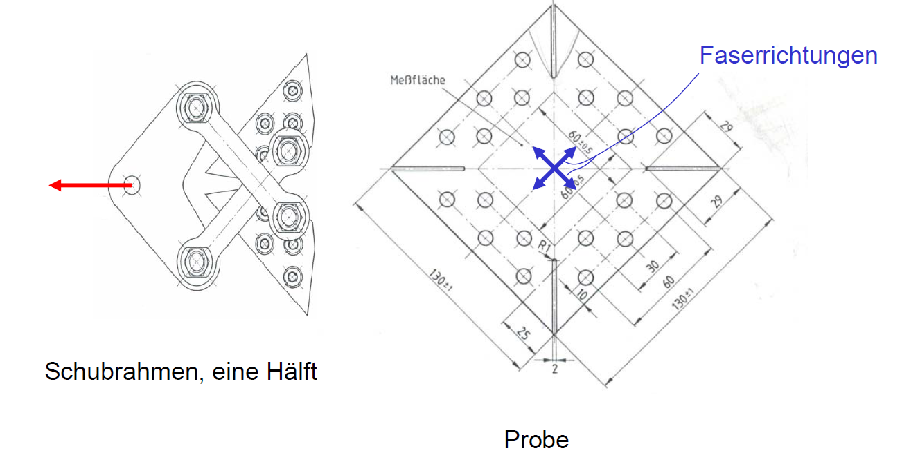
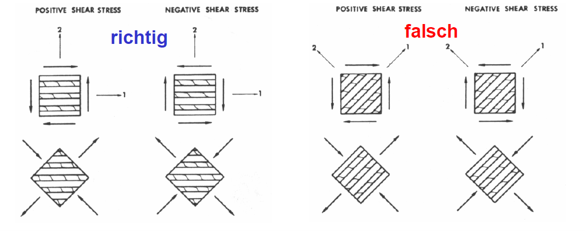
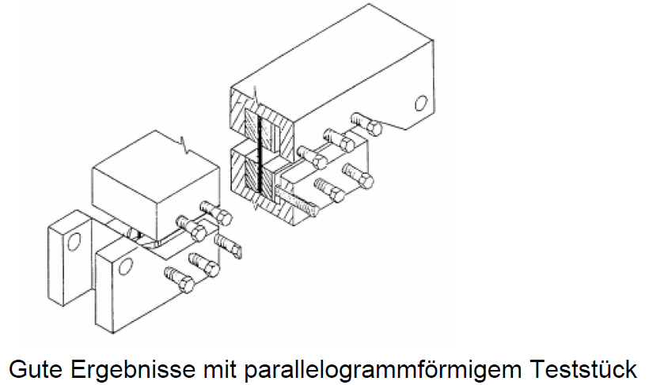
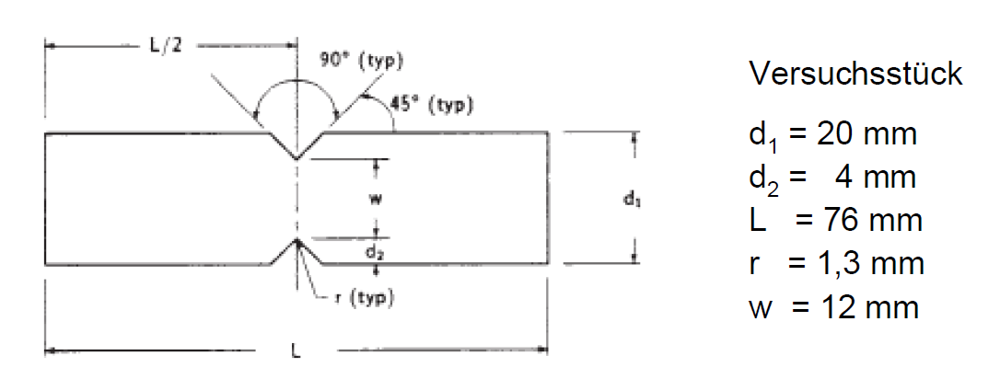
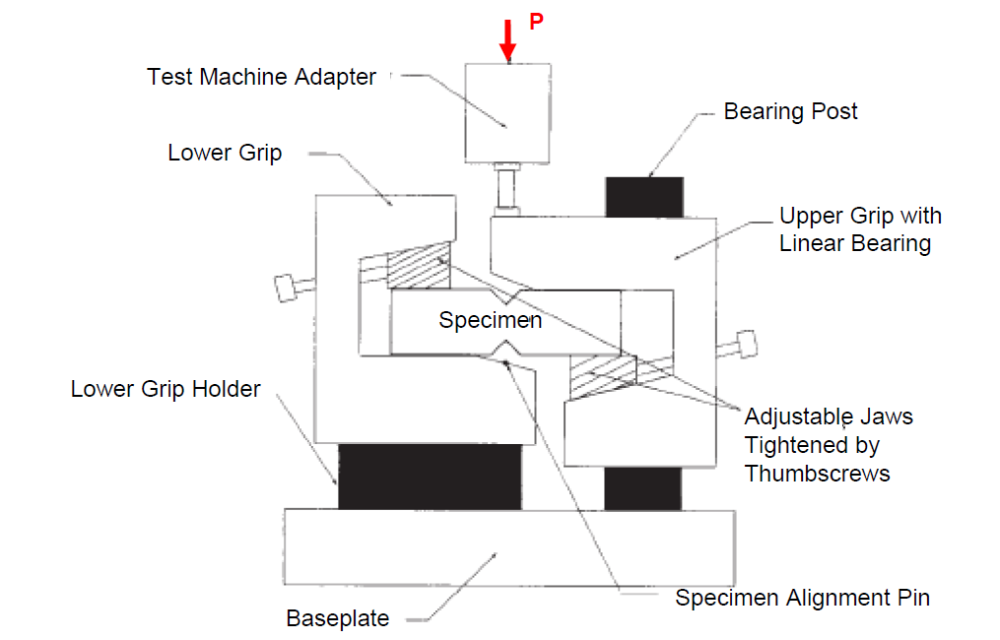
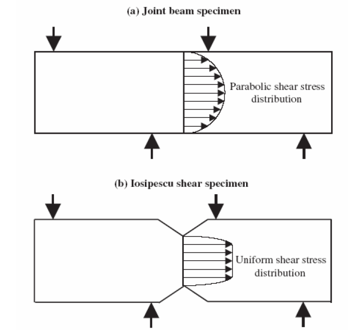
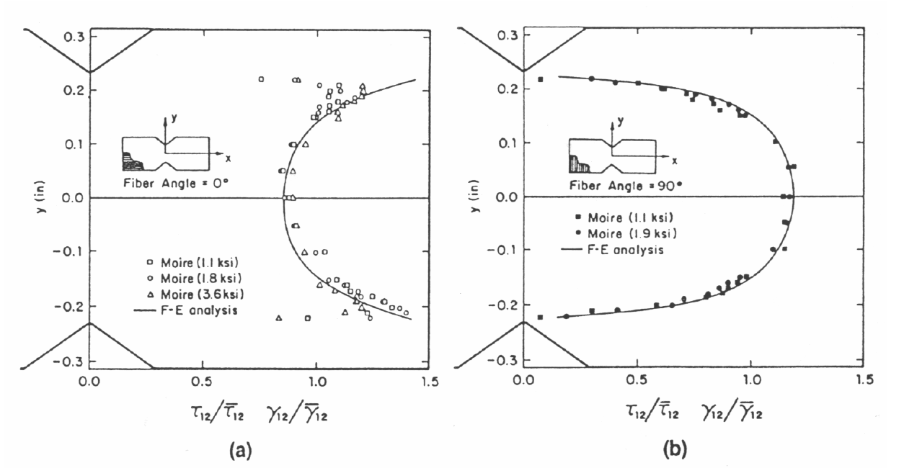

<!-- _class: lead -->

# Festigkeit eines UD-Verbundes

Prof. Dr.-Ing. Christian Willberg
Hochschule Magdeburg-Stendal

<!-- _class: lead -->

---

##  Grundlagen

- **Isotropes Material**
    - Hauptspannungsrichtung = Richtung extremer Beanspruchung = Richtung größter Gefährdung.
    - Festigkeit ist richtungsunabhängig.
- **Anisotropes Material**
    - Hauptspannungsrichtung (Hauptachsentransformation der Spannungen) = Richtung extremer Beanspruchung nicht notwendig Richtung größter Gefährdung.
    - Festigkeit ist richtungsabhängig.
- **Transversalisotropies Material (Annahme für eine UD-Schicht)**
    - Isotropie senkrecht zu den Fasern; Festigkeit ist richtungsunabhängig.
    - Orthotropie in Ebenen, die die Faserrichtung enthalten; Festigkeit ist richtungsabhängig.

---

### Beispiel: GFK-Schicht, ebener Spannungszustand, UD-verstärkt
- **Festigkeiten**: $R_L^{(+)} = 1000$ MPa, $R_L^{(-)} = 1000$ MPa, $R_T^{(+)} = 35$ MPa, $R_T^{(-)} = 150$ MPa, $R_{LT} = 50$ MPa.
- **Beanspruchung (x = Faserrichtung)**: $N_x = 800$ MPa, $N_y = 100$ MPa, $N_{xy} = 20$ MPa.
- **Hauptspannungen**: $N_1 = 676$ MPa, $N_2 = 224$ MPa bei $\Psi = 1,6^\circ$.

---

- **Erkenntnis**: Wegen der geringen Querzugfestigkeit $R_T^{(+)}$ entsteht ein Riss in Faserrichtung, nicht senkrecht zur maximalen Beanspruchung.
- Die Rissrichtung wird durch die Inhomogenität des Werkstoffs beeinflusst.

- **Prämisse**: Kein Versagen unter hydrostatischen Spannungszuständen. Dann ist der Spannungsdeviator für das Versagen verantwortlich.

---

- **Isotropie**: Drehinvarianz auch hinsichtlich der Festigkeit.
- Aus der Hypothese der konstanten Gestaltsänderungsarbeit ergibt sich als Versagensgrenze die Vergleichsspannung:
  $\sigma_v = \sqrt{\frac{1}{2} [(\sigma_x - \sigma_y)^2 + (\sigma_y - \sigma_z)^2 + (\sigma_z - \sigma_x)^2 + 6(\tau_{xy}^2 + \tau_{yz}^2 + \tau_{zx}^2)]}$
- **Anisotropie und Querisotropie**: Festigkeiten sind richtungsabhängig; adäquate Versagenskriterien sind erforderlich.
- **Festpunkte in den Versagenskriterien**: Messwerte unter reiner Zug- oder Druckbeanspruchung sowie unter reinem Schub.

---

- **Man unterscheidet**:
    - Zug-/Druckfestigkeiten in Faserrichtung: $R_L^{(+)}$, $R_L^{(-)}$.
    - Zug-/Druckfestigkeiten senkrecht zur Faserrichtung: $R_T^{(+)}$, $R_T^{(-)}$.
    - Schubfestigkeit parallel-senkrecht: $R_{LT}$.
    - Schubfestigkeit senkrecht-senkrecht: $R_{TT}$.

---

## Bestimmung von Festigkeiten im Versuch

- **Wichtig**: Reiner, gleichmäßiger Spannungszustand in der Probe.
- Relativ leicht erreichbar bei isotropem Material.

- **Anisotropie bewirkt Kopplungen**, wenn die Lastrichtung nicht exakt mit den Hauptrichtungen der Steifigkeiten übereinstimmen:
    - Einachsige Normalbeanspruchung erzeugt auch Schubverzerrung.
    - Reine Schubbeanspruchung erzeugt auch Normalverzerrung.
    - Reine Membranbeanspruchung erzeugt auch Verbiegung und Verkrümmung.

---

- durch Rotation gehen Symmetrien verloren und Kopplungen entstehen zwischen Schub- und Zug/Druck

$$\begin{bmatrix} \sigma_{11} \\ \sigma_{22} \\ \sigma_{33} \\ \sigma_{23} \\ \sigma_{13} \\ \tau_{12} \end{bmatrix} = 
\begin{bmatrix}
C_{11} & C_{12} & C_{13} & C_{14} & 0 & 0 \\
0 & C_{22} & C_{23} & C_{24} & 0 & 0 \\
0&0 & C_{33} & C_{34} & 0 & 0 \\
0&0&0 & C_{44} & 0 & 0 \\
0&0&0&0& C_{55} & 0 \\
0&0&0&0&0 & C_{66} 
\end{bmatrix}
\begin{bmatrix} \varepsilon_{11} \\ \varepsilon_{22} \\ \varepsilon_{33} \\ 2\varepsilon_{23} \\ 2\varepsilon_{13} \\ 2\varepsilon_{12} \end{bmatrix}$$

---

- **Zugfestigkeit quer zur Faser $R_T^{(+)}$**:
    - Versuch an einer UD-Schicht: Festigkeit wird durch die schwächste Stelle charakterisiert.
    - Versuch an $[0^\circ, 90^\circ, 0^\circ]$-Laminaten: Wesentlich höhere Festigkeiten der 90°-Schicht, aber abhängig von der Schichtdicke.
- **Druckfestigkeit in Faserrichtung $R_L^{(-)}$**:
    - Lange Proben brauchen Knickstütze. Wie viel trägt die Stütze?
    - Kurze Proben: Einfluss der Krafteinleitung?
---
- **Schubmodul $G_{LT}$**:
    - Nach DIN EN 6031 wird er über den axialen Zugversuch an $[\pm 45_2]_s$ Proben bestimmt.
    - aus der Messung der axialen Steifigkeit $E_x$ kann man bei Kenntnis der E-Moduli $E_L$ und $E_T$, sowie $\nu_{LT}$ den Schubmodul besitmmen
    - $G_{LT} = \frac{1}{4/E_x - 1/E_L - 1/E_T + 2\nu_{LT}/E_L}$

    - DIN EN 6031 legt stattdessen fest $G_{LT} = \frac{\Delta P}{w \cdot t \cdot (\Delta \epsilon_0 - \Delta \epsilon_{90})}$
    - Hierbei bezeichnet $\Delta$ die Differenz der Messwerte zwischen 2,5 ‰ und 0,5 ‰ axialer Dehnung
---

- **Schubfestigkeit $R_{LT}$**:
    - Nach DIN EN 6031: $R_{LT} = 0,5 \cdot P_{max} / (w \cdot t)$.
    - die DIN setzt voraus, dass unter 45° nur Schubspannungen wirken; das ist im Zugversuch nicht der Fall.
   

---
# Schubfestigkeit nach DIN 53399

---

# Schubfestigkeit $R_{LT}$

- Festigkeit für positive und negative Schubbelastung sollte gleich sein
- gilt, wenn Schubspannungen parallel und senkrecht zur Faser wirken
- wenn Schubspannungen unter 45° wirken, werden unterschiedliche Festigkeiten gemessen, weil Fasern in einem Fall auf Zug, im anderen auf Druck belastet werden

---
## Weitere Versuche
- Torsionsröhre: Gleichmäßiger Zustand, aber teure Herstellung und Probleme mit Beulen.
- Rail shear test (ASTM D 4255-01, 2002): Probe in Schienen eingespannt. Gleichmäßige Krafteinleitung?

- Wyoming Testvorrichtung

---
- Iosipescu-Test (gekerbter Balken): Ungleichmäßige Verteilung über den Messquerschnitt erfordert Korrekturfaktoren.
- Schwierigkeit beim Einbringen der Kerben

---

---

- Schubfestigkeit im gekerbten Balken
Verteilung der Schubspannungen CFK (a) 0°; (b) 90°
- es werden Korrekturfaktoren benötigt

| Winkel | GFK  | AFK  | CFK  |
|--------|------|------|------|
| 0°     | 0.96 | 0.90 | 0.87 |
| 90°    | 1.14 | 1.16 | 1.19 |
| 0°/90° | 1.05 | 1.03 | 1.03 |

---

## 5.2.3 Versagenskriterien für eine UD-Schicht

- **Motivation**: Wann versagt eine mehrachsig belastete UD-Schicht?
- Versagenskriterium verknüpft Spannungs- oder Verzerrungskomponenten (im faserorientierten System) mit den gemessenen Festigkeiten.
- Über 100 Kriterien in der Literatur; keines ist absolut richtig/falsch, nur mehr oder minder brauchbar.
- **World Wide Failure Exercise (WWFE)**: Internationaler Vergleich zur Prüfung der Brauchbarkeit.
- **Gliederung**:
    - **spannung-, dehnungsbasiert**:
        - Nicht interaktiv: Max Stress, Max Strain (Single Mode).
        - Interaktiv:
            - Interpolation: z.B. Tsai-Wu (Mixed Mode).
            - Physikalisch begründet: z.B. Hashin, Puck (Unterscheidung Fiber Failure FF / Inter-Fiber Failure IFF).
    - **bruchmechanisch basiert**: Spannungsintensitätsfaktor, Energiefreisetzungsrate.
- **Probleme**: Spannungsbasierte Kriterien können den Skaleneffekt (Risslängen) oft nicht modellieren.

---

# 5.3 Reservefaktor, Sicherheit, Materialanstrengung

- **Reservefaktor $RF$** kennzeichnet die Sicherheit gegen Versagen:
    - $RF < 1$: Struktur versagt.
    - $RF = 1$: Versagensgrenze.
    - $RF > 1$: Struktur ist sicher.
- $RF$ ist ein Faktor für Spannungen oder Verzerrungen, mit dem die Beanspruchung gerade die Versagensgrenze erreicht.
- **Beispiel quadratisches Interaktionskriterium**:
  $F_{11}(RF \cdot \sigma_1)^2 + 2F_{12} \cdot RF^2 \cdot \sigma_1\sigma_2 + F_{22}(RF \cdot \sigma_2)^2 + F_{33}(RF \cdot \tau_{12})^2 + \dots = 1$
- **Materialanstrengung $A$**: Definiert als der Kehrwert des Reservefaktors ($A = 1/RF$).
- **Sicherheitsbeiwert $j$ (oder $\gamma_S$)**: In Industriezweigen vorgeschrieben (z.B. $j = 1,5$ in der Luftfahrt).
- **Bedingung für sichere Auslegung**: $RF \ge j$ bzw. $A \le 1/j$.