<!-- _class: lead -->

# Festigkeit eines UD-Verbundes

Prof. Dr.-Ing. Christian Willberg
Hochschule Magdeburg-Stendal

<!-- _class: lead -->

---

##  Grundlagen

- **Isotropes Material**
    - Hauptspannungsrichtung = Richtung extremer Beanspruchung = Richtung größter Gefährdung.
    - Festigkeit ist richtungsunabhängig.
- **Anisotropes Material**
    - Hauptspannungsrichtung (Hauptachsentransformation der Spannungen) = Richtung extremer Beanspruchung nicht notwendig Richtung größter Gefährdung.
    - Festigkeit ist richtungsabhängig.
- **Transversalisotropies Material (Annahme für eine UD-Schicht)**
    - Isotropie senkrecht zu den Fasern; Festigkeit ist richtungsunabhängig.
    - Orthotropie in Ebenen, die die Faserrichtung enthalten; Festigkeit ist richtungsabhängig.

---

### Beispiel: GFK-Schicht, ebener Spannungszustand, UD-verstärkt
- **Festigkeiten**: $R_L^{(+)} = 1000$ MPa, $R_L^{(-)} = 1000$ MPa, $R_T^{(+)} = 35$ MPa, $R_T^{(-)} = 150$ MPa, $R_{LT} = 50$ MPa.
- **Beanspruchung (x = Faserrichtung)**: $N_x = 800$ MPa, $N_y = 100$ MPa, $N_{xy} = 20$ MPa.
- **Hauptspannungen**: $N_1 = 676$ MPa, $N_2 = 224$ MPa bei $\Psi = 1,6^\circ$.

---

- **Erkenntnis**: Wegen der geringen Querzugfestigkeit $R_T^{(+)}$ entsteht ein Riss in Faserrichtung, nicht senkrecht zur maximalen Beanspruchung.
- Die Rissrichtung wird durch die Inhomogenität des Werkstoffs beeinflusst.

- **Prämisse**: Kein Versagen unter hydrostatischen Spannungszuständen. Dann ist der Spannungsdeviator für das Versagen verantwortlich.

---

- **Isotropie**: Drehinvarianz auch hinsichtlich der Festigkeit.
- Aus der Hypothese der konstanten Gestaltsänderungsarbeit ergibt sich als Versagensgrenze die Vergleichsspannung:
  $\sigma_v = \sqrt{\frac{1}{2} [(\sigma_x - \sigma_y)^2 + (\sigma_y - \sigma_z)^2 + (\sigma_z - \sigma_x)^2 + 6(\tau_{xy}^2 + \tau_{yz}^2 + \tau_{zx}^2)]}$
- **Anisotropie und Querisotropie**: Festigkeiten sind richtungsabhängig; adäquate Versagenskriterien sind erforderlich.
- **Festpunkte in den Versagenskriterien**: Messwerte unter reiner Zug- oder Druckbeanspruchung sowie unter reinem Schub.

---

- **Man unterscheidet**:
    - Zug-/Druckfestigkeiten in Faserrichtung: $R_L^{(+)}$, $R_L^{(-)}$.
    - Zug-/Druckfestigkeiten senkrecht zur Faserrichtung: $R_T^{(+)}$, $R_T^{(-)}$.
    - Schubfestigkeit parallel-senkrecht: $R_{LT}$.
    - Schubfestigkeit senkrecht-senkrecht: $R_{TT}$.

---

## Bestimmung von Festigkeiten im Versuch

- **Wichtig**: Reiner, gleichmäßiger Spannungszustand in der Probe.
- Relativ leicht erreichbar bei isotropem Material.

- **Anisotropie bewirkt Kopplungen**, wenn die Lastrichtung nicht exakt mit den Hauptrichtungen der Steifigkeiten übereinstimmen:
    - Einachsige Normalbeanspruchung erzeugt auch Schubverzerrung.
    - Reine Schubbeanspruchung erzeugt auch Normalverzerrung.
    - Reine Membranbeanspruchung erzeugt auch Verbiegung und Verkrümmung.

---

- durch Rotation gehen Symmetrien verloren und Kopplungen entstehen zwischen Schub- und Zug/Druck

$$\begin{bmatrix} \sigma_{11} \\ \sigma_{22} \\ \sigma_{33} \\ \sigma_{23} \\ \sigma_{13} \\ \tau_{12} \end{bmatrix} = 
\begin{bmatrix}
C_{11} & C_{12} & C_{13} & C_{14} & 0 & 0 \\
0 & C_{22} & C_{23} & C_{24} & 0 & 0 \\
0&0 & C_{33} & C_{34} & 0 & 0 \\
0&0&0 & C_{44} & 0 & 0 \\
0&0&0&0& C_{55} & 0 \\
0&0&0&0&0 & C_{66} 
\end{bmatrix}
\begin{bmatrix} \varepsilon_{11} \\ \varepsilon_{22} \\ \varepsilon_{33} \\ 2\varepsilon_{23} \\ 2\varepsilon_{13} \\ 2\varepsilon_{12} \end{bmatrix}$$

---

- **Zugfestigkeit quer zur Faser $R_T^{(+)}$**:
    - Versuch an einer UD-Schicht: Festigkeit wird durch die schwächste Stelle charakterisiert.
    - Versuch an $[0^\circ, 90^\circ, 0^\circ]$-Laminaten: Wesentlich höhere Festigkeiten der 90°-Schicht, aber abhängig von der Schichtdicke.
- **Druckfestigkeit in Faserrichtung $R_L^{(-)}$**:
    - Lange Proben brauchen Knickstütze. Wie viel trägt die Stütze?
    - Kurze Proben: Einfluss der Krafteinleitung?
---
- **Schubmodul $G_{LT}$**:
    - Nach DIN EN 6031 wird er über den axialen Zugversuch an $[\pm 45_2]_s$ Proben bestimmt.
    - aus der Messung der axialen Steifigkeit $E_x$ kann man bei Kenntnis der E-Moduli $E_L$ und $E_T$, sowie $\nu_{LT}$ den Schubmodul besitmmen
    - $G_{LT} = \frac{1}{4/E_x - 1/E_L - 1/E_T + 2\nu_{LT}/E_L}$

    - DIN EN 6031 legt stattdessen fest $G_{LT} = \frac{\Delta P}{w \cdot t \cdot (\Delta \epsilon_0 - \Delta \epsilon_{90})}$
    - Hierbei bezeichnet $\Delta$ die Differenz der Messwerte zwischen 2,5 ‰ und 0,5 ‰ axialer Dehnung
---

- **Schubfestigkeit $R_{LT}$**:
    - Nach DIN EN 6031: $R_{LT} = 0,5 \cdot P_{max} / (w \cdot t)$.
    - die DIN setzt voraus, dass unter 45° nur Schubspannungen wirken; das ist im Zugversuch nicht der Fall.
   

---
# Schubfestigkeit nach DIN 53399

 
    Bild entmommen aus der Vorlesung "Leichtbau mit Faserverbunden" SS2008 von Prof. Dr.-Ing. Klaus Rohwer"

---

# Schubfestigkeit $R_{LT}$

- Festigkeit für positive und negative Schubbelastung sollte gleich sein
- gilt, wenn Schubspannungen parallel und senkrecht zur Faser wirken
- wenn Schubspannungen unter 45° wirken, werden unterschiedliche Festigkeiten gemessen, weil Fasern in einem Fall auf Zug, im anderen auf Druck belastet werden

 
    Bild entmommen aus der Vorlesung "Leichtbau mit Faserverbunden" SS2008 von Prof. Dr.-Ing. Klaus Rohwer"

---
## Weitere Versuche
- Torsionsröhre: Gleichmäßiger Zustand, aber teure Herstellung und Probleme mit Beulen.
- Rail shear test (ASTM D 4255-01, 2002): Probe in Schienen eingespannt. Gleichmäßige Krafteinleitung?

- Wyoming Testvorrichtung

 
    Bild entmommen aus der Vorlesung "Leichtbau mit Faserverbunden" SS2008 von Prof. Dr.-Ing. Klaus Rohwer"

---
- Iosipescu-Test (gekerbter Balken): Ungleichmäßige Verteilung über den Messquerschnitt erfordert Korrekturfaktoren.
- Schwierigkeit beim Einbringen der Kerben

 
    Bild entmommen aus der Vorlesung "Leichtbau mit Faserverbunden" SS2008 von Prof. Dr.-Ing. Klaus Rohwer"

---

 
    Bilder entmommen aus der Vorlesung "Leichtbau mit Faserverbunden" SS2008 von Prof. Dr.-Ing. Klaus Rohwer"

---

- Schubfestigkeit im gekerbten Balken
Verteilung der Schubspannungen CFK (a) 0°; (b) 90°
- es werden Korrekturfaktoren benötigt

| Winkel | GFK  | AFK  | CFK  |
|--------|------|------|------|
| 0°     | 0.96 | 0.90 | 0.87 |
| 90°    | 1.14 | 1.16 | 1.19 |
| 0°/90° | 1.05 | 1.03 | 1.03 |

 
    Bild entmommen aus der Vorlesung "Leichtbau mit Faserverbunden" SS2008 von Prof. Dr.-Ing. Klaus Rohwer"

---

## Typische statische Festigkeiten von UD-Verbunden

**Epoxidharz-Matrix, φ = 0,6, trocken, Raumtemperatur**

| Festigkeit | E-Glas | Kevlar 49 | T 300 | T 800 (HT) | GY-70 (HM) |
|:----------:|:------:|:---------:|:-----:|:----------:|:----------:|
| $R_L^{(+)}$ [MPa] | 1000 | 1400 | 1300 | 1800 | 700 |
| $R_L^{(-)}$ [MPa] | 1000 | 400 | 1400 | 800 | 600 |
| $R_T^{(+)}$ [MPa] | 35 | 50 | 50 | 40 | 40 |
| $R_T^{(-)}$ [MPa] | 150 | 150 | 150 | 70 | 150 |
| $R_{LT}$ [MPa] | 50 | 60 | 60 | 70 | 100 |

---
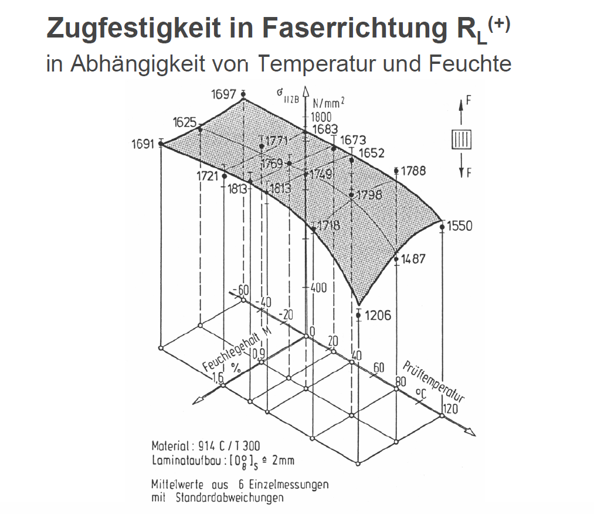

 
    Bild entmommen aus der Vorlesung "Leichtbau mit Faserverbunden" SS2008 von Prof. Dr.-Ing. Klaus Rohwer"

---

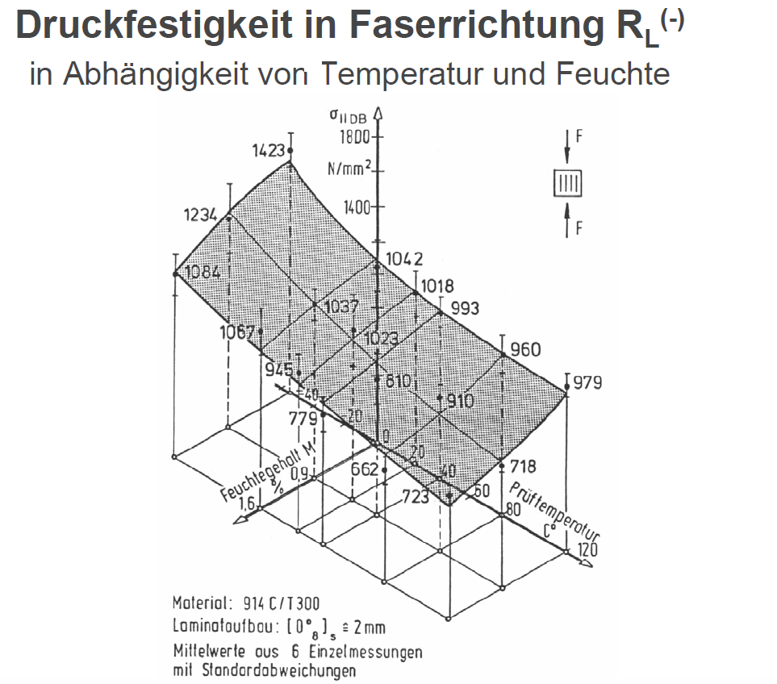

 
    Bild entmommen aus der Vorlesung "Leichtbau mit Faserverbunden" SS2008 von Prof. Dr.-Ing. Klaus Rohwer"

---

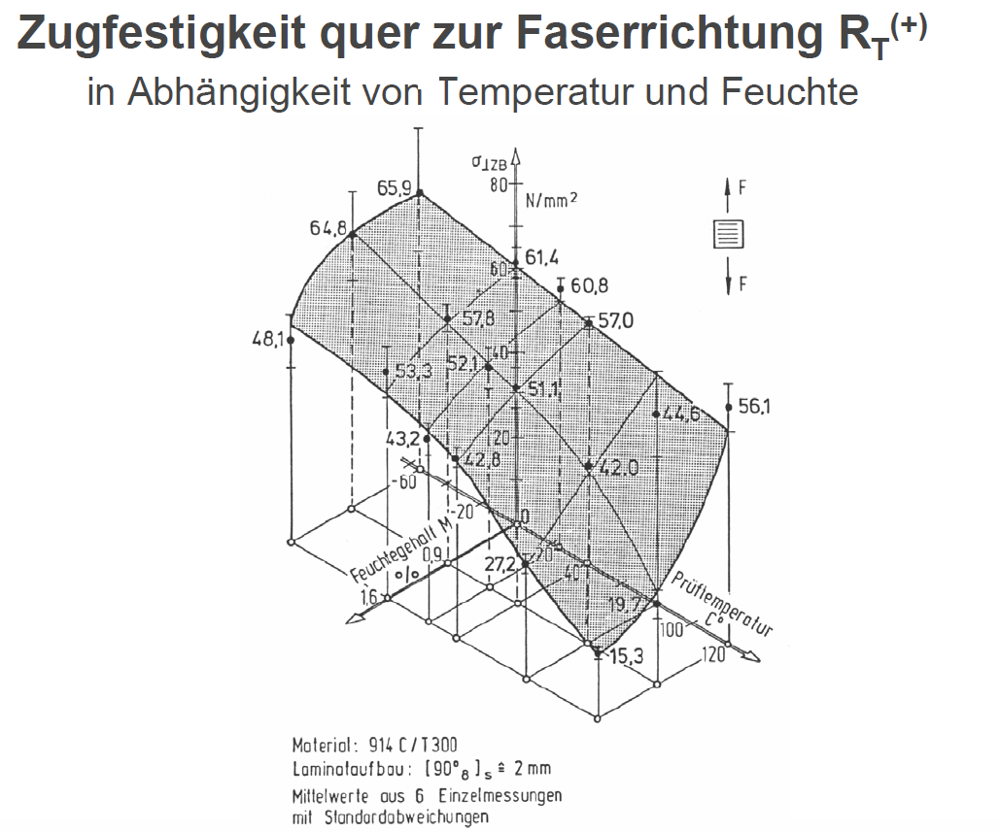

 
    Bild entmommen aus der Vorlesung "Leichtbau mit Faserverbunden" SS2008 von Prof. Dr.-Ing. Klaus Rohwer"

---

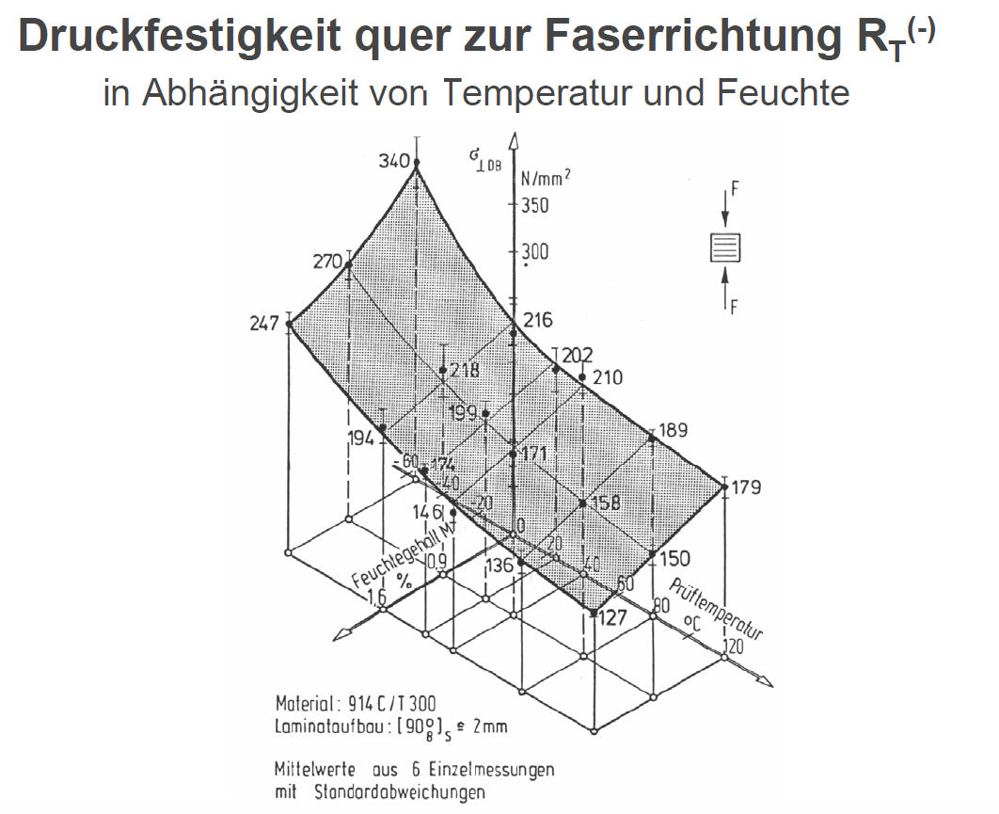

 
    Bild entmommen aus der Vorlesung "Leichtbau mit Faserverbunden" SS2008 von Prof. Dr.-Ing. Klaus Rohwer"

---

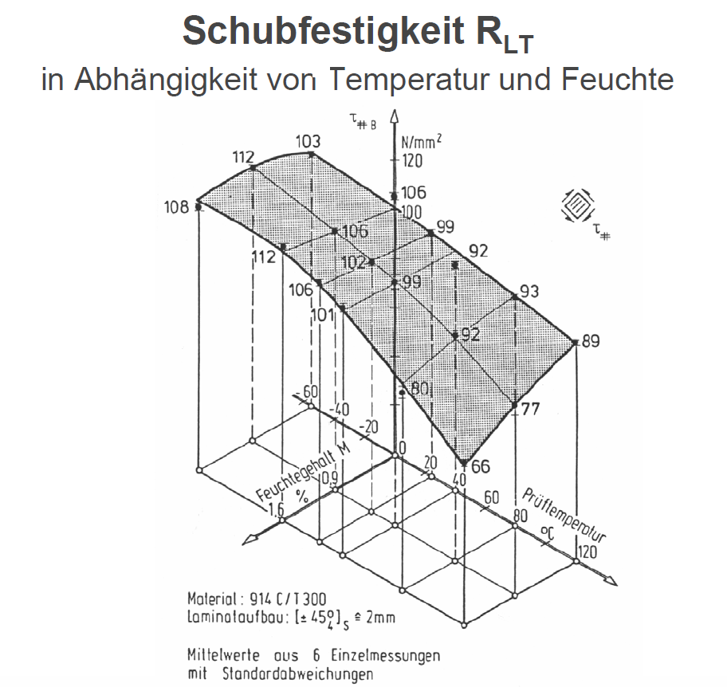

 
    Bild entmommen aus der Vorlesung "Leichtbau mit Faserverbunden" SS2008 von Prof. Dr.-Ing. Klaus Rohwer"

---
## Versagenskriterien für eine UD-Schicht
---

- **Motivation**: Wann versagt eine mehrachsig belastete UD-Schicht?
- Versagenskriterium verknüpft Spannungs- oder Verzerrungskomponenten (im faserorientierten System) mit den gemessenen Festigkeiten.
- Über 100 Kriterien in der Literatur; keines ist absolut richtig/falsch, nur mehr oder minder brauchbar.

---

- [**World Wide Failure Exercise (WWFE) I - III**](https://www.sciencedirect.com/science/chapter/edited-volume/abs/pii/B9780080444758500020): Internationaler Vergleich zur Prüfung der Brauchbarkeit.
- **Gliederung**:
    - **spannung-, dehnungsbasiert**:
        - Nicht interaktiv: Max Stress, Max Strain (Single Mode).
        - Interaktiv:
            - Interpolation: z.B. Tsai-Wu (Mixed Mode).
            - Physikalisch begründet: z.B. Hashin, Puck (Unterscheidung Fiber Failure FF / Inter-Fiber Failure IFF).
    - **bruchmechanisch basiert (klassisch / peridynamisch)**: Spannungsintensitätsfaktor, Energiefreisetzungsrate.
- **Probleme**: Spannungsbasierte Kriterien können den Skaleneffekt (Risslängen) oft nicht modellieren.

---
## Spannungs-, dehnungsbasierte Kriterien
---
# Maximalspannungskriterium

**Bruchbedingung:**
Bruch tritt ein, wenn eine der folgenden Bedingungen erreicht oder überschritten ist:

**Normalspannung in Faserrichtung:**
$$\sigma_1 = R_L^{(+)} \quad \text{oder} \quad R_L^{(-)}$$

**Normalspannung senkrecht zur Faserrichtung:**
$$\sigma_2 = R_T^{(+)} \quad \text{oder} \quad R_T^{(-)}$$

**Schubspannung:**
$$\tau_{12} = R_{LT}$$

---

**Versagensbedingungen:**

1. **Faserrichtung (longitudinal):**
   - Zug: $\sigma_1 \geq R_L^{(+)}$
   - Druck: $\sigma_1 \leq -R_L^{(-)}$

2. **Querrichtung (transversal):**
   - Zug: $\sigma_2 \geq R_T^{(+)}$
   - Druck: $\sigma_2 \leq -R_T^{(-)}$

3. **Schub (Längs-Quer):**
   - $|\tau_{12}| \geq R_{LT}$

**Versagen tritt ein, wenn EINE dieser Bedingungen erfüllt ist.**

---

# Maximaldehnungskriterium

**Bruchbedingung:**
Bruch tritt ein, wenn eine der folgenden Bedingungen erreicht oder überschritten ist:

**Normaldehnung in Faserrichtung:**
$$\varepsilon_1 = R_L^{(+)} / E_L \quad \text{oder} \quad R_L^{(-)} / E_L$$

**Normaldehnung senkrecht zur Faserrichtung:**
$$\varepsilon_2 = R_T^{(+)} / E_T \quad \text{oder} \quad R_T^{(-)} / E_T$$

**Schubverzerrung:**
$$\gamma_{12} = R_{LT} / G_{LT}$$

---
# Unterschied zum Maximalspannungskriterium

**Wichtiger Hinweis:**
Kriterium ist **nicht identisch** mit Maximalspannungskriterium, weil die Normaldehnungen jeweils von **zwei Normalspannungen** abhängen:

$$\varepsilon_1 = \frac{\sigma_1}{E_L} - \nu_{LT} \frac{\sigma_2}{E_L}$$

$$\varepsilon_2 = \frac{\sigma_2}{E_T} - \nu_{LT} \frac{\sigma_1}{E_L}$$

**Querkontraktion wird berücksichtigt!**

---

# Grenzdehnungen

**Definition der Grenzdehnungen:**

$$\varepsilon_L^{(+)} = \frac{R_L^{(+)}}{E_L}, \quad \varepsilon_L^{(-)} = \frac{R_L^{(-)}}{E_L}$$

$$\varepsilon_T^{(+)} = \frac{R_T^{(+)}}{E_T}, \quad \varepsilon_T^{(-)} = \frac{R_T^{(-)}}{E_T}$$

$$\gamma_{LT}^{\max} = \frac{R_{LT}}{G_{LT}}$$

**Diese Grenzdehnungen sind materialspezifische Konstanten!**

---
# Versagenskriterium in kompakter Form

**Bruch tritt ein, wenn:**

$$\max\left\{
\frac{|\varepsilon_1|}{\varepsilon_L}, \,
\frac{|\varepsilon_2|}{\varepsilon_T}, \,
\frac{|\gamma_{12}|}{\gamma_{LT}^{\max}}
\right\} \geq 1$$

wobei:
$$\varepsilon_L = \begin{cases}
\varepsilon_L^{(+)} & \text{für } \varepsilon_1 > 0 \\
|\varepsilon_L^{(-)}| & \text{für } \varepsilon_1 < 0
\end{cases}$$

$$\varepsilon_T = \begin{cases}
\varepsilon_T^{(+)} & \text{für } \varepsilon_2 > 0 \\
|\varepsilon_T^{(-)}| & \text{für } \varepsilon_2 < 0
\end{cases}$$

---
## Vergleich: Maximalspannungs- vs. Maximaldehnungskriterium

| Aspekt | Maximalspannung | Maximaldehnung |
|--------|----------------|----------------|
| **Prüfgröße** | Spannungen $\sigma_1, \sigma_2, \tau_{12}$ | Dehnungen $\varepsilon_1, \varepsilon_2, \gamma_{12}$ |
| **Querkontraktion** | Nicht berücksichtigt | **Berücksichtigt** |
| **Kopplung** | Keine | Über $\nu_{LT}$ |
| **Anwendung** | Einfacher | Realistischer |
| **Konservativität** | Meist konservativer | Weniger konservativ |

**Hauptunterschied:** Querkontraktion führt zu Interaktion zwischen $\sigma_1$ und $\sigma_2$!

---
# Beispiel: Einfluss der Querkontraktion

**Gegeben:** Zweiachsiger Spannungszustand $\sigma_1, \sigma_2 > 0$

**Maximalspannungskriterium:**
- Prüft: $\sigma_1 \leq R_L^{(+)}$ und $\sigma_2 \leq R_T^{(+)}$ unabhängig

**Maximaldehnungskriterium:**
- Berechnet: $\varepsilon_1 = \frac{\sigma_1}{E_L} - \nu_{LT}\frac{\sigma_2}{E_L}$
- Berechnet: $\varepsilon_2 = \frac{\sigma_2}{E_T} - \nu_{TL}\frac{\sigma_1}{E_L}$
- Prüft: $\varepsilon_1 \leq \varepsilon_L^{(+)}$ und $\varepsilon_2 \leq \varepsilon_T^{(+)}$

**Querkontraktion kann Dehnung verringern oder verstärken!**

---
# Quadratisches Interaktionskriterium

**Im Spannungsraum:**
$$F_{ij} \sigma_i \sigma_j + F_i \sigma_i = 1$$

**Im Dehnungsraum:**
$$G_{ij} \varepsilon_i \varepsilon_j + G_i \varepsilon_i = 1$$

### 3D-Spannungszustand
**(1 = Faserrichtung)**

$$\boxed{
\begin{aligned}
&F_{11} \sigma_1^2 + 2 F_{12} \sigma_1(\sigma_2 + \sigma_3) + F_{22} (\sigma_2^2 + \sigma_3^2) + 2 F_{23} \sigma_2\sigma_3 \\
&+ F_{44} (\tau_{12}^2 + \tau_{31}^2) + F_{55} \tau_{23}^2 + F_1 \sigma_1 + F_2 (\sigma_2 + \sigma_3) = 1
\end{aligned}
}$$

---

<!-- _class: cols-2-1 -->

**Normalspannungen:**

$$F_{11} = \frac{1}{R_L^{(+)} \cdot R_L^{(-)}}$$

$$F_{22} = \frac{1}{R_T^{(+)} \cdot R_T^{(-)}}$$

**Schubspannungen:**

$$F_{44} = \frac{1}{R_{LT}^2}$$

$$F_{55} = \frac{1}{R_{TT}^2}$$

**Normalspannungen:**

$$F_1 = \frac{1}{R_L^{(+)}} - \frac{1}{R_L^{(-)}}$$

$$F_2 = \frac{1}{R_T^{(+)}} - \frac{1}{R_T^{(-)}}$$

**Interaktionsterme:**

$$F_{23} = F_{22} - \frac{F_{55}}{2}$$

$$F_{12} = \text{?}$$

**Problem:** $F_{12}$ muss experimentell bestimmt oder abgeschätzt werden!

---

## Ebener Spannungszustand

**Vereinfachte Form für 2D:**

$$\boxed{F_{11} \sigma_1^2 + 2 F_{12} \sigma_1 \sigma_2 + F_{22} \sigma_2^2 + F_{44} \tau_{12}^2 + F_1 \sigma_1 + F_2 \sigma_2 = 1}$$

**Deutlich einfacher als 3D-Fall!**

**Durch spezielle Annahmen und zusätzliche Bedingungen ergeben sich viele der gängigen Kriterien:**

- Verschiedene Werte für $F_{12}$ führen zu verschiedenen Kriterien
- Tsai und Wu betonen die Bedeutung einer "geschlossenen", elliptischen Versagensfläche

**Geometrische Interpretation:**
- Ellipsoid im Spannungsraum
- Geschlossene Versagensfläche

---

# Physikalische Sinnhaftigkeit

**"Offene", hyperbolische Versagensflächen:**
- Erscheinen physikalisch sinnvoll
- Kein Versagen unter hydrostatischem Druck
- $\Rightarrow$ Realistische Beschreibung des Materialverhaltens

---
# Quadratische Interaktionskriterien – spezielle Formen

---

- **Kriterium nach Norris:**
  $$R_L^{(+)} = R_L^{(-)} = R_L \qquad R_T^{(+)} = R_T^{(-)} = R_T \qquad F_{12} = -0.5 / R_L R_T \qquad F_1 = F_2 = 0$$

- **Kriterium nach Hoffman:**
  $$F_{12} = -0.5 / R_L^{(+)} R_L^{(-)}$$

- **Kriterium nach DeTeresa - Larsen:**
  J. Composite Material **37**(2003) 1769-1785
  $$F_{12} = -0.25 / R_L^{(+)} R_L^{(-)}$$

- **Kriterium nach Tsai – Hahn:**
  $$F_{12} = -0.5 (F_{11}F_{22})^{1/2}$$

- **Kriterium nach Tsai – Wu:**
  $$F_{12} = 0$$
  
  oder durch Versuche zu ermitteln

---

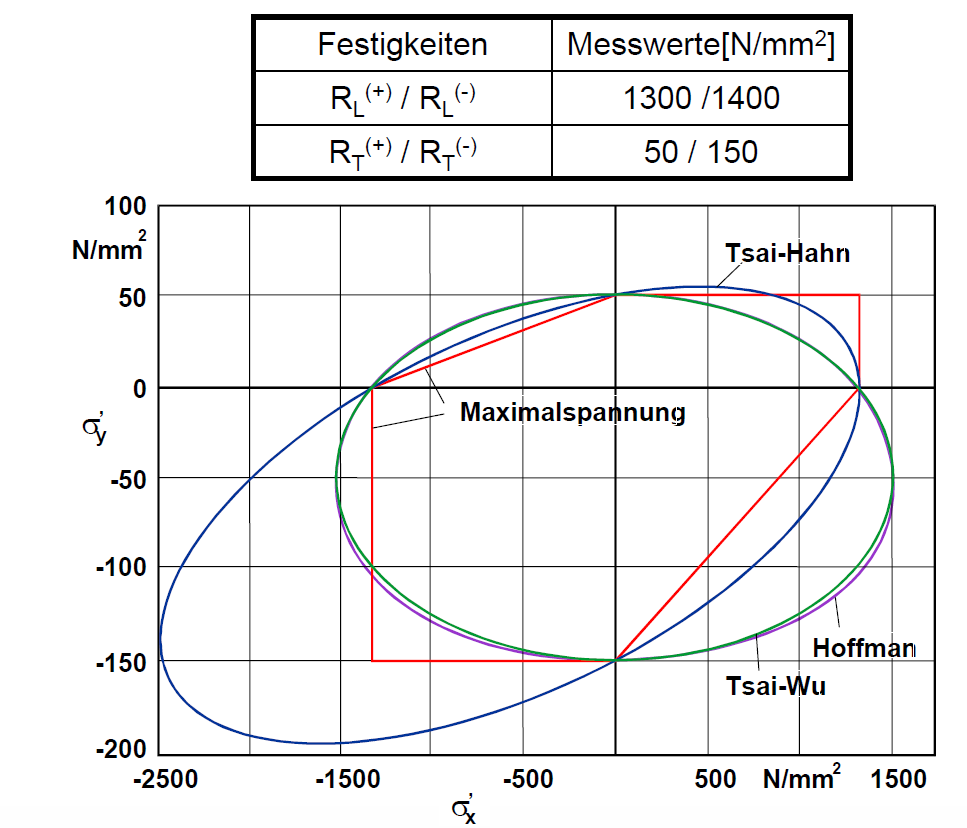

 
    Bild entmommen aus der Vorlesung "Leichtbau mit Faserverbunden" SS2008 von Prof. Dr.-Ing. Klaus Rohwer"

---

# Physikalisch begründete / motivierte / argumentierte Versagenskriterien

---
# ZTL-Kriteriumssatz

**Unterscheidung zwischen:**
- Faserbruch (FB)
- Zwischenfaserbruch (ZFB)

**FB:**
$$\sigma_1^2 = R_L^{(+)2} \qquad \sigma_1^2 = R_L^{(-)2}$$

**ZFB:**
$$F_{22} \sigma_2^2 + F_{33} \tau_{12}^2 + F_2 \sigma_2 = 1$$

mit
$$F_{22} = 1/(R_T^{(+)} \cdot R_T^{(-)}) \quad F_{33} = 1/R_{LT}^2 \quad F_2 = 1/R_T^{(+)} - 1/R_T^{(-)}$$

---
# Versagenskriterium für eine UD-Schicht aus CFK
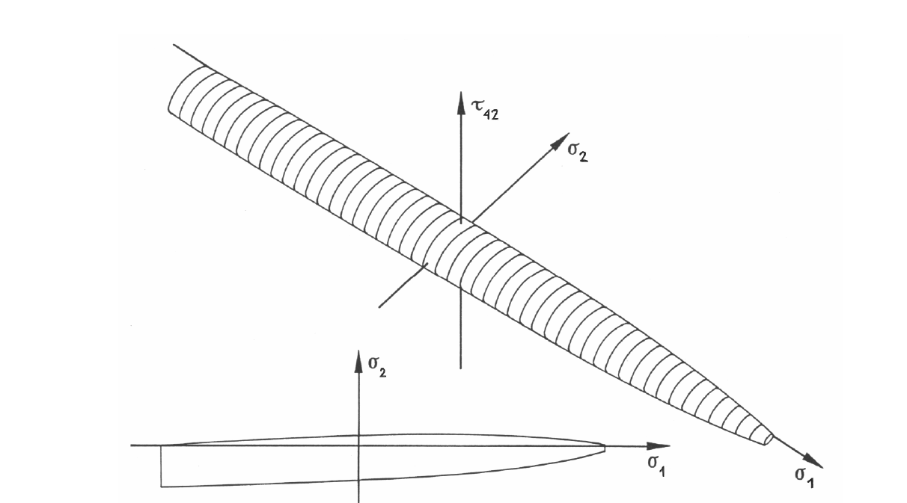

 
    Bild entmommen aus der Vorlesung "Leichtbau mit Faserverbunden" SS2008 von Prof. Dr.-Ing. Klaus Rohwer"

---
## 3D-Versagenskriterium nach Hashin (1980)
Transversalisotropes Material, $x_1$ = Faserrichtung

**5 Invarianten** gegenüber Drehung um $x_1$:

$$I_1 = \sigma_{11}$$

$$I_2 = \sigma_{22} + \sigma_{33}$$

$$I_3 = \tau_{23}^2 - \sigma_{22} \cdot \sigma_{33}$$

$$I_4 = \tau_{12}^2 + \tau_{13}^2$$

$$I_5 = 2\tau_{12}\tau_{23}\tau_{13} - \sigma_{22}\tau_{13}^2 - \sigma_{33}\tau_{12}^2$$

**Definition Invarianten:**
Invarianten sind skalare Größen, die bei Koordinatentransformationen (Drehungen) ihren Wert nicht ändern.

---

**Annahme:** Versagenshyperfläche ist **quadratisch** in den Spannungen, deshalb bleibt $I_5$ unberücksichtigt

**Allgemeine Form:**
$$A_1I_1 + B_1I_1^2 + A_2I_2 + B_2I_2^2 + C_{12}I_1I_2 + A_3I_3 + A_4I_4 = 1$$

---

**Faserbruch** wird nur beeinflusst durch Spannungskomponenten in Faserrichtung $\sigma_{11}, \tau_{12}, \tau_{13}$

$$A_f\sigma_{11} + B_f\sigma_{11}^2 + (\tau_{12}^2 + \tau_{13}^2)/R_{LT}^2 = 1$$

**Matrixbruch** wird beeinflusst durch Normalspannungen senkrecht zur Faser $\sigma_{22}, \sigma_{33}$ und alle drei Schubspannungen $\tau_{23}, \tau_{12}, \tau_{23}$

$$A_m(\sigma_{22} + \sigma_{33}) + B_m(\sigma_{22} + \sigma_{33})^2$$
$$+ (\tau_{23}^2 - \sigma_{22}\sigma_{33})/R_{TT}^2 + (\tau_{12}^2 + \tau_{13}^2)/R_{LT}^2 = 1$$

$A_f, B_f, A_m, B_m$ müssen noch durch Festigkeiten ausgedrückt werden

---

**4 Fälle** sind zu unterscheiden

**1. Zugbruch in Faserrichtung** ($\sigma_{11} > 0$)

$$\boxed{\sigma_{11}^2/R_L^{(+)2} + (\tau_{12}^2 + \tau_{13}^2)/R_{LT}^2 = 1}$$

**2. Druckbruch in Faserrichtung** ($\sigma_{11} < 0$)

$$\boxed{\sigma_{11}^2/R_L^{(-)2} = 1}$$

---

**3. Zugbruch quer zur Faserrichtung** $[(\sigma_{22} + \sigma_{33}) > 0]$

$$\boxed{(\sigma_{22} + \sigma_{33})^2/R_T^{(+)2} + (\tau_{23}^2 - \sigma_{22}\sigma_{33})/R_{TT}^2 + (\tau_{12}^2 + \tau_{13}^2)/R_{LT}^2 = 1}$$

**4. Druckbruch quer zur Faserrichtung** $[(\sigma_{22} + \sigma_{33}) < 0]$

$$\boxed{\left[\left(R_T^{(-)}/2R_{TT}\right)^2 - 1\right](\sigma_{22} + \sigma_{33})/R_T^{(-)} + (\sigma_{22} + \sigma_{33})^2/4R_{TT}^2}$$
$$\boxed{+ (\tau_{23}^2 - \sigma_{22}\sigma_{33})/R_{TT}^2 + (\tau_{12}^2 + \tau_{13}^2)/R_{LT}^2 = 1}$$

---
## Wirkebenen-Versagenskriterium nach Puck (1992)

**6 Hypothesen:**

1. Faserbruch (FB) und Zwischenfaserbruch (ZFB) sind von unterschiedlicher Art und erfordern deshalb unterschiedliche Versagenskriterien

2. ZFB erfolg makromechanisch 'spröde', d.h. ohne ausgeprägte plastische Verformungen. Die Bruchfestigkeit eines spröden Materials wird durch die Spannungen in der Bruchebene bestimmt (**Mohr**, 1900, für isotropes Material)

3. ZFB tritt immer in Ebenen parallel zur Faser auf; dort findet kein FB statt

---

4. Wenn man eine Bruchebene unter dem Winkel $\theta$ identifizieren kann, dann wird ZFB durch ein Zusammenwirken der Normalspannung $\sigma_n$ und der Schubspannungen $\tau_{n1}$ und $\tau_{nt}$ in dieser Ebene bewirkt. Das Versagenskriterium sollte deshalb in diesen Spannungen und den entsprechenden Festigkeiten der Bruchebene formuliert werden (**Hashin** 1980)

5. Wenn $\sigma_n \geq 0$, dann wird der Bruch durch alle drei Spannungskomponenten gefördert

6. Wenn $\sigma_n < 0$, dann erhöht die Druckspannung $\sigma_n$ die Festigkeit (**Coulomb**sche Reibung)

---
# Bruchwinkel und Spannungen in der Bruchebene

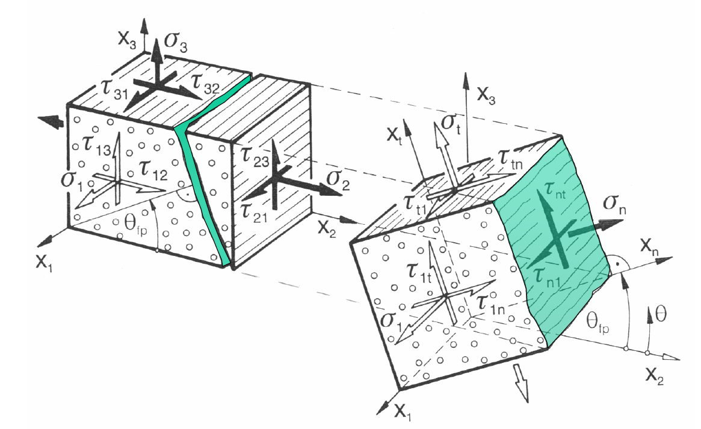

 
    Bild entmommen aus der Vorlesung "Leichtbau mit Faserverbunden" SS2008 von Prof. Dr.-Ing. Klaus Rohwer"

---

## Transformation des 3D-Spannungszustandes im natürlichen System
($x_1$ = Faserrichtung) **in Bruchflächenspannungen**

$\Theta$ = Drehwinkel um die $x_1$-Achse, $s = \sin\Theta$, $c = \cos\Theta$

$$\begin{bmatrix}
\sigma_1 \\
\sigma_n \\
\sigma_t \\
\tau_{nt} \\
\tau_{t1} \\
\tau_{n1}
\end{bmatrix} = 
\begin{bmatrix}
1 & 0 & 0 & 0 & 0 & 0 \\
0 & c^2 & s^2 & 2cs & 0 & 0 \\
0 & s^2 & c^2 & -2cs & 0 & 0 \\
0 & -cs & cs & c^2-s^2 & 0 & 0 \\
0 & 0 & 0 & 0 & c & -s \\
0 & 0 & 0 & 0 & s & c
\end{bmatrix} \cdot
\begin{bmatrix}
\sigma_1 \\
\sigma_2 \\
\sigma_3 \\
\tau_{23} \\
\tau_{31} \\
\tau_{21}
\end{bmatrix}$$

Nur die **markierten Komponenten** wirken auf der Bruchfläche

**Allgemeine Bruchbedingung:** $F(\sigma_n, \tau_{nt}, \tau_{n1}) = 1$ (Master-Bruchfläche)

---
### Zusammenfassung der Schubspannungskomponenten $\tau_{nt}$ und $\tau_{n1}$

$$\tau_{n\psi} = \sqrt{\tau_{nt}^2 + \tau_{n1}^2}$$

$$\psi = \arctan\frac{\tau_{n1}}{\tau_{nt}}$$

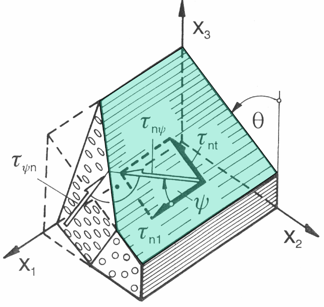

 
    Bild entmommen aus der Vorlesung "Leichtbau mit Faserverbunden" SS2008 von Prof. Dr.-Ing. Klaus Rohwer"

---
### Elliptische Interpolation bei $\sigma_n = 0$

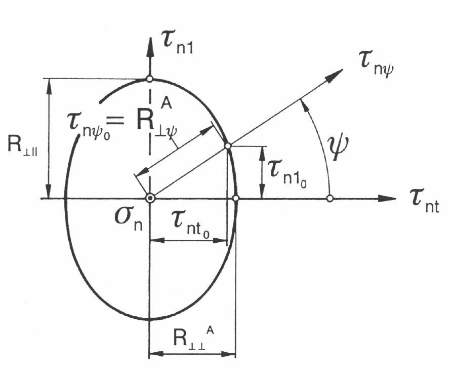

$$\tau_{n\psi_0} = R_{\perp\psi}^A$$

 
    Bild entmommen aus der Vorlesung "Leichtbau mit Faserverbunden" SS2008 von Prof. Dr.-Ing. Klaus Rohwer"

---

### Bruchkörper im Druckspannungsbereich $\sigma_n < 0$

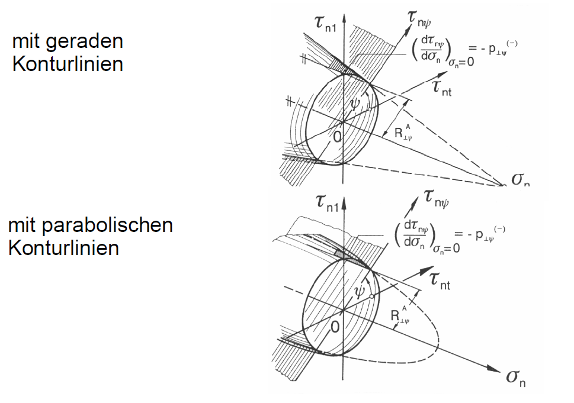

**Interpolation der Neigungsparameter:**
$$\frac{p_{T\psi}^{(-)}}{R_{T\psi}^A} = \frac{p_{TT}^{(-)}}{R_{TT}^A}\cos^2\psi + \frac{p_{LT}^{(-)}}{R_{LT}}\sin^2\psi$$

 

Bild entmommen aus der Vorlesung "Leichtbau mit Faserverbunden" SS2008 von Prof. Dr.-Ing. Klaus Rohwer"

---
## Bruchkörper im Zugspannungsbereich $\sigma_n > 0$

**mit elliptischen Konturlinien**

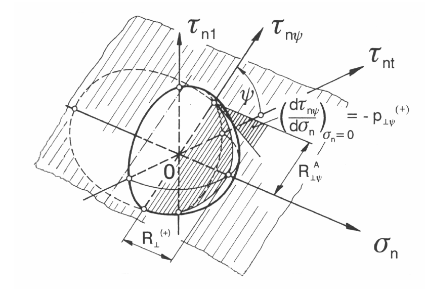

**Interpolation der Neigungsparameter:**
$$\frac{p_{T\psi}^{(+)}}{R_{T\psi}^A} = \frac{p_{TT}^{(+)}}{R_{TT}^A}\cos^2\psi + \frac{p_{LT}^{(+)}}{R_{LT}}\sin^2\psi$$

---
# Parameter für das 3D-Zwischenfaserbruchkriterium (Puck)

**1. Festigkeiten der Wirkebene**

$R_T^{(+)A} = R_T^{(+)}$: Widerstand der Wirkebene gegen Bruch infolge $\sigma_n^{(+)}$

($R_T^{(-)A} = \infty$: kein Bruch infolge $\sigma_n^{(-)}$)

$R_{LT}^A = R_{LT}$: Widerstand der Wirkebene gegen Bruch infolge $\tau_{n1}$

$R_{TT}^A = R_{TT}$: Widerstand der Wirkebene gegen Bruch infolge $\tau_{nt}$

---

**2. Neigungen der Tangenten an die $\sigma_n$-$\tau_{n1}$-Bruchkurve bei $\sigma_n = 0$**

$p_{LT}^{(+)}$: Neigung für den Bereich $\sigma_n \geq 0$

$p_{LT}^{(-)}$: Neigung für den Bereich $\sigma_n \leq 0$

**3. Neigungen der Tangenten an die $\sigma_n$-$\tau_{nt}$-Bruchkurve bei $\sigma_n = 0$**

$p_{TT}^{(+)}$: Neigung für den Bereich $\sigma_n \geq 0$

$p_{TT}^{(-)}$: Neigung für den Bereich $\sigma_n \leq 0$

---

- Festigkeiten $R_T^{(+)A}, R_{TT}^A$ und $R_{LT}^A$ können durch Bruchversuche unter einachsigem Zug, Druck oder reinem Schub ermittelt werden

- Neigungsparameter erfordern die experimentelle Bestimmung von Bruchkurven unter kombinierter Beanspruchung, insbesondere in der Nähe von $\sigma_n = 0$

---

**Werte für GFK und CFK mit einen Faservolumenanteil von 60%**

| | GFK | CFK |
|---|---|---|
| $R_T^{(+)}$ [N/mm²] | 45 | 50 |
| $R_T^{(-)}$ [N/mm²] | 145 | 230 |
| $R_{TT}^A$ [N/mm²] | $58 \div 61$ | $88 \div 92$ |
| $R_{LT}$ [N/mm²] | 65 | 100 |
| $p_{LT}^{(+)}$ | 0,3 | 0,35 |
| $p_{LT}^{(-)}$ | 0,25 | 0,3 |
| $p_{TT}^{(+)} \approx p_{TT}^{(-)}$ | $0,20 \div 0,25$ | $0,25 \div 0,30$ |

aus: Puck, A., Kopp, J., Knöps, M.: Composite Science & Technology 62 (2002) 371-378

---
## 3D-Zwischenfaserbruchkriterium (Puck)

**im Druckspannungsbereich - gerade Konturlinien**

$$\boxed{-\left(\frac{p_{T\psi}^{(-)}}{R_{T\psi}^A}\right)^2\sigma_n^2 + 2\frac{p_{T\psi}^{(-)}}{R_{T\psi}^A}\sigma_n + \left(\frac{\tau_{nt}}{R_{TT}^A}\right)^2 + \left(\frac{\tau_{n1}}{R_{LT}}\right)^2 = 1}$$

**im Druckspannungsbereich - parabolische Konturlinien**

$$\boxed{2\frac{p_{T\psi}^{(-)}}{R_{T\psi}^A}\sigma_n + \left(\frac{\tau_{nt}}{R_{TT}^A}\right)^2 + \left(\frac{\tau_{n1}}{R_{LT}}\right)^2 = 1}$$

**im Zugspannungsbereich**

$$\boxed{\left(\frac{1}{R_T^{(+)2}} - 2\frac{p_{T\psi}^{(+)}}{R_{T\psi}^A R_T^{(+)}}\right)\sigma_n^2 + 2\frac{p_{T\psi}^{(+)}}{R_{T\psi}^A}\sigma_n + \left(\frac{\tau_{nt}}{R_{TT}^A}\right)^2 + \left(\frac{\tau_{n1}}{R_{LT}}\right)^2 = 1}$$

---
## Einfluss der faserparallelen Spannung $\sigma_1$ (Puck)

$$F(\sigma_n,\tau_{nt},\tau_{n1},R,p^{(+)},p^{(-)}) = f_w(\sigma_1) \quad \text{mit} \quad 0 < f_w(\sigma_1) \leq 1$$

**Vorschlag für $f_w(\sigma_1)$:**

$$\begin{aligned}
0 \leq |\sigma_1|/|R_L| \leq 0,7 \quad &\Rightarrow \quad f_w = 1,0 \\
0,7 \leq |\sigma_1|/|R_L| \leq 1,0 \quad &\Rightarrow \quad 1,0 \geq f_w \geq 0,5
\end{aligned}$$

**z.B. elliptische Reduktion mit** $f_w = \sqrt{1 - (|\sigma_1|/|R_L| - 0,7)^2/0,12}$

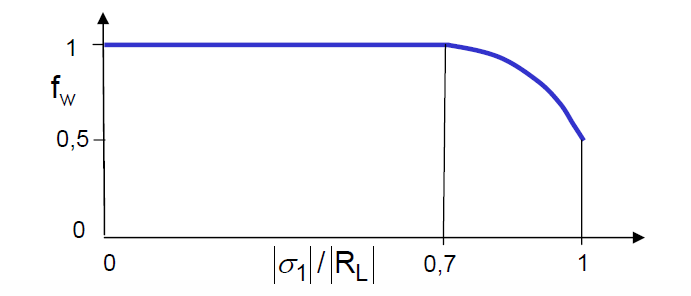

---
## Versagenskriterium für ebenen Spannungszustand

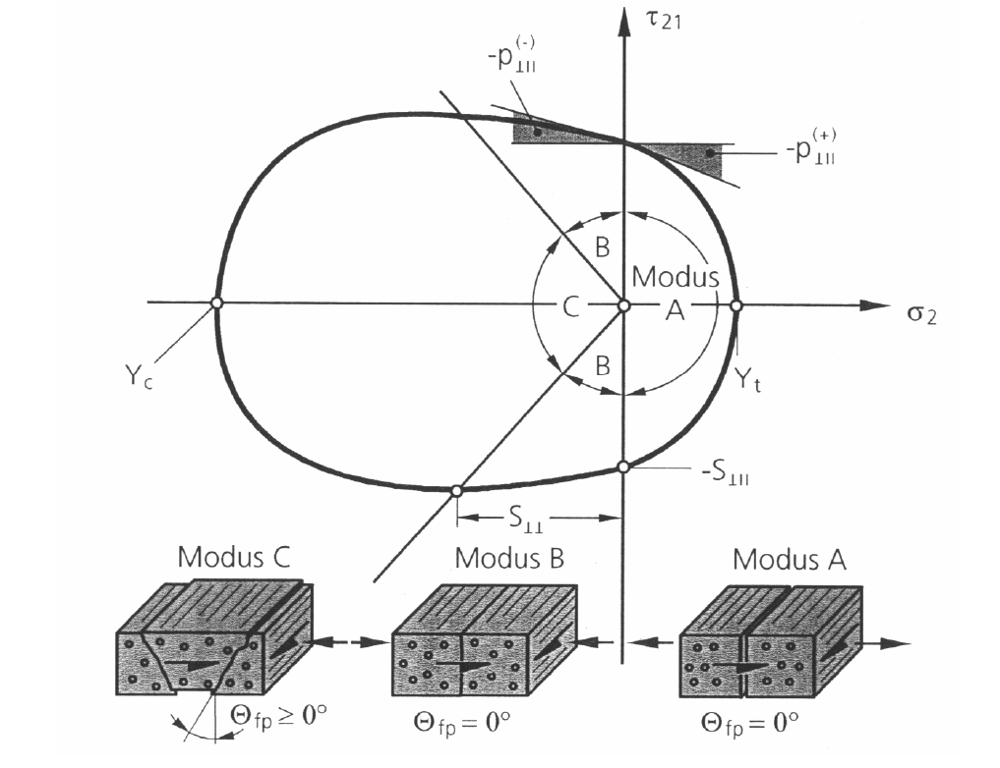

- **Modus A**: $\Theta_{fp} = 0°$ (Faserparallel)
- **Modus B**: $\Theta_{fp} = 0°$ (Zwischenfaserbruch, $\sigma_n$ dominiert)
- **Modus C**: $\Theta_{fp} \geq 0°$ (Zwischenfaserbruch, $\tau$ dominiert)

---

## Versagenskriterium für ebenen Spannungszustand (Puck)

**Zwischenfaserbruch mit Bruchwinkel $\Theta_{fp} > 0$ (Modus C)**
kann durch Keilwirkung zu erheblichen Schäden führen

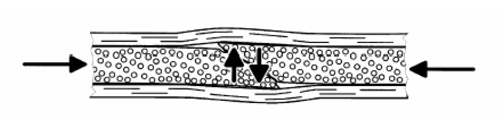

---

## Versagenskriterium für ebenen Spannungszustand (Puck)

**Modus A** für $\sigma_2 > 0$

$$\boxed{\left(\frac{1}{R_T^{(+)2}} - 2\frac{p_{LT}^{(+)}}{R_{LT} \cdot R_T^{(+)}}\right) \cdot \sigma_2^2 + 2\frac{p_{LT}^{(+)}}{R_{LT}} \cdot \sigma_2 + \frac{\tau_{21}^2}{R_{LT}^2} = 1} \qquad \theta_{fp} = 0°$$

**Modus B** für $\sigma_2 < 0$ und $0 \leq |\sigma_2| / |\tau_{21}| \leq R_{TT}^A / |\tau_{21c}|$

$$\boxed{2\frac{p_{LT}^{(-)}}{R_{LT}} \cdot \sigma_2 + \frac{\tau_{21}^2}{R_{LT}^2} = 1} \qquad \theta_{fp} = 0°$$

**Modus C** für $\sigma_2 < 0$ und $0 \leq |\tau_{21}| / |\sigma_2| \leq |\tau_{21c}| / s_{\perp\perp}$

$$\boxed{\frac{(2\sigma_2 + R_T^{(-)})^2}{R_T^{(-)2}} + \frac{\tau_{21}^2}{(1 + p_{TT}^{(-)})^2 \cdot R_{LT}^2} = 1} \qquad \cos\theta_{fp} = \sqrt{R_{TT}^A / (-\sigma_2)}$$

---
## Parameterbeziehungen (Puck)

**Für ebenen Spannungszustand:**

$$R_{TT}^A = \frac{R_{LT}}{2p_{LT}^{(-)}} \left(\sqrt{1 + 2 \cdot p_{LT}^{(-)} \cdot R_T^{(-)}/R_{LT}} - 1\right)$$

$$p_{TT}^{(-)} = p_{LT}^{(-)} \cdot R_{TT}^A / R_{LT}$$

$$\tau_{21c} = R_{LT} \sqrt{1 + 2 \cdot p_{TT}^{(-)}}$$

**Bedeutung:**
- $R_{TT}^A$: Widerstand der Wirkebene gegen $\tau_{nt}$
- $p_{TT}^{(-)}$: Neigungsparameter im Druckbereich
- $\tau_{21c}$: Kritische Schubspannung für Modus-Übergang

---
## Einfacher parabolischer Ansatz nach Cuntze et al. (1997)

**Gleichsetzen der Neigungsparameter:**

$$p_{LT}^{(+)} = p_{TT}^{(+)} = p^{(+)}$$

$$p_{LT}^{(-)} = p_{TT}^{(-)} = p^{(-)}$$

**im Druckspannungsbereich** (parabolische Konturlinien)

$$\boxed{2\frac{p^{(-)}}{R_T^{(-)}} \sigma_n + \left(\frac{\tau_{nt}}{R_{TT}^A}\right)^2 + \left(\frac{\tau_{n1}}{R_{LT}}\right)^2 = 1}$$

**im Zugspannungsbereich**

$$\boxed{\left(\frac{1 - 2p^{(+)}}{R_T^{(+)}}\right)^2 \sigma_n^2 + 2\frac{p^{(+)}}{R_T^{(+)}} \sigma_n + \left(\frac{\tau_{nt}}{R_{TT}^A}\right)^2 + \left(\frac{\tau_{n1}}{R_{LT}}\right)^2 = 1}$$

---
## Kriterien nach Dávila, Camanho und Rose¹ (2005): LaRC03

**Formulierung für ebenen Spannungszustand** (LaRC04 für 3D in NASA/TM-2005-213530)

**6 getrennte Kriterien für:**

- Matrix unter Zug ($\sigma_{22} \geq 0$) (#2)
- Matrix unter Druck ($\sigma_{22} < 0$)
  - $\Rightarrow \sigma_{11} < R_T^{(-)}$ (#6)
  - $\Rightarrow \sigma_{11} \geq R_T^{(-)}$ (#1)
- Faser unter Zug ($\sigma_{11} \geq 0$) (#3)
- Faser unter Druck ($\sigma_{11} < 0$)
  - $\Rightarrow \sigma_{22}^m < 0$ (#4)
  - $\Rightarrow \sigma_{22}^m \geq 0$ (#5)

$\sigma^m$ bezeichnen Spannungen in Richtung ondulierter Fasern

---

 

## Vergleich LaRC03 mit Puck (2D) für 2-achsige Normalspannungen

*Vergleich der Versagensflächen im $(\sigma_{11}, \sigma_{22})$-Raum zeigt gute Übereinstimmung zwischen LaRC03 und Puck-Kriterium*

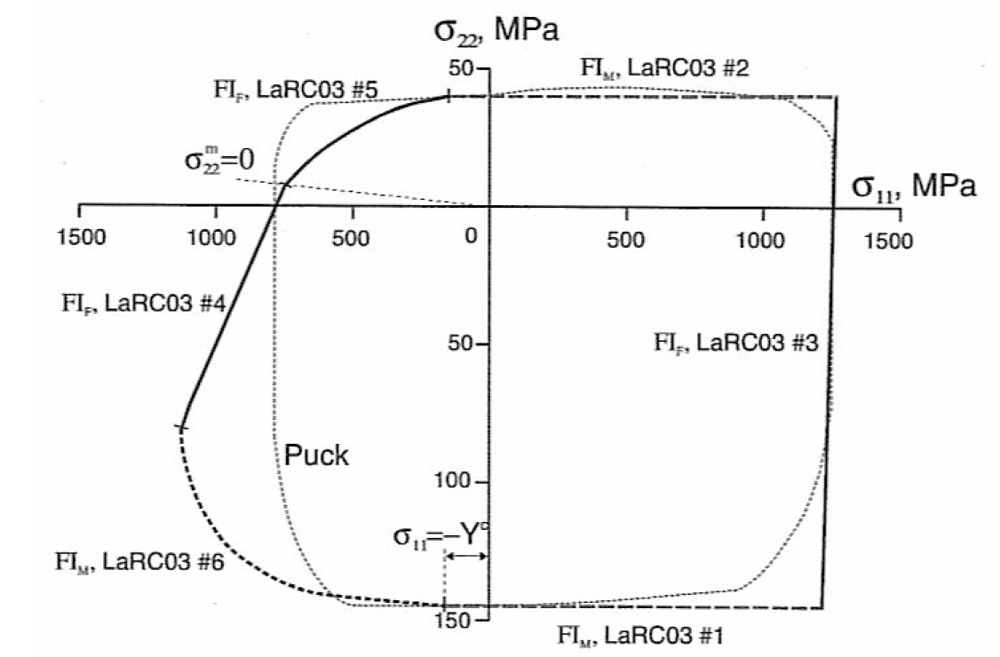

 
¹Dávila, C.G., Camanho, P.P., Rose, C.A.: Failure Criteria for FRP Laminates,
*Journal of Composite Materials* **39** (2005), No. 4, 323-345.

Bild entmommen aus der Vorlesung "Leichtbau mit Faserverbunden" SS2008 von Prof. Dr.-Ing. Klaus Rohwer"

---
# Vergleich verschiedener Versagenskriterien
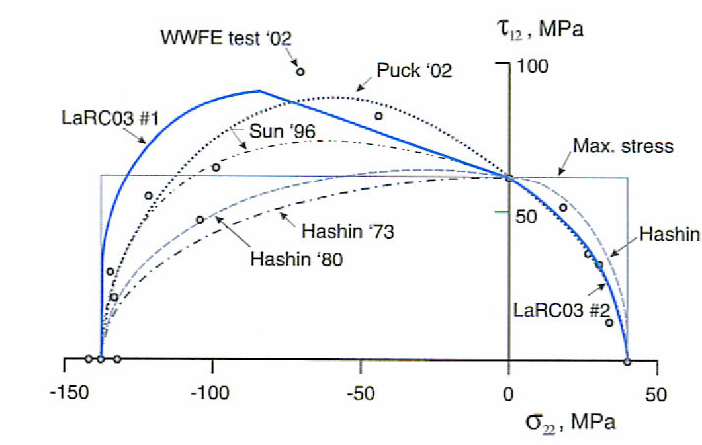

---

# Bruchmechanische Rissfortschrittsuntersuchung

---
# Bruchmechanische Rissmoden

**Mode I:** Öffnungsmodus (normal zur Rissfläche)

**Mode II:** Schermodus in Rissebene (in Rissfortschrittsrichtung)

**Mode III:** Schermodus quer zur Rissfortschrittsrichtung

---
# Bruchmechanische Rissfortschrittsuntersuchung

**Step 1: Crack held** - Riss gehalten unter Kraft **F**

**Step 2: Crack released** - Riss freigegeben, Verschiebung $\delta_u - \delta_l$

$$\Delta G = \frac{1}{2} \mathbf{F}(\boldsymbol{\delta}_u - \boldsymbol{\delta}_l) / \Delta A \qquad \Delta A = \Delta a \cdot \text{Dicke}$$

---
## Bruchmechanische Rissfortschrittsuntersuchung

**CCM** (Riss-Schließungsmethode) basiert auf Annahme:
$$\Rightarrow \text{Energiefreisetzung durch Rissöffnung = Arbeit zur Riss-Schließung}$$

CCM benötigt **2 FE-Analysen**, vor (Kraft) und nach Rissöffnung (Verschiebung)

**VCCT** (virtuelle Riss-Schließungstechnik) basiert auf 2 Annahmen:
$$\Rightarrow \text{Energiefreisetzung durch Rissöffnung = Arbeit zur Riss-Schließung}$$
$$\Rightarrow \text{Rissöffnung ändert den Zustand an der Riss-Spitze nicht erheblich}$$

---

VCCT bestimmt Kraft und Verschiebung aus **einer FE-Analyse**

führt zu konservativen Ergebnissen,

berechnete Freisetzungsrate etwas geringer als in der Realität

**VCCT-paper:**
Rybicki & Kaminen: A finite element calculation of stress intensity factor by a modified crack closure integral. *Engineering Fracture Mechanics* **9** (1977) 931-938.

---
# Bruchmechanische Rissfortschrittsuntersuchung

$$G_I = -\frac{1}{2} \frac{1}{\Delta A} F_{z1}(w_2 - w_{2'}) \frac{a_0}{a_2}$$

$$G_{II} = -\frac{1}{2} \frac{1}{\Delta A} F_{x1}(u_2 - u_{2'}) \frac{a_0}{a_2}$$

$$G_{III} = -\frac{1}{2} \frac{1}{\Delta A} F_{y1}(v_2 - v_{2'}) \frac{a_0}{a_2}$$

**Koordinatensystem:** x-Richtung parallel zur Rissfront

---
## Bruchmechanische Rissfortschrittsuntersuchung

**Vorgehen:**

- Berechnete Energiefreisetzungsrate mit kritischen Werten vergleichen

- Kritische Werte aus Versuchen an Proben

- Weiterreißen nach erstem Anriss

**Kritische Werte:**

$G_{Ic}$ aus DCB-Test (double cantilever beam)

$G_{IIc}$ aus ENF-Test (end notch flexure)

$G_{IIIc}$ wird kaum gemessen, meist so groß, dass uninteressant

- Für ENF-Test wird meist die Probe aus dem DCB-Test weiterbenutzt

---
# Ermittlung von $G_{Ic}$ (nach DIN EN 6033, 1995)

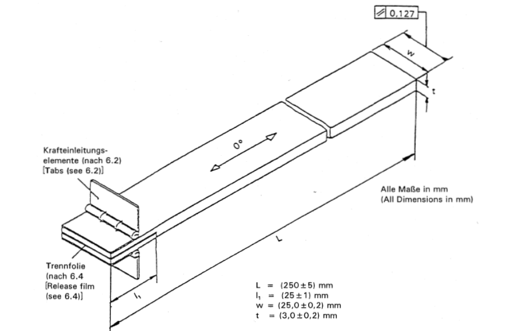

---

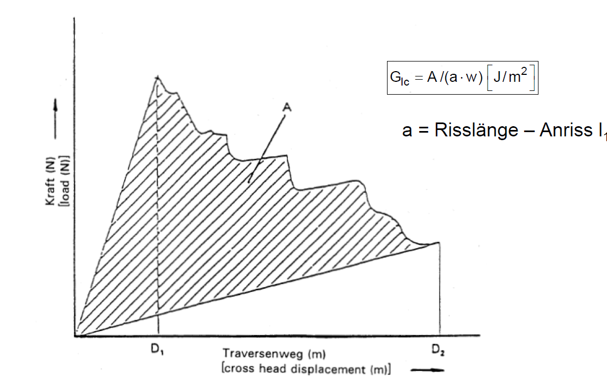

---

# Ermittlung von $G_{IIc}$ (nach DIN EN 6034, 1995)
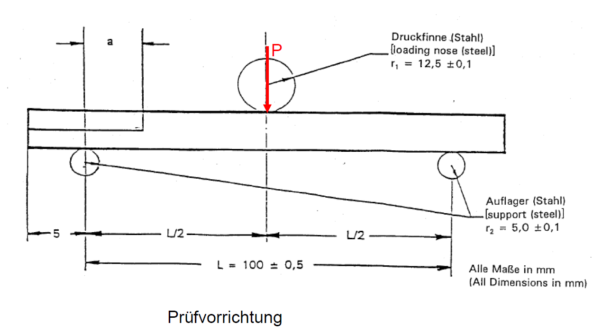

---

Beginn der Rissausbreitung durch Messmikroskop beobachten,
Versuch stoppen und kritische Kraft P feststellen

Berechnet wird die kritische Energiefreisetzungsrate nach

$$\boxed{G_{IIc}\left[\text{J/m}^2\right] = \frac{9 \cdot P \cdot a^2 d \cdot 1000}{2 \cdot w\left(L^3/4 + 3 \cdot a^3\right)}}$$

---

| Symbol | Einheit | Bedeutung |
|--------|---------|-----------|
| $P$ | N | kritische Kraft zur Risseinleitung |
| $a$ | mm | Anrisslänge |
| $d$ | mm | Traversenweg bei Beginn der Rissdelamination |
| $w$ | mm | Breite des Probekörpers |
| $L$ | mm | Stützweite |

- es gibt weitere analytische Gleichungen
- Streuungen sind sehr hoch

---

# Bruchmechanische Rissfortschrittsuntersuchung

**Kritische Energiefreisetzungsraten bei 'Mixed Mode'**

$$\left(\frac{G_I}{G_{Ic}}\right)^{m_I} + \left(\frac{G_{II}}{G_{IIc}}\right)^{m_{II}} + \left(\frac{G_{III}}{G_{IIIc}}\right)^{m_{III}} = 1$$

**Hinweis:** $G_{III}$ ist oft vernachlässigbar klein

---

# Reservefaktor, Sicherheit, Materialanstrengung

- **Reservefaktor $RF$** kennzeichnet die Sicherheit gegen Versagen:
    - $RF < 1$: Struktur versagt.
    - $RF = 1$: Versagensgrenze.
    - $RF > 1$: Struktur ist sicher.
- $RF$ ist ein Faktor für Spannungen oder Verzerrungen, mit dem die Beanspruchung gerade die Versagensgrenze erreicht.

---

- **Beispiel quadratisches Interaktionskriterium**:
  $F_{11}(RF \cdot \sigma_1)^2 + 2F_{12} \cdot RF^2 \cdot \sigma_1\sigma_2 + F_{22}(RF \cdot \sigma_2)^2 + F_{33}(RF \cdot \tau_{12})^2 + \dots = 1$
- **Materialanstrengung $A$**: Definiert als der Kehrwert des Reservefaktors ($A = 1/RF$).
- **Sicherheitsbeiwert $j$ (oder $\gamma_S$)**: In Industriezweigen vorgeschrieben (z.B. $j = 1,5$ in der Luftfahrt).
- **Bedingung für sichere Auslegung**: $RF \ge j$ bzw. $A \le 1/j$.

---

## Vielen Dank für Ihre Aufmerksamkeit!

**Kontakt:**
Prof. Dr.-Ing. Christian Willberg
Hochschule Magdeburg-Stendal
