<!-- _class: lead -->

# Mikromechanik von Langfaserverbunden

Prof. Dr.-Ing. Christian Willberg
Hochschule Magdeburg-Stendal

---

<!-- _class: lead -->

# Annahmen für die Berechnung
- Fasern
   - homogen
   - isotrop oder transversal isotrop - linear elastisch
   - kreisrunder Querschnitt
   - regelmäßig angeordnet
   - gerade ausgerichtet (UD-Schicht) oder bekannte Verwebung
- Matrix
   - homogen
   - linear elastisch, ideal plastisch, viskoplastisch
   - isotrop

---
# Querschnitte von C-Fasern

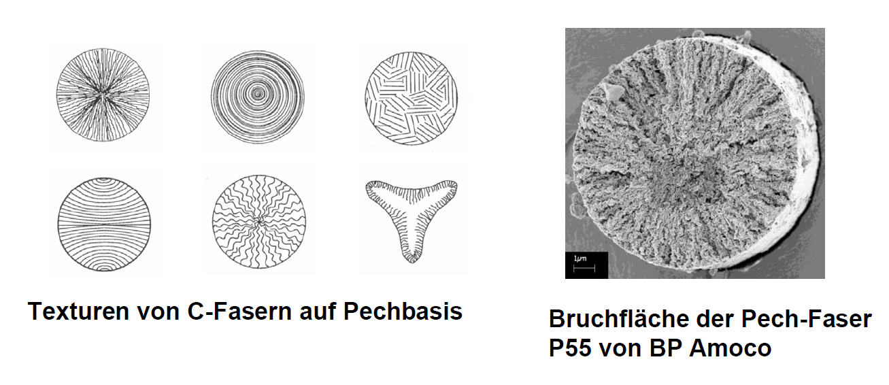

 
    Bild entmommen aus der Vorlesung "Leichtbau mit Faserverbunden" SS2008 von Prof. Dr.-Ing. Klaus Rohwer"

---

# Verteilung und Ausrichtung von Fasern

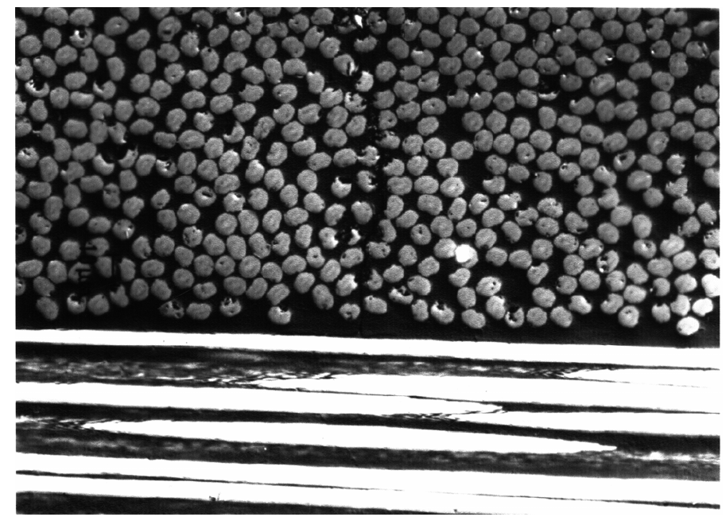

 
    Bild (rechts) entmommen aus der Vorlesung "Leichtbau mit Faserverbunden" SS2008 von Prof. Dr.-Ing. Klaus Rohwer"

---

# Repräsentativer Bereich

- bei unregelmäßiger Anordnung
   - repräsentativer Bereich muss groß genug sein
   - Anzahl der Fasern durch Zufallsvariablen gesteuert
   - Annahme von Periodizität
   - führt zu einem repräsentativen Volumenelement (RVE)

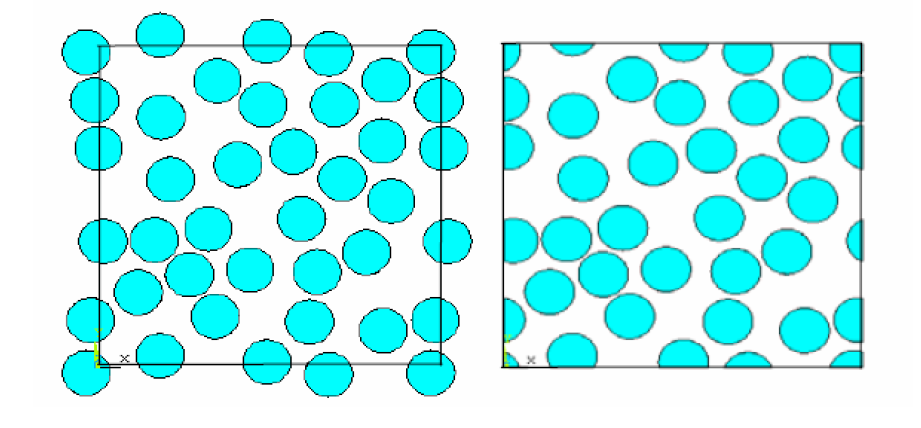

 
    Bild entmommen aus der Vorlesung "Leichtbau mit Faserverbunden" SS2008 von Prof. Dr.-Ing. Klaus Rohwer"

---

# Repräsentativer Bereich

- Grenzen: 
   - Dimensionen sehr unterschiedlich sind (Ebene vs. Laminatdicke)
   - Periodizität in allen Raumrichtungen nicht streng erfüllt
   - Dominanz der Effekte innerhalb der Ebene

 
    Bild entmommen aus der Vorlesung "Leichtbau mit Faserverbunden" SS2008 von Prof. Dr.-Ing. Klaus Rohwer"

---

# Repräsentativer Bereich

 
    Bild entmommen aus "Peridynamic analysis of fibre-matrix debond and matrix failure mechanisms in composites under transverse tensile load by an energy-based damage criterion", Rädel, M., Willberg, C. and Krause, D.; 10.1016/j.compositesb.2018.08.084

---
# Repräsentativer Bereich
UD-Schicht mit regelmäßiger Anordnung

- Quadratische Anordnung
   - max. Faservolumengehalt
   $\varphi = \pi/4 \approx 0.785$
- Hexagonale Anordnung
   - max. Faservolumengehalt
   $\varphi = \pi\sqrt3/6 \approx 0.907$

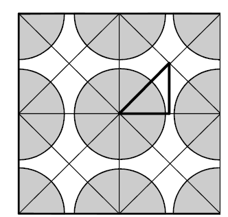

 
    Bild entmommen aus der Vorlesung "Leichtbau mit Faserverbunden" SS2008 von Prof. Dr.-Ing. Klaus Rohwer"

---

# Beispie für mikromechanische Spannungsberechnung

## Beispiel: Aushärtespannungen

- Aushärtespannungen (curing stresses) in einer UD-Schicht aus CF mit Epoxidharz-Matrix
- CFK-UD Schicht wird bei 180°C ausgehärtet
- nach dem Aushärten wird der Verbund abgekühlt
- bei etwa 120°C wird die Matrix fest und der Zustand wird eingefroren
- weitere Abkühlung auf Raumtemperatur (20°C) ergibt eine Temperaturdifferenz von 100°C
- unterschiedliche Wärmedehnungen von Fasre und Matrix im Zusammenwirken mit der Haftung bewirken einen Eigenspannungszustand

---

## Beispiel: Aushärtespannungen

- im Inneren der UD Schicht, störungsfrei $\rightarrow$ ebener Dehnungszustand
- senkrecht zur Faser: 2D Problem
- am freien Rand (senkrecht zu Faser); Verwölbung der Oberfläche, weil keine äußeren Kräfte
- 3D Problem
- Berechnung des Verschiebungs- und Spannungszustandes mit FEM, Materialgesetze müssen bekannt sein
- Matrix ist isotrop, linear elastisch und charakterisiert durch E-Modul $E$, Querkontraktionszahl $\nu$, Temperaturdehnkoeffizient $\alpha$

---

- Kohlenstofffaser ist transversalisotrop, linear elastisch und beschrieben durch 5 Koeffizienten
   -  $E_L$, $E_T$: E Moduli in Faserrichtung und senkrecht
   - $G_{LT}$ Schubmodul parallel-senkrecht
   - $\nu_{TT}$, $\nu_{LT}$ Querkontraktionszahl parallel-senkrecht, senkrecht-senkrecht
- 2 Temperaturdehnkoeffizienten: $\alpha_L$, $\alpha_T$

---

$$\begin{bmatrix}
\varepsilon_{xx} \\
\varepsilon_{yy} \\
\varepsilon_{zz} \\
\gamma_{yz} \\
\gamma_{xz} \\
\gamma_{xy}
\end{bmatrix} =
\begin{bmatrix}
\frac{1}{E_L} & -\frac{\nu_{LT}}{E_L} & -\frac{\nu_{LT}}{E_L} & 0 & 0 & 0 \\
-\frac{\nu_{LT}}{E_L} & \frac{1}{E_T} & -\frac{\nu_{TT}}{E_T} & 0 & 0 & 0 \\
-\frac{\nu_{LT}}{E_L} & -\frac{\nu_{TT}}{E_T} & \frac{1}{E_T} & 0 & 0 & 0 \\
0 & 0 & 0 & \frac{1}{G_{LT}} & 0 & 0 \\
0 & 0 & 0 & 0 & \frac{1}{G_{LT}} & 0 \\
0 & 0 & 0 & 0 & 0 & \frac{2(1+\nu_{TT})}{E_T}
\end{bmatrix}
\begin{bmatrix}
\sigma_{xx} \\
\sigma_{yy} \\
\sigma_{zz} \\
\sigma_{yz} \\
\sigma_{xz} \\
\sigma_{xy}
\end{bmatrix} +\begin{bmatrix}
\alpha_L \\
\alpha_T \\
\alpha_T \\
0 \\
0 \\
0
\end{bmatrix}\cdot \Delta T$$
- x-Achse oder 1-Achse = Faserrichtung (L)
- y- und z-Achse oder 2- und 3-Achse = quer zur Faserrichtung (T) 

---

## Materialgrößen und Geometrie

$\begin{array}{llll}
\text{Fasern}:   & E_L = 240GPA & \text{Matrix}: &E=3.5GPA\\
&E_L = 240GPA&&\nu=0.35\\
&G_{LT}=16GPA&&\alpha=55\cdot10^{-6}K^{-1}\\
&\nu_{LT} = 0.23\\
&\nu_{TT} = 0.23\\
&\alpha_L = 0.7\cdot10^{-6}K^{-1}\\
&\alpha_T = 5.5\cdot10^{-6}K^{-1}\\
\text{Faservolumengehalt}: & 60\%\\
\text{Faseranordnung}: & \text{hexagonal}\\
\end{array}
$

---
# Repräsentatives Element

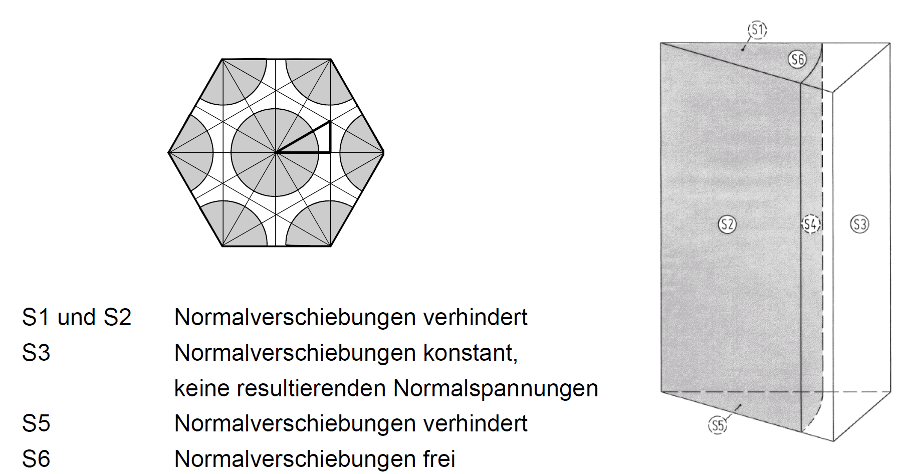

 
    Bild entmommen aus der Vorlesung "Leichtbau mit Faserverbunden" SS2008 von Prof. Dr.-Ing. Klaus Rohwer"

---
# Verformung infolge Temperturerhöhung

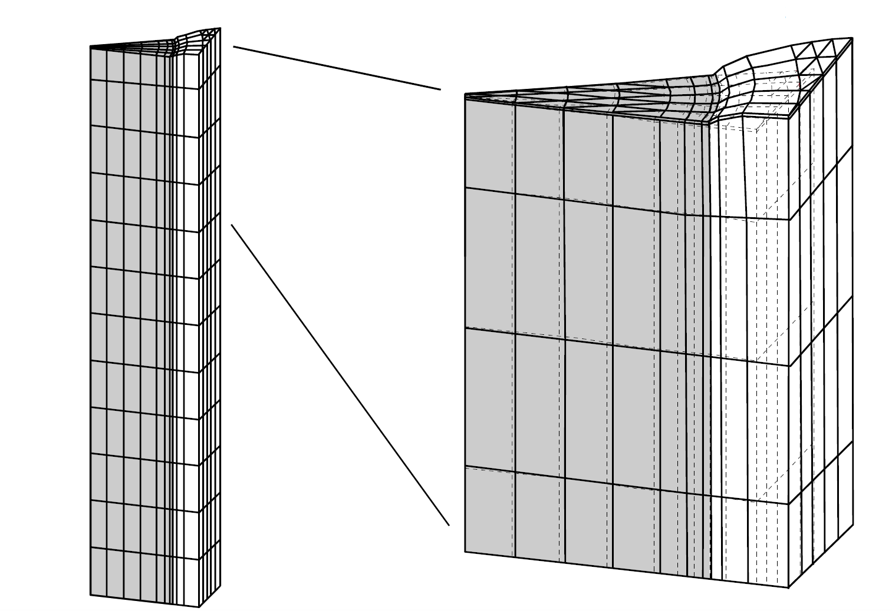

 
    Bild entmommen aus der Vorlesung "Leichtbau mit Faserverbunden" SS2008 von Prof. Dr.-Ing. Klaus Rohwer"

---
# Axialspannungen $\Delta T = -100°C$

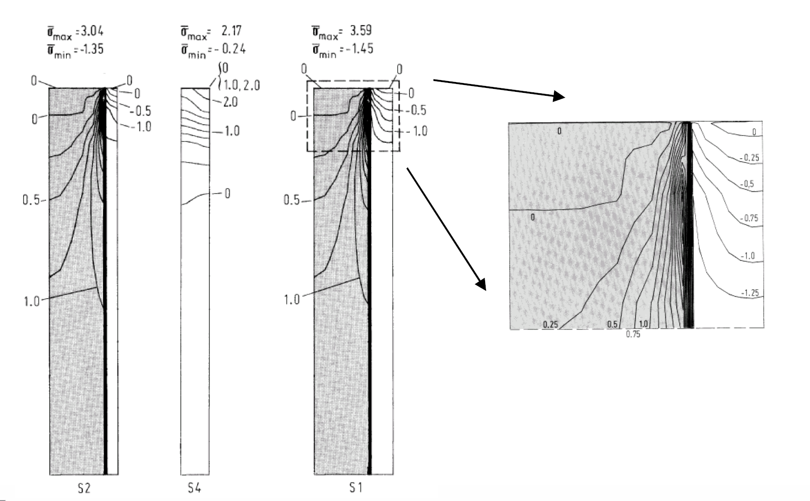

 
    Bild entmommen aus der Vorlesung "Leichtbau mit Faserverbunden" SS2008 von Prof. Dr.-Ing. Klaus Rohwer"

---

# Radialspannungen $\Delta T = -100°C$

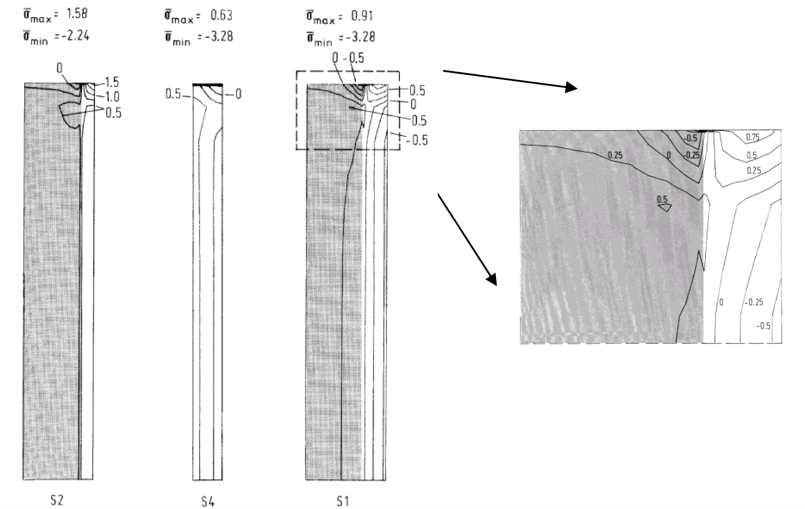

 
    Bild entmommen aus der Vorlesung "Leichtbau mit Faserverbunden" SS2008 von Prof. Dr.-Ing. Klaus Rohwer"

---

# Umfangsspannungen $\Delta T = -100°C$

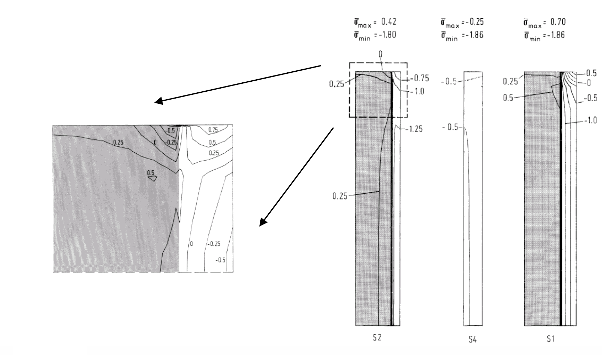

 
    Bild entmommen aus der Vorlesung "Leichtbau mit Faserverbunden" SS2008 von Prof. Dr.-Ing. Klaus Rohwer"

---
# Schubspannungen $\Delta T = -100°C$

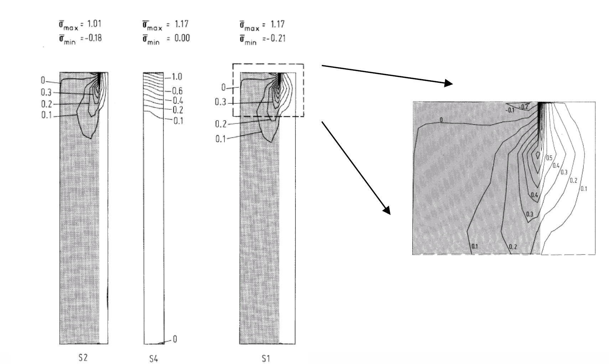

 
    Bild entmommen aus der Vorlesung "Leichtbau mit Faserverbunden" SS2008 von Prof. Dr.-Ing. Klaus Rohwer"

---

# Thermische Zyklierung bei Tiefsttemperaturanwendungen

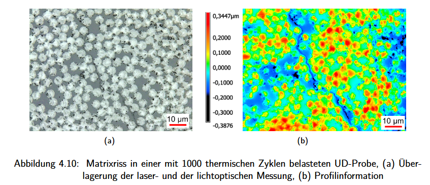

 
    Bild entmommen aus Lüders, C. "Mehrskalige Betrachtung des
Ermüdungsverhaltens thermisch zyklierter
Faserkunststoffverbunde", Dissertation, 2020

---

 
    Bild entmommen aus Lüders, C. "Mehrskalige Betrachtung des
Ermüdungsverhaltens thermisch zyklierter
Faserkunststoffverbunde", Dissertation, 2020

---

# Homogenisierung
- Reduktion der Einzekomponenten auf eine Einzelkomponente
- Reduktion des Modellierungsaufwands
- Homogenisierungsverfahren unterscheiden sich abhängig vom betrachteten Parameter
   - Steifigkeit
   - Wärmedehnungkoeffizienten
   - Feuchtequellkoeffizienten
   - Wärmeleitfähigkeitskoeffizienten
   - Festigkeiten

---

# Homogenisierung von Steifigkeiten
- Steifigkeiten von Fasern und Matrix sind extrem unterschiedlich
- für die BErechnung komplexer Strukturen ist die Berücksichtigung einzelner Fasern zu aufwändig $\rightarrow$ Einzelschicht wird als homogenes Kontinuum modelliert
- globales Verhalten soll hinreichend genau beschrieben werden
- Modellierung örtlicher (lokaler) Aspekte wird vernachlässigt, z.B Verwölbung am freien Rand

---
## Allgemeine Regeln
- E Modul in Faserrichtung $E_L$ und Querkontraktionszahl $\nu_{LT}$: parallel geschaltete Feder 
$\rightarrow$ Mischungsregel für Steifigkeiten

- E Modul in Querrichtung $E_T$, Schubmodul $G_{LT}$ und Querkontraktionszahl $\nu_{TT}$: in Reihe geschaltete Feder 
$\rightarrow$ Mischungsregel für Nachgiebigkeiten

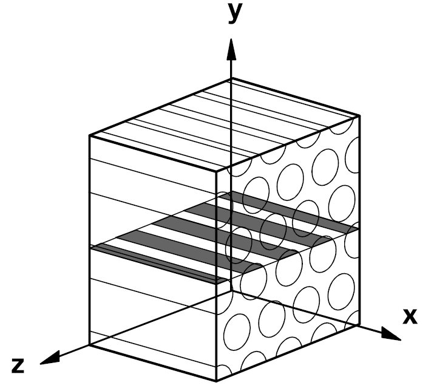

---

Korrektur erforderlich, weil Steifigkeit der Faser unter Belastung in Querrichtung nur zum Teil wirksam ist

---

# Formeln für isotrope Fasern

$\begin{array}{ll}
\text{\textbf{Faserwerte}}    & \text{\textbf{Matrixwerte}}\\
E_f & E_m\\
\nu_f & \nu_m\\
\text{\textbf{Faservolumengehalt}} &\varphi\\
\\
\text{\textbf{E-Modul in Faserrichtung}}\\
E_L=\varphi E_f+(1-\varphi)E_m & \text{Mischungsregel}\\
\text{\textbf{Querkontraktionszahl}}\\
\nu_{LT}=\varphi \nu_f+(1-\varphi)\nu_m &\text{Mischungsregel}\\
\text{\textbf{E-Modul in Querrichtung}}\\
1/E_T\approx \varphi/E_f + (1-\varphi)/E_m &\text{Mischungsregel für Nachgiebigkeit}
\end{array}
$
Korrektur erforderlich; entsprechend auch für $G_{LT}$ und Qerkontraktionszahl $\nu_{TT}$

---

# Korrigierte $E_T$ Werte für isotrope Fasern
Es existieren viele verschiedene Ansätze - keiner mit Anspruch auf Allgemeingültigkeit
**Beispiele**
$\begin{array}{ll}
\text{\textbf{Puck}}    & E_T = \frac{(1+0.85\varphi^2)E_m}{\varphi E_m/E_f+(1-\varphi)^{1.25}}\\
\text{\textbf{Tsai, Hahn, Wu}} & E_T=\frac{\varphi+0.5(1-\varphi)}{\varphi/E_f+0.5(1-\varphi)/E_m}\\
\text{\textbf{Geier}} & E_T=\frac{E_fE_m}{\varphi/E_m+(1-\overline{\varphi}E_f)}\qquad\text{mit}\qquad \overline{\varphi}=\varphi+\zeta\varphi(1-\varphi);\zeta\approx 0.6\\
\text{\textbf{Chamis}} & E_T=E_m/[1-\sqrt\varphi(1-E_m/E_f)]
\end{array}
$

---

# Korrigierte $G_{LT}$ Werte für isotrope Fasern

Ansätz entsprechen dem Vorgehen bei der Bestimmung von $E_T$

**Beispiele**
$\begin{array}{ll}
\text{\textbf{Puck}}    & G_{LT} = \frac{(1+0.6\sqrt\varphi)G_m}{\varphi G_m/G_f+(1-\varphi)^{1.25}}\\
\text{\textbf{Tsai, Hahn, Wu}} & G_{LT}=\frac{\varphi+0.5(1-\varphi)}{\varphi/G_f+0.5(1-\varphi)/G_m}\\
\text{\textbf{Geier}} & G_{LT}=\frac{G_fG_m}{\varphi/G_m+(1-\overline{\varphi}G_f)}\qquad\text{mit}\qquad \overline{\varphi}=\varphi+\zeta\varphi(1-\varphi);\zeta\approx 0.6\\
\text{\textbf{Chamis}} & G_{LT}=G_m/[1-\sqrt\varphi(1-G_m/G_f)]
\end{array}
$

---

# Anwendung der Homogenisierungsformeln
**Problem der Kennwertbestimmung**
- nur wenige Faserkennwerte können direkt im Versuch bestimmt werden
- insbesondere in Querrichtung und unter Schubbelastung lassen sich Einzelfasern kaum testen
- die Formeln zur Homogenisierung der Steifigkeiten sind für zwei unterschiedliche Aufgaben sinnvoll:
   - Bestimmung der Faserwerte aus Messungen an UD Schichten und Reinharzproben (Inverse Anwendung)
   - Umrechnung der Laminateigenschaften bei geändertem Faservolumenanteil

---

# Beispiel zur Anwendung der Homogenisierungsformeln
E-Glasfasern als UD-Verstärkungen in Epoxidharzmatrix eingebettet
Messungen am Verbund und am Reinharz durchgeführt

$\begin{array}{ll}
\text{\textbf{Verbundwerte}}    & \text{\textbf{Reinharzwerte}} \\
E_L=45GPA & E_m=3.3GPa\\
E_T=12GPa&\nu_m=0.3\\
G_{LT}=4.4GPa & G_m=\frac{E_m}{2(1+\nu_m)}=1.27GPa\\
\nu_{LT}=0.25\\
\nu_{TT}=0.25\\
\varphi=0.6
\end{array}
$

---

## Inverse Anwendung

$E_L=\varphi E_f+(1-\varphi)E_m$

$E_f=(E_l-(1-\varphi)E_m)/\varphi=72.8GPa$

$\nu_{LT}=\varphi \nu_f+(1-\varphi)\nu_m$

$\nu_{LT}=0.217$$

da isotrope Faser
$G_f=\frac{E_f}{2(1+\nu_f)}$
$G_f=29.91GPa$

---
## Umrechnung der Laminatwerte

$\varphi = 0.6 \rightarrow \varphi = 0.5 ?$

mit den bestimmten Werten für die Fasern $E_f$ und $\nu_f$ in den folgenden Gleichungen $\varphi=0.5$ einsetzen

$E_L=\varphi E_f+(1-\varphi)E_m=38GPa$

$\nu_{LT}=\varphi \nu_f+(1-\varphi)\nu_m=0.258$

---
## Umrechnung der Laminatwerte
**In Querrichtung sind Laminatwerte nicht eindeutig**

aus Puck
$E_T = \frac{(1+0.85\varphi^2)E_m}{\varphi E_m/E_f+(1-\varphi)^{1.25}}$

$E_T = 9.03GPa$

aus Geier
$E_T=\frac{E_fE_m}{\varphi/E_m+(1-\overline{\varphi}E_f)}\qquad\text{mit}\qquad \overline{\varphi}=\varphi+\zeta\varphi(1-\varphi);\zeta\approx 0.6$
$E_T = 8.7GPa$

---

## Umrechnung der Laminatwerte
aus Tsai, Hahn, Wu
$E_T=\frac{\varphi+0.5(1-\varphi)}{\varphi/E_f+0.5(1-\varphi)/E_m}$
$E_T=9.08GPa$

aus Chamis
$E_T=E_m/[1-\sqrt\varphi(1-E_m/E_f)]$
$E_T=10.16GPa$

Mittelwert ist $E_T=9.24GPa$ mit Abweichungen in einer Größenordnung von 10\%

---
## Umrechnung der Laminatwerte
**Schubmodul $G_{LT}$**

aus Puck
$G_{LT} = 3.35GPa$

aus Geier
$G_{LT} = 3.31GPa$

aus Tsai, Hahn, Wu
$G_{LT}=3.51GPa$

aus Chamis
$G_{LT}=3.93GPa$
Mittelwert ist $G_{LT}=3.52GPa$ mit Abweichungen in einer Größenordnung von 10\%

---

# Formeln für transversal-isotrope Fasern

$\begin{array}{ll}
\text{\textbf{Faserwerte}}    & \text{\textbf{Matrixwerte}}\\
E_{Lf} & E_m\\
\nu_{LTf} & \nu_m\\
G_{LTf}\\
E_{Lf}\\
G_{TTf}\\
\text{\textbf{Faservolumengehalt}} &\varphi\\
\text{\textbf{Formeln}}\\
E_L=\varphi E_f+(1-\varphi)E_m & \text{Mischungsregel}\\
\nu_{LT}=\varphi \nu_f+(1-\varphi)\nu_m &\text{Mischungsregel}\\
E_T=E_M/\left[1-\sqrt\varphi(1-E_m/E_{Tf})\right]&\text{Chamis}\\
G_{LT}=G_m/\left[1-\sqrt\varphi(1-G_m/G_{LTf})\right]&\text{Chamis}\\
G_{TT}=G_m/\left[1-\sqrt\varphi(1-G_m/G_{TTf})\right]&\text{Chamis}\\
\nu_{TT=\frac{E_T}{2G_{TT}}-1}&\text{Chamis}
\end{array}
$

---
# Berücksichtung von Faserondulation

- repräsentatives Element mit FEM zu berechnen
- Modelle können enorm komplex sein
- Gewebe können so abgebildet werden

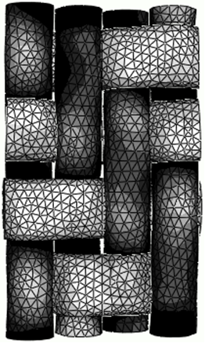

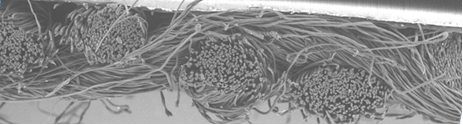

 
    Bild 1+2 entmommen aus Lin, H; et al. "A finite element approach to the modelling of fabric mechanics and its application to virtual fabric design and testing", 10.1080/00405000.2012.660755
    Bild 3 aus der Vorlesung "Leichtbau mit Faserverbunden" SS2008 von Prof. Dr.-Ing. Klaus Rohwer"

---

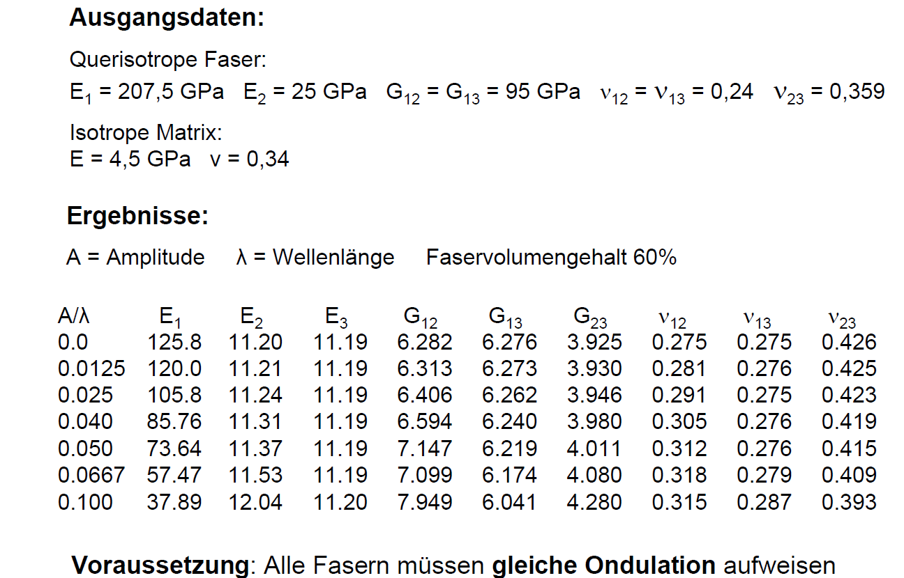

---
# Homogenisierung von Wärmeausdehnungskoeffizienten
## Ziel
- Wärmeausdehnungskoeffizienten von Faser und Matrix können sehr unterschiedlich sein (C-Faser in Kunstharzmatrix)
- für die Berechnung komplexer Strukturen ist die Berücksichtigung dieses Unterschiedes viel zu aufwändig
    Die Einelschicht muss als Kontinuum mit einheitlichem Wärmeausdehnungskoeffizienten modelliert werden
- Kombination der Faser- und Matrixwerte deart, dass das globale Verhalten des Verbundes hinreichend genau beschrieben wird
- örtliche (lokale) Betrachtung wird vernachlässigt

---
# Homogenisierung für thermisch transversalisotrope Fasern

$\begin{array}{ll}
\text{\textbf{Faserwerte}}    & \text{\textbf{Matrixwerte}}\\
E_{Lf} & E_m\\
\nu_{LTf} & \nu_m\\
\alpha_{Lf} & \alpha_m\\
\alpha_{Tf} & \\
\text{\textbf{Faservolumengehalt}} &\varphi\\
\text{\textbf{Formeln}}\\
\alpha_L = \frac{\varphi E_{Lf}\alpha_{Lf}+(1-\varphi)E_m\alpha_m}{\varphi E_{Lf}+(1-\varphi)E_m}\\
\alpha_T = \overline{\varphi}\alpha_{Tf}+(1-\overline{\varphi})\alpha_m-(\alpha_m-\alpha_{Lf})\frac{\overline{\varphi}(1-\varphi)\nu_{LTf}E_m+\varphi(1-\overline{\varphi})\nu_mE_{Lf}}{\varphi E_{Lf}+(1-\varphi)E_m}\\
\text{mit}\qquad \overline{\varphi}=\varphi + \zeta\varphi(1-\varphi); \zeta\approx 0.6
\end{array}
$

---

# Bestimmung des Wärmeausdehnungskoeffizienten (CTE) von Fasern
- direkte Messung an Faserbündeln
- Rückrechnung aus Messungen an Verbunden
- Untersuchungen an Einzelfasern
    - mit Raser-Elektronenmikroskop (SME)
    - mit Tansmissions-Elektronenmikroskopie (TME)

---

# Homogenisierung von Feuchtequellkoeffizienten
## Ziel
- Feuchtequellkoeffizienten von Faser und Matrix sind meist sehr unterschiedlich
- häufig nimmt die Matrix die Feuchte aus der Umgebung auf und quillt dabei
- viele Verstärkungsfasern nehmen keine Feuchte auf (Ausnahme: Aramid, Biofasern)
- für die Berechnung der Feuchtequellung in komplexen Strukturen ist die Berücksichtigung der Unterschiede viel zu aufwändig
- die Einzelschicht soll das globale Verhalten unter Nutzung einer einheitlichen Feuchtequellzahl beschreiben
- örtliche (lokale) Effekte werden vernachlässigt

---

# Homogenisierung der Feuchtequellkoeffizienten für Fasern transversalisotroper Quellung

$\begin{array}{ll}
\text{\textbf{Faserwerte}}    & \text{\textbf{Matrixwerte}}\\
E_{Lf} & E_m\\
\nu_{LTf} & \nu_m\\
\rho_{f} & \rho_m\\
\beta_{Tf} &\beta_m\\
\beta_{Tf}\\
\Delta c_f \text{ Änderung der rel. Feuchte} & \Delta c_m\\
\text{Quellung: }\varepsilon = \Delta c \beta\\
\text{\textbf{Faservolumengehalt}} &\varphi\\
\end{array}
$

---

# Homogenisierung der Feuchtequellkoeffizienten für Fasern transversalisotroper Quellung

$\begin{array}{ll}
\Delta c=\frac{\varphi\rho_f \Delta c_f+(1-\varphi)\rho_m \Delta c_m}{\varphi\rho_f+(1-\varphi)\rho_m}\\
\beta_L = \frac{1}{\Delta c}\frac{\varphi E_{Lf}\Delta c_f \beta_{Lf}+(1-\varphi)E_m\Delta c_m\beta_m}{\varphi E_{Lf}+(1-\varphi)E_m}\\
\beta_T = \frac{1}{\Delta c}\left[\overline{\varphi}\Delta c_f \beta_{Lf}+(1-\overline{\varphi})\Delta c_m \beta_{m} - (c_m \beta_{m}-\Delta c_f \beta_{Lf})\frac{\overline{\varphi}(1-\varphi)\nu_{LTf}E_m+\varphi(1-\overline{\varphi})\nu_mE_{Lf}}{\varphi E_{Lf}+(1-\varphi)E_m}\right]
\\
\text{mit}\qquad \overline{\varphi}=\varphi + \zeta\varphi(1-\varphi); \zeta\approx 0.6 
\end{array}
$

---
# Homogenisierung von Wärmleitfähigkeitskoeffizienten

- Wärmleitfähigkeitskoeffizienten von Faser und Matrix sind zum Teil sehr unterschiedlich
    - Polymere im Allgemeinen gering
    - Glas-, und Aramidfasern gering
    - Kohlenstofffasern +- hoch in Faserrichtung- gering in Querrichtung
- für die Berechnung der Wärmeleitung in komplexen Strukturen ist die Berücksichtigung der Unterschiede viel zu aufwändig
- die Einzelschicht soll das globale Verhalten unter Nutzung einer einheitlichen Wärmeleitung beschreiben
- örtliche (lokale) Effekte werden vernachlässigt
- **Lufteinschlüsse** haben einen Effekt

---

$\begin{array}{ll}
\text{\textbf{Faserwerte}}    & \text{\textbf{Matrixwerte}}\\
k_{Lf} & k_m\\
k_{Tf} & \\
\text{\textbf{Faservolumengehalt}} &\varphi\\
\end{array}
$
Wärmeleitung in der UD-Schicht in Faserrichtung
$k_l=\varphi k_{Lf}+(1-\varphi)k_m$
senkrecht zur Faserrichtung gibt es viele Näherungsformeln
$k_l=\varphi k_{Lf}+(1-\varphi)k_m$
$k_l=\varphi k_{Lf}+(1-\varphi)k_m$

$\begin{array}{ll}
\text{\textbf{Lord Rayleigh (1882)}}   & k_t=k_m\left[1-2\frac{\varphi}{\nu'+\varphi+3\varphi^4S_4^2/(\nu'\pi^4)}\right]\\
&\nu'=(1+k_{Tf})/(1-k_{Tf}/k_m)\\
& s_4=0.0323502\pi^4\\
\text{\textbf{Selbskonsistentes Modell}} & k_t=k_m[k_{Tf}(1+\varphi)+k_m(1-\varphi)]/[k_{Tf}(1-\varphi)+k_m(1+\varphi)]\\
\end{array}
$

---
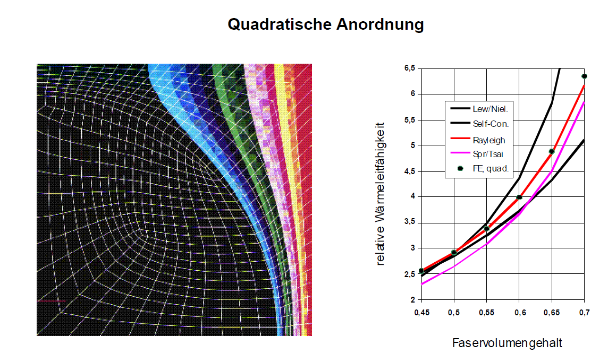

 
    Bild aus der Vorlesung "Leichtbau mit Faserverbunden" SS2008 von Prof. Dr.-Ing. Klaus Rohwer"

---

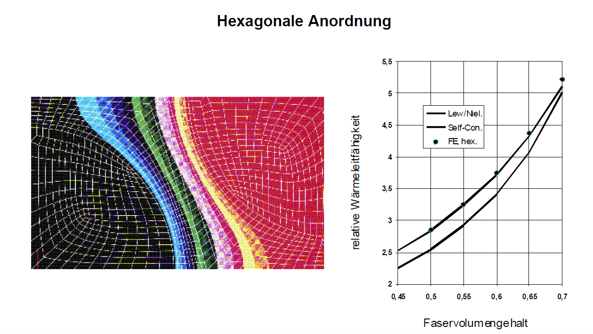

 
    Bild aus der Vorlesung "Leichtbau mit Faserverbunden" SS2008 von Prof. Dr.-Ing. Klaus Rohwer"

---
# Messungen der Wärmeleitfähigkeiten von Faserverbunden - Transient Hot-Strip Verfahren

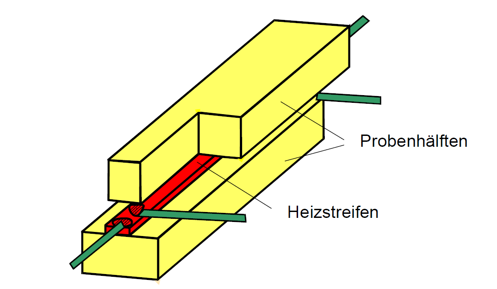

 
    Bild aus der Vorlesung "Leichtbau mit Faserverbunden" SS2008 von Prof. Dr.-Ing. Klaus Rohwer"

---

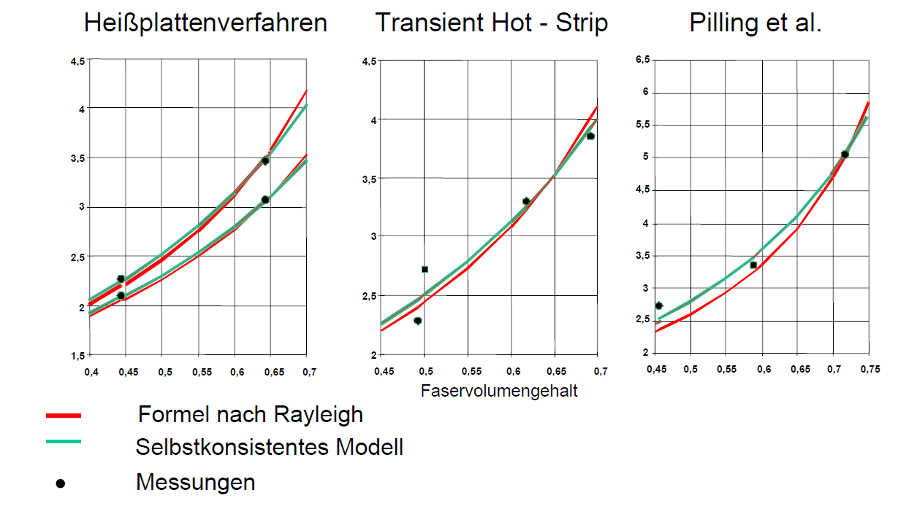

 
    Bild aus der Vorlesung "Leichtbau mit Faserverbunden" SS2008 von Prof. Dr.-Ing. Klaus Rohwer"

----

# Homogenisierung von Festigkeiten
- Faserfestigkeiten kaum direkt messbar
- Messbar
    - Zug- und Druckfestigkeiten in Faserrichtung 
    - Festigkeiten in Gewebe-Verbunden

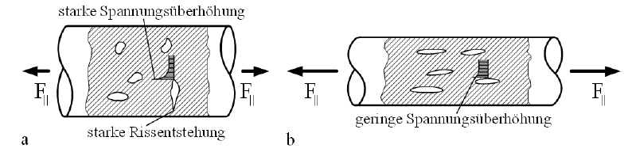

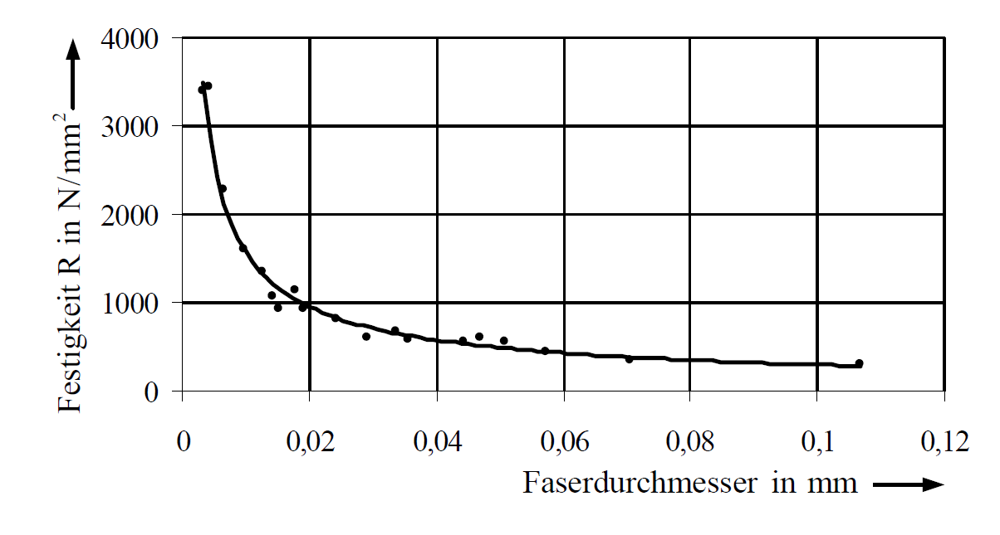

 
    Bilder aus H. Schürrmann "Konstruieren mit Faser-Kunststoff-Verbunden"

---

# Homogenisierung von Festigkeiten

- Erkenntnisse
    - Abschätzung der Festigkeiten bei geändertem Faservolumengehalt
    - besseres Verstehen des Verbundversagens
    - sinnvolle Auslegung von Fasern und Matrix

 
    Bilder aus H. Schürrmann "Konstruieren mit Faser-Kunststoff-Verbunden"

---

# Zugfestigkeit von UD-Verbunden
**Annahmen:**
Lineare Elastizität von Fasern und Matrix bis zum Bruch
Gleiche Festigkeit aller Fasern, kosntant über die gesamte Länge

**Festigkeiten unter Zugbeanspruchung (t) in Faserrichtung**
$\begin{array}{lll}
& \text{Fasern} &\text{Matrix}\\
\text{Bruchdehnungen}    &  \varepsilon_{ft} & \varepsilon_{mt}\\
\text{Bruchspannungen} 
 &  \sigma_{ft} & \sigma_{mt}\\
\end{array}
$
Übliche Auslegung : $\varepsilon_{mt}>\varepsilon_{ft}$
Faserkontrolliertes Versagen bedeutet: $\varepsilon_{t}=\varepsilon_{ft}$
Bei Faserbruch: 
Matrixdehnung = Bruchdehnung der Faser $\varepsilon_{ft}$
Matrixsapnnung = $\sigma_m(\varepsilon_{ft})$

---
## Bruchspannung des Verbundes nach Mischungsregel
$$\sigma_t=\sigma_{ft}\varphi+\sigma_m(\varepsilon_{ft})(1-\varphi)$$
Der Verbund versagt natürlich nur dann, wenn auch die Bruchspannung der Matrix überschritten ist
$$\sigma_t\geq\sigma_{mt}(1-\varphi)$$
Sonst trägt die Matrix trotz der gerissenen Fasern.
Nur bei sehr kleinen Faservolumengehalten möglich.

---
# Zugfestigkeiten von UD-Verbunden
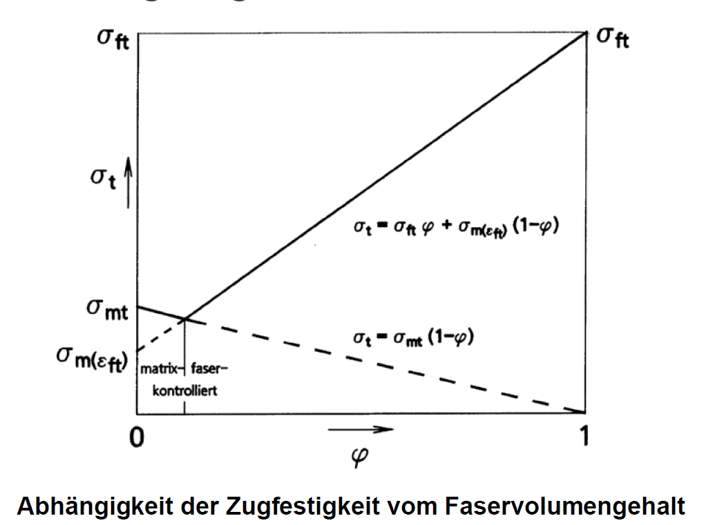

 
    Bild aus der Vorlesung "Leichtbau mit Faserverbunden" SS2008 von Prof. Dr.-Ing. Klaus Rohwer"

---
## Kritik an der Mischungsregel
- in einem Laminat ist die Zugfestigkeit von Faser zu Faser veschieden
- über die Faserlänge ist die Zugfestigkeit nicht konstant; lange Fasern haben eine geringere Festigkeit als kurze
- diese Tatsachen werden in der Mischungsregel nicht berücksichtigt
- aus diesem Grund wurden verbesserte Versagenshypothesen aufgestellt

---

# Versagenshypothese "Weakest Link Failure"

- berücksichtig eine statistische Verteilung der Faserfestigkeiten, abhängig von der Faserlänge $L$

Weibull-Verteilung $f(\sigma_t)=L\alpha\beta\sigma_t^{\beta-1}e^{-L\alpha\sigma_t^{\beta}}$
$\alpha$, $\beta$: Parameter zur Anpassung der Versuchsergebnisse

**Hypothese: Bruch der schwächsten Faser führt zum Versagen**
- Bruchspannung der schwächsten Fasern:
$$\sigma_{tw}=\left(\frac{\beta-1}{NL\alpha\beta}\right)$$
$N$ - Anzahl der Fasern im Verbund

---

## Kritik an der "Weakest Link Failure" Hypothese
- Realistische Versagensspannungen ergeben sich nur bei einer geringen Anzahl von Fasern und einer geringen Streubreite
- für praktisch relevante Faserverbunde werden zu geringe Festigkeiten prognostiziert

--- 

# Versagenshypothese "Cumulative Weakening Failure"

Bruch einer Faser beansprucht die Matrix in der Umgebung der Bruchstelle durch hohe Störspannungen $\rightarrow$ werden berücksichtigt

Annahmen:
- linear elastische Fasern, Faserdurchmesser $d_f$
- ideal plastische Matrix, Fließspannung $\tau_{mt}$
- Länge des Strörbereichs: $\delta=\frac{\sigma_{ft}}{4\tau_{mt}}d_f$
- Berücksichtigt werden
    - die Versagenswahrscheinlichkeit einer Faser der Länge $\delta$
    - eine statistische Verteilung der Faserfestigkeiten
- Verbundfestigkeit $\sigma_t^*=(\alpha\delta\beta e)^{-1/\beta}$

---

## Kritik
- die Störungen infolge einer gebrochenen Faser wirkt sich nicht nur auf die umgebenene Matrix aus, sondern auch auf die angrenzenden Fasern
- Spannungserhöhungen in den Nachbarfasern bleiben unberücksichtigt

---

# Versagenshypothese "Fiber Break Propagation Failure"
- die Lastverteilung von der gebrochenen auf die benachbarte Fasern erhöht die Wahrscheinlichtkeit, dass diese ebenfalls versagen

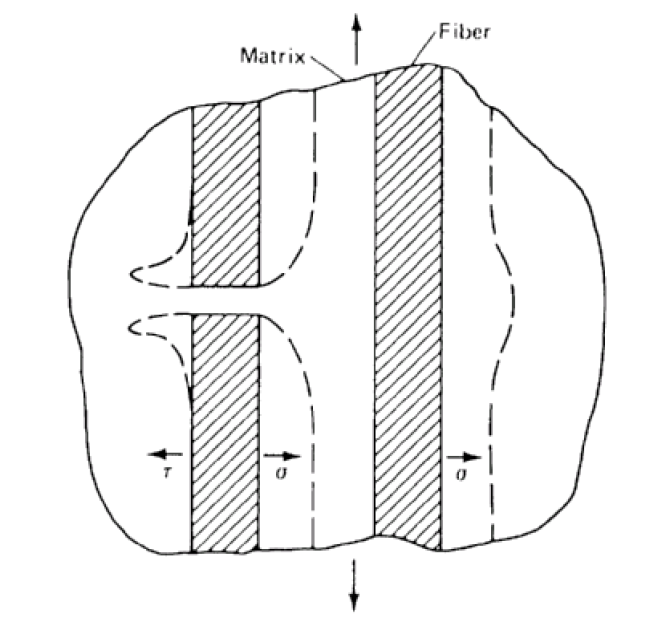

---
**Hypothese**: Das erste Auftreten von Brüchen in den Nachbarfasern definiert die Festigkeitsgrenze

## Kritik
- ist brauchbar für kleine Teststücke, liefert aber zu gerninge Festigkeiten für große Bauteile

---
# Versagenshypothese "Cumulative Group Mode FAilure"
- Ungleichmäßigkeiten der Faserfestgkeiten führt zu räumlich verteilten Faserbrüchen, die schon weit vor dem entgültigen Versagen auftreten
- Spannungskonzentrationen in den Nachbarfasern wird bei diesen zu früherem Versagen führen
- Höhere Schubbeanspruchung von Matrix und Interface in der Nähe der Faserbrüche kann zu Längsrissen führen, die den Versagensfortschritt senkrecht zur Faser aufhalten
- so können sich Gruppen von gerissenen Fasern bilden

---

## Kritik
- Das Modell ist kompliziert, weil jede Gruppe unterschiedlich viele gerissene Fasern enthalten kann
- die Kennwerte sind schwer zu beschaffen
- für praktische Anwendungen zu aufwändig

---

# Druckfestigkeiten von UD-Verbunden
- nur wenige Ansätze zu Bestimmung der Druckfestigkeiten von UD-Verbunden in Faserrichtung auf Basis der Mikromechanik
- Wesentlicher Aspekt ist die Stabilität der Faser
- bei geringem Faservolumengehalt symmetrische Stauchungsform 
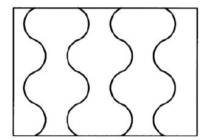
- Festigkeitsfrenze als Knicklast der gebetten Fasern $\sigma_c=2\varphi\sqrt{\frac{\varphi E_m E_f}{3(1-\varphi)}}$

---
- bei höherem Faservolumengehalt ($\varphi>0.2$) 
    Antisymmetrische Schubformen

- für ideal elastische Matrix und isotrope Fasern
$\sigma_c=\frac{G_m}{1-\varphi}$
Verbesserung mit 3D Einfluss
$\sigma_c=\frac{(1+\varphi)G_m}{1-\varphi}$

nach Rosen und Hashin

---

Für anisotrope Fasern

$\sigma_c=\frac{G_m}{1-\varphi(1-G_m/G_{LTf})}$

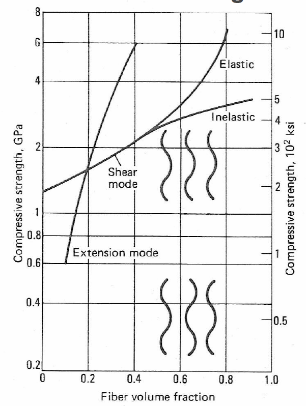
Bei höherem Faservolumengehalt wird die Matrix sich nicht mehr elastisch verformen

Annahme: ideal plastische Matrix mit Fließspannung $\tau_{mt}$ und Sekantenmodul $E_m$

$\sigma_c=\sqrt{\frac{\varphi\tau_{mt}E_m}{3(1-\varphi)}}$

---

Alternative Ansätze bspw. 
"Longitudinal Compressive Strength of Continuous fiber Composites" C.K.H. Dharan and Chun-Liang Lin doi: 10.1177/002199830606807

$\sigma_c = \frac{G_m}{1-\varphi+2(h_i/h_f)(G_m/G_i)\varphi}$

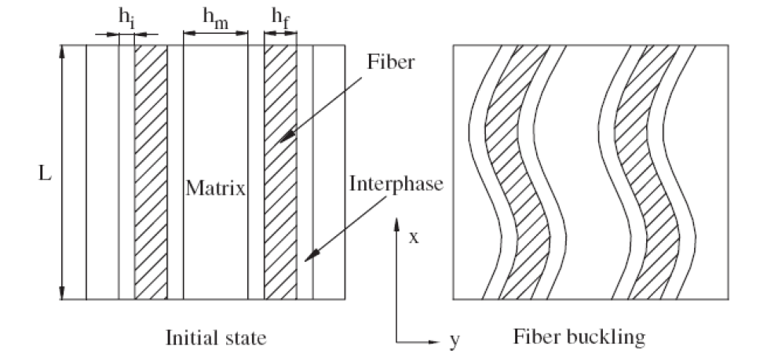

---
# Kritik an Formeln zur Druckfestigkeit
- Faserondulation nicht erfasst
- 2-3° sind typisch und reduzieren die Druckfestigkeit erheblich
- Einfluss der Faserdicke nicht erfasst
    dickere Fasern sind besser ausgerichtet und haben eine höhere Druckfestigkeit

