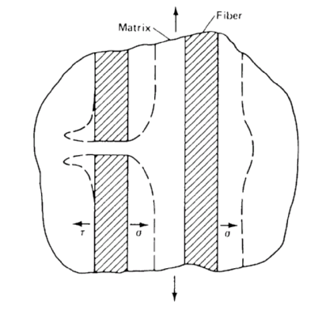
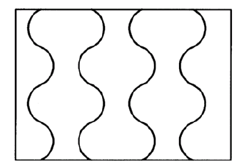
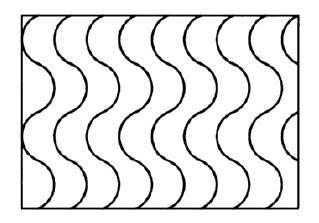

<!-- _class: lead -->

# Mikromechanik von Langfaserverbunden

Prof. Dr.-Ing. Christian Willberg
Hochschule Magdeburg-Stendal

---

<!-- _class: lead -->

# Annahmen für die Berechnung
- Fasern
   - homogen
   - isotrop oder transversal isotrop - linear elastisch
   - kreisrunder Querschnitt
   - regelmäßig angeordnet
   - gerade ausgerichtet (UD-Schicht) oder bekannte Verwebung
- Matrix
   - homogen
   - linear elastisch, ideal plastisch, viskoplastisch
   - isotrop

---
# Querschnitte von C-Fasern

 
    Bild entmommen aus der Vorlesung "Leichtbau mit Faserverbunden" SS2008 von Prof. Dr.-Ing. Klaus Rohwer"

---

# Verteilung und Ausrichtung von Fasern

 
    Bild (rechts) entmommen aus der Vorlesung "Leichtbau mit Faserverbunden" SS2008 von Prof. Dr.-Ing. Klaus Rohwer"

---

# Repräsentativer Bereich

- bei unregelmäßiger Anordnung
   - repräsentativer Bereich muss groß genug sein
   - Anzahl der Fasern durch Zufallsvariablen gesteuert
   - Annahme von Periodizität
   - führt zu einem repräsentativen Volumenelement (RVE)

 
    Bild entmommen aus der Vorlesung "Leichtbau mit Faserverbunden" SS2008 von Prof. Dr.-Ing. Klaus Rohwer"

---

# Repräsentativer Bereich

- Grenzen: 
   - Dimensionen sehr unterschiedlich sind (Ebene vs. Laminatdicke)
   - Periodizität in allen Raumrichtungen nicht streng erfüllt
   - Dominanz der Effekte innerhalb der Ebene

 
    Bild entmommen aus der Vorlesung "Leichtbau mit Faserverbunden" SS2008 von Prof. Dr.-Ing. Klaus Rohwer"

---

# Repräsentativer Bereich

 
    Bild entmommen aus "Peridynamic analysis of fibre-matrix debond and matrix failure mechanisms in composites under transverse tensile load by an energy-based damage criterion", Rädel, M., Willberg, C. and Krause, D.; 10.1016/j.compositesb.2018.08.084

---
# Repräsentativer Bereich
UD-Schicht mit regelmäßiger Anordnung

- Quadratische Anordnung
   - max. Faservolumengehalt
   $\varphi = \pi/4 \approx 0.785$
- Hexagonale Anordnung
   - max. Faservolumengehalt
   $\varphi = \pi\sqrt3/6 \approx 0.907$

 
    Bild entmommen aus der Vorlesung "Leichtbau mit Faserverbunden" SS2008 von Prof. Dr.-Ing. Klaus Rohwer"

---

# Beispie für mikromechanische Spannungsberechnung

## Beispiel: Aushärtespannungen

- Aushärtespannungen (curing stresses) in einer UD-Schicht aus CF mit Epoxidharz-Matrix
- CFK-UD Schicht wird bei 180°C ausgehärtet
- nach dem Aushärten wird der Verbund abgekühlt
- bei etwa 120°C wird die Matrix fest und der Zustand wird eingefroren
- weitere Abkühlung auf Raumtemperatur (20°C) ergibt eine Temperaturdifferenz von 100°C
- unterschiedliche Wärmedehnungen von Fasre und Matrix im Zusammenwirken mit der Haftung bewirken einen Eigenspannungszustand

---

## Beispiel: Aushärtespannungen

- im Inneren der UD Schicht, störungsfrei $\rightarrow$ ebener Dehnungszustand
- senkrecht zur Faser: 2D Problem
- am freien Rand (senkrecht zu Faser); Verwölbung der Oberfläche, weil keine äußeren Kräfte
- 3D Problem
- Berechnung des Verschiebungs- und Spannungszustandes mit FEM, Materialgesetze müssen bekannt sein
- Matrix ist isotrop, linear elastisch und charakterisiert durch E-Modul $E$, Querkontraktionszahl $\nu$, Temperaturdehnkoeffizient $\alpha$

---

- Kohlenstofffaser ist transversalisotrop, linear elastisch und beschrieben durch 5 Koeffizienten
   -  $E_L$, $E_T$: E Moduli in Faserrichtung und senkrecht
   - $G_{LT}$ Schubmodul parallel-senkrecht
   - $\nu_{TT}$, $\nu_{LT}$ Querkontraktionszahl parallel-senkrecht, senkrecht-senkrecht
- 2 Temperaturdehnkoeffizienten: $\alpha_L$, $\alpha_T$

---

$$\begin{bmatrix}
\varepsilon_{xx} \\
\varepsilon_{yy} \\
\varepsilon_{zz} \\
\gamma_{yz} \\
\gamma_{xz} \\
\gamma_{xy}
\end{bmatrix} =
\begin{bmatrix}
\frac{1}{E_L} & -\frac{\nu_{LT}}{E_L} & -\frac{\nu_{LT}}{E_L} & 0 & 0 & 0 \\
-\frac{\nu_{LT}}{E_L} & \frac{1}{E_T} & -\frac{\nu_{TT}}{E_T} & 0 & 0 & 0 \\
-\frac{\nu_{LT}}{E_L} & -\frac{\nu_{TT}}{E_T} & \frac{1}{E_T} & 0 & 0 & 0 \\
0 & 0 & 0 & \frac{1}{G_{LT}} & 0 & 0 \\
0 & 0 & 0 & 0 & \frac{1}{G_{LT}} & 0 \\
0 & 0 & 0 & 0 & 0 & \frac{2(1+\nu_{TT})}{E_T}
\end{bmatrix}
\begin{bmatrix}
\sigma_{xx} \\
\sigma_{yy} \\
\sigma_{zz} \\
\sigma_{yz} \\
\sigma_{xz} \\
\sigma_{xy}
\end{bmatrix} +\begin{bmatrix}
\alpha_L \\
\alpha_T \\
\alpha_T \\
0 \\
0 \\
0
\end{bmatrix}\cdot \Delta T$$
- x-Achse oder 1-Achse = Faserrichtung (L)
- y- und z-Achse oder 2- und 3-Achse = quer zur Faserrichtung (T) 

---

## Materialgrößen und Geometrie

$\begin{array}{llll}
\text{Fasern}:   & E_L = 240GPA & \text{Matrix}: &E=3.5GPA\\
&E_L = 240GPA&&\nu=0.35\\
&G_{LT}=16GPA&&\alpha=55\cdot10^{-6}K^{-1}\\
&\nu_{LT} = 0.23\\
&\nu_{TT} = 0.23\\
&\alpha_L = 0.7\cdot10^{-6}K^{-1}\\
&\alpha_T = 5.5\cdot10^{-6}K^{-1}\\
\text{Faservolumengehalt}: & 60\%\\
\text{Faseranordnung}: & \text{hexagonal}\\
\end{array}
$

---
# Repräsentatives Element

 
    Bild entmommen aus der Vorlesung "Leichtbau mit Faserverbunden" SS2008 von Prof. Dr.-Ing. Klaus Rohwer"

---
# Verformung infolge Temperturerhöhung

 
    Bild entmommen aus der Vorlesung "Leichtbau mit Faserverbunden" SS2008 von Prof. Dr.-Ing. Klaus Rohwer"

---
# Axialspannungen $\Delta T = -100°C$

 
    Bild entmommen aus der Vorlesung "Leichtbau mit Faserverbunden" SS2008 von Prof. Dr.-Ing. Klaus Rohwer"

---

# Radialspannungen $\Delta T = -100°C$

 
    Bild entmommen aus der Vorlesung "Leichtbau mit Faserverbunden" SS2008 von Prof. Dr.-Ing. Klaus Rohwer"

---

# Umfangsspannungen $\Delta T = -100°C$

 
    Bild entmommen aus der Vorlesung "Leichtbau mit Faserverbunden" SS2008 von Prof. Dr.-Ing. Klaus Rohwer"

---
# Schubspannungen $\Delta T = -100°C$

 
    Bild entmommen aus der Vorlesung "Leichtbau mit Faserverbunden" SS2008 von Prof. Dr.-Ing. Klaus Rohwer"

---

# Thermische Zyklierung bei Tiefsttemperaturanwendungen

 
    Bild entmommen aus Lüders, C. "Mehrskalige Betrachtung des
Ermüdungsverhaltens thermisch zyklierter
Faserkunststoffverbunde", Dissertation, 2020

---

 
    Bild entmommen aus Lüders, C. "Mehrskalige Betrachtung des
Ermüdungsverhaltens thermisch zyklierter
Faserkunststoffverbunde", Dissertation, 2020

---

# Homogenisierung
- Reduktion der Einzekomponenten auf eine Einzelkomponente
- Reduktion des Modellierungsaufwands
- Homogenisierungsverfahren unterscheiden sich abhängig vom betrachteten Parameter
   - Steifigkeit
   - Wärmedehnungkoeffizienten
   - Feuchtequellkoeffizienten
   - Wärmeleitfähigkeitskoeffizienten
   - Festigkeiten

---

# Homogenisierung von Steifigkeiten
- Steifigkeiten von Fasern und Matrix sind extrem unterschiedlich
- für die BErechnung komplexer Strukturen ist die Berücksichtigung einzelner Fasern zu aufwändig $\rightarrow$ Einzelschicht wird als homogenes Kontinuum modelliert
- globales Verhalten soll hinreichend genau beschrieben werden
- Modellierung örtlicher (lokaler) Aspekte wird vernachlässigt, z.B Verwölbung am freien Rand

---
## Allgemeine Regeln
- E Modul in Faserrichtung $E_L$ und Querkontraktionszahl $\nu_{LT}$: parallel geschaltete Feder 
$\rightarrow$ Mischungsregel für Steifigkeiten

- E Modul in Querrichtung $E_T$, Schubmodul $G_{LT}$ und Querkontraktionszahl $\nu_{TT}$: in Reihe geschaltete Feder 
$\rightarrow$ Mischungsregel für Nachgiebigkeiten

---

Korrektur erforderlich, weil Steifigkeit der Faser unter Belastung in Querrichtung nur zum Teil wirksam ist

---

# Formeln für isotrope Fasern

$\begin{array}{ll}
\text{\textbf{Faserwerte}}    & \text{\textbf{Matrixwerte}}\\
E_f & E_m\\
\nu_f & \nu_m\\
\text{\textbf{Faservolumengehalt}} &\varphi\\
\\
\text{\textbf{E-Modul in Faserrichtung}}\\
E_L=\varphi E_f+(1-\varphi)E_m & \text{Mischungsregel}\\
\text{\textbf{Querkontraktionszahl}}\\
\nu_{LT}=\varphi \nu_f+(1-\varphi)\nu_m &\text{Mischungsregel}\\
\text{\textbf{E-Modul in Querrichtung}}\\
1/E_T\approx \varphi/E_f + (1-\varphi)/E_m &\text{Mischungsregel für Nachgiebigkeit}
\end{array}
$
Korrektur erforderlich; entsprechend auch für $G_{LT}$ und Qerkontraktionszahl $\nu_{TT}$

---

# Korrigierte $E_T$ Werte für isotrope Fasern
Es existieren viele verschiedene Ansätze - keiner mit Anspruch auf Allgemeingültigkeit
**Beispiele**
$\begin{array}{ll}
\text{\textbf{Puck}}    & E_T = \frac{(1+0.85\varphi^2)E_m}{\varphi E_m/E_f+(1-\varphi)^{1.25}}\\
\text{\textbf{Tsai, Hahn, Wu}} & E_T=\frac{\varphi+0.5(1-\varphi)}{\varphi/E_f+0.5(1-\varphi)/E_m}\\
\text{\textbf{Geier}} & E_T=\frac{E_fE_m}{\varphi/E_m+(1-\overline{\varphi}E_f)}\qquad\text{mit}\qquad \overline{\varphi}=\varphi+\zeta\varphi(1-\varphi);\zeta\approx 0.6\\
\text{\textbf{Chamis}} & E_T=E_m/[1-\sqrt\varphi(1-E_m/E_f)]
\end{array}
$

---

# Korrigierte $G_{LT}$ Werte für isotrope Fasern

Ansätz entsprechen dem Vorgehen bei der Bestimmung von $E_T$

**Beispiele**
$\begin{array}{ll}
\text{\textbf{Puck}}    & G_{LT} = \frac{(1+0.6\sqrt\varphi)G_m}{\varphi G_m/G_f+(1-\varphi)^{1.25}}\\
\text{\textbf{Tsai, Hahn, Wu}} & G_{LT}=\frac{\varphi+0.5(1-\varphi)}{\varphi/G_f+0.5(1-\varphi)/G_m}\\
\text{\textbf{Geier}} & G_{LT}=\frac{G_fG_m}{\varphi/G_m+(1-\overline{\varphi}G_f)}\qquad\text{mit}\qquad \overline{\varphi}=\varphi+\zeta\varphi(1-\varphi);\zeta\approx 0.6\\
\text{\textbf{Chamis}} & G_{LT}=G_m/[1-\sqrt\varphi(1-G_m/G_f)]
\end{array}
$

---

# Anwendung der Homogenisierungsformeln
**Problem der Kennwertbestimmung**
- nur wenige Faserkennwerte können direkt im Versuch bestimmt werden
- insbesondere in Querrichtung und unter Schubbelastung lassen sich Einzelfasern kaum testen
- die Formeln zur Homogenisierung der Steifigkeiten sind für zwei unterschiedliche Aufgaben sinnvoll:
   - Bestimmung der Faserwerte aus Messungen an UD Schichten und Reinharzproben (Inverse Anwendung)
   - Umrechnung der Laminateigenschaften bei geändertem Faservolumenanteil

---

# Beispiel zur Anwendung der Homogenisierungsformeln
E-Glasfasern als UD-Verstärkungen in Epoxidharzmatrix eingebettet
Messungen am Verbund und am Reinharz durchgeführt

$\begin{array}{ll}
\text{\textbf{Verbundwerte}}    & \text{\textbf{Reinharzwerte}} \\
E_L=45GPA & E_m=3.3GPa\\
E_T=12GPa&\nu_m=0.3\\
G_{LT}=4.4GPa & G_m=\frac{E_m}{2(1+\nu_m)}=1.27GPa\\
\nu_{LT}=0.25\\
\nu_{TT}=0.25\\
\varphi=0.6
\end{array}
$

---

## Inverse Anwendung

$E_L=\varphi E_f+(1-\varphi)E_m$

$E_f=(E_l-(1-\varphi)E_m)/\varphi=72.8GPa$

$\nu_{LT}=\varphi \nu_f+(1-\varphi)\nu_m$

$\nu_{LT}=0.217$$

da isotrope Faser
$G_f=\frac{E_f}{2(1+\nu_f)}$
$G_f=29.91GPa$

---
## Umrechnung der Laminatwerte

$\varphi = 0.6 \rightarrow \varphi = 0.5 ?$

mit den bestimmten Werten für die Fasern $E_f$ und $\nu_f$ in den folgenden Gleichungen $\varphi=0.5$ einsetzen

$E_L=\varphi E_f+(1-\varphi)E_m=38GPa$

$\nu_{LT}=\varphi \nu_f+(1-\varphi)\nu_m=0.258$

---
## Umrechnung der Laminatwerte
**In Querrichtung sind Laminatwerte nicht eindeutig**

aus Puck
$E_T = \frac{(1+0.85\varphi^2)E_m}{\varphi E_m/E_f+(1-\varphi)^{1.25}}$

$E_T = 9.03GPa$

aus Geier
$E_T=\frac{E_fE_m}{\varphi/E_m+(1-\overline{\varphi}E_f)}\qquad\text{mit}\qquad \overline{\varphi}=\varphi+\zeta\varphi(1-\varphi);\zeta\approx 0.6$
$E_T = 8.7GPa$

---

## Umrechnung der Laminatwerte
aus Tsai, Hahn, Wu
$E_T=\frac{\varphi+0.5(1-\varphi)}{\varphi/E_f+0.5(1-\varphi)/E_m}$
$E_T=9.08GPa$

aus Chamis
$E_T=E_m/[1-\sqrt\varphi(1-E_m/E_f)]$
$E_T=10.16GPa$

Mittelwert ist $E_T=9.24GPa$ mit Abweichungen in einer Größenordnung von 10\%

---
## Umrechnung der Laminatwerte
**Schubmodul $G_{LT}$**

aus Puck
$G_{LT} = 3.35GPa$

aus Geier
$G_{LT} = 3.31GPa$

aus Tsai, Hahn, Wu
$G_{LT}=3.51GPa$

aus Chamis
$G_{LT}=3.93GPa$
Mittelwert ist $G_{LT}=3.52GPa$ mit Abweichungen in einer Größenordnung von 10\%

---

# Formeln für transversal-isotrope Fasern

$\begin{array}{ll}
\text{\textbf{Faserwerte}}    & \text{\textbf{Matrixwerte}}\\
E_{Lf} & E_m\\
\nu_{LTf} & \nu_m\\
G_{LTf}\\
E_{Lf}\\
G_{TTf}\\
\text{\textbf{Faservolumengehalt}} &\varphi\\
\text{\textbf{Formeln}}\\
E_L=\varphi E_f+(1-\varphi)E_m & \text{Mischungsregel}\\
\nu_{LT}=\varphi \nu_f+(1-\varphi)\nu_m &\text{Mischungsregel}\\
E_T=E_M/\left[1-\sqrt\varphi(1-E_m/E_{Tf})\right]&\text{Chamis}\\
G_{LT}=G_m/\left[1-\sqrt\varphi(1-G_m/G_{LTf})\right]&\text{Chamis}\\
G_{TT}=G_m/\left[1-\sqrt\varphi(1-G_m/G_{TTf})\right]&\text{Chamis}\\
\nu_{TT=\frac{E_T}{2G_{TT}}-1}&\text{Chamis}
\end{array}
$

---
# Berücksichtung von Faserondulation

- repräsentatives Element mit FEM zu berechnen
- Modelle können enorm komplex sein
- Gewebe können so abgebildet werden

 
    Bild 1+2 entmommen aus Lin, H; et al. "A finite element approach to the modelling of fabric mechanics and its application to virtual fabric design and testing", 10.1080/00405000.2012.660755
    Bild 3 aus der Vorlesung "Leichtbau mit Faserverbunden" SS2008 von Prof. Dr.-Ing. Klaus Rohwer"

---

---
# Homogenisierung von Wärmeausdehnungskoeffizienten
## Ziel
- Wärmeausdehnungskoeffizienten von Faser und Matrix können sehr unterschiedlich sein (C-Faser in Kunstharzmatrix)
- für die Berechnung komplexer Strukturen ist die Berücksichtigung dieses Unterschiedes viel zu aufwändig
    Die Einelschicht muss als Kontinuum mit einheitlichem Wärmeausdehnungskoeffizienten modelliert werden
- Kombination der Faser- und Matrixwerte deart, dass das globale Verhalten des Verbundes hinreichend genau beschrieben wird
- örtliche (lokale) Betrachtung wird vernachlässigt

---
# Homogenisierung für thermisch transversalisotrope Fasern

$\begin{array}{ll}
\text{\textbf{Faserwerte}}    & \text{\textbf{Matrixwerte}}\\
E_{Lf} & E_m\\
\nu_{LTf} & \nu_m\\
\alpha_{Lf} & \alpha_m\\
\alpha_{Tf} & \\
\text{\textbf{Faservolumengehalt}} &\varphi\\
\text{\textbf{Formeln}}\\
\alpha_L = \frac{\varphi E_{Lf}\alpha_{Lf}+(1-\varphi)E_m\alpha_m}{\varphi E_{Lf}+(1-\varphi)E_m}\\
\alpha_T = \overline{\varphi}\alpha_{Tf}+(1-\overline{\varphi})\alpha_m-(\alpha_m-\alpha_{Lf})\frac{\overline{\varphi}(1-\varphi)\nu_{LTf}E_m+\varphi(1-\overline{\varphi})\nu_mE_{Lf}}{\varphi E_{Lf}+(1-\varphi)E_m}\\
\text{mit}\qquad \overline{\varphi}=\varphi + \zeta\varphi(1-\varphi); \zeta\approx 0.6
\end{array}
$

---

# Bestimmung des Wärmeausdehnungskoeffizienten (CTE) von Fasern
- direkte Messung an Faserbündeln
- Rückrechnung aus Messungen an Verbunden
- Untersuchungen an Einzelfasern
    - mit Raser-Elektronenmikroskop (SME)
    - mit Tansmissions-Elektronenmikroskopie (TME)

---

# Homogenisierung von Feuchtequellkoeffizienten
## Ziel
- Feuchtequellkoeffizienten von Faser und Matrix sind meist sehr unterschiedlich
- häufig nimmt die Matrix die Feuchte aus der Umgebung auf und quillt dabei
- viele Verstärkungsfasern nehmen keine Feuchte auf (Ausnahme: Aramid, Biofasern)
- für die Berechnung der Feuchtequellung in komplexen Strukturen ist die Berücksichtigung der Unterschiede viel zu aufwändig
- die Einzelschicht soll das globale Verhalten unter Nutzung einer einheitlichen Feuchtequellzahl beschreiben
- örtliche (lokale) Effekte werden vernachlässigt

---

# Homogenisierung der Feuchtequellkoeffizienten für Fasern transversalisotroper Quellung

$\begin{array}{ll}
\text{\textbf{Faserwerte}}    & \text{\textbf{Matrixwerte}}\\
E_{Lf} & E_m\\
\nu_{LTf} & \nu_m\\
\rho_{f} & \rho_m\\
\beta_{Tf} &\beta_m\\
\beta_{Tf}\\
\Delta c_f \text{ Änderung der rel. Feuchte} & \Delta c_m\\
\text{Quellung: }\varepsilon = \Delta c \beta\\
\text{\textbf{Faservolumengehalt}} &\varphi\\
\end{array}
$

---

# Homogenisierung der Feuchtequellkoeffizienten für Fasern transversalisotroper Quellung

$\begin{array}{ll}
\Delta c=\frac{\varphi\rho_f \Delta c_f+(1-\varphi)\rho_m \Delta c_m}{\varphi\rho_f+(1-\varphi)\rho_m}\\
\beta_L = \frac{1}{\Delta c}\frac{\varphi E_{Lf}\Delta c_f \beta_{Lf}+(1-\varphi)E_m\Delta c_m\beta_m}{\varphi E_{Lf}+(1-\varphi)E_m}\\
\beta_T = \frac{1}{\Delta c}\left[\overline{\varphi}\Delta c_f \beta_{Lf}+(1-\overline{\varphi})\Delta c_m \beta_{m} - (c_m \beta_{m}-\Delta c_f \beta_{Lf})\frac{\overline{\varphi}(1-\varphi)\nu_{LTf}E_m+\varphi(1-\overline{\varphi})\nu_mE_{Lf}}{\varphi E_{Lf}+(1-\varphi)E_m}\right]
\\
\text{mit}\qquad \overline{\varphi}=\varphi + \zeta\varphi(1-\varphi); \zeta\approx 0.6 
\end{array}
$

---
# Homogenisierung von Wärmleitfähigkeitskoeffizienten

- Wärmleitfähigkeitskoeffizienten von Faser und Matrix sind zum Teil sehr unterschiedlich
    - Polymere im Allgemeinen gering
    - Glas-, und Aramidfasern gering
    - Kohlenstofffasern +- hoch in Faserrichtung- gering in Querrichtung
- für die Berechnung der Wärmeleitung in komplexen Strukturen ist die Berücksichtigung der Unterschiede viel zu aufwändig
- die Einzelschicht soll das globale Verhalten unter Nutzung einer einheitlichen Wärmeleitung beschreiben
- örtliche (lokale) Effekte werden vernachlässigt
- **Lufteinschlüsse** haben einen Effekt

---

$\begin{array}{ll}
\text{\textbf{Faserwerte}}    & \text{\textbf{Matrixwerte}}\\
k_{Lf} & k_m\\
k_{Tf} & \\
\text{\textbf{Faservolumengehalt}} &\varphi\\
\end{array}
$
Wärmeleitung in der UD-Schicht in Faserrichtung
$k_l=\varphi k_{Lf}+(1-\varphi)k_m$
senkrecht zur Faserrichtung gibt es viele Näherungsformeln
$k_l=\varphi k_{Lf}+(1-\varphi)k_m$
$k_l=\varphi k_{Lf}+(1-\varphi)k_m$

$\begin{array}{ll}
\text{\textbf{Lord Rayleigh (1882)}}   & k_t=k_m\left[1-2\frac{\varphi}{\nu'+\varphi+3\varphi^4S_4^2/(\nu'\pi^4)}\right]\\
&\nu'=(1+k_{Tf})/(1-k_{Tf}/k_m)\\
& s_4=0.0323502\pi^4\\
\text{\textbf{Selbskonsistentes Modell}} & k_t=k_m[k_{Tf}(1+\varphi)+k_m(1-\varphi)]/[k_{Tf}(1-\varphi)+k_m(1+\varphi)]\\
\end{array}
$

---

 
    Bild aus der Vorlesung "Leichtbau mit Faserverbunden" SS2008 von Prof. Dr.-Ing. Klaus Rohwer"

---

 
    Bild aus der Vorlesung "Leichtbau mit Faserverbunden" SS2008 von Prof. Dr.-Ing. Klaus Rohwer"

---
# Messungen der Wärmeleitfähigkeiten von Faserverbunden - Transient Hot-Strip Verfahren

 
    Bild aus der Vorlesung "Leichtbau mit Faserverbunden" SS2008 von Prof. Dr.-Ing. Klaus Rohwer"

---

 
    Bild aus der Vorlesung "Leichtbau mit Faserverbunden" SS2008 von Prof. Dr.-Ing. Klaus Rohwer"

----

# Homogenisierung von Festigkeiten
- Faserfestigkeiten kaum direkt messbar
- Messbar
    - Zug- und Druckfestigkeiten in Faserrichtung 
    - Festigkeiten in Gewebe-Verbunden

 
    Bilder aus H. Schürrmann "Konstruieren mit Faser-Kunststoff-Verbunden"

---

# Homogenisierung von Festigkeiten

- Erkenntnisse
    - Abschätzung der Festigkeiten bei geändertem Faservolumengehalt
    - besseres Verstehen des Verbundversagens
    - sinnvolle Auslegung von Fasern und Matrix

 
    Bilder aus H. Schürrmann "Konstruieren mit Faser-Kunststoff-Verbunden"

---

# Zugfestigkeit von UD-Verbunden
**Annahmen:**
Lineare Elastizität von Fasern und Matrix bis zum Bruch
Gleiche Festigkeit aller Fasern, kosntant über die gesamte Länge

**Festigkeiten unter Zugbeanspruchung (t) in Faserrichtung**
$\begin{array}{lll}
& \text{Fasern} &\text{Matrix}\\
\text{Bruchdehnungen}    &  \varepsilon_{ft} & \varepsilon_{mt}\\
\text{Bruchspannungen} 
 &  \sigma_{ft} & \sigma_{mt}\\
\end{array}
$
Übliche Auslegung : $\varepsilon_{mt}>\varepsilon_{ft}$
Faserkontrolliertes Versagen bedeutet: $\varepsilon_{t}=\varepsilon_{ft}$
Bei Faserbruch: 
Matrixdehnung = Bruchdehnung der Faser $\varepsilon_{ft}$
Matrixsapnnung = $\sigma_m(\varepsilon_{ft})$

---
## Bruchspannung des Verbundes nach Mischungsregel
$$\sigma_t=\sigma_{ft}\varphi+\sigma_m(\varepsilon_{ft})(1-\varphi)$$
Der Verbund versagt natürlich nur dann, wenn auch die Bruchspannung der Matrix überschritten ist
$$\sigma_t\geq\sigma_{mt}(1-\varphi)$$
Sonst trägt die Matrix trotz der gerissenen Fasern.
Nur bei sehr kleinen Faservolumengehalten möglich.

---
# Zugfestigkeiten von UD-Verbunden

 
    Bild aus der Vorlesung "Leichtbau mit Faserverbunden" SS2008 von Prof. Dr.-Ing. Klaus Rohwer"

---
## Kritik an der Mischungsregel
- in einem Laminat ist die Zugfestigkeit von Faser zu Faser veschieden
- über die Faserlänge ist die Zugfestigkeit nicht konstant; lange Fasern haben eine geringere Festigkeit als kurze
- diese Tatsachen werden in der Mischungsregel nicht berücksichtigt
- aus diesem Grund wurden verbesserte Versagenshypothesen aufgestellt

---

# Versagenshypothese "Weakest Link Failure"

- berücksichtig eine statistische Verteilung der Faserfestigkeiten, abhängig von der Faserlänge $L$

Weibull-Verteilung $f(\sigma_t)=L\alpha\beta\sigma_t^{\beta-1}e^{-L\alpha\sigma_t^{\beta}}$
$\alpha$, $\beta$: Parameter zur Anpassung der Versuchsergebnisse

**Hypothese: Bruch der schwächsten Faser führt zum Versagen**
- Bruchspannung der schwächsten Fasern:
$$\sigma_{tw}=\left(\frac{\beta-1}{NL\alpha\beta}\right)$$
$N$ - Anzahl der Fasern im Verbund

---

## Kritik an der "Weakest Link Failure" Hypothese
- Realistische Versagensspannungen ergeben sich nur bei einer geringen Anzahl von Fasern und einer geringen Streubreite
- für praktisch relevante Faserverbunde werden zu geringe Festigkeiten prognostiziert

--- 

# Versagenshypothese "Cumulative Weakening Failure"

Bruch einer Faser beansprucht die Matrix in der Umgebung der Bruchstelle durch hohe Störspannungen $\rightarrow$ werden berücksichtigt

Annahmen:
- linear elastische Fasern, Faserdurchmesser $d_f$
- ideal plastische Matrix, Fließspannung $\tau_{mt}$
- Länge des Strörbereichs: $\delta=\frac{\sigma_{ft}}{4\tau_{mt}}d_f$
- Berücksichtigt werden
    - die Versagenswahrscheinlichkeit einer Faser der Länge $\delta$
    - eine statistische Verteilung der Faserfestigkeiten
- Verbundfestigkeit $\sigma_t^*=(\alpha\delta\beta e)^{-1/\beta}$

---

## Kritik
- die Störungen infolge einer gebrochenen Faser wirkt sich nicht nur auf die umgebenene Matrix aus, sondern auch auf die angrenzenden Fasern
- Spannungserhöhungen in den Nachbarfasern bleiben unberücksichtigt

---

# Versagenshypothese "Fiber Break Propagation Failure"
- die Lastverteilung von der gebrochenen auf die benachbarte Fasern erhöht die Wahrscheinlichtkeit, dass diese ebenfalls versagen

---
**Hypothese**: Das erste Auftreten von Brüchen in den Nachbarfasern definiert die Festigkeitsgrenze

## Kritik
- ist brauchbar für kleine Teststücke, liefert aber zu gerninge Festigkeiten für große Bauteile

---
# Versagenshypothese "Cumulative Group Mode FAilure"
- Ungleichmäßigkeiten der Faserfestgkeiten führt zu räumlich verteilten Faserbrüchen, die schon weit vor dem entgültigen Versagen auftreten
- Spannungskonzentrationen in den Nachbarfasern wird bei diesen zu früherem Versagen führen
- Höhere Schubbeanspruchung von Matrix und Interface in der Nähe der Faserbrüche kann zu Längsrissen führen, die den Versagensfortschritt senkrecht zur Faser aufhalten
- so können sich Gruppen von gerissenen Fasern bilden

---

## Kritik
- Das Modell ist kompliziert, weil jede Gruppe unterschiedlich viele gerissene Fasern enthalten kann
- die Kennwerte sind schwer zu beschaffen
- für praktische Anwendungen zu aufwändig

---

# Druckfestigkeiten von UD-Verbunden
- nur wenige Ansätze zu Bestimmung der Druckfestigkeiten von UD-Verbunden in Faserrichtung auf Basis der Mikromechanik
- Wesentlicher Aspekt ist die Stabilität der Faser
- bei geringem Faservolumengehalt symmetrische Stauchungsform 

- Festigkeitsfrenze als Knicklast der gebetten Fasern $\sigma_c=2\varphi\sqrt{\frac{\varphi E_m E_f}{3(1-\varphi)}}$

---
- bei höherem Faservolumengehalt ($\varphi>0.2$) 
    Antisymmetrische Schubformen

- für ideal elastische Matrix und isotrope Fasern
$\sigma_c=\frac{G_m}{1-\varphi}$
Verbesserung mit 3D Einfluss
$\sigma_c=\frac{(1+\varphi)G_m}{1-\varphi}$

nach Rosen und Hashin

---

Für anisotrope Fasern

$\sigma_c=\frac{G_m}{1-\varphi(1-G_m/G_{LTf})}$

Bei höherem Faservolumengehalt wird die Matrix sich nicht mehr elastisch verformen

Annahme: ideal plastische Matrix mit Fließspannung $\tau_{mt}$ und Sekantenmodul $E_m$

$\sigma_c=\sqrt{\frac{\varphi\tau_{mt}E_m}{3(1-\varphi)}}$

---

Alternative Ansätze bspw. 
"Longitudinal Compressive Strength of Continuous fiber Composites" C.K.H. Dharan and Chun-Liang Lin doi: 10.1177/002199830606807

$\sigma_c = \frac{G_m}{1-\varphi+2(h_i/h_f)(G_m/G_i)\varphi}$

---
# Kritik an Formeln zur Druckfestigkeit
- Faserondulation nicht erfasst
- 2-3° sind typisch und reduzieren die Druckfestigkeit erheblich
- Einfluss der Faserdicke nicht erfasst
    dickere Fasern sind besser ausgerichtet und haben eine höhere Druckfestigkeit

---

<!-- _class: lead -->
# 3. Bestimmung der Grund-Elastizitätsgrößen

---
# Vier Wege zur Datenbeschaffung

**1. Literaturdaten:**
- Weit verbreitete Faser-Matrix-Systeme

**2. Ähnliche Systeme:**
- Für Vorauslegungen übertragbar

**3. Mikromechanische Formeln:**
- Berechnung aus Faser- und Matrixdaten
- Vorteil: Schnelle Parameter- und Werkstoffvariationen
- Genauigkeit für Vorauslegungen ausreichend

**4. Experimentelle Bestimmung:**
- Genaueste Wiedergabe der Realität
- Erfasst alle Fertigungs- und Materialeinflüsse
- Kostspielig, aber meist notwendig

---
# Mikromechanischer Ansatz

**Grundidee:**
- Modellierung an repräsentativer Einheitszelle
- Eigenschaften auf makroskopische Verhältnisse übertragen

**Idealisierte Annahmen:**
- Fasern: konstante Querschnitte, exakt parallel
- Regelmäßige Packung (quadratisch/hexagonal)
- UD-Schicht als homogenes Kontinuum
- Vollständige Faser-Matrix-Haftung
- Kleine Verformungen, lineares elastisches Verhalten

---
# Faserpackungsmodelle

**Quadratische Packung:**
$$\varphi_{\text{max}}^{\text{quad}} = \frac{\pi}{4} = 0{,}79$$

**Hexagonale Packung:**
$$\varphi_{\text{max}}^{\text{hex}} = \frac{\pi}{2\sqrt{3}} = 0{,}91$$

**Hexagonale Packung ist dichter!**

---
# Zur experimentellen Bestimmung

**$E_{\parallel}$:**
- Selten experimentell bestimmt
- Lässt sich sehr exakt berechnen
- Wird von Faserherstellern angegeben
- Zugfestigkeit $R_{\parallel}^+$ schwierig zu messen

**$E_{\perp}$ und $G_{\perp\parallel}$:**
- Rechnerische Bestimmung mit Unsicherheiten
- Empfohlen: experimentelle Ermittlung
- Geeignete Methode: Zug/Druck-Torsionsprüfung (Z/DT)

**$\nu_{\perp\parallel}$:**
- Rechnerisch gut bestimmbar (wenn $\nu_f$ bekannt)
- Bei anisotropen Fasern problematisch
- Messung mit DMS: Querempfindlichkeit korrigieren!

---
<!-- _class: lead -->
# Längs-Elastizitätsmodul $E_{\parallel}$

---
# Mikromechanisches Modell für $E_{\parallel}$

**Federnmodell:**
- Parallelschaltung von Fasern und Matrix
- Federraten addieren sich

**Elasto-statisches Gleichungssystem:**
1. Kräftegleichgewicht
2. Kinematische Beziehungen
3. Elastizitätsgesetze

---
# Herleitung $E_{\parallel}$

**1. Kräftegleichgewicht:**
$$F = F_f + F_m \Rightarrow \sigma \cdot A_{\text{Verbund}} = \sigma_f \cdot A_f + \sigma_m \cdot A_m$$

**2. Kinematik (gleiche Dehnung):**
$$\varepsilon_f = \varepsilon_m = \varepsilon_{\parallel}$$

**3. Elastizitätsgesetze:**
$$\sigma_f = E_f \cdot \varepsilon_{\parallel}, \quad \sigma_m = E_m \cdot \varepsilon_{\parallel}$$

---
# Mischungsregel für $E_{\parallel}$

**Einsetzen und Umformen:**
$$E_{\parallel} \cdot A_{\text{Verbund}} = E_f \cdot A_f + E_m \cdot A_m$$

**Mit Faservolumenanteil** $\varphi = A_f/A_{\text{Verbund}}$:

$$\boxed{E_{\parallel} = E_f \cdot \varphi + E_m \cdot (1 - \varphi)}$$

**Mischungsregel:** Summation von Dehnsteifigkeiten

---
# Parameterdiskussion $E_{\parallel}$

**Da** $E_m \ll E_f$:
$$E_{\parallel} \approx E_f \cdot \varphi$$

**Proportionalitäten:**
- $E_{\parallel} \sim E_f$
- $E_{\parallel} \sim \varphi$

**Konstrukteur-Fazit:**
- Durch Matrix-Abmischung bleibt nur reduzierter Fasersteifigkeitsanteil
- Faservolumenanteil steuert Längssteifigkeit
- Hoher $\varphi$ senkt mikromechanische Faserbeanspruchung

---
# Typische Werte für $E_{\parallel}$

| Material | $E_f$ [MPa] | $E_m$ [MPa] | $E_{\parallel}$ [MPa] ($\varphi=0{,}6$) |
|----------|-------------|-------------|------------------------------------------|
| GF-EP | 73 000 | 3 400 | 45 160 |
| CF-EP (HT) | 230 000 | 3 400 | 139 960 |
| CF-EP (HM) | 392 000 | 3 400 | 236 560 |
| AF-EP | 125 000 | 3 400 | 76 360 |
| **Vergleich:** |||
| Stahl 25CrMo4 | | | 206 000 |
| Al-Legierung | | | 72 400 |
| Ti-Legierung | | | 108 000 |

---
# Validierung $E_{\parallel}$

**Sehr gute Übereinstimmung:**
- Experiment vs. Theorie
- FE-Rechnung vs. Mischungsregel
- Verschiedene Packungsarten

---
# Umrechnung auf anderen Faservolumenanteil

**Lineare Abhängigkeit von** $\varphi$:

$$E_{\parallel,\varphi_2} = E_{\parallel,\varphi_1} \cdot \frac{\varphi_2}{\varphi_1}$$

**Anwendung:**
- Versuchsergebnisse auf Bauteil-Fasergehalt umrechnen
- Einfach bei linearem Zusammenhang

---
<!-- _class: lead -->
# Quer-Elastizitätsmodul $E_{\perp}$

---
# Scheibchenmodell für $E_{\perp}$

**Modellvorstellung:**
- Infinitesimal dünnes Scheibchen quer zur Faserrichtung
- Hintereinanderschaltung von Faser- und Matrixabschnitten
- Federnmodell: Reihenschaltung

---
# Herleitung $E_{\perp}$

**1. Kräftegleichgewicht:**
$$F_{\perp} = F_f = F_m \Rightarrow \sigma_{\perp} = \sigma_f = \sigma_m$$

**2. Geometrie (Längungen addieren sich):**
$$\Delta l_{\text{Verbund}} = \Delta l_m + \Delta l_f$$
$$\varepsilon_{\perp} \cdot l_0 = \varepsilon_m \cdot l_m + \varepsilon_f \cdot l_f$$

**3. Elastizitätsgesetze:**
$$\varepsilon_m = \frac{\sigma_{\perp}}{E_m}, \quad \varepsilon_f = \frac{\sigma_{\perp}}{E_f}$$

---
# Mischungsregel für $E_{\perp}$

**Grundformel (ohne Querkontraktion):**
$$\frac{1}{E_{\perp}} = \frac{1-\varphi}{E_m} + \frac{\varphi}{E_f}$$

**Mit Querkontraktionsbehinderung:**
$$E_m' = \frac{E_m}{1 - \nu_m^2}$$

$$\boxed{\frac{1}{E_{\perp}} = \frac{1-\varphi}{E_m'} + \frac{\varphi}{E_f}}$$

**Mischungsregel der Nachgiebigkeiten!**

---
# Halbempirische Näherung für $E_{\perp}$

**Nach Puck:**

$$\boxed{E_{\perp} = \frac{E_m}{1-\nu_m^2} \cdot \frac{1 + 0{,}85 \cdot \varphi^2}{(1-\varphi) + \varphi \cdot \frac{E_m}{(1-\nu_m^2) \cdot E_f}}}$$

**Grund für Anpassung:**
- Reale Faserquerschnitte sind kreisförmig
- Gemisch verschiedener Packungsarten
- Querkontraktionsbehinderungen
- Fehlstellen, ungenügende Haftung

---
# Validierung $E_{\perp}$

**Beobachtungen:**
- Quersteifigkeit der Fasern wirkt erst bei hohem $\varphi$ überproportional
- Halbempirische Gleichung gibt Mittel der Packungsarten gut wieder

**Bei anisotropen Fasern (C, Aramid):**
- $E_f^{\perp}$ schwer messbar
- Umgekehrter Weg: Aus gemessenem $E_{\perp}$ auf $E_f^{\perp}$ schließen

---
<!-- _class: lead -->
# Quer-Längs-Schubmodul $G_{\perp\parallel}$

---
# Herleitung $G_{\perp\parallel}$

**Analog zu** $E_{\perp}$:
- Hintereinanderschaltung der Schubnachgiebigkeiten

**Grundformel:**
$$\frac{1}{G_{\perp\parallel}} = \frac{1-\varphi}{G_m} + \frac{\varphi}{G_f^{\perp\parallel}}$$

**Halbempirische Näherung nach Förster:**

$$\boxed{G_{\perp\parallel} = G_m \cdot \frac{1 + 0{,}4 \cdot \varphi^{0{,}5}}{(1-\varphi)^{1{,}45} + \varphi \cdot \frac{G_m}{G_f^{\perp\parallel}}}}$$

---
# Validierung $G_{\perp\parallel}$

**Sehr gute Übereinstimmung:**
- Experiment vs. halbempirische Gleichung
- FE-Rechnung bestätigt Ansatz
- Verschiedene Packungsarten gut abgebildet

---
<!-- _class: lead -->
# Querkontraktionszahlen

---
# Querkontraktionszahl $\nu_{\perp\parallel}$

**Drei Querdehnungen in UD-Schicht:**

1. $\varepsilon_{\perp}$ infolge $\sigma_{\parallel}$: $\nu_{\perp\parallel} = -\frac{\varepsilon_{\perp}}{\varepsilon_{\parallel}}$ (große QKZ)

2. $\varepsilon_{\parallel}$ infolge $\sigma_{\perp}$: $\nu_{\parallel\perp} = -\frac{\varepsilon_{\parallel}}{\varepsilon_{\perp}}$ (kleine QKZ)

3. $\varepsilon_{\perp}$ infolge $\sigma_{\perp}$: $\nu_{\perp\perp} = -\frac{\varepsilon_3}{\varepsilon_2}$

---
# Herleitung $\nu_{\perp\parallel}$

**Querschnittsänderung bei Längsdehnung:**

**Matrix:**
$$\Delta A_m = -2 \cdot \nu_m \cdot \varepsilon_{\parallel} \cdot A_m$$

**Faser:**
$$\Delta A_f = -2 \cdot \nu_f^{\perp\parallel} \cdot \varepsilon_{\parallel} \cdot A_f$$

---
# Mischungsregel für $\nu_{\perp\parallel}$

**Kompatibilität (keine Klaffung):**
$$\Delta A_{\text{UD}} = \Delta A_f + \Delta A_m$$

**Mit** $A_f/A_{\text{UD}} = \varphi$ **und** $A_m/A_{\text{UD}} = 1-\varphi$:

$$\boxed{\nu_{\perp\parallel} = \varphi \cdot \nu_f^{\perp\parallel} + (1-\varphi) \cdot \nu_m}$$

**Einfache Mischungsregel!**

---
# Querkontraktionszahl $\nu_{\parallel\perp}$

**Symmetrie-Beziehung:**
$$\frac{\nu_{\perp\parallel}}{E_{\parallel}} = \frac{\nu_{\parallel\perp}}{E_{\perp}}$$

**Daraus folgt:**
$$\boxed{\nu_{\parallel\perp} = \nu_{\perp\parallel} \cdot \frac{E_{\perp}}{E_{\parallel}}}$$

**Praktische Bedeutung:**
- Nur eine QKZ muss experimentell bestimmt werden
- Die andere folgt aus der Beziehung

---
# Validierung der Querkontraktionszahlen

**FE-Rechnungen bestätigen:**
- Mischungsregeln geben Mittel der Packungsarten gut wieder
- Sehr gute Übereinstimmung für $\nu_{\perp\parallel}$ und $\nu_{\parallel\perp}$

---
# Querkontraktionszahl $\nu_{\perp\perp}$

**Für räumliche Spannungszustände:**

**Ohne Dehnungsbehinderung:**
$$\nu_{\perp\perp} = \varphi \cdot \nu_f^{\perp\perp} + (1-\varphi) \cdot \nu_m$$

**Mit Foye-Korrektur (Dehnungsbehinderung in Längsrichtung):**

$$\nu_{\perp\perp} = \varphi \cdot \nu_f^{\perp\perp} + (1-\varphi) \cdot \nu_{m,\text{eff}}$$

$$\nu_{m,\text{eff}} = \nu_m \cdot \frac{1 + \nu_m - \nu_m \cdot \nu_{\perp\parallel} \cdot \frac{E_m}{E_{\parallel}}}{1 - \nu_m + \nu_m \cdot \nu_{\perp\parallel} \cdot \frac{E_m}{E_{\parallel}}}$$

---
# Validierung $\nu_{\perp\perp}$

**FE-Rechnungen zeigen:**
- Foye-Korrektur ist notwendig
- Ohne Korrektur: deutliche Abweichungen
- Mit Korrektur: sehr gute Übereinstimmung

---
# Quer-Quer-Schubmodul $G_{\perp\perp}$

**Transversale Isotropie:**
In der isotropen Ebene gilt die bekannte Beziehung

$$\boxed{G_{\perp\perp} = \frac{E_{\perp}}{2(1 + \nu_{\perp\perp})}}$$

**Wichtig:**
- $G_{\perp\perp}$ ist **abhängige Größe**
- Zählt nicht zu den Grund-Elastizitätsgrößen
- Folgt aus geometrischen Betrachtungen bei Isotropie

---
# Zusammenfassung: Grund-Elastizitätsgrößen

**Ebener Spannungszustand (4 unabhängige):**
1. $E_{\parallel}$ - Längs-E-Modul
2. $E_{\perp}$ - Quer-E-Modul
3. $G_{\perp\parallel}$ - Quer-Längs-Schubmodul
4. $\nu_{\perp\parallel}$ - große Querkontraktionszahl

**Räumlicher Spannungszustand (+1):**
5. $\nu_{\perp\perp}$ - QKZ in isotroper Ebene

**Abhängige Größen:**
- $\nu_{\parallel\perp}$ aus Symmetriebeziehung
- $G_{\perp\perp}$ aus Isotropiebeziehung

---
# Typische Zahlenwerte (ϕ = 0,6)

| Material | $E_{\parallel}$ | $E_{\perp}$ | $G_{\perp\parallel}$ | $G_{\perp\perp}$ | $\nu_{\perp\parallel}$ | $\nu_{\parallel\perp}$ | $\nu_{\perp\perp}$ |
|----------|-----------------|-------------|----------------------|------------------|------------------------|------------------------|-------------------|
| | [MPa] | [MPa] | [MPa] | [MPa] | [-] | [-] | [-] |
| **GF-EP** | 45 160 | 14 700 | 5 300 | 5 330 | 0,30 | 0,10 | 0,38 |
| **CF-EP (HT)** | 139 360 | 8 800 | 4 600 | 3 200 | 0,29 | 0,02 | 0,37 |

---
<!-- _class: lead -->
# Ergänzungen und praktische Hinweise

---
# Nichtlineares Werkstoffverhalten

**Beobachtungen:**
- $\sigma_{\perp}$-$\varepsilon_{\perp}$-Kurve: wenig nichtlinear
- $\tau_{\perp\parallel}$-$\gamma_{\perp\parallel}$-Kurve: **deutlich degressiv**

**Ursachen:**
- Nicht primär nichtlineares Matrixverhalten
- Mikromechanische Schädigungen reduzieren Steifigkeit
- Irreversible Schädigungen bei Erstbelastung

---
# Berücksichtigung der Nichtlinearität

**Empfehlungen für Spannungsanalyse:**

**$E_{\perp}$:**
- Kann als konstant angenommen werden
- Geringe Nichtlinearität → kleiner Fehler

**$G_{\perp\parallel}$:**
- **Unbedingt als Sekantenmodul** aus $\tau$-$\gamma$-Diagramm entnehmen!
- Unterscheiden: Erstbelastung vs. wiederholte Belastung
- Starke Nichtlinearität führt zu Spannungsumlagerungen im Laminat

---
# Praktische Hinweise zur Datenbeschaffung

**Problem:**
Konstrukteure bemängeln schwierige Datenbeschaffung

**Lösungen:**

1. **$E_{\parallel}$ dominiert Laminat:**
   - Exakt aus Mischungsregel berechenbar
   - Wird von Faserherstellern angegeben

2. **Vorauslegungen:**
   - Halbempirische Näherungen ausreichend genau
   - Daten ähnlicher Systeme übertragbar
   - Unterschiede meist vernachlässigbar

3. **Tabelle 8.2 als Referenz nutzen**

---
# Umrechnung auf anderen Faservolumenanteil

**Problem:**
Probekörper-$\varphi$ ≠ Bauteil-$\varphi$

**Lineare Abhängigkeit** ($E_{\parallel}$, $\nu_{\perp\parallel}$):
$$E_{\parallel,\varphi_2} = E_{\parallel,\varphi_1} \cdot \frac{\varphi_2}{\varphi_1}$$

**Nichtlineare Abhängigkeit** ($E_{\perp}$, $G_{\perp\parallel}$):
1. Aus gemessenem Wert $E_f^{\perp}$ oder $G_f^{\perp\parallel}$ rückrechnen
2. Mit gewünschtem $\varphi$ wieder in halbempirische Gleichung einsetzen
3. Entspricht Verschiebung entlang Kurve in Abb. 8.6 bzw. 8.7

---
<!-- _class: lead -->
# Rechenbeispiele

---
# Beispiel 1: Berechnung von $E_{\parallel}$

**Gegeben:**
- GF-EP-System
- $E_f = 73\,000$ MPa (E-Glas)
- $E_m = 3\,400$ MPa (Epoxid)
- $\varphi = 0{,}6$

**Gesucht:** $E_{\parallel}$

**Lösung:**
$$E_{\parallel} = E_f \cdot \varphi + E_m \cdot (1-\varphi)$$
$$E_{\parallel} = 73\,000 \cdot 0{,}6 + 3\,400 \cdot 0{,}4$$
$$\boxed{E_{\parallel} = 45\,160\text{ MPa}}$$

---
# Beispiel 2: Berechnung von $E_{\perp}$

**Gegeben:**
- GF-EP-System: $E_f = 73\,000$ MPa, $E_m = 3\,400$ MPa
- $\nu_m = 0{,}35$, $\varphi = 0{,}6$

**Gesucht:** $E_{\perp}$ (halbempirische Näherung)

**Lösung:**
$$E_m' = \frac{E_m}{1-\nu_m^2} = \frac{3\,400}{1-0{,}35^2} = \frac{3\,400}{0{,}8775} = 3\,875\text{ MPa}$$

$$E_{\perp} = E_m' \cdot \frac{1 + 0{,}85 \cdot 0{,}6^2}{(1-0{,}6) + 0{,}6 \cdot \frac{E_m'}{E_f}}$$

---
# Beispiel 2: Lösung (Fortsetzung)

$$E_{\perp} = 3\,875 \cdot \frac{1 + 0{,}85 \cdot 0{,}36}{0{,}4 + 0{,}6 \cdot \frac{3\,875}{73\,000}}$$

$$E_{\perp} = 3\,875 \cdot \frac{1{,}306}{0{,}4 + 0{,}0318}$$

$$E_{\perp} = 3\,875 \cdot \frac{1{,}306}{0{,}4318}$$

$$\boxed{E_{\perp} \approx 11\,730\text{ MPa}}$$

**Vergleich Tabelle 8.2:** $E_{\perp} = 14\,700$ MPa
(Abweichung durch vereinfachte Berechnung)

---
# Beispiel 3: Querkontraktionszahlen

**Gegeben:**
- GF-EP: $E_{\parallel} = 45\,160$ MPa, $E_{\perp} = 14\,700$ MPa
- $\nu_f = 0{,}22$, $\nu_m = 0{,}35$, $\varphi = 0{,}6$

**Gesucht:** $\nu_{\perp\parallel}$ und $\nu_{\parallel\perp}$

**Lösung a)** $\nu_{\perp\parallel}$:
$$\nu_{\perp\parallel} = \varphi \cdot \nu_f + (1-\varphi) \cdot \nu_m$$
$$\nu_{\perp\parallel} = 0{,}6 \cdot 0{,}22 + 0{,}4 \cdot 0{,}35$$
$$\boxed{\nu_{\perp\parallel} = 0{,}272 \approx 0{,}30}$$

---
# Beispiel 3: Lösung (Fortsetzung)

**Lösung b)** $\nu_{\parallel\perp}$:
$$\nu_{\parallel\perp} = \nu_{\perp\parallel} \cdot \frac{E_{\perp}}{E_{\parallel}}$$

$$\nu_{\parallel\perp} = 0{,}30 \cdot \frac{14\,700}{45\,160}$$

$$\nu_{\parallel\perp} = 0{,}30 \cdot 0{,}3255$$

$$\boxed{\nu_{\parallel\perp} \approx 0{,}098 \approx 0{,}10}$$

**Vergleich Tabelle 8.2:** Sehr gute Übereinstimmung!

---
# Beispiel 4: Umrechnung Faservolumenanteil

**Gegeben:**
- Gemessener Wert: $E_{\parallel,\varphi_1} = 45\,160$ MPa bei $\varphi_1 = 0{,}6$
- Bauteil soll haben: $\varphi_2 = 0{,}55$

**Gesucht:** $E_{\parallel,\varphi_2}$

**Lösung:**
$$E_{\parallel,\varphi_2} = E_{\parallel,\varphi_1} \cdot \frac{\varphi_2}{\varphi_1}$$

$$E_{\parallel,\varphi_2} = 45\,160 \cdot \frac{0{,}55}{0{,}6}$$

$$\boxed{E_{\parallel,\varphi_2} = 41\,397\text{ MPa}}$$

---
# Beispiel 5: Schubmodul $G_{\perp\parallel}$

**Gegeben:**
- GF-EP: $G_m = 1\,260$ MPa, $G_f^{\perp\parallel} = 30\,000$ MPa
- $\varphi = 0{,}6$

**Gesucht:** $G_{\perp\parallel}$ (halbempirisch)

**Lösung:**
$$G_{\perp\parallel} = G_m \cdot \frac{1 + 0{,}4 \cdot \varphi^{0{,}5}}{(1-\varphi)^{1{,}45} + \varphi \cdot \frac{G_m}{G_f^{\perp\parallel}}}$$

$$G_{\perp\parallel} = 1\,260 \cdot \frac{1 + 0{,}4 \cdot 0{,}775}{0{,}4^{1{,}45} + 0{,}6 \cdot \frac{1\,260}{30\,000}}$$

---
# Beispiel 5: Lösung (Fortsetzung)

$$G_{\perp\parallel} = 1\,260 \cdot \frac{1 + 0{,}31}{0{,}281 + 0{,}6 \cdot 0{,}042}$$

$$G_{\perp\parallel} = 1\,260 \cdot \frac{1{,}31}{0{,}281 + 0{,}0252}$$

$$G_{\perp\parallel} = 1\,260 \cdot \frac{1{,}31}{0{,}3062}$$

$$\boxed{G_{\perp\parallel} \approx 5\,393\text{ MPa}}$$

**Vergleich Tabelle 8.2:** $G_{\perp\parallel} = 5\,300$ MPa
Gute Übereinstimmung!

---
# Beispiel 6: $G_{\perp\perp}$ aus Isotropie

**Gegeben:**
- GF-EP: $E_{\perp} = 14\,700$ MPa
- $\nu_{\perp\perp} = 0{,}38$

**Gesucht:** $G_{\perp\perp}$

**Lösung:**
$$G_{\perp\perp} = \frac{E_{\perp}}{2(1 + \nu_{\perp\perp})}$$

$$G_{\perp\perp} = \frac{14\,700}{2 \cdot 1{,}38}$$

$$G_{\perp\perp} = \frac{14\,700}{2{,}76}$$

$$\boxed{G_{\perp\perp} \approx 5\,326\text{ MPa}}$$

**Vergleich Tabelle 8.2:** $G_{\perp\perp} = 5\,330$ MPa - Exzellent!

---
# Zusammenfassung

**Kernaussagen:**

1. **UD-Schicht ist transversal isotrop:**
   - 5 unabhängige Grund-Elastizitätsgrößen (räumlich)
   - 4 unabhängige Größen (eben)

2. **Mikromechanische Mischungsregeln:**
   - $E_{\parallel}$, $\nu_{\perp\parallel}$: Parallelschaltung (Steifigkeiten)
   - $E_{\perp}$, $G_{\perp\parallel}$: Reihenschaltung (Nachgiebigkeiten)

3. **Halbempirische Näherungen:**
   - Notwendig für $E_{\perp}$ und $G_{\perp\parallel}$
   - Berücksichtigen reale Packungsarten

---
# Zusammenfassung (Fortsetzung)

4. **Wichtigste Größe:** $E_{\parallel}$
   - Dominiert Laminatverhalten
   - Sehr genau berechenbar

5. **Nichtlinearitäten beachten:**
   - Besonders bei $G_{\perp\parallel}$
   - Sekantenmoduln verwenden!

6. **Symmetriebeziehungen nutzen:**
   - $\nu_{\parallel\perp}$ aus $\nu_{\perp\parallel}$ berechenbar
   - $G_{\perp\perp}$ aus $E_{\perp}$ und $\nu_{\perp\perp}$

