<!-- _class: lead -->

# Mikromechanik von Langfaserverbunden

Prof. Dr.-Ing. Christian Willberg
Hochschule Magdeburg-Stendal

 

---

<!-- _class: lead -->

# Annahmen für die Berechnung

- Fasern
   - homogen
   - isotrop oder transversal isotrop - linear elastisch
   - kreisrunder Querschnitt
   - regelmäßig angeordnet
   - gerade ausgerichtet (UD-Schicht) oder bekannte Verwebung
- Matrix
   - homogen
   - linear elastisch, ideal plastisch, viskoplastisch
   - isotrop

---

# Querschnitte von C-Fasern

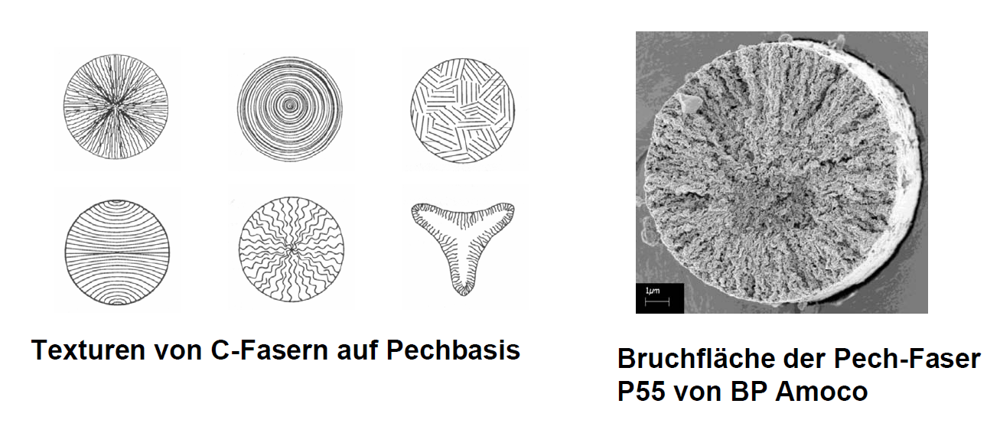

 
    Bild entmommen aus der Vorlesung "Leichtbau mit Faserverbunden" SS2008 von Prof. Dr.-Ing. Klaus Rohwer"

---

# Verteilung und Ausrichtung von Fasern

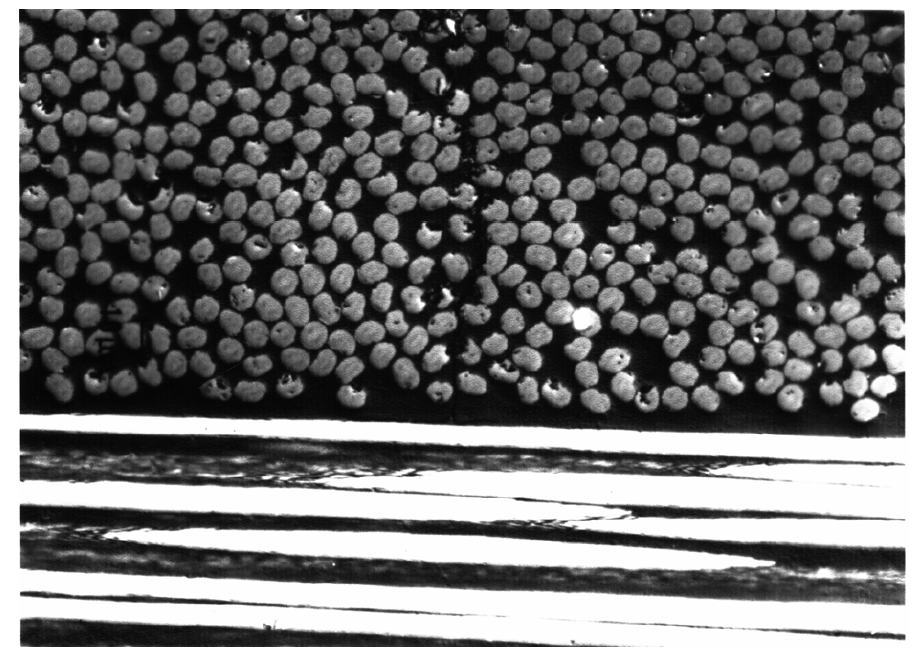

 
    Bild (rechts) entmommen aus der Vorlesung "Leichtbau mit Faserverbunden" SS2008 von Prof. Dr.-Ing. Klaus Rohwer"

---

# Repräsentativer Bereich

- bei unregelmäßiger Anordnung
   - repräsentativer Bereich muss groß genug sein
   - Anzahl der Fasern durch Zufallsvariablen gesteuert
   - Annahme von Periodizität
   - führt zu einem repräsentativen Volumenelement (RVE)

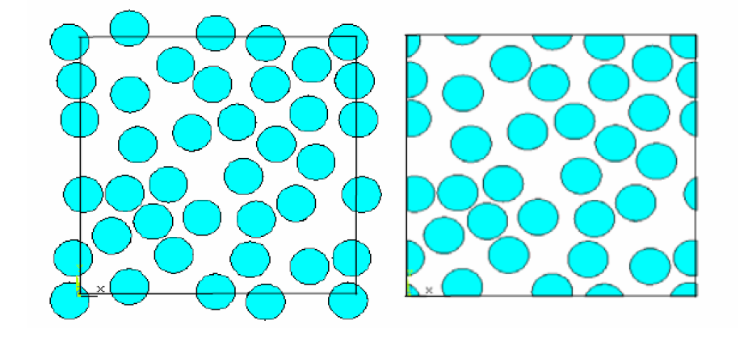

 
    Bild entmommen aus der Vorlesung "Leichtbau mit Faserverbunden" SS2008 von Prof. Dr.-Ing. Klaus Rohwer"

---

# Repräsentativer Bereich – Grenzen

- Grenzen:
   - Dimensionen sehr unterschiedlich sind (Ebene vs. Laminatdicke)
   - Periodizität in allen Raumrichtungen nicht streng erfüllt
   - Dominanz der Effekte innerhalb der Ebene

 
    Bild entmommen aus der Vorlesung "Leichtbau mit Faserverbunden" SS2008 von Prof. Dr.-Ing. Klaus Rohwer"

---

# Repräsentativer Bereich – Querrisse & Simulation

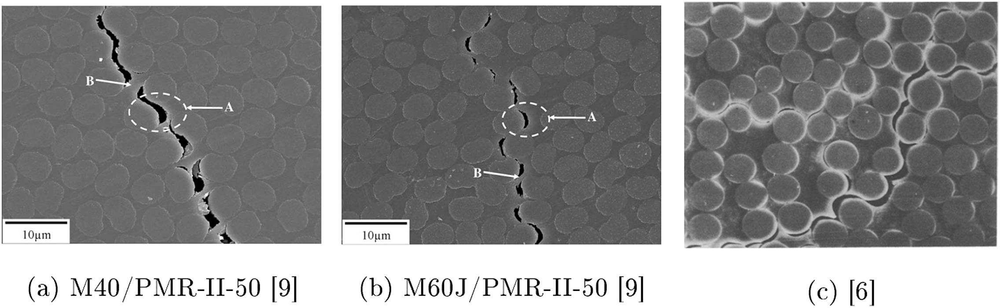

 
    Bild entmommen aus "Peridynamic analysis of fibre-matrix debond and matrix failure mechanisms in composites under transverse tensile load by an energy-based damage criterion", Rädel, M., Willberg, C. and Krause, D.; 10.1016/j.compositesb.2018.08.084

---

# Repräsentativer Bereich – Faserpackung

UD-Schicht mit regelmäßiger Anordnung

- Quadratische Anordnung
   - max. Faservolumengehalt
   $\varphi = \pi/4 \approx 0.785$
- Hexagonale Anordnung
   - max. Faservolumengehalt
   $\varphi = \pi\sqrt{3}/6 \approx 0.907$

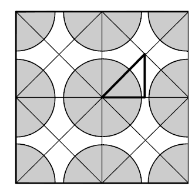
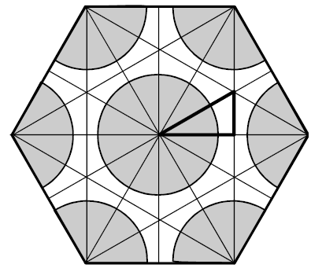

 
    Bild entmommen aus der Vorlesung "Leichtbau mit Faserverbunden" SS2008 von Prof. Dr.-Ing. Klaus Rohwer"

---

<!-- _class: lead -->

# Mikromechanische Spannungsberechnung – Aushärtespannungen

---

## Beispiel: Aushärtespannungen

- Aushärtespannungen (curing stresses) in einer UD-Schicht aus CF mit Epoxidharz-Matrix
- CFK-UD Schicht wird bei 180°C ausgehärtet
- nach dem Aushärten wird der Verbund abgekühlt
- bei etwa 120°C wird die Matrix fest und der Zustand wird eingefroren
- weitere Abkühlung auf Raumtemperatur (20°C) ergibt eine Temperaturdifferenz von 100°C
- unterschiedliche Wärmedehnungen von Faser und Matrix im Zusammenwirken mit der Haftung bewirken einen Eigenspannungszustand

---

## Beispiel: Aushärtespannungen – Modellierung

- im Inneren der UD Schicht, störungsfrei $\rightarrow$ ebener Dehnungszustand
- senkrecht zur Faser: 2D Problem
- am freien Rand (senkrecht zu Faser): Verwölbung der Oberfläche, weil keine äußeren Kräfte $\rightarrow$ 3D Problem
- Berechnung des Verschiebungs- und Spannungszustandes mit FEM, Materialgesetze müssen bekannt sein
- Matrix ist isotrop, linear elastisch und charakterisiert durch E-Modul $E$, Querkontraktionszahl $\nu$, Temperaturdehnkoeffizient $\alpha$

---

## Materialverhalten der Kohlenstofffaser

- Kohlenstofffaser ist transversalisotrop, linear elastisch und beschrieben durch 5 Koeffizienten:
   - $E_L$, $E_T$: E-Moduli in Faserrichtung und senkrecht
   - $G_{LT}$: Schubmodul parallel-senkrecht
   - $\nu_{TT}$, $\nu_{LT}$: Querkontraktionszahl parallel-senkrecht, senkrecht-senkrecht
- 2 Temperaturdehnkoeffizienten: $\alpha_L$, $\alpha_T$

---

## Konstitutivgesetz für transversalisotrope Faser

$$\begin{bmatrix}
\varepsilon_{xx} \\
\varepsilon_{yy} \\
\varepsilon_{zz} \\
\gamma_{yz} \\
\gamma_{xz} \\
\gamma_{xy}
\end{bmatrix} =
\begin{bmatrix}
\frac{1}{E_L} & -\frac{\nu_{LT}}{E_L} & -\frac{\nu_{LT}}{E_L} & 0 & 0 & 0 \\
-\frac{\nu_{LT}}{E_L} & \frac{1}{E_T} & -\frac{\nu_{TT}}{E_T} & 0 & 0 & 0 \\
-\frac{\nu_{LT}}{E_L} & -\frac{\nu_{TT}}{E_T} & \frac{1}{E_T} & 0 & 0 & 0 \\
0 & 0 & 0 & \frac{1}{G_{LT}} & 0 & 0 \\
0 & 0 & 0 & 0 & \frac{1}{G_{LT}} & 0 \\
0 & 0 & 0 & 0 & 0 & \frac{2(1+\nu_{TT})}{E_T}
\end{bmatrix}
\begin{bmatrix}
\sigma_{xx} \\
\sigma_{yy} \\
\sigma_{zz} \\
\sigma_{yz} \\
\sigma_{xz} \\
\sigma_{xy}
\end{bmatrix} +\begin{bmatrix}
\alpha_L \\
\alpha_T \\
\alpha_T \\
0 \\
0 \\
0
\end{bmatrix}\cdot \Delta T$$

- x-Achse oder 1-Achse = Faserrichtung (L)
- y- und z-Achse oder 2- und 3-Achse = quer zur Faserrichtung (T)

---

## Materialgrößen und Geometrie

$\begin{array}{llll}
\text{Fasern}: & E_L = 240\,\text{GPa} & \text{Matrix}: & E=3.5\,\text{GPa}\\
& E_T = 14\,\text{GPa} & & \nu=0.35\\
& G_{LT}=16\,\text{GPa} & & \alpha=55\cdot10^{-6}\,\text{K}^{-1}\\
& \nu_{LT} = 0.23\\
& \nu_{TT} = 0.23\\
& \alpha_L = 0.7\cdot10^{-6}\,\text{K}^{-1}\\
& \alpha_T = 5.5\cdot10^{-6}\,\text{K}^{-1}\\
\text{Faservolumengehalt}: & 60\%\\
\text{Faseranordnung}: & \text{hexagonal}\\
\end{array}$

---

# Repräsentatives Element

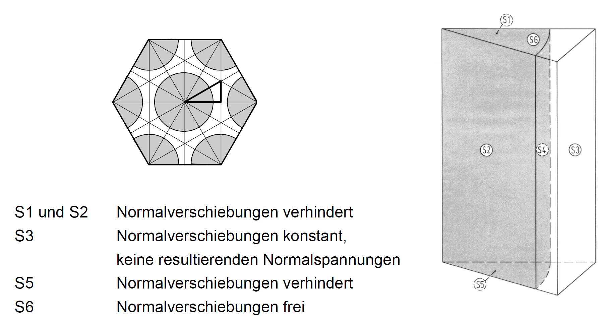

 
    Bild entmommen aus der Vorlesung "Leichtbau mit Faserverbunden" SS2008 von Prof. Dr.-Ing. Klaus Rohwer"

---

# Verformung infolge Temperaturerhöhung

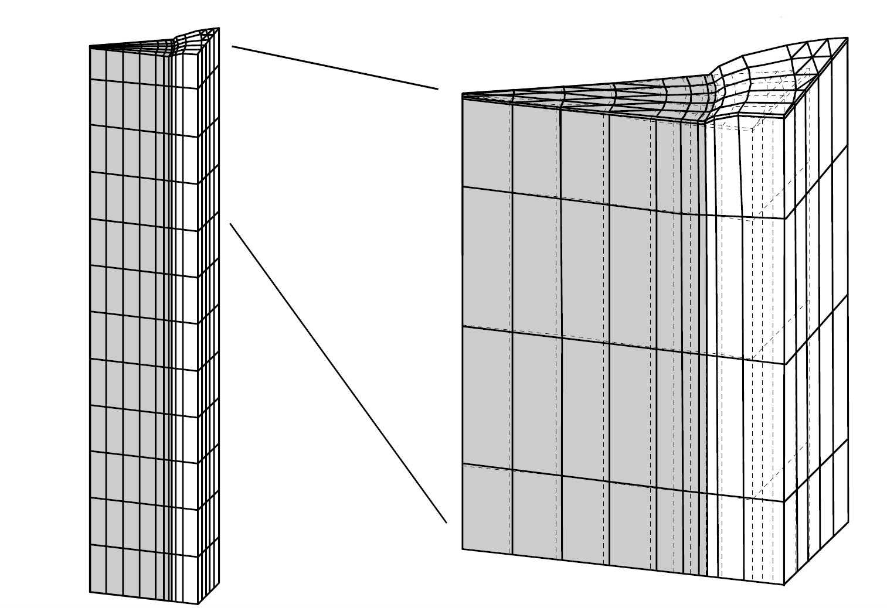

 
    Bild entmommen aus der Vorlesung "Leichtbau mit Faserverbunden" SS2008 von Prof. Dr.-Ing. Klaus Rohwer"

---

# Axialspannungen $\Delta T = -100\,°C$

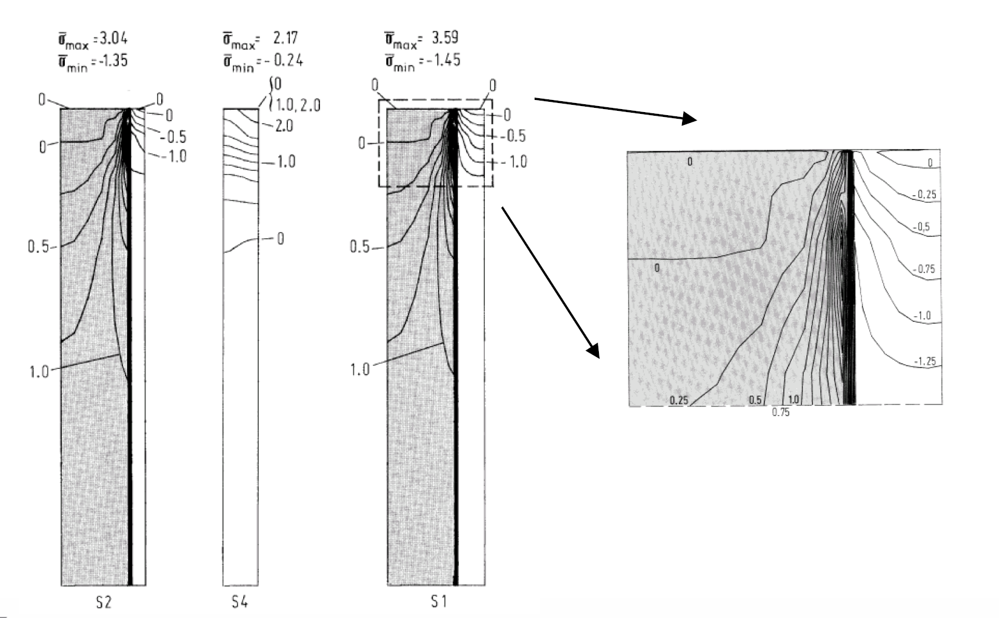

 
    Bild entmommen aus der Vorlesung "Leichtbau mit Faserverbunden" SS2008 von Prof. Dr.-Ing. Klaus Rohwer"

---

# Radialspannungen $\Delta T = -100\,°C$

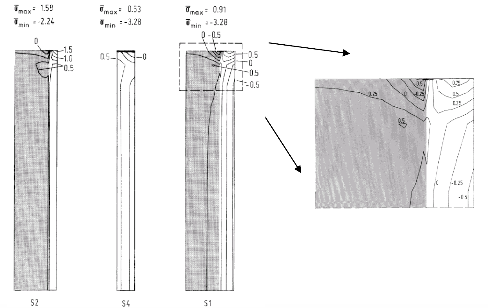

 
    Bild entmommen aus der Vorlesung "Leichtbau mit Faserverbunden" SS2008 von Prof. Dr.-Ing. Klaus Rohwer"

---

# Umfangsspannungen $\Delta T = -100\,°C$

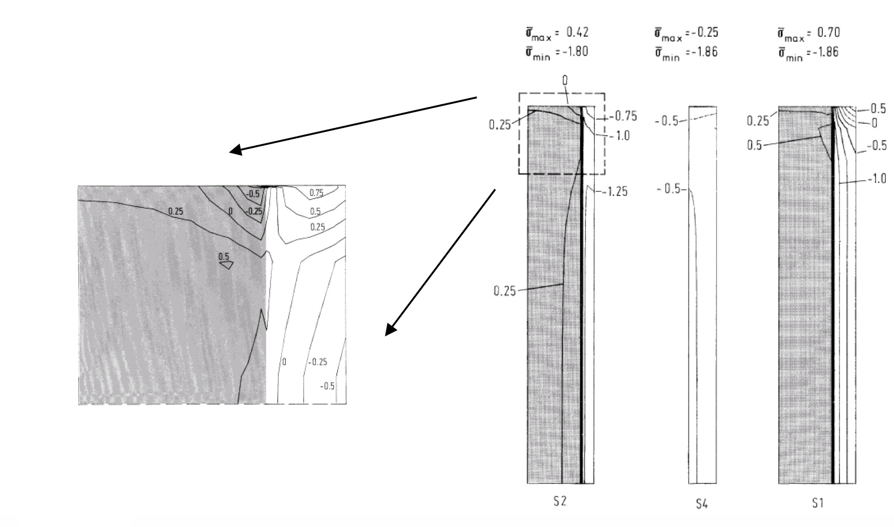

 
    Bild entmommen aus der Vorlesung "Leichtbau mit Faserverbunden" SS2008 von Prof. Dr.-Ing. Klaus Rohwer"

---

# Schubspannungen $\Delta T = -100\,°C$

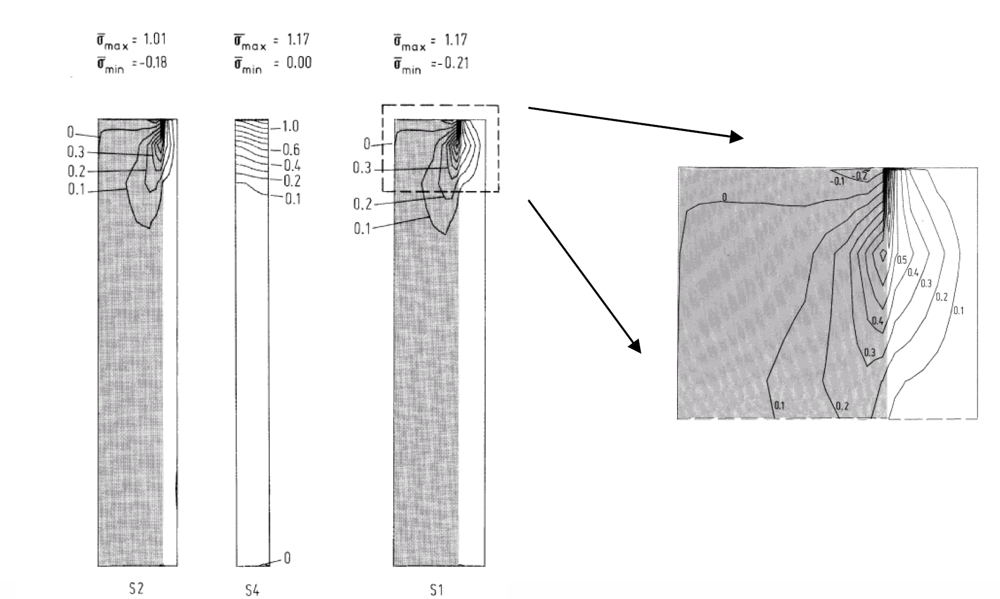

 
    Bild entmommen aus der Vorlesung "Leichtbau mit Faserverbunden" SS2008 von Prof. Dr.-Ing. Klaus Rohwer"

---

# Thermische Zyklierung bei Tiefsttemperaturanwendungen

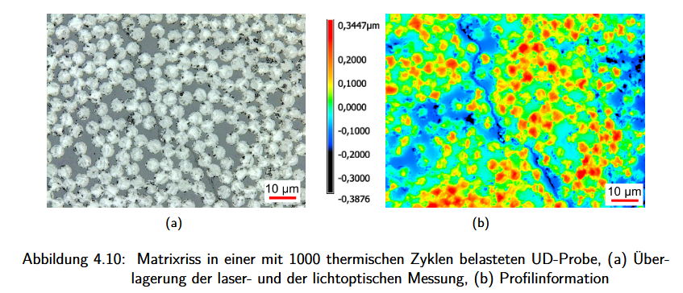

 
    Bild entmommen aus Lüders, C. "Mehrskalige Betrachtung des Ermüdungsverhaltens thermisch zyklierter Faserkunststoffverbunde", Dissertation, 2020

---

 
    Bild entmommen aus Lüders, C. "Mehrskalige Betrachtung des Ermüdungsverhaltens thermisch zyklierter Faserkunststoffverbunde", Dissertation, 2020

---

<!-- _class: lead -->

# Homogenisierung

---

# Homogenisierung – Überblick

- Reduktion der Einzelkomponenten auf eine Einzelkomponente
- Reduktion des Modellierungsaufwands
- Homogenisierungsverfahren unterscheiden sich abhängig vom betrachteten Parameter:
   - Steifigkeit
   - Wärmedehnungskoeffizienten
   - Feuchtequellkoeffizienten
   - Wärmeleitfähigkeitskoeffizienten
   - Festigkeiten

---

# Homogenisierung von Steifigkeiten

- Steifigkeiten von Fasern und Matrix sind extrem unterschiedlich
- für die Berechnung komplexer Strukturen ist die Berücksichtigung einzelner Fasern zu aufwändig $\rightarrow$ Einzelschicht wird als homogenes Kontinuum modelliert
- globales Verhalten soll hinreichend genau beschrieben werden
- Modellierung örtlicher (lokaler) Aspekte wird vernachlässigt, z.B. Verwölbung am freien Rand

---

## Allgemeine Regeln – Federmodell

- E-Modul in Faserrichtung $E_L$ und Querkontraktionszahl $\nu_{LT}$: **parallel** geschaltete Feder
  $\rightarrow$ Mischungsregel für Steifigkeiten
- E-Modul in Querrichtung $E_T$, Schubmodul $G_{LT}$ und Querkontraktionszahl $\nu_{TT}$: **in Reihe** geschaltete Feder
  $\rightarrow$ Mischungsregel für Nachgiebigkeiten

Korrektur erforderlich, weil Steifigkeit der Faser unter Belastung in Querrichtung nur zum Teil wirksam ist

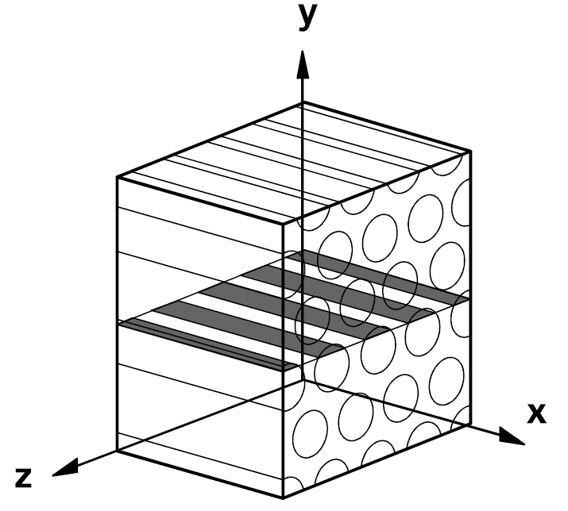

---

<!-- _class: lead -->

# Längs-Elastizitätsmodul $E_{\parallel}$

---

# Mikromechanisches Modell für $E_{\parallel}$

**Federnmodell:** Parallelschaltung von Fasern und Matrix

**Elasto-statisches Gleichungssystem:**

**1. Kräftegleichgewicht:**
$$F = F_f + F_m \Rightarrow \sigma \cdot A_{\text{Verbund}} = \sigma_f \cdot A_f + \sigma_m \cdot A_m$$

**2. Kinematik (gleiche Dehnung):**
$$\varepsilon_f = \varepsilon_m = \varepsilon_{\parallel}$$

**3. Elastizitätsgesetze:**
$$\sigma_f = E_f \cdot \varepsilon_{\parallel}, \quad \sigma_m = E_m \cdot \varepsilon_{\parallel}$$

---

# Mischungsregel für $E_{\parallel}$

**Einsetzen und Umformen:**
$$E_{\parallel} \cdot A_{\text{Verbund}} = E_f \cdot A_f + E_m \cdot A_m$$

Mit Faservolumenanteil $\varphi = A_f/A_{\text{Verbund}}$:

$$\boxed{E_{\parallel} = E_f \cdot \varphi + E_m \cdot (1 - \varphi)}$$

Da $E_m \ll E_f$: $\quad E_{\parallel} \approx E_f \cdot \varphi$

**Konstrukteur-Fazit:** Faservolumenanteil steuert die Längssteifigkeit direkt.

---

# Typische Werte für $E_{\parallel}$ ($\varphi = 0{,}6$)

| Material | $E_f$ [MPa] | $E_m$ [MPa] | $E_{\parallel}$ [MPa] |
|----------|-------------|-------------|------------------------|
| GF-EP | 73 000 | 3 400 | 45 160 |
| CF-EP (HT) | 230 000 | 3 400 | 139 960 |
| CF-EP (HM) | 392 000 | 3 400 | 236 560 |
| AF-EP | 125 000 | 3 400 | 76 360 |
| **Stahl 25CrMo4** | | | 206 000 |
| **Al-Legierung** | | | 72 400 |
| **Ti-Legierung** | | | 108 000 |

---

# Formeln für isotrope Fasern

$\begin{array}{ll}
\text{\textbf{E-Modul in Faserrichtung}}\\
E_L=\varphi E_f+(1-\varphi)E_m & \text{Mischungsregel}\\[4pt]
\text{\textbf{Querkontraktionszahl}}\\
\nu_{LT}=\varphi \nu_f+(1-\varphi)\nu_m & \text{Mischungsregel}\\[4pt]
\text{\textbf{E-Modul in Querrichtung}}\\
1/E_T\approx \varphi/E_f + (1-\varphi)/E_m & \text{Mischungsregel für Nachgiebigkeit}
\end{array}$

Korrektur erforderlich; entsprechend auch für $G_{LT}$ und Querkontraktionszahl $\nu_{TT}$

---

<!-- _class: lead -->

# Quer-Elastizitätsmodul $E_{\perp}$

---

# Scheibenmodell für $E_{\perp}$

**Modellvorstellung:** Hintereinanderschaltung von Faser- und Matrixabschnitten (Reihenschaltung)

**1. Kräftegleichgewicht:** $\sigma_{\perp} = \sigma_f = \sigma_m$

**2. Geometrie:** $\varepsilon_{\perp} \cdot l_0 = \varepsilon_m \cdot l_m + \varepsilon_f \cdot l_f$

**Grundformel (mit Querkontraktionsbehinderung):**

$$E_m' = \frac{E_m}{1 - \nu_m^2}$$

$$\boxed{\frac{1}{E_{\perp}} = \frac{1-\varphi}{E_m'} + \frac{\varphi}{E_f}}$$

---

# Korrigierte $E_T$-Werte – halbempirische Formeln

Es existieren viele verschiedene Ansätze – keiner mit Anspruch auf Allgemeingültigkeit.

$\begin{array}{ll}
\text{\textbf{Puck}} & E_T = \dfrac{(1+0.85\varphi^2)E_m}{\varphi E_m/E_f+(1-\varphi)^{1.25}}\\[8pt]
\text{\textbf{Tsai, Hahn, Wu}} & E_T=\dfrac{\varphi+0.5(1-\varphi)}{\varphi/E_f+0.5(1-\varphi)/E_m}\\[8pt]
\text{\textbf{Geier}} & E_T=\dfrac{E_fE_m}{\varphi/E_m+(1-\overline{\varphi})E_f},\quad \overline{\varphi}=\varphi+\zeta\varphi(1-\varphi),\;\zeta\approx 0.6\\[8pt]
\text{\textbf{Chamis}} & E_T=E_m/[1-\sqrt{\varphi}(1-E_m/E_f)]
\end{array}$

**Halbempirische Näherung nach Puck:**
$$\boxed{E_{\perp} = \frac{E_m}{1-\nu_m^2} \cdot \frac{1 + 0{,}85 \cdot \varphi^2}{(1-\varphi) + \varphi \cdot \frac{E_m}{(1-\nu_m^2) \cdot E_f}}}$$

---

# Korrigierte $G_{LT}$-Werte – halbempirische Formeln

Ansätze entsprechen dem Vorgehen bei der Bestimmung von $E_T$.

$\begin{array}{ll}
\text{\textbf{Puck}} & G_{LT} = \dfrac{(1+0.6\sqrt{\varphi})G_m}{\varphi G_m/G_f+(1-\varphi)^{1.25}}\\[8pt]
\text{\textbf{Tsai, Hahn, Wu}} & G_{LT}=\dfrac{\varphi+0.5(1-\varphi)}{\varphi/G_f+0.5(1-\varphi)/G_m}\\[8pt]
\text{\textbf{Geier}} & G_{LT}=\dfrac{G_fG_m}{\varphi/G_m+(1-\overline{\varphi})G_f},\quad \overline{\varphi}=\varphi+\zeta\varphi(1-\varphi),\;\zeta\approx 0.6\\[8pt]
\text{\textbf{Chamis}} & G_{LT}=G_m/[1-\sqrt{\varphi}(1-G_m/G_{LTf})]
\end{array}$

**Halbempirische Näherung nach Förster:**
$$\boxed{G_{\perp\parallel} = G_m \cdot \frac{1 + 0{,}4 \cdot \varphi^{0{,}5}}{(1-\varphi)^{1{,}45} + \varphi \cdot \frac{G_m}{G_f^{\perp\parallel}}}}$$

---

<!-- _class: lead -->

# Querkontraktionszahlen

---

## Querkontraktionszahl $\nu_{\perp\parallel}$

**Drei Querdehnungen in der UD-Schicht:**

1. $\varepsilon_{\perp}$ infolge $\sigma_{\parallel}$: $\nu_{\perp\parallel} = -\dfrac{\varepsilon_{\perp}}{\varepsilon_{\parallel}}$ (große QKZ)
2. $\varepsilon_{\parallel}$ infolge $\sigma_{\perp}$: $\nu_{\parallel\perp} = -\dfrac{\varepsilon_{\parallel}}{\varepsilon_{\perp}}$ (kleine QKZ)
3. $\varepsilon_{\perp}$ infolge $\sigma_{\perp}$: $\nu_{\perp\perp} = -\dfrac{\varepsilon_3}{\varepsilon_2}$

**Mischungsregel:**
$$\boxed{\nu_{\perp\parallel} = \varphi \cdot \nu_f^{\perp\parallel} + (1-\varphi) \cdot \nu_m}$$

**Symmetrie-Beziehung:**
$$\boxed{\nu_{\parallel\perp} = \nu_{\perp\parallel} \cdot \frac{E_{\perp}}{E_{\parallel}}}$$

---

# Querkontraktionszahl $\nu_{\perp\perp}$

Für räumliche Spannungszustände – mit Foye-Korrektur (Dehnungsbehinderung in Längsrichtung):

$$\nu_{\perp\perp} = \varphi \cdot \nu_f^{\perp\perp} + (1-\varphi) \cdot \nu_{m,\text{eff}}$$

$$\nu_{m,\text{eff}} = \nu_m \cdot \frac{1 + \nu_m - \nu_m \cdot \nu_{\perp\parallel} \cdot \frac{E_m}{E_{\parallel}}}{1 - \nu_m + \nu_m \cdot \nu_{\perp\parallel} \cdot \frac{E_m}{E_{\parallel}}}$$

---

# Quer-Quer-Schubmodul $G_{\perp\perp}$

In der isotropen Ebene (abhängige Größe):
$$\boxed{G_{\perp\perp} = \frac{E_{\perp}}{2(1 + \nu_{\perp\perp})}}$$

---

## Zusammenfassung: Grund-Elastizitätsgrößen

**Ebener Spannungszustand (4 unabhängige):**
1. $E_{\parallel}$ – Längs-E-Modul
2. $E_{\perp}$ – Quer-E-Modul
3. $G_{\perp\parallel}$ – Quer-Längs-Schubmodul
4. $\nu_{\perp\parallel}$ – große Querkontraktionszahl

**Räumlicher Spannungszustand (+1):**
5. $\nu_{\perp\perp}$ – QKZ in isotroper Ebene

**Abhängige Größen:**
- $\nu_{\parallel\perp}$ aus Symmetriebeziehung
- $G_{\perp\perp}$ aus Isotropiebeziehung

---

# Typische Zahlenwerte ($\varphi = 0{,}6$)

| Material | $E_{\parallel}$ | $E_{\perp}$ | $G_{\perp\parallel}$ | $G_{\perp\perp}$ | $\nu_{\perp\parallel}$ | $\nu_{\parallel\perp}$ | $\nu_{\perp\perp}$ |
|----------|-----------------|-------------|----------------------|------------------|------------------------|------------------------|-------------------|
| | [MPa] | [MPa] | [MPa] | [MPa] | [-] | [-] | [-] |
| **GF-EP** | 45 160 | 14 700 | 5 300 | 5 330 | 0,30 | 0,10 | 0,38 |
| **CF-EP (HT)** | 139 360 | 8 800 | 4 600 | 3 200 | 0,29 | 0,02 | 0,37 |

---

# Formeln für transversal-isotrope Fasern

$\begin{array}{ll}
E_L=\varphi E_{Lf}+(1-\varphi)E_m & \text{Mischungsregel}\\
\nu_{LT}=\varphi \nu_{LTf}+(1-\varphi)\nu_m & \text{Mischungsregel}\\
E_T=E_m/\left[1-\sqrt{\varphi}(1-E_m/E_{Tf})\right] & \text{Chamis}\\
G_{LT}=G_m/\left[1-\sqrt{\varphi}(1-G_m/G_{LTf})\right] & \text{Chamis}\\
G_{TT}=G_m/\left[1-\sqrt{\varphi}(1-G_m/G_{TTf})\right] & \text{Chamis}\\
\nu_{TT}=\dfrac{E_T}{2G_{TT}}-1 & \text{Chamis}
\end{array}$

---

# Anwendung der Homogenisierungsformeln

**Problem der Kennwertbestimmung:**
- nur wenige Faserkennwerte können direkt im Versuch bestimmt werden
- insbesondere in Querrichtung und unter Schubbelastung lassen sich Einzelfasern kaum testen

**Zwei sinnvolle Anwendungen:**
1. **Inverse Anwendung:** Bestimmung der Faserwerte aus Messungen an UD-Schichten und Reinharzproben
2. **Umrechnung:** Laminateigenschaften bei geändertem Faservolumenanteil

---

## Beispiel: Inverse Anwendung

E-Glasfasern als UD-Verstärkungen in Epoxidharzmatrix, $\varphi = 0.6$

$\begin{array}{ll}
\text{\textbf{Verbundwerte}} & \text{\textbf{Reinharzwerte}}\\
E_L=45\,\text{GPa} & E_m=3.3\,\text{GPa}\\
E_T=12\,\text{GPa} & \nu_m=0.3\\
G_{LT}=4.4\,\text{GPa} & G_m=1.27\,\text{GPa}\\
\nu_{LT}=0.25\\
\end{array}$

Aus der Mischungsregel:
$$E_f = \frac{E_L - (1-\varphi)E_m}{\varphi} = 72.8\,\text{GPa}, \qquad \nu_f = 0.217, \qquad G_f = 29.91\,\text{GPa}$$

---

## Beispiel: Umrechnung $\varphi = 0.6 \rightarrow 0.5$

**In Faserrichtung (eindeutig):**
$$E_L = 0.5 \cdot 72.8 + 0.5 \cdot 3.3 = 38\,\text{GPa}$$
$$\nu_{LT} = 0.5 \cdot 0.217 + 0.5 \cdot 0.3 = 0.258$$

**In Querrichtung (formelhabhängig):**

| Formel | $E_T$ [GPa] |
|--------|-------------|
| Puck | 9,03 |
| Geier | 8,70 |
| Tsai, Hahn, Wu | 9,08 |
| Chamis | 10,16 |
| **Mittelwert** | **9,24** |

Abweichungen in der Größenordnung von ~10%

---

## Umrechnung: Schubmodul $G_{LT}$ bei $\varphi = 0.5$

| Formel | $G_{LT}$ [GPa] |
|--------|----------------|
| Puck | 3,35 |
| Geier | 3,31 |
| Tsai, Hahn, Wu | 3,51 |
| Chamis | 3,93 |
| **Mittelwert** | **3,52** |

Abweichungen in der Größenordnung von ~10%

---

# Berücksichtigung von Faserondulation

- repräsentatives Element mit FEM zu berechnen
- Modelle können enorm komplex sein
- Gewebe können so abgebildet werden

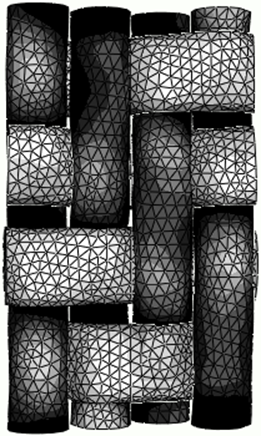
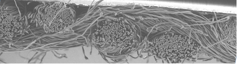
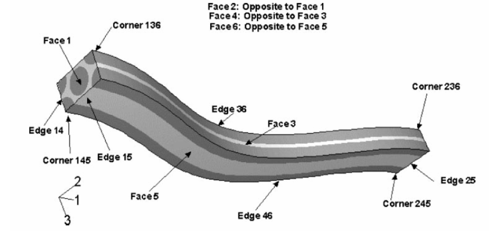

 
    Bild 1+2 entmommen aus Lin, H; et al. "A finite element approach to the modelling of fabric mechanics", 10.1080/00405000.2012.660755;
    Bild 3 aus der Vorlesung "Leichtbau mit Faserverbunden" SS2008 von Prof. Dr.-Ing. Klaus Rohwer"

---

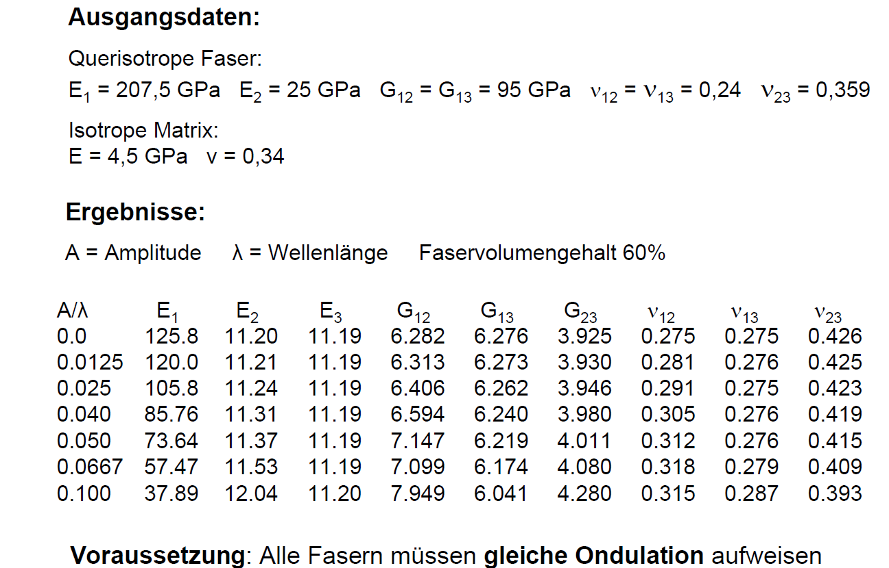

---

<!-- _class: lead -->

# Homogenisierung von Wärmeausdehnungskoeffizienten

---

# Homogenisierung der WDK – Ziel

- Wärmeausdehnungskoeffizienten von Faser und Matrix können sehr unterschiedlich sein (C-Faser in Kunstharzmatrix)
- für die Berechnung komplexer Strukturen ist die Berücksichtigung dieses Unterschiedes viel zu aufwändig
- Einelschicht muss als Kontinuum mit einheitlichem WDK modelliert werden
- örtliche (lokale) Betrachtung wird vernachlässigt

---

# Formeln für thermisch transversalisotrope Fasern

$\begin{array}{l}
\alpha_L = \dfrac{\varphi E_{Lf}\alpha_{Lf}+(1-\varphi)E_m\alpha_m}{\varphi E_{Lf}+(1-\varphi)E_m}\\[10pt]
\alpha_T = \overline{\varphi}\alpha_{Tf}+(1-\overline{\varphi})\alpha_m-(\alpha_m-\alpha_{Lf})\dfrac{\overline{\varphi}(1-\varphi)\nu_{LTf}E_m+\varphi(1-\overline{\varphi})\nu_mE_{Lf}}{\varphi E_{Lf}+(1-\varphi)E_m}\\[6pt]
\text{mit}\quad \overline{\varphi}=\varphi + \zeta\varphi(1-\varphi);\; \zeta\approx 0.6
\end{array}$

**Bestimmung des CTE von Fasern:**
- direkte Messung an Faserbündeln
- Rückrechnung aus Messungen an Verbunden
- Untersuchungen an Einzelfasern (REM, TEM)

---

<!-- _class: lead -->

# Homogenisierung von Feuchtequellkoeffizienten

---

# Feuchtequellkoeffizienten – Ziel & Formeln

- Feuchtequellkoeffizienten von Faser und Matrix sind meist sehr unterschiedlich
- häufig nimmt die Matrix die Feuchte auf und quillt; viele Fasern nehmen keine Feuchte auf (Ausnahme: Aramid, Biofasern)

$$\Delta c=\frac{\varphi\rho_f \Delta c_f+(1-\varphi)\rho_m \Delta c_m}{\varphi\rho_f+(1-\varphi)\rho_m}$$

$$\beta_L = \frac{1}{\Delta c}\frac{\varphi E_{Lf}\Delta c_f \beta_{Lf}+(1-\varphi)E_m\Delta c_m\beta_m}{\varphi E_{Lf}+(1-\varphi)E_m}$$

$$\beta_T = \frac{1}{\Delta c}\left[\overline{\varphi}\Delta c_f \beta_{Tf}+(1-\overline{\varphi})\Delta c_m \beta_{m} - (\Delta c_m \beta_{m}-\Delta c_f \beta_{Tf})\frac{\overline{\varphi}(1-\varphi)\nu_{LTf}E_m+\varphi(1-\overline{\varphi})\nu_mE_{Lf}}{\varphi E_{Lf}+(1-\varphi)E_m}\right]$$

mit $\overline{\varphi}=\varphi + \zeta\varphi(1-\varphi);\; \zeta\approx 0.6$

---

<!-- _class: lead -->

# Homogenisierung von Wärmeleitfähigkeitskoeffizienten

---

# Wärmeleitfähigkeit – Überblick

- Koeffizienten von Faser und Matrix teilweise sehr unterschiedlich:
   - Polymere allgemein gering
   - Glas- und Aramidfasern gering
   - Kohlenstofffasern: hoch in Faserrichtung, gering quer
- **Lufteinschlüsse** haben einen Effekt

**In Faserrichtung (Mischungsregel):**
$$k_L=\varphi k_{Lf}+(1-\varphi)k_m$$

**Senkrecht zur Faserrichtung:**

$\begin{array}{ll}
\text{\textbf{Lord Rayleigh (1882)}} & k_t=k_m\!\left[1-\dfrac{2\varphi}{\nu'+\varphi+3\varphi^4 S_4^2/(\nu'\pi^4)}\right],\quad \nu'=\dfrac{1+k_{Tf}/k_m}{1-k_{Tf}/k_m},\; S_4=0.0323502\pi^4\\[8pt]
\text{\textbf{Selbstkonsistentes Modell}} & k_t=k_m\dfrac{k_{Tf}(1+\varphi)+k_m(1-\varphi)}{k_{Tf}(1-\varphi)+k_m(1+\varphi)}
\end{array}$

---

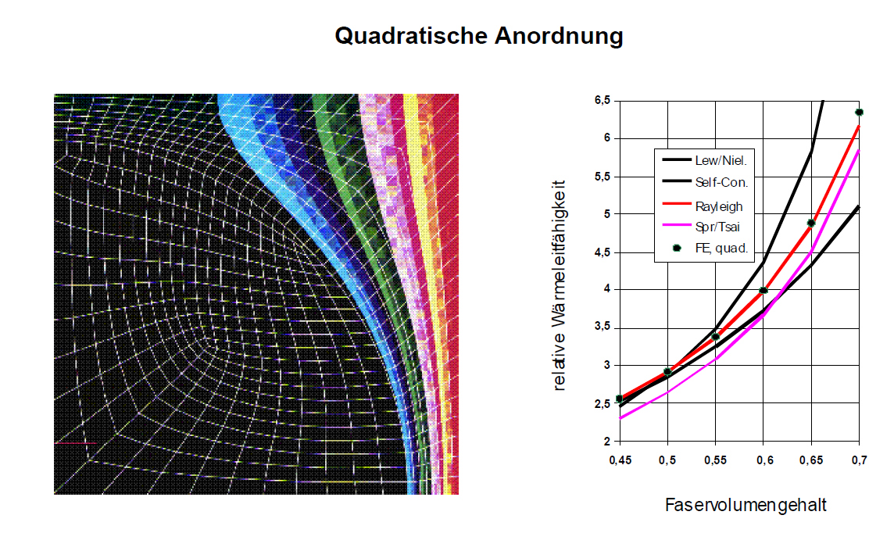

 
    Bild aus der Vorlesung "Leichtbau mit Faserverbunden" SS2008 von Prof. Dr.-Ing. Klaus Rohwer"

---

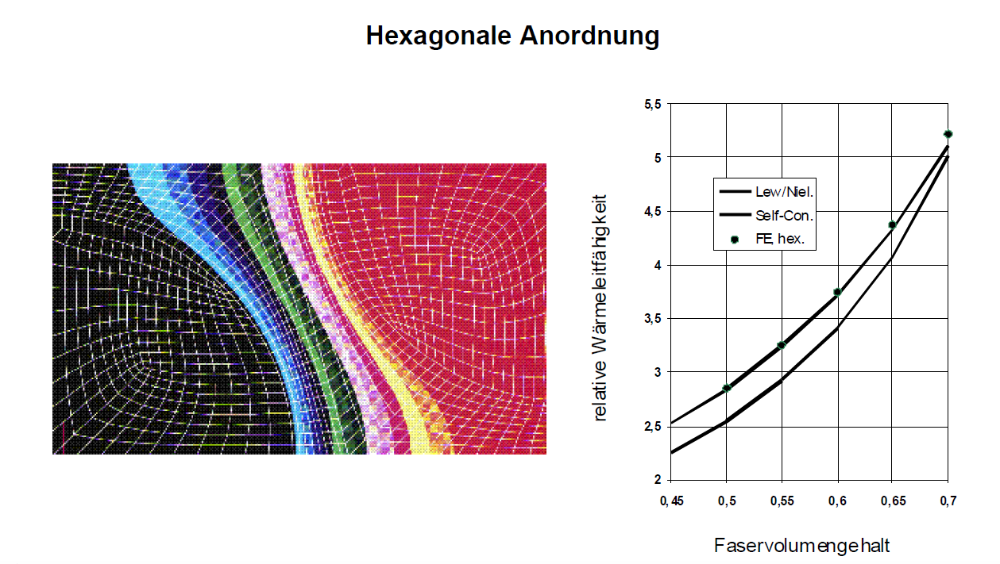

 
    Bild aus der Vorlesung "Leichtbau mit Faserverbunden" SS2008 von Prof. Dr.-Ing. Klaus Rohwer"

---

# Messung der Wärmeleitfähigkeit – Transient Hot-Strip Verfahren

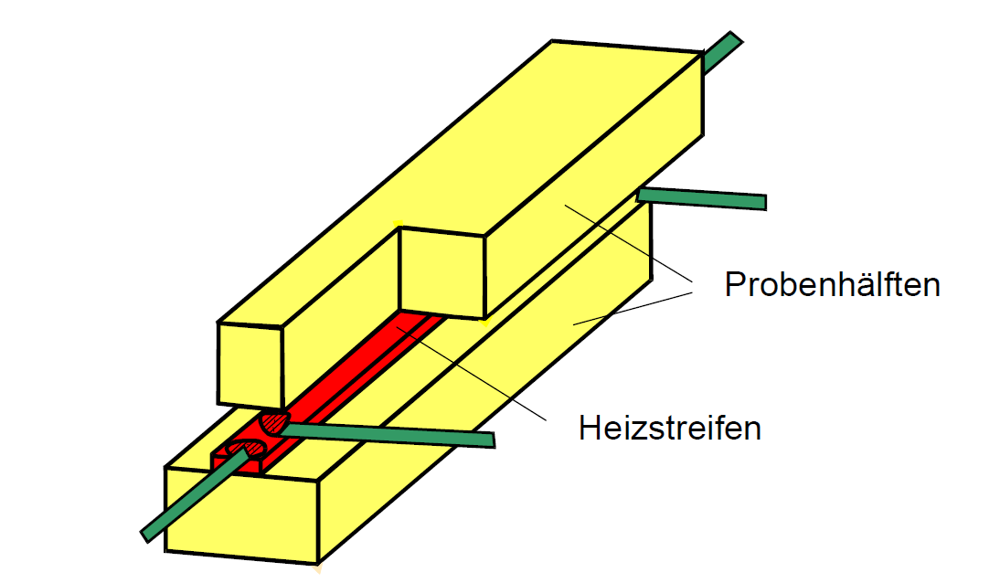

 
    Bild aus der Vorlesung "Leichtbau mit Faserverbunden" SS2008 von Prof. Dr.-Ing. Klaus Rohwer"

---

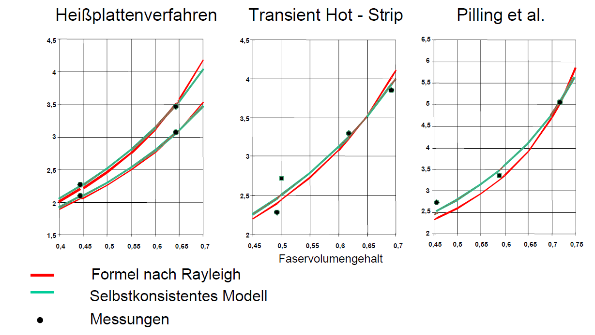

 
    Bild aus der Vorlesung "Leichtbau mit Faserverbunden" SS2008 von Prof. Dr.-Ing. Klaus Rohwer"

---

<!-- _class: lead -->

# Homogenisierung von Festigkeiten

---

## Festigkeiten – Überblick

- Faserfestigkeiten kaum direkt messbar
- Messbar: Zug- und Druckfestigkeiten in Faserrichtung, Festigkeiten in Gewebe-Verbunden

---

**Erkenntnisse der Homogenisierung:**
- Abschätzung der Festigkeiten bei geändertem Faservolumengehalt
- besseres Verstehen des Verbundversagens
- sinnvolle Auslegung von Fasern und Matrix

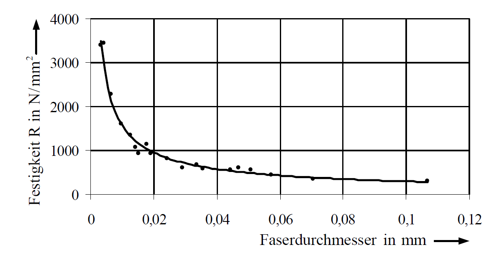

 
    Bilder aus H. Schürrmann "Konstruieren mit Faser-Kunststoff-Verbunden"

---

## Mischungsregel

**Annahmen:** Lineare Elastizität bis zum Bruch, gleiche Faserfestigkeit konstant über die Länge

**Faserkontrolliertes Versagen** ($\varepsilon_t = \varepsilon_{ft}$):

$$\boxed{\sigma_t=\sigma_{ft}\varphi+\sigma_m(\varepsilon_{ft})(1-\varphi)}$$

Der Verbund versagt nur dann, wenn:
$$\sigma_t\geq\sigma_{mt}(1-\varphi)$$

Sonst trägt die Matrix trotz gerissener Fasern (nur bei sehr kleinen $\varphi$ möglich).

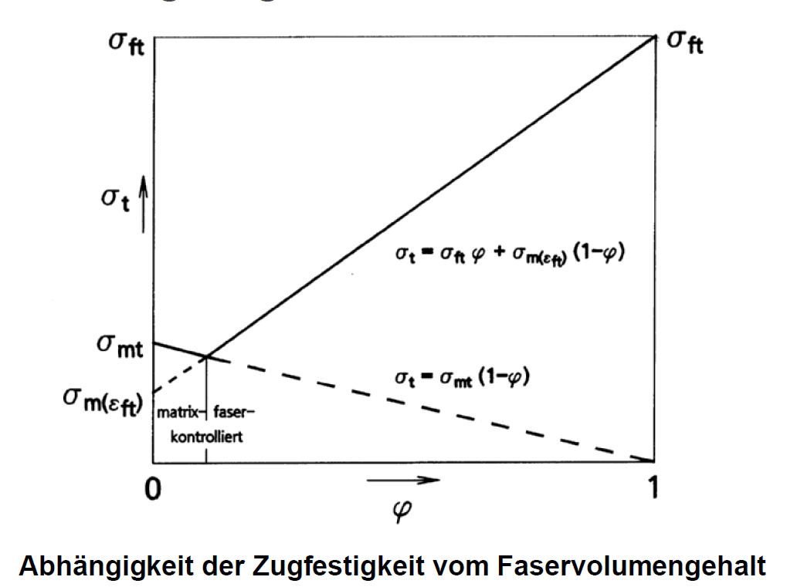

---

## Versagenshypothesen – Übersicht

| Hypothese | Kernidee | Kritik |
|-----------|----------|--------|
| **Mischungsregel** | Mittlere Festigkeit | Keine stat. Streuung |
| **Weakest Link** | Schwächste Faser versagt | Zu geringe Festigkeit bei großen Bauteilen |
| **Cumulative Weakening** | Störspannungen um Bruchstelle | Nachbarfasern bleiben unberücksichtigt |
| **Fiber Break Propagation** | Lastübertragung auf Nachbarfasern | Zu geringe Festigkeit bei großen Bauteilen |
| **Cumulative Group Mode** | Gruppen gerissener Fasern | Zu aufwändig für Praxis |

---

## Versagenshypothese: Weakest Link

Weibull-Verteilung: $f(\sigma_t)=L\alpha\beta\sigma_t^{\beta-1}e^{-L\alpha\sigma_t^{\beta}}$

**Bruchspannung der schwächsten Faser:**
$$\sigma_{tw}=\left(\frac{\beta-1}{NL\alpha\beta}\right)^{1/\beta}$$

---

## Versagenshypothese: Cumulative Weakening

**Annahmen:** Linear elastische Fasern, ideal plastische Matrix (Fließspannung $\tau_{mt}$)

Länge des Störbereichs: $\delta=\dfrac{\sigma_{ft}}{4\tau_{mt}}d_f$

Verbundfestigkeit: $\sigma_t^*=(\alpha\delta\beta e)^{-1/\beta}$

---

## Druckfestigkeiten von UD-Verbunden

**Bei geringem $\varphi$** – symmetrische Stauchungsform:
$$\sigma_c=2\varphi\sqrt{\frac{\varphi E_m E_f}{3(1-\varphi)}}$$

**Bei höherem $\varphi > 0.2$** – antisymmetrische Schubformen:
$$\sigma_c=\frac{G_m}{1-\varphi} \qquad \text{bzw.} \qquad \sigma_c=\frac{(1+\varphi)G_m}{1-\varphi}$$

**Für anisotrope Fasern:**
$$\sigma_c=\frac{G_m}{1-\varphi(1-G_m/G_{LTf})}$$

Bei höherem $\varphi$: ideal plastische Matrix mit Fließspannung $\tau_{mt}$:
$$\sigma_c=\sqrt{\frac{\varphi\tau_{mt}E_m}{3(1-\varphi)}}$$

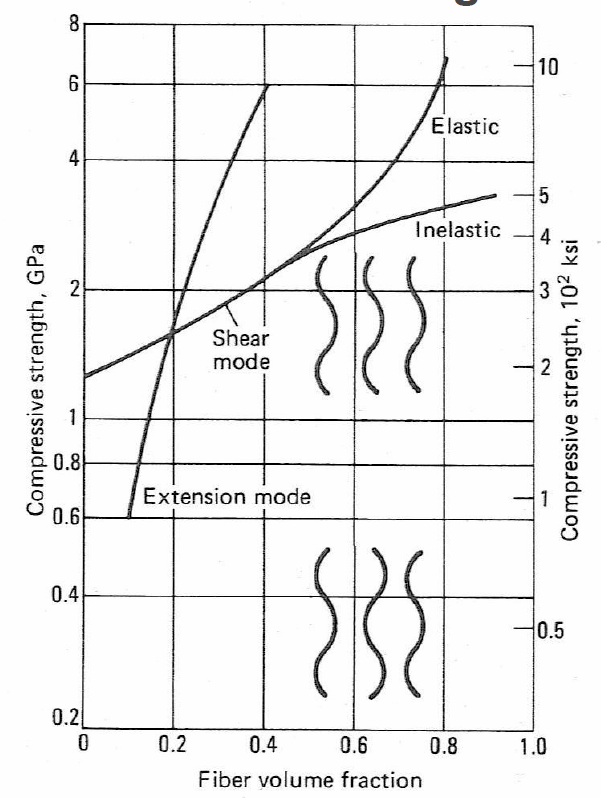

---

## Kritik an Druckfestigkeitsformeln

- **Faserondulation** nicht erfasst: 2–3° sind typisch und reduzieren die Druckfestigkeit erheblich
- **Einfluss der Faserdicke** nicht erfasst: dickere Fasern sind besser ausgerichtet und haben höhere Druckfestigkeit

**Alternativer Ansatz (Dharan & Lin):**
$$\sigma_c = \frac{G_m}{1-\varphi+2(h_i/h_f)(G_m/G_i)\varphi}$$

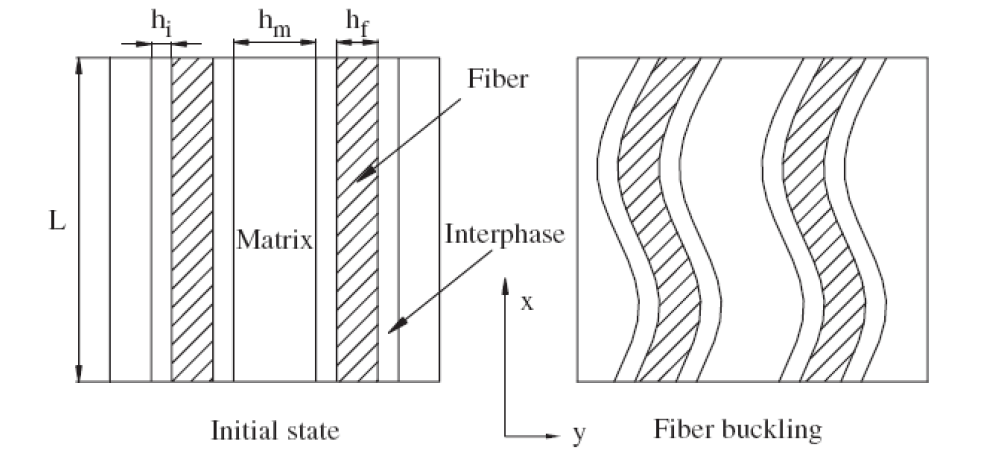

---

## Nichtlineares Werkstoffverhalten

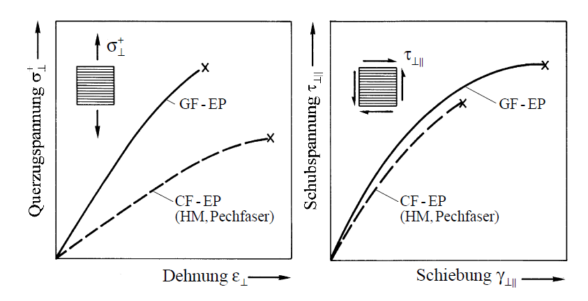

**Beobachtungen:**
- $\sigma_{\perp}$-$\varepsilon_{\perp}$-Kurve: wenig nichtlinear
- $\tau_{\perp\parallel}$-$\gamma_{\perp\parallel}$-Kurve: **deutlich degressiv**

**Ursachen:**
- Nicht primär nichtlineares Matrixverhalten
- Mikromechanische Schädigungen reduzieren Steifigkeit
- Irreversible Schädigungen bei Erstbelastung

---

<!-- _class: lead -->

## Vier Wege zur Datenbeschaffung

---

**1. Literaturdaten:** Weit verbreitete Faser-Matrix-Systeme

**2. Ähnliche Systeme:** Für Vorauslegungen übertragbar

**3. Mikromechanische Formeln:**
- Berechnung aus Faser- und Matrixdaten
- Vorteil: Schnelle Parameter- und Werkstoffvariationen
- Genauigkeit für Vorauslegungen ausreichend

**4. Experimentelle Bestimmung:**
- Genaueste Wiedergabe der Realität
- Erfasst alle Fertigungs- und Materialeinflüsse
- Kostspielig, aber meist notwendig

---

## Experimentelle Bestimmung der Elastizitätsgrößen

**$E_{\parallel}$:**
- Selten experimentell bestimmt; lässt sich sehr exakt berechnen
- Zugfestigkeit $R_{\parallel}^+$ schwierig zu messen

**$E_{\perp}$ und $G_{\perp\parallel}$:**
- Rechnerische Bestimmung mit Unsicherheiten
- Empfohlen: experimentelle Ermittlung, z.B. Zug/Druck-Torsionsprüfung (Z/DT)

**$\nu_{\perp\parallel}$:**
- Rechnerisch gut bestimmbar (wenn $\nu_f$ bekannt)
- Bei anisotropen Fasern problematisch
- Messung mit DMS: Querempfindlichkeit korrigieren!