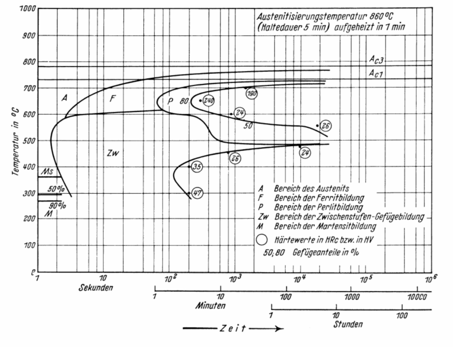

## Vorlesung Werkstofftechnik
Prof. Dr.-Ing.  Christian Willberg
Hochschule Magdeburg-Stendal

Kontakt: christian.willberg@h2.de

 
    <a href="https://doi.org/10.1007/s42102-021-00079-6" style="color: blue;">Bildreferenz</a>

---

<!--paginate: true-->

---

# Korrosion

- unterteilt in chemische, elektrochemische oder physikalische Reaktion von Metallen mit der Umgebung
- die Werkstoffeigenschaften beeinträchtigt werden
- die meisten Korrosionsschäden sind elektrochemische

[Vertiefung](https://www.fh-muenster.de/bau/downloads/personen/muero/intern/bau/4.1Stahlkorrosion.pdf)

---

## Chemische Korrosion

- unmittelbare Reaktion von Metallen mit der Umgebung
- es erfolgt ein direkter Elektronenaustausch
- Reaktionspartner ist meist Sauerstoff $\text{O}_2$
Bsp.:
 $2\text{Mg}+\text{O}_2\rightarrow \text{MgO}_2$
 
- findet meist bei höheren Temperaturen statt (Vorgang: Zundern)

---

## Elektrochemische Reaktion
- die meisten Korrosionsschäden sind elektrochemische
- zwei Teilreaktionen und meist örtlich getrennt
- beide Teilreaktionen erfordern einen Austausch an Ladungsträgern
    - Metalle ermöglichen das durch ihre Leitfähigkeit
    - außerhalb des Metalls wird der Stromkreis durch ein Elektrolyt geschlossen
    
**Elektrolyt**
- ein Medium in dem sich Ionen bewegen können (_Ionenleitung_)
- meist wässrige Lösungen 
- auch Erdboden, Salzschmelzen oder Feststoffen (genutzt in Brennstoffzellen)

---

**_Dissoziationsgrad_**
- bestimmt die Aggressivität des Elektrolyts
- je mehr die Konzentration der Ionen von der Konzentration im Wasser abweicht, desto aggressiver ist das Elektrolyt
- kann im pH-Wert dargestellt werden. 
pH < 7 sauer
pH = 7 ist neutral
pH > 7 basisch (alkalisch)

---

## Prinzipbild Galvanische Zelle

- Anionen - negative Ionen
- Katinionen - postive Ionen
- unter Gleichstrom wandern die negativ geladenen Ionen zur Anode
- Örtlich Trennung (Anode, Kathode)

---

## Galvanisierung

- die Kathodenreaktion ist eine Reduktion

$\text{Metallion} + \text{Elektron} \rightarrow \text{Metallatom}$

- es bildet an der Oberfläche einen Niederschlag
- Prinzip der galvanischen Beschichtung
- an der Anode findet eine Oxidation statt (Abgabe von Elektronen)
---

## Prinzipbild Korrosionselement
- zwei Bestandteile
- leitend verbundene Bereiche
  - zwei Metalle
  - gleiche Metalle mit unterschiedlichen elektrischen Potentialen
- Benetzung mit Elektrolyt

---

- edlere wird zu Kathode
- unedlere Elektrode wird zur Anode
  - wie bei der Galvanisierung gibt die Anode Elektronen ab
  $\text{Metall} \rightarrow \text{Metall}^{++} + 2\text{e}^{-}$
  - sie löst sich auf und korrodiert
- An der Kathode kann keine Meatall-Metallionen Reaktion stattfinden
  - es findet daher eine Redoxreaktion statt
  - Wasserstoffkorrosion oder Sauerstoffkorrosion
---

| Metall    | Potential | Korrosionsverhalten       |
|-----------|-----------|-----------------|
| Gold      | +1.50 V   | edel      |
| Platin    | +1.18 V   |       |
| Silber    | +0.80 V   |       |
| Kupfer    | +0.34 V   |       |
| Wasserstoff | +0.00 V  | neutral  |
| Zinn      | -0.14 V   |   |
| Eisen     | -0.41 V   |   |
| Zink      | -0.76 V   |   |
| Titan     | -1.75 V   |   |
| Aluminium | -1.66 V   | unedel  |

---

## Wasserstoffkorrosion
- nur un sehr sauren Elektrolyten möglich
- tritt in Anwesenheit von Wasser aber in Abwesenheit von Sauerstoff auf
>Säurekorrosion

---

## Sauerstoffkorrosion
- die freien Elektronen reagieren mit dem Wasser zu Hydroxid-Ionen
$\text{H}_2\text{O} + \frac12\text{O}_2 + 2\text{e}^{-} \rightarrow 2\text{OH}^-$
$2\text{Fe}^{2+} + 4\text{(OH)}^- +\text{H}_2\text{O} + \frac12\text{O}_2 \rightarrow 2\text{Fe(OH)}_3$
- kann noch weiter zerfallen

---

## Physikalische Korrosion

- Aufgrund von Belastungen enstehen Mikrorisse oder Versetzungen an denen Korrosion beginnen kann
- Korrision findet in Kombination mit einer mechanischen Belastung (statische oder dynamische - schwingend) auf

---

## Korrosionsarten
- es gibt 36 Korrosionsarten laut [DIN EN ISO 8044](https://cdn.standards.iteh.ai/samples/71134/642505f174ad4feeb2eef113b494d4e4/ISO-8044-2020.pdf)

**Flächenkorrosion**
- großflächige Korrosion
- gut sichtbar und eher ungefährlich
- die Deckschicht sorgt für einen Korrosionsschutz

---

## Korrosionsarten
**Lochfraßkorrosion**
- bleibt lange unbemerkt
- können sich in der Tiefe trogförmig ausdehnen

---

## Korrosionsarten
**Spaltkorrosion**
- tritt an Metallteilen  in engen, nicht abgeschlossenen Spalten wie Überlappungen, aufgesetzten Stegen und bei nicht durchgeschweißten Schweißnähten auf
- schlecht sichtbar
- sollte in kritische Bereichen konstruktiv vermieden werden

---

## Korrosionsarten
**Interkristaline Korrosion**
- auch Kornzerfall genannt
- tritt an den Korngrenzen auf
- Reminder: Einfluss des Raumgitters - Angriff aggressiver Medien erfolgt an bevorzugten Ebenen

---

## Sonstige Korrosionsarten

- [mirkobakterielle](https://en.wikipedia.org/wiki/Microbial_corrosion) Korrosion
  - Abwässern
  - Flugzeugtreibstoff
  - Pilzbefall
- Unterwanderungskorrosion
- Hochtemperaturkorrosion
- Spannungsrisskorrosion
    - die korrosionshemdende Schicht wird durchbrochen und es kommt zur Korrosion
- ...
---

## Korrosionsschutz 

- unterscheidbar zwischen passivem und aktivem Schutz
- passiv: Trennung von Metall und Elektrolyt / korrosivem Medium
- aktiv: vollständige Trennung ist nicht notwendig

---

## Korrosionsschutz

- Erarbeiten in Kleingruppen 10 Minuten - 15 Minuten Recherche
- 2 Gruppen
  - 3 passive Verfahren
  - 3 aktive Verfahren 
- kurze Vorstellung der Ergebnisse (Ruhig Tafel nutzen)
  - wesentliches "take away"

Übertragen in Moodle 

---

# Ermüdung

Was ist Ermüdung?

<!DOCTYPE html>
<html lang="en">

  </body>
</html>

---

- tritt meist bei zyklischer Belastung auf
  - isotherme mechanische Ermüdung
    - [schwingende Belastung](https://www.youtube.com/watch?v=_qVXkAWtH60)

    - Flugzeugrumpf (Druckaufbau und Abbau)
  - thermische Ermüdung
    - Öfen, Heizelemente
  - thermo-mechanische Ermüdung
    - Hochdrucktanks
  - elektro-thermische Ermüdung
    - elektrische Leiter (Glühfäden)

---

---

## Ermüdung
- Belastung findet unterhalb der Streckgrenze $R_{p0,2}$ statt 
  - > _Wiederholung: Was sagt $R_{p0,2}$ aus?_
- an Störungen im Material (Poren, Mikrorisse, usw.) oder im Kritall (Fehlstellen, Versetzungen, usw.) entstehen Spannungskonzenrtrationen
- durch wechselnde Belastungen entstehen erst einmal statistisch regellos verteilte Bereiche lokaler plastischer Verformungen
- diese Stellen wiederum Störstellen dar mit erhöhten Spannungskonzentrationen
- Hierdurch vergrößen sich über die Zeit die Plastizitätsbereiche und es kann zum Bruch kommen

[Erklärvideo](https://www.youtube.com/watch?v=o-6V_JoRX1g)

---

---

## Begriffe

- Lebensdauer
- Ermüdungsriss
- Ermüdungsbruch
- Kurzzeitfestigkeit (K)
- Betriebsfestigkeit (Zeitfestigkeit Z)
- Dauerfestigkeit (D)

---

## Maßnahmen

- Verringerung der Kerbwirkung
- Materialanpassung
- Designanpassung, um lokal die zulässigen Festigkeiten nicht zu überschreiten
- regelmäßige Prüfung

---

## Verschleiß

- infolge Reibung eintretende bleibende Form- und Stoffveränderung an der Oberfläche von Festkörpern
- ist technologisch nicht beabsichtigt und eine Form des funktionellen Versagens darstellt bzw. darstellen kann
- Beeinflusst durch
  - Reibkörperpaarung
  - Beschaffenheit der Grenzschichten und des Zwischenstoffes
  - Art des Bewegungsablaufes
  - Höhe der Belastung 

---

| Verschleißart          | Erscheinungsbilder                                                | Vorrangiges Auftreten                                       |
|------------------------|--------------------------------------------------------------------|--------------------------------------------------------------|
| Gleitverschleiß        | Riefen oder Furchenprofil infolge Abrasion, Stoffübertrag- bzw. Stoffabtrag, lokales Schmelzen | Ungeschmierte Lager, Kupplungen, Bremsen                      |
| Rollverschleiß         | Abblättern bzw. Abschälen als Folge von Ermüdungsrissen           | Rad / Schiene, Wälzlager                                     |
| Wälzverschleiß         | Grübchen-Bildung: pitting                                          | Wälzelemente, besonders Zahnräder                           |
| Abtragverschleiß       | Plastische Verformung, Erosion                                    | Grabegeräte, Transport von Schüttgut, strömende bzw. mit hoher Geschwindigkeit aufprallende Teilchen |
| Kavitation             | Narbige Oberfläche mit Ermüdungsrissen                            | Wasserturbinen, Pumpen                                       |
| Triboxidation (Reibkorrosion) | Lose bzw. lockere Oxidationsprodukte                         | Maschinenelemente mit kraft- und formschlüssiger Verbindung |

---

## Gleitverschleiß

- Beeinflusst [durch](https://download.basf.com/p1/8a8081c57fd4b609017fd66047f138c3/de/Reibung_und_Verschlei%25C3%259F%250Abei_Polymerwerkstoffen)
  - die mittlere Rautiefe $R_z$ 
  - den Anpressdruck
  - Verschleiß-Weg Verhältnis $W=k\frac{F_N}{A}10^6$
  - $k$ in $\left[\frac{mm^3}{Nm}\right]$ spezifische Verschleißrate (lastunabhängig)

---

## Wälzverschleiß
- [Wälzen](https://link.springer.com/chapter/10.1007/978-3-658-17851-2_6) ist eine Beanspruchungsart, bei der Gleitanteile (Schlupf) den reinen Rollvorgang überlagern
- kleine Kontaktfläche; hohe Flächenpressung
- Oberflächenzerrüttung (plastische Verformung, Gefügeänderungen, usw.)
- durch Schmierung deutlich reduzierbar $\rightarrow$ spezifische Schmierfilmdicke $\lambda$

---

## Kavitation

[Video](https://www.youtube.com/watch?v=J0H0Nw44oA4)

Physikalische Ursache?

- statischer Druck ist abhängig von der Geschwindigkeit eines Fluids
- bei Unterschreitung des Verdampfungsdrucks bilden sich Dampfblasen
- diese Blasen laufen in Bereiche mit höherem Druck und kondensieren schlagartig
- Druck- und Temperaturspitzen treten auf

---

- lokale Belastungen an der Oberfläche
- diese Bereiche ermüden und platzen ab
- Beeinträchtigt die Oberfläche
  - Wirkungsgradreduktion
  - Korrosion
  - Bereiche wo Risse initiieren können

---

## Reibkorrosion

- Gleitbewegungen zwischen zwei hochbelasteten Bauteilen
- meist bei zu geringem Übermaß $\rightarrow$ Passungen

---

## Wärmebehandlung

- Glühverfahren
- Härteverfahren

Charakterisierung:
- Art des Erwärmens
- Haltetemperatur
- Haltedauer
- Art des Abkühlens (Ofen-, Luft-, Öl-, Wasserabkühlung)

---

Warum?

- Verbesserung der Bearbeitbarkeit (Weichglühen)
- Arbeitsgang der Erzeugung (Härten von Werkzeugen)
- Verbesserung der mechanischen Eigenschaften (Vergüten von Stahl, Aushärten von Al-Legierungen)
- Verminderung des Verschleißes (Randschichthärten von Zahnrädern)
- Beseitigung von Kaltverfestigung (Rekristallisationsglühen)
- Abbau von Guss- oder Schweißspannungen (Spannungsarmglühen)

---

---

---
## Glühen
- langsames Kühlen. Versuch nahe dem Gleichgewichtszustand zu kommen

Ziele ausabeiten für
- Spannungsarmglühen
- Rekristallisationsglühen
- Weichglühen
- Normalglühen
- Grobkornglühen
- Diffusionsglühen

---

## Spannungsarmglühen
- Langsames Erwärmen auf 550 - 650 °C (unterhalb $\text{A}_{c1}$)
- Haltedauer 2 - 4 h, langsame Abkühlung (Ofenabkühlung)

Ziel:
Abbau innerer Spannungen (Eigenspannungen) ohne wesentliche Änderung der sonstigen Eigenschaften

---

## Rekristallisationsglühen
- Rekristallisationstemperatur bei Stahl: 500 - 600°C
- halten, langsame Abkühlung
- bei zu langer Haltezeit: Grobkornbildung

Ziel:

Rückgängigmachen von Eigenschaftsänderungen (Verfestigung) durch Kaltumformung; Gefügeumbildung bzw. -neubildung im festen Zustand; Spannungsabbau, Erhöhung der Bruchdehnung

---

## Weichglühen
- Temperaturen um  $\text{A}_{C1}$ (unterhalb, oberhalb oder pendelnd um  $\text{A}_{C1}$)
- langsame Abkühlung.

Ziel:
Herstellung eines - für die Weiterverarbeitung günstigen - weichen Zustands. Dabei werden Zementitteilchen kugelig eingeformt (GKZ-Glühen).

---

## Normalglühen

- Temperatur 30 - 50°C über Umwandlungstempertur im Austenitgebiet. 
- Erwärmung zwischen $\text{A}_{C1}$ und Glühtemperatur rasch, kurze Haltedauer
- rasche Abkühlung durch Zweiphasen-Intervall, dann langsam abkühlen

---

## Normalglühen

Ziel:

Herstellung eines gleichmäßigen und feinkörnigen Gefüges mit Perlitanteilen, Annäherung an den Gleichgewichtszustand durch zweifaches Umkörnen (bei Erwärmung und Abkühlung). Häufig eingesetztes Verfahren

---

## Grobkornglühen

Verfahrensparameter:
- Temperatur deutlich über $\text{A}_{C3}$ (950 - 1100°C)
- Haltezeit 1 bis 2 h
- langsame Ofenabkühlung
- dann raschere Luftabkühlung

Ziel:
Erzielung eines groben Korns. Hierdurch wird die Spanbarkeit verbessert.

---

## Diffusionsglühen

- Temperatur hoch im Austenitbereich
- lange Haltezeit (bis 50 h)
- langsame Abkühlung

Ziel:
Beseitigung örtlicher Konzentrationsunterschiede (Seigerungen) durch Diffusion.

---

## ZTU-Schaubilder
- Zeit Temperatur Umwandlungs Schaubilder
- werden für verschiedene Materialien und Legierungen bereitgestellt
- auf dieser Basis werden die Wärmebehandlungsprozesse geplant
- Unterscheidung in Abkühlung bei
  - konstanter Temperatur (isotherme Umwandlung)
  - kontinuierliche Abkühlung
---
## isotherme Umwandlung

- Probe wird abgeschreckt
- bei konstanter Temperatur gehalten, bis Umwandlung abgeschlossen

---
## Kontinuierliche Abkühlung
- ausgehend von der Austenitiseriungsbedingung verschieden schnell abgekühlt
- die Umwandlung in Ferrit, Perlit, Bainit (Zwischenstufe) oder Martensit bei verschiedenen Temperaturen findet in unterschiedlichem Ausmaß statt
- am Ende der Abkühlkurve wird meist die erreichbare Härte eingetragen

---

# Härten

---

## Härten

- erfolgt das Abkühlen von einer Temperatur oberhalb der Umwandlungslinie GOSK mit einer Geschwindigkeit, die größer ist als die kritische („Abschrecken“)
- Ziel ist ein Ungleichgewichtszustand durch Umwandlung des Austenits in Martensit (gegebenenfalls auch Bainit)

---

## Verfahren
- Härten nach Volumenerwärmung
- Anlassen
- Vergüten
- Randschichthärten
- Thermochemische Verfahren
  - Aufkohlen / Einsatzhärten
  - Nitrieren
- Thermomechanische Verfahren
- Aushärten
---

## Härten nach Volumenerwärmung

- Kohlenstoffgehalt von mindestens 0.3% (sonst Vorbehandlung nötig)
- bei kleinen Abmessungen kann eine vollständige Martensitbildung über den gesamten Querschnitt erfolgen (Durchhärtung). Bei großen Abmessungen wird die kritische Abkühlgeschwindigkeit nur bis zu einer bestimmten Tiefe erreicht (Einhärtung). 
- Höchsthärte ist allein vom Kohlenstoffgehalt abhängig

---

## Randschichthärten

- wird angewendet bei niedrig- und unlegierten Stählen mit 0.3 - 0.7% Kohlenstoff (obere Grenze zur Vermeidung von Härterissen)
- insbesondere bei Kurbelwellen, Zapfen, Walzen, Zahnrädern u.a.. Ziel dieses Verfahrens ist eine harte und verschleißbeständige Oberfläche bei zähem Kern. 
- Randschicht des Werkstückes auf Härtetemperatur erhitzt und durch Abschrecken gehärtet. 

---

## Verfahren

Das [Randschichthärten](http://wiki.arnold-horsch.de/index.php/Oberfl%C3%A4chenh%C3%A4rteverfahren) ist mit folgenden Verfahren möglich:

- Flammhärten
- Induktionshärten
- Strahlhärten (Elektronenstrahl- und Laserhärten)
- Tauchhärten 

---

## Wie geht es weiter
- Wiederholung und Schwerpunkte für die Prüfung (was solltet ihr wissen)
- Datenanalyse
- Prüfverfahren
- Nicht-metallische Werkstoffen
  - Naturwerkstoffe
  - Kunststoffe
  - Faserverbunde
  - Multiphysikalische Werkstoffe
  - Metalmaterial