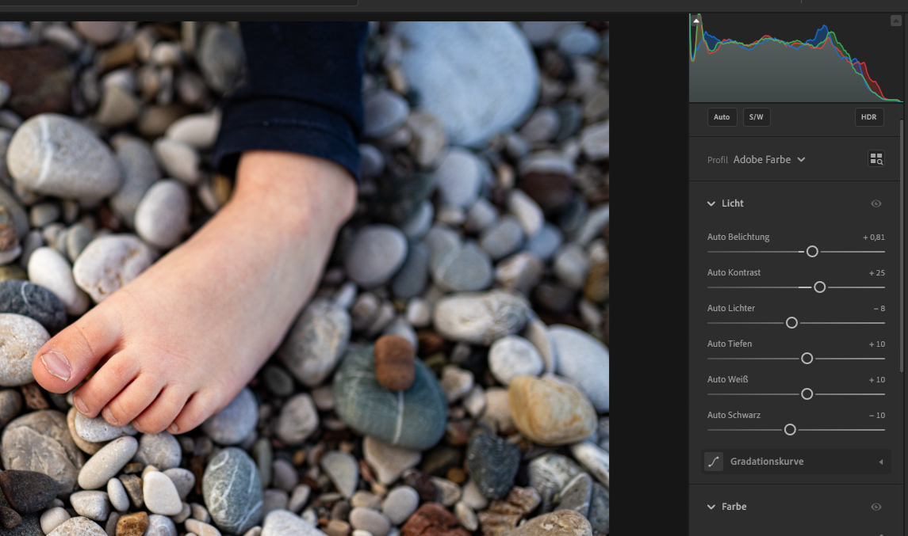

## Vorlesung Werkstofftechnik
Prof. Dr.-Ing.  Christian Willberg 

Kontakt: christian.willberg@h2.de

 
    <a href="https://leichtbau.dlr.de" style="color: blue;">Bildreferenz</a>

---

<!--paginate: true-->

---

# Prüfung

## Charakterisierung
## Sensoren
## Datenanalyse - Grundlagen

## Zerstörende Prüfung
## Zerstörungsfreie Prüfung

---

## Charakterisierung
Mathematische Modelle werden im Ingenieurswesen genutzt, um Vorhersagen über das Verhalten von Bauteilen und Strukturen zu machen. Die Bestimmung der für das Modell notwendingen Parameter nennt man Charakterisierung.

---

## Modelle

Was sind Modelle und wozu braucht man sie?

---

---

---

---

---

<iframe src="https://perilab-results.nimbus-extern.dlr.de/models/ForgedCT?step=65&variable=von%20Mises%20Stress&displFactor=20" width="920" height="600"></iframe>

---

---

## 

---

## Beispiele

- Bestimmung $E$ und $\nu$ in einem isotropen Material
- Verschiedene Wege skizzieren
- Probleme diskutieren

## Hinweis
- Es gibt Beziehungen zwischen dem Schubmodul $G$ und $E$ und $\nu$

---

# Messdatenerfassung
Typische Sensoren
- Dehnungssensoren
  - Dehnungsmessstreifen (DMS)
  - Fibre Bragg
  - Kamerasysteme
- Wegsensoren
  - Lasertriangulation
  - Maßband
  - Laufzeitmessung
- Kraftaufnehmer

---
## DMS
- Funktionsweise

- elektrischer Widerstand
$R=\rho\frac{l}{A} = \frac{U}{I}$
$\frac{\Delta R}{R}=k\varepsilon$
---

## Kompensation

- Temperaturkompensation
  - auf einem lastfreien Bauteil messen
  - Ausnutzen einer Brückenschaltung von DMS
- Normaldehnungskompensation
  - Ausnutzen einer Brückenschaltung von DMS

$\frac{U_m}{U_B}=\frac k4 (\varepsilon_1-\varepsilon_2+\varepsilon_3-\varepsilon_4)$

---

## Analog-Digital

- Analogssignale
- Digitale Signale
- A-D-Wandler

$dt<\frac{1}{2f_{max}}$

- wenn nicht eingehalten, dann kommt es zu Informationsverlusten

[Beispiel](https://www.youtube.com/watch?v=ByTsISFXUoY)

---

# Datenanalyse - Grundlagen

---

## Streuungen
- Messunsicherheiten
- Materialunsicherheiten
- Fertigungsunsicherheiten

Sonderfall
- Modellunsicherheiten -> werden nicht durch mehr Messungen kleiner

---

## Umgang mit Streuungen

_Mittelwert_
$sample_{mean}=\sum_{i=1}^{n}\frac{samples_i}{n}$

_Median_
50% der Werte liegen oberhalb und 50% unterhalb dieses Werts; Robuster gegen Ausreißer

_Standardabweichung_
Ist ein Maß für die Streuung der Daten
$s=\sqrt{\frac{1}{n-1}\sum_{i=1}^{n}(samples_i-sample_{mean})^2}$

_Korrelationskoeffizient_
Beschreibt wie gut zwischen Daten ein linearer Zusammenhang besteht (zwischen -1 und +1)

---

## Fitting
Methode der kleinsten Fehlerquadrate

$\text{min}||\mathbf{y}_m(\mathbf{x}) - \mathbf{y} ||$

um eine beliebige fitting Funktion zu bestimmen.

Wahl der Funktion:
Polynome - können bei hohen Polynograde zu Überschwingen führen
Splines, B-Splines - komplexer

---

## Fourier Transformation

- Jede Signal / Funktion kann in eine Summe aus Sinus Kurven zusammengesetzt werden
- Zeitfunktionen -> in Frequenzdarstellungen

---

## Filter
- Tiefpass
  - Signale unterhalb eine definierten Frequenz werden erlaubt
- Hochpass  
  - Signale oberhalb eine definierten Frequenz werden erlaubt 
- Bandpass
  - Signale zwischen zwei definierten Frequenzen werden erlaubt 
- Bandstopfilter
  - Signale außerhalb zweier definierten Frequenzen werden erlaubt 

---

---

## Übung

- Erstellen eines Datensatzes
- Plotten des Datensatzes
- Fitting
- Statistisch Bewertung von Daten
- Überschwingen von Signalen
- FFTs
- Gradientenbestimmung

---

# Zerstörende Prüfung

Bestimmte Kennwerte oder Aussagen über ein Material oder ein Bauteil können nur getroffen werden, wenn bis zum Versagen belastet wird.

---

## Exkurs Bruchmechanik

- Brüche lassen sich in diese Moden unterteilen
- Es gibt spezifische Energiefreisetzungraten

[Liste von Experimente zur Bestimmung dieser Energien](https://wiki.polymerservice-merseburg.de/index.php/Pr%C3%BCfk%C3%B6rper_f%C3%BCr_bruchmechanische_Pr%C3%BCfungen)

---

## Bestimmung der Zähigkeit

- Widerstand eines Werkstoffs gegen Bruch oder Rissausbreitung
- Fähigkeit zur Absorption von mechanischer Energie bei plastischer Verformung

$Z = \int_0^{\varepsilon_{B}}\sigma d \varepsilon$ 

- Energiefreisetzungrate $G = \frac{Z}{A_{Bruch}}$
- Einfluss der Belastungs-geschwindigkeit 

 
    <a href="https://doi.org/10.1007/s00466-021-02017-1" style="color: blue;">Bildreferenz</a>

---

## Zugversuch
- Bestimmung von 
  - elastischen Steifigkeiten
  - Festigkeiten
  - Streckgrenze
  - in einer Richtung

- es wird von konstaten Spannungen im Querschnitt ausgegangen
$\sigma = \frac{F}{A} = E\varepsilon = E\frac{\Delta l}{l}$
$F = \frac{\Delta l E A }{l}$

---

## Probengeometrie

[Video 1](https://eng.libretexts.org/Bookshelves/Materials_Science/TLP_Library_II/5%3A_Mechanical_Testing_of_Metals/5.5%3A_Tensile_Testing_-_Practical_Basics)

---

## Parameter Zug

Bruchdehnung
  - bleibende Verlängerung der Zugprobe nach Bruch

Bruchdehnung A11

Streckgrenze
  - Grenze bis zu der ein Werkstoff elastisch verformbar ist

technische Elastiztätsgrenze
  - $R_{0.2}$ bei Werkstoffen wo die Streckgrenze nicht ausgeprägt ist

E Modul
  - Proportialnalitätsfaktor zwischen Spannung und Dehnung

---

Gleichmaßdehnung
  - Probe dehnt sich gleichmäßig bis zur Maximalkraft

Brucheinschnürrung $Z=\frac{\Delta A}{A_0}$
  - ein Maß für die Duktilität eines Werkstoffs 

Einschnürdehnung
  - Probe dehnt sich nur noch in der Einschnürung

---

## Parameter Druck

Quetschgrenze
  - Oberhalb der Grenze setzt plastische Verformung ein (duktiles Material)
  - bei sprödem Material entstehen Risse und dann [Bruch](https://youtu.be/Fjgpvi8igbE?si=ptlpAR_vQfDV_qYW&t=36)

Stabilität 
  - Knicken
  - [Beulen](https://www.youtube.com/watch?v=ZYfLLozCNbw)
Verformungszonen einer gestauchten Probe (Abb3.16)

---

## Druckverformung

I - geringe Verformung (Reibbehinderung)
II - mäßige Zugverformung
III - hohe Schubverformung

---

## Anisotrope Messungen
Anisotropie
- Messungen unter verschiedenen Winkeln

Einflussgrößen
  - Schlupf bei der Einspannung
  - Temperatur
  - Geometrie
  - Probeneinspannung
---

## Biegeversuch

- in der Regel Flachproben mit einem Rechteckprofil 
- meist besser für sprödes Material
- Annahmen der Bernoulli Balkentheorie müssen gelten 
- eher für spröde Werkstoffe

$l>20*h$.

$F$ - Prüfkraft

$u$ - resultierende Verschiebung

$a$ - Höhe des rechteckigen Profils

$b$ - Breite des rechteckigen Profils

$l_b$ - Länge der Probe

---

## 2 Punkt Biegeversuch

$E=\frac{4l_b^2 F}{ubh^3}$

---

## 3 Punkt Biegeversuch

$E=\frac{l_b^3 F}{4ubh^3}$

---

## 4 Punkt Biegeversuch

Ziel ist ein querkraftfreier Bereich und daraus resultierend ein konstantes Biegemoment

$E=\frac{l_a^2(2l_a+3l_b) F}{ubh^3}$; 

$l_a$ Abstand zwischen Auflagepunkt und näher gelegenem Druckpunkt des Prüfstempels

---

## Spannungsverläufe

[Video](https://www.tec-science.com/wp-content/uploads/2021/03/de-animation-biegeversuch-spannungsverlauf-mit-verfestigung.mp4)

- Biegespannung 
  - $\sigma_b = \frac{M_b}{I_{xx}y}$
  - Spannungsnullinie

- ENF (End-Notched Flexure) Versuch nutzt die Spannungsnulllinie gezielt aus

---

## Dauerschwingversuch nach Wöhler
- Versuchsaufbau
  - Biegeversuch
  - Torsionsversuch
  - Zug-/Druckversuch

---

## Dauerschwingversuch nach Wöhler
Einflussgrößen
- Temperatur
- Korossive Medien
- Kerben
- Oberflächenbeschaffenheit
  - glatte Oberflächen sind günstiger
- Wärmebehandlung

---

## Strukturermüdungsversuch

[Video](https://youtu.be/BOpBzKanX9k?si=icWRiGPNs-8H9qXo)

Herausforderungen?

- repräsentative Lasten
- Erwärmung durch zu schnelle Belastung
- die Reihenfolge der Lasten beeinflusst die Lebensdauer

---

## Kerbschlagbiegeversuch

- Bestimmung der Kerbschlagenergie und  Kerbschlagzähigkeit $\frac{E}{A_{Nenn}}$
  - hat keine technische Bedeutung mehr
- Energie ist ausreichend für die Bestimmung der Werkstoffgüte
- Aufteilung in Hochlage (Verformugsbrüche, duktile), Tieflage (Trennbrüche, Sprödbruch) und Bereich des Steilabfalls (Mischbrüche)
- Kennwerte zur Bestimmung der Festigkeit nicht geeignet

[Versuch](https://youtu.be/mpUdV2WHiEE?si=5jwBppXbsEsnqHsc&t=86)

[Erklärvideo](https://www.youtube.com/watch?v=Ll69bzegoNY)

---

## Weitere Versuche

- Berstversuche
- Scherversuche
- Ausziehversuch
- Korrosionsversuche
- Brennproben

---

## Härteprüfung

- Probe oder Bauteil wird nicht vollständig zerstört
- Bedingt zerstörungsfreie Werkstoffprüfung
- am verbreitesten Rockwell (HR), Brinell, Vickers und Shore
- Härteeigschaften der Bauteiloberfläche beeinflussen die Ermüdung und den Verschleiß

---

## Rockwell

- die Eindringtiefe $t$ mit verschiedenen normierten Prüfkörpern vermessen
- Ablauf der Messung ist vorgeben

$\text{Rockwellh\"arte}=a-\frac{t}{d}$
- Skalen A, C, D; $a=100$, $d=0.002mm$
- Skalen B, E-H, K; $a=130$, $d=0.002mm$
- Skalen N, T; $a=100$, $d=0.001mm$

---

## Brinell

- mit einer Hartmetallkugel wird mit einer festgelegten Kraft auf die Oberfläche gedrückt

- wird ein mittlere Durchmesser bestimmt 

$\text{Brinellh\"arte}=\frac{0.204F}{\pi D \sqrt{D-\sqrt{D^2-d^2}}}$
mit $d=\frac{d_1+d_2}{2}$

---

## Vickers
- ähnlich zu Brinell, aber es wird statt einer Kugel eine gleichseitige Diamantpyramide verwendet
- kleinere Fläche nötig gegenüber Brinell

$\text{Vickersh\"arte}=\frac{0.204F\cos 22°}{d^2}$

mit $d=\frac{d_1+d_2}{2}$

---

# Zerstörungsfreie Prüfung

Ziele der zerstörungsfreien Prüfung (ZfP)

---
## Entwicklungsstufen

ZfP 1.0 – Werkzeuge (zur Schärfung der Sinne)
ZfP 2.0 – Analoge Systeme (zur Ansicht innerhalb der Komponenten)
ZfP 3.0 – Digitale Verarbeitung und Automatisierung
ZfP 4.0 – Transparenz von Informationen, technische & digitale Hilfsmittel und autonome und dezentralisierte Entscheidungen

---

## Verfahren
- jede messbare physikalische Größe kann im Prinzip genutzt werden 

  - mechanisch (außer Ultraschallprüfung)
  - optisch
  - elektromagnetisch
  - elektrisch
  - thermisch
  - magnetisch

---

## Ausarbeiten und Vorstellen

--- 

## Probabilty of Detection

- Metrik, welche die Wahrscheinlichkeit der Detektion eines Fehlers einer bestimmten Größe angibt

- Die zulässige Fehlergröße ist  bekannt
- mit einer Konfidenz von 95% angeben. D.h. zu 95% werden 90% der Fehler detektiert.

---

## Schadensgröße

- je nach Verfahren variiert die detektierbare Schadensgröße
- es gilt nicht immer _kleine Schadesgröße_ $=$ _besser_
- minimaler Schaden $l = \frac{\lambda}{2}$ -> Abstasttheorem
$c = \lambda f$
- $c$ ist die Licht- oder Schallgeschwindigkeit

$\lambda = \frac{c}{f} = \frac{6000 m/s}{10^6 1/s} = 6 mm$

---

## Sichtprüfung

- kann mit verschiedenen Werkzeugen stattfinden und ist sehr verbreitet
- direkte Sichtprüfung
  - Auge
  - Boroskope (Elastoskope, Endoskope, Spiegelrohre, ...)
- indirekte Sichtprüfung
  - Kameras
  - Drohnen

---

## Eindringprüfung

1. Reinigung, 2. Farbe auftragen und eindringen lassen, 3. Oberflächliches reinigen, 4. Entwickler auftragen

- bei Tageslicht oder im dunkeln 

---

## Durchstrahlungsprüfung

- Röntgen-, Mikrowellen-, Gammastrahlung 
- Synchrotronstrahlung (Spezialfälle, eher selten)

- auch als Computertomographie nutzbar

---

## Thermographie
**aktive**
- Bauteil ist warm und wird vermessen
- Unterschiede in der Temperaturverteilung können zur Identifikation von Fehlern genutzt werden
- Prozessanpassungen sind möglich

**passive**
- Bauteil wird angeregt und die Reaktion wird vermessen
- induktive Erwärmung bei Kohlefaserverbundbauteilen

---

## Modalanalyse

$\mathbf{M}\ddot{\mathbf{u}}+\mathbf{Ku}=\mathbf{0}$

- Eigenformen
- Eigenfrequenzen

$(\mathbf{K}-\omega^2\mathbf{M})\hat{\mathbf{x}}=\mathbf{0}$

**Federpendel**
$m\ddot{u}+cu=0$

$c-\omega^2 m = 0$

$\omega = 2\pi f = \sqrt{\frac{c}{m}}$

---

## Modalanalyse

- Anregung mit einem Shaker oder Impulshammer
- Messpunkte mit Beschleunigungssensor oder Laser
- Ein Anregungspunkt -> viele Messpunkte
- Viele Anregungspunkte -> ein Messpunkt

---

## Ultraschallprüfung

**Wellenarten**
Longtitudinalwellen (P Wellen)
Transversalwellen (S Wellen)
Love Wellen
Rayleighwellen
Lambwellen, bzw. geführte Ultraschallwellen
Symmetrische, unsymmetrische und Schubwellen
Torsionswellen
Schubwellen

---

---

## Symmetrische Moden (Longitudinalwellen)

<video controls="constrols" width="600" scr=".../assets/Videos/asym.avi">

---

## Anti-Symmetrische Moden (Transversalwellen)

<video controls="constrols" width="600" scr=".../assets/Videos/asym.avi">

---

## Schallgeschwindigkeiten
$c_{l}=\sqrt{\frac{E(1-\nu)}{\rho(1-\nu-\nu^2)}}$
$c_{t}= \sqrt{\frac{G}{\rho}}$

Geführte Ultraschallwellen sind dispersiv
sie haben eine Gruppen und Phasengeschwindigkeit

---

## Dispersion

- Gruppengeschwindigkeit - wie schnell bewegt sich die Hüllkurve 
- Phasengeschwindigkeit - wie schnell bewegt sich die Phase (einzelne Frequenz)

- für eine Frequenz sind Gruppen und Phasengeschwindigkeiten identisch

- Für frequenzabhänige Phasengeschwindigkeiten verbreitert sich die Hüllkurve -> Dispersion 

---

## Piezoelektrischer Effekt

- Aktuatoreffekt
- Sensoreffekt
- $d_{31}$; el. Spannung in 3 Richtung und Deformation in 1, bzw. 2 Richtung
- $d_{33}$; el. Spannung in 3 Richtung und Deformation in 3 Richtung

---

## Reflexionen an Grenzflächen
- Schallwiderstand $W = c_L\rho$

_Reflektierender Schall_
$\frac{p_{a,r}}{p_{a,e}}=\frac{W_2-W_1}{W_2+W_1}$

_Durchgehender Schall_
$\frac{p_{a,d}}{p_{a,e}}=\frac{2W_2}{W_2+W_1}$

---

## Rechenaufgabe

-> Wasser - Stahl
-> Luft - Stahl
-> Wasser - Aluminium
-> Luft - Aluminium
-> Wasser - PMMA
-> Luft - PMMA

---

## Signal - Rausch Verhältnis

$SNR = \frac{P_{Signal}}{P_{Rauschen}}$

- Mehrfachmessungen reduziert den Rauschanteil

---

## Messaufbau

- 1 - 2 Wandler
- Messverstärker
- Messaufnehmer

---

## Anbindung des Prüfkopfs an die Oberfläche

Wasser
- billig
- gut automatisierbar

Motoröl, Schmierfett
- bereits vorhanden im Bauteil
- nicht optimiert auf Prüfung

---

Glycerin, Gel
- Vorteilhaft ist die hohe Viskosität und die hohe akustische Impedanz
- raue Oberflächen und stark dämpfende Materialien (Schweißnahtprüfung)

Luft
- spart Koppelmedium
- viel Rauschen
---

## Impuls-Echo Verfahren

- Zone des "Todes"
  - Zeit für Wechsel von Sender zum Empfänger

- Doppelsensorsystem
  - Messung auf beiden Seiten
  - Zugänglichkeit und Aufwand

---

## Messbild

---

## Schweißnahtprüfung

- Schrägschallung aufgrund der schwierigen Ankopplung

## Klebschichten

- werden ähnlich geprüft
- es kann sogenannte "kissing bonds" geben

---

## Wanddickenmessung

---

## Bildgebung

- Messdaten können auf verschiedene Weise dargestellt werden

---

## A Bild (amplitude)

- Laufzeit vs. Amplitude
- bei konstanter Geschwindigkeit kann für einen Punkt eine Fehlstelle im Signal detektiert werden

---

## B Bild (brightness)

- Einzelpunkt ist nur eine andere Darstellung des A Bildes (Intensität des Echos wird durch Helligkeit dargestellt)
- Durch die Erfassung der Schallrichtung können 2D oder 3D Bilder erzeugt werden

---

## C Bild
- ein projiziertes Bild der Größen der Fehlstellen

---

## D Bild

- flächiger Scan

---

## Dickenmessung mittels Geführten Ultraschallwellen

---

# Structural Health Monitoring

- Überwachung einer Struktur während des Betriebs
- Verwand mit dem Condition Monitoring
  - bspw. Getriebeüberwachung -> Detektion von Lagerschäden

---

Ziele:
Wartungskosten senken
  - weniger Reparaturen
  - einfachere Prüfung
  - rechtzeitige Wartung
- Lastanpassung bei Schäden
- Lebensdauer verlängern
- Sicherheit erhöhen

---

Stufe 1

Ein System kann feststellen, dass ein Event passiert ist

Stufe 2

Ein System kann feststellen, dass ein Event passiert ist und wo es stattfand

Stufe 3

Ein System kann feststellen, dass ein Event passiert ist, wo es stattfand und was stattgefunden hat (Typ des Events)

Stufe 4

Ein System kann feststellen, dass ein Event passiert ist, wo es stattfand, was stattgefunden und wie schädlich dieses Event für die Struktur ist

---

## Verfahren

- Modalanalyse
- Geführte Ultraschallwellen
- Akkustische Emission
- Lastpfadanalysen
  - Beispiel Parallelfeder rechnen
- Dehnungmessung
- Modellbasierte Ansätze

---

## Technische Anwendungen

Brücken
- Second Penang Bridge - Penang, Malaysia
  

---
Pipelines

--- 

## Technische Anwendungen

Flugzeug
- Lastpfadanalyse
- Überwachung von Anbindungen
- Sicherheit ist nicht der Hauptfokus in der Luftfahrt

---

Windenergie

---

## Modalanalyse

$(\mathbf{K}-\omega^2\mathbf{M})\mathbf{\hat{x}}=0$

- Eigenfrequenz $\omega=2\pi f$
- Eigenformen $\mathbf{\hat{x}}$
  - [MAC](https://community.sw.siemens.com/s/article/modal-assurance-criterion-mac) Kriterium
  - Winkelberechnung zwischen Eigenformen

---

$MAC=\frac{|\mathbf{\hat{x}}_i\mathbf{\hat{x}}_{i, ref}|^2}{(\mathbf{\hat{x}}_i\mathbf{\hat{x}}_{i, ref})(\mathbf{\hat{x}}_i\mathbf{\hat{x}}_{i, ref})}$

---

## Geführte Ultraschallwellen

- Anregung über Piezokomposite
- Empfang mit Piiezokompositen oder Fibre Bragg Gittern

---

[Schadensinteraktion](.../assetsVideos/flachbodenbohrung.avi)

---

## Herausforderungen
- Temperatur
- Feuchte
- innere Struktur des Materials
- Modenkonversion
- Spannungen in der Struktur
- Alterung

---
## Potentiale
Beispiel Flugzeug
- BVI (barely visible impact)
- Größe ist durch Sichtbarkeit definiert
  - Leitwerk ist der Schaden größer als am Flügel

- SHM System erlauben kleinere Schäden bei der Auslegung

- Abgeschätzt der [1 - 5% ](https://elib.dlr.de/123946/1/1475921718813279.pdf) Strukturmasse könnte reduziert werden 

---

## Mikroskopie

- Analyse der Mikrostruktur von Werkstoffen
- Lokale Analyse der Werkstoff- oder Kornzusammensetzung
- Präparation der Probe (Schleifen, Oberflächenbehandlung, usw.)
- Lichquellen beeinflusssen maßgeblich den Kontrast
- Filter

---

## Lichtmikroskopie

- Korngrößenanalyse von Metallen und Legierungen 
- Flächenzählverfahren 
- Linienschnittverfahren (Korngrenzenschnitte mit durch den Prüfer in das Bild definierten Linienzug)

---

## Elektronenrastermikroskop
- nutzt Elektronenstrahlen zum Abtasten
- Auflösung hierdurch deutlich erhöht $1nm .. 2nm$
- ca. 500 mal bessere Vergrößerung als beim Lichmikroskop (2000:1) vs. (1000000)

---

## Rastersondenmikroskopie

- Abstasten der Struktur mit einer Nadel
- Wechselwirkung ist nicht mechanisch und unterscheidet sich je nach Mikroskop
  - Tunnelstrom
  - Van der Waals Kräfte (korreliert mit Federsteifigkeit)
  - magnetische Kräfte

---

