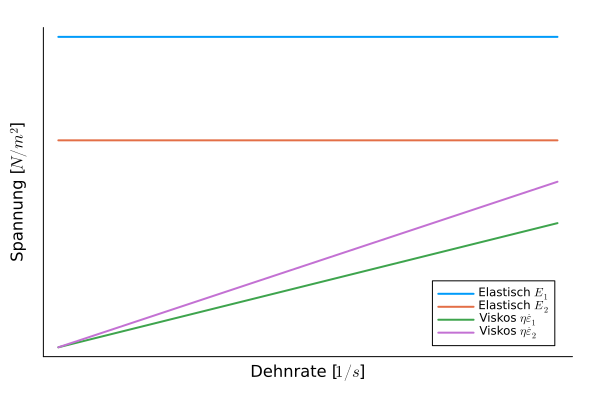

## Vorlesung Grundlagen Maschinenbau - Werkstofftechnik
Prof. Dr.-Ing.  Christian Willberg
Hochschule Magdeburg-Stendal

Kontakt: christian.willberg@h2.de
Teile des Skripts sind von \
Prof. Dr.-Ing. Jürgen Häberle übernommen

 
    <a href="https://doi.org/10.1007/s42102-021-00079-6" style="color: blue;">Bildreferenz</a>

---

<!--paginate: true-->

## Nützliche Links

<!-- zusammenarbeit; wir erarbeiten unsere eigene Dokumenation -->
[Skript](https://cwillberg.github.io/Werkstofftechnik/)
[Formelsammlung]( https://cwillberg.github.io/Werkstofftechnik/Formelsammlung)
TBD
[CoopSpace]()

---

## Vorlesung

**Rahmen**

- Essen oder Trinken sind okay, aber leise
- Probleme bei der Kinderbetreuung
- Alles verbleibt in Raum!
- Fragen

---

## Inhalte

- Werkstoffe
- Aufbau von Materialien
  - Atome und Bindungen
  - Feinstruktur
  - Mikrostruktur
- Gefüge von Werkstoffen
- Eigenschaften von Materialien
  - physikalische
  - nicht physikalische
- Zustandsdiagramme

---

## Werkstoffe

Was sind Werkstoffe?

[Werkstoffe im engeren Sinne nennt man Materialien im festen Aggregatzustand, aus denen Bauteile und Konstruktionen hergestellt werden können.](https://de.wikipedia.org/wiki/Werkstoff)

---
## Anwendunggebiete mit Bildern

- Metalle
  - Eisen Stahl
  - Nicht Eisen
- Kunststoffe
- Keramiken
- Verbundwerkstoffe

---

## Gußeisen - Stahl

---

## Nicht Eisen Metalle

- Kupfer ist ein sehr guter elektrischer und thermischer Leiter

---

- Magnesium findet im Leichtbau Anwendung 
- Titan und Titanlegierungen 
    - hohe Festigkeit und Warmfestigkeit
    - Korrosionsbeständig
- Nickel
    - Korrosionsbeständigkeit
    - hohe Warmfestigkeit

---

## Keramiken

.jpg)

---

## Gläser

---

## Faserverbundwerkstoffe

---

# Struktur von Werkstoffen

---

-	Atomistische Struktur (Art der atomaren Bausteine)
-	Feinstruktur (Bindungen zwischen den atomaren Bausteinen und deren geometrische An-ordnung)
-	Mikrostruktur (Gefüge – Bereiche geometrischer Anordnung, die im Werkstoffinnern durch Grenzflächen voneinander getrennt sind)
-	Makrostruktur (Grobstruktur – Gesamterscheinung eines Werkstoffes bei der Herstellung und dem Einsatz eines Bauteils)

---

# Bindungen

## Hauptvalenzbindungen  
**Primärbindungen - hohe Bindungsenergie, starke Bindung**
-	Ionen- bzw. heteropolare Bindung 
-	Atom- bzw. homöopolare (oder kovalente) Bindung: polar (O-H) und unpolar (C-C, C-H)
-	Metallische Bindung

---

## Metallische Bindung

- Außenelektronen (Valenzelektronen) sind nur schwach gebunden 
- es bildet sich ein Gitter (periodisch angeordneten) positiver geladener Metallionen (Atomrümpfen)
- Außenelektronen  können sich innerhalb des Gitters nahezu frei bewegen, sogennantes **Elektronengas** 
- bewirkt: gute elektrische Leitfähigkeit + hohe Wärmeleitfähigkeit

---

---
## Relevante Gößen

**Ordnungszahl**
Zahl der Protonen im Kern
**Atommasse**
bestimmt die Masse des Elements
 Masse des Werkstoffs ist eine Kombination aus Atommasse und Dichte
**Elektronegativiät**
bestimmt ob Atome abgegeben oder aufgenommen werden in einer Bindung
metallische Bindungen eher links
kovalente Bindungen eher rechts

---

## Neben- oder Restvalenzbindungen 
**Sekundärbindungen - geringe Bindungsenergie, schwache Bindung**
-	van der Waals-Bindung: zwischenmolekulare Kräfte
-	Wasserstoffbrückenbindung: zwei Moleküle oder zwei geeignet weit voneinander getrennte Abschnitte eines Makromoleküls treten über Wasserstoffatome in Wechselwirkung 
- die Bindungsenergien sind ein bis zwei Zehnerpotenzen kleiner als die der Atombindungen.

---

| **Bezeichnung** | **Ionenbindung oder heteropolare Bindung** | **Atombindung homöopolare (kovalente) Bindung** | **Metallische Bindung** |
|-----------------|---------------------------------|-------------------------------------------------|--------------------------|
| **Beteiligte Bausteine** | Ionen (Metall + Nichtmetall) | Gleiche Atomart (Nichtmetall + Nichtmetall) | Gleiche Atomart (Metall + Metall) |
| **Beschreibung des elektrischen Lade-zustandes** | Positiv geladenes Ion + negativ geladenes Ion (Kation + Anion) | Atome besitzen ein oder mehrere gemeinsame Elektronenpaare, um die Edelgaskonfiguration zu erreichen | Atome geben ihre Außenelektronen an den Gesamtverband ab. Elektronen bewegen sich dort frei im Atomgitter |
---

| **Bezeichnung** | **Ionenbindung oder heteropolare Bindung** | **Atombindung homöopolare (kovalente) Bindung** | **Metallische Bindung** |
|-----------------|---------------------------------|-------------------------------------------------|--------------------------|
| **Von den Bindungs-kräften abhängige Werkstoff-eigenschaften** | Im gelösten Zustand elektrisch leitfähig, kristalline Gefügestruktur | Geringe elektrische und thermische Leitfähigkeit; hoher Schmelzpunkt | Sehr gute elektrische und thermische Leitfähigkeit und Duktilität; eingeschränkte chemische Beständigkeit |
| **Beispiele** | Alkalimetallverbindungen, Halogenverbindungen (z.B. NaCl, MgO) | Diamant, Methan (CH₄) (unpolar), Methanol (CH₃OH) (polar) | Kupfer (Cu), Aluminium (Al), Eisen (Fe) |

---

## Atomistische Struktur

Besteht aus
- Kern (Protonen + Neutronen) der die Masse definiert
- Hülle (Elektronen) mit verschieden Schalen, welche chemischen und viele physikalische Eigeschaften definiert

---

---

### Feinstruktur
- Kristallstrukturen
- Molekülstrukturen
- Glasig-amorphe Strukturen
- Realstruktur

---
## Raumgitter

- entsteht durch die dreidimensional-periodische Verschiebung seiner Bausteine
- charakterisiert durch drei Raumachsen x, y und z liegenden Winkel α, β, γ die Abstände auf den Achsen das jeweilige Raumgitter
- a0, b0 und c0  (Gitterkonstanten) -> Einheitszelle

---

| Kristallsystem   | Gitterkonstanten      | Winkel        | Beispiele                                                 |
|------------------|-----------------------|------------------------------------|-----------------------------------------------------------|
| triklin          | a₀ ≠ b₀ ≠ c₀          | α ≠ β ≠ γ ≠ 90°                    | Silikat-Minerale                                           |
| monoklin         | a₀ ≠ b₀ ≠ c₀          | α = γ = 90°; β ≠ 90°               | Mo₂S₃; β-Pu                                                |
| (ortho)rhombisch | a₀ ≠ b₀ ≠ c₀          | α = β = γ = 90°                    | U, S, P, Ga, γ-Sn                                          |
| rhomboedrisch    | a₀ = b₀ = c₀          | α = β = γ ≠ 90°                    | As, Hg, Sb                                                 |
| hexagonal        | a₀ = b₀ ≠ c₀          | α = β = 90°; γ = 120°              | α-Ti, Mg, Zn                                               |
| tetragonal       | a₀ = b₀ ≠ c₀          | α = β = γ = 90°                    | B, CuTi₃, Sn (T > 13,5°)                                   |

---

## Häufigste Gitterformen bei Metallen

| Kristallsystem   | Gitterkonstanten      | Winkel        | Beispiele                                                 |
|------------------|-----------------------|------------------------------------|-----------------------------------------------------------|
| kubisch          | a₀ = b₀ = c₀          | α = β = γ = 90°                    | Cu, Al, Ni, Au, Ag; γ-Eisen (kfz); α-Eisen, V, Cr, W (krz); Mn, Po (kp) |

---

Kubisch flächenzentriert (kfz)

Kubisch raumzentriert (krz)

Hexagonal dichteste Packung (hpd)

---

## Einflüsse

-	Korrosion: Angriff aggressiver Medien erfolgt an bevorzugten Ebenen
-	Verformung: Plastische Verformung erfolgt entlang bevorzugter kristallografischer Ebenen und Richtungen → Gleitsysteme
-	Ultraschall: Verwendung von Schwingquarzen mit speziellen kristallografischen Begrenzungsflächen
-	Leitfähigkeit:	Verwendung von Germanium- oder Silizium-Wafern in (1 1 1)- oder (1 0 0) - Orientierung für Halbleiterelemente
-	Magnetisierung: leichteste Magnetisierung von Eisen-Silizium-Transformatorenblechen ent-lang der Würfelkante [1 0 0]

---

## Polymorphie bei Metallen

- Polymorphie: ist die Ausbildung von verschiedenen Gitterstrukturen in Abhängigkeit von der Temperatur
- die verschiedenen Gitterformen sind die allotropen Modifikationen 

(auch: Polymorphie des Kohlenstoffs: Gra-phit, Diamant,…).

---

## Bestimmung der Umwandlungspunkte

_Dilatometrie_
- Messung der Längenänderung aufgrund der Gitterumwandlung

_Thermische Analyse_
- Aufzeichnung des Temperaturverlaufs
- Gitterwandlungen (Phasenänderungen) brauchen Wärmeenergie oder geben sie ab
- Halte- bzw. Knickpunkte in den Erwärmungs- oder Abkühlungskurven.

- Haltepunkte: bei reinen Metallen

---

---

## Molekülstrukturen

- typisch für nichtmetallisch-organische Werkstoffe
  - natürliche Materialien: Holz, Kautschuk, Leder, Fasern usw.
  - synthetische Kunststoffe: PMMA, Epoxid, usw.

---

- entsteht durch Aufbaureaktionen von monomeren Grundbausteine zu Kettenmolekülen
- innerhalb der Ketten treten Atombindungen auf
- zwischen den Ketten existieren Nebenvalenzbindungen und Molekülverhakungen

---

## Aufbaureaktion (Polymerisation)

- Es müssen freie Bindungen in den Monomeren erzeugt werden
- die Monomere "brauchen" neue Partner, um wieder energetisches Minimum zu erreichen

---

## Kettenpolymerisationen

  - Aufspalten von C=C-Doppelbindungen im Monomer (katalytischer Prozess durch Druck, Temperatur, Katalysator)
  - Verbindung der aufgespaltenen Monomere zu Makromolekülen

---

## Stufenwachstumsreaktionen 

**Polykondensation**
- Abspaltung niedermolekulare (z.B. H2O) Reaktionsprodukte durch eine chemische Reaktion schafft frei Bindungen
- schrittweise Reaktion oder Unterbrechung führen zur Bildung von linearen, verzweigten oder vernetzten Polymeren (Thermoplaste, Elastomere oder Duromere)  

---

**Polyaddition**
- freie Bindungen entstehen durch Umlagerungen von Doppelbindungen zweier unterschiedlicher Monomermoleküle
- diese bilden dann Molekülketten

---

## Glasig-amorphe Strukturen

- Gläser sind ein nichtmetallisch-anorganisches, vorzugsweise silikatisches Schmelzprodukte
- nichtkristallinen, also amorphen Zustand
- bei Glas, wird die Schmelze zunächst unterkühlt und dann unterhalb der Transformations- temperatur Tg „eingefroren“. 

---

# Realstruktur von Kristallen
## Gitterbaudefekte

-	Nulldimensionale Fehlstellen (Punktdefekte): Leerstellen, Zwischengitteratom, Zwischengitter-Fremdatome, Substitutions-Fremdatom
-	Eindimensionale Fehlstellen (Liniendefekte): Versetzungen
-	Zweidimensionale Fehlstellen (Flächendefekte): Stapelfehler, Korngrenzen, Subkorn-grenzen, Phasengrenzen

---

## Nulldimensionale Fehlstellen

Was gibt es für mögliche Varianten?

- Zwischengitteratome
- Leerstellen
- Frenkeltyp (Autreten der gleichen Zahl Zwischen-gitteratome und Fehlstellen)
- Substitutions-Fremdatom
- Zwischengitter-Fremdatom 

---

## Fremdatome

Wie lassen sich Fremdatome nutzen?

-	[Dotierung](https://de.wikipedia.org/wiki/Dotierung) im Halbleiter
    - gezielte Manipulation der elektrischen Leitfähigkeit durch Einbringung zusätzlicher Atome
- Zwischengitter und Substitutionsfremdatom
    - Erhöhung der Festigkeit durch natürlichen "Rissstopp" oder lokal einfacheren Versatz und lokale Reduktion der Spannungen

---

## Versetzungen

[Versetzungen](https://de.wikipedia.org/wiki/Versetzung_(Materialwissenschaft)) enstehen
- beim Kristallwachstum
- aufgrund von Eigenspannungen
- durch plastische Verformungen

---

## Zweidimensionale Fehlstellen - Korngrenzen
- Korngrenzen
- Phasengrenzen
- Subkorngrenzen

[Skript](https://cwillberg.github.io/Werkstofftechnik/dev/Skript/svw/gitterbaudefekte/)

---

## Plastizität

Gut oder Schlecht

---

## Beispiele

**Hohe Plastizität**:

- Knete
- feuchter Ton
- Metalle und Metalllegierungen mit geeignetem Atomgitter:
  - glühender Stahl beim Schmieden
  - Kaltumformung von Blechen 

**Geringe Plastizität**:
  - Gummi
  - Keramik
  - Faserkunstoffverbunde (Epoxid-Glasfaser oder Epoxid-Kohlefaser)
   
---

## Plastizität - Einkristall

Die plastische Verformung eines Kristalls vollzieht sich  im Wesentlichen durch Abgleiten von Atomschichten entlang bestimmter kristallographischer Ebenen und Richtungen unter Einwirken von Schubspannungen.

- Gleitsystem besteht aus Gleitebene und Gleitrichtung
- kritische Schubspannung ($\tau_{Kr}\approx G/10$ - Abschätzung oder theoretische Schubfestigkeit)
- Realtität um Faktor ~100 niedriger durch Versetzungen
---

## Bild

  
---

## Plastische Verformung des polykristallinen Werkstoffs

- Mikro- und Makroplastizität
  - Plastische Verformung beginnt bei "ungünstigen" Orientierungen
- Korngrenzen
  - Barriere für Versetzungsbewegung
  - bei hohen Temperaturen können Korngrenzen gleiten (Kriechen)
  - gezielte Fertigung kann durch Korngrenzen Zähigkeit erhöhen
- Heterogenität
  - Mehrphasigkeit
  - inhomogene Verteilung der Spannungen und Verformungen
- Anisotropie

---

## Polykristall Plastizität
[Beispiel aus einer Simulation](https://www.youtube.com/watch?v=mWanREXKLO4)

---

## Streckgrenze

- $R_m$ - Zugfestigkeit
- $R_e$ - Streckgrenze
- Dehngrenze oder Elastizitätsgrenze $R_{p0,2}$
  - Belastung und dann Entlastung 0.2% Dehung verbleibt
- Dehngrenze wird als Ersatzstreckgrenze verwendet

---

## Streckgrenze

- obere Streckgrenze $R_{eH}$
- untere Streckgrenze $R_{eL}$
>gezackter Bereich: Lüdersbereich

[Beispielvideo](https://youtu.be/E80yUNniESU?si=pqGRAWamxFQedWqw&t=95)

---

## Plastizität - Umformen
- [Tiefziehen Prinzip](https://www.youtube.com/watch?v=Zbfld_851z0)
- [Tiefziehen Real](https://www.youtube.com/watch?v=rHfepOqPVHI)

---

## Werkstoffeigenschaften

Was sind Werkstoffeigenschaften?

<!DOCTYPE html>
<html lang="en">
  <body>
    <pre align="center" class="mermaid">
    %%{init: {'theme': 'forest'}}%%
    mindmap
      root((Eigenschaften))
        Physikalisch
          Mechanisch
          Elektrisch
          Thermisch
          ...
        Chemisch
            Löslichkeit
            Elektronegativität
            ...
        Biologisch / Physiologisch
            Umweltwirkung
            Verwitterbarkeit
            Toxidität
            ...
        Sozial / Gesellschaftlich
            Wert
            Akzeptanz
            Arbeitsbedingungen
            Herkunft
            ...
    </pre>
    
  </body>
</html>

<!DOCTYPE html>

---

## Materialpatenschaft

Welche Werkstoffe fallen euch ein?

- Materialien beschreiben und Eigenschaften dokumentieren
  - kontinuierlich über das Semester mit den verschiedenen Themen
  - Vorstellung Ende des Semesters
- Online mit QR Code für die Materialbibliothek bereitstellen
- Warum?
  - Auswahl des passenden Werkstoffs

---

## Symmetrien
- isotropie
- transversale isotropie
- orthotropie
- ...
- anisotropie

<!---
- Diskussion; Eigenschaften können richtungsabhängig sein
- Praxisbeispiele
-->

---

## Mechanische Eigenschaften

- die **reversible** Verformung, bei der sofort bzw. eine bestimmte Zeit nach dem Einwirken der äußeren Belastung der verformte Werkstoff seine ursprüngliche Form zurückerhält: elastische und viskoelastische Verformung;

- die **irreversible (bleibende)** Verformung, bei der die Formänderung auch nach dem Einwirken der äußeren Belastung erhalten bleibt: plastische und viskose Verformung;

- der Bruch, d.h. eine durch Entstehen und Ausbreiten von Rissen bewirkte Trennung des Werkstoffes.

---

## Simulationsbeispiel

<iframe src="https://perilab-results.nimbus-extern.dlr.de/models/DCB?step=65&variable=Damage&displFactor=400" width="1150" height="600"></iframe>

---

## Elastizität
- reversibel, energieerhaltend
- Hooksches Gesetz 1D
Normalspannung $\sigma = E\varepsilon$
Schubspannung $\tau = G\gamma$

---

## Grundlagen

- Normaldehnung [-]
$\varepsilon_{mechanisch} = \frac{l - l_0}{l_0}$

- Normalspannung $\left[\frac{N}{m^2}\right]$, $[Pa]$
$\sigma = \frac{F}{A}=E\varepsilon$
E - Elastizitätsmodul, Young's modulus $\left[\frac{N}{m^2}\right]$\
\
\
\
\
.

 
    

---

## Grundlagen

- Schubdehnungen [-]
$\varepsilon = \frac12(\frac{u_x}{l_0}+\frac{u_y}{b_0})=\frac{\gamma}{2}$

- Schubspannung $\left[\frac{N}{m^2}\right]$, $[Pa]$
$\tau = \frac{F_s}{A}= G\gamma$

- Normal- und Schubspannungen sind nicht kompatibel; daher die Vergleichsspannungen -> Technische Mechnanik

- G - Schub-, Gleitmodul, Shear modulus $\left[\frac{N}{m^2}\right]$

---

## Grundlagen

- Querkontraktionszahl [-]
- $\nu = -\frac{\varepsilon_y}{\varepsilon_x}$
für homogene Werkstoffe $0\leq\nu\leq 0.5$
für heterogene Werkstoffe sind anderen Konstellationen denkbar

- [Kompressionsmodul](https://de.wikipedia.org/wiki/Kompressionsmodul#Umrechnung_zwischen_den_elastischen_Konstanten_isotroper_Festk%C3%B6rper) $K = \frac{E}{3(1-2\nu)}$
- [Schubmodul](https://de.wikipedia.org/wiki/Kompressionsmodul#Umrechnung_zwischen_den_elastischen_Konstanten_isotroper_Festk%C3%B6rper) $K = \frac{E}{2(1+\nu)}$

---

## Werkstoffbeispiele

| Werkstoff                         | E [GPa]   | G [GPa] | $\nu [-]$     |
|:----------------------------------|:----------|:--------|:----------|
| Stahl unlegiert                   | 200       | 77      | 0.30      |
| Titan                             | 110       | 40      | 0.36      |
| Kupfer                            | 120       | 45      | 0.35      |
| Aluminium                         | 70        | 26      | 0.34      |
| Magnesium                         | 45        | 17      | 0.27      |
| Wolfram                           | 360       | 130     | 0.35      |
| Gusseisen mit lamellarem Graphit  | 120       | 60      | 0.25      |
| Messing                           | 100       | 35      | 0.35      |
| Thermoplaste/Duromere             | 2 … 5     | 1 … 2   | ~0.35   |
| Elastomere                        | 0.1       | 0.03    | 0.45 - 0.49|
| Sperrholz                         | 4 … 16    | -       | -         |
| Beton                             | 40 … 45   | -       | -         |

---

## Steifigkeiten

Wie Materialeigenschaften den Steifigkeiten zusammen?

- Material $\cdot$ Querschnitte = Steifigkeit
- Dehn-, Normalsteifigkeit = $EA$
- Biegesteifigkeit = $EI$
- Torsionssteifigkeit = $GI_P$

 
    <a href="https://doi.org/10.3390/en14092451" style="color: blue;">Bildreferenz</a>

---

## 
<!---

* 1. und 2. Eigenfrequenz ->  https://doi.org/10.3390/en14092451
* Verformung in Schlag- und Schwenkrichtung sind aber identisch
* Turmschlag ist relevant
* dynamische Stabilität
* -->

 
    <a href="https://doi.org/10.3390/en14092451" style="color: blue;">Bildreferenz</a>

---

## Eigenfrequenzen / Resonanzen / Stabilität

- $f_{eigen}=\frac{\omega_{eigen}}{2\pi}=\frac{1}{2\pi}\sqrt{\frac{c}{m}}$ mit $c$ bspw. $EA$

[Tacoma Narrows Bridge](https://youtu.be/j-zczJXSxnw?t=10)

- Knick Stab
- Beulen

---

## Festigkeit

[Die Festigkeit eines Werkstoffes beschreibt die Beanspruchbarkeit durch mechanische Belastungen, bevor es zu einem Versagen kommt, und wird angegeben als mechanische Spannung $\left[N/m^2\right]$. Das Versagen kann eine **unzulässige Verformung** sein, insbesondere eine **plastische (bleibende) Verformung** oder auch ein **Bruch**.](https://de.wikipedia.org/wiki/Festigkeit)

>Wichtig: Festigkeit $\neq$ Steifigkeit

---

## Plastische Versagen 

 
    <a href="https://commons.wikimedia.org/w/index.php?curid=89891144" style="color: blue;">By Nicoguaro - Own work, CC BY 4.0</a>

---

## Viskoses Verhalten

- reversibel
- zeitabhängig

Federmodel $\sigma = E\epsilon$ 
 - Elastischer Anteil
 - Dargestellt durch Federlemente

 
    

 
    

Dämpfer  $\sigma = \eta\dot{\epsilon}=\eta\frac{\partial \epsilon}{\partial t}$ 
- Viskoser Anteil
- Dargestellt durch Dämpferelemente

---

## 

---

## 

---

## Exkurs: Modellierung von Werkstoffen
- Rheologische Modelle
- setzen sich aus vielen Federn, Dämpfern und anderen Elementen zusammen
- diese Freiheitsgrade ($E_i$, $\eta_i$) werden dann gefittet

---

## Wiederholung Kristalle und Gitter

---

## Kristalle - Kritallgitter

- Stoffe die sich in einer Kristallstruktur anordnen
- Periodische Wiederholung der "Basis"
- Die Basis kann beliebig groß sein
- Elementarzellen enthält alle Informationen
zur Beschreibung des Kristalls
- alle Metalle bilden in der Regel Kristalle 

 
    

 
    

---

## "Faule" Physik
- alles strebt nach engergetisch "stabilen" Zuständen

 
    

- [Einheitszelle](https://cwillberg.github.io/Werkstofftechnik/dev/Skript/svw/kristalle/)

 
    

Recherchiert wichtige Parameter der Einheitszelle?

- a$_0$, b$_0$, c$_0$ - Gitterkonstanten - Abstand der Atome
- $\alpha$, $\beta$, $\gamma$ - Achswinkel - Winkel der Elementarzellen
- 14 mögliche [Bravais Gitter](https://de.wikipedia.org/wiki/Bravais-Gitter) in 3D
- [Zahl der Atome](https://cwillberg.github.io/Werkstofftechnik/dev/Skript/svw/kristalle/)
- [Koordinationszahl](https://cwillberg.github.io/Werkstofftechnik/dev/Skript/svw/kristalle/)
- [Packungsdichte](https://cwillberg.github.io/Werkstofftechnik/dev/Skript/svw/kristalle/)

---

## Einfluss des Raumgitters

-	Korrosion: Angriff aggressiver Medien erfolgt an bevorzugten Ebenen
-	Verformung: Plastische Verformung erfolgt entlang bevorzugter kristallografischer Ebenen und Richtungen → Gleitsysteme
-	Ultraschall: Verwendung von Schwingquarzen mit speziellen kristallografischen Begrenzungsflächen
-	Leitfähigkeit:	Verwendung von Germanium- oder Silizium-Wafern in (1 1 1)- oder (1 0 0) - Orientierung für Halbleiterelemente
-	Magnetisierung: leichteste Magnetisierung von Eisen-Silizium-Transformatorenblechen entlang der Würfelkante [1 0 0]

---

## Gitterbaudefekte

-	Nulldimensionale Fehlstellen (Punktdefekte): Leerstellen, Zwischengitteratom, Zwischengitter-Fremdatome, Substitutions-Fremdatom
-	Eindimensionale Fehlstellen (Liniendefekte): Versetzungen
-	Zweidimensionale Fehlstellen (Flächendefekte): Stapelfehler, Korngrenzen, Subkorn-grenzen, Phasengrenzen

---

## Nulldimensionale Fehlstellen

Was gibt es für mögliche Varianten?

- Zwischengitteratome
- Leerstellen
- Frenkeltyp (Autreten der gleichen Zahl Zwischen-gitteratome und Fehlstellen)
- Substitutions-Fremdatom
- Zwischengitter-Fremdatom 

---

## Fremdatome

Wie lassen sich Fremdatome nutzen?

-	[Dotierung](https://de.wikipedia.org/wiki/Dotierung) im Halbleiter
    - gezielte Manipulation der elektrischen Leitfähigkeit durch Einbringung zusätzlicher Atome
- Zwischengitter und Substitutionsfremdatom
    - Erhöhung der Festigkeit durch natürlichen "Rissstopp" oder lokal einfacheren Versatz und lokale Reduktion der Spannungen

---

## Versetzungen

[Versetzungen](https://de.wikipedia.org/wiki/Versetzung_(Materialwissenschaft)) enstehen
- beim Kristallwachstum
- aufgrund von Eigenspannungen
- durch plastische Verformungen

---

## Zweidimensionale Fehlstellen - Korngrenzen
- Korngrenzen
- Phasengrenzen
- Subkorngrenzen

[Skript](https://cwillberg.github.io/Werkstofftechnik/dev/Skript/svw/gitterbaudefekte/)

---

## Plastizität

Gut oder Schlecht

---

## Beispiele

**Hohe Plastizität**:

- Knete
- feuchter Ton
- Metalle und Metalllegierungen mit geeignetem Atomgitter:
  - glühender Stahl beim Schmieden
  - Kaltumformung von Blechen 

**Geringe Plastizität**:
  - Gummi
  - Keramik
  - Faserkunstoffverbunde (Epoxid-Glasfaser oder Epoxid-Kohlefaser)
   
---

## Plastizität - Einkristall

Die plastische Verformung eines Kristalls vollzieht sich  im Wesentlichen durch Abgleiten von Atomschichten entlang bestimmter kristallographischer Ebenen und Richtungen unter Einwirken von Schubspannungen.

- Gleitsystem besteht aus Gleitebene und Gleitrichtung
- kritische Schubspannung ($\tau_{Kr}\approx G/10$ - Abschätzung oder theoretische Schubfestigkeit)
- Realtität um Faktor ~100 niedriger durch Versetzungen
---

## Bild

  
---

## Plastische Verformung des polykristallinen Werkstoffs

- Mikro- und Makroplastizität
  - Plastische Verformung beginnt bei "ungünstigen" Orientierungen
- Korngrenzen
  - Barriere für Versetzungsbewegung
  - bei hohen Temperaturen können Korngrenzen gleiten (Kriechen)
  - gezielte Fertigung kann durch Korngrenzen Zähigkeit erhöhen
- Heterogenität
  - Mehrphasigkeit
  - inhomogene Verteilung der Spannungen und Verformungen
- Anisotropie

---

## Polykristall Plastizität
[Beispiel aus einer Simulation](https://www.youtube.com/watch?v=mWanREXKLO4)

---

## Streckgrenze

- $R_m$ - Zugfestigkeit
- $R_e$ - Streckgrenze
- Dehngrenze oder Elastizitätsgrenze $R_{p0,2}$
  - Belastung und dann Entlastung 0.2% Dehung verbleibt
- Dehngrenze wird als Ersatzstreckgrenze verwendet

---

## Streckgrenze

- obere Streckgrenze $R_{eH}$
- untere Streckgrenze $R_{eL}$
>gezackter Bereich: Lüdersbereich

[Beispielvideo](https://youtu.be/E80yUNniESU?si=pqGRAWamxFQedWqw&t=95)

---

## Plastizität - Umformen
- [Tiefziehen Prinzip](https://www.youtube.com/watch?v=Zbfld_851z0)
- [Tiefziehen Real](https://www.youtube.com/watch?v=rHfepOqPVHI)

---

## Referencen

Rainer Schwab: Werkstoffkunde und Werkstoffprüfung für Dummies, 2019; ISBN-10 352771538X

