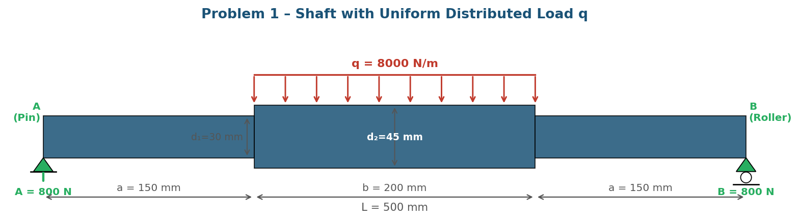
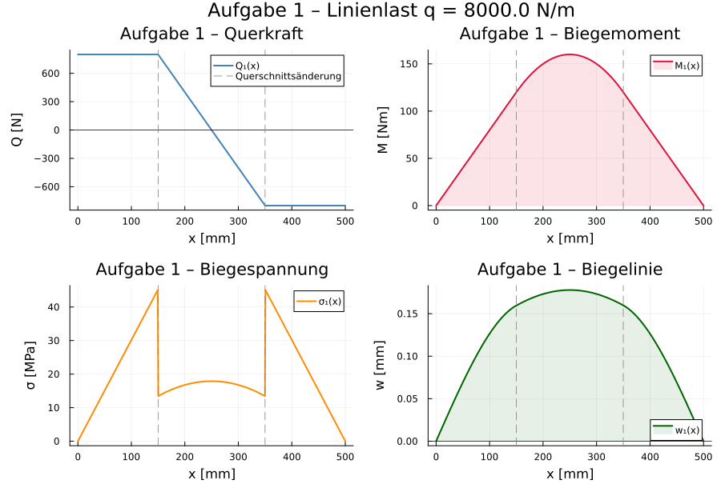
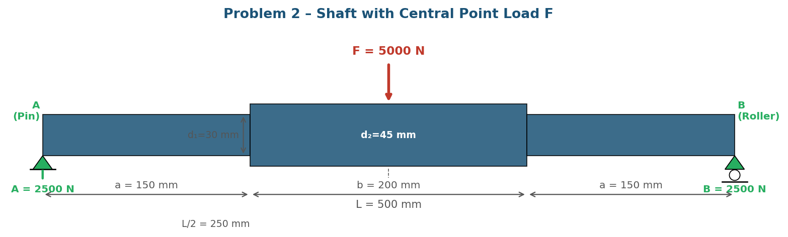
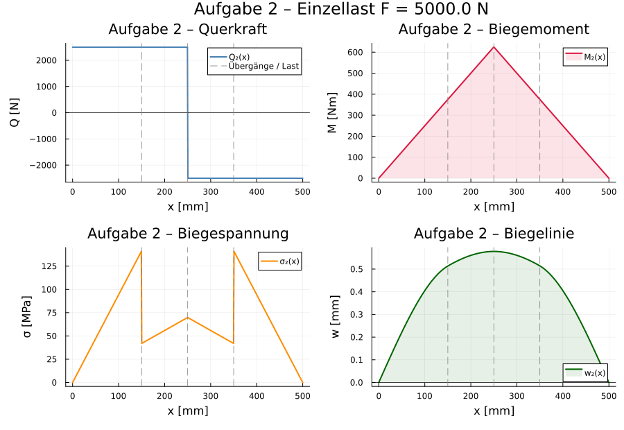

# Seminar Mechanics – Shaft Bending

Prof. Dr.-Ing. Christian Willberg

Contact: christian.willberg@h2.de

 

---
<!--paginate: true-->

# Overview – Key Formulae

| Quantity | Formula | Meaning |
|---|---|---|
| Second moment of area | $I = \dfrac{\pi d^4}{64}$ | Circular cross-section |
| Section modulus | $W = \dfrac{\pi d^3}{32}$ | Circular cross-section |
| Bending stress | $\sigma_b = \dfrac{M_b}{W}$ | Max. outer fibre stress |
| Deflection (point load, centre) | $w_{\max} = \dfrac{F\,L^3}{48\,E\,I}$ | Midspan (uniform shaft) |
| Deflection (distributed load) | $w_{\max} = \dfrac{5\,q\,L^4}{384\,E\,I}$ | Midspan (uniform shaft) |
| Reaction forces (symm.) | $A = B = \dfrac{F}{2}$ or $\dfrac{q\,L}{2}$ | Equilibrium |

Both problems: stepped steel shaft, $E = 210\,\text{GPa}$, pin–roller support, symmetric loading.
Parameters: $a = 150\,\text{mm}$,  $b = 200\,\text{mm}$,  $d_1 = 30\,\text{mm}$ (outer),  $d_2 = 45\,\text{mm}$ (middle).

---

# Problem 1 – Shaft with Distributed Load

**Problem 1:** A stepped steel shaft (pin–roller) carries a uniform distributed load $q = 8{,}000\,\text{N/m}$ acting only on the middle section ($b = 200\,\text{mm}$).

- **Outer sections** ($d_1 = 30\,\text{mm}$): $I_1 = 39.76\,\text{mm}^4$,  $W_1 = 2.651\,\text{mm}^3$
- **Middle section** ($d_2 = 45\,\text{mm}$): $I_2 = 201.3\,\text{mm}^4$,  $W_2 = 8.946\,\text{mm}^3$

**(a)** Determine the support reactions from equilibrium.

**(b)** Derive $Q(x)$ and $M_b(x)$ by the method of sections.

**(c)** Calculate the bending stress at all critical cross-sections. Which is governing?

**(d)** Determine the maximum deflection (numerical integration of Euler–Bernoulli).

---

# Problem 1 – System Sketch

$q$ acts only on $[a,\, a+b]$. The outer sections transfer shear only — check bending stress at the section boundary $x = a$ (smaller $W_1$!) as well as at midspan.

---

# Solution – Problem 1a & 1b

**(a) Equilibrium** (symmetric loading):

$$\sum F_y = 0:\quad A + B = q \cdot b = 8{,}000 \cdot 0.20 = 1{,}600\,\text{N}$$
$$\Rightarrow\quad A = B = \mathbf{800\,\text{N}}$$

$$\sum M_A = 0:\quad B \cdot L - q \cdot b \cdot \!\left(a + \tfrac{b}{2}\right) = 800 \cdot 0.5 - 1{,}600 \cdot 0.25 = 0\quad\checkmark$$

**(b) Method of sections — $Q(x)$ and $M_b(x)$:**

| Region | $Q(x)$ | $M_b(x)$ |
|---|---|---|
| $0 \leq x < a$ | $+800\,\text{N}$ | $800\,x$ |
| $a \leq x \leq a+b$ | $800 - 8{,}000\,(x-a)$ | $800\,x - 4{,}000\,(x-a)^2$ |
| $a+b < x \leq L$ | $-800\,\text{N}$ | $800\,(L-x)$ |

$$M_{b,\max} = M_b(L/2) = 800\cdot0.25 - 4{,}000\cdot0.1^2 = 200 - 40 = \mathbf{160\,\text{Nm}}$$

---

---

# Solution – Problem 1c & 1d

**(c) Bending stress** — check both critical locations:

At $x = a = 150\,\text{mm}$ (section boundary, $M_b = 800\cdot0.15 = 120\,\text{Nm}$, outer $d_1$):
$$\sigma_{b,1} = \frac{120\,\text{Nm}}{2.651\times10^{-6}\,\text{m}^3} = \mathbf{45.3\,\text{MPa}}$$

At $x = L/2 = 250\,\text{mm}$ ($M_{b,\max} = 160\,\text{Nm}$, middle $d_2$):
$$\sigma_{b,2} = \frac{160\,\text{Nm}}{8.946\times10^{-6}\,\text{m}^3} = \mathbf{17.9\,\text{MPa}}$$

⚠️ **Governing: outer section** at $x = a$ — smaller $W_1$ outweighs the lower moment.

**(d) Maximum deflection** (numerical integration, $w'' = -M_b(x)\,/\,EI(x)$):

$$\boxed{w_{\max} \approx \mathbf{0.178\,\text{mm}} \quad \text{at } x = L/2 = 250\,\text{mm}}$$

---

# Problem 2 – Shaft with Central Point Load

**Problem 2:** The same stepped shaft carries a single point force $F = 5{,}000\,\text{N}$ at midspan $x = L/2 = 250\,\text{mm}$ (centre of the middle section).

- **Outer sections** ($d_1 = 30\,\text{mm}$): $W_1 = 2.651\,\text{mm}^3$
- **Middle section** ($d_2 = 45\,\text{mm}$): $W_2 = 8.946\,\text{mm}^3$

**(a)** Determine the support reactions.

**(b)** Derive $Q(x)$ and $M_b(x)$.

**(c)** Calculate the bending stress at all critical cross-sections. Which is governing?

**(d)** Determine the maximum deflection (numerical integration).

---

# Problem 2 – System Sketch

The bending moment diagram is piecewise linear. $M_b$ is largest at $x = L/2$, but the outer section at $x = a$ carries a significant moment with a much smaller section modulus $W_1$ — always check both!

---

# Solution – Problem 2a & 2b

**(a) Equilibrium:**

$$\sum F_y = 0:\quad A + B = F = 5{,}000\,\text{N} \quad\Rightarrow\quad A = B = \mathbf{2{,}500\,\text{N}}$$

$$\sum M_A = 0:\quad B \cdot L - F \cdot \tfrac{L}{2} = 2{,}500\cdot0.5 - 5{,}000\cdot0.25 = 0\quad\checkmark$$

**(b) Method of sections:**

$$0 \leq x < \tfrac{L}{2}:\quad Q(x) = +2{,}500\,\text{N}, \qquad M_b(x) = 2{,}500\cdot x$$

$$\tfrac{L}{2} < x \leq L:\quad Q(x) = -2{,}500\,\text{N}, \qquad M_b(x) = 2{,}500\cdot(L-x)$$

$$M_{b,\max} = 2{,}500 \cdot 0.25 = \mathbf{625\,\text{Nm}} \quad\text{at } x = 250\,\text{mm}$$

At the section boundary $x = a = 150\,\text{mm}$:
$$M_b(a) = 2{,}500 \cdot 0.15 = \mathbf{375\,\text{Nm}}$$

---

# Solution – Problem 2c & 2d

**(c) Bending stress:**

At $x = a = 150\,\text{mm}$ ($M_b = 375\,\text{Nm}$, outer section $d_1$):
$$\sigma_{b,1} = \frac{375\,\text{Nm}}{2.651\times10^{-6}\,\text{m}^3} = \mathbf{141.5\,\text{MPa}}$$

At $x = L/2 = 250\,\text{mm}$ ($M_b = 625\,\text{Nm}$, middle section $d_2$):
$$\sigma_{b,2} = \frac{625\,\text{Nm}}{8.946\times10^{-6}\,\text{m}^3} = \mathbf{69.9\,\text{MPa}}$$

⚠️ **Governing: outer section** at $x = a$ — stress is **2.0×** higher than at the load point, even though the moment is 40% lower. The small diameter $d_1$ dominates.

**(d) Maximum deflection** (numerical integration):

$$\boxed{w_{\max} \approx \mathbf{0.578\,\text{mm}} \quad \text{at } x = L/2 = 250\,\text{mm}}$$

---

---

# Comparison & Key Insights

| Feature | Problem 1 (Dist. load) | Problem 2 (Point load) |
|---|---|---|
| Total load | $q \cdot b = 1{,}600\,\text{N}$ | $F = 5{,}000\,\text{N}$ |
| $M_{b,\max}$ | $160\,\text{Nm}$ at $x=250\,\text{mm}$ | $625\,\text{Nm}$ at $x=250\,\text{mm}$ |
| Governing location | $x = a = 150\,\text{mm}$ (outer $d_1$) | $x = a = 150\,\text{mm}$ (outer $d_1$) |
| $\sigma_{b,\max}$ | $45.3\,\text{MPa}$ | $141.5\,\text{MPa}$ |
| $w_{\max}$ | $0.178\,\text{mm}$ | $0.578\,\text{mm}$ |

**Key insight:** The governing cross-section is NOT where $M_b$ is maximum — it is where $M_b / W$ is maximum. For a stepped shaft, always evaluate $\sigma_b$ at every section boundary, especially where the diameter decreases.

---

# Summary – Procedure for Stepped Shaft Bending

**Step-by-step:**

1. **System sketch** — supports, loads, sections
2. **Equilibrium** → reactions $A$, $B$
3. **Method of sections** → $Q(x)$, $M_b(x)$
4. **Find $M_{b,\max}$** → where $Q(x) = 0$
5. **Section properties** → $I$, $W$ per section
6. **Stress check at every boundary** → $\sigma_b = M_b / W$
7. **Deflection** → table formula (uniform) or numerical integration (stepped)

$$I = \frac{\pi d^4}{64} \qquad W = \frac{\pi d^3}{32}$$

$$\sigma_{b} = \frac{M_b}{W} \quad \longrightarrow \quad \text{check ALL boundaries}$$

For stepped shafts the deflection formula $w = FL^3/(48EI)$ is a rough estimate only. Use piecewise integration of $w'' = -M_b(x)/EI(x)$ for accurate results.

