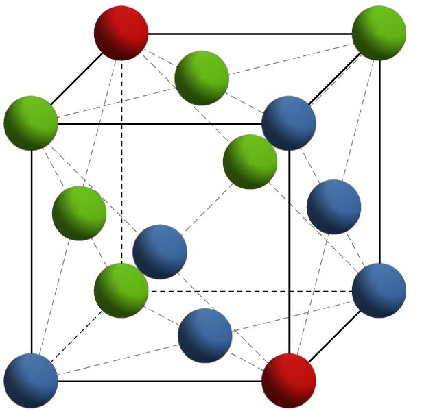
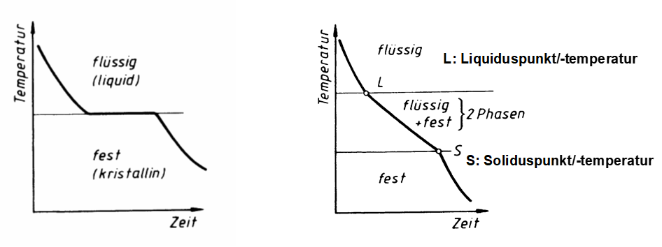
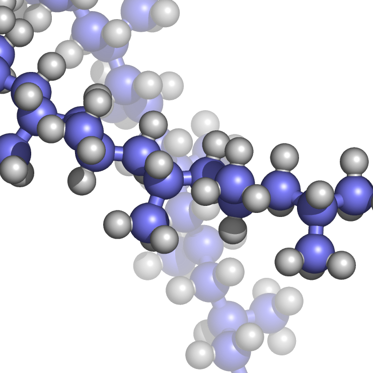
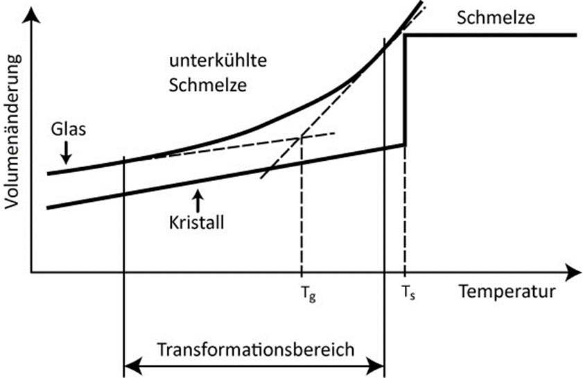

## Vorlesung Werkstofftechnik - Vorlesung Reale Strukturen und Eigenschaften
Prof. Dr.-Ing.  Christian Willberg 

Kontakt: christian.willberg@h2.de
Teile des Skripts sind von \
Prof. Dr.-Ing. Jürgen Häberle übernommen

---

## Inhalte
- Kristallstrukturen identifizieren und charakterisieren
- Molekülstrukturen und deren Aufbau verstehen
- Realstrukturen von Kristallen mit ihren Defekten beschreiben
- Zusammenhänge zwischen Struktur und mechanischen Eigenschaften erklären
- Plastische Verformungsmechanismen

---

<!--paginate: true-->

## Warum ist die Feinstruktur wichtig?

**Struktur bestimmt Eigenschaften**

- Mechanische Eigenschaften (Festigkeit, Duktilität)
- Elektrische Leitfähigkeit
- Thermisches Verhalten
- Optische Eigenschaften
- Chemische Beständigkeit

---

## Raumgitter

- entsteht durch die dreidimensional-periodische Verschiebung seiner Bausteine
- charakterisiert durch drei Raumachsen x, y und z liegenden Winkel α, β, γ die Abstände auf den Achsen das jeweilige Raumgitter
- a$_0$, b$_0$ und c$_0$  (Gitterkonstanten) -> Einheitszelle

---

| Kristallsystem   | Gitterkonstanten      | Winkel        | Beispiele                                                 |
|------------------|-----------------------|------------------------------------|-----------------------------------------------------------|
| triklin          | a₀ ≠ b₀ ≠ c₀          | α ≠ β ≠ γ ≠ 90°                    | Silikat-Minerale                                           |
| monoklin         | a₀ ≠ b₀ ≠ c₀          | α = γ = 90°; β ≠ 90°               | Mo₂S₃; β-Pu                                                |
| (ortho)rhombisch | a₀ ≠ b₀ ≠ c₀          | α = β = γ = 90°                    | U, S, P, Ga, γ-Sn                                          |
| rhomboedrisch    | a₀ = b₀ = c₀          | α = β = γ ≠ 90°                    | As, Hg, Sb                                                 |
| hexagonal        | a₀ = b₀ ≠ c₀          | α = β = 90°; γ = 120°              | α-Ti, Mg, Zn                                               |
| tetragonal       | a₀ = b₀ ≠ c₀          | α = β = γ = 90°                    | B, CuTi₃, Sn (T > 13,5°)                                   |

---

## Häufigste Gitterformen bei Metallen

| Kristallsystem   | Gitterkonstanten      | Winkel        | Beispiele                                                 |
|------------------|-----------------------|------------------------------------|-----------------------------------------------------------|
| kubisch          | a₀ = b₀ = c₀          | α = β = γ = 90°                    | Cu, Al, Ni, Au, Ag; γ-Eisen (kfz); α-Eisen, V, Cr, W (krz); Mn, Po (kp) |

---

## Kristallographische Bezeichnungen

**Packungsdichte** = Volumen der Atome / Volumen der Einheitszelle

**Miller-Indizes**
- Ebenen: (h k l)
- Richtungen: [h k l]

---

Kubisch flächenzentriert (kfz)
- 4 Atome pro Einheitszelle
- Packungsdichte: 74%
- Koordinationszahl: 12

Kubisch raumzentriert (krz)
- 2 Atome pro Einheitszelle
- Packungsdichte: 68%
- Koordinationszahl: 8

---

Hexagonal dichteste Packung (hpd)
- 2 Atome pro Einheitszelle
- Packungsdichte: 74%
- Koordinationszahl: 12

---

## Packungsdichte und Eigenschaften

**Packungsdichte** = Volumen der Atome / Volumen der Einheitszelle

| Struktur | Packungsdichte | Typische Eigenschaften |
|----------|----------------|------------------------|
| kfz | 74% | Duktil, gut verformbar |
| hdp | 74% | Anisotrop, begrenzte Duktilität |
| krz | 68% | Höhere Festigkeit, spröder |

---
## Kristallebenen

---

## Einflüsse der Kristallstruktur

-	**Korrosion**: Angriff aggressiver Medien erfolgt an bevorzugten Ebenen
-	**Verformung**: Plastische Verformung erfolgt entlang bevorzugter kristallografischer Ebenen und Richtungen → Gleitsysteme
-	**Ultraschall**: Verwendung von Schwingquarzen mit speziellen kristallografischen Begrenzungsflächen
-	**Leitfähigkeit**:	Verwendung von Germanium- oder Silizium-Wafern in (1 1 1)- oder (1 0 0) - Orientierung für Halbleiterelemente
-	**Magnetisierung**: leichteste Magnetisierung von Eisen-Silizium-Transformatorenblechen entlang der Würfelkante [1 0 0]

---

## Anisotropie in Kristallen

**Anisotropie** = Richtungsabhängigkeit der Eigenschaften

Beispiele:
- Elastizitätsmodul variiert mit Kristallrichtung
- Thermische Ausdehnung richtungsabhängig
- Optische Eigenschaften (Doppelbrechung)

**Praktische Bedeutung:**
- Texturierte Materialien (Walzrichtung)
- Einkristall-Turbinenschaufeln
- Anisotrope Magnetwerkstoffe

---

## Polymorphie bei Metallen

- **Polymorphie**: ist die Ausbildung von verschiedenen Gitterstrukturen in Abhängigkeit von der Temperatur
- die verschiedenen Gitterformen sind die **allotropen Modifikationen** 

(auch: Polymorphie des Kohlenstoffs: Graphit, Diamant, Fulleren, Graphen)

**Technische Bedeutung:**
- Wärmebehandlung von Stahl
- Formgedächtnislegierungen
- Phasenumwandlungshärtung

---
## Beispiel: Eisen-Polymorphie

| Phase | Struktur | Temperatur | Eigenschaften |
|-------|----------|------------|---------------|
| α-Fe | krz | < 911°C | Ferromagnetisch |
| γ-Fe | kfz | 911-1392°C | Paramagnetisch |
| δ-Fe | krz | 1392-1538°C | Paramagnetisch |

**Volumänderung bei Umwandlung:**
- α → γ: Volumenkontraktion (-1%)
- γ → α: Volumenexpansion (+1%)

---

## Bestimmung der Umwandlungspunkte

_Dilatometrie_
- Messung der Längenänderung aufgrund der Gitterumwandlung
- Präzision: ±0.1 µm
- Anwendung: Bestimmung kritischer Temperaturen

_Thermische Analyse (DTA/DSC)_
- Aufzeichnung des Temperaturverlaufs
- Gitterwandlungen (Phasenänderungen) brauchen Wärmeenergie oder geben sie ab
- Halte- bzw. Knickpunkte in den Erwärmungs- oder Abkühlungskurven
- Haltepunkte: bei reinen Metallen
- Knickpunkte: bei Legierungen

---

---

# Molekülstrukturen - Einführung

- typisch für nichtmetallisch-organische Werkstoffe
  - natürliche Materialien: Holz, Kautschuk, Leder, Fasern usw.
  - synthetische Kunststoffe: PMMA, Epoxid, usw.

---

**Unterschied zu Metallen:**
- Kovalente und Van-der-Waals-Bindungen
- Kettenmoleküle statt Kristallgitter
- Temperaturabhängiges Verhalten

---

- entsteht durch Aufbaureaktionen von monomeren Grundbausteine zu Kettenmolekülen
- innerhalb der Ketten treten Atombindungen auf
- zwischen den Ketten existieren Nebenvalenzbindungen und Molekülverhakungen

---

## Aufbau von Polymeren

- entsteht durch Aufbaureaktionen von monomeren Grundbausteine zu Kettenmolekülen
- **innerhalb der Ketten**: starke Atombindungen (kovalent)
- **zwischen den Ketten**: schwache Nebenvalenzbindungen und Molekülverhakungen (Van-der-Waals und Wasserstoffbrückenbindung)

---

## Aufbaureaktion (Polymerisation)

- Es müssen freie Bindungen in den Monomeren erzeugt werden
- die Monomere "brauchen" neue Partner, um wieder energetisches Minimum zu erreichen

**Polymerisationsgrad (n):**
- Anzahl der Monomereinheiten
- Molmasse M = n × M₀
- Typisch: n = 1.000 - 100.000

**Beispiele:**
- Polyethylen (PE): n CH₂=CH₂ → (-CH₂-CH₂-)ₙ
- Polypropylen (PP), Polystyrol (PS), PVC

---

**Eigenschaften ändern sich mit n:**
- Festigkeit ↑
- Schmelztemperatur ↑
- Löslichkeit ↓

---

## Kristallinität bei Polymeren

**Teilkristallin:**
- Geordnete (kristalline) und ungeordnete (amorphe) Bereiche
- Kristallinität: 30-80%
- Beispiele: PE, PP, PA

**Amorph:**
- Keine Ordnung
- Typisch für verzweigte und vernetzte Polymere
- Beispiele: PS, PMMA, Epoxid

---

**Einfluss auf Eigenschaften:**
- Höhere Kristallinität → höhere Festigkeit, Steifigkeit
- Niedrigere Kristallinität → bessere Transparenz, Flexibilität

---

## Glasig-amorphe Strukturen

- Gläser sind ein nichtmetallisch-anorganisches, vorzugsweise silikatisches Schmelzprodukt
- **nichtkristallinen, also amorphen Zustand**
- bei Glas wird die Schmelze zunächst unterkühlt und dann unterhalb der Transformationstemperatur Tg „eingefroren"

---

**Glasübergangstemperatur Tg:**
- Unterhalb: spröde, hart
- Oberhalb: geringe Härte, verformbar

---

## Glasbildung

**Bedingungen für Glasbildung:**
1. Schnelle Abkühlung (Unterkühlung)
2. Hohe Viskosität der Schmelze
3. Komplexe Molekülstrukturen

**Technische Gläser:**
- Kalk-Natron-Glas (Fenster)
- Borosilikatglas (Laborglas)
- Quarzglas (Optik)
- Metallische Gläser (amorphe Metalle)

---

**Eigenschaften:**
- Isotrop
- Transparent (oft)
- Spröde bei Raumtemperatur

---

## Metallische Gläser

**Herstellung:**
- Extrem schnelle Abkühlung (10⁶ K/s)
- Verhindert Kristallisation

**Eigenschaften:**
- Sehr hohe Festigkeit
- Keine Versetzungen
- Korrosionsbeständig
- Weichmagnetisch

---

# Realstruktur von Kristallen

---

## Gitterbaudefekte

-	**Nulldimensionale Defekte** (Punktdefekte): Leerstellen, Zwischengitteratom, Zwischengitter-Fremdatome, Substitutions-Fremdatom
-	**Eindimensionale Defekte** (Liniendefekte): Versetzungen
-	**Zweidimensionale Defekte** (Flächendefekte): Stapelfehler, Korngrenzen, Subkorngrenzen, Phasengrenzen
-	**Dreidimensionale Defekte**: Poren, Einschlüsse, Risse

---

## Nulldimensionale Defekte

**Arten:**
- Leerstellen (Vakanz)
- Zwischengitteratome (Interstitial)
- Substitutions-Fremdatom
- Zwischengitter-Fremdatom
- Frenkel-Defekt (Leerstelle + Zwischengitteratom)
- Schottky-Defekt (Leerstellen-Paar)

---

## Leerstellen

**Auswirkungen:**
- Diffusion ermöglichen
- Festigkeit reduzieren
- Leerstellenwanderung

---

## Fremdatome

**Nutzen:**
-	[Dotierung](https://de.wikipedia.org/wiki/Dotierung) im Halbleiter
    - gezielte Manipulation der elektrischen Leitfähigkeit durch Einbringung zusätzlicher Atome

---

- Zwischengitter und Substitutionsfremdatom
    - Erhöhung der Festigkeit durch natürlichen "Rissstopp" oder lokal einfacheren Versatz und lokale Reduktion der Spannungen
    - Größe und chemische Ähnlichkeit definiert Substitution oder Zwischengitter

**Mischkristallverfestigung:**
- Atomgrößenunterschied erzeugt Gitterverzerrungen
- Behinderung der Versetzungsbewegung
- Festigkeitssteigerung proportional zu Wurzel der Konzentration

---

## Versetzungen

[Versetzungen](https://de.wikipedia.org/wiki/Versetzung_(Materialwissenschaft)) enstehen
- beim Kristallwachstum
- aufgrund von Eigenspannungen
- durch plastische Verformungen

**Versetzungsdichte:**
- Geglühter Kristall: 10⁶ - 10⁸ cm⁻²
- Verformter Kristall: 10¹⁰ - 10¹² cm⁻²

---

**Stufenversetzung**
- Extra-Halbebene im Kristall
- Energie: $E \approx \frac{3}{4} G b^2$
- Burgersvektor ⊥ Versetzungslinie

**Schraubenversetzungen**
- Spiralförmige Gitterverzerrung
- Energie: $E \approx \frac{1}{2} G b^2$
- Burgersvektor ∥ Versetzungslinie

---

## Versetzungsbewegung

**Gleitbewegung:**
- Versetzung bewegt sich in Gleitebene
- Niedrige erforderliche Schubspannung
- Hauptmechanismus der plastischen Verformung

**Klettern (Climb):**
- Versetzung verlässt Gleitebene
- Erfordert Diffusion von Leerstellen
- Nur bei hohen Temperaturen
- Wichtig beim Kriechen

---

**Quergleiten (Cross-slip):**
- Schraubenversetzung wechselt Gleitebene
- Ermöglicht dreidimensionale Verformung

---

## Versetzungswechselwirkungen

**Versetzungsaufstau:**
- Versetzungen stauen sich vor Hindernissen
- Spannungskonzentration
- Kann zu Rissbildung führen

**Versetzungsverflechtung:**
- Versetzungen blockieren sich gegenseitig
- Verfestigungsmechanismus
- "Wälder" von Versetzungen

---

**Versetzungsreaktionen:**
- Zwei Versetzungen können verschmelzen
- Neue Versetzung mit anderem Burgersvektor
- Frank-Read-Quelle: Versetzungsmultiplikation

---

# [Defektübersicht](https://cwillberg.github.io/Werkstofftechnik/dev/Skript/svw/gitterbaudefekte/)

---

## Zweidimensionale Fehlstellen - Korngrenzen
- Korngrenzen
- Phasengrenzen
- Subkorngrenzen

[Skript](https://cwillberg.github.io/Werkstofftechnik/dev/Skript/svw/gitterbaudefekte/)

---

**Korngrenzen:**
- Großwinkelkorngrenzen (θ > 15°)
- Kleinwinkelkorngrenzen (θ < 15°)
- Spezielle Korngrenzen (Zwillingsgrenzen)

**Phasengrenzen:**
- Kohärente Grenzen (epitaktisch)
- Semi-kohärente Grenzen (mit Versetzungen)
- Inkohärente Grenzen (ungeordnet)

**Subkorngrenzen:**
- Anordnung von Versetzungen
- Entstehen bei Erholung

---

## Korngrenzeneigenschaften

**Strukturelle Merkmale:**
- Höhere Energie als Kristallinneres
- Reduzierte Atomdichte
- Erhöhte chemische Aktivität

**Einfluss auf Eigenschaften:**
- Diffusion entlang Korngrenzen schneller
- Bevorzugte Korrosionsangriffsstellen
- Behinderung der Versetzungsbewegung (Hall-Petch)
- Ausgangspunkt für Rekristallisation

---

## Große Körner (grobes Gefüge)

- **Niedrigere Festigkeit** 
  - Wenige Korngrenzen als Versetzungsbarrieren
  - Lange freie Weglängen für Versetzungen
  
- **Höhere Duktilität** 
  - Mehr Raum für Versetzungsbewegung
  - Bessere Verformbarkeit

---

### Hochtemperaturverhalten

- **Besseres Kriechverhalten** 
  - Weniger Korngrenzendiffusion
  - Stabiler bei erhöhten Temperaturen

### Anwendungen

- Turbinenschaufeln (Hochtemperatur)
- Wenn Duktilität wichtiger als Festigkeit
- Einkristalle für spezielle Anwendungen

---

## Kleine Körner (feines Gefüge)

- **Höhere Festigkeit** 
  - Viele Korngrenzen = viele Barrieren

- **Höhere Härte** 
  - Widerstand gegen lokale Verformung

- **Gute Zähigkeit** 
  - Rissbremsung an Korngrenzen

---

### Verformungsverhalten

- **Homogenere Verformung**
  - Viele kleine Bereiche aktiv
  
- **Leicht reduzierte Duktilität** 
  - Aber oft akzeptabel

### Anwendungen

- Hochfeste Stähle (Automobilbau)
- Strukturbauteile
- Überall wo Festigkeit + Zähigkeit gefragt ist

---

## Plastizität

Gut oder Schlecht

---

## Beispiele

**Hohe Plastizität**:

- Knete
- feuchter Ton
- Metalle und Metalllegierungen mit geeignetem Atomgitter:
  - glühender Stahl beim Schmieden
  - Kaltumformung von Blechen 

**Geringe Plastizität**:
  - Gummi
  - Keramik
  - Faserkunstoffverbunde (Epoxid-Glasfaser oder Epoxid-Kohlefaser)
   
---

**Vorteile der Plastizität:**
- Umformbarkeit (Fertigung)
- Energieabsorption (Crash)
- Zähigkeit (keine spontane Rissausbreitung)
- Spannungsabbau

**Nachteile der Plastizität:**
- Dimensionsänderung
- Kriechverformung
- Bauteilversagen bei Überlast
- Ermüdung

---

## Plastizität - Einkristall

Die plastische Verformung eines Kristalls vollzieht sich  im Wesentlichen durch Abgleiten von Atomschichten entlang bestimmter kristallographischer Ebenen und Richtungen unter Einwirken von Schubspannungen.

- Gleitsystem besteht aus Gleitebene und Gleitrichtung
- kritische Schubspannung ($\tau_{Kr}\approx G/10$ - Abschätzung oder theoretische Schubfestigkeit)
- Realtität um Faktor ~100 niedriger durch Versetzungen
---

## Bild

  
---

## Plastische Verformung des polykristallinen Werkstoffs

- Mikro- und Makroplastizität
  - Plastische Verformung beginnt bei "ungünstigen" Orientierungen
- Korngrenzen
  - Barriere für Versetzungsbewegung
  - bei hohen Temperaturen können Korngrenzen gleiten (Kriechen)
  - gezielte Fertigung kann durch Korngrenzen Zähigkeit erhöhen
- Heterogenität
  - Mehrphasigkeit
  - inhomogene Verteilung der Spannungen und Verformungen
- Anisotropie

---

## Polykristall Plastizität
[Beispiel aus einer Simulation](https://www.youtube.com/watch?v=mWanREXKLO4)

---

## Streckgrenze

**Charakteristische Punkte:**
- $R_m$ - Zugfestigkeit (Maximum)
- $R_e$ - Streckgrenze (Elastizitätsgrenze bei linearem Verlauf)
- $R_{p0,2}$ - Dehngrenze (0.2% bleibende Dehnung)
- $A$ - Bruchdehnung (in %)
- $Z$ - Brucheinschnürung (in %)

[Beispielvideo](https://youtu.be/E80yUNniESU?si=pqGRAWamxFQedWqw&t=95)

---

## Streckgrenze und Dehngrenze

**Streckgrenze Re:**
- Bei Werkstoffen mit ausgeprägter Streckgrenze
- Charakteristisch für niedrig legierten Stahl
- Markiert Übergang elastisch → plastisch

**Dehngrenze Rp0.2:**
- Ersatzstreckgrenze bei Werkstoffen ohne ausgeprägte Streckgrenze
- Belastung bis 0.2% bleibende Dehnung, dann Entlastung
- Standard für Aluminiumlegierungen, hochlegierte Stähle

[Datenblatt Stahl](https://www.stauberstahl.com/fileadmin/Downloads/werkstoffe/Werkstoff-1.2842-Datenblatt.pdf)

---

## Streckgrenzenphänomen

**Obere und untere Streckgrenze:**
- $R_{eH}$ - obere Streckgrenze (Maximum)
- $R_{eL}$ - untere Streckgrenze (Plateau)

**Lüdersbereich:**
- Gezackter Bereich nach Streckgrenze
- Lüdersbänder wandern durch Probe
- Ausscheidungen blockieren Versetzungen
- Nach Losreißen: Versetzungen bewegen sich frei

---

## Plastizität - Umformen

**Massivumformung:**
- Schmieden, Pressen, Walzen, [Tiefziehen Prinzip](https://www.youtube.com/watch?v=Zbfld_851z0)
- Große Formänderungen
- Kornverfeinerung

**Blechumformung:**
- Biegen, Streckziehen, [Tiefziehen](https://www.youtube.com/watch?v=rHfepOqPVHI)
- Begrenzte Formänderung
- Anisotropie wichtig

---

## Kriechen
- Zeitabhängige Verformung bei konstanter Belastung

- Beispiel [entfalltbare Raumfahrtstrukturen](https://youtu.be/vMMc7-VUUtM?si=5uYx40b4eWGl7j0G&t=77)

---

- findet bei Metallen oberhalb einer Übergangstemperatur statt ($~0.3-0.4 \cdot T_S$)

- auch bei geringen mechanischen Spannungen unterhalb der Streckgrenze $R_e$ findet eine irreversible plastische Verformung, die langsam, aber stetig voranschreitet statt 

---

- temperatur-, spannungs-, zeit- und werkstoffabhängig

- **Ursache**: Versetzungsbewegungen, Leerstellendiffusion, Korngrenzengleiten, Korngrenzendiffusion

---

1. **Primärkriechen:**
- Abnehmende Kriechrate
- Verfestigung dominiert
   
2. **Sekundärkriechen:**
- Konstante Kriechrate (stationär)
- Gleichgewicht: Verfestigung - Erholung
   
3. **Tertiärkriechen:**
- Zunehmende Kriechrate
- Schädigung (Poren, Risse)
- Führt zum Bruch

---

## Kriechen in Kunststoffen
- bestehen aus Molekülketten 
- diese gleiten bzw. entknäueln sich diese unter äußerer 
- Sekundärbindungne zwischen den Makromolekülen werden neu gebildet und Deformation bleibt erhalten

---

## Zusammenfassung

**Kernpunkte:**
1. Kristallstrukturen bestimmen grundlegende Eigenschaften
2. Realstrukturen enthalten immer Defekte
3. Defekte ermöglichen plastische Verformung
4. Versetzungen sind Träger der Plastizität
5. Korngröße beeinflusst Festigkeit (Hall-Petch)
6. Temperatur aktiviert zusätzliche Mechanismen (Kriechen)
7. Struktur-Eigenschafts-Beziehungen sind fundamental

