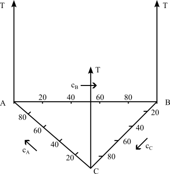
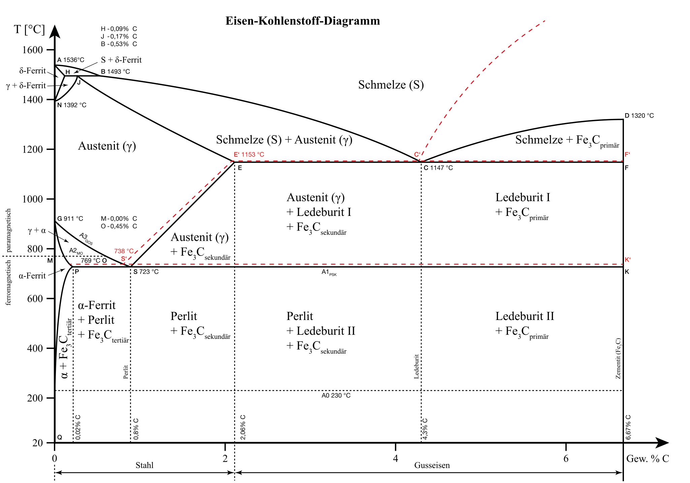
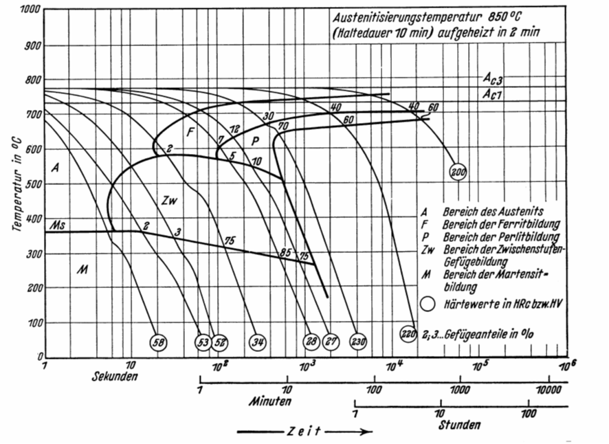

## Vorlesung MTI - Legierungsbildung
Prof. Dr.-Ing.  Christian Willberg 

Kontakt: christian.willberg@h2.de
Teile des Skripts sind von \
Prof. Dr.-Ing. Jürgen Häberle übernommen

---

<!--paginate: true-->

# Inhalte
- Grundbegriffe
- Kristallbildung
- Zustandsdiagramme

---

# Begriffe

## Legierung
- von "ligare" - zusammenbinden, verbinden, vereinigen
- Gemisch aus mehreren Atomsorten (_Komponenten_) mit _metallischem Charakter_
- Komponenten
  - meist metallisch (Cu, Ni)
  - nicht metallisch (C, P, S, N, O)
- Variationen
  - welche Komponenten
  - Zahl der Komponenten
  - Konzentration der Komponenten
---

## Chemische Zusammensetzung oder Konzentration
**Massenanteil, Gewichtsanteil, Massenprozent (Synonym)**
$\frac{m_1}{\sum_i m_{i}}\cdot 100 = m_{1-rel}$ in [%]
Bsp. $m_{Cu-rel}=\frac{m_{Cu}}{m_{Cu}+m_{Fe}}\cdot 100$

Massen $m$ von Komponenten sind unterschiedlich

**Atomanteil**

$\frac{n_1}{\sum_i n_{i}}\cdot 100 = n_{1-rel}$ in [%]
Bsp. $n_{Cu-rel}=\frac{n_{Cu}}{n_{Cu}+n_{Fe}}\cdot 100$

Wenn Massen $m$ von Komponenten ähnlich sind, dann sind $n_{rel}$ und $m_{rel}$ gleich. 

---

## Phase

- Bekannt im Bezug auf den Aggregatzustand (fest, flüssig, gasförmig, plasmaförmig)

**Allgemeine Definition**
Unter Phase versteht man einen chemisch und physikalisch gleichartigen homogenen Bestandteil einer Legierung oder von Materie überhaupt.

---

Einphasigkeit

- reines Aluminium
- reines Eisen
- Wasser

Zweiphasigkeit

- Nebel
- übersättigte Lösungen

Mischkristall

Ein Mischkristall ist ein chemisch homogener, gleichartiger Kritall, der aus mehreren Atomsorten aufgebaut ist.

---

## Mischkristalle - Arten

Subsitutionsmischkristall
- ähnlicher chemischer Charakter
- ähnlicher Durchmesser
- gleiches Kritallgitter

Einlagerungsmischkristall
- kleinere Atome
- in Lücken des Kristallgitters eingelagert (Einlagerungs- oder Zwischengitteratome) 
- zweite Komponente ist gelöst

_Beide Arten sind einphasig._

---

## Intermetallische Phase

-	meist komplizierter Gitteraufbau, unabhängig von Ausgangsgittern
- geordnete Einlagerungsstrukturen
- keine Verbindung im chemischen Sinne (Gesetz der konstanten und multiplen Proportionen gilt nicht)
- vorherrschender Bindungstyp: Metallbindung, aber Atom- und Ionenbindungsanteile „zugemischt“

Eigenschaft: hart und sehr spröde

---

# Zustandsdiagramme (ZSD)

- auch Phasendiagramm -phase diagram-
- stellt den Zustand von Legierungen und Stoffgemischen in Abhängigkeit von der chemischen Zusammensetzung, Temperatur und ggf. dem Druck dar
- Zustand meint die auftretenden Phasen (alle festen, flüssige, gasförmige)

---
## Achtung!

Zustandsdiagramme sind Gleichgewichtsdiagramme. Sie haben nur Gültigkeit bei einer sehr lang-samen Abkühlung aus dem schmelzflüssigen Zustand bis hin zur Raumtemperatur, bei der sich das Gleichgewicht zwischen den Phasen (an bzw. zwischen den Phasengrenzlinien) einstellen kann. 

---

---

## Löslichkeiten

**Unlöslich**

- zu große Unterschiede bei den Atomdurchmessern (>15%)
- Kristallgitter weichen voneinander ab
- Komponenten sind chemisch sehr unterschiedlich
- Elektronen unterscheiden sich stark

**Löslich**
- kaum Unterschiede bei den Atomdurchmessern (<15%)
- Kristallgitter sind identisch
- Komponenten sind chemisch sehr nah beieinander
- Elektronegativität ähnlich

---

---
## Beispiel aus der eigenen Erfahrung
- Ölfilm auf Wasser ist nicht löslich und es findet eine Trennung aufgrund der unterschiedlichen Dichte statt
- Salz- / Zuckerkristalle in Wasser werden vollständig gelöst und ist nicht mehr sichtbar

---

## Beispiel für Unlöslichkeit

---

## Beispiel für vollständige Löslichkeit

---

## Völlige Löslichkeit im flüssigen und teilweise Löslichkeit im festen Zustand

- Metallschmelzen der Elemente A und B lösen sich in beliebigen Mischungsverhältnissen (Konzentrationen)
- die Mischkristalle bilden sich nur noch in bestimmten Maße

**Wichtig:** Dies ist der häufigste Fall in der Praxis!

---

## Wann tritt das auf?

- Atomdurchmesser weichen voneinander ab (aber < 30%)
- Kristallgitter der Komponenten unterscheiden sich
- Komponenten sich chemisch verschieden

Die Komponenten sind sich weder sehr ähnlich, noch sehr verschieden

Es können folgende ZSDs auftauchen:
- Eutektikum (häufigster Fall)
- Peritektikum (seltener)

---

---

---

- Die Phasen bzw. Phasengrenzlinien können als ein Zustandsdiagramm dargestellt werden
- Die Anzahl der miteinander im Gleichgewicht stehenden Phasen ist gesetzmäßig verknüpft mit der Zahl der an der Legierungsbildung beteiligten Komponenten und der Zahl der Freiheitsgrade über die Gibbsche Phasenregel
- Ein Freiheitsgrad beinhaltet die mögliche Veränderung von Zustandsvariablen, ohne das Gleichgewicht, d.h. die Anzahl der Phasen, zu ändern
- Die Anzahl der frei wählbaren Zustandsvariablen wird  nach der Phasenregel bestimmt

---

## Realdiagramme
- die bisherigen Digramme waren Idealdigramme und treten so nicht wirklich auf
- Eisen-Kohlenstoff-Diagramm (EKD) ist das wichtigste Realdiagramm
- Grundmetall ist Eisen -> Stahl oder Eisenguss
- das EKD setzt sich aus den Idealdiagrammen - dem peritektischen, eutektischen und eutektoiden Teildiagramm - zusammen

---

- Man kann je nach Erscheinungsform des Kohlenstoffs zwischen dem stabilen System Fe-C, in dem Kohlenstoff als Graphit, und dem metastabilen System Fe-Fe3C, in dem Kohlenstoff gebunden als Fe3C (intermediäre Phase Zementit) vorliegt, unterscheiden. 
- Stabil bedeutet, dass der Kohlenstoff in Form von Graphit nicht weiter zerlegt werden kann, Fe3C aber bei langzeitigem Glühen in Eisen und Temperkohle zerfällt. 
- Das metastabile System stellt gewissermaßen ein relatives Minimum der Gesamtenergie des Systems dar. Für techni-sche Belange kann es als „hinreichend stabil“ bewertet werden.

---

# Eisen-Kohlenstoffdiagramm (EKD)

- wichtigstes ZSD
- Eisen ist der wichtigste Werkstoff im Maschinenbau. 

Gründe sind
- geringe Kosten
- hohe Festigkeit und elastische Steifigkeit
- Vielzahl von möglichen Legierungen
- Verfügbarkeit
- Gießbarkeit, Schweißbarkeit, etc.

[Erklärvideo für das Eisen Kohlenstoff Diagramm](https://www.youtube.com/watch?v=oJqvnKhnsg0&t=1s)

---

---

# Phasen- und Gefüge im System-Eisen-Kohlenstoff
# Mischkristalle

---

---
## $\alpha$-Mischkristall (krz)
- Gefügebezeichnung Ferrit ($\alpha$-Ferrit)
- rein ferritisches Gefüge besitzt geringe Härte/Festigkeit, aber hohe Duktilität (Zähigkeit)
- Max. C-Löslichkeit: nur 0,02 % 

---
## Exkurs Härte / Festigkeit
Im Detail kommt das später.
Festigkeit 
- Maß der maximalen Beanspruchbarkeit bis Versagen
- Kraft pro Querschnittsfläche

Härte 
- mechanischer Widerstand gegen mechanisches Eindringung eines anderen Körpers 
- Maß für die Verschleißbeständigkeit

---

## $\delta$-Mischkristall (krz)
 - $\delta$-Ferrit ist nur oberhalb von 1392°C stabil  
 - technisch von untergeordneter Bedeutung
 - Max. C-Löslichkeit: 0.12 %

---

## $\gamma$-Mischkristall (kfz)

- Gefügebezeichnung Austenit
- scheidet sich oberhalb der G-S-E-Linie  aus; 
  - durch Legierungszusätze (Ni, Mn) und Abschrecken auch bei Raumtemperatur beständig (austenitische Stähle)
- unmagnetisch, zäh und durch Kaltverfestigung härtbar (Mangan-, Nickel-, Chrom-Nickel-Stähle)
- hohe Warmfestigkeit, gute Korrosions- und Zunderbeständigkeit
- Max. C-Löslichkeit: 2.06 %

---

## Intermediäre Phase
Zementit (Eisencarbid Fe3C); 6.67 Masse-% C-Gehalt

- Primärzementit:	
primäre Kristallisation aus der Schmelze (Linie CD)

- Sekundärzementit: 
Ausscheidung aus dem Austenit (Linie ES)

- Tertiärzementit:	
Ausscheidung aus dem Ferrit (Linie PQ)

---

## Kristallstruktur

- orthorhombischen Elementarzelle 
  -  zwölf Eisen- und vier Kohlenstoffatome
  - die Kohlenstoffatome sind relativ unregelmäßig (zweifach überkappt trigonal-prismatisch) von acht Eisenatomen umgeben

---

- Zementit ist hart und spröde
- überwiegende Zahl der technischen Eisen-Kohlenstoff-Legierungen erstarrt unter Bildung von Zementit

---

# Phasengemische/Gemische von Mischkristallen

## Perlit (Eutektoid)
- Gefüge aus Zementit und Ferrit (= Phasengemisch)
- entsteht durch den "eutektoiden" Zerfall des Austenits ($\gamma$-Mischkristall) mit 0.8% C bei 723°C
- eutektoider Punkt S: hier liegen 100% Perlit vor
- relativ hohe Härte, relativ hohe Festigkeit, schlechte Umformbarkeit, geringe Zähigkeit

---

- lamellenartiger Aufbau (Schichten von $\alpha$-Mk und Fe3C-Kristallen) .
- häufig spricht man von einer "Perlitstufe", die - gemessen am Lamellenabstand - in Perlit, fein-streifigen  und feinststreifigen Perlit unterteilt wird. 

---

## Ledeburit (Eutektikum) 

- Gefüge aus Austenit und Zementit bzw. „zerfallenem“ Austenit und Zementit (= Phasengemisch), Kohlenstoffgehalt 4,3 %, Schmelztemperatur 1147°C 
- Eutektischer Punkt C: hier liegen 100% Ledeburit vor
- Unterscheidung zwischen Ledeburit I (dicht unterhalb 1.147 °C)
  -  um ein Gefüge aus Austenit und Zementit handelt

- Ledeburit II (Raumtemperatur)
  - aus Zementit I mit ankristallisiertem Sekundärzementit (aus dem Austenit bei sinkender Temperatur ausgeschieden) und (bei langsamer Abkühlung) aus Perlit
  -  Der Perlit entsteht durch den eutektoiden Zerfall des Austenits aus dem Ledeburit I bei 723 °C. 

---
- bei schnellerer Abkühlung kann anstelle des Perlit auch Bainit bzw. bei sehr schneller Abkühlung Martensit vorliegen. 
- Ledeburit ist schlecht umformbar, hat sehr geringe Duktilität. 
 - bei Raumtemperatur  feines Gemenge von Fe3C-Kristalliten und Perlitbereichen im Auflichtmikroskop als charakteristische Pantherfellstruktur sichtbar.

---

Die Eigenschaften der Legierung (z.B. Stahl, Gusseisen) wird durch die Art der beteiligten Phasen (z.B. $\alpha$-Mk, Fe3C), ihren mengenmäßigen Anteil (z. B. abhängig vom C-Gehalt) und die Art ihrer Verteilung im Gefüge bestimmt.

---
# Phasen- und Gefüge im Ungleichgewichtszustand

- Gleichgewichtszustände durch Diffusionsvorgänge dominiert
- bei schnelleren Temperaturänderungen wird die Kohlenstoffdiffusion, die zur Entmischung des Austenits erforderlich ist, behindert 
- Dadurch entstehen auch neuartige Gefügebestandteile, die nicht mehr dem Gleichgewichtszustand entsprechen
- führt zu "zwangsgelöstem" Kohlenstoff
---

## Martensit
- raumzentriertes Gitter tetragonal verzerrt („verspanntes Ferritgitter“)
- meist feinnadeliges, sehr hartes und sprödes Gefüge
- der im krz-Gitter des $\alpha$-Fe zwangsgelöste Kohlenstoff verzerrt das Gitter und weitet es tetragonal auf („diffusionsloses Umklappen“). 

---

## Bainit  

- anders als bei der Bildung von Martensit sind hier Umklappvorgänge im Kristallgitter und Diffusionsvorgänge gekoppelt
-  bildet sich im Temperaturbereich zwischen der Perlit- und der Martensitstufe bei Abkühlungsgeschwindigkeiten (für Martensitbildung zu niedrig; für die Perlitbildung zu hoch)

---
 ## Bainit  

- reiner Bainit lässt sich nur durch isotherme Abkühlung, z.B. beim Warmbadhärten, erzielen. 
- Vorteilhaft, wo bei einer Vergütung durch Abschrecken und Anlassen eine Härterissgefahr besteht. 
- Es hat sehr gute Festigkeits- und Zähigkeitseigenschaften.

---

# Eisen-Kohlenstoff-Legierungsbezeichnungen

| Kohlenstoffgehalt (Masse-%) | Bezeichnung               | Typ                                  |
|-----------------------------|---------------------------|--------------------------------------|
| 0.02 < C < 0.8              | (Kohlenstoff-) Stahl       | untereutektoide Stähle               |
| C = 0.8                     | (Kohlenstoff-) Stahl       | eutektoide Stähle                    |
| 0.8 < C < 2.06              | (Kohlenstoff-) Stahl       | übereutektoide Stähle                |
| 2.06 < C < 4.3              | Gusseisen                 | untereutektische Gusseisen           |
| C = 4.3                     | Gusseisen                 | eutektische Gusseisen                |
| 4.3 < C < 6.67              | Gusseisen                 | übereutektische Gusseisen            |

---

---

- Weiterhin wird unterschieden zwischen dem schwarzen Gusseisen (Grauguss), in dem der überschüssige Kohlenstoff in Form von Graphit, und dem weißen Gusseisen, in dem der Kohlenstoff in Form von Zementit vorkommt 
- Mit zunehmendem C-Gehalt steigen die Festigkeit und Härtbarkeit des Stahles, wogegen seine Dehnung, Schmiedbarkeit, Schweißbarkeit und Bearbeitbarkeit (durch spanabhebende Werkzeuge) verringert werden
- Der Korrosionswiderstand gegenüber Wasser, Säuren und heißen Gasen wird durch den Kohlenstoff praktisch nicht beeinflusst. 
- Für Kohlenstoffgehalte unter 0.25 Masse-% sind Stähle gut schweißbar

---

# Wärmebehandlung

---

## Verfahren

- Glühverfahren
- Härteverfahren

Charakterisierung:
- Art des Erwärmens
- Haltetemperatur
- Haltedauer
- Art des Abkühlens (Ofen-, Luft-, Öl-, Wasserabkühlung)

---

Warum?

- Verbesserung der Bearbeitbarkeit (Weichglühen)
- Arbeitsgang der Erzeugung (Härten von Werkzeugen)
- Verbesserung der mechanischen Eigenschaften (Vergüten von Stahl, Aushärten von Al-Legierungen)
- Verminderung des Verschleißes (Randschichthärten von Zahnrädern)
- Beseitigung von Kaltverfestigung (Rekristallisationsglühen)
- Abbau von Guss- oder Schweißspannungen (Spannungsarmglühen)

---

---

---
## Glühen
- langsames Kühlen. Versuch nahe dem Gleichgewichtszustand zu kommen

Ziele ausabeiten für
- Spannungsarmglühen
- Rekristallisationsglühen
- Weichglühen
- Normalglühen
- Grobkornglühen
- Diffusionsglühen

---

## Spannungsarmglühen
- Langsames Erwärmen auf 550 - 650 °C (unterhalb $\text{A}_{c1}$)
- Haltedauer 2 - 4 h, langsame Abkühlung (Ofenabkühlung)

Ziel:
Abbau innerer Spannungen (Eigenspannungen) ohne wesentliche Änderung der sonstigen Eigenschaften

---

## Rekristallisationsglühen
- Rekristallisationstemperatur bei Stahl: 500 - 600°C
- halten, langsame Abkühlung
- bei zu langer Haltezeit: Grobkornbildung

Ziel:

Rückgängigmachen von Eigenschaftsänderungen (Verfestigung) durch Kaltumformung; Gefügeumbildung bzw. -neubildung im festen Zustand; Spannungsabbau, Erhöhung der Bruchdehnung

---

## Weichglühen
- Temperaturen um  $\text{A}_{C1}$ (unterhalb, oberhalb oder pendelnd um  $\text{A}_{C1}$)
- langsame Abkühlung.

Ziel:
Herstellung eines - für die Weiterverarbeitung günstigen - weichen Zustands. Dabei werden Zementitteilchen kugelig eingeformt (GKZ-Glühen).

---

## Normalglühen

- Temperatur 30 - 50°C über Umwandlungstempertur im Austenitgebiet. 
- Erwärmung zwischen $\text{A}_{C1}$ und Glühtemperatur rasch, kurze Haltedauer
- rasche Abkühlung durch Zweiphasen-Intervall, dann langsam abkühlen

---

## Normalglühen

Ziel:

Herstellung eines gleichmäßigen und feinkörnigen Gefüges mit Perlitanteilen, Annäherung an den Gleichgewichtszustand durch zweifaches Umkörnen (bei Erwärmung und Abkühlung). Häufig eingesetztes Verfahren

---

## Grobkornglühen

Verfahrensparameter:
- Temperatur deutlich über $\text{A}_{C3}$ (950 - 1100°C)
- Haltezeit 1 bis 2 h
- langsame Ofenabkühlung
- dann raschere Luftabkühlung

Ziel:
Erzielung eines groben Korns. Hierdurch wird die Spanbarkeit verbessert.

---

## Diffusionsglühen

- Temperatur hoch im Austenitbereich
- lange Haltezeit (bis 50 h)
- langsame Abkühlung

Ziel:
Beseitigung örtlicher Konzentrationsunterschiede (Seigerungen) durch Diffusion.

---

## ZTU-Schaubilder
- Zeit Temperatur Umwandlungs Schaubilder
- werden für verschiedene Materialien und Legierungen bereitgestellt
- auf dieser Basis werden die Wärmebehandlungsprozesse geplant
- Unterscheidung in Abkühlung bei
  - konstanter Temperatur (isotherme Umwandlung)
  - kontinuierliche Abkühlung
---
## isotherme Umwandlung

- Probe wird abgeschreckt
- bei konstanter Temperatur gehalten, bis Umwandlung abgeschlossen

---
## Kontinuierliche Abkühlung
- ausgehend von der Austenitiseriungsbedingung verschieden schnell abgekühlt
- die Umwandlung in Ferrit, Perlit, Bainit (Zwischenstufe) oder Martensit bei verschiedenen Temperaturen findet in unterschiedlichem Ausmaß statt
- am Ende der Abkühlkurve wird meist die erreichbare Härte eingetragen

---

# Härten

---

## Härten

- erfolgt das Abkühlen von einer Temperatur oberhalb der Umwandlungslinie GOSK mit einer Geschwindigkeit, die größer ist als die kritische („Abschrecken“)
- Ziel ist ein Ungleichgewichtszustand durch Umwandlung des Austenits in Martensit (gegebenenfalls auch Bainit)

---

## Verfahren
- Härten nach Volumenerwärmung
- Anlassen
- Vergüten
- Randschichthärten
- Thermochemische Verfahren
  - Aufkohlen / Einsatzhärten
  - Nitrieren
- Thermomechanische Verfahren
- Aushärten
---

## Härten nach Volumenerwärmung

- Kohlenstoffgehalt von mindestens 0.3% (sonst Vorbehandlung nötig)
- bei kleinen Abmessungen kann eine vollständige Martensitbildung über den gesamten Querschnitt erfolgen (Durchhärtung). Bei großen Abmessungen wird die kritische Abkühlgeschwindigkeit nur bis zu einer bestimmten Tiefe erreicht (Einhärtung). 
- Höchsthärte ist allein vom Kohlenstoffgehalt abhängig

---

## Randschichthärten

- wird angewendet bei niedrig- und unlegierten Stählen mit 0.3 - 0.7% Kohlenstoff (obere Grenze zur Vermeidung von Härterissen)
- insbesondere bei Kurbelwellen, Zapfen, Walzen, Zahnrädern u.a.. Ziel dieses Verfahrens ist eine harte und verschleißbeständige Oberfläche bei zähem Kern. 
- Randschicht des Werkstückes auf Härtetemperatur erhitzt und durch Abschrecken gehärtet. 

---

## Verfahren

Das [Randschichthärten](http://wiki.arnold-horsch.de/index.php/Oberfl%C3%A4chenh%C3%A4rteverfahren) ist mit folgenden Verfahren möglich:

- Flammhärten
- Induktionshärten
- Strahlhärten (Elektronenstrahl- und Laserhärten)
- Tauchhärten 

---

## Referencen

Rainer Schwab: Werkstoffkunde und Werkstoffprüfung für Dummies, 2019; ISBN-10 352771538X
[Grundlagen der Metallkunde](https://wiki.arnold-horsch.de/index.php/Grundlagen_der_Metallkunde)

