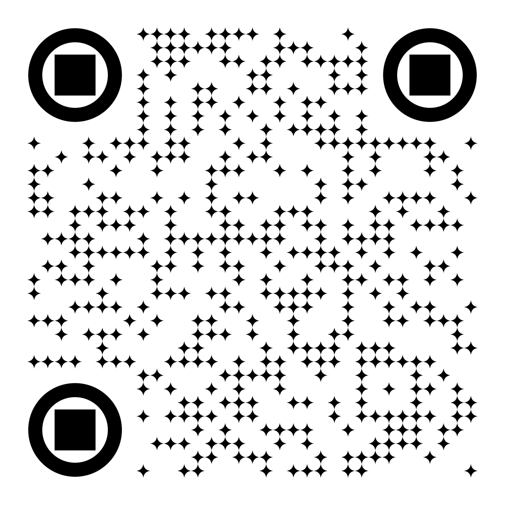
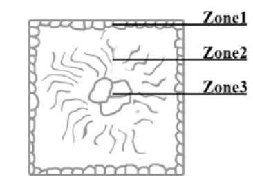

## Vorlesung MTI - Fertigungtechnik
Prof. Dr.-Ing.  Christian Willberg
Hochschule Magdeburg-Stendal

Kontakt: christian.willberg@h2.de

---

# Inhalte

---

<!--paginate: true-->

# Hauptgruppen nach DIN 8580

- Urformen (Formgebung, Zusammenhalt schaffen)
- Umformen (Formänderung ohne Materialabtrag, Zusammenhalt beibehalten)
- Trennen (Formänderung durch Zerteilen oder Materialabtrag, Zusammenhalt vermindern)
- Fügen (Verbinden von Werkstücken, Zusammenhalt vermehren)
- Beschichten (Auftrag dünner Schichten)
- Stoffeigenschaften ändern (z. B. durch Beeinflussung der Kristallstruktur)

---

## Urformen

- Einteilung nach [DIN 8580](https://de.wikipedia.org/wiki/Urformen)
- die wesentlichen Klassen:
  - Urformen aus dem flüssigen Zustand
  - Urformen aus dem breiigen Zustand 
    - z. B. Gießen von Gips oder Beton
  - Urformen aus dem plastischen Zustand 
    - z.B. Spritzgießen, Strangpressen
  - Urformen aus dem körnigen oder pulverförmigen Zustand 
    - z.B. Metall- oder Keramikpulver die gepresst, und anschließend in einem Sinterprozesses erhitzt und dadurch miteinander zu einem festen Körper verbunden

---
- Einteilung nach [DIN 8580](https://de.wikipedia.org/wiki/Urformen)
  - Urformen aus dem span- oder faserförmigen Zustand
    - Papierherstellung oder die Produktion von Spanplatten
  - Urformen aus dem gas- oder dampfförmigen Zustand
    -  Gas oder Dampf wird in eine geometrisch definierte Form überführt, z. B. durch Kondensation metallischer Dämpfe.
  - Urformen aus dem ionisierten Zustand
    - z.B. Abscheiden von Material mittels Elektrolyse im Rahmen der Galvanoformung
  - Additive Fertigung

---

## Urformen - Verbindung zur Werkstofftechnik / Materialeigenschaften?

---

- Schmelzpunkt
- Zustandsdiagramme
- Schmelzbarkeit
- elektrische Leitfähigkeit
- ...

---

# Folgende Schritte sind notwendig

---

- Bereitstellung des Werkstoffs
- Erzeugung eines urformfähigen Werkstoffzustand
- Füllen des Urformwerkzeugs mit urformfähigmen Werkstoff
- Übergang des Werkstoffs in den formbaren Zustand im Urformwerkzeug
- Entnahme des geformten Ergebnisses

---

---

---
[Beispiel Video](https://www.youtube.com/watch?v=oGlUJX_e1Vc)
---

## Urformen aus dem flüssigen Zustand

- Schwerkraftgießen
- Druckgießen
- Niederdruckgießen

---

## Gießen
Die Prozesskette beim Gießen besteht aus
- der Vorbereitung mit der Herstellung der Formen und dem Schmelzen der Werkstoffe,
- dem Abguss, wozu das Füllen der Form und das Erstarren der Schmelze zählt, sowie
- der Nachbehandlung: dem Entformen, dem Gussputzen und der Wärmebehandlung.

---
## Kokillengießverfahren

---

## Stranggießen

---
## Lunker
- Übergang vom flüssigen zum festen Zustand führt oft zum Schrumpfen -> Phasenänderungen 
- es entstehen Zwischenräume - Lunker

--- 
## weitere Ursachen

1.	Feinkörnige globulare Randzone

2.	Transkristallisationszone mit stängelförmigen, sehr groben Kristalliten

3.	Globulare Kernzone

---

## Vermeidung von Lunkern

- große Radien
- geometrische Anpassungen

---

## zu Berücksichtigen

- Thermische Verformung
- Eigenspannungen
- Thermischer Schrumpf

---

## Gusseisen 

- Massenanteil über 2.06 % Kohlenstoff
- gute Gießbarkeit auf (geringer Schmelzpunkt, dünnflüssige Schmelze, …)
- hart und spröde ist
- Die Zerspanbarkeit von Gusseisen hängt von der genauen Sorte ab; 
  - bei Gusseisen mit Lamellengraphit – der häufigsten Sorte – ist sie gut
  - Festigkeit ist geringer als die von Stahlguss, die Dämpfung ist höher
- Viele Sorten enthalten zusätzlich noch Silicium, das die Gießbarkeit verbessert, sowie weitere Legierungsanteile wie Mangan, Chrom oder Nickel
---

---

Es wird unterschieden zwischen:

- grauem Gusseisen (Grauguss), in dem der Kohlenstoff in Form von Graphit vorkommt. _Die Bruchflächen erscheinen grau_
- weißem Gusseisen, in dem der Kohlenstoff als Carbid in Form von Zementit (Fe3C) vorkommt. _Die Bruchflächen sind weiß_

---

## Vergleich Gusseisen und Stahl 

[Qualitativ zum Lesen](https://capablemachining.com/de/Blog/Stahl-vs.-Gusseisen-ein-umfassender-Vergleich/)

- Dichte $7.2\frac{g}{cm^3}$ vs. $7.85\frac{g}{cm^3}$ 
- Schmelztemperatur $1150 °C$
- korrosionsbeständiger als Stahl
- spröder als Stahl

[Quantitativ](https://www.schweizer-fn.de/festigkeit/festigkeitswerte/guss/stahlguss_start.php)

---

---

# Einteilung und Eigenschaften

---

## Gusseisen mit Lamellengraphit

- einfachste und häufigste Gusseisen-Sorte ist Gusseisen mit Lamellengraphit 

- Graphit liegt in Form von dünnen, unregelmäßig geformten Lamellen vor

---

## Gusseisen mit Lamellengraphit

-  Lamellen wirken bei Zugbelastung als Kerben, daher ist die Zugfestigkeit infolge der Kerbwirkung relativ gering
-  Druckfestigkeit liegt etwa um den Faktor 4 höher als die Zugfestigkeit

---

- spröder Werkstoff
- gute Wärmeleitfähigkeit
-  vorteilhafte Selbstschmiereigenschaften
  - wenn durch Bearbeitung die Lamellen angeschnitten und der Graphit selbst oder an dessen Stelle andere Schmiermittel in den Hohlräumen „bevorratet“ werden können. 

---

## Gusseisen mit Kugelgraphit

- Bessere mechanische Eigenschaften als Gusseisen mit Lamellengraphit
- zeigt duktiles Verhalten 

---

## Gusseisen mit [Vermiculargraphit](https://www.giessereilexikon.com/giesserei-lexikon/Encyclopedia/show/gusseisen-mit-vermiculargrafit-190/?cHash=57ba0f0209983c2de8ccc8e299b07616)

- Eigenschaften zwischen Gusseisen mit Lamellengraphit und denen des Gusseisens mit Kugelgraphit
-  Herstellung ist jedoch schwieriger und erfordert eine in engen Toleranzen geführte Schmelzbehandlung

---

- höhere Festigkeit und Bruchdehnung und Bruchzähigkeit
- geringere Wanddickenabhängigkeit der Eigenschaften
Gusseisen mit Vermiculargrafit zeichnet sich gegenüber Gusseisen mit Lamellengrafit durch folgende Eigenschaften aus:

- höhere Festigkeit und Bruchdehnung
- höhere Bruchzähigkeit
- geringere Wanddickenabhängigkeit der Eigenschaften

---

Gegenüber Gusseisen mit Kugelgrafit bietet Gusseisen mit Vermiculargrafit folgende Vorteile:

- niedrigerer thermischer Ausdehnungskoeffizient
- höhere Wärmeleitfähigkeit
- niedrigerer E-Modul
- geringeres thermisch induziertes Eigenspannungsniveau
- bessere Temperaturwechselbeständigkeit und geringere Verzugsneigung aufgrund der zuvor genannten Eigenschaften
- besseres Dämpfungsvermögen
- bessere gießtechnische Eigenschaften (geringere Lunkerneigung, besseres Formfüllungs- und Fließvermögen)

---

## Urformen - Additive Fertigung

- schichtweiser Aufbau eines dreidimensionalen Bautils
- Verfahrensarten
  - Tropfen
  - Filament
  - Draht
  - Pulverauftrag
  - ...

[Grundlagen](https://www.youtube.com/watch?v=d_YUk4vcFCE)

