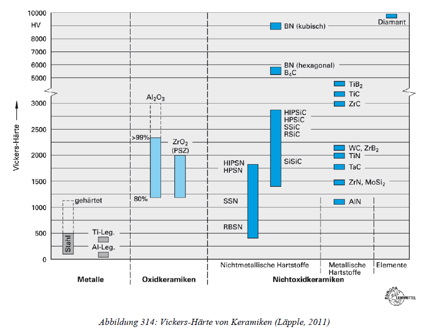
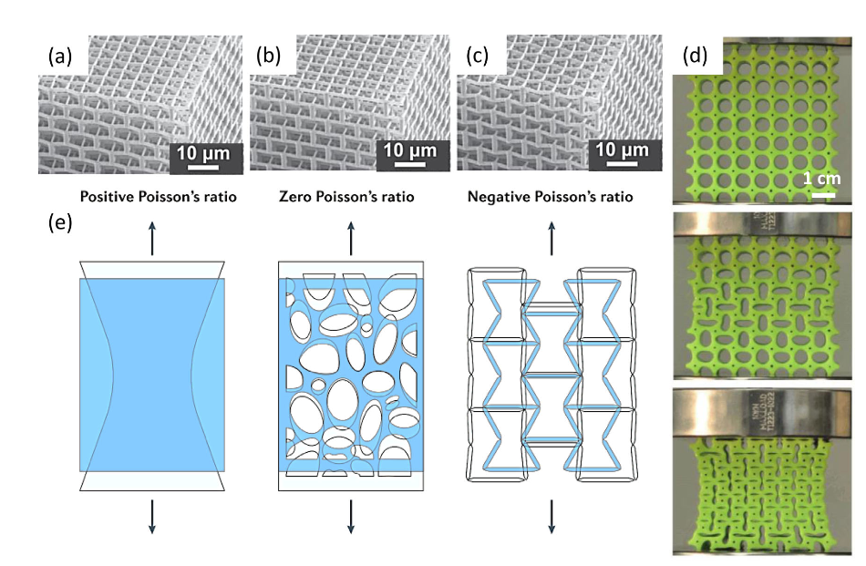
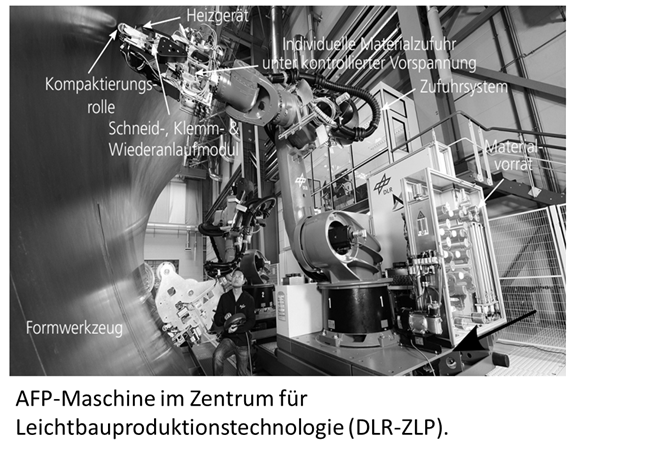
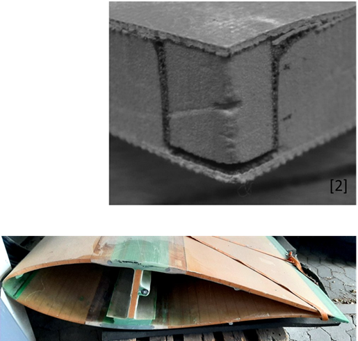

## Vorlesung MTI - Nicht Eisen Werkstoffe
Prof. Dr.-Ing.  Christian Willberg 

Kontakt: christian.willberg@h2.de

---

<!--paginate: true-->

# Nicht Eisenwerkstoffe

- Nicht-Eisenmetalle
- Kunststoffe
- Gläser
- Keramiken
- Metamaterialien
- Multifunktionale Materialien
- Faserverbundkunststoffe
- Leichtbauexkurs

---
## Vergleich von Werkstoffen

- spezifische Kennwerte

---

Spezifische Eigenschaften = $\frac{\text{Eigenschaft}}{\text{Bezugsgröße}}$
Beispiele:

Spezifische Masse (Dichte) - $\rho = \frac{m}{V}$ 
Spezifische Festigkeit - $R_{spez} = \frac{R_{m}}{\rho}$ 

---

# Nicht-Eisen Metalle

Stahl hat eine Jahresproduktion von ~1900 Mio. t

---

## Alumininium

Gute [Übersicht](https://www.maschinenbau-wissen.de/skript3/werkstofftechnik/aluminium) über die Eigenschaften, Herstellung, etc.

Die spezifische Festigkeit von Aluminium und Stahl liegt sehr nah beeinander.

---

Vorteile:
- Geringe Dichte, deshalb bedeutend geringeres Gewicht als vergleichbare Bauteile und Konstruktionen aus Stahl.
- Aluminiumwerkstoffe lassen sich hervorragend warm- und kaltumformen.
- gute Gießbarkeit
- Aushärtbarkeit
- gute Zerspanbarkeit
- Aufgrund einer passivierenden Oxidschicht auf der Oberfläche gelten Aluminiumwerkstoffe grundsätzlich als sehr korrosionsbeständig gegenüber zahlreichen wässrigen Medien.

---

Nachteile:
- höhere Kosten im Vergleich zu Stahl

**Anwendung**
- Automobilbau 
- Luft- und Raumfahrttechnik
- Fahrräder
- Alufolie

---
## Herstellung
- Aluminium wird aus $\text{AL}_2\text{O}_3$ gewonnen
- Schmelzpunkt von Bauxit ist sehr hoch 2060 °C
- Es wird daher eine Smelzflusselektrolyse angewandt
- Elektrolyt - Lösung von Aluminiumoxid in geschmolzenen künstlich hergestellten Kryolith. Kryolith (Mineral aus Natrium, Aluminium und Fluor)

---
## 

- Energieaufwand sehr hoch
- Recycling benötigt nur 5% der Energie die für die Herstellung von Primäraluminium nötig ist

[um die 60-70 Mio. t Produktion](https://de.wikipedia.org/wiki/Liste_der_gr%C3%B6%C3%9Ften_Aluminiumproduzenten)

---

## Kupfer

- Kupfer ist ein sehr guter elektrischer und thermischer Leiter

---

- bekannte Legierungen sind 
    - Bronzen (Kupfer-Zinn)
        - gute Festigkeit
        - Korrosionsbeständigkeit
        - leichte Verarbeitung
    - Messinge (Kupfer-Zink)
        - bis 37% Zink einphasiges Messing
        - zwischen 37-44% Zink zweiphasiges Messing
        - gut spanbar
    - Kupfer-Nickel Legierungen
---

## Herstellung

- aus Kupferstein

$6CuFe S_2 10 O_2\rightarrow
3 Cu_2 S+2 Fe S$ $+ 2Fe_2 O_3 + 7 SO_2$

in mehreren Schritten kommt es zu Reaktion
$Cu_2 S+ 2Cu_2 O\rightarrow 6Cu+SO_2$

[17 Mio. t (2006) - 28 Mio. t (2025*)](https://de.statista.com/statistik/daten/studie/156043/umfrage/weltweite-kupfernachfrage-seit-2006/)

---

## Weitere

- Magnesium findet im Leichtbau Anwendung 
- Titan und Titanlegierungen 
    - hohe Festigkeit und Warmfestigkeit
    - Korrosionsbeständig
- Nickel
    - Korrosionsbeständigkeit
    - hohe Warmfestigkeit

---
- Zink
    - Korrosionsschützende Überzüge
    - witterungsbeständige Bleche
- Blei
    - Leicht gießbar
    - chemisch beständig
    - Batterien, Lager und Lote

    

---

- Wolfram (Tungsten)
    - höchste Schmelztemperatur von allen Metallen
    - Glühfände, Schweißelektroden und Sonderbauteile

---

---

# Kunststoffe

- Kunststoffe bestehen hauptsächlich aus Makromolekülen
- Je nach Herstellungsverfahren und zugesetzten Additiven (Zusatzstoffe) haben sie ein sehr weites Eigenschaftsspektrum. 
-  Polymere können aus Naturstoffen oder rein synthisch gewonnen werden

---

## Anwendungen
- Verpackungsindustrie
- Isolierungen
- Spielzeug
- Rohre
- Verkleidungen
- Dämmungen
- Leiterplatten
- uvm.

---

## Umweltproblem

- über 70% der Kunststoffe werden in Deponien gelagert, 9% recycled, der Rest wird verbrannt 
- Mikroplastik
    -   wird bewusst genutzt (Zahnpasta) oder entsteht durch mechanische Zerstörung von Kunststoffen in der Umwelt
    - reichert sich in Nahrungsmitteln, Tieren und Pflanzen an
    - kann negative Wirkungen haben (bei Menschen noch nicht nachgewiesen)

---
## Unterteilung

Thermoplaste
- bestehen aus unvernetzten Polymeren
- häufig mit einer teilkritallinen Struktur
- sind schmelzbar und haben eine Glastemperatur
- sind im Prinzip recyclebar

---

Duroplaste
- engmaschig vernetzten Polymere (Vermetzungen sind die roten Punkte)  

---

Elastomere
- weitmaschig vernetzten Polymere
- Weitmaschigkeit erlaubt hohe Streckungen (z.B. Gummibänder)

---

## Glastemperatur

$T_g$ ist die Temperatur, bei der ein amorpher Feststoff (z. B. ein Glas oder ein amorphes Polymer) von einem starren, glasartigen Zustand in einen weichen, gummiartigen Zustand übergeht.

---

## Thermoplast
**Aggregatzustände**

Bei verschiedenen Temperaturen nehmen Thermoplaste verschiedene Aggregatzustände an. Diese können dann genutzt werden, um den Werkstoff in Form zu bringen
- Fest 
- Thermoelastisch
- Thermoplastisch
- Fließfähig

---

**Typische Fertigungsverfahren**
- Spritzgießverfahren
- Extrusion
- Additive Fertigungsverfahren
- Blasformen
- Folienblasen

---
_Anwendungen_ 
- Automobilindustrie: Verwendung in Innen- und Außenverkleidungen, Stoßfängern und Scheinwerfergehäusen.
- Luft- und Raumfahrt: Einsatz in Interieur-Komponenten von Flugzeugen und Satelliten aufgrund des geringen Gewichts.
- Medizintechnik: Herstellung von Einwegspritzen, Kathetern und anderen medizinischen Verbrauchsmaterialien.
- Bauwesen: Einsatz in Rohrleitungen, Isoliermaterialien und Fensterrahmen.
- 3D Druck
---

Beispiele 
- Polyethylen (PE)
- Polypropylen (PP)
- Polystyrol (PS)
- Polycarbonat (PC)

---

## Duroplast
- können Duroplasten aufgrund ihrer hohen Vernetzung nicht mehr aufgeschmolzen werden. 
- hohe Temperaturen oberhalb der Zersetzungstemperatur zerstören die Bindungen (Pyrolyse).
- durch Polykondensation hergestellt. 
- Findet stufenweise statt. Die Zwischenprodukte (Oligomere) der Stufen sind stabil, aber weiterhin reaktionsfähig. Diese Oligomere bilden dann final Makromoleküle.

---
_Anwendungen_ 

- Bremsbelege
- Faserverbundwerkstoffe
- Kabelbahnen
- Karosserieteile
- Schutzhelme

---

Beispiele 
- Epoxidharze
- vernetzbare Polyurethane 
- ungesättigte Polyesterharze

---

## Elastomer

- Glastemperatur befindet sich unterhalb des Einsatzgebiets (bei tiefen Temperaturen werden sie glasartig)
- Elastomere können sich als thermoelastisch Verformen und finden in ihre Ursprungsform zurück
- Viele Elastomere werden heutzutage künstlich hergestellt. Allerdings gibt es einen großen Markt für Naturkautschuk. Dieser wird im wesentlichen vom Kautschukbaum geerntet. Es gibt erste Anwendungen Kautschuk aus [Löwenzahn](https://de.wikipedia.org/wiki/Russischer_L%C3%B6wenzahn) zu nutzen.

---

_Anwendungen_ 
- Dichtringe
- Reifen
- Gummibänder

- Vulkanisation beeinflusst die Zahl der Brücken (Punkte rechts)

---
Beispiele
- Naturgummi
- Gummi
- Chloropren
- Epichlorhydrin

---

**Vulkanisation**
Beschreibt den Herstellungsprozess, um thermoplastischen Naturkautschuk oder Synthesekautschuk in einen Elastomer zu wandeln. 
- erzeugt kovalenten Bindungen (rote Punkte) zwischen den Molekülketten
- Schwefel oder schwefelgebenden Stoffe 
- kovalenten Bindungen in Form von Schwefelbrücken
- Alterung ist ein Austausch der Schwefelbrücken durch Sauerstoffbrücken

---

## Additive
Werden genutzt um die spezifischen Eigenschaften der Kunststoffe zu 
beeinflussen.

- Weichmacher
- Stabilisatoren
- Farbmittel
- Füllstoffe
- Verstärkungsstoffe

---

## Gläser
- ist ein eingefrorender Zustand einer unterkühlten Flüssigkeit
- amorphe Struktur
    - stochastisch verteilt
    - isotrop
- Glastemperatur
- Kristalle ändern ihre Eigenchaften an der Schmelztemperatur sprunghaft (Phasenänderung)
- Bei Gläsern ist dies nicht der Fall (keine Phasenänderung)

---

# Gläser

- unterhalb $\text{T}_g$ Festkörperverhalten
- oberhalb $\text{T}_g$ Flüssigkeitsverhalten
- der Prozess ist reversibel

---

**Eigenschaften**
- je nach Glas sehr verschieden
- in aller Regel sehr resilient gegenüber Chemikalien
- in aller Regel der zerbrechmlich (niedrige Zugfestigkeit)
- nicht-metallische Gläser sind schlechter Leiter und können als Isolatoren genutzt werden

**Anwendungen**

- Scheiben
- Behälter
- Isolatoren
- Optiken

---

# Keramiken
Ausgangsmaterial ist pulverförmig

- Aufbereiten und Mischen der Pulver
- Herstellen der Formteile
- Brennen (Sintern)

---

- Sehr hohe Druckfestigkeit (10 mal höher als Zug)
- Verhalten eines ideal spröden Körpers
- geringe Schlagbiegefestigkeit
- große Kerbempfindlichkeit

[Quelle](https://d2wg98g6yh9seo.cloudfront.net/users/153243/153243_PuZaGavilaboseVe7493644773946427.png)

---

- Ursache für hohe Festigkeit und Elastizität sind die Hauptvalenzbindungen zwischen den Atomen 
- Daher kein Gleiten wie bei Metallen möglich -> keine plastischen Eigenschaften

[Quelle](https://d2wg98g6yh9seo.cloudfront.net/users/153243/153243_waVatuLaxuyiroRu6233471439296793.png)

---
## Härte

[Quelle](https://d2wg98g6yh9seo.cloudfront.net/users/153243/153243_SifuZeYuvegeWori5372538488744336.png)

---

Tonkeramiken
- mindestens 20% Tonmineral enthalten
- Porzelan hat hat vor allem technische Bedeutung

Glaskeramiken 
- Mischung aus Glas und Keramik
- Teilkristallbildung durch Zuabe von Kristalliten
- wie Glas gegossen und dann Wärmebehandlung
- sehr geringer (teils negativer) Wärmeausdehungskoeffizient

---

## Eigenschaften
**Elektrisch**
- hohe Kriechstromfestigkeit
- Hoher Durchgangswiderstand
- hohe Durchschlagfestigkeit

Unempfindlich gegen klimatische Einflüsse (Salznebel, Industriegase, Sonnenlicht, Wärme)
- als Stecker, Klemmleisten, Schalter, usw. eignesetzt

[Quelle](https://pixnio.com/free-images/2017/12/11/2017-12-11-16-38-22-1536x1024.jpg)

---

## Technische Keramiken und deren Anwendungsgebiete
Können eine große Breite an Eigenschaften haben. Daher bedienen sie eine Vielzahl von  Anwendungsgebieten.

- Medizintechnik: Knochen- oder Zahnersatz
- Elektrotechnik: Leistungskondensatoren
- Hochtemperaturanwendung: Brennersysteme, Heizelemente, Lager
- Lager- und Dichttechnik: Gleitringdichtungen, Gleitlager

Es existieren auch keramische Faserverbunde, welche die mangelnde Zugfestigkeit ausgleichen.

---

# Metamaterial
Ziel von Metamaterialien ist es die Eigenschaften gezielt zu "bauen".

Hierfür wird die Mikrostruktur gebaut.

[Beispiel](https://en.wikipedia.org/wiki/File:Negative_refraction.ogv)

[Quelle](https://doi.org/10.1002/adem.201800864)

---

---

---

# "Smart Materials"
Piezoelektrische Materialien
    - Deformation aufgrund von elektrischer Spannung und vice versa
[Formgedächtnismaterialien](https://www.youtube.com/watch?v=231O7jlgwxI)
    - starke Formänderung aufgrund von Temperaturänderung
    - Gute [Beschreibung](https://en.wikipedia.org/wiki/Shape-memory_alloy)

---
Photovoltaische Materialien
    - el. Spannung durch Lichteinwirkung
Thermoelektrische Materialien
    - el. Spannung aufgrund von Temperaturänderung
Photomechanische Materialien
    - Formänderung bei Licht
Thermochrome Materialien
    - Farbänderung bei Temperaturänderung
uvm.

---

## Naturwerkstoffe

Unteilbar in belebt (organisch) und unbelebte (anorganische Stoffe)

- organisch
    - tierisch oder pflanzlich
    - Fette, Öle, Stärke
- anorganisch
    - Silikate, Carbonate

---

| Pflanzlicher Stoff | Anwendung |
| ---| --- |
|Lignocellulose/ Holz|	Holzwerkstoffe|
|Öle|	Schmierstoffe, Kraftstoffe, Tenside|
|Fasern|	Textilien, Werkstoffe|
|Stärke	|Verpackungsmittel|
|Besondere Inhaltstoffe|	Arzneimittel, Genussmittel, Farbstoffe|

---
| Tierischer Stoff | Anwendung |
| ---| --- |
|Knochen, Schalen	|Leim, Düngemittel, Werkstoffe|
|Fette	|Schmierstoffe, Kraftstoffe, Tenside|
|Fasern	|Textilien, Werkstoffe|
|Proteine|	Kosmetika|
|Besondere Inhaltstoffe	|Arzneimittel z.B. Insulin, Impfstoffe, Oestrogene|

---

## Holz und Holzwerkstoffe

- Furnier
    - bestehen aus unvergütetem Vollholz mit einer Dicke kleiner gleich 5 mm und einer Breite größer gleich 80 mm, welche durch spanloses oder spanendes Schneiden aus Rohholz hergestellt werden.
- Sperrholz
    -  mindestens drei aufeinander geleimten Holzlagen verstanden
- Spanplatte
- Faserplatte
    - Faserdämmplatte
    - Hartfaserplatte
    - MDF-Platte
---

---

---

---

---

## Eigenschaften
- stark abhängig vom Holz
    - Bambus, Fichte, Eiche, Lophira alata
- Funier ($E=10000-17000N/mm^2, R_{11}=180-80N/mm^2$)

- Spanplatten sind im Bereich von Kunststoffen ($E=2000-4500N/mm^2$)

- Festigkeit senkrecht zur Hauptrichtung ~50%

---
## Naturfasern

Beispiele: Glas, Hanf, Flachs, Kenaf, Jute, Baumwolle

Als nachwachsender Rohstoff sind 
Hanf ($E=90000 N/mm^2$; $R=1110N/mm^2$) 
Flachs ($E=93000 N/mm^2$; $R=930N/mm^2$) 

aus ökologischer Sicht interessant. 

---

Polypropylen (PP), PP und Talkum (PP-T), PP und Holzfasern (WPC), PP und Bastfasern (wie Hanf, Flachs, Jute, Kenaf) sowie PP und Glasfasern (PP-GF)

---

Anteil am Verbundmarkt in der EU sind ca. 15% (Stand 2015)

---

## Herausfoderungen
- Normierung
    - existiert nur in Teilen
- Wettbewerb gegen etablierte Prozesse

---

# Faserverbundwerkstoffe

---

---

## Was ist ein Faserkunstoffverbund (FKV)

- Mehrphasen- oder Mischwerkstoff im Allgemeinen bestehend aus zwei Hauptkomponenten (Faser und Matrix)
- Der Gesamtwerkstoff hat höherwertige Eigenschaften als jede der beiden beteiligten Komponenten alleine
- Material und seine Eigenschaften entstehen in der Fertigung 

---

## Fokus von Industrien

- Luft- und Raumfahrt
  - Gutes Festigkeits/Steifigkeits – Gewichtsverhältnis
  - Schaden-, Korrosionsstoleranz 
  - Wartbarkeit / Reparierbarkeit
- Bauwesen
  - Widerstand gegen Umwelteinflüsse und Korrosion
  - Langlebigkeit

---

- Schifffahrt
  - Salzwasser
  - Schlagschäden
  - Lange Lebendauer
- Landtransportsysteme
  - Kosten
  - Einfache Fertigbarkeit
- Weitere Anwendungen
  - Dichtheit
  - …

---

## Komponenten von Faserkunstoffverbunde 

**Matrix – bindende Komponente**
Formgebend
Schutz und Stabilisierung der Fasern
Spannungen an die Fasern übertragen

---

## Komponenten von Faserkunstoffverbunde 

**Faser – verstärkende Komponente**
Lasttragend da hohe Steifigkeit und/oder Festigkeit bei geringem Gewicht
Begrenzte thermische Dehnung
Weitere Bestandteile (optional)
Faserbeschichtungen
Füllstoffe
Beimischung anderer Fasertypen

---

## Ausgangswerkstoffe - Faser

- Kurzfasern
  - Wirre Anordnung (geringe Anistropie)
  - Oft recyclete Fasern
- Langfasern
  - Mehrere Millimeter - einige Centimeter Länge
  - Geringere Anforderung bei Verarbeitung und Lagerung

---

## Ausgangswerkstoffe - Faser

- Endlosfasern
  - Hohe Festigkeiten und Steifigkeiten
  - Höhere Anforderung bei Verarbeitung und Lagerung

---

## Ausgangswerkstoffe - Faser

- Naturfasern: Haare, Wolle, Seide, Baumwolle, Flachs, Sisal, Hanf, Jute, Ramie, Bananenfasern ...
- Organische Fasern: Polyethylen (PE), Polypropylen (PP), Polyamid (PA), Polyester (PES), Polyacrylnitril (PAN), Aramid, Kohlenstoff ...
- Anorganische Fasern: Glas, Basalt, Quarz, SiC, Al2O3, Bor, ...
- Metallfasern aus: Stahl, Aluminium, Kupfer, Nickel, Beryllium, Wolfram ... 

---

## Glasfaser

**Vorteile**
hohe Längs-Zug- sowie die hohe Längs-Druckfestigkeit
Eine hohe Bruchdehnung
aufgrund der niedrigen Fasersteifigkeit gute Drapierbarkeit, auch um enge Radien
die vollkommene Unbrennbarkeit
die sehr geringe Feuchtigkeitsaufnahme

---

## Glasfaser

**Vorteile**

die gute chemische und mikrobiologische Widerstandsfähigkeit. 
Kosten
**Nachteile**
der für viele Strukturbauteile zu niedrige Elastizitätsmodul der Glasfaser
Glasfasern sind unverrottbar (Vor- und Nachteil)

---

## Kohlefaser (C-Faser)

**Vorteil**
C-Fasern sind sehr leicht, ihre Dichte ($\rho_𝑓 \approx 1.8 g/cm^3$) liegt deutlich unter derjenigen von Glasfasern ($\rho_𝑓 \approx 2.54 g/cm^3$). 
extrem hohe Festigkeiten und sehr hohe Elastizitätsmoduln
beide mechanischen Größen sind zudem in weiten Bereichen bei der Herstellung der Fasern einstellbar
Exzellente Ermüdungsfestigkeit

---

**Nachteile**
Geringere Druckfestigkeit in Faserrichtung
Schlechtere Drapierbarkeit
Kosten
Elastizitätsmoduln in Faserlängs- und Querrichtung unterscheiden sich um eine Größenordnung (Vor- und Nachteil)

---

---

## Matrixmaterialien
- Faserverbundwerkstoffe können als Matrix auch Metalle, Beton, usw. haben

---

## Ausgangswerkstoffe FKV - Matrix

**Duroplastische Reaktionsharze**
- Epoxidharze, Phenolharze, Polyesterharze, Vinylesterharze, …
- Werden mit Reaktionsmittel für die Aushärtung gemischt
- Vorimprägnierte Fasern -> Prepregs
- Exotherm und volumenändernd beim Aushärten
**Thermoplaste**
- Polypropylen, Polyamid, Polyarylensulfide, …
- Schmelzen bei einer bestimmten Temperatur (55 °C – 155 °C)
- Teuer aber Recyclebar
- Schwieriger zu handhaben

---

## Verbund schematisch
**Symmetrien**
- Transversale Isotropie (Eigenschaften in 2 und 3 Richtung sind gleich)
- Orthotropie
- Anisotropie
**Faservolumenanteil $𝜑$**
Errechnet sich aus Mischungsregel
$𝜌= 𝜑𝜌_𝑓+(1- 𝜑) 𝜌_𝑚$
Steifigkeiten und Festigkeiten

---

---

## Fertigung
Wahl des Verfahrens hängt ab von
- Der konkreten Anwendung
- Einsatzbedingungen
- Grundmaterial (Faser, Matrix)
- Stückzahl
- Kosten
- Betriebsicherheit
- …

---

## Fertigung - Verfahrensschritte
- Erstellen von Formwerkzeugen
- Zuschnitt und Ablage von Vorprodukten
- Aushärtung des Harzsystems
- Nachbearbeitung des Bauteils

---

## Formwerkzeug / Faserablage

- Gips
- Kunststoff
- Metallen
- Faserverbunden
- Thermaldehnung sollte kompatibel

---
## Halbzeuge

- Handhabbarkeit
- Verringerung der Fertigungstiefe
- Erhöhung der Qualität
- Beispiele:
  - Gewebe
  - Gelege
  - Fliese, Matten
  - Kernmaterialien
  - Flechtschläuche
  - …

---

## Fertigung
Manuell
Faserablage
Handlaminieren
…
Wickeln
Spritzverfahren
Pultrusion
Pressen
RTM (Resin Transfer Moulding) Verfahren
Automatisierte Faserablageverfahren
…

---

## Fertigung
Manuell
Faserablage
Handlaminieren
…

---

## Fertigung
Manuell
Faserablage
Handlaminieren
Wickeln
Spritzverfahren
Pultrusion
Pressen
...

---

## Fertigung

Manuell
Faserablage
Handlaminieren
Wickeln
Spritzverfahren
Pultrusion
Pressen
RTM (Resin Transfer Moulding) Verfahren
...

---

## Fertigung
Manuell
Faserablage
Handlaminieren
Wickeln
Spritzverfahren
Pultrusion
Pressen
RTM (Resin Transfer Moulding) Verfahren
Automatisierte Faserablageverfahren
…

---

## Schäden in Faserverbunden
Nach Heslehurst können 52 Fehlertypen kategorisiert werden 
  - Einteilung nach Auftreten im Lebenszyklus
        - Materialprozess – Fehler die bei der Bereitstellung der Teilbestandteile auftreten
        - Komponentenfertigung – Fehler während der Kompositfertigung, welche während der Ablage, Aushärtung, Bearbeitung oder der Assemblierung auftreten
        - In-service Nutzung – im Betrieb auftretende Schäden
  - Einteilung nach Größe
      - Mikroskopisch 
      - Makroskopisch

---

## Delaminationen
- eine der häufigsten Schädigungen
- hohe interlaminare Spannungen durch 
- Querkontraktionseffekte
- Unterschiedliche Wärmedehnungen
- Kanten (Geometrie, Mikrorisse, Poren)
- Trennfolien

---

## Delaminationen

- Verschmutzungen
- Trennung zwischen zwei Lagen – interlaminarer Riss
- Feuchteeintritt
- Lebensdauerreduktion
- Stabilität

---

## Ablösungen

- Schlechte Prozesskontrolle
- Schlechte Passung
- Durch eintretenden Trennfilm
- Schlechte Oberflächenbehandlung (Verschmutzung, etc.)
- Relevant bei Kernanbindung und Verklebung von Komponenten

---

## Fehler an Verbindungsbohrungen

- Zu starkes Anziehen von Schrauben 
Oberflächenschädigung
- Lokale Beschädigung der ersten Lage
- Austrittsschäden bei Bohrungen
- Meist Splitterungen und lokale Delaminationen
- Splitter können bei Bohrungen zwischen zwei Komponenten verbleiben

---

## Porosität

- Schlechte Material- und Prozesskontrolle
- Überaltertes Material
- Feuchtigkeit im Prepreg 
- Fehlfunktion im Autoklav

---

## Porosität

- Verschlechtert die Lageneigenschaften
- Auswirkung auf die Ermüdungslebens-dauer
- Konzentrationen von Poren wichtiger als Größe
- Wirkt sich auf die Dichtheit aus

---

## Vor- und Nachteile 
**Vorteile**
- Spezifische Materialeigenschaften
- Weitgehend elastisches Verhalten
- Hohe Festigkeiten und Steifigkeiten in Faserrichtung
- „maßgeschneidertes“ Material
- Alterung- und Korrosionsbeständigkeit

---
## Vor- und Nachteile
**Nachteile**
- Variantenreichtum
- Geringe Zugfestigkeit senkrecht zur Faser
- Schwierige Prüfung
- Recyclebarkeit
- Spezifische Materialeigenschaften und Verarbeitungsverfahren
