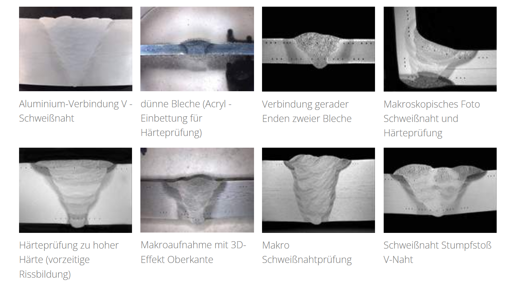

## Vorlesung MTI - Fügen
Prof. Dr.-Ing.  Christian Willberg
Hochschule Magdeburg-Stendal

Kontakt: christian.willberg@h2.de

---

# Definition
Fügen ist das Zusammenbringen von verschiedenen Werkstücken (Bauelementen) geometriscehr bestimmter fester Form oder von ebensolcheen Werkstücken mit formlosem Stoff oder Verbindungselementen. Dabei wird der Zusammenhalt zwischen den Elementen jeweils örtlich geschaffen oder vermehrt.

---

- gefügt werden können alle Arten von Werkstoffkombinationen
- nicht alle Fügeverfahren sind für alle Werkstoffe geeignet

---
## Verfahrensgruppen
- Zusammensetzen
- Füllen
- An- und Einpressen
- Fügen durch Urformen
- Fügen durch Umformen
- Fügen durch Schweißen
  - Pressschweißen
  - Schmelzschweißen

---

- Fügen durch Löten
  - Weichlöten
  - Hartlöten
  - Hochtemperaturlöten
- Kleben
  - mit physikalisch abbindenden Klebstoffen
  - mit chemisch anbindenden Klebstoffen

---
## Verbindungsarten
Stoffschluss
- Schweißen, Löten, Kleben

Formschluss 
- Nieten, Falzen, Umpressen

Kraftschluss
- Schrumpfen, Schrauben, Keilen

---

## Kraftschluss

---
## Schraubenverbindungen

---
| Durchsteckschraube                         | Einziehschraube                                                                 | Stiftschraube                                   |
|-------------------------------------------|---------------------------------------------------------------------------------|------------------------------------------------|
| Sechskantschraube, Zylinderschraube       | Die Verbindung wird erzeugt durch Verspannen mit einer Mutter.                  | Bei einer Stiftschraube wird der Schraubenkopf durch eine Mutter ersetzt. |
| In den Bohrungen ist kein Gewinde enthalten (Durchgangsbohrungen). | Hier wird das Verspannen realisiert durch den Einzug in ein Gewinde, welches in einem zu verbindenden Objekt enthalten ist. | Der Schraubenkopf kann zusätzlich versenkt werden oder aufliegen (siehe Durchsteckschraube). |

[Quelle](https://www.ingenieurkurse.de/technische-darstellungen-maschienenbau/normgerechtes-bemassen-in-einer-technischen-zeichnung/hinweise-zu-speziellen-schrauben-und-gewindebedingungen.html)

---

## Formschluss

- Verzahnungen
- Nuten und Federn
- Dübel in der Holzbearbeitung:
Dübel, die in entsprechend gebohrte Löcher eingefügt werden, um zwei Holzstücke miteinander zu verbinden.

---

# Stoffschluss

---

---

 
    <a href="https://www.schuetz-licht.de/wissen-normen-seminare/metallographie-metallografie/schweissnahtpruefung" style="color: blue;">Bildreferenz</a>

---
**Referenzen**
Birgit Awiszus et al. (2007) "Grundlagen der Fertigungstechnik"
