

## Vorlesung MTI - Beschichten
Prof. Dr.-Ing.  Christian Willberg 

Kontakt: christian.willberg@h2.de

---

# Definition
Unter [Beschichten](https://de.wikipedia.org/wiki/Beschichten) (englisch coating) ist das Aufbringen einer festhaftenden Schicht aus formlosem Stoff auf die Oberfläche eines Werkstückes. 

---
## Ziele?

---

- Abnutzung reduzieren
- fehlenden Werkstoff ergänzen
- Erzeugen bestimmter Oberflächeneigenschaften

---

## Verfahrensgruppen

Unterscheidbar nahc Ausgangszustand des Beschichtungsmaterials

| Zustand   | Verfahren                             |
|-----------|---------------------------------------|
| Gasförmig | Chemische Gasphasenabscheidung, ...   |
| Flüssig   | Lackieren, Bemalen, Emailieren, ...   |
| Gelöst    | Galvanisieren, Verzinken, Chromatieren, ... |
| Fest      | Plasma-Pulver-Auftragsschweißen, Pulverbeschichten, ... |

---
# Lackieren
- mit Pinseln, Walzen oder Spritzen aufgetragen

[Video](https://youtu.be/LHXEeSr0KAE?si=TTXSMoCSz_0ZH8a7&t=18)

---

## Auftragsschweißen
- Schweißraupe wird auf der Oberfläche angebunden 

Auftragsfläche

$\gamma = \frac{A_E}{A_E+A_A}100\%$
$\gamma$ sollte möglichst klein sein -> Einbrandtiefe $t$ und Einbrandfläche $A_E$ sind klein

[Video](https://youtu.be/a4WS1jHU6Ro?si=MCKOjTt7vIibOec6&t=30)

---

**Referenzen**
Birgit Awiszus et al. (2007) "Grundlagen der Fertigungstechnik"

---

# Faserverbundwerkstoffe

---

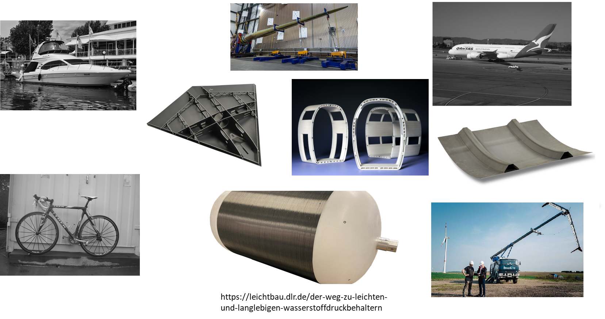

---

## Was ist ein Faserkunstoffverbund (FKV)

- Mehrphasen- oder Mischwerkstoff im Allgemeinen bestehend aus zwei Hauptkomponenten (Faser und Matrix)
- Der Gesamtwerkstoff hat höherwertige Eigenschaften als jede der beiden beteiligten Komponenten alleine
- Material und seine Eigenschaften entstehen in der Fertigung 

---

## Fokus von Industrien

- Luft- und Raumfahrt
  - Gutes Festigkeits/Steifigkeits – Gewichtsverhältnis
  - Schaden-, Korrosionsstoleranz 
  - Wartbarkeit / Reparierbarkeit
- Bauwesen
  - Widerstand gegen Umwelteinflüsse und Korrosion
  - Langlebigkeit

---

- Schifffahrt
  - Salzwasser
  - Schlagschäden
  - Lange Lebendauer
- Landtransportsysteme
  - Kosten
  - Einfache Fertigbarkeit
- Weitere Anwendungen
  - Dichtheit
  - …

---

## Komponenten von Faserkunstoffverbunde 

**Matrix – bindende Komponente**
Formgebend
Schutz und Stabilisierung der Fasern
Spannungen an die Fasern übertragen

---

## Komponenten von Faserkunstoffverbunde 

**Faser – verstärkende Komponente**
Lasttragend da hohe Steifigkeit und/oder Festigkeit bei geringem Gewicht
Begrenzte thermische Dehnung
Weitere Bestandteile (optional)
Faserbeschichtungen
Füllstoffe
Beimischung anderer Fasertypen

---

## Ausgangswerkstoffe - Faser

- Kurzfasern
  - Wirre Anordnung (geringe Anistropie)
  - Oft recyclete Fasern
- Langfasern
  - Mehrere Millimeter - einige Centimeter Länge
  - Geringere Anforderung bei Verarbeitung und Lagerung

---

## Ausgangswerkstoffe - Faser

- Endlosfasern
  - Hohe Festigkeiten und Steifigkeiten
  - Höhere Anforderung bei Verarbeitung und Lagerung

---

## Ausgangswerkstoffe - Faser

- Naturfasern: Haare, Wolle, Seide, Baumwolle, Flachs, Sisal, Hanf, Jute, Ramie, Bananenfasern ...
- Organische Fasern: Polyethylen (PE), Polypropylen (PP), Polyamid (PA), Polyester (PES), Polyacrylnitril (PAN), Aramid, Kohlenstoff ...
- Anorganische Fasern: Glas, Basalt, Quarz, SiC, Al2O3, Bor, ...
- Metallfasern aus: Stahl, Aluminium, Kupfer, Nickel, Beryllium, Wolfram ... 

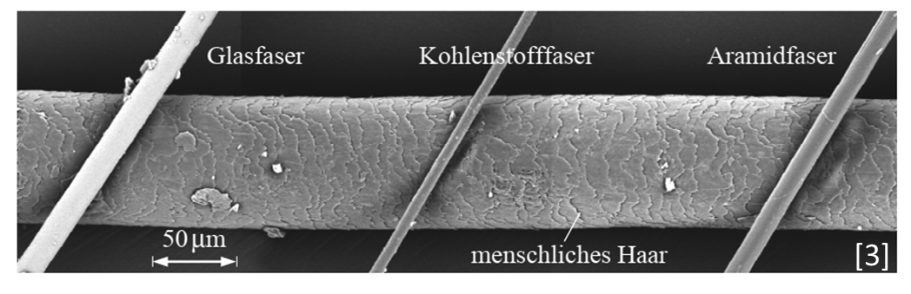

---

## Glasfaser

**Vorteile**
hohe Längs-Zug- sowie die hohe Längs-Druckfestigkeit
Eine hohe Bruchdehnung
aufgrund der niedrigen Fasersteifigkeit gute Drapierbarkeit, auch um enge Radien
die vollkommene Unbrennbarkeit
die sehr geringe Feuchtigkeitsaufnahme

---

## Glasfaser

**Vorteile**

die gute chemische und mikrobiologische Widerstandsfähigkeit. 
Kosten
**Nachteile**
der für viele Strukturbauteile zu niedrige Elastizitätsmodul der Glasfaser
Glasfasern sind unverrottbar (Vor- und Nachteil)

---

## Kohlefaser (C-Faser)

**Vorteil**
C-Fasern sind sehr leicht, ihre Dichte ($\rho_𝑓 \approx 1.8 g/cm^3$) liegt deutlich unter derjenigen von Glasfasern ($\rho_𝑓 \approx 2.54 g/cm^3$). 
extrem hohe Festigkeiten und sehr hohe Elastizitätsmoduln
beide mechanischen Größen sind zudem in weiten Bereichen bei der Herstellung der Fasern einstellbar
Exzellente Ermüdungsfestigkeit

---

**Nachteile**
Geringere Druckfestigkeit in Faserrichtung
Schlechtere Drapierbarkeit
Kosten
Elastizitätsmoduln in Faserlängs- und Querrichtung unterscheiden sich um eine Größenordnung (Vor- und Nachteil)

---

---

## Matrixmaterialien
- Faserverbundwerkstoffe können als Matrix auch Metalle, Beton, usw. haben

---

## Ausgangswerkstoffe FKV - Matrix

**Duroplastische Reaktionsharze**
- Epoxidharze, Phenolharze, Polyesterharze, Vinylesterharze, …
- Werden mit Reaktionsmittel für die Aushärtung gemischt
- Vorimprägnierte Fasern -> Prepregs
- Exotherm und volumenändernd beim Aushärten
**Thermoplaste**
- Polypropylen, Polyamid, Polyarylensulfide, …
- Schmelzen bei einer bestimmten Temperatur (55 °C – 155 °C)
- Teuer aber Recyclebar
- Schwieriger zu handhaben

---

## Verbund schematisch
**Symmetrien**
- Transversale Isotropie (Eigenschaften in 2 und 3 Richtung sind gleich)
- Orthotropie
- Anisotropie
**Faservolumenanteil $𝜑$**
Errechnet sich aus Mischungsregel
$𝜌= 𝜑𝜌_𝑓+(1- 𝜑) 𝜌_𝑚$
Steifigkeiten und Festigkeiten

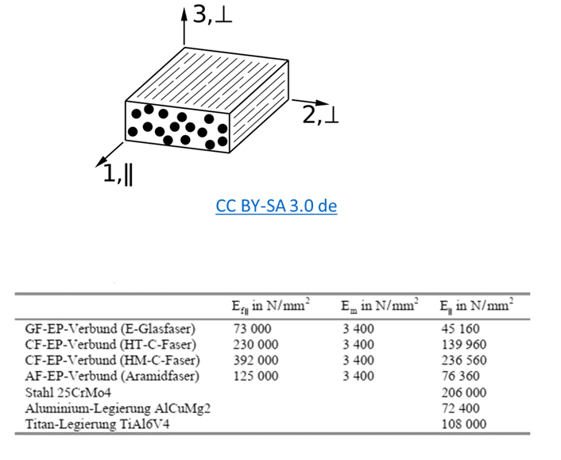

---

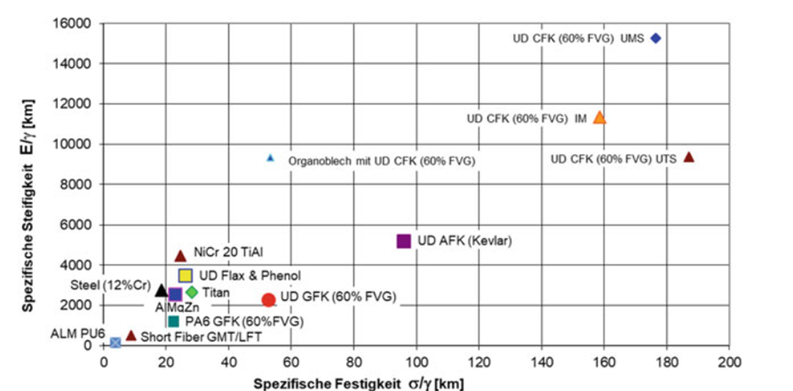

---

## Fertigung
Wahl des Verfahrens hängt ab von
- Der konkreten Anwendung
- Einsatzbedingungen
- Grundmaterial (Faser, Matrix)
- Stückzahl
- Kosten
- Betriebsicherheit
- …

---

## Fertigung - Verfahrensschritte
- Erstellen von Formwerkzeugen
- Zuschnitt und Ablage von Vorprodukten
- Aushärtung des Harzsystems
- Nachbearbeitung des Bauteils

---

## Formwerkzeug / Faserablage

- Gips
- Kunststoff
- Metallen
- Faserverbunden
- Thermaldehnung sollte kompatibel

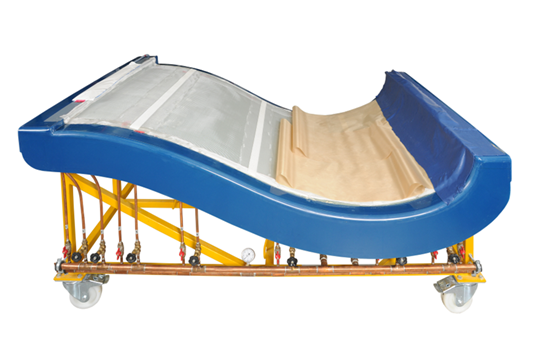

---
## Halbzeuge

- Handhabbarkeit
- Verringerung der Fertigungstiefe
- Erhöhung der Qualität
- Beispiele:
  - Gewebe
  - Gelege
  - Fliese, Matten
  - Kernmaterialien
  - Flechtschläuche
  - …

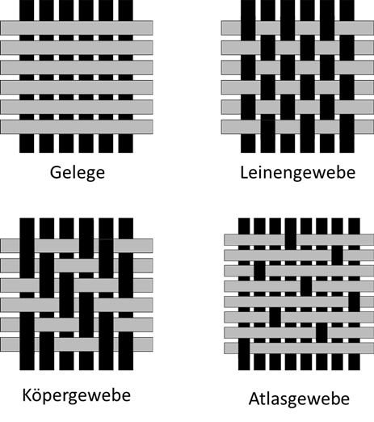
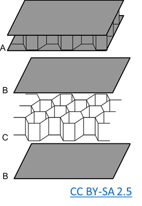

---

## Fertigung
Manuell
Faserablage
Handlaminieren
…
Wickeln
Spritzverfahren
Pultrusion
Pressen
RTM (Resin Transfer Moulding) Verfahren
Automatisierte Faserablageverfahren
…

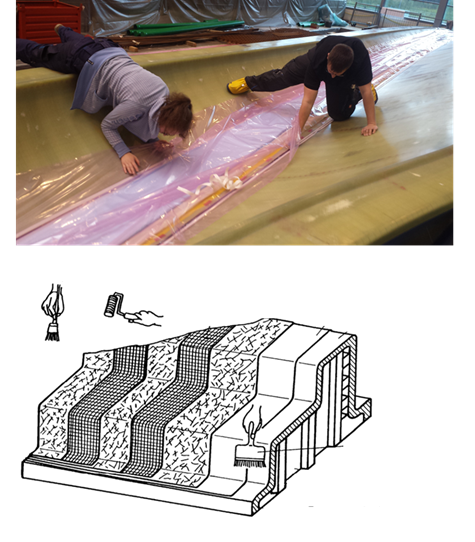

---

## Fertigung
Manuell
Faserablage
Handlaminieren
…

---

## Fertigung
Manuell
Faserablage
Handlaminieren
Wickeln
Spritzverfahren
Pultrusion
Pressen
...

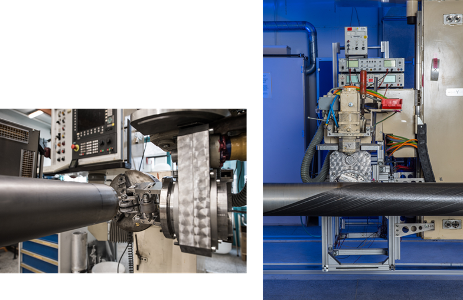

---

## Fertigung

Manuell
Faserablage
Handlaminieren
Wickeln
Spritzverfahren
Pultrusion
Pressen
RTM (Resin Transfer Moulding) Verfahren
...

---

## Fertigung
Manuell
Faserablage
Handlaminieren
Wickeln
Spritzverfahren
Pultrusion
Pressen
RTM (Resin Transfer Moulding) Verfahren
Automatisierte Faserablageverfahren
…

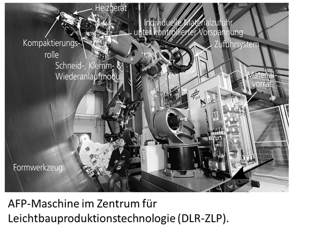

---

## Schäden in Faserverbunden
Nach Heslehurst können 52 Fehlertypen kategorisiert werden 
  - Einteilung nach Auftreten im Lebenszyklus
        - Materialprozess – Fehler die bei der Bereitstellung der Teilbestandteile auftreten
        - Komponentenfertigung – Fehler während der Kompositfertigung, welche während der Ablage, Aushärtung, Bearbeitung oder der Assemblierung auftreten
        - In-service Nutzung – im Betrieb auftretende Schäden
  - Einteilung nach Größe
      - Mikroskopisch 
      - Makroskopisch

---

## Delaminationen
- eine der häufigsten Schädigungen
- hohe interlaminare Spannungen durch 
- Querkontraktionseffekte
- Unterschiedliche Wärmedehnungen
- Kanten (Geometrie, Mikrorisse, Poren)
- Trennfolien

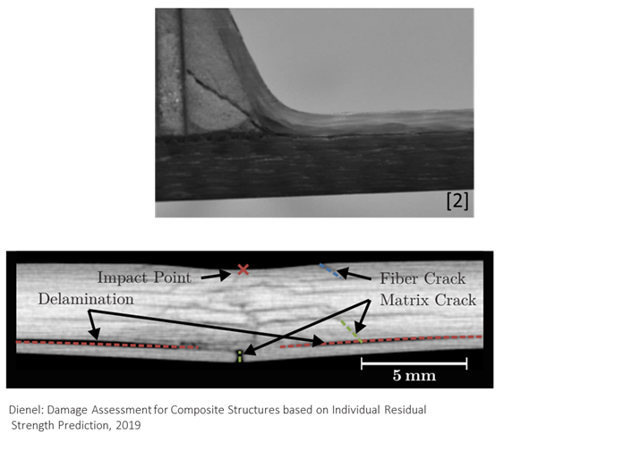

---

## Delaminationen

- Verschmutzungen
- Trennung zwischen zwei Lagen – interlaminarer Riss
- Feuchteeintritt
- Lebensdauerreduktion
- Stabilität

---

## Ablösungen

- Schlechte Prozesskontrolle
- Schlechte Passung
- Durch eintretenden Trennfilm
- Schlechte Oberflächenbehandlung (Verschmutzung, etc.)
- Relevant bei Kernanbindung und Verklebung von Komponenten

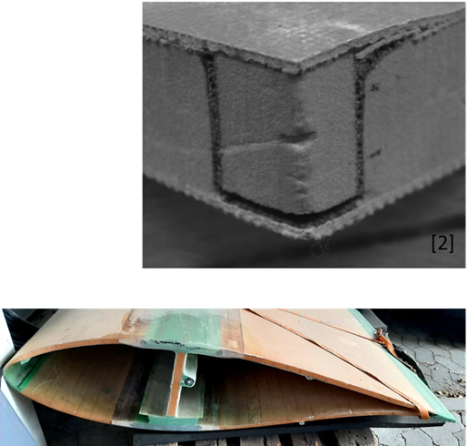

---

## Fehler an Verbindungsbohrungen

- Zu starkes Anziehen von Schrauben 
Oberflächenschädigung
- Lokale Beschädigung der ersten Lage
- Austrittsschäden bei Bohrungen
- Meist Splitterungen und lokale Delaminationen
- Splitter können bei Bohrungen zwischen zwei Komponenten verbleiben

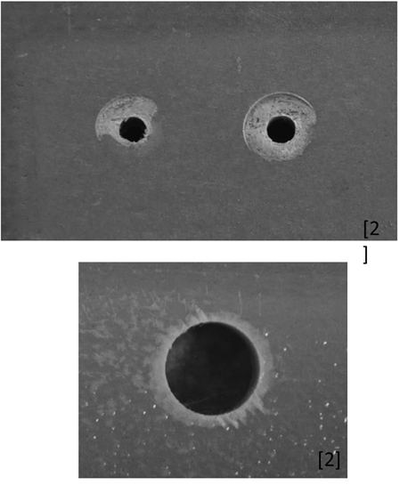

---

## Porosität

- Schlechte Material- und Prozesskontrolle
- Überaltertes Material
- Feuchtigkeit im Prepreg 
- Fehlfunktion im Autoklav

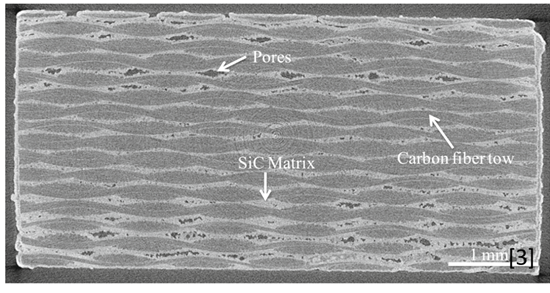

---

## Porosität

- Verschlechtert die Lageneigenschaften
- Auswirkung auf die Ermüdungslebens-dauer
- Konzentrationen von Poren wichtiger als Größe
- Wirkt sich auf die Dichtheit aus

---

## Vor- und Nachteile 
**Vorteile**
- Spezifische Materialeigenschaften
- Weitgehend elastisches Verhalten
- Hohe Festigkeiten und Steifigkeiten in Faserrichtung
- „maßgeschneidertes“ Material
- Alterung- und Korrosionsbeständigkeit

---
## Vor- und Nachteile
**Nachteile**
- Variantenreichtum
- Geringe Zugfestigkeit senkrecht zur Faser
- Schwierige Prüfung
- Recyclebarkeit
- Spezifische Materialeigenschaften und Verarbeitungsverfahren
