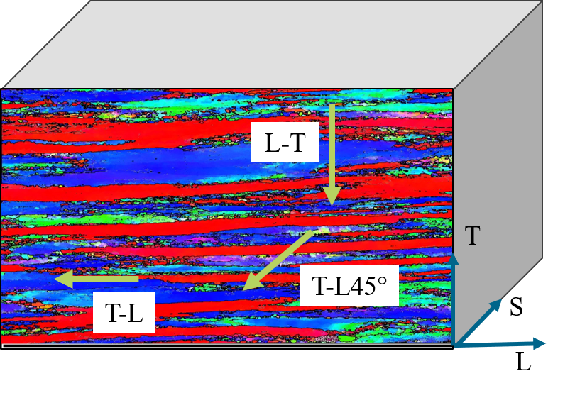
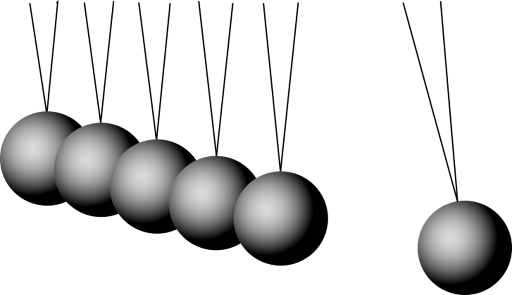
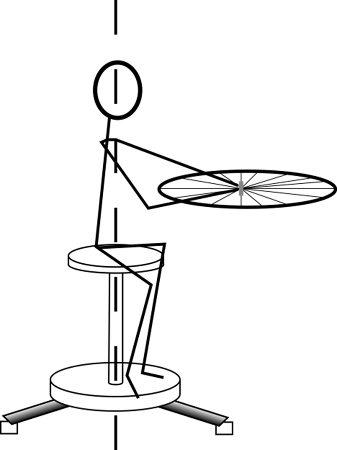
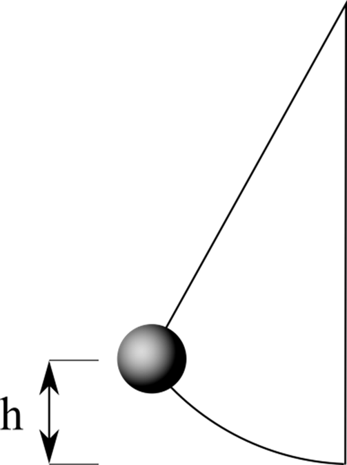
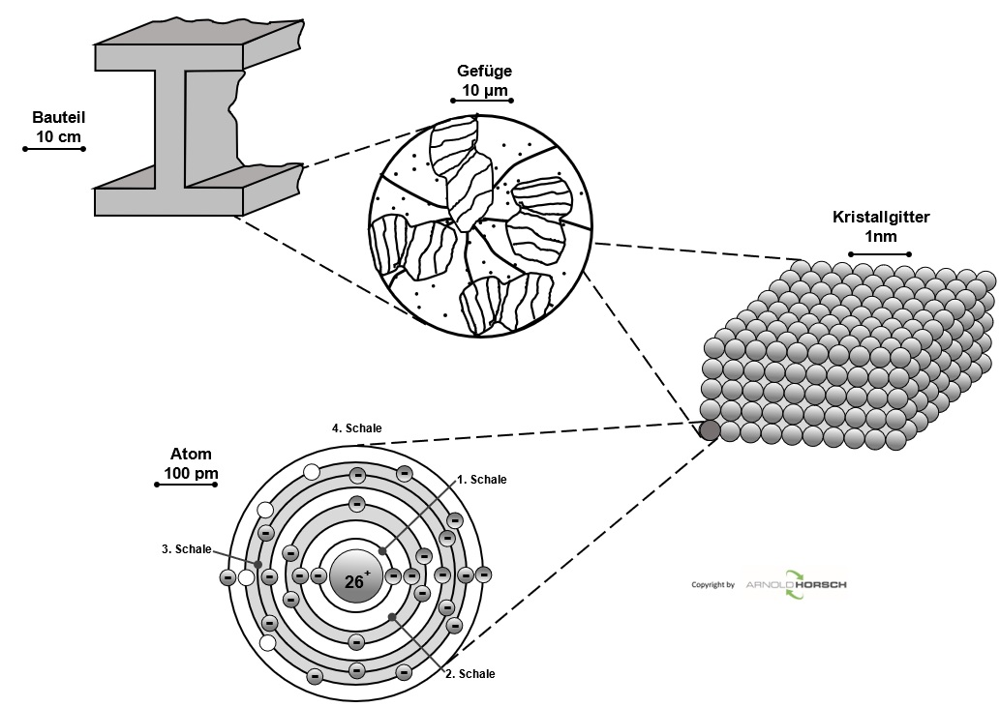
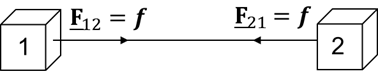
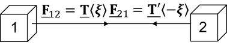

##  Non-local structural mechanics and Peridynamics
Prof. Dr.-Ing.  Christian Willberg
Magdeburg-Stendal university of applied sciences

Kontakt: christian.willberg@h2.de

---

<!--paginate: true-->

## Lecture

- analytical part by [Prof. Dr.-Ing. habil. Konstantin Naumenko](konstantin.naumenko@ovgu.de)
- Numerics and application by [Prof. Dr.-Ing. Christian Willberg](christian.willberg@h2.de)

---

---

---

---

---

Understanding of fractures is needed for
- reducing experiments
- fatigue prediction
- crack growth and residual strength estimation

---

## Assumptions in classical continuum mechanics

- Continuous medium		
- $\mathbf{u}$ 2x continuously differentiable	
- Conservation equations satisfied (momentum, angular momentum and energy)

---

**Conservation of Momentum**
$\text{div}\boldsymbol{\sigma}+\mathbf{b}=\rho\ddot{\mathbf{u}}$

---
## Implications 1D

truss with 2 areas

$\sigma_1 = \frac{F}{A_1}$, $\sigma_2 = \frac{F}{A_2}$

$\text{div}\sigma=\frac{d\sigma}{dx}$

no derivative exists at the position, where $A_1$ becomes $A_2$

---

---

## Reality is non-local

---

---

# Peridynamics (PD)

$\int_{\mathcal{H}}(\underline{\textbf{T}}(\textbf{x},t)-
\underline{\textbf{T}}(\textbf{x}',t))dV_{\textbf{x}}+\textbf{b} =\rho\ddot{\textbf{u}}$

- material point
- bond
- neighbor
- integral domain
- horizon
- deformed bond state
...

## PD is a continuum formulation!

---

| Model  | Conservation of Momentum | Conservation of Angular Momentum |
|---------|-------------------------|----------------------------------|
| bond-based | bond                      | bond                             |
| ordinary state-based | integral                    | bond                               |
| non-ordinary state-based | integral                      | integral                               |

---

---

## Software

---

<iframe src="https://perilab-results.nimbus-extern.dlr.de/models/Dogbone?step=36&variable=von%20Mises%20Stress" width="1150" height="600"></iframe>

---

<iframe src="https://perilab-results.nimbus-extern.dlr.de/models/DCB?step=65&variable=Damage&displFactor=200" width="1150" height="600"></iframe>

---

<iframe src="https://perilab-results.nimbus-extern.dlr.de/models/RVE?step=1&variable=Damage&displFactor=20" width="1150" height="600"></iframe>

---

<iframe src="https://perilab-results.nimbus-extern.dlr.de/models/Additive?step=1&variable=Temperature" width="1150" height="600"></iframe>

---

## Software

[PeriLab Repository](https://github.com/PeriHub/PeriLab.jl)

- install julia programming language
- start julia
- write in the console

using Pkg
Pkg.add("PeriLab")

---

## Application - run julia

using PeriLab

PeriLab.get_examples() (optional)
PeriLab.main("examples/DCB/DCBmodel.yaml") (run run model)

---

# Seminar
[Theory](https://perihub.github.io/PeriLab.jl/dev/theory/theory/)
[Examples for the seminar](https://perihub.github.io/PeriLab.jl/dev/lecture/lecture/)
[Results](https://perilab-results.nimbus-extern.dlr.de/)