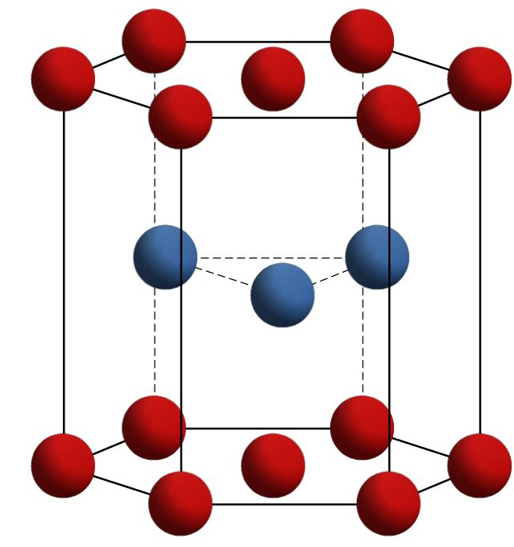
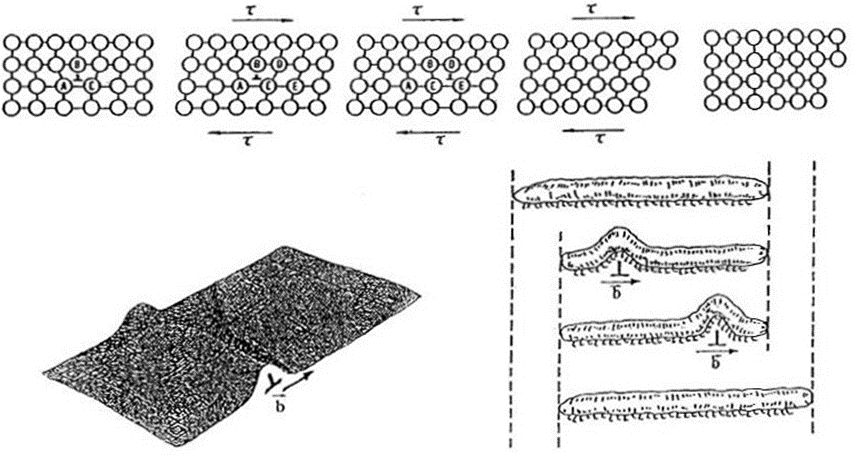

## Lecture Basics of Mechanical Engineering - Materials Science
Prof. Dr.-Ing. Christian Willberg
Magdeburg-Stendal University of Applied Sciences 

Contact: christian.willberg@h2.de
Parts of the script were taken from \
Prof. Dr.-Ing. Jürgen Häberle

 
    <a href="https://doi.org/10.1007/s42102-021-00079-6" style="color: blue;">Image Reference</a>

---

<!--paginate: true-->

# Lecture

**Framework**

- Eating or drinking is okay, but quietly
- Issues with childcare
- Everything stays in the room!
- Questions

---

## Content

- Materials
- Structure of materials
  - Atoms and bonds
  - Fine structure
  - Microstructure
- Material microstructure
- Plasticity

---

## Materials

What are materials?

Materials in the strict sense refer to solid substances used for manufacturing components and constructions.

---

## Application areas with images

- Metals
  - Iron Steel
  - Non-ferrous
- Plastics
- Ceramics
- Composites

---

## Cast Iron - Steel

---

## Non-ferrous Metals

- Copper is an excellent conductor of electricity and heat

---

- Magnesium is used in lightweight construction
- Titanium and titanium alloys
    - high strength and heat resistance
    - corrosion resistant
- Nickel
    - corrosion resistant
    - high heat resistance

---

## Ceramics

.jpg)

---

## Glasses

---

## Fiber-reinforced Composites

---

# Structure of Materials

---

-	Atomic structure (type of atomic components)
-	Fine structure (bonds between atomic components and their geometric arrangement)
-	Microstructure (grains – geometrically arranged areas separated by boundaries within the material)
-	Macrostructure (overall appearance of a material during manufacturing and use)

---

# Bonds

## Primary Bonds  
**Primary bonds - high bond energy, strong bond**
-	Ionic bond 
-	Covalent bond: polar (O-H) and nonpolar (C-C, C-H)
-	Metallic bond

---

## Metallic Bond

- Outer electrons (valence electrons) are weakly bound 
- A lattice of positively charged metal ions (atomic cores) is formed
- Outer electrons can move freely within the lattice, known as **electron gas** 
- Result: good electrical and thermal conductivity

---

---

## Relevant Quantities

**Atomic Number**
Number of protons in the nucleus
**Atomic Mass**
Defines the mass of the element
The mass of the material is a combination of atomic mass and density
**Electronegativity**
Determines whether atoms give or receive electrons in a bond
Metallic bonds tend to be on the left
Covalent bonds tend to be on the right

---

## Secondary Bonds 
**Secondary bonds - low bond energy, weak bond**
-	Van der Waals bond: intermolecular forces
-	Hydrogen bond: two molecules or two suitable parts of a macromolecule interact via hydrogen atoms
- Bond energies are one to two orders of magnitude smaller than those of covalent bonds.

---

| **Description** | **Ionic or heteropolar bond** | **Covalent bond (homopolar)** | **Metallic bond** |
|-----------------|-------------------------------|---------------------------------|-------------------|
| **Participating Components** | Ions (Metal + Nonmetal) | Same atom type (Nonmetal + Nonmetal) | Same atom type (Metal + Metal) |
| **Electrical charge state** | Positive ion + negative ion (Cation + Anion) | Atoms share electron pairs to achieve noble gas configuration | Atoms release their outer electrons to the entire structure; electrons move freely within the lattice |

---

| **Description** | **Ionic bond** | **Covalent bond** | **Metallic bond** |
|-----------------|-----------------|-------------------|-------------------|
| **Material properties** | Electrically conductive when dissolved, crystalline structure | Low electrical and thermal conductivity; high melting point | Excellent electrical and thermal conductivity, ductility; limited chemical resistance |
| **Examples** | Alkali metal compounds, halides (e.g., NaCl, MgO) | Diamond, methane (CH₄) (nonpolar), methanol (CH₃OH) (polar) | Copper (Cu), Aluminum (Al), Iron (Fe) |

---

## Atomic Structure

Composed of:
- Nucleus (protons + neutrons) defining the mass
- Shell (electrons) with different layers, defining chemical and many physical properties

---

---

### Fine Structure
- Crystal structures
- Molecular structures
- Glassy-amorphous structures
- Real structure

---

## Crystal Lattice

- Formed by a three-dimensional periodic shift of its components
- Characterized by three space axes x, y, and z, angles α, β, γ, and distances along the axes
- a0, b0, and c0 (lattice constants) -> unit cell

---

| Crystal System    | Lattice Constants      | Angles        | Examples                                                 |
|-------------------|------------------------|---------------|----------------------------------------------------------|
| Triclinic         | a₀ ≠ b₀ ≠ c₀            | α ≠ β ≠ γ ≠ 90°| Silicate minerals                                        |
| Monoclinic        | a₀ ≠ b₀ ≠ c₀            | α = γ = 90°; β ≠ 90°| Mo₂S₃; β-Pu                                               |
| Orthorhombic      | a₀ ≠ b₀ ≠ c₀            | α = β = γ = 90°| U, S, P, Ga, γ-Sn                                         |
| Rhombohedral      | a₀ = b₀ = c₀            | α = β = γ ≠ 90°| As, Hg, Sb                                                |
| Hexagonal         | a₀ = b₀ ≠ c₀            | α = β = 90°; γ = 120°| α-Ti, Mg, Zn                                              |
| Tetragonal        | a₀ = b₀ ≠ c₀            | α = β = γ = 90°| B, CuTi₃, Sn (T > 13.5°)                                 |

---

## Most Common Lattice Forms in Metals

| Crystal System    | Lattice Constants      | Angles        | Examples                                                 |
|-------------------|------------------------|---------------|----------------------------------------------------------|
| Cubic             | a₀ = b₀ = c₀            | α = β = γ = 90°| Cu, Al, Ni, Au, Ag; γ-Iron (fcc); α-Iron, V, Cr, W (bcc); Mn, Po (hcp) |

---

Cubic Face-Centered (fcc)

Cubic Body-Centered (bcc)

Hexagonal Close-Packed (hcp)

---

## Influences

- Corrosion: Aggressive media attack occurs at preferred planes
- Deformation: Plastic deformation occurs along preferred crystallographic planes and directions → Slip Systems
- Ultrasound: Use of oscillating crystals with specific crystallographic boundary surfaces
- Conductivity: Use of Germanium or Silicon wafers in (1 1 1)- or (1 0 0)-orientation for semiconductor elements
- Magnetization: Easiest magnetization of iron-silicon transformer sheets along the cube edge [1 0 0]

---

## Polymorphism in Metals

- Polymorphism: The formation of different lattice structures depending on temperature
- The different lattice forms are the allotropic modifications 

(also: Polymorphism of carbon: Graphite, Diamond, etc.).

---

## Determination of Transformation Points

_Dilatometry_
- Measurement of length changes due to lattice transformation

_Thermal Analysis_
- Recording the temperature progression
- Lattice transformations (phase changes) require or release thermal energy
- Plateau or inflection points in heating or cooling curves.

- Plateau points: in pure metals

---

---

## Molecular Structures

- Typical for non-metallic-organic materials
  - Natural materials: Wood, Rubber, Leather, Fibers, etc.
  - Synthetic plastics: PMMA, Epoxy, etc.

---

- Formed through polymerization reactions of monomeric building blocks into chain molecules
- Within the chains, covalent bonds occur
- Between the chains, secondary valence bonds and molecular entanglements exist

---

## Polymerization Reaction

- Free bonds must be created in the monomers
- The monomers "need" new partners to reach a new energetic minimum

---

## Chain Polymerizations

  - Splitting of C=C double bonds in the monomer (catalytic process through pressure, temperature, catalyst)
  - Linking the split monomers into macromolecules

---

## Step-Growth Reactions 

**Polycondensation**
- Removal of low-molecular (e.g., H2O) reaction products through a chemical reaction creates free bonds
- Stepwise reaction or interruption leads to the formation of linear, branched, or cross-linked polymers (thermoplastics, elastomers, or thermosets)  

---

**Polyaddition**
- Free bonds are created by rearrangement of double bonds between different monomer molecules
- These then form molecular chains

---

## Glassy-Amorphous Structures

- Glasses are non-metallic inorganic, preferably silicate melt products
- Non-crystalline, i.e., amorphous state
- In glass, the melt is first undercooled and then "frozen" below the transformation temperature Tg. 

---

# Real Structure of Crystals
## Lattice Defects

- Zero-Dimensional Defects (Point Defects): Vacancies, interstitial atoms, interstitial foreign atoms, substitutional foreign atoms
- One-Dimensional Defects (Line Defects): Dislocations
- Two-Dimensional Defects (Plane Defects): Stacking faults, grain boundaries, subgrain boundaries, phase boundaries

---

## Zero-Dimensional Defects

What are the possible variants?

- Interstitial atoms
- Vacancies
- Frenkel type (occurrence of the same number of interstitial atoms and vacancies)
- Substitutional foreign atom
- Interstitial foreign atom 

---

## Foreign Atoms

How can foreign atoms be used?

- [Doping](https://de.wikipedia.org/wiki/Dotierung) in semiconductors
    - Targeted manipulation of electrical conductivity by introducing additional atoms
- Interstitial and substitutional foreign atoms
    - Increased strength through natural "crack stop" or locally easier slip and local reduction of stresses

---

## Dislocations

[Dislocations](https://de.wikipedia.org/wiki/Versetzung_(Materialwissenschaft)) arise
- During crystal growth
- Due to residual stresses
- Through plastic deformations

---

## Two-Dimensional Defects - Grain Boundaries
- Grain boundaries
- Phase boundaries
- Subgrain boundaries

[Skript](https://cwillberg.github.io/Werkstofftechnik/dev/Skript/svw/gitterbaudefekte/)

---

## Plasticity

Good or Bad

---

## Examples

**High Plasticity**:

- Modeling clay
- Wet clay
- Metals and metal alloys with suitable atomic lattice:
  - Hot steel during forging
  - Cold forming of sheets 

**Low Plasticity**:
  - Rubber
  - Ceramics
  - Fiber-reinforced composites (epoxy-glass fiber or epoxy-carbon fiber)
   
---

## Plasticity - Single Crystal

Plastic deformation of a crystal essentially occurs through the sliding of atomic layers along specific crystallographic planes and directions under the influence of shear stresses.

- Slip system consists of slip plane and slip direction
- Critical shear stress ($\tau_{Kr}\approx G/10$ - estimation or theoretical shear strength)
- Reality ~100 times lower due to dislocations

---

## Image

  
---

## Plastic Deformation of Polycrystalline Materials

- Micro- and Macroplasticity
  - Plastic deformation starts at "unfavorable" orientations
- Grain boundaries
  - Barrier for dislocation movement
  - At high temperatures, grain boundaries can slide (creep)
  - Targeted manufacturing can increase toughness through grain boundaries
- Heterogeneity
  - Multiphasic
  - Inhomogeneous distribution of stresses and deformations
- Anisotropy

---

## Polycrystal Plasticity
[Example from a simulation](https://www.youtube.com/watch?v=mWanREXKLO4)

---

## Yield Strength

- $R_m$ - Tensile Strength
- $R_e$ - Yield Strength
- Elongation limit or yield strength $R_{p0,2}$
  - Loading and then unloading, 0.2% elongation remains
- Elongation limit is used as a substitute for yield strength

---

## Yield Strength

- Upper yield strength $R_{eH}$
- Lower yield strength $R_{eL}$
>Zigzag area: Lüders band

[Example Video](https://youtu.be/E80yUNniESU?si=pqGRAWamxFQedWqw&t=95)

---

## Plasticity - Forming
- [Deep Drawing Principle](https://www.youtube.com/watch?v=Zbfld_851z0)
- [Deep Drawing Real](https://www.youtube.com/watch?v=rHfepOqPVHI)
