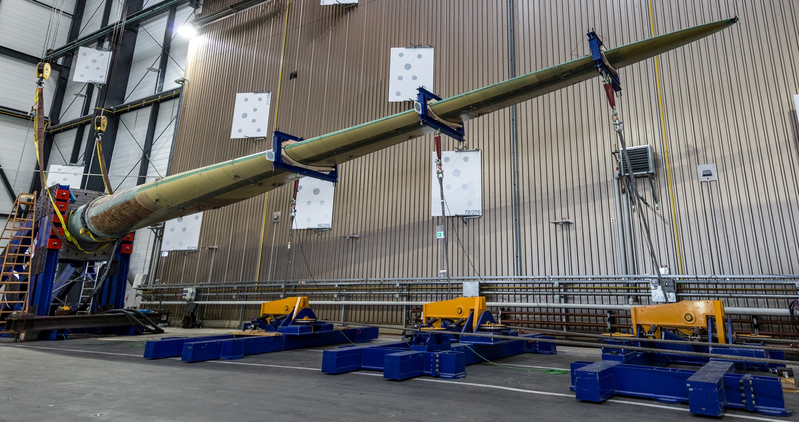
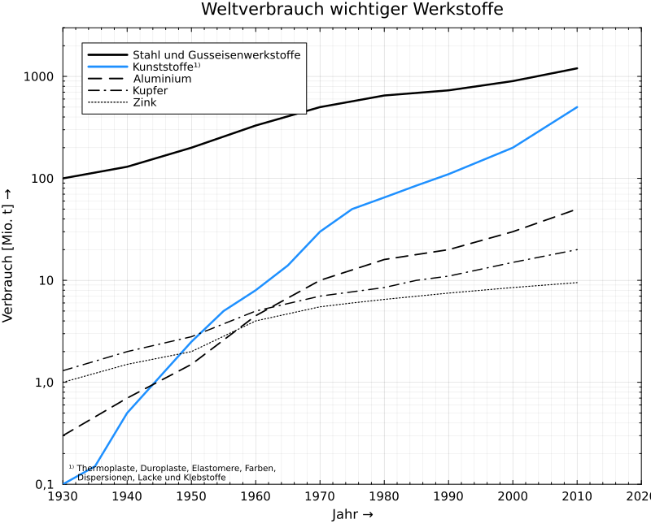
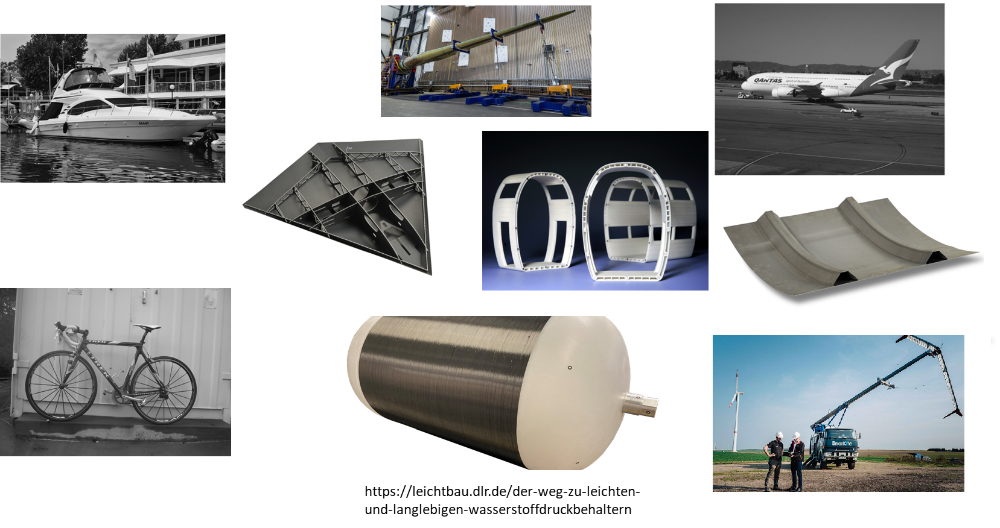
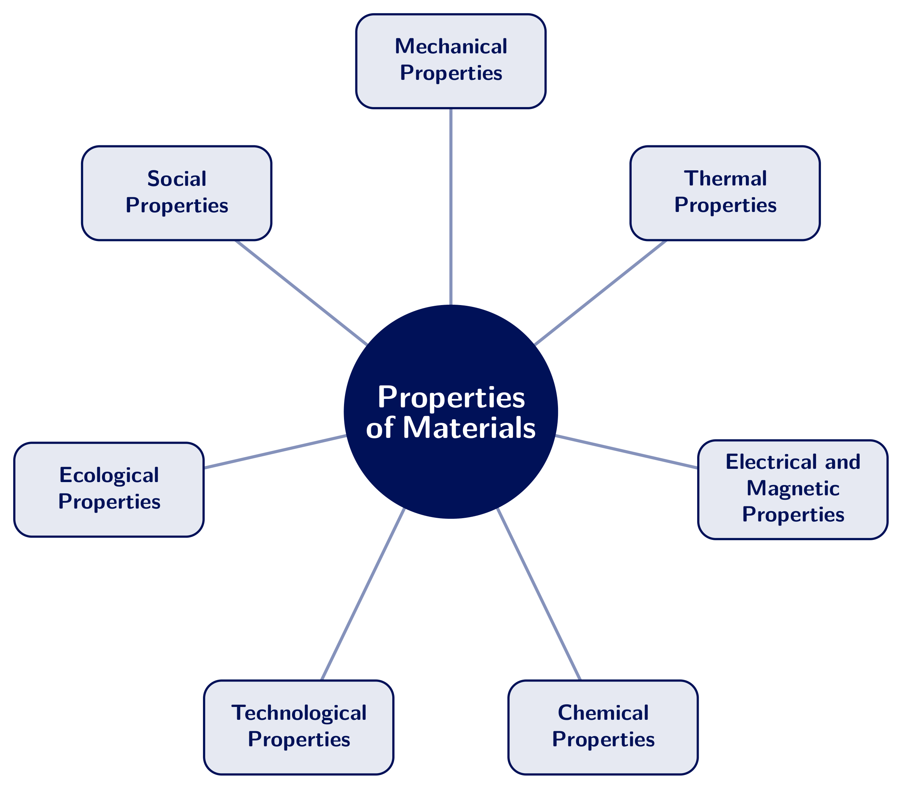
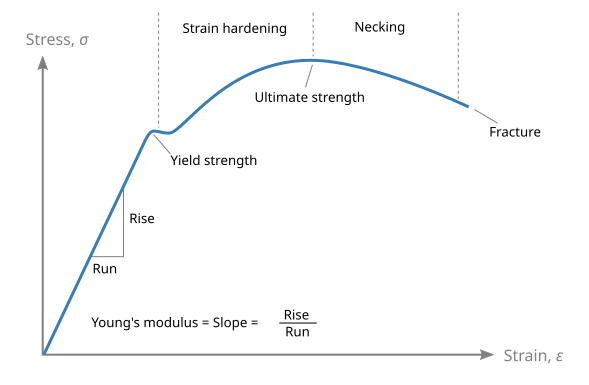
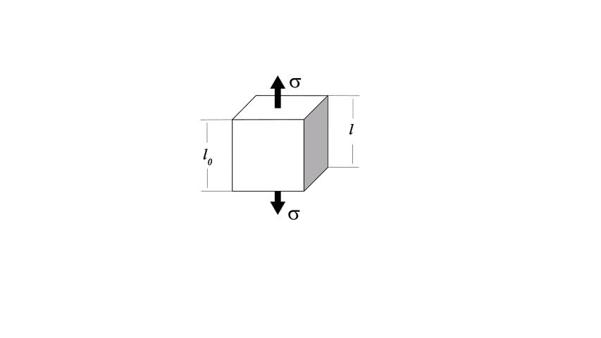
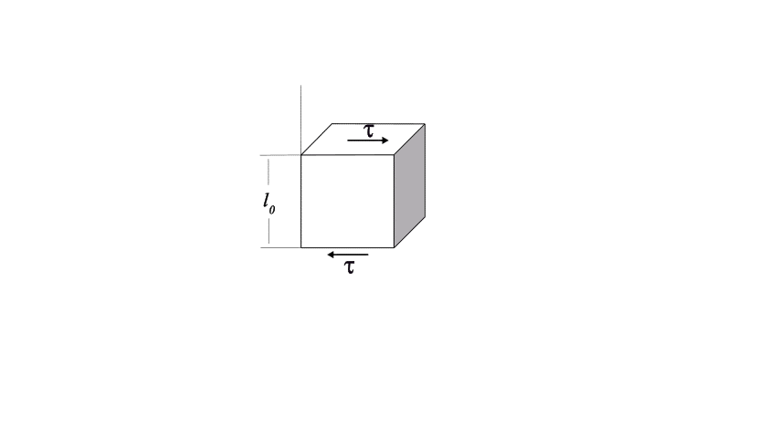
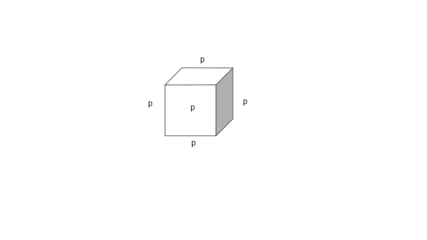

## Materials-and-Production-Engineering - Materials
Prof. Dr.-Ing.  Christian Willberg 
Hochschule Magdeburg-Stendal

Contact: christian.willberg@h2.de
Parts of the script are adopted from \
Prof. Dr.-Ing. Jürgen Häberle

 
    <a href="https://doi.org/10.1007/s42102-021-00079-6" style="color: blue;">Image reference</a>

---

<!--paginate: true-->

## Lecture

**Framework**

- Food or drinks are okay, but quiet
- Problems:
    - with childcare
    - disadvantage compensation
    - discrimination
    - language-related
    - ...
- Questions

 

---
## Organization
- [2 lab sessions](https://moodle2.hs-magdeburg.de/moodle/course/view.php?id=4605)
    - Tensile test
    - Hardness test
    - Participation is a prerequisite for admission to the exam
- Exam: 40 minutes
- Questions by email; consultations on request

---

## Content according to the module handbook

- Classification of materials
- Material properties
- Material structure, microstructure, alloys, lattice defects
- Ideal and real phase diagrams, equilibrium and
non-equilibrium states
- Heat treatment, hardening processes
- Lab: tensile test, hardness test

---

# Context
## Why materials engineering, right now?
Climate, sustainability, and what that means for engineers

---

## The climate - global situation

- **2024**: first calendar year more than **1.5 °C** above pre-industrial levels (Copernicus)
- The last ten years are the warmest since records began
- Paris Agreement: warming well below 2 °C, ideally 1.5 °C

Sources: <a href="https://climate.copernicus.eu/global-climate-highlights-2024">Copernicus Global Climate Highlights</a> |
<a href="https://www.ipcc.ch/report/ar6/syr/">IPCC AR6</a> |
Warming Stripes: <a href="https://showyourstripes.info/">showyourstripes.info</a>

---

## The climate - Germany

- Annual mean temperature since 1881: **approx. +1.8 °C** - stronger than the global average
- Record: **41.2 °C** (Lingen, July 2019)
- Hot days (≥ 30 °C): from about 3 per year (1950s) to around 10 per year today
- More heavy rainfall, longer dry and heat periods
- Fewer frost days, but freeze-thaw cycles continue

<!-- Tip: embed Germany's Warming Stripes from showyourstripes.info as a background image -->

Sources: <a href="https://www.dwd.de/DE/klimaumwelt/klimawandel/klimawandel_node.html">Deutscher Wetterdienst</a> |
<a href="https://www.umweltbundesamt.de/themen/klima-energie/klimafolgen-anpassung">Umweltbundesamt - Climate impacts</a>

---

## Extreme weather - examples from Germany

| Event | Consequences related to materials |
|:---|:---|
| Elbe floods 2002 and 2013 (incl. Magdeburg) | Dikes, bridges, buildings, corrosion and moisture ingress |
| Heat and drought summers 2018, 2019, 2022 | Rail buckling, road damage, low water levels |
| Low water on the Rhine 2018 | Transport problems, reduced chemical production |
| Ahr valley flood 2021 | Destroyed bridges and infrastructure, more than 180 deaths |
| Hailstorms | Damage to PV modules, vehicles, façades |

---

## Two sides of the same coin

**1. Materials production drives climate change and causes ecological and social harm**
- Producing steel, cement, aluminium, and plastics is extremely energy- and CO₂-intensive
- Whoever selects materials decides about emissions
- Raw material extraction often happens under inhumane conditions, e.g. child labour in small-scale cobalt mining (DR Congo)

---

**2. Climate change is changing the requirements on materials**
- Higher temperatures, more extreme weather
- Materials must cope with the changed conditions - components designed today will still be in service in 2050-2080
- Yesterday's technical standards and design values don't automatically fit tomorrow's climate, and don't capture social aspects

---

## The social and ecological side of raw materials

| Raw material | Use | Problem |
|:---|:---|:---|
| Cobalt (DR Congo) | Batteries, superalloys | Child labour and lacking occupational safety in small-scale mining |
| Lithium (e.g. Atacama) | Batteries | Water consumption in arid regions, conflicts with indigenous communities |
| Bauxite / aluminium | Lightweight design | Red mud, land use |
| Iron ore | Steel | Tailings dam failures (Brumadinho, Brazil 2019: around 270 deaths) |
| Rare earths | Magnets (wind power, e-motors) | Radioactive and chemical residues |

**Regulation - still being built up**
- Supply Chain Due Diligence Act (LkSG) in Germany, EU Corporate Sustainability Due Diligence Directive (CSDDD)
- Due diligence obligations for raw materials under the EU Battery Regulation
- Scope and timelines are currently being weakened or delayed in places

Sources: <a href="https://www.amnesty.org/en/documents/afr62/3183/2016/en/">Amnesty International (2016): This is what we die for</a> |
<a href="https://www.bafa.de/DE/Lieferketten/lieferketten_node.html">BAFA - LkSG</a>

---

## Europe and Germany - the policy framework

**EU**
- **2030**: -55 % greenhouse gases (vs. 1990)
- **2050**: climate neutrality
- CO₂ border adjustment **CBAM**: liable to payment since 2026 for steel, aluminium, cement, fertilizer, etc.
- Ecodesign for Sustainable Products Regulation (ESPR): durability, repairability, recycled content, digital product passport
- Battery Regulation: battery passport from 2027, recycling quotas

**Germany (Climate Protection Act)**
- **2030**: -65 %, **2040**: -88 %, **2045**: climate neutrality

Sources: <a href="https://climate.ec.europa.eu/">EU Climate Action</a> |
<a href="https://taxation-customs.ec.europa.eu/carbon-border-adjustment-mechanism_en">EU CBAM</a> |
<a href="https://www.bundesregierung.de/breg-de/aktuelles/klimaschutzgesetz-2197410">German Federal Government - KSG</a>

---

## Carbon footprint of materials

| Material | CO₂-equivalent per kg (primary, rough) | With recycling |
|:---|:---|:---|
| Steel (blast furnace) | approx. 2 kg | Electric-arc steel from scrap: approx. 0.4-0.7 kg |
| Aluminium | approx. 8-16 kg (strongly electricity-dependent) | Secondary aluminium: approx. 0.5-1 kg |
| Cement | approx. 0.6-0.9 kg | - |
| Plastics (PE, PP) | approx. 2-3 kg | Mechanical recycling significantly less |
| Carbon fibres | approx. 20-40 kg | Recycled fibres significantly less |

**Recycling is not optional extra credit - it is one of the most effective levers an engineer has to cut a component's carbon footprint**, often more effective than optimizing the manufacturing process itself.

Sources: <a href="https://www.ipcc.ch/report/ar6/wg3/chapter/chapter-11/">IPCC AR6 WGIII Ch. 11</a> |
<a href="https://www.worldsteel.org/">worldsteel</a> |
<a href="https://european-aluminium.eu/">European Aluminium</a>

---

## Circular economy in materials engineering

- **Design for disassembly**: joints and material combinations that can be separated again (e.g. bolted instead of glued/mixed-material laminated)
- **Material passports**: digital record of composition, origin, and recyclability, required by the EU from 2027 (batteries) onward
- **Closed-loop vs. open-loop recycling**: closed-loop keeps material quality (e.g. can-to-can aluminium); open-loop downgrades it (e.g. mixed plastics to lower-grade products)
- Material choice today determines whether a component can even re-enter the loop at end of life

---

# What does heat mean for materials?
Key material properties are **temperature-dependent**

---

## Temperature changes (almost) all properties

- **Elastic modulus and strength** decrease with increasing temperature
- **Creep**: permanent deformation under constant load - in plastics already at room temperature, in metals at high temperatures
- **Glass transition temperature $T_g$**: plastics soften above this point (e.g. PVC approx. 80 °C)
- **Thermal expansion**: constrained expansion generates stresses
- **Ageing and corrosion** accelerate

---

## How hot does it actually get?

Air temperature ≠ component temperature

| Component | Air 35 °C, sun | Consequence |
|:---|:---|:---|
| Rail | above 60 °C | Rail buckling |
| Asphalt | 50-70 °C | Rutting, softening |
| PV module | 60-80 °C | Loss of efficiency and lifetime |
| Car interior (dashboard) | 80-100 °C | Plastics near $T_g$, outgassing |
| Battery cell without cooling | critical from approx. 45-60 °C | accelerated ageing |

---

## Not just climate: ageing infrastructure

**Collapse of the Carola bridge in Dresden (September 2024)**
- Cause according to the expert report: **stress corrosion cracking** in the prestressing steel, promoted by chloride ingress
- Many German bridges from the 1960s-80s use similar materials
- Material failure often gives **no visible warning**

Questions for the future:
- How do heat, moisture, and salt change service life?
- How do we monitor components (monitoring, non-destructive testing)?

---

## Where is this heading?

**Material selection is becoming multi-dimensional**
- ~~strength and cost only~~ → strength + cost + **CO₂** + **circularity** + **climate resilience**

**Technological trends**
- Green steel, secondary aluminium, low-CO₂ cement
- Lightweight design (fibre composites, high-strength steels) for mobility and wind energy
- Hydrogen technology: materials resistant to **hydrogen embrittlement**
- Materials for higher temperatures and longer service life
- Design for recycling, digital product passport
- Simulation and digital twins for service-life prediction

---

## What does this mean for you?

- Always read design values together with their **boundary conditions**: temperature, moisture, time, loading rate
- Design for the **entire service life** - and for the climate the component will actually operate in
- The material choice accounts for a large share of a product's carbon footprint
- **Recyclability and disassembly should be design criteria from day one**, not an afterthought once the part already exists
- These are exactly the fundamentals you will learn in this course: properties, microstructure, heat treatment, testing

---

## Materials

What are materials?

[Materials in the narrow sense are solid-state materials that can be used to make components and constructions.](https://de.wikipedia.org/wiki/Werkstoff)

---
## Application areas

- Metals
  - Iron, steel, cast iron
  - Non-ferrous metals
- Plastics
- Ceramics
- Composite materials

---

---

## Cast iron - steel

---

## Non-ferrous metals

- Copper is a very good electrical and thermal conductor

---

- Magnesium is used in lightweight construction
- Titanium and titanium alloys
    - high strength and heat resistance
    - corrosion resistant
- Nickel
    - corrosion resistance
    - high heat resistance

---

## Ceramics

---

## Glasses

---

## Fibre composites

---

# Properties of materials
**What kinds are there?**

---

## Overview

---

## Mechanical properties

Behaviour under mechanical loading

- Strength, stiffness, hardness
- Ductility, toughness
- Fatigue and wear behaviour

*Covered in more depth later in this course*

---

## Thermal properties

Behaviour under the influence of temperature

- Thermal conductivity, thermal expansion
- Specific heat capacity
- Melting and glass transition temperature

---

## Electrical and magnetic properties

- Electrical conductivity / resistivity
- Dielectric behaviour
- Magnetic permeability (e.g. ferromagnetic, paramagnetic)

---

## Chemical properties

- Corrosion resistance
- Reactivity, resistance to media (acids, alkalis, solvents)
- Oxidation behaviour

---

## Technological properties

How well can a material be processed?

- Formability, machinability
- Weldability, castability
- Hardenability

---

## Ecological properties

- Carbon footprint of production and recycling
- Resource consumption, circularity
- Environmental impact over the life cycle

*Covered in more depth in the context section of this course*

---

## Social properties

- Origin and extraction conditions of raw materials
- Working conditions in the supply chain
- Conflict minerals, human rights

*Covered in more depth in the context section of this course*

---

# Mechanical properties
What are important properties from an engineer's perspective?

---

# Mechanical properties
What are important properties from an engineer's perspective?
- Material behaviour without damage
- Fatigue behaviour
- Wear behaviour
- temperature resistance
- strength
- when does damage occur
- Resistance to environmental effects (moisture, UV, corrosion)
- Carbon footprint and recyclability
- ...

---

## Stress-strain concept
- Covered in detail in engineering mechanics
$\varepsilon$ - strain
$\sigma$ - mechanical stress

---

## 1D strains
$$\varepsilon = \frac{\Delta l}{l}$$

Example:
$l_0 = 1m$
$l_1 = 1.01m$
$$\varepsilon = \frac{l_1-l_0}{l_0}=0.01\rightarrow 1\%$$

---

## Thermal strain

$$\varepsilon_{th} = \alpha \cdot \Delta T$$

$$\varepsilon_{total} = \varepsilon_{mechanical} + \varepsilon_{th}$$

| Material | $\alpha$ [$10^{-6}$/K] |
|:---|:---|
| Steel | 12 |
| Aluminium | 23 |
| Concrete | 10-12 |
| Thermoplastics | 50-150 |
| CFRP (in fibre direction) | approx. 0 |

- Different $\alpha$ in joints and connections → stresses at every temperature change

---
## 1D stresses

$$\sigma = \frac{F}{A}$$

Example:
$F = 100N$
$A = 20mm^2$
$$\sigma = \frac{F}{A} = \frac{100 N}{20 mm^2} = 5 \frac{N}{mm^2}$$

---

# More dimensionality

---

## Symmetries
- isotropy
- transverse isotropy
- orthotropy
- ...
- anisotropy

<!---
- Discussion: properties can be direction-dependent
- Practical examples
-->

---

## Mechanical properties

- **Reversible** deformation, where the deformed material returns to its original shape immediately or after some time once the external load is removed: elastic and viscoelastic deformation;

- **Irreversible (permanent)** deformation, where the shape change remains even after the external load is removed: plastic and viscous deformation;

- Fracture, i.e. a separation of the material caused by the formation and propagation of cracks.

---
## Steel example

[Curve determination](https://youtu.be/WWAb7Q5DAYw?si=fcnLckvNurSh0LC5)

[Steel data sheet](https://www.stauberstahl.com/fileadmin/Downloads/werkstoffe/Werkstoff-1.2842-Datenblatt.pdf)

 
    <a href="https://commons.wikimedia.org/w/index.php?curid=89891144" style="color: blue;">By Nicoguaro - Own work, CC BY 4.0</a>

---
# Material behaviour - reversible
## Elasticity
- reversible, energy-conserving
- Hooke's law, 1D
Normal stress $\sigma = E\varepsilon$
Shear stress $\tau = G\gamma$

---

## Fundamentals

- Normal strain [-]
$\varepsilon_{mechanical} = \frac{l - l_0}{l_0}$

- Normal stress $\left[\frac{N}{m^2}\right]$, $[Pa]$
$\sigma = \frac{F}{A}=E\varepsilon$
E - elastic modulus, Young's modulus $\left[\frac{N}{m^2}\right]$

- Relevant e.g. for deformation analyses

---

## Fundamentals - lateral contraction

- Poisson's ratio [-]
- $\nu = -\frac{\varepsilon_y}{\varepsilon_x}$
for homogeneous materials $0\leq\nu\leq 0.5$
for heterogeneous materials other values are conceivable

- Relevant e.g. for press fits

---

## Fundamentals - shear

- Shear strains [-]
$\varepsilon = \frac12(\frac{u_x}{l_0}+\frac{u_y}{b_0})=\frac{\gamma}{2}$

- Shear stress $\left[\frac{N}{m^2}\right]$, $[Pa]$
$\tau = \frac{F_s}{A}= G\gamma$

- Normal and shear stresses are not directly comparable; hence equivalent stresses
- G - [shear](https://de.wikipedia.org/wiki/Kompressionsmodul#Umrechnung_zwischen_den_elastischen_Konstanten_isotroper_Festk%C3%B6rper) modulus, shear modulus $\left[\frac{N}{m^2}\right]$
$G = \frac{E}{2(1+\nu)}$

- Relevant e.g. for torsion (drive trains, torsion springs)

---

## Fundamentals - compression

$\sigma_h = p = -K \cdot \frac{\Delta V}{V_0}$

$\varepsilon_v = \frac{\Delta V}{V_0} = \varepsilon_1 + \varepsilon_2 + \varepsilon_3$

[Bulk modulus](https://de.wikipedia.org/wiki/Kompressionsmodul#Umrechnung_zwischen_den_elastischen_Konstanten_isotroper_Festk%C3%B6rper) $K = \frac{E}{3(1-2\nu)}$

- Relevant e.g. for hydraulics

---

| Material                          | E [GPa]   | G [GPa] | ν [-]     |
|:----------------------------------|:----------|:--------|:----------|
| Unalloyed steel                   | 200       | 77      | 0.30      |
| Titanium                          | 110       | 40      | 0.36      |
| Copper                            | 120       | 45      | 0.35      |
| Aluminium                         | 70        | 26      | 0.34      |
| Magnesium                         | 45        | 17      | 0.27      |
| Tungsten                          | 360       | 130     | 0.35      |
| Cast iron with lamellar graphite  | 120       | 60      | 0.25      |
| Thermoplastics/thermosets         | 2-5       | 1-2     | ca. 0.35  |
| Elastomers                        | 0.1       | 0.03    | 0.45-0.49 |
| Plywood                           | 4-16      | -       | -         |

Note: values apply at **room temperature**. For plastics, E can drop significantly between 20 °C and 60 °C.

---

## Stiffness

How do material properties relate to stiffness?

- Material $\cdot$ cross-section = stiffness
- Axial stiffness = $EA$
- Bending stiffness = $EI$
- Torsional stiffness = $GI_P$

 
    <a href="https://doi.org/10.3390/en14092451" style="color: blue;">Image reference</a>

---

## Viscous behaviour

- irreversible
- time-dependent, strain-rate-dependent

Spring model $\sigma = E\epsilon$ 
 - elastic component
 - represented by spring elements

 
    

 
    

Damper  $\sigma = \eta\dot{\epsilon}=\eta\frac{\partial \epsilon}{\partial t}$ 
- viscous component
- represented by damper elements

---
- fast loading -> behaviour is elastic
- slow loading -> material flows
- [fast loading](https://en.wikipedia.org/wiki/File:Sillyputty.ogv)
- Viscosity $\eta$ decreases with increasing temperature → in summer things flow faster (asphalt, plastic parts, adhesive joints)

---

## Hardness

Resistance of a material to the penetration of a harder test body

**Depends on:**
- bond type and bond strength
- crystal structure
- microstructure and grain size
- alloying elements
- heat treatment

**Significance:**
- wear resistance
- machinability

---

# Material behaviour - irreversible

---

## Strength

[The strength of a material describes the load-bearing capacity under mechanical loads before failure occurs, and is given as mechanical stress $\left[N/m^2\right]$. Failure can be an **unacceptable deformation**, in particular a **plastic (permanent) deformation**, or a **fracture**.](https://de.wikipedia.org/wiki/Festigkeit)

>Important: strength $\neq$ stiffness

---

## Plasticity

- [Forging](https://youtu.be/AxLszR6fkLM?si=k6A9aOVfQceOK9v0&t=80)
- [Rolling](https://www.youtube.com/watch?v=WOTO64HgnXc)

---

## Ductility

### Reduction of area (necking)

$$Z = \frac{A_0 - A_f}{A_0} \cdot 100\%$$

- A₀ = initial cross-sectional area [mm²]
- A_f = cross-sectional area at fracture [mm²]
- Z = reduction of area [%]

The reduction of area describes the **relative decrease in cross-section** of a material under tensile loading up to fracture.

---

## Ductility assessment

### Interpretation of the reduction of area

| Z-value | Ductility | Material behaviour |
|--------|------------|-------------------|
| Z < 5% | Brittle | Ceramics, cast iron |
| 5% ≤ Z < 20% | Moderately ductile | High-strength steels |
| 20% ≤ Z < 50% | Ductile | Structural steels |
| Z ≥ 50% | Highly ductile | Pure copper, aluminium |

---

## Significance

**High reduction of area (Z > 40%)** means:
- material can withstand large plastic deformations
- good formability (forging, deep drawing)
- fracture warning through visible necking
- high energy absorption before failure

**Low reduction of area (Z < 10%)** means:
- brittle failure without warning
- low formability
- little energy absorption

---

## Toughness (fracture work)

**True strain and stress**

$$\varepsilon_{true} = \ln\left(\frac{L}{L_0}\right) = \ln(1 + \varepsilon_{nom})$$

$$\sigma_{true} = \sigma_{nom} \cdot (1 + \varepsilon_{nom}) = \frac{F}{A}$$

- F = force
- A = current cross-sectional area

---

### Toughness as energy absorption

$$U = \int_0^{\varepsilon_f} \sigma_{true} \, d\varepsilon_{true}$$

- U = specific toughness [J/m³]
- ε_f = fracture strain

 
    <a href="https://commons.wikimedia.org/w/index.php?curid=89891144" style="color: blue;">By Nicoguaro - Own work, CC BY 4.0</a>

---

A tough material combines:
- **high strength** (σ) → withstands high stresses
- **high ductility** (ε) → deforms significantly before fracture

**Toughness = a material's ability to survive under extreme conditions**

---

## Toughness values of typical materials

| Material | Toughness [MJ/m³] | Characteristic |
|----------|-------------------|----------------|
| Glass | 0.01 | Extremely brittle |
| Cast iron | 1-3 | Brittle |
| High-strength steel | 50-100 | Strong, moderately ductile |
| Structural steel | 100-200 | Optimally tough |
| Aluminium | 70-200 | Light and tough |
| Copper | 200-400 | Highly ductile |
| Rubber | 10-100 | Elastic-ductile |

---

## Recap: climate and design values

- Stiffness, strength, ductility, and toughness all depend on **temperature** and **time**
- Heat → creep, softening, faster ageing
- Cold → embrittlement (e.g. steels below the transition temperature)
- Temperature cycling → thermal stresses and fatigue
- **Sustainable design = the right material + long service life + circularity**

---

## References

Rainer Schwab: Werkstoffkunde und Werkstoffprüfung für Dummies, 2019; ISBN-10 352771538X

Deutscher Wetterdienst: Klimawandel in Deutschland, https://www.dwd.de

Copernicus Climate Change Service: Global Climate Highlights 2024, https://climate.copernicus.eu

IPCC (2022): AR6 WGIII, Chapter 11 - Industry, https://www.ipcc.ch/report/ar6/wg3/

Umweltbundesamt: Klimafolgen und Anpassung, https://www.umweltbundesamt.de
