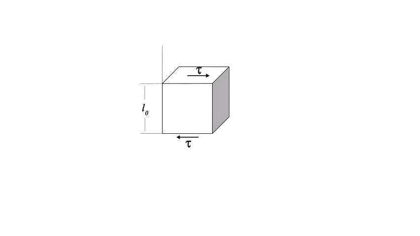

## Materials-and-Production-Engineering - Materials
Prof. Dr.-Ing.  Christian Willberg 

Contact: christian.willberg@h2.de
Parts of the script are adopted from \
Prof. Dr.-Ing. Jürgen Häberle

 
    <a href="https://doi.org/10.1007/s42102-021-00079-6" style="color: blue;">Image Reference</a>

---

<!--paginate: true-->

## Lecture

**Framework**

- Food or drinks are okay, but quiet
- Problems:
    - with childcare
    - disadvantage compensation
    - discrimination
    - language-related
    - ...
- Questions

---

## Content

- Materials
- Structure of materials
  - Atoms and bonds
  - Fine structure
  - Microstructure
- Structure of materials
- Material properties
  - physical
  - non-physical
- Phase diagrams
- ...

---

## Materials

What are materials?

[Materials in the narrow sense are solid-state materials that can be used to make components and constructions.](https://de.wikipedia.org/wiki/Werkstoff)

---
## Application Areas 

- Metals
  - Iron, steel, cast iron
  - Non-ferrous metals
- Plastics
- Ceramics
- Composite materials

---

## Cast Iron - Steel

---

## Non-Ferrous Metals

- Copper is a very good electrical and thermal conductor

---

- Magnesium is used in lightweight construction
- Titanium and titanium alloys 
    - high strength and heat resistance
    - Corrosion resistant
- Nickel
    - Corrosion resistance
    - high heat resistance

---

## Ceramics

---

## Glasses

---

## Fiber Composites

---

# Mechanical Properties
What are important properties from an engineer's perspective?
- Material behavior without damage
- Fatigue behavior
- Wear behavior
- When does damage occur
- ...

---

## Stress-Strain Concept
- Detailed in engineering mechanics
$\varepsilon$ - Strain
$\sigma$ - Mechanical stress

---

## 1D Strains
$$\varepsilon = \frac{\Delta l}{l}$$

Example:
$l_0 = 1m$
$l_1 = 1.01m$
$$\varepsilon = \frac{l_1-l_0}{l_0}=0.01\rightarrow 1\%$$

---

## 1D Stresses

$$\sigma = \frac{F}{A}$$

Example:
$F = 100N$
$A = 20mm^2$
$$\sigma = \frac{F}{A} = \frac{100 N}{20 mm^2} = 5 \frac{N}{mm^2}$$

---

# More Dimensionality

---

## Symmetries
- Isotropy
- Transverse isotropy
- Orthotropy
- ...
- Anisotropy

<!---
- Discussion; Properties can be direction-dependent
- Practical examples
-->

---

## Mechanical Properties

- **Reversible** deformation, where the deformed material returns to its original shape immediately or after a certain time after the external load is applied: elastic and viscoelastic deformation;

- **Irreversible (permanent)** deformation, where the shape change is retained even after the external load is applied: plastic and viscous deformation;

- Fracture, i.e. a separation of the material caused by the formation and propagation of cracks.

---

## Steel Example

[Curve determination](https://youtu.be/WWAb7Q5DAYw?si=fcnLckvNurSh0LC5)

[Steel data sheet](https://www.stauberstahl.com/fileadmin/Downloads/werkstoffe/Werkstoff-1.2842-Datenblatt.pdf)

 
    <a href="https://commons.wikimedia.org/w/index.php?curid=89891144" style="color: blue;">By Nicoguaro - Own work, CC BY 4.0</a>

---

# Material Behavior - Reversible
## Elasticity
- Reversible, energy-conserving
- Hooke's Law 1D
Normal stress $\sigma = E\varepsilon$
Shear stress $\tau = G\gamma$

---

## Fundamentals

- Normal strain [-]
$\varepsilon_{mechanical} = \frac{l - l_0}{l_0}$

- Normal stress $\left[\frac{N}{m^2}\right]$, $[Pa]$
$\sigma = \frac{F}{A}=E\varepsilon$
E - Elastic modulus, Young's modulus $\left[\frac{N}{m^2}\right]$

- Relevant e.g. for deformation analyses

---

## Fundamentals - Lateral Contraction

- Poisson's ratio [-]
- $\nu = -\frac{\varepsilon_y}{\varepsilon_x}$
For homogeneous materials $0\leq\nu\leq 0.5$
For heterogeneous materials other configurations are conceivable

- Relevant e.g. for press fits

---

## Fundamentals - Shear

- Shear strains [-]
$\varepsilon = \frac12(\frac{u_x}{l_0}+\frac{u_y}{b_0})=\frac{\gamma}{2}$

- Shear stress $\left[\frac{N}{m^2}\right]$, $[Pa]$
$\tau = \frac{F_s}{A}= G\gamma$

- Normal and shear stresses are not compatible; therefore equivalent stresses
- G - [Shear](https://de.wikipedia.org/wiki/Kompressionsmodul#Umrechnung_zwischen_den_elastischen_Konstanten_isotroper_Festk%C3%B6rper) modulus $\left[\frac{N}{m^2}\right]$
$G = \frac{E}{2(1+\nu)}$

- Relevant e.g. for torsion (drive trains, torsion springs)

---

## Fundamentals - Compression

$\sigma_h = p = -K \cdot \frac{\Delta V}{V_0}$

$\varepsilon_v = \frac{\Delta V}{V_0} = \varepsilon_1 + \varepsilon_2 + \varepsilon_3$

[Bulk modulus](https://de.wikipedia.org/wiki/Kompressionsmodul#Umrechnung_zwischen_den_elastischen_Konstanten_isotroper_Festk%C3%B6rper) $K = \frac{E}{3(1-2\nu)}$

- Relevant e.g. for hydraulics

---

| Material                          | E [GPa]   | G [GPa] | ν [-]     |
|:----------------------------------|:----------|:--------|:----------|
| Unalloyed steel                   | 200       | 77      | 0.30      |
| Titanium                          | 110       | 40      | 0.36      |
| Copper                            | 120       | 45      | 0.35      |
| Aluminum                          | 70        | 26      | 0.34      |
| Magnesium                         | 45        | 17      | 0.27      |
| Tungsten                          | 360       | 130     | 0.35      |
| Cast iron with lamellar graphite  | 120       | 60      | 0.25      |
| Thermoplastics/Thermosets         | 2-5       | 1-2     | ca. 0.35  |
| Elastomers                        | 0.1       | 0.03    | 0.45-0.49 |
| Plywood                           | 4-16      | -       | -         |

---

## Stiffness

How do material properties relate to stiffness?

- Material × Cross-sections = Stiffness
- Axial stiffness = $EA$
- Bending stiffness = $EI$
- Torsional stiffness = $GI_P$

 
    <a href="https://doi.org/10.3390/en14092451" style="color: blue;">Image reference</a>

---

## Viscous Behavior

- Irreversible
- Time-dependent, strain rate-dependent

Spring model $\sigma = E\epsilon$
 - Elastic component
 - Represented by spring elements

 
    

 
    

Damper $\sigma = \eta\dot{\epsilon}=\eta\frac{\partial \epsilon}{\partial t}$
- Viscous component
- Represented by damper elements

---

- Fast loading -> behavior is elastic
- Slow loading -> material flows
- [Fast loading](https://en.wikipedia.org/wiki/File:Sillyputty.ogv)

---

## Hardness

Resistance of a material to the penetration of a harder test body

**Dependence on:**
- Type and strength of bonding
- Crystal structure
- Microstructure and grain size
- Alloying elements
- Heat treatment

**Significance:**
- Wear resistance
- Machinability

---

# Material Behavior - Irreversible

---

## Strength

[The strength of a material describes the load-bearing capacity under mechanical loads before failure occurs, and is specified as mechanical stress $\left[N/m^2\right]$. Failure can be an **unacceptable deformation**, in particular a **plastic (permanent) deformation** or a **fracture**.](https://de.wikipedia.org/wiki/Festigkeit)

>Important: Strength ≠ Stiffness

---

## Plasticity

- [Forging](https://youtu.be/AxLszR6fkLM?si=k6A9aOVfQceOK9v0&t=80)
- [Rolling](https://www.youtube.com/watch?v=WOTO64HgnXc)

---
## Ductility
### Reduction of Area (Necking)
$$Z = \frac{A_0 - A_f}{A_0} \cdot 100\%$$
- A₀ = Initial cross-sectional area [mm²]
- A_f = Cross-sectional area at fracture [mm²]
- Z = Reduction of area [%]

The reduction of area describes the **relative decrease in cross-section** of a material under tensile loading until fracture.

---

## Ductility Assessment
### Interpretation of Reduction of Area

| Z-Value | Ductility | Material Behavior |
|--------|------------|-------------------|
| Z < 5% | Brittle | Ceramics, cast iron |
| 5% ≤ Z < 20% | Moderately ductile | High-strength steels |
| 20% ≤ Z < 50% | Ductile | Structural steels |
| Z ≥ 50% | Highly ductile | Pure copper, aluminum |

---

## Significance
**High reduction of area (Z > 40%)** means:
- Material can withstand large plastic deformations
- Good formability (forging, deep drawing)
- Fracture warning through visible necking
- High energy absorption before failure

**Low reduction of area (Z < 10%)** means:
- Brittle failure without warning
- Low formability
- Little energy absorption

---

## Toughness (Fracture Work)

**True Strain and Stress**
$$\varepsilon_{true} = \ln\left(\frac{L}{L_0}\right) = \ln(1 + \varepsilon_{nom})$$
$$\sigma_{true} = \sigma_{nom} \cdot (1 + \varepsilon_{nom}) = \frac{F}{A}$$
- F = Force
- A = Current cross-sectional area

---

### Toughness as Energy Absorption
$$U = \int_0^{\varepsilon_f} \sigma_{true} \, d\varepsilon_{true}$$
- U = Specific toughness [J/m³]
- ε_f = Fracture strain

    <a href="https://commons.wikimedia.org/w/index.php?curid=89891144" style="color: blue;">By Nicoguaro - Own work, CC BY 4.0</a>

---

A tough material combines:
- **High strength** (σ) → resists high stresses
- **High ductility** (ε) → deforms significantly before fracture

**Toughness = Survivability of a material under extreme conditions**

---

## Toughness Values of Typical Materials

| Material | Toughness [MJ/m³] | Characteristic |
|----------|-------------------|----------------|
| Glass | 0.01 | Extremely brittle |
| Cast iron | 1-3 | Brittle |
| High-strength steel | 50-100 | Strong, moderately ductile |
| Structural steel | 100-200 | Optimally tough |
| Aluminum | 70-200 | Light and tough |
| Copper | 200-400 | Highly ductile |
| Rubber | 10-100 | Elastic-ductile |

