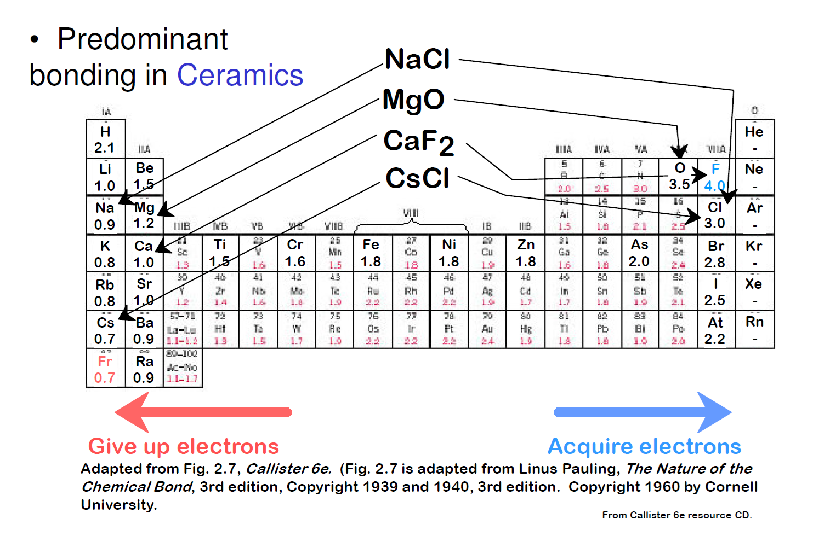
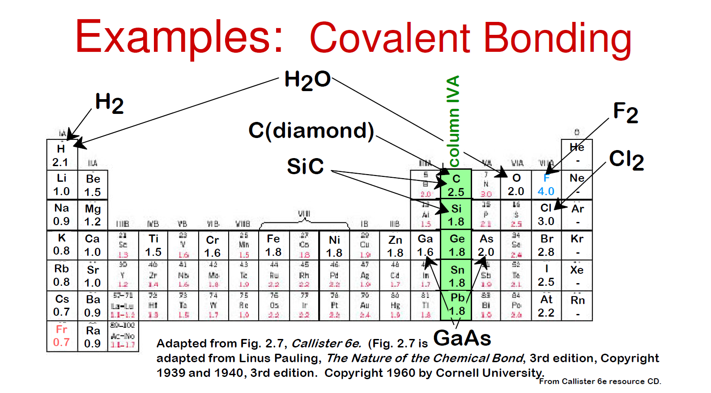

<style>
footer {
    font-size: 14px; /* Change footer font size */
    color: #888; /* Change footer color */
    text-align: right; /* Change footer alignment */
}
img[alt="ORCID"] {
    height: 15px !important;
    width: auto !important;
    vertical-align: top !important;
    display: inline !important;
    margin: 0 !important;
}
</style>


## Materials-and-Production-Engineering - Lecture on Structures of materials
Prof. Dr.-Ing.  Christian Willberg [](https://orcid.org/0000-0003-2433-9183)


Contact: christian.willberg@h2.de

--- 

- Atomistic structure (type of atomic building blocks)
- Fine structure (bonds between atomic building blocks and their geometric arrangement)
- Microstructure (texture – areas of geometric arrangement separated by interfaces within the material)
- Macrostructure (coarse structure – overall appearance of a material during production and use of a component)


---


---

## Relevant Quantities

**Atomic Number**
Number of protons in the nucleus
**Atomic Mass**
determines the mass of the element in atomic mass units $u$
$u=\frac{1}{12}\times$ mass of Carbon-12 atom
Material mass is a combination of atomic mass and density

Example:
- Carbon-12 has atomic mass = 12.00000 u (exactly)
- Carbon-13 has atomic mass = 13.00335 u


---

**Atomic weight (Relative Atomic Mass)**

Definition: The weighted average mass of all naturally occurring isotopes of an element
Calculation: Takes into account the relative abundance of each isotope
Example for Carbon:

- Carbon-12: 98.93% abundance
- Carbon-13: 1.07% abundance
- Atomic weight = (12.00000 × 0.9893) + (13.00335 × 0.0107) = 12.011 u


**Electronegativity**
determines whether atoms are donated or accepted in a bond
metallic bonds more on the left
covalent bonds more on the right

---

## Atomistic Structure

Consists of
- Nucleus (protons + neutrons) which defines the mass
- Shell (electrons) with different shells, which define chemical and many physical properties

- Probability of electron presence causes repulsion and attraction
- macroscopically recognizable as elasticity or thermal expansion

---
# Bonds

**Bonds determine everything about materials:**
- Why is diamond hard but graphite soft?
- Why do metals conduct electricity but plastics don't?
- Why does ice float on water?
- Why can we bend copper but not glass?

---


--- 

## What is a Bond?

**Definition:** Forces that hold atoms together in materials

**Two competing forces:**
- **Attractive forces** (FA): Pull atoms together
- **Repulsive forces** (FR): Push atoms apart

**Equilibrium:** Bond forms where FA + FR = 0 (minimum energy)


---

## Bond Energy - The Key Concept

**Bond Energy (Binding Energy):** Energy required to separate bonded atoms
```
A-B → A + B     Energy needed = Bond Energy
```

**Units:** kJ/mol or eV/atom

**Rule:** Stronger bonds = Higher bond energy = More stable material


---


## Bond Energy Scales

**Primary Bonds - Strong (100-900 kJ/mol)**
- Ionic bonds: 400-800 kJ/mol
- Covalent bonds: 150-900 kJ/mol  
- Metallic bonds: 100-850 kJ/mol

**Secondary Bonds - Weak (0.5-50 kJ/mol)**
- Hydrogen bonds: 10-40 kJ/mol
- Van der Waals: 0.5-25 kJ/mol

**Factor 10-100× difference!**

---

## Primary Valence Bonds  
**Primary bonds - high binding energy, strong bond**
- Ionic or heteropolar bond
- Atomic or homeopolar (or covalent) bond: polar (O-H) and nonpolar (C-C, C-H)
- Metallic bond

---

## Secondary or Residual Valence Bonds 
**Secondary bonds - low binding energy, weak bond**
- Van der Waals bond: intermolecular forces
- Hydrogen bond: two molecules or two suitably separated sections of a macromolecule interact via hydrogen atoms
- binding energies are one to two orders of magnitude smaller than those of atomic bonds

---

## Ionic or Heteropolar Bond
**Definition:**
Bond between **metal atom** and **non-metal atom** through electrostatic attraction

**Mechanism:**
1. Metal donates electrons → **cation** (positively charged)
2. Non-metal accepts electrons → **anion** (negatively charged)
3. Electrostatic attraction between oppositely charged ions

---

## Example: Sodium Chloride (NaCl)

**Sodium (Na)**
- 1 electron in outer shell
- Donates 1 electron → Na⁺ (cation)

**Chlorine (Cl)**
- 7 electrons in outer shell
- Accepts 1 electron → Cl⁻ (anion)

**Reaction equation:**
Na → Na⁺ + e⁻
Cl + e⁻ → Cl⁻
**Na⁺ + Cl⁻ → NaCl**


---

## Driving Force: Noble Gas Configuration

**Goal:** Outer shell with 8 electrons (octet rule)

| Element | e⁻ outer | Reaction | Ion | like noble gas |
|---------|----------|----------|-----|----------------|
| Na      | 1        | -1 e⁻    | Na⁺ | Neon           |
| Mg      | 2        | -2 e⁻    | Mg²⁺| Neon           |
| Cl      | 7        | +1 e⁻    | Cl⁻ | Argon          |
| O       | 6        | +2 e⁻    | O²⁻ | Neon           |

---

## Examples

**Magnesium Oxide (MgO)**
- Mg → Mg²⁺ + 2e⁻
- O + 2e⁻ → O²⁻
- **Mg²⁺ + O²⁻ → MgO**

**Aluminum Oxide (Al₂O₃)**
- 2 Al → 2 Al³⁺ + 6e⁻
- 3 O + 6e⁻ → 3 O²⁻
- **2 Al³⁺ + 3 O²⁻ → Al₂O₃**




---

## Properties of Ionic Compounds

**Crystal Structure**
- Regular ionic lattice
- High packing density
- Example: NaCl lattice (rock salt structure)

**Mechanical Properties**
- Brittle, low ductility
- High hardness
- High compressive strength
- Low tensile strength


---

## Properties of Ionic Compounds (2)

**Thermal Properties**
- High melting points (300-1000°C)
- High boiling points
- Example: NaCl melts at 801°C

**Electrical Properties**
- Insulator in solid state
- Conductor in molten state (ions mobile)
- Conductor in aqueous solution (electrolyte)

---

## Binding Energy


**Ionic bond:**
- Strong (400-800 kJ/mol)
- Depends on:
  - Ion charge (higher charge → stronger)
  - Ion radius (smaller ions → stronger)

---

## Coulomb's Law

**Attractive force between ions:**

$$F = k \cdot \frac{q_1 \cdot q_2}{r^2}$$

- F = force
- k = Coulomb constant
- q₁, q₂ = charges of ions
- r = distance between ions


---

## Lattice Energy - Examples

| Compound | Lattice Energy [kJ/mol] | Melting Point [°C] |
|----------|-------------------------|---------------------|
| NaCl     | 786                     | 801                 |
| MgO      | 3795                    | 2852                |
| CaF₂     | 2630                    | 1418                |
| LiF      | 1037                    | 845                 |
| KCl      | 717                     | 770                 |

**Trend:** Smaller ions + higher charge = higher lattice energy

---

## Applications of Ionic Compounds

**Ceramics**
- Al₂O₃ (aluminum oxide) - cutting tools, insulators
- MgO (magnesium oxide) - refractory materials

**Salts**
- NaCl (table salt) - food, chemistry
- CaCO₃ (calcium carbonate) - building material, cement

**Electronics**
- Insulators and dielectrics

---

## Covalent bonding

**Definition:**
Bond between **non-metal atoms** through **shared use** of electron pairs

**Mechanism:**
1. Two or more atoms share electrons
2. Shared electron pairs belong to both atoms
3. Formation of **molecules** or **covalent networks**
4. Directional bonds

---

## Example: Hydrogen (H₂)

**Hydrogen (H)**
- 1 electron in outer shell
- Needs 1 more electron for noble gas configuration

**Bond formation:**
H  +  H → H—H

- Each H atom contributes 1 electron
- Both electrons are shared
- Both H atoms achieve He configuration (2 e⁻)

**Bond dash (—):** Represents a bonding electron pair

---

## Driving Force: Noble Gas Configuration

| Molecule | Atoms | Bond | Configuration like |
|----------|-------|------|--------------------|
| H₂       | H—H   | Single | Helium           |
| Cl₂      | Cl—Cl | Single | Argon            |
| O₂       | O=O   | Double | Neon             |
| N₂       | N≡N   | Triple | Neon             |

**Multiple bonds:**
- Single (—): 1 electron pair
- Double (=): 2 electron pairs
- Triple (≡): 3 electron pairs

---

## More Examples

**Water (H₂O)**
- O needs 2 electrons → 2 single bonds with H

**Methane (CH₄)**
- C needs 4 electrons → 4 single bonds with H

**Carbon Dioxide (CO₂)**
- O=C=O
- 2 double bonds, linear



---

## Types of Covalent Structures

**1. Molecular Crystals**
- Discrete molecules (H₂O, CO₂, organic substances)
- Weak intermolecular forces
- Low melting points

**2. Covalent Networks (Atomic Crystals)**
- Continuous covalent bonds
- Diamond, silicon carbide, quartz
- Very high melting points
- Extreme hardness

---

## Polar and Nonpolar Covalent Bonds

**Nonpolar Covalent Bond**
- Same atoms (H₂, Cl₂, O₂)
- Electrons evenly distributed
- No charge separation
- Electronegativity difference ΔEN = 0

**Polar Covalent Bond**
- Different atoms (H₂O, HCl)
- Electrons unevenly distributed
- Partial charges (δ⁺ and δ⁻)
- Electronegativity difference 0 < ΔEN < 1.7

---


## Properties of Molecular Substances

**Aggregate State**
- Often gaseous or liquid at room temperature
- Low melting/boiling points (< 400°C)
- Weak van der Waals forces between molecules

**Mechanical Properties**
- Soft (in solids)
- Low strength
- Often flexible/elastic
- Example: plastics, waxes

---

## Properties of Covalent Networks

**Mechanical Properties**
- Extremely hard
- Brittle
- High compressive strength
- Low tensile strength

**Thermal Properties**
- Very high melting points (> 2000°C)
- High thermal stability
- Low thermal expansion

**Examples:** Diamond, SiC, Si₃N₄

---

## Binding Energy

**Definition:**
Energy required to break a bond

**Examples:**
| Bond | Energy [kJ/mol] |
|------|-----------------|
| H—H  | 436             |
| C—C  | 348             |
| C=C  | 614             |
| C≡C  | 839             |
| Si—Si| 226             |
| C—Si | 301             |

**Trend:** Multiple bonds are stronger
**Significance:** Determines mechanical and thermal properties

---

## Covalent Materials: Diamond

**Structure:**
- Each C atom tetrahedrally bonded to 4 neighbors
- Continuous 3D network
- All bonds equivalent

**Properties:**
- Hardest known material
- Melting point: 3550°C
- Excellent electrical insulator
- Excellent thermal conductivity

**Application:** Cutting tools, abrasives

---

## Covalent Materials: Silicon Carbide (SiC)

**Structure:**
- Similar to diamond
- Si and C arranged alternately
- Covalent C—Si bonds

**Properties:**
- Very hard and chemically very stable
- Melting point: 2730°C
- Good thermal conductivity
- Semiconductor at high temperatures

**Application:** Abrasives, high-temperature semiconductors, armor

---

## Comparison: Ionic vs. Covalent

| Property | Ionic Bond | Covalent (molecular) | Covalent (network) |
|----------|------------|----------------------|--------------------|
| Structure | Crystal lattice | Molecules | 3D network |
| Melting point | High (800°C) | Low (<300°C) | Very high (>2000°C) |
| Hardness | Medium-high | Low | Very high |
| Electrical | Insulator (solid) | Insulator | Insulator |
| Ductility | Brittle | Variable | Very brittle |
| Example | NaCl, MgO | Plastics, H₂O | Diamond, SiC |

---

## Polymers (Plastics)

**Structure:**
- Long carbon chains
- C—C and C—H bonds (covalent)
- Weak bonds between chains

**Types:**
- **Thermoplastics:** Linear, meltable (PE, PP, PVC)
- **Thermosets:** Crosslinked, not meltable (epoxy, bakelite)
- **Elastomers:** Weakly crosslinked, elastic (rubber)

---

# More on This Later

---


## Metallic Bond

**Definition:**
Bond between **metal atoms** through delocalized valence electrons

**Mechanism:**
1. Metal atoms donate valence electrons
2. Positive metal ions (atomic cores) form lattice
3. Valence electrons move freely throughout the crystal
4. **Electron gas** surrounds the atomic cores
5. Electrostatic attraction between atomic cores and electron gas


---

## Structure

**⊕ = Metal ions (atomic cores)**
**blue dots = delocalized electrons (electron gas)**

- Electrons don't belong to individual atoms
- Freely mobile throughout metal lattice
- Non-directional bond

---

## Examples of Metallic Elements

**Alkali Metals (1st Main Group)**
- Sodium (Na), Potassium (K), Lithium (Li)
- 1 valence electron
- Soft, reactive

**Alkaline Earth Metals (2nd Main Group)**
- Magnesium (Mg), Calcium (Ca)
- 2 valence electrons
- Medium strength

---

**Transition Metals**
- Iron (Fe), Copper (Cu), Aluminum (Al)
- Variable valence electrons
- Hard, good conductivity

---

## Driving Force: Energy Reduction

**Why do metals form this bond?**

- Energy is released through delocalization of electrons
- Electrons can distribute over many atoms
- Lower energy level than in isolated atoms
- Energy gain stabilizes the structure

---

**More valence electrons, stronger the bond**

| Metal | Valence Electrons | Melting Point [°C] |
|-------|-------------------|--------------------|
| Na    | 1                 | 98                 |
| Mg    | 2                 | 650                |
| Al    | 3                 | 660                |

---

## Mechanical Properties

**Formability**
- Ductile (deformable)
- Forgeable, rollable
- Atoms can slide past each other
- Electron gas remains intact

**Strength**
- Medium to high strength
- Tensile strength: 50-1500 MPa (depending on metal)
- Work hardening possible

---

**Fracture Behavior**
- Tough (not brittle)
- Plastic deformation before fracture

**Hardness**
- Variable depending on metal
- Soft: Na, K, Au (< 30 HV)
- Medium: Al, Cu, Ag (30-100 HV)
- Hard: Fe, Cr, W (> 100 HV)

---

## Mechanical Properties (2)

**Deformation Mechanisms**
- Dislocation movement (slip planes)
- Twin formation
- Non-directional bond enables deformation
- In contrast to ionic crystals (brittle)

---

## Thermal Properties - Melting Points

- Low to very high (39°C - 3422°C)
- Depends on number of valence electrons

| Metal | Melting Point [°C] |
|-------|--------------------|
| Na    | 98                 |
| Al    | 660                |
| Cu    | 1085               |
| Fe    | 1538               |
| W     | 3422               |

**Trend:** More valence electrons → higher melting point

---

## Thermal Properties (2)

**Thermal Conductivity**
- Very good (10-400 W/(mK))
- Free electrons transport heat
- Best thermal conductors: Ag, Cu, Au, Al

**Thermal Expansion**
- Medium to high expansion
- Typical: 10-30 · 10⁻⁶ K⁻¹
- Important for thermal stresses

**Heat Capacity**
- Relatively high

---

## Electrical Properties

**Electrical Conductivity**
- Excellent electrical conductors
- Free electrons transport charge
- Specific resistance: 10⁻⁸ - 10⁻⁶ Ω·m

| Metal | Conductivity [MS/m] | Application |
|-------|---------------------|-------------|
| Ag    | 63                  | Contacts    |
| Cu    | 59                  | Cables      |
| Au    | 45                  | Electronics |
| Al    | 37                  | Wiring      |

---

## Comparison of Bond Types

| Property | Ionic | Covalent | Metallic |
|----------|-------|----------|----------|
| Participants | Metal + non-metal | Non-metal | Metal |
| Electrons | Transfer | Sharing | Delocalized |
| Structure | Ionic lattice | Molecules/network | Metal lattice |
| El. conductivity | Only molten | No | Yes, very good |
| Formability | Brittle | Brittle/soft | Ductile |
| Melting point | High | Variable | Medium-high |
| Transparency | Often yes | Often yes | No |

---

# Secondary Bonds (Intermolecular Forces)

---

**Definition:**
Weak bonds between **molecules** or **atoms** through electrostatic interactions

**Properties:**
- Low binding energy (0.5-50 kJ/mol)
- **One to two orders of magnitude weaker** than primary bonds
- No electron transfer or sharing
- Short-range

**Main Types:**
1. **Van der Waals bonds** (0.5-25 kJ/mol)
2. **Hydrogen bonds** (10-40 kJ/mol)

---

| Bond Type | Energy [kJ/mol] | Example |
|-----------|-----------------|---------|
| **Primary Bonds** | | |
| Ionic | 400-800 | NaCl |
| Covalent | 150-900 | C-C, O=O |
| Metallic | 100-850 | Cu, Fe |
| **Secondary Bonds** | | |
| Hydrogen bonds | 10-40 | H₂O...H₂O |
| Van der Waals (dipole) | 5-25 | HCl...HCl |
| Van der Waals (London) | 0.5-10 | Ar...Ar |

**Factor 10-100 weaker!**

---

**Secondary Bonds**
│
├── Van der Waals Bonds
│   ├── London Forces (Dispersion Forces)
│   │   └── All molecules/atoms
│   │
│   ├── Dipole-Dipole Forces
│   │   └── Polar molecules
│   │
│   └── Dipole-Induced Dipole
│       └── Polar/nonpolar mixture
│
└── Hydrogen Bonds
└── Special case: H on F, O, N

---

## Van der Waals Bonds

**Definition:**
Weak intermolecular forces due to charge distributions


**Three Subtypes**
1. London forces (weakest)
2. Dipole-dipole forces
3. Dipole-induced dipole

---

**1. London Forces**
- Temporary, fluctuating dipoles
- In **all** atoms/molecules
- 0.5-10 kJ/mol

**2. Dipole-Dipole Forces**
- Permanent dipoles
- Only in polar molecules
- 5-25 kJ/mol

**3. Dipole-Induced Dipole**
- Permanent dipole induces temporary dipole
- Mixtures

---

## London Forces (Dispersion Forces)

**Mechanism:**
Atom 1:  ⊖ ⊕   →  temporary dipole (due to electron movement)
↓ induces
Atom 2:  ⊕ ⊖   →  induced dipole
↓
Attraction

**Properties:**
- Occur in **all** molecules/atoms (even nonpolar!)
- Strength increases with molecule size
- Short-range (~ r⁻⁶)
- Weakest intermolecular force

---

## London Forces - Influence of Molecule Size

**Larger molecules → more electrons → stronger London forces**

| Molecule | Molar Mass [g/mol] | Electrons | Boiling Point [°C] |
|----------|--------------------|-----------|--------------------|
| He       | 4                  | 2         | -269               |
| Ne       | 20                 | 10        | -246               |
| Ar       | 40                 | 18        | -186               |
| Kr       | 84                 | 36        | -153               |
| Xe       | 131                | 54        | -108               |

**Trend:** More electrons → stronger temporary dipoles → higher boiling point

**Relevance:** Why motor oils become viscous in cold

---

## Dipole-Dipole Forces

**Mechanism:**
δ⁺     δ⁻   δ⁺     δ⁻
H—O ... H—O

**Prerequisite:**
- Molecules must be **permanently polar**
- Different electronegativity

**Properties:**
- Stronger than London forces
- Temperature dependent
- Directional

---

## Dipole-Induced Dipole Forces

**Mechanism:**
Polar:    δ⁺  δ⁻
H—Cl        →  induces dipole
↓
Nonpolar:  ⊕ ⊖

---

**Examples:**
- Solution of O₂ in H₂O
- Solution of N₂ in water
- Mixture of polar and nonpolar substances

**Significance:**
- Explains limited solubility of nonpolar gases in water
- Important for gas solubility (e.g., oxygen in blood)

---

## Hydrogen Bonds

**Mechanism:** Particularly strong dipole-dipole interaction between H atom and electronegative atoms (F, O, N)


---

**Prerequisites:**
1. H bonded to **F, O or N** (high electronegativity)
2. Free electron pair on acceptor atom
3. Directional (not like normal dipole-dipole)

**Strength:** 10-40 kJ/mol (strongest secondary bond!)

---

## Properties of Substances with Secondary Bonds

**Aggregate State**
- Often gaseous or low boiling
- Weak intermolecular forces
- Easily evaporated

**Melting/Boiling Points**
- Low (often < 100°C)
- Exception: H-bonds increase values

**Solubility**
- London forces: "Like dissolves like"
- H-bonds: highly soluble in polar solvents

**Mechanical**
- Soft
- Easily deformable
- Low strength

---

## Materials Engineering Significance

**1. Polymers (Plastics)**
- Secondary bonds between polymer chains
- Determine melting point and mechanical properties
- Thermoplastics: **only** secondary bonds → meltable
- Thermosets: covalent crosslinking → not meltable

**2. Lubricants**
- Graphite: weak van der Waals between layers
- Easily shiftable → low friction
- MoS₂: similar principle

---

**3. Seals and Elastomers**
- Flexibility through weak bonds
- Rubber, silicones

---

## Thermoplastics vs. Thermosets

**Thermoplastics**
- Only secondary bonds between chains
- Meltable, recyclable
- Low melting points (50-250°C)
- Examples: PE, PP, PS, PVC


---

**Thermosets**
- Covalent crosslinking (primary bond)
- Not meltable
- High temperature resistance
- Examples: Epoxy resins, phenolic resins


**Secondary bonds enable deformability!**

---

## Graphite - Layer Structure

- Within layers: strong covalent C-C bonds
- Between layers: weak van der Waals forces

**Properties / Applications:**
- In layers: hard, strong
- Between layers: easily shiftable
- Good lubricant
- Electrically conductive (in layer plane)
- Dry lubricant, pencil leads, electrodes


---

## Adsorption on Surfaces

**Physisorption**
- Van der Waals forces
- Weak bond (5-40 kJ/mol)
- Reversible
- Multiple layers possible

**Applications:**
- Activated carbon (water purification, gas masks)
- Molecular sieves (drying)
- Catalysts (surface enlargement)
- Chromatography


---

## Solvents and Solubility

**"Like dissolves like"**

**Nonpolar Solvents** (London forces)
- Hexane, benzene, chloroform
- Dissolve: fats, oils, waxes, nonpolar polymers

**Polar Solvents** (dipole, H-bonds)
- Water, ethanol, acetone
- Dissolve: salts, sugars, polar molecules

**Principle:**
Solvents must have similar intermolecular forces as dissolved substance

---

## Surface Tension

Unequal attractive forces at the surface

**High Surface Tension:**
- Strong intermolecular forces
- H₂O: 72 mN/m

**Low Surface Tension:**
- Weak intermolecular forces
- Ethanol: 22 mN/m

**Application:**
- Surfactants (reduce surface tension)
- Wetting of surfaces

---

## Comparison: Primary vs. Secondary Bonds

| Property | Primary Bond | Secondary Bond |
|----------|--------------|----------------|
| Energy | 100-900 kJ/mol | 1-50 kJ/mol |
| Range | Atomic | Molecular |
| Melting point | High (>500°C) | Low (<200°C) |
| Electrons | Involved | Not involved |
| Examples | NaCl, Fe, diamond | H₂O, N₂, polymers |
| Strength | Very high | Low |
| Formability | Variable | Often good |

---

## Directional Bonds vs. Nondirectional Bonds

**Directional Bonds (Covalent, H-bonds):**

- Lead to specific molecular shapes
- Create materials with anisotropic properties
- Result in lower density structures (diamond vs metals)
- Cause brittleness due to specific bond angles

**Nondirectional Bonds (Ionic, Metallic, vdW):**

- Allow for dense packing arrangements
- Enable plastic deformation (metals)
- Create isotropic properties in crystals
- Permit multiple coordination geometries

---

# Questions 
