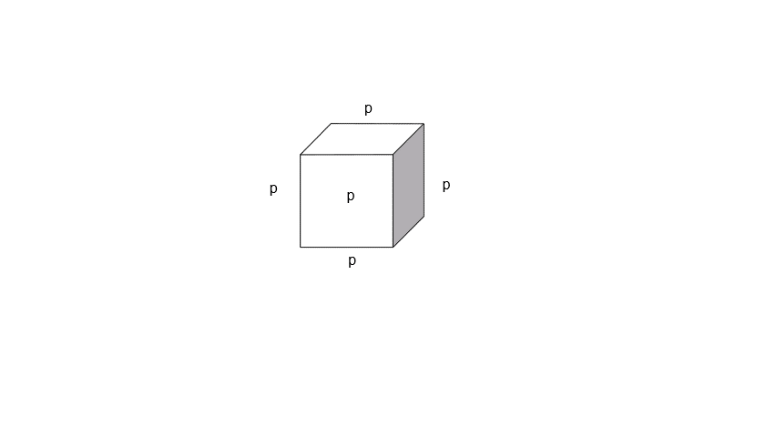

## Lecture on Materials Science - Material properties
Prof. Dr.-Ing. Christian Willberg
Magdeburg-Stendal University of Applied Sciences

Contact: christian.willberg@h2.de
Parts of the script are adopted from \
Prof. Dr.-Ing. Jürgen Häberle

---

<!--paginate: true-->
## Material Properties

What are material properties?

<!DOCTYPE html>
<html lang="en">
  <body>
    <pre align="center" class="mermaid">
    %%{init: {'theme': 'forest'}}%%
    mindmap
      root((Properties))
        Physical
                Mechanical
                Electrical
                Thermal
                ...
            Chemical
                Solubility
                Electronegativity
                ...
            Biological / Physiological
                Environmental Impact
                Weatherability
                Toxicity
                ...
            Social / Societal
                Value
                Acceptance
                Working Conditions
                Origin
                ...
    </pre>
    

  </body>
</html>

<!DOCTYPE html>

---

## Symmetry
- Isotropy
- Transverse Isotropy
- Orthotropy
- ...
- Anisotropy

<!---
- Discussion; properties can be direction-dependent
- Practical examples
-->

---

## Mechanical Properties

- **Reversible** deformation, where immediately or after a certain time following the application of external load, the deformed material returns to its original shape: elastic and viscoelastic deformation.

- **Irreversible (permanent)** deformation, where the shape change remains even after the external load is removed: plastic and viscous deformation.

- Fracture, i.e., separation of the material caused by the formation and propagation of cracks.

---

## Simulation Example
[External Link](https://perilab-results.nimbus-extern.dlr.de/models/DCB?step=65&variable=Damage&displFactor=400)

---

## Concept of Stress - Strain

- Geometry-independent characteristics
- How can one determine a characteristic that is defined solely by the material?
- Example: Density

---

## Elasticity

- Reversible, energy-preserving
- Hooke's Law 1D
Normal stress $\sigma = E\varepsilon$
Shear stress $\tau = G\gamma$
- Hooke's Law 2D or 3D
$\boldsymbol{\sigma}=\mathbf{C}\boldsymbol{\varepsilon}$

---

## Basics

- Normal strain [-]
$\varepsilon_{mechanical} = \frac{l - l_0}{l_0}$

- Normal stress $\left[\frac{N}{m^2}\right]$, $[Pa]$
$\sigma = \frac{F}{A}=E\varepsilon$
E - Elastic modulus, Young's modulus $\left[\frac{N}{m^2}\right]$\
\
\
\
\
.

 
    

---

## Basics

- Shear strain [-]
$\varepsilon = \frac12(\frac{u_x}{l_0}+\frac{u_y}{b_0})=\frac{\gamma}{2}$

- Shear stress $\left[\frac{N}{m^2}\right]$, $[Pa]$
$\tau = \frac{F_s}{A}= G\gamma$

- Normal and shear stresses are not compatible, leading to the concept of equivalent stresses -> Engineering Mechanics

- G - Shear modulus $\left[\frac{N}{m^2}\right]$

---

## Basics

- Poisson's ratio [-]
$\nu = -\frac{\varepsilon_y}{\varepsilon_x}$
for homogeneous materials $0\leq\nu\leq 0.5$
for heterogeneous materials, other configurations are possible

- [Bulk modulus](https://en.wikipedia.org/wiki/Bulk_modulus#Relation_between_elastic_moduli) $K = \frac{E}{3(1-2\nu)}$
- [Shear modulus](https://en.wikipedia.org/wiki/Bulk_modulus#Relation_between_elastic_moduli) $K = \frac{E}{2(1+\nu)}$

---

## Material Examples

| Material                          | E [GPa]   | G [GPa] | $\nu [-]$     |
|:----------------------------------|:----------|:--------|:--------------|
| Unalloyed steel                   | 200       | 77      | 0.30          |
| Titanium                          | 110       | 40      | 0.36          |
| Copper                            | 120       | 45      | 0.35          |
| Aluminum                          | 70        | 26      | 0.34          |
| Magnesium                         | 45        | 17      | 0.27          |
| Tungsten                          | 360       | 130     | 0.35          |
| Cast iron with lamellar graphite  | 120       | 60      | 0.25          |
| Brass                             | 100       | 35      | 0.35          |
| Thermoplastics / Thermosets       | 2 … 5     | 1 … 2   | ~0.35         |
| Elastomers                        | 0.1       | 0.03    | 0.45 - 0.49   |
| Plywood                           | 4 … 16    | -       | -             |
| Concrete                          | 40 … 45   | -       | -             |

---

## Stiffness

How are material properties related to stiffness?

- Material $\cdot$ cross-sectional area = stiffness
- Tensile, normal stiffness = $EA$
- Bending stiffness = $EI$
- Torsional stiffness = $GI_P$

 
    <a href="https://doi.org/10.3390/en14092451" style="color: blue;">Image reference</a>

---

## 
<!---

* 1st and 2nd natural frequencies ->  https://doi.org/10.3390/en14092451
* Deformation in the impact and swing direction are identical
* Tower impact is relevant
* Dynamic stability
* -->

 
    <a href="https://doi.org/10.3390/en14092451" style="color: blue;">Image reference</a>

---

## Strength

[The strength of a material describes its ability to withstand mechanical loads before failure occurs and is expressed as mechanical stress $\left[N/m^2\right]$. Failure can involve **unacceptable deformation**, particularly **plastic (permanent) deformation**, or **fracture**.](https://en.wikipedia.org/wiki/Strength_of_materials)

>Important: Strength $\neq$ Stiffness

---

## Plastic Failure

 
    <a href="https://commons.wikimedia.org/w/index.php?curid=89891144" style="color: blue;">By Nicoguaro - Own work, CC BY 4.0</a>

---

## Viscous Behavior

- Reversible
- Time-dependent

Spring model $\sigma = E\epsilon$ 
 - Elastic component
 - Represented by spring elements

 
    

 
    

Damper  $\sigma = \eta\dot{\epsilon}=\eta\frac{\partial \epsilon}{\partial t}$ 
- Viscous component
- Represented by damper elements

---

## 

---

## 

---

# Fatigue

What is Fatigue?

<!DOCTYPE html>
<html lang="en">

  </body>
</html>

---

- Typically occurs with cyclic loading
  - Isothermal mechanical fatigue
    - [Oscillating load](https://www.youtube.com/watch?v=_qVXkAWtH60)

    - Aircraft fuselage (pressure build-up and release)
  - Thermal fatigue
    - Ovens, heating elements
  - Thermo-mechanical fatigue
    - High-pressure tanks
  - Electro-thermal fatigue
    - Electrical conductors (filaments)

---

---

## Fatigue
- The load is below the yield strength $R_{p0,2}$
  - > _Reminder: What does $R_{p0,2}$ indicate?_
- Stress concentrations occur in material defects (pores, microcracks, etc.) or in the crystal (dislocations, vacancies, etc.)
- Initially, randomly distributed regions of local plastic deformation develop under alternating loads
- These points represent stress concentration areas, which enlarge over time and can lead to fracture

[Explanation video](https://www.youtube.com/watch?v=o-6V_JoRX1g)

---

---

## Terms

- Lifespan
- Fatigue crack
- Fatigue fracture
- Short-term strength (K)
- Operational strength (Time strength Z)
- Endurance limit (D)

---

## Countermeasures

- Reduce notch effect
- Material adaptation
- Design adjustments to prevent local stress from exceeding allowable limits
- Regular inspections

---

## Wear

- Permanent deformation and material loss on the surface of solids due to friction
- Technologically unintended and can lead to functional failure
- Influenced by:
  - Frictional pairing
  - Surface layer and intermediate substance properties
  - Type of motion
  - Load intensity

---

| Wear Type             | Appearance                                                        | Primary Occurrence                                         |
|-----------------------|-------------------------------------------------------------------|------------------------------------------------------------|
| Sliding wear           | Grooves or furrows from abrasion, material transfer, or local melting | Unlubricated bearings, clutches, brakes                    |
| Rolling wear           | Flaking due to fatigue cracks                                     | Rail/wheel, rolling bearings                               |
| Pitting               | Pitting formation: pitting                                        | Rolling elements, especially gears                         |
| Abrasive wear          | Plastic deformation, erosion                                     | Excavating equipment, bulk material transport, particle impingement |
| Cavitation             | Pitted surface with fatigue cracks                               | Water turbines, pumps                                      |
| Tribo-oxidation (fretting corrosion) | Loose oxidation products                            | Machine elements with form-fit or force-fit connections     |

---

## Sliding Wear

- Influenced [by](https://download.basf.com/p1/8a8081c57fd4b609017fd66047f138c3/de/Reibung_und_Verschlei%25C3%259F%250Abei_Polymerwerkstoffen)
  - The average roughness depth $R_z$
  - Contact pressure
  - Wear path ratio $W=k\frac{F_N}{A}10^6$
  - $k$ in $\left[\frac{mm^3}{Nm}\right]$ specific wear rate (independent of load)

---

## Rolling Wear
- [Rolling](https://link.springer.com/chapter/10.1007/978-3-658-17851-2_6) involves slip components superimposed on the rolling process
- Small contact area; high surface pressure
- Surface degradation (plastic deformation, microstructure changes, etc.)
- Can be significantly reduced by lubrication $\rightarrow$ specific lubricant film thickness $\lambda$

---

## Cavitation

[Video](https://www.youtube.com/watch?v=J0H0Nw44oA4)

Physical cause?

- Static pressure is dependent on fluid velocity
- Vapor bubbles form when the vapor pressure drops below a threshold
- These bubbles move into regions with higher pressure and rapidly collapse
- Pressure and temperature spikes occur

---

- Localized stress on the surface
- These regions weaken and flake off
- Surface is affected by:
  - Efficiency reduction
  - Corrosion
  - Areas where cracks can initiate

---

## Fretting Corrosion

- Sliding motions between two highly loaded components
- Typically occurs with insufficient interference fit $\rightarrow$ Fits

