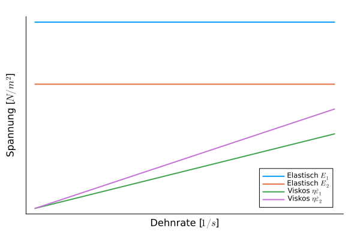
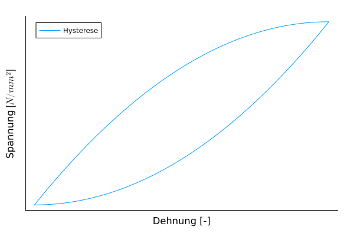
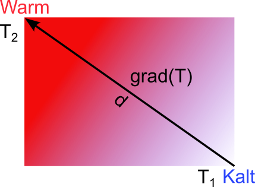

## Lectures on Materials Science - Material properties
Prof. Dr.-Ing. Christian Willberg
Magdeburg-Stendal University of Applied Sciences

Contact: christian.willberg@h2.de
Parts of the script are adopted from \
Prof. Dr.-Ing. Jürgen Häberle

---

<!--paginate: true-->
## Material Properties

What are material properties?

<!DOCTYPE html>
<html lang="en">
  <body>
    <pre align="center" class="mermaid">
    %%{init: {'theme': 'forest'}}%%
    mindmap
      root((Properties))
        Physical
                Mechanical
                Electrical
                Thermal
                ...
            Chemical
                Solubility
                Electronegativity
                ...
            Biological / Physiological
                Environmental Impact
                Weatherability
                Toxicity
                ...
            Social / Societal
                Value
                Acceptance
                Working Conditions
                Origin
                ...
    </pre>
    

  </body>
</html>

<!DOCTYPE html>

---

## Symmetry
- Isotropy
- Transverse Isotropy
- Orthotropy
- ...
- Anisotropy

<!---
- Discussion; properties can be direction-dependent
- Practical examples
-->

---

## Mechanical Properties

- **Reversible** deformation, where immediately or after a certain time following the application of external load, the deformed material returns to its original shape: elastic and viscoelastic deformation.

- **Irreversible (permanent)** deformation, where the shape change remains even after the external load is removed: plastic and viscous deformation.

- Fracture, i.e., separation of the material caused by the formation and propagation of cracks.

---

## Simulation Example
[External Link](https://perilab-results.nimbus-extern.dlr.de/models/DCB?step=65&variable=Damage&displFactor=400)

---

## Reminder: Concept of Stress - Strain

- Geometry-independent characteristics
- How can one determine a characteristic that is defined solely by the material?
- Example: Density

---

## Elasticity

- Reversible, energy-preserving
- Hooke's Law 1D
Normal stress $\sigma = E\varepsilon$
Shear stress $\tau = G\gamma$
- Hooke's Law 2D or 3D
$\boldsymbol{\sigma}=\mathbf{C}\boldsymbol{\varepsilon}$

---

## Basics

- Normal strain [-]
$\varepsilon_{mechanical} = \frac{l - l_0}{l_0}$

- Normal stress $\left[\frac{N}{m^2}\right]$, $[Pa]$
$\sigma = \frac{F}{A}=E\varepsilon$
E - Elastic modulus, Young's modulus $\left[\frac{N}{m^2}\right]$\
\
\
\
\
.

 
    

---

## Basics

- Shear strain [-]
$\varepsilon = \frac12(\frac{u_x}{l_0}+\frac{u_y}{b_0})=\frac{\gamma}{2}$

- Shear stress $\left[\frac{N}{m^2}\right]$, $[Pa]$
$\tau = \frac{F_s}{A}= G\gamma$

- Normal and shear stresses are not compatible, leading to the concept of equivalent stresses -> Engineering Mechanics

- G - Shear modulus $\left[\frac{N}{m^2}\right]$

---

## Basics

- Poisson's ratio [-]
$\nu = -\frac{\varepsilon_y}{\varepsilon_x}$
for homogeneous materials $0\leq\nu\leq 0.5$
for heterogeneous materials, other configurations are possible

- [Bulk modulus](https://en.wikipedia.org/wiki/Bulk_modulus#Relation_between_elastic_moduli) $K = \frac{E}{3(1-2\nu)}$
- [Shear modulus](https://en.wikipedia.org/wiki/Bulk_modulus#Relation_between_elastic_moduli) $K = \frac{E}{2(1+\nu)}$

---

## Material Examples

| Material                          | E [GPa]   | G [GPa] | $\nu [-]$     |
|:----------------------------------|:----------|:--------|:--------------|
| Unalloyed steel                   | 200       | 77      | 0.30          |
| Titanium                          | 110       | 40      | 0.36          |
| Copper                            | 120       | 45      | 0.35          |
| Aluminum                          | 70        | 26      | 0.34          |
| Magnesium                         | 45        | 17      | 0.27          |
| Tungsten                          | 360       | 130     | 0.35          |
| Cast iron with lamellar graphite  | 120       | 60      | 0.25          |
| Brass                             | 100       | 35      | 0.35          |
| Thermoplastics / Thermosets       | 2 … 5     | 1 … 2   | ~0.35         |
| Elastomers                        | 0.1       | 0.03    | 0.45 - 0.49   |
| Plywood                           | 4 … 16    | -       | -             |
| Concrete                          | 40 … 45   | -       | -             |

---

## Stiffness

How are material properties related to stiffness?

- Material $\cdot$ cross-sectional area = stiffness
- Tensile, normal stiffness = $EA$
- Bending stiffness = $EI$
- Torsional stiffness = $GI_P$

 
    <a href="https://doi.org/10.3390/en14092451" style="color: blue;">Image reference</a>

---

## Reminder: Strength

[The strength of a material describes its ability to withstand mechanical loads before failure occurs and is expressed as mechanical stress $\left[N/m^2\right]$. Failure can involve **unacceptable deformation**, particularly **plastic (permanent) deformation**, or **fracture**.](https://en.wikipedia.org/wiki/Strength_of_materials)

>Important: Strength $\neq$ Stiffness

---

## Reminder: Stress-Strain relation in a ductile material

 
    <a href="https://commons.wikimedia.org/w/index.php?curid=89891144" style="color: blue;">By Nicoguaro - Own work, CC BY 4.0</a>

---

## Viscous Behavior

- Reversible
- Time-dependent

Spring model $\sigma = E\epsilon$ 
 - Elastic component
 - Represented by spring elements

 
    

 
    

Damper  $\sigma = \eta\dot{\epsilon}=\eta\frac{\partial \epsilon}{\partial t}$ 
- Viscous component
- Represented by damper elements

---

## 

---

## 

---

## Thermal Expansion

$\boldsymbol{\varepsilon}_{thermal} = -\boldsymbol{\alpha} \Delta T$

_Thermal Expansion Coefficient Matrix_

$\boldsymbol{\alpha} = 
\begin{bmatrix}
\alpha_{11} & \alpha_{12} & \alpha_{13} \\
\alpha_{12} & \alpha_{22} & \alpha_{23} \\
\alpha_{13} & \alpha_{23} & \alpha_{33}
\end{bmatrix}
$

**1D or Isotropic**
$\varepsilon_{thermal} = -\alpha \Delta T$

---

| Symmetry | Model | Examples |
|---|---|---|
| Isotropy | $\alpha_{11} = \alpha_{22} = \alpha_{33}$ and $\alpha_{12} = \alpha_{13} = \alpha_{23} = 0$ | Metals, Plastics |
| Transverse Isotropy | $\alpha_{22} = \alpha_{33}$ and $\alpha_{12} = \alpha_{13} = \alpha_{23} = 0$ | Single-layer Fiber Composite |
| Orthotropy | $\alpha_{12} = \alpha_{13} = \alpha_{23} = 0$ | Multilayer Fiber Composite |
| Anisotropy | Arbitrary $\alpha_{ij}$ | Homogenized view of an asymmetric multilayer composite |

---

## Thermal Properties
- Bi-metal strips
- Bridges
- Rails
- High-precision measurement devices
- Welding, soldering, etc.
- ...

May lead to thermal residual stresses, distortion, etc.

---

## Example: Thermal Stresses 1D

$\sigma = E \varepsilon = E (\varepsilon_{mechanical} + \varepsilon_{thermal}) = E (\varepsilon_{mechanical} - \alpha \Delta T)$

> Pre-stretching can reduce the load on a component.

## Example: Thermal Length Change 1D
$\Delta l = l_0 \varepsilon_{mechanical}$

> For free expansion, i.e., no stresses are acting.

$0 = E \varepsilon = E (\varepsilon_{mechanical} + \varepsilon_{thermal}) = E (\varepsilon_{mechanical} - \alpha \Delta T)$
$\varepsilon_{mechanical} = \alpha \Delta T$
$\Delta l = l_0 \varepsilon_{thermal} = l_0 \alpha \Delta T$

---

## Heat Conduction
- Also conduction and heat diffusion
- $T_{high} \rightarrow T_{low}$ (2nd Law of Thermodynamics)
- No heat is lost due to energy conservation (1st Law of Thermodynamics)

**Heat Flux $[W]$**
$\dot{\mathbf{q}} = -\boldsymbol{\lambda} \text{grad}(T)$

- $\text{grad}(T)$ is the gradient of temperature change $\frac{\partial T}{\partial dx_i}$;
- In the linear case $\text{grad}(T) = \Delta T / d = \frac{T_2 - T_1}{d}$

---

$\dot{\mathbf{q}} = -\boldsymbol{\lambda} \text{grad}(T)$

$\dot{\mathbf{q}} = \frac{\partial \mathbf{q}}{\partial t}$
- Indicates that something changes -> $dt$

$\boldsymbol{\lambda} = \begin{bmatrix}
\lambda_{11} & 0 & 0 \\
0 & \lambda_{22} & 0 \\
0 & 0 & \lambda_{33}
\end{bmatrix}$

is the matrix of thermal conductivity.

**Special Cases**
- When $T_1 = T_2$, there is no conduction.
- When $\boldsymbol{\lambda} = 0$, perfect insulation, no heat conduction.

---

| Symmetry | Model | Examples |
|---|---|---|
| Isotropy | $\lambda_{11} = \lambda_{22} = \lambda_{33}$ | Metals, Plastics |
| Transverse Isotropy | $\lambda_{22} = \lambda_{33}$ | Single-layer Fiber Composite |
| Anisotropy | Arbitrary $\lambda_{ij}$ | Multilayer Fiber Composite |

>Example -> Paraview

---

## Heat Transfer

Transfer of heat from a solid body to a fluid or gas.

> Important when machines need to be cooled or heated.

Described by the heat transfer coefficient $\alpha_{transfer}$. It depends, among other things, on the specific heat capacity, density, and thermal conductivity of both the heat-removing and heat-delivering medium.

$\dot{q} = \alpha_{transfer} A \Delta T$

> Example: Heat pump and underfloor heating.

---

## Specific Heat Capacity

Indicates how much energy in the form of heat needs to be stored in a material to increase its temperature.

$C_p = \frac{\Delta q}{m \Delta T}$

---

## Thermal Radiation

$\dot{q} = \epsilon_{emissivity} \sigma_{Stefan-Boltzmann} A T^4$

The emissivity $\epsilon_{emissivity}$ ranges from 0 (perfect mirror) to 1 (ideal black body) and is partially material-dependent.

> Useful for spectral analysis to determine the composition of materials.

---

# Special Temperatures

## Phase Transition Temperature
The temperature where a phase transition in a crystal structure occurs. Significantly influenced by added substances.

## Thermal Expansion

$\boldsymbol{\varepsilon}_{thermal} = -\boldsymbol{\alpha} \Delta T$

_Thermal Expansion Coefficient Matrix_

$\boldsymbol{\alpha} = 
\begin{bmatrix}
\alpha_{11} & \alpha_{12} & \alpha_{13} \\
\alpha_{12} & \alpha_{22} & \alpha_{23} \\
\alpha_{13} & \alpha_{23} & \alpha_{33}
\end{bmatrix}
$

**1D or Isotropic**
$\varepsilon_{thermal} = -\alpha \Delta T$

>Example -> Paraview

---

| Symmetry | Model | Examples |
|---|---|---|
| Isotropy | $\alpha_{11} = \alpha_{22} = \alpha_{33}$ and $\alpha_{12} = \alpha_{13} = \alpha_{23} = 0$ | Metals, Plastics |
| Transverse Isotropy | $\alpha_{22} = \alpha_{33}$ and $\alpha_{12} = \alpha_{13} = \alpha_{23} = 0$ | Single-layer Fiber Composite |
| Orthotropy | $\alpha_{12} = \alpha_{13} = \alpha_{23} = 0$ | Multilayer Fiber Composite |
| Anisotropy | Arbitrary $\alpha_{ij}$ | Homogenized view of an asymmetric multilayer composite |

---

## Thermal Properties
- Bi-metal strips
- Bridges
- Rails
- High-precision measurement devices
- Welding, soldering, etc.
- ...

May lead to thermal residual stresses, distortion, etc.

---

## Example: Thermal Stresses 1D

$\sigma = E \varepsilon = E (\varepsilon_{mechanical} + \varepsilon_{thermal}) = E (\varepsilon_{mechanical} - \alpha \Delta T)$

> Pre-stretching can reduce the load on a component.

## Example: Thermal Length Change 1D
$\Delta l = l_0 \varepsilon_{mechanical}$

> For free expansion, i.e., no stresses are acting.

$0 = E \varepsilon = E (\varepsilon_{mechanical} + \varepsilon_{thermal}) = E (\varepsilon_{mechanical} - \alpha \Delta T)$
$\varepsilon_{mechanical} = \alpha \Delta T$
$\Delta l = l_0 \varepsilon_{thermal} = l_0 \alpha \Delta T$

---

## Heat Conduction
- Also conduction and heat diffusion
- $T_{high} \rightarrow T_{low}$ (2nd Law of Thermodynamics)
- No heat is lost due to energy conservation (1st Law of Thermodynamics)

**Heat Flux $[W]$**
$\dot{\mathbf{q}} = -\boldsymbol{\lambda} \text{grad}(T)$

- $\text{grad}(T)$ is the gradient of temperature change $\frac{\partial T}{\partial dx_i}$;
- In the linear case $\text{grad}(T) = \Delta T / d = \frac{T_2 - T_1}{d}$

---

$\dot{\mathbf{q}} = -\boldsymbol{\lambda} \text{grad}(T)$

$\dot{\mathbf{q}} = \frac{\partial \mathbf{q}}{\partial t}$
- Indicates that something changes -> $dt$

$\boldsymbol{\lambda} = \begin{bmatrix}
\lambda_{11} & 0 & 0 \\
0 & \lambda_{22} & 0 \\
0 & 0 & \lambda_{33}
\end{bmatrix}$

is the matrix of thermal conductivity.

**Special Cases**
- When $T_1 = T_2$, there is no conduction.
- When $\boldsymbol{\lambda} = 0$, perfect insulation, no heat conduction.

---

| Symmetry | Model | Examples |
|---|---|---|
| Isotropy | $\lambda_{11} = \lambda_{22} = \lambda_{33}$ | Metals, Plastics |
| Transverse Isotropy | $\lambda_{22} = \lambda_{33}$ | Single-layer Fiber Composite |
| Anisotropy | Arbitrary $\lambda_{ij}$ | Multilayer Fiber Composite |

>Example -> Paraview

---

## Heat Transfer

Transfer of heat from a solid body to a fluid or gas.

> Important when machines need to be cooled or heated.

Described by the heat transfer coefficient $\alpha_{transfer}$. It depends, among other things, on the specific heat capacity, density, and thermal conductivity of both the heat-removing and heat-delivering medium.

$\dot{q} = \alpha_{transfer} A \Delta T$

> Example: Heat pump and underfloor heating.

---

## Specific Heat Capacity

Indicates how much energy in the form of heat needs to be stored in a material to increase its temperature.

$C_p = \frac{\Delta q}{m \Delta T}$

---

## Thermal Radiation

$\dot{q} = \epsilon_{emissivity} \sigma_{Stefan-Boltzmann} A T^4$

The emissivity $\epsilon_{emissivity}$ ranges from 0 (perfect mirror) to 1 (ideal black body) and is partially material-dependent.

> Useful for spectral analysis to determine the composition of materials.

---

# Special Temperatures

## Phase Transition Temperature
The temperature where a phase transition in a crystal structure occurs (see [Phase Diagrams](@ref "Phase Diagrams")). Significantly influenced by added substances (see [Alloys](@ref "Alloys")).

## Melting Temperature
The temperature at which a material transitions from a solid to a liquid state.

---

## Boiling Temperature

The temperature at which the phase transition from liquid to gas occurs. Relevant for lubricants, for example.

## Curie Temperature
Named after Pierre Curie. [Refers](https://en.wikipedia.org/wiki/Curie_temperature) to the temperature at which ferromagnetic or ferroelectric properties of a material completely disappear, so that above it, they are only paramagnetic or paraelectric.

---

## Residual Stresses
- Thermal
- Deformation
- Microstructural Transformation
- Chemical

---

# Electro magnetic properties

---

**Diamagnetism**  
Occurs due to a weakening of the magnetic field, as a result of the Lenz's Law effect in the electron cloud (locally induced magnetic field opposes the external field).  
*Examples:* All materials

---

**Paramagnetism**  
Atoms, ions, or molecules have a magnetic moment that aligns with the external magnetic field, leading to a strengthening of the field. Higher temperatures reduce the effect, as atoms, ions, or molecules exhibit increased movement.  
*Examples:* Lithium, sodium, rare earth metals (scandium, neodymium, holmium)

---

**Ferromagnetism**  
Magnetic moments of individual particles align spontaneously and parallel rather than independently. The smallest crystalline unit exhibiting this is known as a [Weiss domain](https://de.wikipedia.org/wiki/Weiss-Bezirk). This effect can be disrupted by reaching the Curie temperature.  
*Examples:* Iron, nickel, alnico (iron, aluminum, nickel, cobalt, copper alloys)

---

**Ferrimagnetism**  
Similar to ferromagnetism; however, the microscopic arrangement of atomic magnetic moments is aligned in alternating antiparallel orientations. The moments do not entirely cancel each other out, and ferrimagnetism acts like a weakened form of ferromagnetism across the material.  
*Examples:* Nickel, copper, magnesium

---

**Antiferromagnetism**  
Like ferrimagnetism, except that the antiparallel magnetic poles cancel each other out completely. An ideal antiferromagnet exhibits no external magnetic behavior. When heated above the [Néel temperature](https://de.wikipedia.org/wiki/N%C3%A9el-Temperatur), the material becomes paramagnetic.  
*Examples:* Some nickel compounds, chromium

