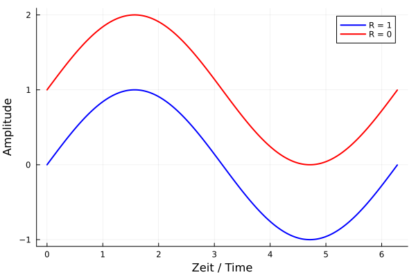

## Fatigue and Wear
Prof. Dr.-Ing. Christian Willberg
University of Applied Sciences Magdeburg-Stendal

Contact: christian.willberg@h2.de  
Parts of this script are adapted from Prof. Dr.-Ing. Jürgen Häberle  

 
  <a href="https://doi.org/10.1007/s42102-021-00079-6" style="color: blue;">Image reference</a>

---

<!--paginate: true-->

---

# Fatigue

What is Fatigue?

---

- Typically occurs under cyclic loading
  - Isothermal mechanical fatigue
    - [Oscillating load](https://www.youtube.com/watch?v=_qVXkAWtH60)
    - Aircraft fuselages (pressure buildup and release)
  - Thermal fatigue
    - Ovens, heating elements
  - Thermomechanical fatigue
    - High-pressure containers
  - Electrothermal fatigue
    - Current conductors (filaments)

---

---

## Fatigue
- Load is below the yield strength $R_{p0,2}$
  - > _Reminder: What does $R_{p0,2}$ mean?_
- Stress concentrations occur at material defects (pores, microcracks) or in the crystal (dislocations, defects)
- Initially, random local areas of plastic deformation form under alternating load
- These points represent stress concentration areas that increase over time and can lead to fracture

[Explanation video](https://www.youtube.com/watch?v=o-6V_JoRX1g)

---

---
## Stress Ratio
$R = \frac{\sigma_l}{\sigma_u}$
## Mean Stress
$\sigma_m=\frac{\sigma_l+\sigma_u}{2}$

$\sigma_u$ - Upper stress
$\sigma_l$ - Lower stress

---

## Endurance Limit Diagrams
- Haigh diagram and Smith diagram recommended according to DIN 50100

---

## Haigh Diagram

---

---

## Smith Diagram

- Draw angle bisector
- Top and bottom (parallel lines) -> static tensile and compressive strength
- Curves are determined from Wöhler experiments with different R values

---

## Terms

- Lifetime
- Fatigue crack
- Fatigue fracture
- Low-cycle fatigue (LCF) $<10^5$ cycles 
- High-cycle fatigue (HCF) $10^4<10^6$ cycles 
- Very high-cycle fatigue (VHCF) $>10^6$ cycles 

---

## Countermeasures

- Reduce notch effect
- Material adaptation
- Adjust design so that local stress does not exceed allowable limits
- Regular inspections

---

# Wear

---

- Permanent shape and material changes on the surface of solid bodies due to friction
- Not intended technologically and can represent or result in functional failure
- Influenced by
  - Friction pair combination
  - Condition of boundary layers and intermediate substances
  - Type of movement
  - Magnitude of load 

---

- **Adhesive Wear**
- **Abrasive Wear**
- **Surface Fatigue**
- **Triboxidation**

---

## Adhesive Wear
 - Adhesive wear occurs with insufficient lubrication
 - High surface pressure causes surfaces to stick together
 - When sliding occurs, boundary layer particles transfer
 - Results in holes and flaky material particles, often adhering to the sliding surface of the harder counterpart

---

---

## Abrasive Wear

- Hard particles in a lubricant or roughness peaks of a friction partner penetrate the boundary layer
  -> results in scratching and micro-cutting
  - Groove wear or erosion wear 

- Correct choice of material pairing; metal-plastic or metal-ceramic pairings

---

Example Wind Energy:
- Sand in the wind "grinds" down the surface
- Efficiency decreases

---

## Surface Fatigue

- Alternating or swelling mechanical stresses on the surface
- Fatigue or creep of the material on the surface

---

## Triboxidation
- Triboxidation (fit corrosion) on a steel shaft
- Formation of intermediate layers, e.g., oxide layers, due to chemical reaction and their mechanical destruction due to movement of parts
- Almost always occurs together with adhesive wear

---

| Type of Wear               | Appearance                                                        | Primary Occurrence                                          |
|----------------------------|-------------------------------------------------------------------|-------------------------------------------------------------|
| Sliding Wear               | Grooves or scratches due to abrasion, material transfer, or local melting | Non-lubricated bearings, clutches, brakes                   |
| Rolling Wear               | Flaking due to fatigue cracks                                      | Wheel/rail, rolling bearings                                |
| Pitting                    | Formation of pits: pitting                                        | Rolling elements, especially gears                          |
| Abrasive Wear              | Plastic deformation, erosion                                      | Excavators, bulk material transport, particle impact        |
| Cavitation                 | Surface damage due to impact of vapor bubbles                     | Water turbines, pumps                                       |
| Triboxidation (Friction Corrosion) | Loose oxidation product                                | Machine elements with form or force-locked connections      |

---

## Sliding Wear

- Influenced [by](https://download.basf.com/p1/8a8081c57fd4b609017fd66047f138c3/de/Reibung_und_Verschlei%25C3%259F%250Abei_Polymerwerkstoffen)
  - Mean roughness depth $R_z$
  - Contact pressure
  - Wear path ratio $W=k\frac{F_N}{A}10^6$
  - $k$ in $\left[\frac{mm^3}{Nm}\right]$ specific wear coefficient (load-independent)

---

## Rolling Wear
- [Rolling](https://link.springer.com/chapter/10.1007/978-3-658-17851-2_6) is a type of stress in which sliding components (slip) superimpose the pure rolling process
- Small contact area; high surface pressure
- Surface fatigue (plastic deformation, structural changes, etc.)
- Significantly reducible through lubrication $\rightarrow$ specific lubricant film thickness $\lambda$

---

## Cavitation

[Video](https://www.youtube.com/watch?v=J0H0Nw44oA4)

Physical Cause?

- Static pressure depends on the speed of a fluid
- When the vapor pressure is undercut, vapor bubbles form
- These bubbles move into areas with higher pressure and condense abruptly
- Pressure and temperature peaks occur

---

- Local stress on the surface
- These areas fatigue and flake off
- Impacts the surface
  - Efficiency reduction
  - Corrosion
  - Areas where cracks can initiate

---

## Friction Corrosion

- Sliding movements between two highly loaded components
- Often occurs when there is insufficient clearance $\rightarrow$ fits

