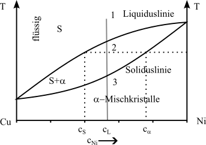

## Materials Science Lecture - Alloy formation - Phase Diagrams
Prof. Dr.-Ing. Christian Willberg 

Contact: christian.willberg@h2.de

---

<!--paginate: true-->

# Learning Objectives

- Read and interpret phase diagrams
- Identify phases and phase boundaries
- Apply the lever rule
- Recognize eutectic and peritectic reactions
- Apply Gibbs' phase rule
- Draw practical conclusions for alloys

---

# Phase Diagrams

- represents the state of alloys and material mixtures as a function of chemical composition, temperature, and possibly pressure
- state refers to the occurring phases (all solid, liquid, gaseous)

---

## Caution!

Phase diagrams are equilibrium diagrams.
They are only valid for very slow
cooling from the molten state down to
room temperature, where equilibrium between
the phases (at or between phase boundary lines) can be established.

**In practice:** Fast cooling can lead to completely different microstructures!

---

## Why are Phase Diagrams Important?

**Practical significance:**
- Prediction of microstructures
- Optimization of heat treatments
- Selection of suitable alloy compositions
- Avoidance of undesired phases
- Cost optimization through targeted alloy use

---

---

## How to Read a Phase Diagram?

**Axes:**
- X-axis: Concentration (usually in wt.-% or at.-%)
- Y-axis: Temperature in °C or K

**Lines:**
- Liquidus line: Start of solidification
- Solidus line: End of solidification
- Solvus lines: Solubility limits in solid state

**Regions:**
- Phase fields show which phase(s) are present

---

## Solubilities

**Insoluble**

- too large differences in atomic diameters (>15%)
- Crystal lattices differ from each other
- Components are chemically very different
- Electrons differ strongly

**Soluble**
- hardly any differences in atomic diameters (<15%)
- Crystal lattices are identical
- Components are chemically very close
- Electronegativity similar

---

---

## Hume-Rothery Rules for Complete Solubility

**All 4 conditions must be met:**

1. **Atomic radius:** Difference < 15%
2. **Crystal structure:** Same lattice structure
3. **Electronegativity:** Similar values (otherwise intermetallic compound)
4. **Valence:** Same valence preferred

Example: Cu-Ni meets all conditions ✓

---

## Example from Personal Experience
- Oil film on water is not soluble and separation occurs due to different density
- Salt / sugar crystals in water are completely dissolved and no longer visible

**Transfer to metals:**
- Insoluble → Crystal mixture (mechanical mixture)
- Soluble → Solid solution (homogeneous solution)

---

## Example of Insolubility

---

## Iron-Lead System: Properties

**Why insoluble?**
- Atomic radius: Fe = 1.26 Å, Pb = 1.75 Å (difference 39%)
- Crystal structure: Fe = bcc, Pb = fcc
- Melting points: Fe = 1538°C, Pb = 327°C

**Consequence:**
- No solid solution formation
- Practically no mutual solubility
- Two separate liquid phases

---

## Example of Complete Solubility

---

## Copper-Nickel System: Properties

**Why completely soluble?**
- Atomic radius: Cu = 1.28 Å, Ni = 1.24 Å (difference 3%)
- Crystal structure: both fcc
- Electronegativity similar
- Chemically similar (neighbors in periodic table)

**Properties:**
- Higher strength than pure Cu
- Good corrosion resistance
- Application: Coins, shipbuilding

---

---

## Important Terms

**Components:** The pure elements A and B
**Phase:** Homogeneous region with same physical properties
**Solid solution:** Solid solution of B in A (or vice versa)
**Melt:** Liquid phase (usually completely miscible)
**Eutectic:** Point of lowest melting temperature
**Concentration:** Fraction of a component (in wt.-% or at.-%)

---

## Lever Rule

- At point 2, the melt has a lower nickel content than the α-solid solution
- This means the concentration in the solid solution must increase so that the number of nickel atoms remains constant
- Melt and solid solution do not need to have the same chemical composition

---

## Lever Rule - Derivation

**Mass balance:**
Total mass remains constant: $m_{tot} = m_S + m_\alpha$

**Material balance:**
Total concentration remains constant: $c_L \cdot m_{tot} = c_S \cdot m_S + c_\alpha \cdot m_\alpha$

**Transformation leads to:**

$\frac{m_S}{m_{\alpha}}=\frac{c_{\alpha}-c_{L}}{c_{L}-c_{S}}$

---

## Lever Rule - Application

**Rule:**
- The mass of a phase is inversely proportional to the distance from the alloy concentration

**Mnemonic:**
- Place a "lever" at the isotherm line
- The lever mass is at the alloy concentration $c_L$
- The longer lever section belongs to the smaller mass

**Important:** Always pay attention to the total concentration!

---

## Calculation Example

→ Assumption concentrations at point 2

$c_S=20\%$, $c_{\alpha}=40\%$, $c_L=25\%$

---

## Solution

$\frac{m_S}{m_{\alpha}}=\frac{c_{\alpha}-c_{L}}{c_{L}-c_{S}}=\frac{40\%-25\%}{25\%-20\%}=\frac{15}{5}=\frac{3}{1}$

- at point 2, there is 3 times as much melt as solid solution

**Plausibility check:**
- $c_L = 25\%$ is closer to $c_S = 20\%$ than to $c_\alpha = 40\%$
- Therefore more melt → ✓

---

## Exercise: Lever Rule

A Cu-Ni alloy with 60 wt.-% Ni is at 1300°C in the two-phase region.

**Values read from diagram:**
- $c_S = 52\%$ Ni (liquidus line)
- $c_\alpha = 68\%$ Ni (solidus line)
- $c_L = 60\%$ Ni (alloy concentration)

**Question:** What are the mass fractions of melt and α-solid solution?

---

## Solution: Lever Rule Exercise

$\frac{m_S}{m_{\alpha}}=\frac{c_{\alpha}-c_{L}}{c_{L}-c_{S}}=\frac{68\%-60\%}{60\%-52\%}=\frac{8}{8}=\frac{1}{1}$

**Fractions:**
- Fraction melt: $\frac{m_S}{m_{tot}}=\frac{c_{\alpha}-c_{L}}{c_{\alpha}-c_{S}}=\frac{8}{16}=0.5 = 50\%$
- Fraction α-SS: $\frac{m_{\alpha}}{m_{tot}}=\frac{c_{L}-c_{S}}{c_{\alpha}-c_{S}}=\frac{8}{16}=0.5 = 50\%$

**Interpretation:** At this temperature, the alloy exists in equal parts as melt and solid solution.

---

## Complete Solubility in Liquid and Partial Solubility in Solid State

- Metal melts of elements A and B dissolve in any mixing ratio (concentrations)
- The solid solutions only form to a certain extent

**Important:** This is the most common case in practice!

---

## When Does This Occur?

- Atomic diameters differ from each other (but < 30%)
- Crystal lattices of components differ
- Components are chemically different

The components are neither very similar nor very different

The following phase diagrams can appear:
- Eutectic (most common case)
- Peritectic (rarer)

---

---

## Gibbs' Phase Rule

$F = n - P + 2$
(for gases and liquids)
F = number of degrees of freedom; n = number of components; P = number of phases

at constant pressure (solid substances)

$F = n - P + 1$

This results for the application of these laws to the cooling and heating curve for metallic systems

F = 0 → a halt point and
F = 1 → a kink point.

---

## Gibbs' Phase Rule - Examples

**Example 1: Pure metal during melting**
- n = 1 (one component), P = 2 (solid + liquid)
- F = 1 - 2 + 1 = 0 → Halt point at constant temperature

**Example 2: Cu-Ni alloy in two-phase region**
- n = 2 (Cu and Ni), P = 2 (α + melt)
- F = 2 - 2 + 1 = 1 → One degree of freedom (T or c changeable)

**Example 3: Single-phase region (only α)**
- n = 2, P = 1
- F = 2 - 1 + 1 = 2 → Two degrees of freedom (T and c freely selectable)

---

# Summary

- The phases or phase boundary lines can be represented as a phase diagram
- The number of phases in equilibrium with each other is lawfully linked with the number of components involved in alloy formation and the number of degrees of freedom via Gibbs' phase rule
- A degree of freedom includes the possible change of state variables without changing the equilibrium, i.e., the number of phases (movement in T or concentration)
- The number of freely selectable state variables is determined according to the phase rule

---

## Note

- Solubility gap usually known as miscibility gap
- α is an A-rich crystal
- β is a B-rich crystal

- Diameter eventually so large that the solubility gap extends into the melt region
→ Eutectic

- Components are **soluble** in liquid state
- Components are **partially soluble** in solid state

---

## Eutectic Reaction

- at one concentration, A and B crystals solidify from the melt S at constant temperature (eutectic) into a fine-crystalline crystal mixture (eutectic)
- eutectic microstructure often has a layered or lamellar structure
- alloys of other concentrations precipitate the predominant component (A or B crystals) before reaching the eutectic (halt point during eutectic reaction), so that the concentration of the remaining melt approaches the eutectic composition
- the **eutectic line** forms the solidus line of the entire system

---

## Eutectic Reaction - Formula

**Reaction equation:**
Melt → α-solid solution + β-solid solution

$S_E \rightarrow \alpha_E + \beta_E$

**Characteristics:**
- Constant temperature (halt point)
- Constant composition (eutectic point)
- Simultaneous formation of two phases
- Fine, lamellar microstructure

**Advantage:** Lowest melting temperature in system → casting alloys

---

## Cooling Curves in Eutectic Systems

**Alloy left of eutectic point:**
1. Primary crystallization of α-SS (kink)
2. Eutectic reaction (halt point)

**Eutectic alloy:**
1. Only eutectic reaction (halt point)

**Alloy right of eutectic point:**
1. Primary crystallization of β-SS (kink)
2. Eutectic reaction (halt point)

---

## Eutectic Unmixing

---

## Classical Eutectic Systems

**Lead-Tin (Pb-Sn):**
- Eutectic at 61.9% Sn and 183°C
- Application: Soft solders

**Silver-Copper (Ag-Cu):**
- Eutectic at 71.9% Ag and 779°C
- Application: Hard solders

**Aluminum-Silicon (Al-Si):**
- Eutectic at 12.6% Si and 577°C
- Application: Cast alloys (e.g., engine blocks)

---

## Microstructure of Hypoeutectic Alloys

**Hypoeutectic alloy** (< eutectic concentration):

1. **Primary crystallization:** α-solid solutions precipitate (coarse-grained)
2. **Eutectic solidification:** Remaining melt solidifies eutectically (fine-grained)

**Result:**
- Large α-primary crystals
- Surrounded by eutectic microstructure (α + β lamellar)
- Microstructure: "Primary-α in eutectic matrix"

---

## Microstructure of Hypereutectic Alloys

**Hypereutectic alloy** (> eutectic concentration):

1. **Primary crystallization:** β-solid solutions precipitate (coarse-grained)
2. **Eutectic solidification:** Remaining melt solidifies eutectically (fine-grained)

**Result:**
- Large β-primary crystals
- Surrounded by eutectic microstructure (α + β lamellar)
- Microstructure: "Primary-β in eutectic matrix"

---

_Solubility or saturation lines_
- Lines that separate the single-phase regions (α, β) from the region of crystal mixtures of solid solutions (α+β)
- **Important:** Solubility usually decreases with decreasing temperature!

Special case:
- a system of solid solutions forms interstitial solid solutions
- The concentration axis then ends with the concentration of saturation of component B in the lattice of component A
- The single-phase region of component B cannot exist then

---

## Precipitation Hardening

**Principle:**
1. Solution at high temperature (single-phase region)
2. Quenching (supersaturated solution)
3. Aging at medium temperature
4. Fine precipitations → strength increase

**Example:** Aluminum-copper alloys (duralumin)

**Prerequisite:** Decreasing solubility with decreasing temperature!

---

## Systems with Peritectic (with Peritectic Unmixing)

- widely separated melting/solidification temperatures of the involved components are characteristic
- Upon cooling from the melt, a solid solution α forms
- forms at constant temperature (according to the **peritectic line**) reacting with the melt a second solid solution type β
- in a peritectic reaction, new β-solid solutions form from the melt and already precipitated α-solid solutions at constant temperature

---

## Peritectic Reaction - Formula

**Reaction equation:**
Melt + α-solid solution → β-solid solution

$S + \alpha \rightarrow \beta$

**Characteristics:**
- Constant temperature (halt point)
- Reaction between solid and liquid phase
- Formation of a new solid phase
- α-crystals are "enveloped"

**Problem:** Reaction often incomplete with fast cooling → segregations

---

---

---

## Example: Iron-Carbon (simplified)

**Peritectic reaction at 1493°C:**
- δ-ferrite + melt → γ-austenite
- Important for steelmaking
- Complete with slow cooling
- With fast cooling: segregations possible

**Other examples:**
- Silver-platinum
- Copper-zinc (above 36% Zn)

---

## Comparison: Eutectic vs. Peritectic

| Feature | Eutectic | Peritectic |
|---------|----------|------------|
| Reaction | S → α + β | S + α → β |
| Temperature | Minimum | Local maximum |
| Microstructure | Lamellar | α-residues in β |
| Frequency | Common | Rare |
| Castability | Very good | Problematic |

---

# Comprehension Questions

1. Why are phase diagrams equilibrium diagrams?
2. What does a degree of freedom mean?
3. Why is the eutectic temperature a minimum?
4. What advantages do eutectic alloys have in casting?
5. What is the difference between solid solution and crystal mixture?

---

## Answers to Comprehension Questions

1. **Equilibrium:** Requires very slow cooling for diffusion
2. **Degree of freedom:** Number of freely selectable state variables without change in number of phases
3. **Eutectic minimum:** Mutual disruption of crystallization lowers melting point
4. **Casting advantages:** Lowest melting temperature, good mold filling, thin-flowing
5. **SS vs. CM:** SS = homogeneous atomic solution, CM = mechanical mixture

---

# Summary

**Key points:**
- Phase diagrams show phases as a function of T and c
- Gibbs' phase rule: F = n - P + 1
- Lever rule for calculating mass fractions
- Eutectic: S → α + β (minimum)
- Peritectic: S + α → β (rare)
- Solubility usually decreases with T → hardening possible
- Practical significance for alloy selection and heat treatment

---

# Questions

---

## Outlook: Next Lecture

**Iron-Carbon Diagram**
- The most important phase diagram for engineers
- Basis for steel and cast iron
- Understanding heat treatments
- Microstructure and properties

---

## References

Rainer Schwab: Werkstoffkunde und Werkstoffprüfung für Dummies, 2019; ISBN-10 352771538X
[Fundamentals of Metallurgy](https://wiki.arnold-horsch.de/index.php/Grundlagen_der_Metallkunde)